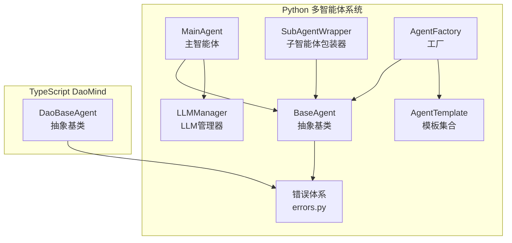
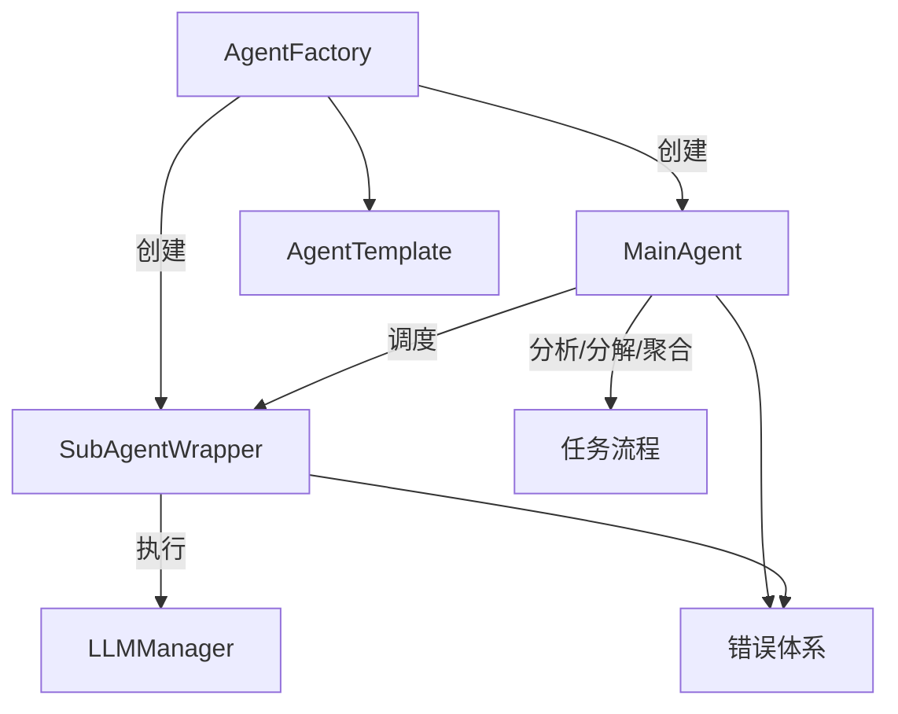
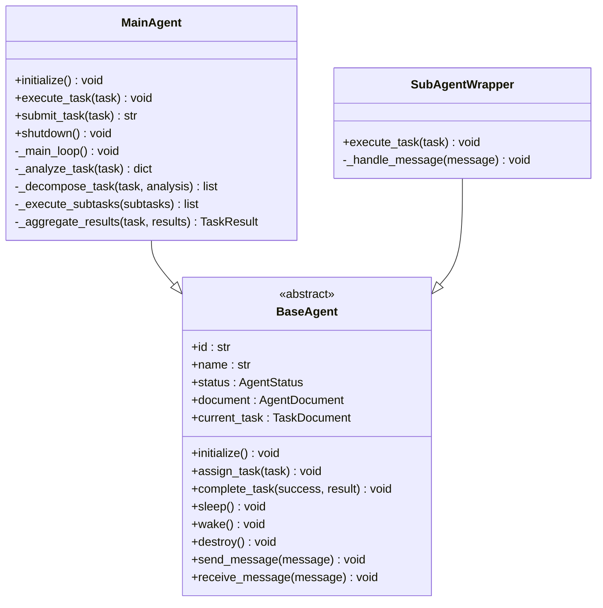
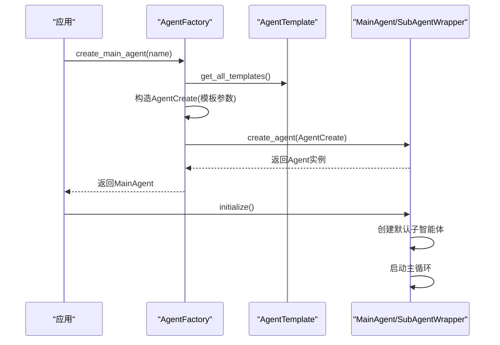
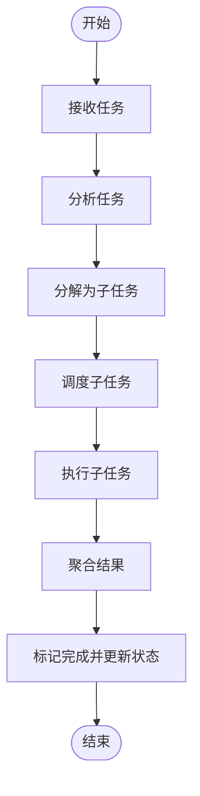
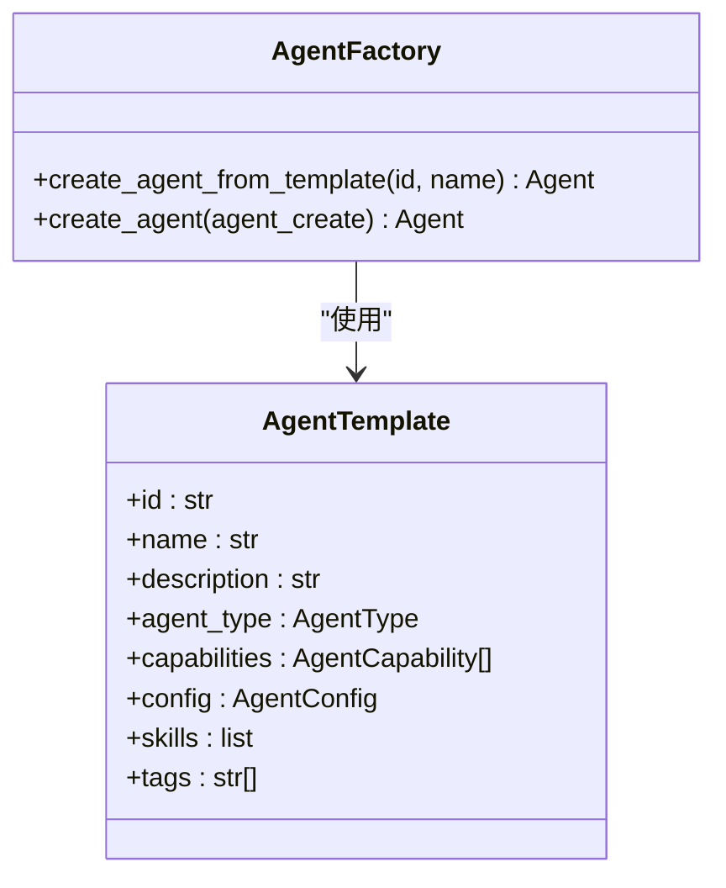
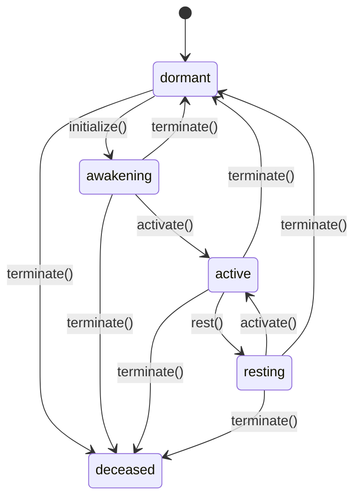
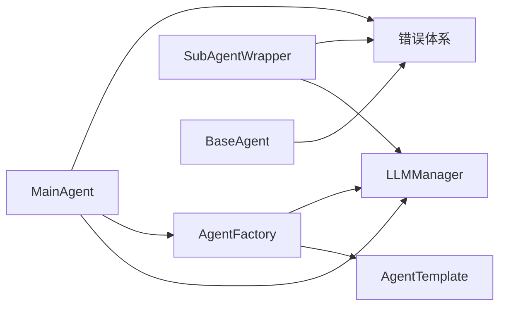

# Agent管理

<cite>
**本文档引用的文件**
- [base.py](file://tools/flexloop/src/taolib/testing/multi_agent/agents/base.py)
- [main_agent.py](file://tools/flexloop/src/taolib/testing/multi_agent/agents/main_agent.py)
- [factory.py](file://tools/flexloop/src/taolib/testing/multi_agent/agents/factory.py)
- [templates.py](file://tools/flexloop/src/taolib/testing/multi_agent/agents/templates.py)
- [errors.py](file://tools/flexloop/src/taolib/testing/multi_agent/errors.py)
- [multi_agent_example.py](file://tools/flexloop/examples/multi_agent_example.py)
- [__init__.py](file://tools/flexloop/src/taolib/testing/multi_agent/__init__.py)
- [base.ts](file://apps/DaoMind/packages/daoAgents/src/base.ts)
</cite>

## 目录
1. [简介](#简介)
2. [项目结构](#项目结构)
3. [核心组件](#核心组件)
4. [架构总览](#架构总览)
5. [详细组件分析](#详细组件分析)
6. [依赖分析](#依赖分析)
7. [性能考虑](#性能考虑)
8. [故障排查指南](#故障排查指南)
9. [结论](#结论)
10. [附录](#附录)

## 简介
本文件面向Agent管理系统，围绕多智能体架构进行系统化技术说明，重点覆盖：
- BaseAgent 抽象类的设计与继承关系
- Agent 工厂模式的实现、实例化与生命周期控制
- 主Agent（MainAgent）的任务协调、状态管理与资源调度
- Agent 模板系统（预设配置、行为模式与技能组合）
- Agent 创建与配置示例（类型、属性与行为定义）
- Agent 状态转换、错误处理与性能优化策略

该系统同时包含Python与TypeScript两种实现形态，分别对应不同应用场景与抽象层次。

## 项目结构
本仓库包含两类Agent实现：
- Python 多智能体系统（flexloop）：提供完整的BaseAgent、MainAgent、工厂与模板体系，并支持LLM管理与任务编排。
- TypeScript DaoMind Agent（daoAgents）：提供基础Agent抽象与状态机，便于在前端或Node环境中集成。

**图示来源**
- [base.py:21-204](file://tools/flexloop/src/taolib/testing/multi_agent/agents/base.py#L21-L204)
- [main_agent.py:104-472](file://tools/flexloop/src/taolib/testing/multi_agent/agents/main_agent.py#L104-L472)
- [factory.py:27-204](file://tools/flexloop/src/taolib/testing/multi_agent/agents/factory.py#L27-L204)
- [templates.py:14-309](file://tools/flexloop/src/taolib/testing/multi_agent/agents/templates.py#L14-L309)
- [errors.py:7-107](file://tools/flexloop/src/taolib/testing/multi_agent/errors.py#L7-L107)
- [base.ts:11-59](file://apps/DaoMind/packages/daoAgents/src/base.ts#L11-L59)

**章节来源**
- [__init__.py:1-181](file://tools/flexloop/src/taolib/testing/multi_agent/__init__.py#L1-L181)

## 核心组件
- BaseAgent（Python）：定义智能体的统一接口与状态管理，提供任务分配、消息收发、生命周期钩子等能力。
- MainAgent（Python）：主控智能体，负责任务分析、子任务分解、子智能体调度与结果聚合。
- SubAgentWrapper（Python）：子智能体包装器，封装具体执行逻辑（如LLM调用）。
- AgentFactory（Python）：工厂类，支持从模板或自定义配置创建智能体，管理模板注册与LLM管理器注入。
- AgentTemplate（Python）：预设模板集合，提供能力、配置、系统提示词与标签等标准化参数。
- 错误体系（Python）：集中定义多智能体系统相关的异常类型，便于统一捕获与处理。
- DaoBaseAgent（TypeScript）：前端/Node环境的基础Agent抽象，提供状态机与执行接口。

**章节来源**
- [base.py:21-204](file://tools/flexloop/src/taolib/testing/multi_agent/agents/base.py#L21-L204)
- [main_agent.py:104-472](file://tools/flexloop/src/taolib/testing/multi_agent/agents/main_agent.py#L104-L472)
- [factory.py:27-204](file://tools/flexloop/src/taolib/testing/multi_agent/agents/factory.py#L27-L204)
- [templates.py:14-309](file://tools/flexloop/src/taolib/testing/multi_agent/agents/templates.py#L14-L309)
- [errors.py:7-107](file://tools/flexloop/src/taolib/testing/multi_agent/errors.py#L7-L107)
- [base.ts:11-59](file://apps/DaoMind/packages/daoAgents/src/base.ts#L11-L59)

## 架构总览
下图展示了Python多智能体系统的高层交互：工厂创建主/子智能体，主智能体负责任务编排并通过子智能体执行具体工作；模板提供标准化配置；LLM管理器提供模型服务；错误体系贯穿各层。

**图示来源**
- [factory.py:27-204](file://tools/flexloop/src/taolib/testing/multi_agent/agents/factory.py#L27-L204)
- [main_agent.py:104-472](file://tools/flexloop/src/taolib/testing/multi_agent/agents/main_agent.py#L104-L472)
- [templates.py:14-309](file://tools/flexloop/src/taolib/testing/multi_agent/agents/templates.py#L14-L309)
- [errors.py:7-107](file://tools/flexloop/src/taolib/testing/multi_agent/errors.py#L7-L107)

## 详细组件分析

### BaseAgent 抽象类与继承关系
- 设计要点
  - 统一的状态字段与任务跟踪：记录当前任务、消息队列与最后活跃时间。
  - 生命周期方法：initialize、sleep、wake、destroy，以及任务分配/完成的回调钩子。
  - 消息机制：send_message/receive_message，支持扩展消息处理逻辑。
  - 抽象方法：_handle_message、execute_task，由子类实现具体行为。
- 继承关系
  - MainAgent 继承 BaseAgent，扩展任务编排与子智能体管理。
  - SubAgentWrapper 继承 BaseAgent，封装LLM执行逻辑。

**图示来源**
- [base.py:21-204](file://tools/flexloop/src/taolib/testing/multi_agent/agents/base.py#L21-L204)
- [main_agent.py:104-472](file://tools/flexloop/src/taolib/testing/multi_agent/agents/main_agent.py#L104-L472)

**章节来源**
- [base.py:21-204](file://tools/flexloop/src/taolib/testing/multi_agent/agents/base.py#L21-L204)

### Agent 工厂模式：实例化、配置与生命周期
- 工厂职责
  - 注册Agent类型映射（MAIN → MainAgent，SUB → SubAgentWrapper）。
  - 支持从模板创建智能体：自动填充能力、配置、技能与标签。
  - 支持自定义AgentCreate参数直接创建智能体。
  - 维护模板字典与LLM管理器注入。
- 生命周期控制
  - 初始化：设置状态为空闲，创建默认子智能体，启动主循环。
  - 关闭：停止主循环，逐个销毁子智能体，最终销毁自身。
- 全局工厂
  - 提供 get/set 工厂方法，便于应用级配置与替换。

**图示来源**
- [factory.py:27-204](file://tools/flexloop/src/taolib/testing/multi_agent/agents/factory.py#L27-L204)
- [templates.py:264-309](file://tools/flexloop/src/taolib/testing/multi_agent/agents/templates.py#L264-L309)
- [main_agent.py:126-161](file://tools/flexloop/src/taolib/testing/multi_agent/agents/main_agent.py#L126-L161)

**章节来源**
- [factory.py:27-204](file://tools/flexloop/src/taolib/testing/multi_agent/agents/factory.py#L27-L204)

### 主Agent（MainAgent）：任务协调、状态管理与资源调度
- 任务协调
  - 接收任务后先“分析任务”，再“分解任务”，然后“调度子任务”，最后“聚合结果”。
  - 进度追踪：通过 TaskProgress 记录当前步骤与百分比。
- 状态管理
  - 继承 BaseAgent 的状态流转（IDLE/BUSY/SLEEPING/DESTROYED），并在任务执行前后更新。
- 资源调度
  - 简单策略：选择第一个空闲子智能体执行子任务。
  - 子智能体包装器负责实际执行（如LLM生成），并回传结果。
- 主循环
  - 轮询任务队列与已完成任务，处理异常并持续运行。

**图示来源**
- [main_agent.py:211-282](file://tools/flexloop/src/taolib/testing/multi_agent/agents/main_agent.py#L211-L282)
- [main_agent.py:355-405](file://tools/flexloop/src/taolib/testing/multi_agent/agents/main_agent.py#L355-L405)

**章节来源**
- [main_agent.py:104-472](file://tools/flexloop/src/taolib/testing/multi_agent/agents/main_agent.py#L104-L472)

### Agent 模板系统：预设配置、行为模式与技能组合
- 模板构成
  - 标识与元信息：id、name、description、tags。
  - 类型与能力：agent_type、capabilities（含置信度与标签）。
  - 配置：AgentConfig（并发数、超时、system_prompt、temperature）。
  - 技能：skills（预留扩展）。
- 内置模板
  - 代码助手、写作助手、数据分析、研究助手、通用助手等，覆盖典型场景。
- 使用方式
  - 通过 get_template 或 get_all_templates 获取模板，交由工厂创建智能体。

**图示来源**
- [templates.py:14-309](file://tools/flexloop/src/taolib/testing/multi_agent/agents/templates.py#L14-L309)
- [factory.py:165-193](file://tools/flexloop/src/taolib/testing/multi_agent/agents/factory.py#L165-L193)

**章节来源**
- [templates.py:14-309](file://tools/flexloop/src/taolib/testing/multi_agent/agents/templates.py#L14-L309)

### Agent 状态转换与生命周期（Python）
- 状态机
  - dormant → awakening → active → resting → dormant/deceased
  - 非法转换将抛出错误，确保状态一致性。
- 生命周期
  - initialize → activate → rest → terminate（deceased）
  - destroy 在存在未完成任务时会将其标记为失败并清理。

**图示来源**
- [base.py:191-204](file://tools/flexloop/src/taolib/testing/multi_agent/agents/base.py#L191-L204)
- [base.ts:3-9](file://apps/DaoMind/packages/daoAgents/src/base.ts#L3-L9)

**章节来源**
- [base.py:60-204](file://tools/flexloop/src/taolib/testing/multi_agent/agents/base.py#L60-L204)
- [base.ts:11-59](file://apps/DaoMind/packages/daoAgents/src/base.ts#L11-L59)

### Agent 创建与配置示例（Python）
- 从模板创建
  - 使用工厂的 create_agent_from_template，指定模板ID与新智能体名称。
  - 自动继承模板的能力、配置与标签。
- 自定义创建
  - 通过 AgentCreate 指定名称、描述、类型、能力与标签，灵活定制。
- 示例参考
  - 多智能体示例脚本展示了技能使用、智能体创建与主智能体启动的完整流程。

**章节来源**
- [multi_agent_example.py:80-140](file://tools/flexloop/examples/multi_agent_example.py#L80-L140)
- [factory.py:165-193](file://tools/flexloop/src/taolib/testing/multi_agent/agents/factory.py#L165-L193)

## 依赖分析
- 组件耦合
  - MainAgent 依赖 LLMManager 执行子任务；依赖 AgentTemplate 生成默认子智能体。
  - AgentFactory 依赖模板系统与 LLM 管理器，负责智能体创建与配置。
  - 错误体系被各组件广泛使用，保证异常传播与处理的一致性。
- 外部依赖
  - LLM 管理器提供模型实例注册与负载均衡（示例脚本中可见）。
  - 模型配置包含提供商、权重与URL等参数，便于多模型接入。

**图示来源**
- [factory.py:27-204](file://tools/flexloop/src/taolib/testing/multi_agent/agents/factory.py#L27-L204)
- [main_agent.py:104-472](file://tools/flexloop/src/taolib/testing/multi_agent/agents/main_agent.py#L104-L472)
- [errors.py:7-107](file://tools/flexloop/src/taolib/testing/multi_agent/errors.py#L7-L107)

**章节来源**
- [__init__.py:6-89](file://tools/flexloop/src/taolib/testing/multi_agent/__init__.py#L6-L89)

## 性能考虑
- 任务并发与调度
  - 子智能体包装器中对并发执行与超时进行限制（模板配置），避免资源争用。
  - 主循环采用短周期轮询与异常隔离，降低阻塞风险。
- LLM 调用优化
  - 使用系统提示词与温度参数控制输出稳定性与可控性。
  - 负载均衡策略可在多模型间分配请求，提升吞吐量。
- 资源回收
  - 关闭流程中显式取消主循环任务并销毁子智能体，防止资源泄漏。

**章节来源**
- [templates.py:47-61](file://tools/flexloop/src/taolib/testing/multi_agent/agents/templates.py#L47-L61)
- [main_agent.py:162-172](file://tools/flexloop/src/taolib/testing/multi_agent/agents/main_agent.py#L162-L172)
- [multi_agent_example.py:142-171](file://tools/flexloop/examples/multi_agent_example.py#L142-L171)

## 故障排查指南
- 常见错误类型
  - AgentBusyError：智能体忙碌时仍尝试分配任务。
  - ModelUnavailableError：LLM不可用导致子任务执行失败。
  - TaskError：任务执行过程中出现异常。
- 排查步骤
  - 检查智能体状态是否为IDLE再提交任务。
  - 核对LLM管理器可用模型列表与配置。
  - 查看任务进度与错误详情，定位失败环节。
- 异常处理策略
  - 在子任务执行中捕获模型与通用异常，设置失败状态并记录错误。
  - 主循环中记录异常日志并继续运行，避免整体崩溃。

**章节来源**
- [errors.py:37-107](file://tools/flexloop/src/taolib/testing/multi_agent/errors.py#L37-L107)
- [main_agent.py:84-101](file://tools/flexloop/src/taolib/testing/multi_agent/agents/main_agent.py#L84-L101)

## 结论
本Agent管理系统通过清晰的抽象与分层设计，实现了从模板到实例化的完整生命周期管理，辅以主智能体的任务编排与子智能体的执行能力，形成可扩展、可配置且具备良好错误处理的多智能体框架。结合模板系统与LLM管理器，能够快速落地多种业务场景。

## 附录
- TypeScript DaoBaseAgent 状态机与执行接口
  - 提供与Python端一致的状态转换约束与执行抽象，便于在前端或Node环境中复用。

**章节来源**
- [base.ts:11-59](file://apps/DaoMind/packages/daoAgents/src/base.ts#L11-L59)