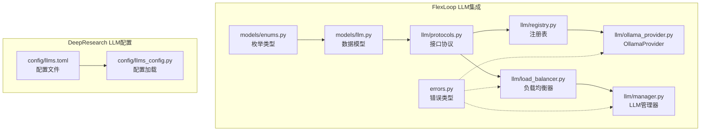
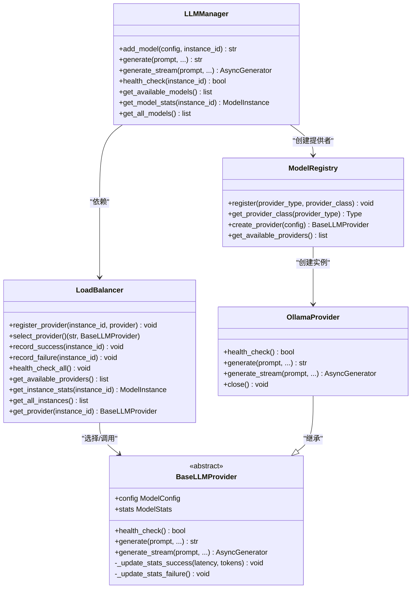
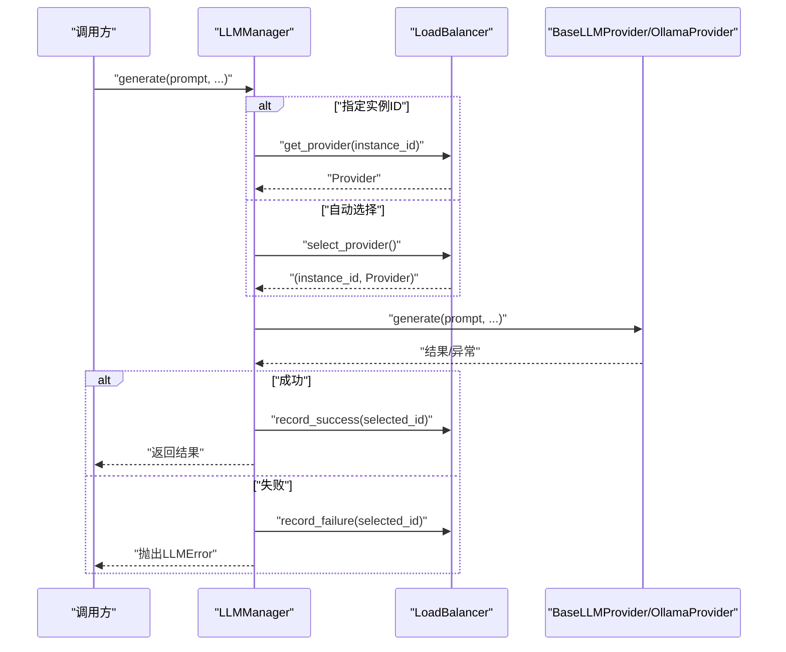
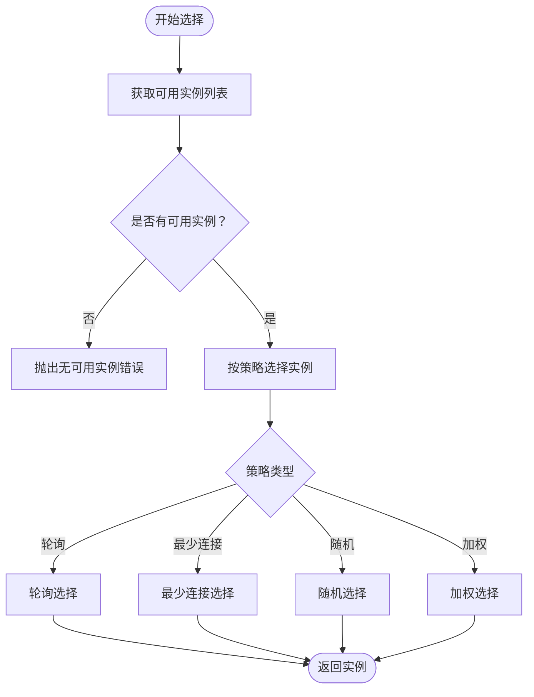
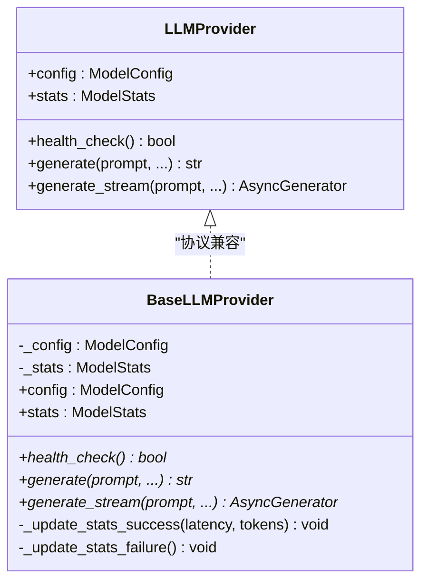
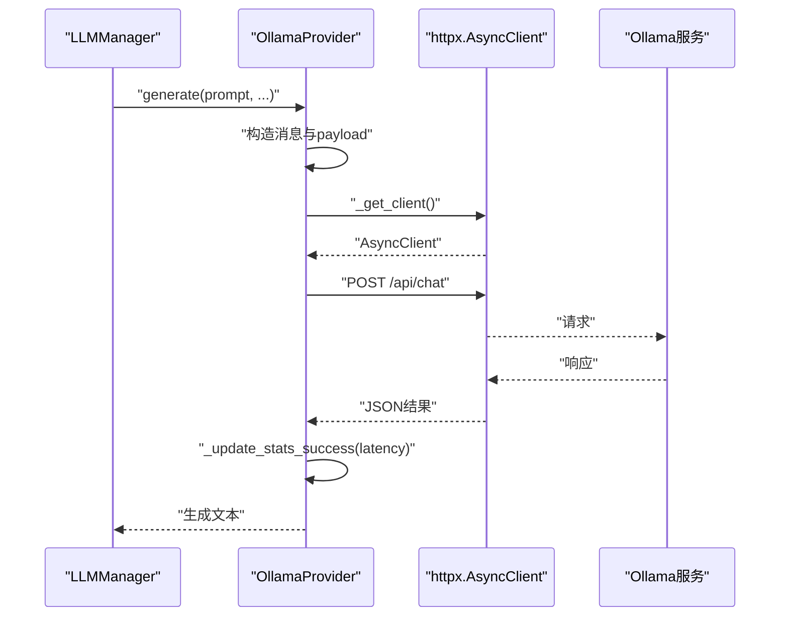
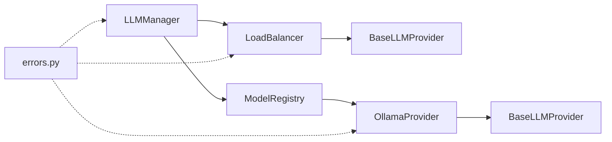

# LLM集成

<cite>
**本文引用的文件**
- [manager.py](file://tools/flexloop/src/taolib/testing/multi_agent/llm/manager.py)
- [load_balancer.py](file://tools/flexloop/src/taolib/testing/multi_agent/llm/load_balancer.py)
- [registry.py](file://tools/flexloop/src/taolib/testing/multi_agent/llm/registry.py)
- [ollama_provider.py](file://tools/flexloop/src/taolib/testing/multi_agent/llm/ollama_provider.py)
- [protocols.py](file://tools/flexloop/src/taolib/testing/multi_agent/llm/protocols.py)
- [llm.py](file://tools/flexloop/src/taolib/testing/multi_agent/models/llm.py)
- [enums.py](file://tools/flexloop/src/taolib/testing/multi_agent/models/enums.py)
- [errors.py](file://tools/flexloop/src/taolib/testing/multi_agent/errors.py)
- [llms_config.py](file://tools/DeepResearch/src/deepresearch/config/llms_config.py)
- [llms.toml](file://tools/DeepResearch/config/llms.toml)
- [test_load_balancer.py](file://tools/flexloop/tests/testing/test_multi_agent/test_load_balancer.py)
- [test_llm.py](file://tools/flexloop/tests/testing/test_multi_agent/test_llm.py)
- [multi_agent_example.py](file://tools/flexloop/examples/multi_agent_example.py)
</cite>

## 目录
1. [简介](#简介)
2. [项目结构](#项目结构)
3. [核心组件](#核心组件)
4. [架构总览](#架构总览)
5. [详细组件分析](#详细组件分析)
6. [依赖关系分析](#依赖关系分析)
7. [性能考量](#性能考量)
8. [故障排查指南](#故障排查指南)
9. [结论](#结论)
10. [附录](#附录)

## 简介
本技术文档围绕LLM集成系统展开，重点解析以下关键子系统：LLM管理器（LLMManager）、负载均衡器（LoadBalancer）、LLM提供者接口（LLMProvider/BaseLLMProvider）、LLM注册表（ModelRegistry），以及以OllamaProvider为代表的模型适配实现。文档同时给出模型发现与版本管理、配置管理、并发请求处理、响应时间优化、模型缓存策略、错误处理与成本控制等实践建议，并通过序列图与类图直观展示组件交互。

## 项目结构
该仓库包含两套LLM集成实现：
- FlexLoop多智能体系统中的轻量级LLM集成模块（Python）
- DeepResearch工具中的外部云厂商LLM配置加载（Python/TOML）

下图概览了与LLM集成直接相关的目录与文件：

图表来源
- [llm.py:1-68](file://tools/flexloop/src/taolib/testing/multi_agent/models/llm.py#L1-L68)
- [enums.py:72-96](file://tools/flexloop/src/taolib/testing/multi_agent/models/enums.py#L72-L96)
- [protocols.py:1-165](file://tools/flexloop/src/taolib/testing/multi_agent/llm/protocols.py#L1-L165)
- [registry.py:1-73](file://tools/flexloop/src/taolib/testing/multi_agent/llm/registry.py#L1-L73)
- [ollama_provider.py:1-238](file://tools/flexloop/src/taolib/testing/multi_agent/llm/ollama_provider.py#L1-L238)
- [load_balancer.py:1-246](file://tools/flexloop/src/taolib/testing/multi_agent/llm/load_balancer.py#L1-L246)
- [manager.py:1-229](file://tools/flexloop/src/taolib/testing/multi_agent/llm/manager.py#L1-L229)
- [errors.py:1-107](file://tools/flexloop/src/taolib/testing/multi_agent/errors.py#L1-L107)
- [llms.toml:1-29](file://tools/DeepResearch/config/llms.toml#L1-L29)
- [llms_config.py:1-115](file://tools/DeepResearch/src/deepresearch/config/llms_config.py#L1-L115)

章节来源
- [llm.py:1-68](file://tools/flexloop/src/taolib/testing/multi_agent/models/llm.py#L1-L68)
- [enums.py:72-96](file://tools/flexloop/src/taolib/testing/multi_agent/models/enums.py#L72-L96)
- [llms.toml:1-29](file://tools/DeepResearch/config/llms.toml#L1-L29)
- [llms_config.py:1-115](file://tools/DeepResearch/src/deepresearch/config/llms_config.py#L1-L115)

## 核心组件
- LLM管理器（LLMManager）：统一管理模型实例，封装生成与流式生成接口，提供健康检查与统计查询，并与负载均衡器协作进行实例选择与故障上报。
- 负载均衡器（LoadBalancer）：基于策略选择可用实例，支持轮询、最少连接、随机与加权；内置熔断器与健康检查，实现故障转移与降级。
- LLM提供者接口（LLMProvider/BaseLLMProvider）：定义统一的健康检查、同步与流式生成接口；具体实现由各提供商类（如OllamaProvider）完成。
- LLM注册表（ModelRegistry）：集中注册与创建提供商实例，屏蔽具体提供商差异。
- 数据模型与枚举：定义模型配置、统计、实例状态与负载均衡策略等核心数据结构。
- 错误体系：统一的LLM错误类型，便于上层捕获与处理。

章节来源
- [manager.py:22-229](file://tools/flexloop/src/taolib/testing/multi_agent/llm/manager.py#L22-L229)
- [load_balancer.py:21-246](file://tools/flexloop/src/taolib/testing/multi_agent/llm/load_balancer.py#L21-L246)
- [protocols.py:12-165](file://tools/flexloop/src/taolib/testing/multi_agent/llm/protocols.py#L12-L165)
- [registry.py:12-73](file://tools/flexloop/src/taolib/testing/multi_agent/llm/registry.py#L12-L73)
- [llm.py:14-68](file://tools/flexloop/src/taolib/testing/multi_agent/models/llm.py#L14-L68)
- [errors.py:13-28](file://tools/flexloop/src/taolib/testing/multi_agent/errors.py#L13-L28)

## 架构总览
下图展示了LLM管理器、负载均衡器、注册表与提供者之间的交互关系：

图表来源
- [manager.py:22-229](file://tools/flexloop/src/taolib/testing/multi_agent/llm/manager.py#L22-L229)
- [load_balancer.py:21-246](file://tools/flexloop/src/taolib/testing/multi_agent/llm/load_balancer.py#L21-L246)
- [registry.py:12-73](file://tools/flexloop/src/taolib/testing/multi_agent/llm/registry.py#L12-L73)
- [protocols.py:87-165](file://tools/flexloop/src/taolib/testing/multi_agent/llm/protocols.py#L87-L165)
- [ollama_provider.py:22-238](file://tools/flexloop/src/taolib/testing/multi_agent/llm/ollama_provider.py#L22-L238)

## 详细组件分析

### LLM管理器（LLMManager）
- 职责
  - 统一注册与管理模型实例（通过注册表创建具体提供商）
  - 对外暴露同步与流式生成接口，内部委托负载均衡器选择实例
  - 提供健康检查与统计查询能力
- 关键流程
  - 添加模型：根据配置创建提供商并注册到负载均衡器
  - 生成文本：若指定实例则直接调用，否则由负载均衡器按策略选择
  - 流式生成：逐片返回，聚合统计与错误处理
  - 健康检查：单实例或全量健康检查
- 性能与可靠性
  - 通过负载均衡器的熔断与健康检查避免故障实例
  - 统一统计口径，便于观测与优化

图表来源
- [manager.py:57-107](file://tools/flexloop/src/taolib/testing/multi_agent/llm/manager.py#L57-L107)
- [load_balancer.py:155-181](file://tools/flexloop/src/taolib/testing/multi_agent/llm/load_balancer.py#L155-L181)
- [errors.py:13-28](file://tools/flexloop/src/taolib/testing/multi_agent/errors.py#L13-L28)

章节来源
- [manager.py:22-229](file://tools/flexloop/src/taolib/testing/multi_agent/llm/manager.py#L22-L229)

### 负载均衡器（LoadBalancer）
- 职责
  - 维护实例注册表、状态与统计
  - 提供多种选择策略：轮询、最少连接、随机、加权
  - 熔断器：失败阈值触发熔断，超时后自动重置
  - 健康检查：定期检查实例健康状态并更新
- 选择算法
  - 轮询：顺序遍历可用实例
  - 最少连接：选择当前并发请求数最小的实例
  - 随机：均匀随机选择
  - 加权：按权重比例随机选择
- 故障转移
  - 熔断器开启期间，实例被排除在选择之外
  - 失败计数清零仅在成功回调时发生

图表来源
- [load_balancer.py:54-181](file://tools/flexloop/src/taolib/testing/multi_agent/llm/load_balancer.py#L54-L181)
- [enums.py:89-96](file://tools/flexloop/src/taolib/testing/multi_agent/models/enums.py#L89-L96)

章节来源
- [load_balancer.py:21-246](file://tools/flexloop/src/taolib/testing/multi_agent/llm/load_balancer.py#L21-L246)

### LLM提供者接口（LLMProvider/BaseLLMProvider）
- 设计要点
  - 协议接口（Protocol）与抽象基类（BaseLLMProvider）双层约束，确保实现一致性
  - 统一的健康检查、同步生成与流式生成接口
  - 内置统计更新方法，支持成功/失败两类统计
- 统一统计字段
  - 总请求数、成功/失败数、总Token数、平均延迟、当前并发、本分钟用量、最近健康检查与错误信息

图表来源
- [protocols.py:12-165](file://tools/flexloop/src/taolib/testing/multi_agent/llm/protocols.py#L12-L165)
- [llm.py:32-46](file://tools/flexloop/src/taolib/testing/multi_agent/models/llm.py#L32-L46)

章节来源
- [protocols.py:12-165](file://tools/flexloop/src/taolib/testing/multi_agent/llm/protocols.py#L12-L165)
- [llm.py:32-46](file://tools/flexloop/src/taolib/testing/multi_agent/models/llm.py#L32-L46)

### OllamaProvider（LLM提供者实现）
- 功能特性
  - 健康检查：访问本地Ollama标签端点判断可用性
  - 同步与流式生成：构造消息格式，调用Ollama聊天端点
  - 超时与连接错误：映射为特定错误类型
  - 统计更新：记录延迟、Token数与错误信息
- 连接与超时
  - 基于httpx异步客户端，按配置设置超时
- 错误处理
  - 超时：ModelTimeoutError
  - 连接失败：ModelUnavailableError
  - 其他异常：LLMError

图表来源
- [ollama_provider.py:75-151](file://tools/flexloop/src/taolib/testing/multi_agent/llm/ollama_provider.py#L75-L151)
- [errors.py:13-28](file://tools/flexloop/src/taolib/testing/multi_agent/errors.py#L13-L28)

章节来源
- [ollama_provider.py:22-238](file://tools/flexloop/src/taolib/testing/multi_agent/llm/ollama_provider.py#L22-L238)

### LLM注册表（ModelRegistry）
- 职责
  - 注册不同提供商类型与其对应实现类
  - 根据配置创建具体提供商实例
  - 提供可用提供商列表查询
- 扩展性
  - 新增提供商时只需注册映射，即可通过配置自动创建实例

章节来源
- [registry.py:12-73](file://tools/flexloop/src/taolib/testing/multi_agent/llm/registry.py#L12-L73)

### 数据模型与配置
- 模型配置（ModelConfig）
  - 包含提供商类型、模型名、基础URL、超时、重试、速率限制、并发、温度、最大Token、权重与元数据
- 统计信息（ModelStats）
  - 总请求数、成功/失败数、Token总量、平均延迟、当前并发、本分钟用量、最近健康检查与错误信息
- 实例（ModelInstance）
  - 实例ID、配置、状态、统计、创建/更新时间
- 负载均衡配置（LoadBalanceConfig）
  - 策略、降级开关、健康检查间隔、熔断器开关、失败阈值与重置超时

章节来源
- [llm.py:14-68](file://tools/flexloop/src/taolib/testing/multi_agent/models/llm.py#L14-L68)
- [enums.py:72-96](file://tools/flexloop/src/taolib/testing/multi_agent/models/enums.py#L72-L96)

### 错误处理体系
- LLMError：通用LLM错误
- ModelUnavailableError：模型不可用
- ModelTimeoutError：请求超时
- ModelRateLimitError：限流错误
- 通过统一异常类型，便于上层捕获与差异化处理

章节来源
- [errors.py:13-34](file://tools/flexloop/src/taolib/testing/multi_agent/errors.py#L13-L34)

### DeepResearch外部LLM配置（补充参考）
- llms.toml：以TOML形式存储多个场景的模型配置（基础、澄清、规划、查询生成、评估、报告）
- llms_config.py：加载与解析TOML配置，提供懒加载与脱敏输出

章节来源
- [llms.toml:1-29](file://tools/DeepResearch/config/llms.toml#L1-L29)
- [llms_config.py:46-115](file://tools/DeepResearch/src/deepresearch/config/llms_config.py#L46-L115)

## 依赖关系分析
- LLMManager依赖LoadBalancer与ModelRegistry，负责实例生命周期与对外接口
- LoadBalancer依赖BaseLLMProvider接口与ModelInstance统计，负责实例选择与健康状态
- ModelRegistry依赖枚举与模型配置，负责提供商创建
- OllamaProvider实现BaseLLMProvider，依赖httpx进行网络请求
- 错误类型贯穿管理器、负载均衡器与提供者，形成一致的异常语义

图表来源
- [manager.py:12-19](file://tools/flexloop/src/taolib/testing/multi_agent/llm/manager.py#L12-L19)
- [load_balancer.py:11-18](file://tools/flexloop/src/taolib/testing/multi_agent/llm/load_balancer.py#L11-L18)
- [registry.py:8-9](file://tools/flexloop/src/taolib/testing/multi_agent/llm/registry.py#L8-L9)
- [ollama_provider.py:18-19](file://tools/flexloop/src/taolib/testing/multi_agent/llm/ollama_provider.py#L18-L19)
- [errors.py:13-28](file://tools/flexloop/src/taolib/testing/multi_agent/errors.py#L13-L28)

章节来源
- [manager.py:12-19](file://tools/flexloop/src/taolib/testing/multi_agent/llm/manager.py#L12-L19)
- [load_balancer.py:11-18](file://tools/flexloop/src/taolib/testing/multi_agent/llm/load_balancer.py#L11-L18)
- [registry.py:8-9](file://tools/flexloop/src/taolib/testing/multi_agent/llm/registry.py#L8-L9)
- [ollama_provider.py:18-19](file://tools/flexloop/src/taolib/testing/multi_agent/llm/ollama_provider.py#L18-L19)
- [errors.py:13-28](file://tools/flexloop/src/taolib/testing/multi_agent/errors.py#L13-L28)

## 性能考量
- 选择策略
  - 轮询：简单公平，适合实例性能相近
  - 最少连接：动态分流，适合实例性能差异较大
  - 加权：按实例容量或优先级分配流量
- 并发与限流
  - 在ModelConfig中设置最大并发与速率限制，结合Provider内部统计进行节流
- 延迟与吞吐
  - 通过平均延迟与Token数统计持续优化参数（温度、最大Token）
- 缓存策略（建议）
  - 结合业务场景对冷门请求结果进行短期缓存，注意缓存键需包含参数快照
  - 对重复提示词采用去重与命中率统计，降低重复计算
- 成本控制（建议）
  - 依据Token用量与平均延迟设定告警阈值
  - 对高成本模型采用降级策略或切换至更低成本实例

## 故障排查指南
- 常见症状与定位
  - 无可用实例：检查负载均衡器可用实例列表与熔断状态
  - 超时/连接失败：检查网络连通性与Ollama服务状态
  - 生成异常：查看Provider统计中的最后错误时间与错误信息
- 排查步骤
  - 使用健康检查接口确认实例状态
  - 查看实例统计信息，关注失败率与平均延迟
  - 触发熔断器重置（等待超时后自动重置）
- 相关实现参考
  - 负载均衡器的健康检查与熔断逻辑
  - 提供者的统计更新与错误映射

章节来源
- [load_balancer.py:206-216](file://tools/flexloop/src/taolib/testing/multi_agent/llm/load_balancer.py#L206-L216)
- [ollama_provider.py:142-150](file://tools/flexloop/src/taolib/testing/multi_agent/llm/ollama_provider.py#L142-L150)
- [errors.py:13-28](file://tools/flexloop/src/taolib/testing/multi_agent/errors.py#L13-L28)

## 结论
本LLM集成系统通过清晰的接口设计与模块化架构，实现了模型实例的统一管理、灵活的负载均衡与故障转移、可扩展的提供商适配与完善的统计监控。结合测试用例与示例，用户可以快速接入本地Ollama模型并扩展至其他提供商，同时通过策略与配置优化响应时间与成本。

## 附录

### LLM集成示例（基于现有实现）
- 示例目标：展示如何配置Ollama模型、处理并发请求与优化响应时间
- 步骤
  - 创建负载均衡配置（如轮询策略）
  - 初始化LLM管理器
  - 添加模型配置（指定提供商、模型名、基础URL与权重）
  - 调用生成接口（支持同步与流式）
  - 查询可用模型与统计信息
- 参考实现位置
  - 示例脚本：[multi_agent_example.py:142-172](file://tools/flexloop/examples/multi_agent_example.py#L142-L172)
  - 测试用例：[test_load_balancer.py:51-79](file://tools/flexloop/tests/testing/test_multi_agent/test_load_balancer.py#L51-L79)、[test_llm.py:19-45](file://tools/flexloop/tests/testing/test_multi_agent/test_llm.py#L19-L45)

章节来源
- [multi_agent_example.py:142-172](file://tools/flexloop/examples/multi_agent_example.py#L142-L172)
- [test_load_balancer.py:51-79](file://tools/flexloop/tests/testing/test_multi_agent/test_load_balancer.py#L51-L79)
- [test_llm.py:19-45](file://tools/flexloop/tests/testing/test_multi_agent/test_llm.py#L19-L45)