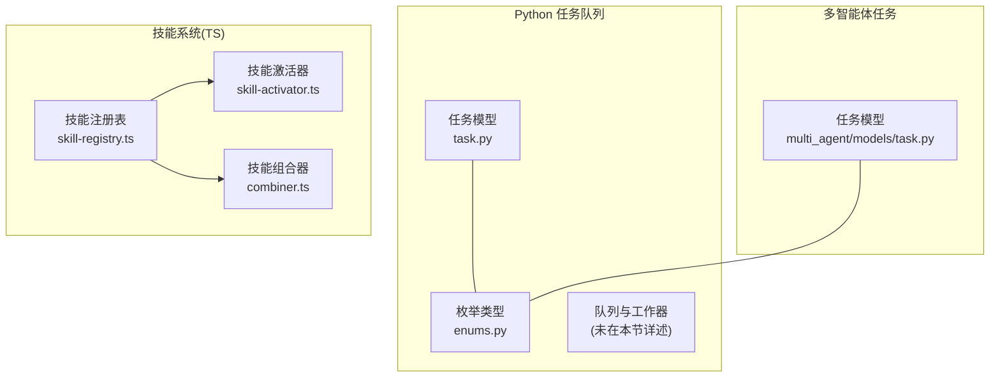
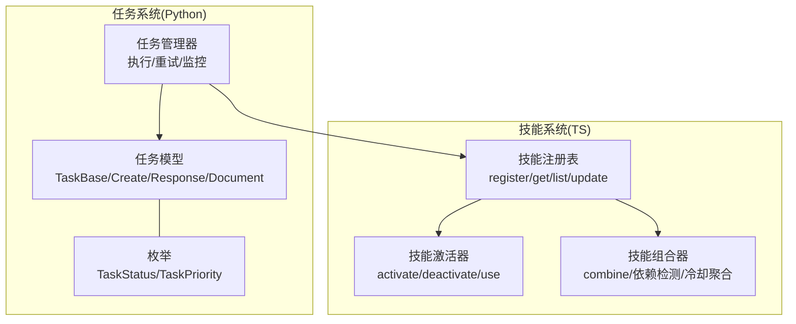
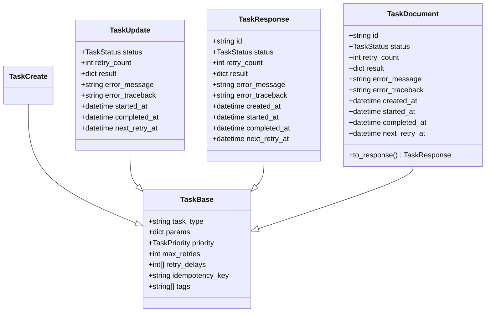
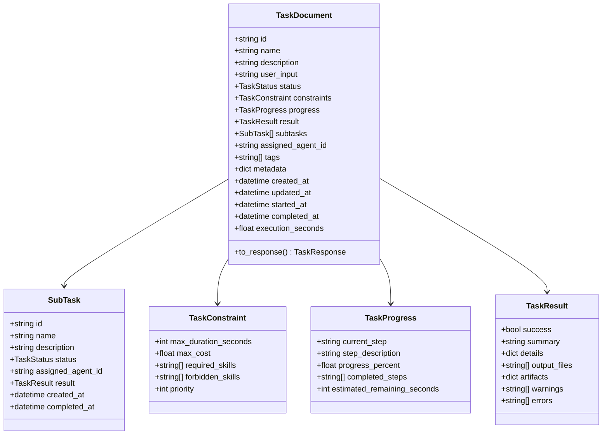
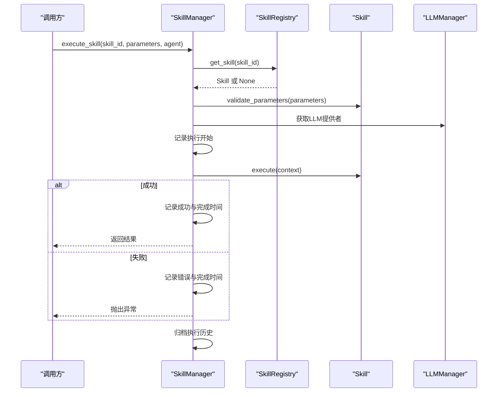
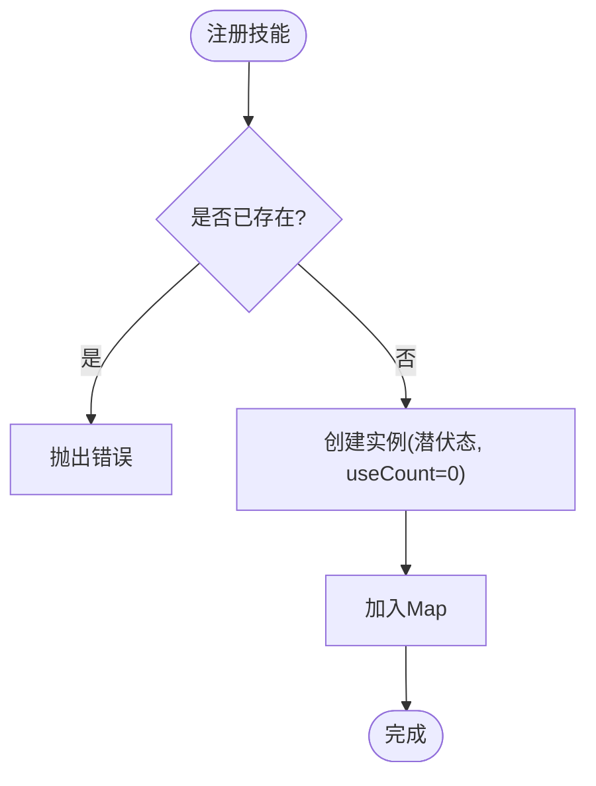
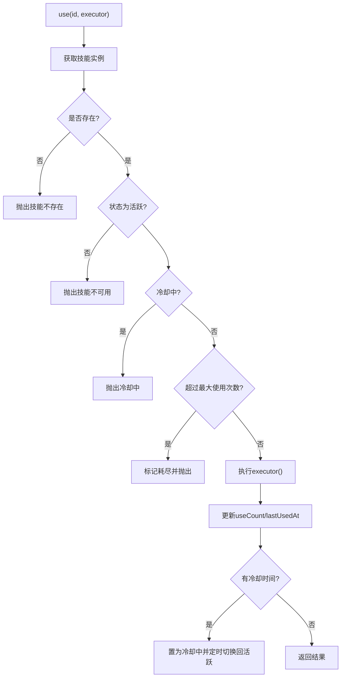
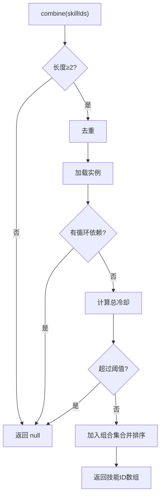
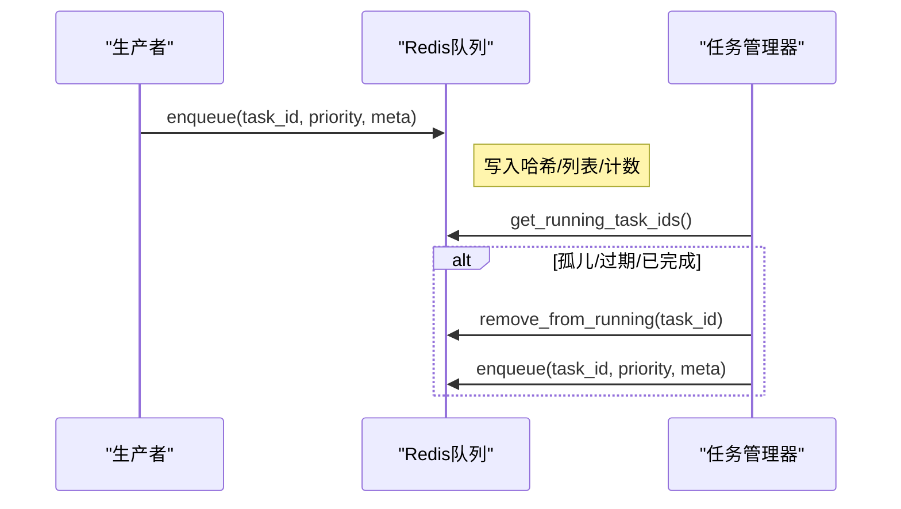
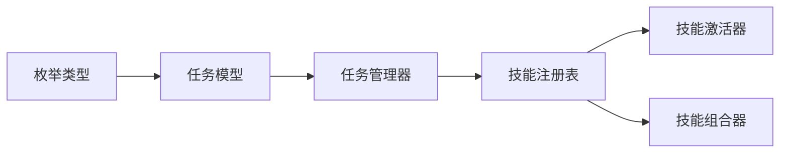

# 任务调度

<cite>
**本文引用的文件**   
- [task.py](file://tools/flexloop/src/taolib/testing/task_queue/models/task.py)
- [enums.py](file://tools/flexloop/src/taolib/testing/task_queue/models/enums.py)
- [task.py](file://tools/flexloop/src/taolib/testing/multi_agent/models/task.py)
- [registry.py](file://tools/flexloop/src/taolib/testing/multi_agent/skills/registry.py)
- [manager.py](file://tools/flexloop/src/taolib/testing/multi_agent/skills/manager.py)
- [skill-registry.ts](file://apps/DaoMind/packages/daoSkilLs/src/skill-registry.ts)
- [skill-activator.ts](file://apps/DaoMind/packages/daoSkilLs/src/skill-activator.ts)
- [combiner.ts](file://apps/DaoMind/packages/daoSkilLs/src/combiner.ts)
- [test_queue.py](file://tools/flexloop/tests/testing/test_task_queue/test_queue.py)
- [test_manager.py](file://tools/flexloop/tests/testing/test_task_queue/test_manager.py)
- [test_models.py](file://tools/flexloop/tests/testing/test_task_queue/test_models.py)
- [error-codes.md](file://skills/daoSkilLs/skills/task-execution-summary/references/error-codes.md)
</cite>

## 目录
1. [简介](#简介)
2. [项目结构](#项目结构)
3. [核心组件](#核心组件)
4. [架构总览](#架构总览)
5. [详细组件分析](#详细组件分析)
6. [依赖分析](#依赖分析)
7. [性能考虑](#性能考虑)
8. [故障排查指南](#故障排查指南)
9. [结论](#结论)
10. [附录](#附录)

## 简介
本技术文档围绕“任务调度系统”展开，聚焦以下目标：
- 任务模型设计：Task 类的数据结构、状态管理与优先级机制
- 任务枚举类型：任务状态、执行状态与错误类型的标准化
- 任务管理器：任务队列管理、调度算法与执行监控
- 技能注册表：技能发现、加载与版本管理
- 实战示例：任务创建、调度与执行，含依赖、资源与超时处理
- 负载均衡、并发控制与性能监控方案

## 项目结构
本仓库包含两套任务调度相关能力：
- Python 任务队列与多智能体任务模型：位于 tools/flexloop
- TypeScript 技能注册与激活：位于 apps/DaoMind/packages/daoSkilLs

**图表来源**
- [task.py:1-107](file://tools/flexloop/src/taolib/testing/task_queue/models/task.py#L1-L107)
- [enums.py:1-28](file://tools/flexloop/src/taolib/testing/task_queue/models/enums.py#L1-L28)
- [task.py:1-143](file://tools/flexloop/src/taolib/testing/multi_agent/models/task.py#L1-L143)
- [skill-registry.ts:1-73](file://apps/DaoMind/packages/daoSkilLs/src/skill-registry.ts#L1-L73)
- [skill-activator.ts:1-83](file://apps/DaoMind/packages/daoSkilLs/src/skill-activator.ts#L1-L83)
- [combiner.ts:1-84](file://apps/DaoMind/packages/daoSkilLs/src/combiner.ts#L1-L84)

**章节来源**
- [task.py:1-107](file://tools/flexloop/src/taolib/testing/task_queue/models/task.py#L1-L107)
- [enums.py:1-28](file://tools/flexloop/src/taolib/testing/task_queue/models/enums.py#L1-L28)
- [task.py:1-143](file://tools/flexloop/src/taolib/testing/multi_agent/models/task.py#L1-L143)
- [skill-registry.ts:1-73](file://apps/DaoMind/packages/daoSkilLs/src/skill-registry.ts#L1-L73)
- [skill-activator.ts:1-83](file://apps/DaoMind/packages/daoSkilLs/src/skill-activator.ts#L1-L83)
- [combiner.ts:1-84](file://apps/DaoMind/packages/daoSkilLs/src/combiner.ts#L1-L84)

## 核心组件
- 任务模型与枚举：定义任务字段、状态、优先级与响应/文档模型
- 任务管理器：负责任务生命周期、重试策略与执行监控
- 技能注册表与激活器：技能发现、加载、状态转换与使用约束
- 技能组合器：多技能组合并校验依赖与冷却阈值

**章节来源**
- [task.py:1-107](file://tools/flexloop/src/taolib/testing/task_queue/models/task.py#L1-L107)
- [enums.py:1-28](file://tools/flexloop/src/taolib/testing/task_queue/models/enums.py#L1-L28)
- [manager.py:1-404](file://tools/flexloop/src/taolib/testing/multi_agent/skills/manager.py#L1-L404)
- [registry.py:1-247](file://tools/flexloop/src/taolib/testing/multi_agent/skills/registry.py#L1-L247)
- [skill-registry.ts:1-73](file://apps/DaoMind/packages/daoSkilLs/src/skill-registry.ts#L1-L73)
- [skill-activator.ts:1-83](file://apps/DaoMind/packages/daoSkilLs/src/skill-activator.ts#L1-L83)
- [combiner.ts:1-84](file://apps/DaoMind/packages/daoSkilLs/src/combiner.ts#L1-L84)

## 架构总览
下图展示了任务与技能两大子系统的交互关系与职责边界。

**图表来源**
- [task.py:1-107](file://tools/flexloop/src/taolib/testing/task_queue/models/task.py#L1-L107)
- [enums.py:1-28](file://tools/flexloop/src/taolib/testing/task_queue/models/enums.py#L1-L28)
- [manager.py:1-404](file://tools/flexloop/src/taolib/testing/multi_agent/skills/manager.py#L1-L404)
- [skill-registry.ts:1-73](file://apps/DaoMind/packages/daoSkilLs/src/skill-registry.ts#L1-L73)
- [skill-activator.ts:1-83](file://apps/DaoMind/packages/daoSkilLs/src/skill-activator.ts#L1-L83)
- [combiner.ts:1-84](file://apps/DaoMind/packages/daoSkilLs/src/combiner.ts#L1-L84)

## 详细组件分析

### 任务模型与状态管理
- 数据结构分层：Base → Create/Update → Response → Document，确保输入、传输与持久化的一致性与可追踪性
- 关键字段：任务类型、参数、优先级、重试策略、幂等键、标签、时间戳与结果/错误信息
- 状态机：支持待处理、运行中、已完成、失败、重试中、已取消等状态
- 优先级：高/普通/低三级，用于队列调度与资源分配

**图表来源**
- [task.py:1-107](file://tools/flexloop/src/taolib/testing/task_queue/models/task.py#L1-L107)

**章节来源**
- [task.py:1-107](file://tools/flexloop/src/taolib/testing/task_queue/models/task.py#L1-L107)
- [enums.py:1-28](file://tools/flexloop/src/taolib/testing/task_queue/models/enums.py#L1-L28)

### 多智能体任务模型（扩展）
- 支持子任务、进度、结果、约束与元数据
- 约束包含最大时长、最大成本、所需/禁止技能、优先级等
- 便于复杂任务拆解与可观测性

**图表来源**
- [task.py:1-143](file://tools/flexloop/src/taolib/testing/multi_agent/models/task.py#L1-L143)

**章节来源**
- [task.py:1-143](file://tools/flexloop/src/taolib/testing/multi_agent/models/task.py#L1-L143)

### 任务枚举类型定义
- 任务状态：pending、running、completed、failed、retrying、cancelled
- 任务优先级：high、normal、low
- 标准化枚举确保跨模块一致的语义与序列化

**章节来源**
- [enums.py:1-28](file://tools/flexloop/src/taolib/testing/task_queue/models/enums.py#L1-L28)
- [test_models.py:16-41](file://tools/flexloop/tests/testing/test_task_queue/test_models.py#L16-L41)

### 任务管理器（调度与监控）
- 职责：注册/查询技能、执行技能、测试与评估、发现推荐技能、记录执行历史
- 执行流程：参数校验 → 构造执行上下文 → 记录开始 → 异步执行 → 成功/失败记录 → 归档历史
- 重试策略：基于任务模型的重试次数与延迟配置，结合管理器恢复逻辑

**图表来源**
- [manager.py:110-175](file://tools/flexloop/src/taolib/testing/multi_agent/skills/manager.py#L110-L175)
- [registry.py:64-84](file://tools/flexloop/src/taolib/testing/multi_agent/skills/registry.py#L64-L84)

**章节来源**
- [manager.py:1-404](file://tools/flexloop/src/taolib/testing/multi_agent/skills/manager.py#L1-L404)
- [registry.py:1-247](file://tools/flexloop/src/taolib/testing/multi_agent/skills/registry.py#L1-L247)

### 技能注册表（SkillRegistry）
- 职责：注册/注销技能、按状态筛选、查询、计数与激活时间记录
- 默认状态：新注册技能处于“潜伏态”，体现“藏器待时”
- 并发与使用统计：记录使用次数与最近使用时间

**图表来源**
- [skill-registry.ts:10-20](file://apps/DaoMind/packages/daoSkilLs/src/skill-registry.ts#L10-L20)

**章节来源**
- [skill-registry.ts:1-73](file://apps/DaoMind/packages/daoSkilLs/src/skill-registry.ts#L1-L73)

### 技能激活器（SkillActivator）
- 激活：检查依赖技能均处于“活跃态”，满足后进入“活跃态”
- 使用：校验冷却时间与最大使用次数；执行后更新使用计数与状态；冷却期间置为“冷却中”
- 取消：将技能状态回退至“潜伏态”

**图表来源**
- [skill-activator.ts:38-78](file://apps/DaoMind/packages/daoSkilLs/src/skill-activator.ts#L38-L78)

**章节来源**
- [skill-activator.ts:1-83](file://apps/DaoMind/packages/daoSkilLs/src/skill-activator.ts#L1-L83)

### 技能组合器（SkillCombiner）
- 功能：将多个技能合并为组合技能，要求无循环依赖且总冷却时间不超过阈值
- 输出：去重后的技能ID集合，并缓存组合键

**图表来源**
- [combiner.ts:18-40](file://apps/DaoMind/packages/daoSkilLs/src/combiner.ts#L18-L40)

**章节来源**
- [combiner.ts:1-84](file://apps/DaoMind/packages/daoSkilLs/src/combiner.ts#L1-L84)

### 任务队列与调度（Redis 队列）
- 入队：根据优先级写入不同列表，同时维护哈希元数据与计数
- 出队：按优先级顺序轮询，支持高/低优先级分支
- 恢复：对运行中但无对应记录的任务进行重新入队，保留原优先级

**图表来源**
- [test_queue.py:124-154](file://tools/flexloop/tests/testing/test_task_queue/test_queue.py#L124-L154)
- [test_manager.py:527-549](file://tools/flexloop/tests/testing/test_task_queue/test_manager.py#L527-L549)

**章节来源**
- [test_queue.py:124-154](file://tools/flexloop/tests/testing/test_task_queue/test_queue.py#L124-L154)
- [test_manager.py:506-582](file://tools/flexloop/tests/testing/test_task_queue/test_manager.py#L506-L582)

## 依赖分析
- 任务模型依赖枚举类型，保证状态与优先级的强一致性
- 技能系统通过注册表统一管理技能生命周期，激活器与组合器分别承担“状态转换”和“组合约束”
- 任务管理器依赖技能注册表与LLM管理器，形成“任务驱动技能”的闭环

**图表来源**
- [enums.py:1-28](file://tools/flexloop/src/taolib/testing/task_queue/models/enums.py#L1-L28)
- [task.py:1-107](file://tools/flexloop/src/taolib/testing/task_queue/models/task.py#L1-L107)
- [manager.py:1-404](file://tools/flexloop/src/taolib/testing/multi_agent/skills/manager.py#L1-L404)
- [registry.py:1-247](file://tools/flexloop/src/taolib/testing/multi_agent/skills/registry.py#L1-L247)
- [skill-activator.ts:1-83](file://apps/DaoMind/packages/daoSkilLs/src/skill-activator.ts#L1-L83)
- [combiner.ts:1-84](file://apps/DaoMind/packages/daoSkilLs/src/combiner.ts#L1-L84)

**章节来源**
- [manager.py:1-404](file://tools/flexloop/src/taolib/testing/multi_agent/skills/manager.py#L1-L404)
- [registry.py:1-247](file://tools/flexloop/src/taolib/testing/multi_agent/skills/registry.py#L1-L247)
- [skill-registry.ts:1-73](file://apps/DaoMind/packages/daoSkilLs/src/skill-registry.ts#L1-L73)

## 性能考虑
- 优先级队列：高优任务优先出队，降低尾延迟
- 冷却与配额：避免技能被过度使用，保障系统稳定性
- 重试策略：指数/线性退避，结合最大重试次数，平衡可靠性与资源占用
- 监控与日志：记录执行历史、错误与耗时，支撑可观测性与容量规划

[本节为通用指导，无需特定文件引用]

## 故障排查指南
- 错误码与状态映射：参考任务执行摘要技能的错误码文档，建立统一的错误分类与定位
- 常见问题：
  - 技能不存在/不可用：检查注册表状态与依赖是否满足
  - 冷却中/已达最大使用次数：调整使用策略或等待冷却结束
  - 任务长时间运行：检查运行中任务恢复逻辑与队列一致性
- 建议手段：启用执行历史查询、增加重试与告警、定期审计技能状态与组合有效性

**章节来源**
- [error-codes.md:1569-1594](file://skills/daoSkilLs/skills/task-execution-summary/references/error-codes.md#L1569-L1594)
- [skill-activator.ts:38-78](file://apps/DaoMind/packages/daoSkilLs/src/skill-activator.ts#L38-L78)
- [test_manager.py:506-582](file://tools/flexloop/tests/testing/test_task_queue/test_manager.py#L506-L582)

## 结论
本系统通过“任务模型 + 枚举标准化 + 任务管理器 + 技能注册/激活/组合”的分层设计，实现了任务与技能的解耦协作。任务侧强调可观察性与弹性（重试、恢复），技能侧强调生命周期与约束（状态、冷却、依赖）。配合优先级队列与监控体系，可在复杂场景下实现稳定、可扩展的任务调度。

[本节为总结，无需特定文件引用]

## 附录

### 示例：任务创建、调度与执行
- 定义任务：设置任务类型、参数、优先级、重试策略与幂等键
- 入队：按优先级写入队列，记录元数据
- 出队与执行：任务管理器拉取并执行，记录状态与结果
- 恢复与重试：对运行中但无记录的任务进行重新入队，保留原优先级

**章节来源**
- [task.py:15-107](file://tools/flexloop/src/taolib/testing/task_queue/models/task.py#L15-L107)
- [test_queue.py:124-154](file://tools/flexloop/tests/testing/test_task_queue/test_queue.py#L124-L154)
- [test_manager.py:527-549](file://tools/flexloop/tests/testing/test_task_queue/test_manager.py#L527-L549)

### 示例：技能发现、加载与使用
- 发现：基于任务描述的关键词匹配，推荐可用技能
- 加载：从文件/目录动态导入技能类并注册
- 使用：通过激活器校验依赖与冷却后执行，并更新使用计数与状态

**章节来源**
- [manager.py:286-323](file://tools/flexloop/src/taolib/testing/multi_agent/skills/manager.py#L286-L323)
- [registry.py:134-214](file://tools/flexloop/src/taolib/testing/multi_agent/skills/registry.py#L134-L214)
- [skill-activator.ts:38-78](file://apps/DaoMind/packages/daoSkilLs/src/skill-activator.ts#L38-L78)