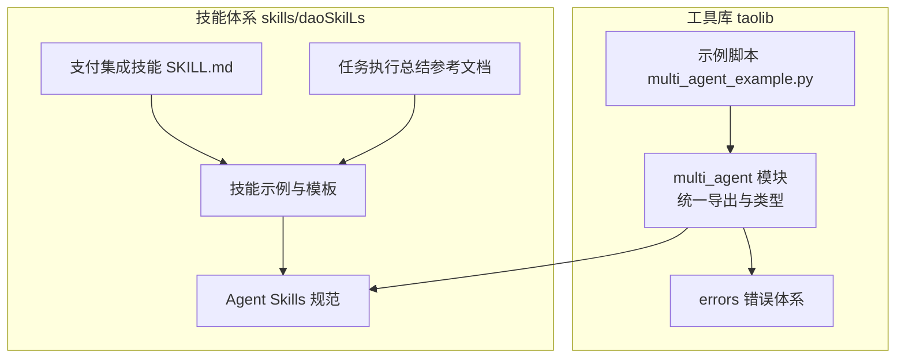
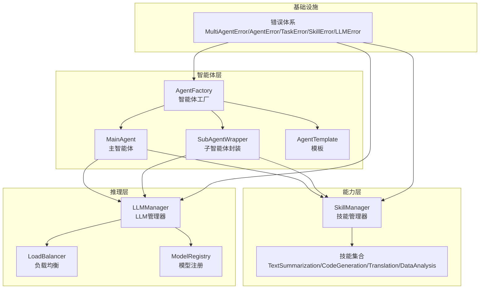
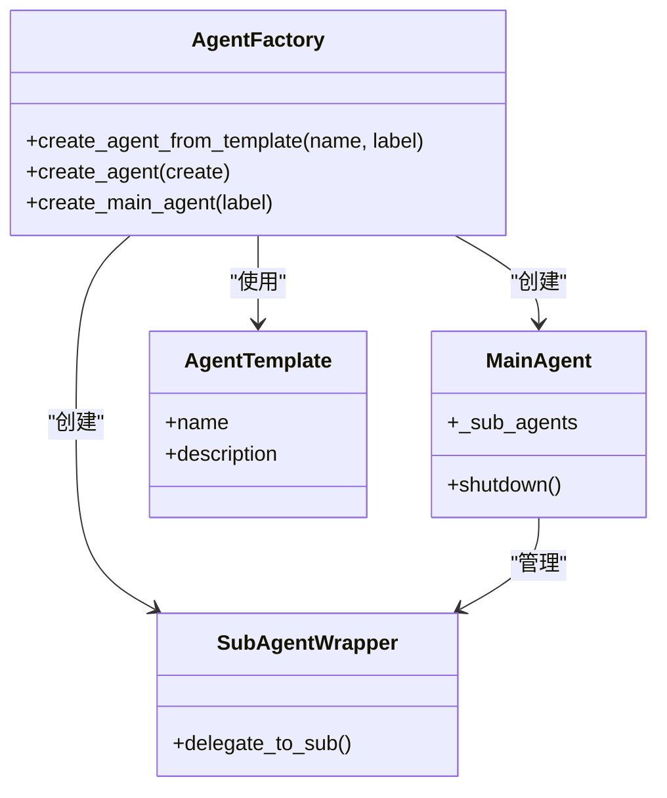
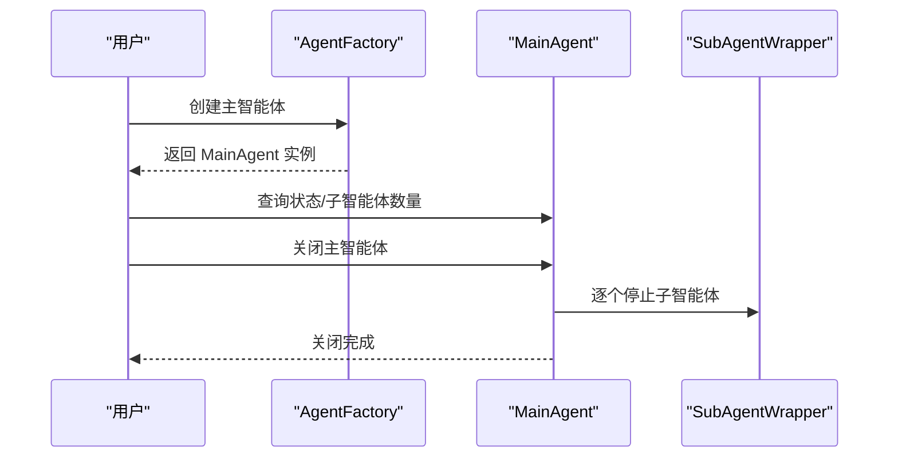
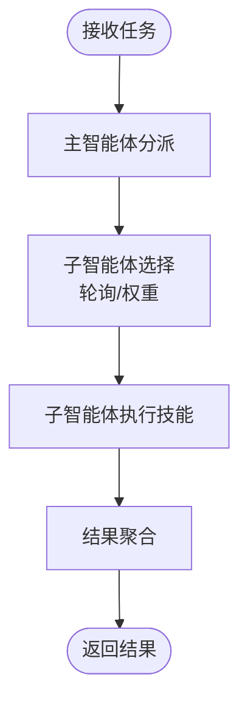
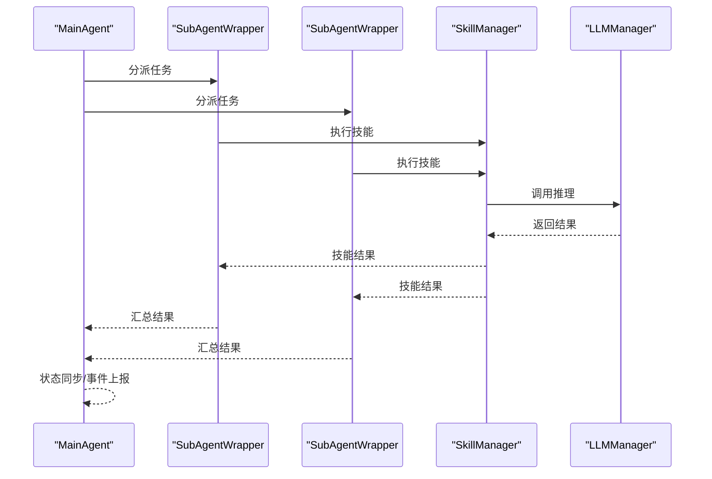
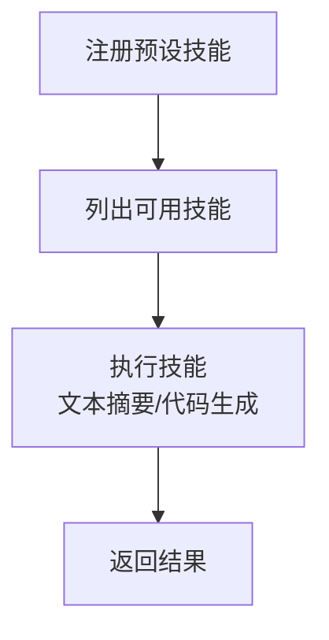
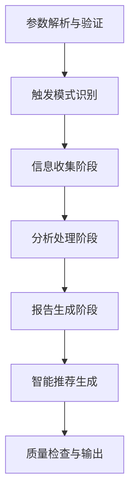
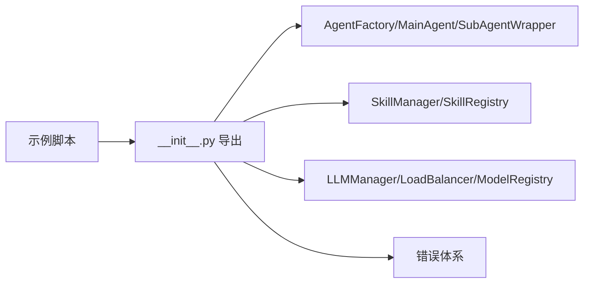

# 多智能体系统

<cite>
**本文引用的文件**
- [AGENTS.md](file://tools/flexloop/AGENTS.md)
- [multi_agent_example.py](file://tools/flexloop/examples/multi_agent_example.py)
- [__init__.py](file://tools/flexloop/src/taolib/testing/multi_agent/__init__.py)
- [errors.py](file://tools/flexloop/src/taolib/testing/multi_agent/errors.py)
- [agent-skills-spec.md](file://skills/daoSkilLs/skills/anthropics-skills/spec/agent-skills-spec.md)
- [README.md](file://skills/daoSkilLs/skills/anthropics-skills/README.md)
- [SKILL.md](file://skills/daoSkilLs/skills/alipay-payment-integration/SKILL.md)
- [execution-flow.md](file://skills/daoSkilLs/skills/task-execution-summary/references/execution-flow.md)
- [terminology.md](file://skills/daoSkilLs/skills/task-execution-summary/references/terminology.md)
</cite>

## 目录
1. [简介](#简介)
2. [项目结构](#项目结构)
3. [核心组件](#核心组件)
4. [架构总览](#架构总览)
5. [详细组件分析](#详细组件分析)
6. [依赖分析](#依赖分析)
7. [性能考量](#性能考量)
8. [故障处理指南](#故障处理指南)
9. [结论](#结论)
10. [附录](#附录)

## 简介
本文件面向多智能体系统的设计与实现，聚焦于Agent类型分类、角色分配与协作机制，Agent生命周期管理（创建、初始化、运行状态监控、销毁），任务分发算法（负载均衡、优先级调度、资源分配），智能体间通信协议（消息传递、事件订阅、状态同步），以及与外部系统的集成与最佳实践。文档同时提供可操作的Agent配置示例与技能组合思路，并总结性能监控、故障处理与扩展性建议。

## 项目结构
多智能体系统位于工具库 taolib 的 testing 子模块中，核心入口通过模块导出统一暴露，示例脚本展示了技能使用、智能体创建、主智能体运行与LLM管理器的负载均衡配置。技能体系由技能仓库提供，包含多种技能模板与规范说明。

**图表来源**
- [__init__.py:1-181](file://tools/flexloop/src/taolib/testing/multi_agent/__init__.py#L1-L181)
- [multi_agent_example.py:1-196](file://tools/flexloop/examples/multi_agent_example.py#L1-L196)
- [agent-skills-spec.md:1-4](file://skills/daoSkilLs/skills/anthropics-skills/spec/agent-skills-spec.md#L1-L4)
- [SKILL.md:1-64](file://skills/daoSkilLs/skills/alipay-payment-integration/SKILL.md#L1-L64)
- [execution-flow.md:1-1783](file://skills/daoSkilLs/skills/task-execution-summary/references/execution-flow.md#L1-L1783)

**章节来源**
- [AGENTS.md:71-128](file://tools/flexloop/AGENTS.md#L71-L128)
- [__init__.py:1-181](file://tools/flexloop/src/taolib/testing/multi_agent/__init__.py#L1-L181)
- [multi_agent_example.py:1-196](file://tools/flexloop/examples/multi_agent_example.py#L1-L196)

## 核心组件
- 智能体与工厂
  - 智能体工厂负责模板与自定义智能体的创建，支持主智能体与子智能体封装。
  - 模板系统提供可复用的智能体配置，便于快速批量创建。
- 技能系统
  - 技能管理器负责技能注册、查询与执行，提供预设技能与自定义技能的统一接口。
  - 技能类型覆盖文本摘要、代码生成、翻译、数据分析等。
- LLM 管理与负载均衡
  - LLM 管理器支持模型配置、实例管理与负载均衡策略（如轮询）。
  - 模型注册与统计提供可用性与性能监控基础。
- 错误体系
  - 统一的多智能体错误基类与细分错误类型，便于定位与处理。

**章节来源**
- [__init__.py:6-89](file://tools/flexloop/src/taolib/testing/multi_agent/__init__.py#L6-L89)
- [errors.py:1-107](file://tools/flexloop/src/taolib/testing/multi_agent/errors.py#L1-L107)
- [multi_agent_example.py:36-196](file://tools/flexloop/examples/multi_agent_example.py#L36-L196)

## 架构总览
多智能体系统采用“工厂 + 模板 + 技能 + LLM”的分层架构。工厂负责智能体生命周期与角色分配；技能系统提供能力扩展；LLM 管理器提供推理资源与负载均衡；错误体系贯穿各层，保障系统鲁棒性。

**图表来源**
- [__init__.py:6-89](file://tools/flexloop/src/taolib/testing/multi_agent/__init__.py#L6-L89)
- [errors.py:7-106](file://tools/flexloop/src/taolib/testing/multi_agent/errors.py#L7-L106)
- [multi_agent_example.py:14-33](file://tools/flexloop/examples/multi_agent_example.py#L14-L33)

## 详细组件分析

### 智能体类型与角色分配
- 主智能体（MainAgent）
  - 负责协调子智能体，统一接收任务并进行分派与聚合。
  - 示例展示了主智能体的创建与关闭流程。
- 子智能体封装（SubAgentWrapper）
  - 对子智能体进行封装，便于统一调度与状态管理。
- 模板与自定义
  - 模板提供标准化配置，自定义支持灵活扩展。

**图表来源**
- [__init__.py:6-16](file://tools/flexloop/src/taolib/testing/multi_agent/__init__.py#L6-L16)
- [multi_agent_example.py:80-140](file://tools/flexloop/examples/multi_agent_example.py#L80-L140)

**章节来源**
- [multi_agent_example.py:80-140](file://tools/flexloop/examples/multi_agent_example.py#L80-L140)
- [__init__.py:6-16](file://tools/flexloop/src/taolib/testing/multi_agent/__init__.py#L6-L16)

### Agent 生命周期管理
- 创建与初始化
  - 通过工厂创建智能体，支持模板与自定义两种方式。
- 运行状态监控
  - 示例中展示了状态属性与子智能体数量等运行时信息。
- 销毁与清理
  - 主智能体提供关闭接口，释放资源与终止子任务。

**图表来源**
- [multi_agent_example.py:120-140](file://tools/flexloop/examples/multi_agent_example.py#L120-L140)

**章节来源**
- [multi_agent_example.py:120-140](file://tools/flexloop/examples/multi_agent_example.py#L120-L140)

### 任务分发与负载均衡
- 任务分发
  - 主智能体负责接收任务并分派给子智能体，子智能体封装统一执行。
- 负载均衡策略
  - 示例展示了轮询策略的配置与模型实例添加。
- 资源分配
  - LLM 管理器提供模型权重与实例管理，支持多模型并行与负载分摊。

**图表来源**
- [multi_agent_example.py:142-172](file://tools/flexloop/examples/multi_agent_example.py#L142-L172)

**章节来源**
- [multi_agent_example.py:142-172](file://tools/flexloop/examples/multi_agent_example.py#L142-L172)

### 智能体间通信与协作
- 消息传递
  - 系统提供消息与消息载荷类型，可用于智能体间传递任务与状态。
- 事件订阅与状态同步
  - 通过模板与工厂的统一接口，结合技能执行与LLM管理，形成事件驱动的协作闭环。
- 协作机制
  - 主智能体协调子智能体，子智能体通过技能管理器与LLM管理器协同完成任务。

**图表来源**
- [__init__.py:45-73](file://tools/flexloop/src/taolib/testing/multi_agent/__init__.py#L45-L73)
- [multi_agent_example.py:36-78](file://tools/flexloop/examples/multi_agent_example.py#L36-L78)

**章节来源**
- [__init__.py:45-73](file://tools/flexloop/src/taolib/testing/multi_agent/__init__.py#L45-L73)
- [multi_agent_example.py:36-78](file://tools/flexloop/examples/multi_agent_example.py#L36-L78)

### 技能系统与配置示例
- 技能注册与执行
  - 示例展示了技能管理器的注册、列出与执行流程。
- 技能类型
  - 预设技能包括文本摘要、代码生成等，便于快速扩展。
- 技能规范
  - Agent Skills 规范与模板为技能开发提供统一标准。

**图表来源**
- [multi_agent_example.py:36-78](file://tools/flexloop/examples/multi_agent_example.py#L36-L78)
- [agent-skills-spec.md:1-4](file://skills/daoSkilLs/skills/anthropics-skills/spec/agent-skills-spec.md#L1-L4)
- [README.md:1-95](file://skills/daoSkilLs/skills/anthropics-skills/README.md#L1-L95)

**章节来源**
- [multi_agent_example.py:36-78](file://tools/flexloop/examples/multi_agent_example.py#L36-L78)
- [agent-skills-spec.md:1-4](file://skills/daoSkilLs/skills/anthropics-skills/spec/agent-skills-spec.md#L1-L4)
- [README.md:1-95](file://skills/daoSkilLs/skills/anthropics-skills/README.md#L1-L95)

### 任务执行流程与术语
- 执行流程
  - 任务执行总结报告生成器的完整执行流程包含参数解析、触发模式识别、信息收集、分析处理、报告生成、智能推荐与质量检查等阶段。
- 术语体系
  - 术语表覆盖任务执行、目标与成果评估、时间与效率分析、问题与风险、资源与协作、报告结构、项目管理、软件开发、学习方法论与质量与改进等维度。

**图表来源**
- [execution-flow.md:173-311](file://skills/daoSkilLs/skills/task-execution-summary/references/execution-flow.md#L173-L311)

**章节来源**
- [execution-flow.md:1-1783](file://skills/daoSkilLs/skills/task-execution-summary/references/execution-flow.md#L1-L1783)
- [terminology.md:1-1104](file://skills/daoSkilLs/skills/task-execution-summary/references/terminology.md#L1-L1104)

## 依赖分析
- 模块导出
  - multi_agent 模块统一导出智能体、技能、LLM、模型与错误类型，便于上层应用按需使用。
- 示例脚本依赖
  - 示例脚本通过导入统一导出入口，演示技能使用、智能体创建、主智能体运行与LLM负载均衡配置。
- 错误体系
  - 错误类型覆盖多智能体系统各层，便于统一处理与定位。

**图表来源**
- [__init__.py:1-181](file://tools/flexloop/src/taolib/testing/multi_agent/__init__.py#L1-L181)
- [multi_agent_example.py:14-33](file://tools/flexloop/examples/multi_agent_example.py#L14-L33)

**章节来源**
- [__init__.py:1-181](file://tools/flexloop/src/taolib/testing/multi_agent/__init__.py#L1-L181)
- [multi_agent_example.py:14-33](file://tools/flexloop/examples/multi_agent_example.py#L14-L33)

## 性能考量
- 负载均衡
  - 示例展示了轮询策略的配置，有助于在多模型实例间均匀分配请求，缓解热点。
- 模型权重与实例管理
  - 通过权重与实例管理，可对高吞吐模型倾斜资源，提升整体响应能力。
- 任务阶段耗时
  - 任务执行总结报告生成器的阶段耗时分布可作为系统性能基线，指导资源规划与优化。

**章节来源**
- [multi_agent_example.py:142-172](file://tools/flexloop/examples/multi_agent_example.py#L142-L172)
- [execution-flow.md:142-171](file://skills/daoSkilLs/skills/task-execution-summary/references/execution-flow.md#L142-L171)

## 故障处理指南
- 错误类型
  - 多智能体系统提供统一错误基类与细分错误类型，覆盖LLM、智能体、任务、技能与消息等层面。
- 常见场景
  - 模型不可用、超时、限流；智能体未找到、忙碌；任务未找到、取消；技能未找到、执行失败；内容过滤等。
- 处理建议
  - 对模型错误进行重试与降级；对智能体忙碌进行排队与优先级调整；对任务取消进行状态回滚；对技能执行失败进行参数校验与日志追踪；对内容过滤进行合规检查与提示。

**章节来源**
- [errors.py:7-106](file://tools/flexloop/src/taolib/testing/multi_agent/errors.py#L7-L106)

## 结论
多智能体系统通过工厂与模板实现智能体的快速创建与角色分配，借助技能系统扩展能力，通过LLM管理器与负载均衡实现推理资源的高效利用。统一的错误体系与任务执行流程为系统稳定性与可观测性提供保障。结合技能规范与术语体系，可进一步提升系统的可维护性与协作效率。

## 附录
- Agent 配置示例要点
  - 模板：使用智能体模板快速创建标准化智能体。
  - 自定义：通过 AgentCreate 指定类型、能力、标签等，灵活扩展。
  - 技能：注册预设技能并按需执行，支持多技能组合。
  - LLM：配置负载均衡策略与模型实例，结合权重与实例管理优化性能。
- 与外部系统集成
  - 通过统一导出与类型定义，可与上层应用或平台集成；结合错误处理与日志记录，实现可观测与可运维。

**章节来源**
- [multi_agent_example.py:80-172](file://tools/flexloop/examples/multi_agent_example.py#L80-L172)
- [__init__.py:1-181](file://tools/flexloop/src/taolib/testing/multi_agent/__init__.py#L1-L181)
- [SKILL.md:1-64](file://skills/daoSkilLs/skills/alipay-payment-integration/SKILL.md#L1-L64)
- [agent-skills-spec.md:1-4](file://skills/daoSkilLs/skills/anthropics-skills/spec/agent-skills-spec.md#L1-L4)