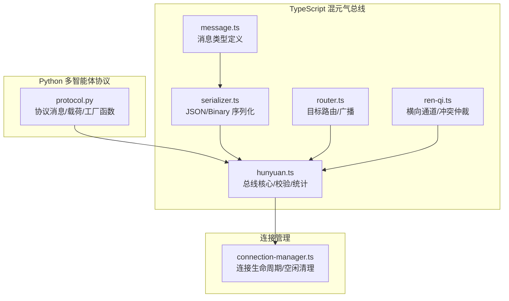
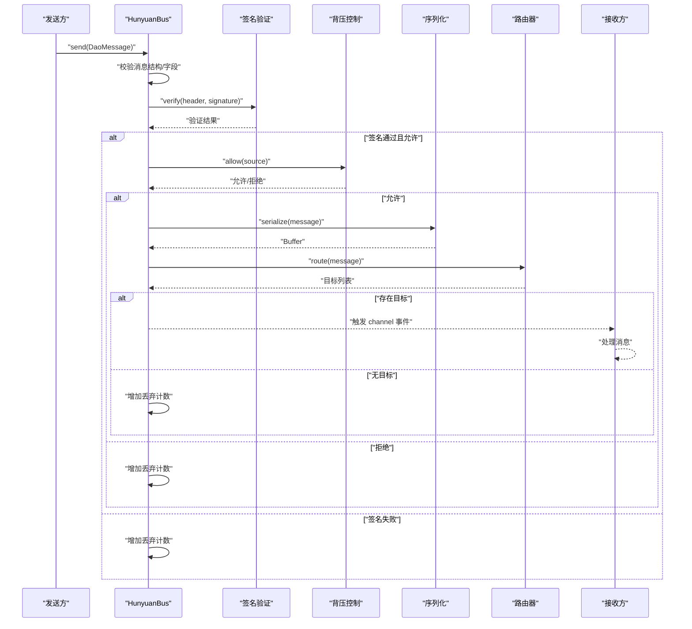
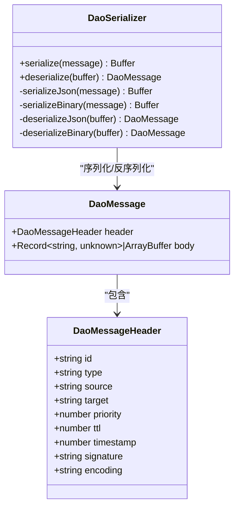
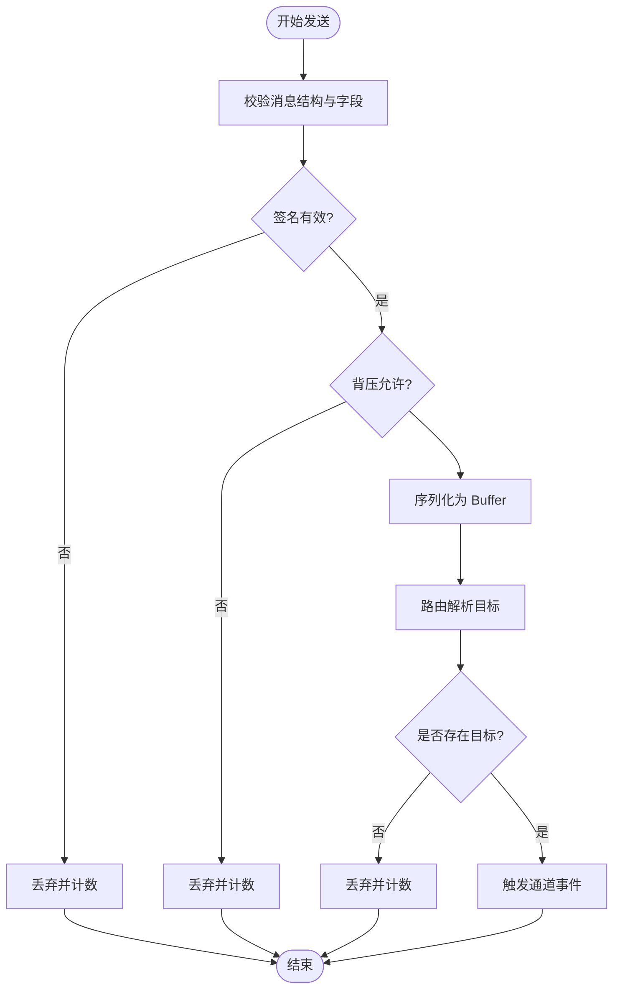
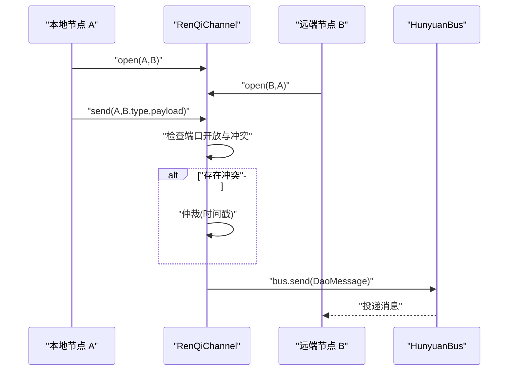
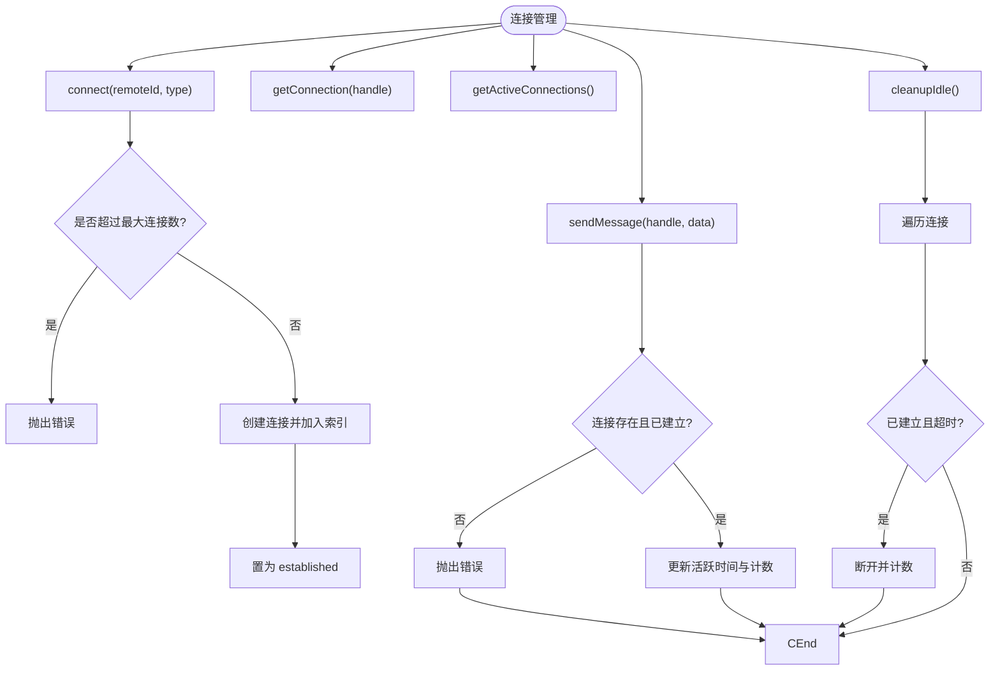
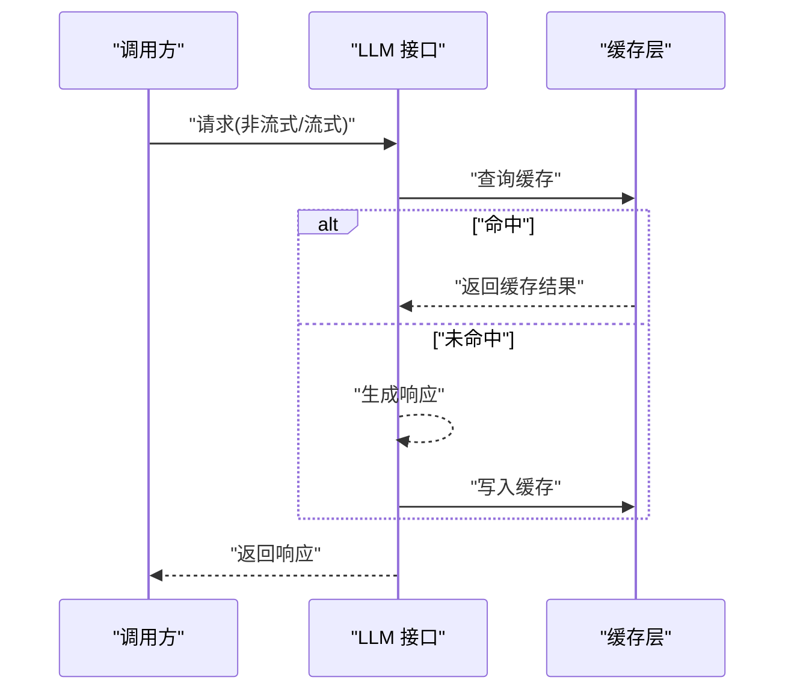
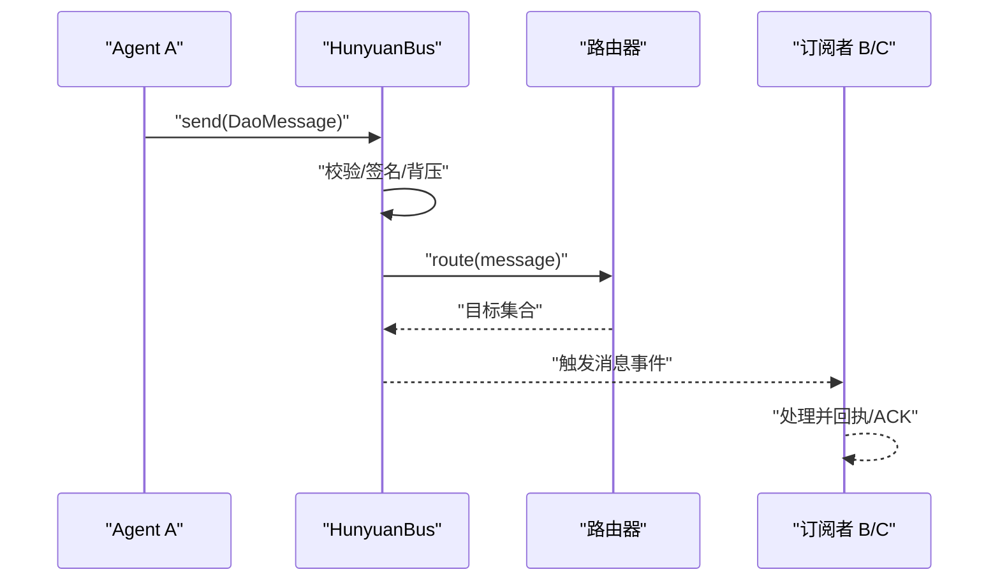
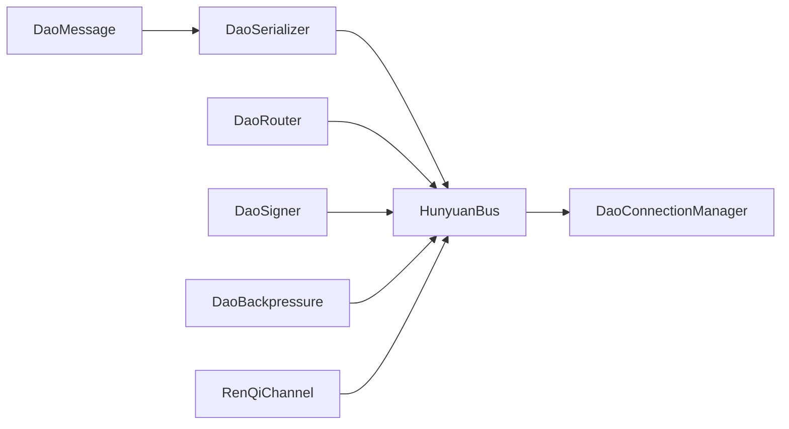

# 通信协议

<cite>
**本文引用的文件**
- [protocol.py](file://tools/flexloop/src/taolib/testing/multi_agent/models/protocol.py)
- [message.ts](file://apps/DaoMind/packages/daoQi/src/types/message.ts)
- [serializer.ts](file://apps/DaoMind/packages/daoQi/src/codec/serializer.ts)
- [hunyuan.ts](file://apps/DaoMind/packages/daoQi/src/hunyuan.ts)
- [router.ts](file://apps/DaoMind/packages/daoQi/src/router.ts)
- [ren-qi.ts](file://apps/DaoMind/packages/daoQi/src/channels/ren-qi.ts)
- [connection-manager.ts](file://apps/DaoMind/packages/daoNexus/src/connection-manager.ts)
- [llm.py](file://tools/DeepResearch/src/deepresearch/llms/llm.py)
- [test_llm.py](file://tools/DeepResearch/tests/unit/llms/test_llm.py)
- [test_hunyuan.ts](file://apps/DaoMind/packages/daoQi/src/__tests__/hunyuan.test.ts)
- [test_push_service.py](file://tools/flexloop/tests/testing/test_config_center/test_push_service.py)
</cite>

## 目录
1. [引言](#引言)
2. [项目结构](#项目结构)
3. [核心组件](#核心组件)
4. [架构总览](#架构总览)
5. [详细组件分析](#详细组件分析)
6. [依赖分析](#依赖分析)
7. [性能考虑](#性能考虑)
8. [故障排查指南](#故障排查指南)
9. [结论](#结论)
10. [附录](#附录)

## 引言
本技术文档围绕多智能体通信协议展开，系统性阐述消息模型设计、序列化机制、传输格式、协议接口、消息路由与协议适配、LLM通信协议的特殊实现、通信管理器的功能、以及通信示例与扩展机制。文档同时覆盖安全与性能优化策略，帮助读者在理解现有实现的基础上进行扩展与集成。

## 项目结构
本仓库包含两类主要通信相关实现：
- Python 多智能体协议与消息模型：位于 tools/flexloop，提供统一的协议消息结构、载荷类型与工具函数。
- TypeScript 混元气总线（HunyuanBus）与配套组件：位于 apps/DaoMind/packages/daoQi，提供消息头、序列化、路由、签名与背压控制等能力；配合 apps/DaoMind/packages/daoNexus 提供连接管理。

**图表来源**
- [protocol.py:31-55](file://tools/flexloop/src/taolib/testing/multi_agent/models/protocol.py#L31-L55)
- [message.ts:17-39](file://apps/DaoMind/packages/daoQi/src/types/message.ts#L17-L39)
- [serializer.ts:11-25](file://apps/DaoMind/packages/daoQi/src/codec/serializer.ts#L11-L25)
- [router.ts:9-47](file://apps/DaoMind/packages/daoQi/src/router.ts#L9-L47)
- [hunyuan.ts:15-43](file://apps/DaoMind/packages/daoQi/src/hunyuan.ts#L15-L43)
- [ren-qi.ts:38-95](file://apps/DaoMind/packages/daoQi/src/channels/ren-qi.ts#L38-L95)
- [connection-manager.ts:10-46](file://apps/DaoMind/packages/daoNexus/src/connection-manager.ts#L10-L46)

**章节来源**
- [protocol.py:1-179](file://tools/flexloop/src/taolib/testing/multi_agent/models/protocol.py#L1-L179)
- [message.ts:1-40](file://apps/DaoMind/packages/daoQi/src/types/message.ts#L1-L40)
- [serializer.ts:1-75](file://apps/DaoMind/packages/daoQi/src/codec/serializer.ts#L1-L75)
- [router.ts:1-47](file://apps/DaoMind/packages/daoQi/src/router.ts#L1-L47)
- [hunyuan.ts:1-125](file://apps/DaoMind/packages/daoQi/src/hunyuan.ts#L1-L125)
- [ren-qi.ts:1-130](file://apps/DaoMind/packages/daoQi/src/channels/ren-qi.ts#L1-L130)
- [connection-manager.ts:1-140](file://apps/DaoMind/packages/daoNexus/src/connection-manager.ts#L1-L140)

## 核心组件
- 协议消息模型（Python）：定义协议版本、头部、消息体与多种业务载荷（任务、技能、心跳、状态），并提供过期判断与序列化辅助。
- 消息类型定义（TypeScript）：统一消息头字段（id、type、source、target、priority、ttl、timestamp、signature、encoding）与消息体类型。
- 序列化引擎（TypeScript）：支持 JSON 与二进制两种编码，自动识别并解析消息体中的二进制数据。
- 路由器（TypeScript）：基于目标节点建立订阅映射，支持单播与广播，记录丢弃计数。
- 总线核心（TypeScript）：负责消息校验、签名验证、背压控制、序列化、路由与统计。
- 横向通道（TypeScript）：同级模块间通信通道，具备端口开放管理与冲突仲裁。
- 连接管理器（TypeScript）：维护连接生命周期、空闲清理与统计指标。

**章节来源**
- [protocol.py:22-55](file://tools/flexloop/src/taolib/testing/multi_agent/models/protocol.py#L22-L55)
- [message.ts:17-39](file://apps/DaoMind/packages/daoQi/src/types/message.ts#L17-L39)
- [serializer.ts:11-75](file://apps/DaoMind/packages/daoQi/src/codec/serializer.ts#L11-L75)
- [router.ts:9-47](file://apps/DaoMind/packages/daoQi/src/router.ts#L9-L47)
- [hunyuan.ts:15-125](file://apps/DaoMind/packages/daoQi/src/hunyuan.ts#L15-L125)
- [ren-qi.ts:38-130](file://apps/DaoMind/packages/daoQi/src/channels/ren-qi.ts#L38-L130)
- [connection-manager.ts:10-140](file://apps/DaoMind/packages/daoNexus/src/connection-manager.ts#L10-L140)

## 架构总览
混元气总线以“消息”为中心，贯穿校验、序列化、路由与统计环节；横向通道提供同级模块的直接通信路径；连接管理器保障长连接的可用性与健康度。

**图表来源**
- [hunyuan.ts:45-92](file://apps/DaoMind/packages/daoQi/src/hunyuan.ts#L45-L92)
- [serializer.ts:11-25](file://apps/DaoMind/packages/daoQi/src/codec/serializer.ts#L11-L25)
- [router.ts:28-42](file://apps/DaoMind/packages/daoQi/src/router.ts#L28-L42)

## 详细组件分析

### 消息模型与序列化（TypeScript）
- 消息头字段涵盖路由与元信息，支持 JSON 与二进制编码；消息体可为对象或 ArrayBuffer。
- 序列化器自动检测编码格式，JSON 时对 ArrayBuffer 进行 Base64 包裹；二进制格式在头部长度前放置魔数与头部长度，随后拼接头部与正文。
- 反序列化器根据首字节判断格式，JSON 时还原 Base64 的二进制体，二进制时按长度切片解析。

**图表来源**
- [message.ts:17-39](file://apps/DaoMind/packages/daoQi/src/types/message.ts#L17-L39)
- [serializer.ts:11-75](file://apps/DaoMind/packages/daoQi/src/codec/serializer.ts#L11-L75)

**章节来源**
- [message.ts:1-40](file://apps/DaoMind/packages/daoQi/src/types/message.ts#L1-L40)
- [serializer.ts:1-75](file://apps/DaoMind/packages/daoQi/src/codec/serializer.ts#L1-L75)

### 协议接口与消息路由（TypeScript）
- 路由器基于目标建立订阅集合，支持广播（无目标）与单播；当 TTL 不可继续或无订阅者时记录丢弃。
- 总线在发送前执行严格校验，缺失关键字段将抛错；签名通过后进入背压控制与序列化流程；最终触发对应通道事件分发给订阅者。

**图表来源**
- [hunyuan.ts:45-92](file://apps/DaoMind/packages/daoQi/src/hunyuan.ts#L45-L92)
- [router.ts:28-42](file://apps/DaoMind/packages/daoQi/src/router.ts#L28-L42)

**章节来源**
- [router.ts:1-47](file://apps/DaoMind/packages/daoQi/src/router.ts#L1-L47)
- [hunyuan.ts:1-125](file://apps/DaoMind/packages/daoQi/src/hunyuan.ts#L1-L125)

### 横向通道与冲突仲裁（TypeScript）
- 人气通道（RenQi）限定合法节点对，仅在双向端口均开放时允许发送；若检测到近邻冲突，采用时间戳仲裁胜者消息。
- 发送时构造标准消息头，设置类型、源/目标、优先级、TTL、时间戳与编码；消息体为对象则透传，否则包装为 { value }。

**图表来源**
- [ren-qi.ts:47-95](file://apps/DaoMind/packages/daoQi/src/channels/ren-qi.ts#L47-L95)
- [hunyuan.ts:45-92](file://apps/DaoMind/packages/daoQi/src/hunyuan.ts#L45-L92)

**章节来源**
- [ren-qi.ts:1-130](file://apps/DaoMind/packages/daoQi/src/channels/ren-qi.ts#L1-L130)

### 连接管理器（TypeScript）
- 维护连接映射与远端索引，支持连接建立、断开、查询与活跃连接统计；提供空闲连接清理策略，基于最后活跃时间与阈值判定。
- 提供发送前置校验：连接存在且处于 established 状态，否则抛错；发送后更新活跃时间与消息计数。

**图表来源**
- [connection-manager.ts:21-115](file://apps/DaoMind/packages/daoNexus/src/connection-manager.ts#L21-L115)

**章节来源**
- [connection-manager.ts:1-140](file://apps/DaoMind/packages/daoNexus/src/connection-manager.ts#L1-L140)

### LLM 通信协议的特殊实现
- LLM 接口支持非流式与流式响应，内部维护对话历史与上下文；提供缓存统计与一致性测试，验证相同输入的重复响应一致。
- 在混元气总线中，LLM 相关消息可作为业务消息体的一部分，遵循统一的消息头与编码规范，便于跨模块传递与路由。

**图表来源**
- [llm.py:284-304](file://tools/DeepResearch/src/deepresearch/llms/llm.py#L284-L304)
- [test_llm.py:42-57](file://tools/DeepResearch/tests/unit/llms/test_llm.py#L42-L57)

**章节来源**
- [llm.py:274-307](file://tools/DeepResearch/src/deepresearch/llms/llm.py#L274-L307)
- [test_llm.py:42-60](file://tools/DeepResearch/tests/unit/llms/test_llm.py#L42-L60)

### 通信示例：Agent 间的消息传递、事件订阅与状态同步
- Agent 间可通过混元气总线进行点对点或广播通信；发送前由总线进行校验、签名验证与背压控制；接收端通过订阅通道处理消息。
- 配合推送服务示例，可实现用户在线状态、订阅频道与离线消息刷新等场景。

**图表来源**
- [hunyuan.ts:45-92](file://apps/DaoMind/packages/daoQi/src/hunyuan.ts#L45-L92)
- [router.ts:28-42](file://apps/DaoMind/packages/daoQi/src/router.ts#L28-L42)
- [test_push_service.py:289-327](file://tools/flexloop/tests/testing/test_config_center/test_push_service.py#L289-L327)

**章节来源**
- [hunyuan.ts:94-125](file://apps/DaoMind/packages/daoQi/src/hunyuan.ts#L94-L125)
- [test_push_service.py:289-540](file://tools/flexloop/tests/testing/test_config_center/test_push_service.py#L289-L540)

## 依赖分析
- 消息类型与序列化：消息头与体定义独立于具体传输，序列化器负责编码差异。
- 总线核心依赖序列化器、路由器与签名器；背压控制用于限流与保护。
- 横向通道依赖总线进行消息投递，自身负责端口与冲突管理。
- 连接管理器与总线解耦，通过外部传输层（如 WebSocket/IPC）承载消息。

**图表来源**
- [message.ts:17-39](file://apps/DaoMind/packages/daoQi/src/types/message.ts#L17-L39)
- [serializer.ts:11-25](file://apps/DaoMind/packages/daoQi/src/codec/serializer.ts#L11-L25)
- [hunyuan.ts:15-43](file://apps/DaoMind/packages/daoQi/src/hunyuan.ts#L15-L43)
- [router.ts:9-18](file://apps/DaoMind/packages/daoQi/src/router.ts#L9-L18)
- [ren-qi.ts:38-45](file://apps/DaoMind/packages/daoQi/src/channels/ren-qi.ts#L38-L45)
- [connection-manager.ts:10-19](file://apps/DaoMind/packages/daoNexus/src/connection-manager.ts#L10-L19)

**章节来源**
- [hunyuan.ts:1-125](file://apps/DaoMind/packages/daoQi/src/hunyuan.ts#L1-L125)
- [router.ts:1-47](file://apps/DaoMind/packages/daoQi/src/router.ts#L1-L47)
- [ren-qi.ts:1-130](file://apps/DaoMind/packages/daoQi/src/channels/ren-qi.ts#L1-L130)
- [connection-manager.ts:1-140](file://apps/DaoMind/packages/daoNexus/src/connection-manager.ts#L1-L140)

## 性能考虑
- 编码选择：二进制编码在大体量二进制数据传输时更高效；JSON 编码便于调试与跨语言互通。
- 背压控制：通过源维度限流避免热点节点过载，结合丢弃计数与统计指标进行容量规划。
- 路由优化：尽量使用精确目标单播，减少广播风暴；合理设置 TTL，避免无效传播。
- 连接管理：定期清理空闲连接，降低资源占用；限制最大连接数，防止雪崩。
- 缓存与复用：LLM 响应可利用缓存提升吞吐，注意缓存失效策略与一致性。

[本节为通用指导，无需列出章节来源]

## 故障排查指南
- 消息校验失败：检查消息头字段完整性（source、target、timestamp、type、body），以及 body 中的类型字段。
- 签名验证失败：确认签名算法与密钥一致，避免篡改或过期消息被丢弃。
- 背压拒绝：观察总线统计中的丢弃计数，定位高流量源并实施限流或扩容。
- 路由无目标：确认订阅关系是否正确建立，或目标是否为空导致广播未命中任何订阅者。
- 横向通道冲突：检查端口开放状态与仲裁逻辑，避免近邻竞争导致消息丢失。
- 连接异常：确认连接状态为 established，检查空闲清理阈值与活跃时间更新。

**章节来源**
- [hunyuan.ts:45-92](file://apps/DaoMind/packages/daoQi/src/hunyuan.ts#L45-L92)
- [router.ts:28-42](file://apps/DaoMind/packages/daoQi/src/router.ts#L28-L42)
- [ren-qi.ts:67-95](file://apps/DaoMind/packages/daoQi/src/channels/ren-qi.ts#L67-L95)
- [connection-manager.ts:84-95](file://apps/DaoMind/packages/daoNexus/src/connection-manager.ts#L84-L95)
- [test_hunyuan.ts:222-268](file://apps/DaoMind/packages/daoQi/src/__tests__/hunyuan.test.ts#L222-L268)

## 结论
该通信体系以统一消息模型为核心，结合严格的校验、签名与背压控制，辅以灵活的路由与二进制/JSON 编码，既满足多智能体间高效稳定的交互，又为横向通道与连接管理提供了扩展空间。通过 LLM 与推送服务示例，展示了协议在实际业务场景中的落地方式。建议在生产环境中持续监控丢弃计数、路由命中率与连接健康度，并根据负载特征选择合适的编码与缓存策略。

[本节为总结性内容，无需列出章节来源]

## 附录

### 协议扩展机制
- 新增消息类型：在消息头 type 字段约定新类型，总线与路由器保持兼容；必要时扩展签名与背压策略。
- 新增编码格式：在序列化器中添加分支与魔数字节，确保向后兼容与自动识别。
- 新增通道类型：在总线侧注册新通道事件，路由器与订阅接口随之生效。

[本节为概念性内容，无需列出章节来源]

### 安全考虑
- 签名与校验：启用签名验证，防止伪造与篡改；对过期消息进行丢弃。
- 访问控制：限制订阅权限与目标可见性，避免越权路由。
- 输入验证：严格校验消息结构与字段类型，拒绝异常负载。

**章节来源**
- [hunyuan.ts:70-76](file://apps/DaoMind/packages/daoQi/src/hunyuan.ts#L70-L76)
- [test_hunyuan.ts:222-268](file://apps/DaoMind/packages/daoQi/src/__tests__/hunyuan.test.ts#L222-L268)