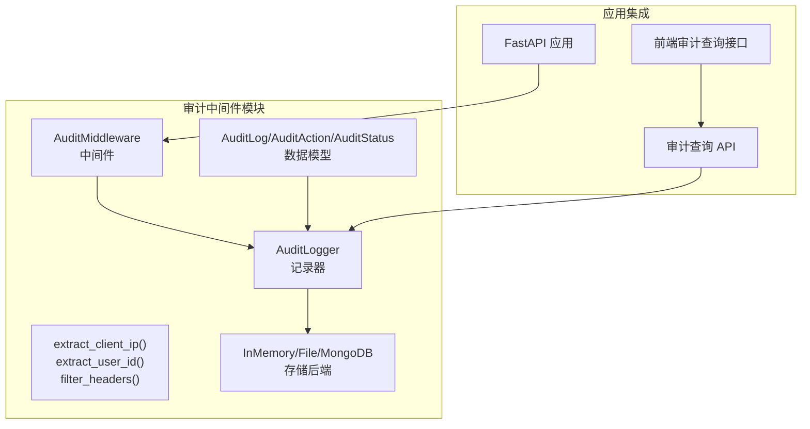
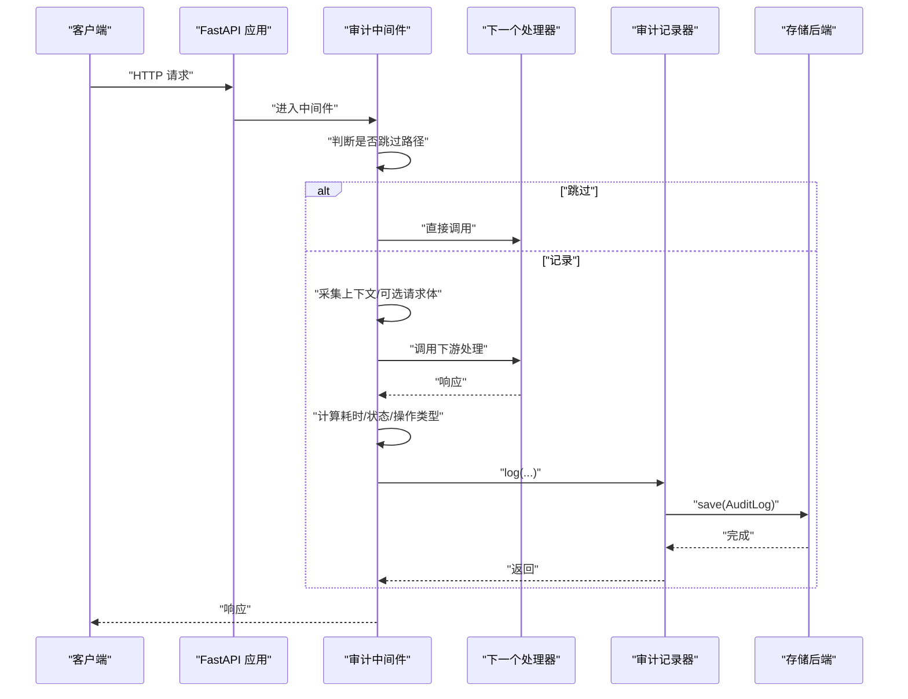
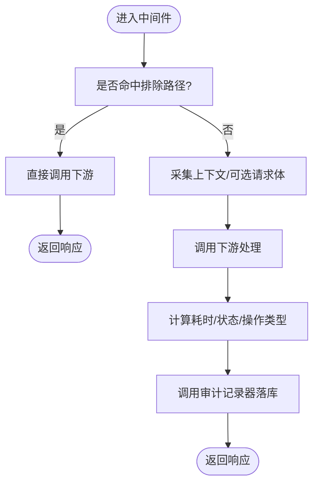
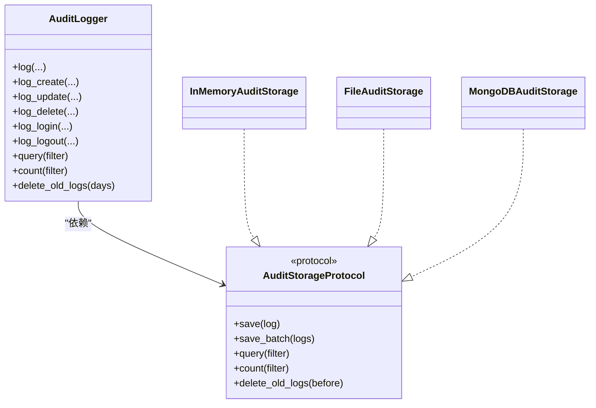
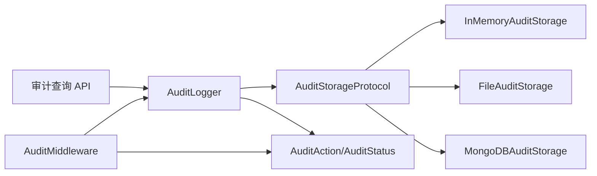

# 审计中间件

<cite>
**本文引用的文件**
- [middleware.py](file://tools/flexloop/src/taolib/testing/audit/middleware.py)
- [logger.py](file://tools/flexloop/src/taolib/testing/audit/logger.py)
- [models.py](file://tools/flexloop/src/taolib/testing/audit/models.py)
- [__init__.py](file://tools/flexloop/src/taolib/testing/audit/__init__.py)
- [audit.py](file://tools/flexloop/src/taolib/testing/config_center/server/api/audit.py)
- [audit.ts](file://apps/config-center/src/api/audit.ts)
</cite>

## 目录
1. [简介](#简介)
2. [项目结构](#项目结构)
3. [核心组件](#核心组件)
4. [架构总览](#架构总览)
5. [组件详解](#组件详解)
6. [依赖关系分析](#依赖关系分析)
7. [性能考量](#性能考量)
8. [故障排查指南](#故障排查指南)
9. [结论](#结论)
10. [附录](#附录)

## 简介
本技术文档围绕审计中间件展开，系统性阐述其在请求处理流程中的作用、自动拦截机制、上下文信息采集策略、异常处理与性能影响控制，并给出在不同框架中的集成方式、配置项说明、请求/响应拦截逻辑、中间件链组合与优先级设置、调试技巧等。目标是帮助开发者快速理解并正确使用该中间件，保障系统可审计性与可观测性。

## 项目结构
审计中间件位于工具库模块中，采用“中间件 + 记录器 + 存储后端 + 数据模型”的分层设计，同时提供 FastAPI 中间件与 API 查询接口，便于在应用中统一启用与检索审计日志。

图示来源
- [middleware.py:101-275](file://tools/flexloop/src/taolib/testing/audit/middleware.py#L101-L275)
- [logger.py:470-747](file://tools/flexloop/src/taolib/testing/audit/logger.py#L470-L747)
- [models.py:14-199](file://tools/flexloop/src/taolib/testing/audit/models.py#L14-L199)
- [audit.py:15-88](file://tools/flexloop/src/taolib/testing/config_center/server/api/audit.py#L15-L88)
- [audit.ts:4-18](file://apps/config-center/src/api/audit.ts#L4-L18)

章节来源
- [middleware.py:1-275](file://tools/flexloop/src/taolib/testing/audit/middleware.py#L1-L275)
- [logger.py:1-747](file://tools/flexloop/src/taolib/testing/audit/logger.py#L1-L747)
- [models.py:1-199](file://tools/flexloop/src/taolib/testing/audit/models.py#L1-L199)
- [__init__.py:1-88](file://tools/flexloop/src/taolib/testing/audit/__init__.py#L1-L88)
- [audit.py:1-88](file://tools/flexloop/src/taolib/testing/config_center/server/api/audit.py#L1-L88)
- [audit.ts:1-18](file://apps/config-center/src/api/audit.ts#L1-L18)

## 核心组件
- 审计中间件：自动拦截 API 请求，采集上下文信息，计算响应时间与状态，决定操作类型，调用记录器落库。
- 审计记录器：封装日志创建、查询、计数与清理，支持多种存储后端。
- 存储后端：内存、文件、MongoDB 三种实现，满足不同环境需求。
- 数据模型：定义审计动作、状态、日志实体、查询过滤器与响应模型。
- API 查询：提供 RESTful 接口用于前端或管理端检索审计日志。

章节来源
- [middleware.py:101-275](file://tools/flexloop/src/taolib/testing/audit/middleware.py#L101-L275)
- [logger.py:470-747](file://tools/flexloop/src/taolib/testing/audit/logger.py#L470-L747)
- [models.py:14-199](file://tools/flexloop/src/taolib/testing/audit/models.py#L14-L199)
- [audit.py:15-88](file://tools/flexloop/src/taolib/testing/config_center/server/api/audit.py#L15-L88)
- [audit.ts:4-18](file://apps/config-center/src/api/audit.ts#L4-L18)

## 架构总览
审计中间件在 FastAPI 请求生命周期中以 ASGI 中间件形式运行，先于业务路由执行，负责：
- 路径过滤：跳过健康检查、文档等非关键路径。
- 上下文采集：提取客户端 IP、User-Agent、用户 ID、查询参数、请求头（敏感头脱敏）。
- 可选体采集：在允许且非敏感路径的前提下，采集请求体大小与内容（二进制或文本）。
- 执行业务：调用下游处理器。
- 统计耗时与状态：计算响应时间、判定成功/失败。
- 决策操作类型：基于方法与路径推断操作类型（如登录、登出、增删改查等）。
- 落库记录：调用审计记录器写入存储后端。

图示来源
- [middleware.py:178-247](file://tools/flexloop/src/taolib/testing/audit/middleware.py#L178-L247)
- [logger.py:498-553](file://tools/flexloop/src/taolib/testing/audit/logger.py#L498-L553)

章节来源
- [middleware.py:178-247](file://tools/flexloop/src/taolib/testing/audit/middleware.py#L178-L247)
- [logger.py:498-553](file://tools/flexloop/src/taolib/testing/audit/logger.py#L498-L553)

## 组件详解

### 审计中间件（FastAPI）
- 职责：自动拦截请求，采集上下文，记录审计日志。
- 关键能力：
  - 路径过滤：默认排除健康检查、指标、文档等路径。
  - 敏感头过滤：对授权、Cookie、API Key 等敏感头进行脱敏。
  - 用户 ID 提取：优先从自定义头提取，其次从请求状态对象中获取。
  - 请求体采集：可选开启；对敏感路径默认不采集。
  - 操作类型推断：根据方法与路径识别登录、登出、增删改查等。
  - 异常兜底：记录失败时抛出异常会被捕获并记录日志，不影响业务响应。
- 性能影响：采集请求体与文本解析会带来额外开销，建议仅在必要路径开启，且对敏感路径关闭。

图示来源
- [middleware.py:150-247](file://tools/flexloop/src/taolib/testing/audit/middleware.py#L150-L247)

章节来源
- [middleware.py:17-33](file://tools/flexloop/src/taolib/testing/audit/middleware.py#L17-L33)
- [middleware.py:36-83](file://tools/flexloop/src/taolib/testing/audit/middleware.py#L36-L83)
- [middleware.py:101-149](file://tools/flexloop/src/taolib/testing/audit/middleware.py#L101-L149)
- [middleware.py:178-247](file://tools/flexloop/src/taolib/testing/audit/middleware.py#L178-L247)
- [middleware.py:249-273](file://tools/flexloop/src/taolib/testing/audit/middleware.py#L249-L273)

### 审计记录器与存储后端
- 记录器职责：统一创建审计日志、封装状态与动作枚举转换、调用存储后端持久化。
- 存储后端：
  - 内存存储：适合测试/开发，有容量上限，自动淘汰最旧日志。
  - 文件存储：JSON 文件持久化，支持读写与裁剪。
  - MongoDB 存储：异步写入、批量写入、查询、计数、删除旧日志、索引创建。
- 查询与清理：支持按用户、动作、资源、状态、时间范围、IP 等条件过滤；提供按天数清理历史日志的能力。

图示来源
- [logger.py:22-77](file://tools/flexloop/src/taolib/testing/audit/logger.py#L22-L77)
- [logger.py:79-184](file://tools/flexloop/src/taolib/testing/audit/logger.py#L79-L184)
- [logger.py:186-323](file://tools/flexloop/src/taolib/testing/audit/logger.py#L186-L323)
- [logger.py:325-468](file://tools/flexloop/src/taolib/testing/audit/logger.py#L325-L468)
- [logger.py:470-747](file://tools/flexloop/src/taolib/testing/audit/logger.py#L470-L747)

章节来源
- [logger.py:22-77](file://tools/flexloop/src/taolib/testing/audit/logger.py#L22-L77)
- [logger.py:79-184](file://tools/flexloop/src/taolib/testing/audit/logger.py#L79-L184)
- [logger.py:186-323](file://tools/flexloop/src/taolib/testing/audit/logger.py#L186-L323)
- [logger.py:325-468](file://tools/flexloop/src/taolib/testing/audit/logger.py#L325-L468)
- [logger.py:470-747](file://tools/flexloop/src/taolib/testing/audit/logger.py#L470-L747)

### 数据模型
- 动作类型：创建、读取、更新、删除、登录、登出、登录失败、导出、导入、执行、访问。
- 状态类型：成功、失败。
- 日志实体：包含唯一 ID、时间戳、用户 ID、动作、资源类型/ID、详情、IP、UA、状态、错误信息。
- 查询过滤器：支持用户、动作、资源、状态、时间范围、IP、分页等。
- 请求审计信息：用于中间件自动采集的结构化字段。

章节来源
- [models.py:14-69](file://tools/flexloop/src/taolib/testing/audit/models.py#L14-L69)
- [models.py:131-157](file://tools/flexloop/src/taolib/testing/audit/models.py#L131-L157)
- [models.py:175-199](file://tools/flexloop/src/taolib/testing/audit/models.py#L175-L199)

### API 查询与前端对接
- 后端 API：提供审计日志列表与详情查询接口，支持按资源类型/ID、操作者、动作、分页等条件过滤。
- 前端接口：封装 GET /api/v1/audit/logs 与 GET /api/v1/audit/logs/{logId}，返回标准化响应模型。

章节来源
- [audit.py:15-88](file://tools/flexloop/src/taolib/testing/config_center/server/api/audit.py#L15-L88)
- [audit.ts:4-18](file://apps/config-center/src/api/audit.ts#L4-L18)

## 依赖关系分析
- 中间件依赖记录器；记录器依赖存储协议；存储协议由具体实现类实现。
- 中间件依赖模型中的动作与状态枚举；记录器在创建日志时进行枚举转换。
- API 层依赖仓库层与当前用户依赖注入，最终调用记录器查询。

图示来源
- [middleware.py:101-149](file://tools/flexloop/src/taolib/testing/audit/middleware.py#L101-L149)
- [logger.py:22-77](file://tools/flexloop/src/taolib/testing/audit/logger.py#L22-L77)
- [models.py:14-35](file://tools/flexloop/src/taolib/testing/audit/models.py#L14-L35)
- [audit.py:15-88](file://tools/flexloop/src/taolib/testing/config_center/server/api/audit.py#L15-L88)

章节来源
- [middleware.py:101-149](file://tools/flexloop/src/taolib/testing/audit/middleware.py#L101-L149)
- [logger.py:22-77](file://tools/flexloop/src/taolib/testing/audit/logger.py#L22-L77)
- [models.py:14-35](file://tools/flexloop/src/taolib/testing/audit/models.py#L14-L35)
- [audit.py:15-88](file://tools/flexloop/src/taolib/testing/config_center/server/api/audit.py#L15-L88)

## 性能考量
- 请求体采集：仅在允许且非敏感路径时采集，避免大体积请求体带来的序列化与解析成本。
- 文本解码：对小体积请求体尝试解码为文本，超限则标记为二进制，减少内存占用。
- 存储后端选择：生产环境建议使用 MongoDB，具备索引与批量写入能力；测试/开发可用内存存储。
- 日志清理：定期删除历史日志，控制存储增长。
- 异常兜底：记录失败不会中断请求处理，但会增加一次异常日志输出，需关注日志系统负载。

章节来源
- [middleware.py:210-221](file://tools/flexloop/src/taolib/testing/audit/middleware.py#L210-L221)
- [logger.py:325-468](file://tools/flexloop/src/taolib/testing/audit/logger.py#L325-L468)
- [logger.py:729-744](file://tools/flexloop/src/taolib/testing/audit/logger.py#L729-L744)

## 故障排查指南
- 审计日志未落库：检查中间件是否被正确添加到应用；确认记录器存储后端初始化与索引创建；查看异常日志中“Failed to save audit log”提示。
- 用户 ID 为空：确认上游认证中间件已在请求状态中填充用户信息，或在请求头中提供 X-User-ID。
- 敏感头泄露：确认中间件对敏感头进行了过滤；若仍出现，请检查自定义头命名是否一致。
- 请求体未采集：确认 include_request_body 已开启，且路径不在敏感路径集合中；注意大小限制与解码异常处理。
- 查询无结果：核对查询参数（资源类型/ID、动作、时间范围、IP 等）是否正确；确认存储后端索引是否存在。

章节来源
- [middleware.py:191-192](file://tools/flexloop/src/taolib/testing/audit/middleware.py#L191-L192)
- [middleware.py:244-245](file://tools/flexloop/src/taolib/testing/audit/middleware.py#L244-L245)
- [middleware.py:64-83](file://tools/flexloop/src/taolib/testing/audit/middleware.py#L64-L83)
- [middleware.py:210-221](file://tools/flexloop/src/taolib/testing/audit/middleware.py#L210-L221)
- [logger.py:431-438](file://tools/flexloop/src/taolib/testing/audit/logger.py#L431-L438)

## 结论
该审计中间件通过轻量、可插拔的设计，实现了对 FastAPI 应用的自动化审计拦截与上下文采集，配合多样的存储后端与查询 API，能够满足从开发测试到生产运维的多种场景。合理配置审计范围、敏感信息过滤与性能控制策略，可在保障可观测性的同时最小化对业务的影响。

## 附录

### 配置选项与行为说明
- 审计范围定义
  - 排除路径：默认排除健康检查、指标、文档等路径，可通过构造函数传入自定义集合覆盖。
  - 敏感路径：默认对登录、注册、密码修改等路径不采集请求体，可通过构造函数传入自定义集合覆盖。
- 敏感信息过滤
  - 请求头：对 Authorization、Cookie、Set-Cookie、X-API-Key、X-Auth-Token 等敏感头进行脱敏。
  - 请求体：仅在允许且非敏感路径时采集。
- 性能影响控制
  - 控制 include_request_body 与 include_response_body 的开启范围。
  - 对大体积请求体进行截断与二进制标记。
  - 使用批量写入与索引优化（MongoDB）。
- 中间件链组合与优先级
  - 认证中间件应在审计中间件之前执行，以便中间件能从请求状态中提取用户信息。
  - 审计中间件应尽量靠近路由，确保覆盖所有业务路径。
- 调试技巧
  - 在开发环境使用内存存储便于观察；生产使用 MongoDB 并建立索引。
  - 通过 API 查询接口验证审计日志是否正确入库与可检索。
  - 关注异常日志中的保存失败信息，定位存储后端问题。

章节来源
- [middleware.py:17-33](file://tools/flexloop/src/taolib/testing/audit/middleware.py#L17-L33)
- [middleware.py:119-149](file://tools/flexloop/src/taolib/testing/audit/middleware.py#L119-L149)
- [middleware.py:210-221](file://tools/flexloop/src/taolib/testing/audit/middleware.py#L210-L221)
- [logger.py:325-468](file://tools/flexloop/src/taolib/testing/audit/logger.py#L325-L468)
- [audit.py:15-88](file://tools/flexloop/src/taolib/testing/config_center/server/api/audit.py#L15-L88)