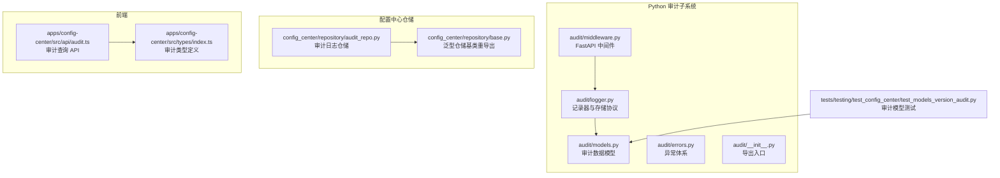
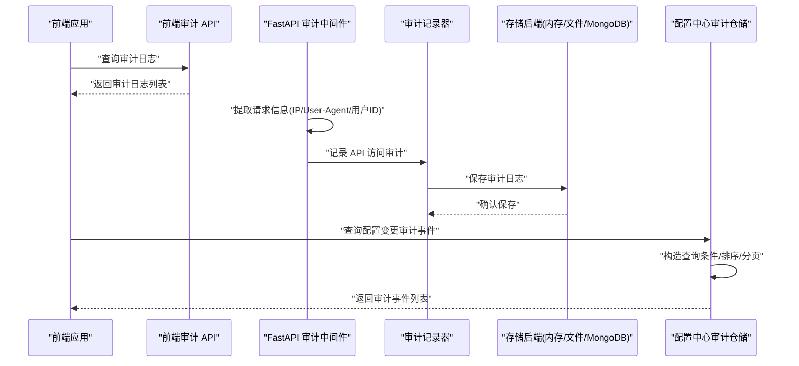
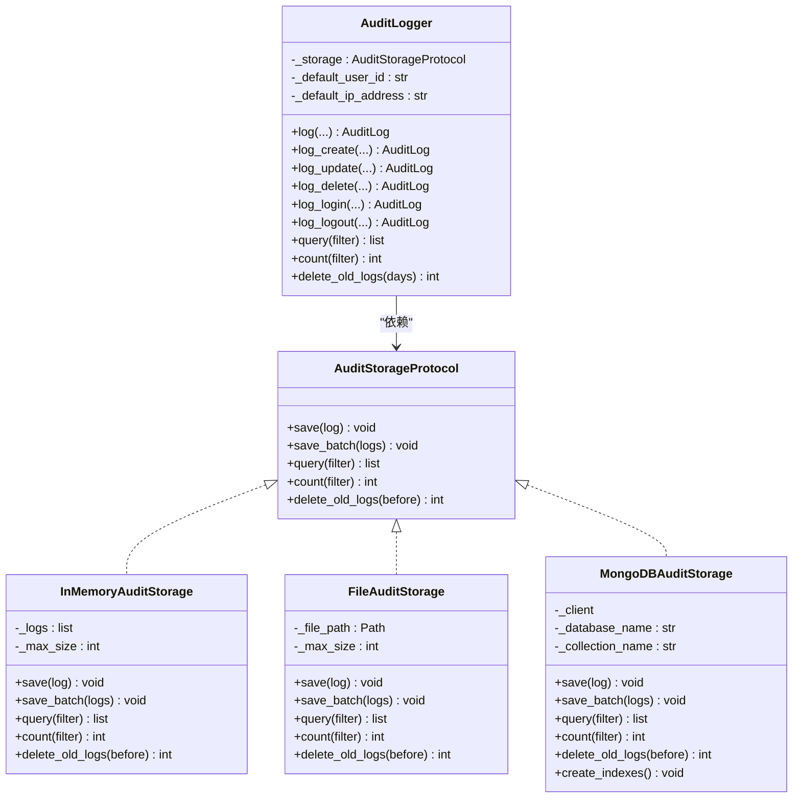
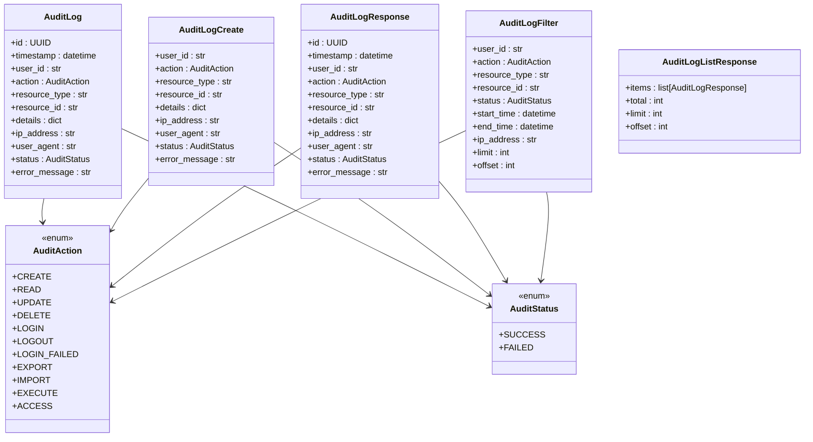
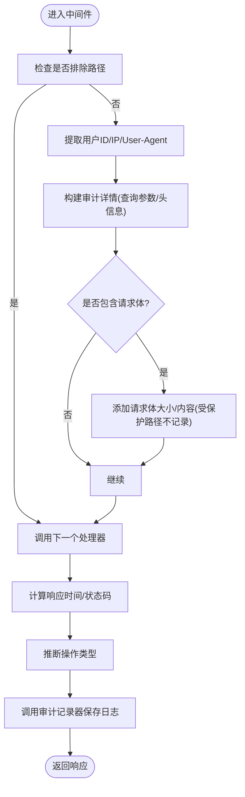
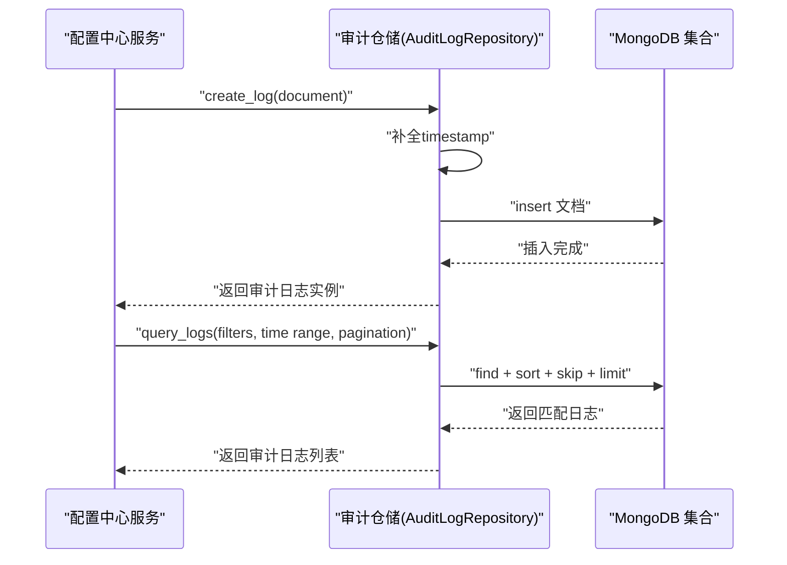
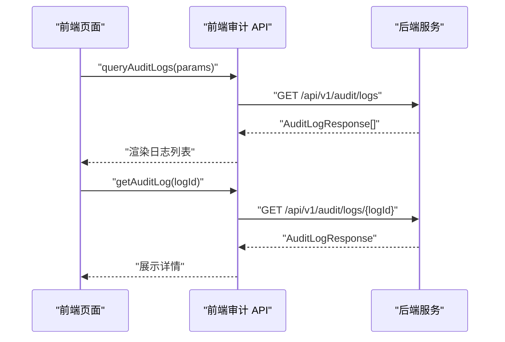
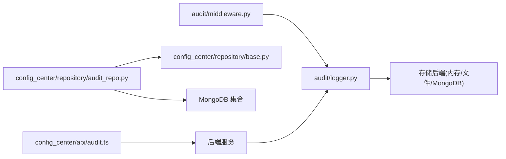

# 审计仓库模式

<cite>
**本文引用的文件**
- [audit/logger.py](file://tools/flexloop/src/taolib/testing/audit/logger.py)
- [audit/models.py](file://tools/flexloop/src/taolib/testing/audit/models.py)
- [audit/middleware.py](file://tools/flexloop/src/taolib/testing/audit/middleware.py)
- [audit/errors.py](file://tools/flexloop/src/taolib/testing/audit/errors.py)
- [audit/__init__.py](file://tools/flexloop/src/taolib/testing/audit/__init__.py)
- [config_center/repository/audit_repo.py](file://tools/flexloop/src/taolib/testing/config_center/repository/audit_repo.py)
- [config_center/repository/base.py](file://tools/flexloop/src/taolib/testing/config_center/repository/base.py)
- [config_center/api/audit.ts](file://apps/config-center/src/api/audit.ts)
- [config_center/types/index.ts](file://apps/config-center/src/types/index.ts)
- [tests/testing/test_config_center/test_models_version_audit.py](file://tools/flexloop/tests/testing/test_config_center/test_models_version_audit.py)
</cite>

## 目录
1. [简介](#简介)
2. [项目结构](#项目结构)
3. [核心组件](#核心组件)
4. [架构总览](#架构总览)
5. [详细组件分析](#详细组件分析)
6. [依赖分析](#依赖分析)
7. [性能考量](#性能考量)
8. [故障排查指南](#故障排查指南)
9. [结论](#结论)
10. [附录](#附录)

## 简介
本技术文档围绕“审计仓库模式”展开，系统化阐述审计系统中数据访问抽象、事务管理与并发控制的设计与实现。文档聚焦于两类仓储实现：
- 面向通用审计日志的多后端存储仓储（内存、文件、MongoDB），通过统一的协议与记录器对外提供一致的审计能力。
- 面向配置中心审计事件的 MongoDB 仓储，强调索引策略、查询优化与生命周期管理。

同时，文档给出仓库接口设计、CRUD 与查询方法、批量处理能力、一致性保障、性能优化与扩展性建议，并说明与外部存储系统的集成方式及数据迁移策略。

## 项目结构
本仓库中与审计仓库模式直接相关的代码主要分布在以下位置：
- Python 审计子系统：tools/flexloop/src/taolib/testing/audit
- 配置中心审计仓储：tools/flexloop/src/taolib/testing/config_center/repository
- 前端审计查询 API：apps/config-center/src/api/audit.ts
- 前端审计类型定义：apps/config-center/src/types/index.ts
- 测试用例：tools/flexloop/tests/testing/test_config_center/test_models_version_audit.py

图表来源
- [audit/logger.py:1-747](file://tools/flexloop/src/taolib/testing/audit/logger.py#L1-L747)
- [audit/models.py:1-199](file://tools/flexloop/src/taolib/testing/audit/models.py#L1-L199)
- [audit/middleware.py:1-275](file://tools/flexloop/src/taolib/testing/audit/middleware.py#L1-L275)
- [audit/errors.py:1-29](file://tools/flexloop/src/taolib/testing/audit/errors.py#L1-L29)
- [audit/__init__.py:1-88](file://tools/flexloop/src/taolib/testing/audit/__init__.py#L1-L88)
- [config_center/repository/audit_repo.py:1-103](file://tools/flexloop/src/taolib/testing/config_center/repository/audit_repo.py#L1-L103)
- [config_center/repository/base.py:1-11](file://tools/flexloop/src/taolib/testing/config_center/repository/base.py#L1-L11)
- [config_center/api/audit.ts:1-18](file://apps/config-center/src/api/audit.ts#L1-L18)
- [config_center/types/index.ts:1-163](file://apps/config-center/src/types/index.ts#L1-L163)
- [tests/testing/test_config_center/test_models_version_audit.py:186-226](file://tools/flexloop/tests/testing/test_config_center/test_models_version_audit.py#L186-L226)

章节来源
- [audit/__init__.py:1-88](file://tools/flexloop/src/taolib/testing/audit/__init__.py#L1-L88)
- [config_center/repository/base.py:1-11](file://tools/flexloop/src/taolib/testing/config_center/repository/base.py#L1-L11)

## 核心组件
- 审计记录器与存储协议
  - 通过协议定义统一的存储接口，支持保存、批量保存、查询、计数与清理旧日志等操作。
  - 提供内存、文件与 MongoDB 三种存储后端，满足不同环境需求。
- 审计数据模型
  - 统一的审计日志模型、创建模型、响应模型、过滤器与列表响应模型，确保前后端与存储层的数据一致性。
- FastAPI 审计中间件
  - 自动采集请求上下文，基于方法与路径推断操作类型，记录 API 访问审计日志。
- 配置中心审计仓储
  - 面向配置变更的审计事件存储，提供创建日志、查询与索引创建能力，内置 TTL 清理策略。

章节来源
- [audit/logger.py:22-76](file://tools/flexloop/src/taolib/testing/audit/logger.py#L22-L76)
- [audit/models.py:37-156](file://tools/flexloop/src/taolib/testing/audit/models.py#L37-L156)
- [audit/middleware.py:101-273](file://tools/flexloop/src/taolib/testing/audit/middleware.py#L101-L273)
- [config_center/repository/audit_repo.py:15-101](file://tools/flexloop/src/taolib/testing/config_center/repository/audit_repo.py#L15-L101)

## 架构总览
下图展示了审计系统的核心交互：前端通过 API 查询审计日志；后端中间件自动记录请求审计；Python 审计记录器将日志持久化到所选存储后端；配置中心仓储负责特定业务领域的审计事件存储与查询。

图表来源
- [config_center/api/audit.ts:1-18](file://apps/config-center/src/api/audit.ts#L1-L18)
- [audit/middleware.py:178-247](file://tools/flexloop/src/taolib/testing/audit/middleware.py#L178-L247)
- [audit/logger.py:470-745](file://tools/flexloop/src/taolib/testing/audit/logger.py#L470-L745)
- [config_center/repository/audit_repo.py:39-87](file://tools/flexloop/src/taolib/testing/config_center/repository/audit_repo.py#L39-L87)

## 详细组件分析

### 组件A：审计记录器与存储协议
- 协议设计
  - 定义 save/save_batch/query/count/delete_old_logs 等方法，确保不同存储后端具备一致的操作语义。
- 存储实现
  - 内存存储：适合测试与开发，支持最大容量限制与滚动丢弃。
  - 文件存储：以 JSON 文件持久化，支持上限裁剪与读写封装。
  - MongoDB 存储：异步插入、批量插入、查询、计数与索引创建，支持 TTL 清理。
- 记录器能力
  - 提供通用 log/log_create/log_update/log_delete/log_login/log_logout 等便捷方法，自动处理枚举转换与默认值。
  - 支持按过滤器查询与统计，并提供按保留天数清理旧日志的能力。

图表来源
- [audit/logger.py:22-76](file://tools/flexloop/src/taolib/testing/audit/logger.py#L22-L76)
- [audit/logger.py:79-184](file://tools/flexloop/src/taolib/testing/audit/logger.py#L79-L184)
- [audit/logger.py:186-323](file://tools/flexloop/src/taolib/testing/audit/logger.py#L186-L323)
- [audit/logger.py:325-467](file://tools/flexloop/src/taolib/testing/audit/logger.py#L325-L467)
- [audit/logger.py:470-745](file://tools/flexloop/src/taolib/testing/audit/logger.py#L470-L745)

章节来源
- [audit/logger.py:22-76](file://tools/flexloop/src/taolib/testing/audit/logger.py#L22-L76)
- [audit/logger.py:79-184](file://tools/flexloop/src/taolib/testing/audit/logger.py#L79-L184)
- [audit/logger.py:186-323](file://tools/flexloop/src/taolib/testing/audit/logger.py#L186-L323)
- [audit/logger.py:325-467](file://tools/flexloop/src/taolib/testing/audit/logger.py#L325-L467)
- [audit/logger.py:470-745](file://tools/flexloop/src/taolib/testing/audit/logger.py#L470-L745)

### 组件B：审计数据模型
- 操作类型与状态枚举
  - 定义 CREATE/READ/UPDATE/DELETE/LOGIN/LOGOUT/EXPORT/IMPORT/EXECUTE/ACCESS 等操作类型。
  - 定义 SUCCESS/FAILED 状态。
- 数据模型
  - 审计日志模型包含唯一 ID、时间戳、用户 ID、资源类型/ID、详情、IP/User-Agent、状态与错误信息等字段。
  - 创建模型用于请求入参校验，响应模型用于出参序列化，过滤器模型用于查询参数，列表响应模型用于分页返回。
- 类型定义
  - 前端 TypeScript 定义了与后端一致的审计动作与状态类型，确保跨端一致性。

图表来源
- [audit/models.py:14-35](file://tools/flexloop/src/taolib/testing/audit/models.py#L14-L35)
- [audit/models.py:37-68](file://tools/flexloop/src/taolib/testing/audit/models.py#L37-L68)
- [audit/models.py:73-96](file://tools/flexloop/src/taolib/testing/audit/models.py#L73-L96)
- [audit/models.py:99-126](file://tools/flexloop/src/taolib/testing/audit/models.py#L99-L126)
- [audit/models.py:131-156](file://tools/flexloop/src/taolib/testing/audit/models.py#L131-L156)
- [audit/models.py:159-172](file://tools/flexloop/src/taolib/testing/audit/models.py#L159-L172)
- [config_center/types/index.ts:7-11](file://apps/config-center/src/types/index.ts#L7-L11)

章节来源
- [audit/models.py:14-35](file://tools/flexloop/src/taolib/testing/audit/models.py#L14-L35)
- [audit/models.py:37-68](file://tools/flexloop/src/taolib/testing/audit/models.py#L37-L68)
- [audit/models.py:73-96](file://tools/flexloop/src/taolib/testing/audit/models.py#L73-L96)
- [audit/models.py:99-126](file://tools/flexloop/src/taolib/testing/audit/models.py#L99-L126)
- [audit/models.py:131-156](file://tools/flexloop/src/taolib/testing/audit/models.py#L131-L156)
- [audit/models.py:159-172](file://tools/flexloop/src/taolib/testing/audit/models.py#L159-L172)
- [config_center/types/index.ts:7-11](file://apps/config-center/src/types/index.ts#L7-L11)

### 组件C：FastAPI 审计中间件
- 功能要点
  - 自动排除健康检查、指标、文档等路径，避免噪音日志。
  - 从请求头或上下文中提取用户 ID 与客户端 IP，过滤敏感头信息。
  - 根据 HTTP 方法与路径推断操作类型（读/写/删/登录/登出/访问）。
  - 记录请求体大小与响应时间，按状态码判定成功/失败。
- 异常处理
  - 记录审计日志失败时进行异常记录，不影响主流程。

图表来源
- [audit/middleware.py:178-247](file://tools/flexloop/src/taolib/testing/audit/middleware.py#L178-L247)
- [audit/middleware.py:36-83](file://tools/flexloop/src/taolib/testing/audit/middleware.py#L36-L83)
- [audit/middleware.py:249-273](file://tools/flexloop/src/taolib/testing/audit/middleware.py#L249-L273)

章节来源
- [audit/middleware.py:17-33](file://tools/flexloop/src/taolib/testing/audit/middleware.py#L17-L33)
- [audit/middleware.py:36-83](file://tools/flexloop/src/taolib/testing/audit/middleware.py#L36-L83)
- [audit/middleware.py:101-148](file://tools/flexloop/src/taolib/testing/audit/middleware.py#L101-L148)
- [audit/middleware.py:178-247](file://tools/flexloop/src/taolib/testing/audit/middleware.py#L178-L247)
- [audit/middleware.py:249-273](file://tools/flexloop/src/taolib/testing/audit/middleware.py#L249-L273)

### 组件D：配置中心审计仓储
- 设计目标
  - 面向配置中心的审计事件存储，提供创建日志、按资源/操作人/时间范围查询与索引优化。
- 关键方法
  - create_log：自动补全时间戳并委托基础仓储创建。
  - query_logs：支持资源类型/ID、操作人、动作与时间范围过滤，按时间倒序分页。
  - create_indexes：建立复合索引与 TTL 索引，实现自动清理与高效查询。
- 扩展点
  - 可在基础仓储之上增加聚合查询、统计报表等高级能力。

图表来源
- [config_center/repository/audit_repo.py:26-37](file://tools/flexloop/src/taolib/testing/config_center/repository/audit_repo.py#L26-L37)
- [config_center/repository/audit_repo.py:39-87](file://tools/flexloop/src/taolib/testing/config_center/repository/audit_repo.py#L39-L87)
- [config_center/repository/audit_repo.py:89-100](file://tools/flexloop/src/taolib/testing/config_center/repository/audit_repo.py#L89-L100)

章节来源
- [config_center/repository/audit_repo.py:15-101](file://tools/flexloop/src/taolib/testing/config_center/repository/audit_repo.py#L15-L101)

### 组件E：前端审计查询与类型定义
- 前端 API
  - 提供查询审计日志与按 ID 获取单条日志的接口，支持资源类型/ID/操作人/动作/分页参数。
- 类型定义
  - 审计日志响应类型包含动作、资源类型/ID、键、操作人、IP、新旧值、状态、元数据与时间戳等字段，与后端模型保持一致。

图表来源
- [config_center/api/audit.ts:4-17](file://apps/config-center/src/api/audit.ts#L4-L17)
- [config_center/types/index.ts:77-91](file://apps/config-center/src/types/index.ts#L77-L91)

章节来源
- [config_center/api/audit.ts:1-18](file://apps/config-center/src/api/audit.ts#L1-L18)
- [config_center/types/index.ts:77-91](file://apps/config-center/src/types/index.ts#L77-L91)

## 依赖分析
- 组件耦合
  - 审计记录器依赖存储协议，解耦具体存储实现，便于替换与扩展。
  - 中间件依赖记录器，自动采集请求上下文并触发审计。
  - 配置中心仓储依赖基础仓储与 MongoDB 集合，提供业务专用的查询与索引能力。
- 外部依赖
  - MongoDB：通过异步驱动进行插入、查询与索引创建。
  - FastAPI：中间件集成框架，自动拦截请求并记录审计。
- 循环依赖
  - 当前模块未见循环导入，结构清晰。

图表来源
- [audit/middleware.py:12-13](file://tools/flexloop/src/taolib/testing/audit/middleware.py#L12-L13)
- [audit/logger.py:494-496](file://tools/flexloop/src/taolib/testing/audit/logger.py#L494-L496)
- [config_center/repository/audit_repo.py:12-24](file://tools/flexloop/src/taolib/testing/config_center/repository/audit_repo.py#L12-L24)
- [config_center/repository/base.py:6-6](file://tools/flexloop/src/taolib/testing/config_center/repository/base.py#L6-L6)
- [config_center/api/audit.ts:1-1](file://apps/config-center/src/api/audit.ts#L1-L1)

章节来源
- [audit/middleware.py:12-13](file://tools/flexloop/src/taolib/testing/audit/middleware.py#L12-L13)
- [audit/logger.py:494-496](file://tools/flexloop/src/taolib/testing/audit/logger.py#L494-L496)
- [config_center/repository/audit_repo.py:12-24](file://tools/flexloop/src/taolib/testing/config_center/repository/audit_repo.py#L12-L24)
- [config_center/repository/base.py:6-6](file://tools/flexloop/src/taolib/testing/config_center/repository/base.py#L6-L6)
- [config_center/api/audit.ts:1-1](file://apps/config-center/src/api/audit.ts#L1-L1)

## 性能考量
- 查询优化
  - MongoDB 索引策略：按时间倒序、资源类型/ID、操作人/时间组合索引，提升常见过滤与排序效率。
  - TTL 索引：自动清理历史数据，降低集合膨胀与查询扫描成本。
- 批量处理
  - 存储后端支持批量保存，减少网络往返与写入开销。
- 并发控制
  - MongoDB 写入采用单文档原子性与集合级并发控制；文件存储通过顺序写入与上限裁剪保证一致性。
- 缓存与限流
  - 建议在网关或服务层引入缓存与速率限制，避免高频查询对数据库造成压力。
- 分页与排序
  - 前端查询接口支持 limit/offset，后端仓储按时间倒序分页，兼顾实时性与性能。

章节来源
- [audit/logger.py:385-405](file://tools/flexloop/src/taolib/testing/audit/logger.py#L385-L405)
- [audit/logger.py:431-438](file://tools/flexloop/src/taolib/testing/audit/logger.py#L431-L438)
- [config_center/repository/audit_repo.py:89-100](file://tools/flexloop/src/taolib/testing/config_center/repository/audit_repo.py#L89-L100)
- [config_center/api/audit.ts:4-11](file://apps/config-center/src/api/audit.ts#L4-L11)

## 故障排查指南
- 存储异常
  - MongoDB 插入失败会抛出存储错误异常，需检查连接、权限与索引状态。
- 中间件异常
  - 记录审计日志失败会被捕获并记录日志，不影响主请求处理。
- 数据一致性
  - 文件存储采用顺序写入与上限裁剪，避免无限增长；内存存储按最大容量滚动丢弃。
- 前端类型不一致
  - 确保前端审计类型与后端模型保持一致，避免序列化/反序列化错误。

章节来源
- [audit/errors.py:15-26](file://tools/flexloop/src/taolib/testing/audit/errors.py#L15-L26)
- [audit/logger.py:364-365](file://tools/flexloop/src/taolib/testing/audit/logger.py#L364-L365)
- [audit/middleware.py:244-245](file://tools/flexloop/src/taolib/testing/audit/middleware.py#L244-L245)
- [audit/logger.py:98-106](file://tools/flexloop/src/taolib/testing/audit/logger.py#L98-L106)
- [audit/logger.py:243-247](file://tools/flexloop/src/taolib/testing/audit/logger.py#L243-L247)

## 结论
本审计仓库模式通过协议化的存储接口与可插拔的后端实现，实现了审计能力在不同环境与业务场景下的复用与扩展。通用审计记录器与中间件覆盖了 API 访问审计的自动化采集，配置中心仓储则针对业务审计事件提供了高效的查询与索引优化。结合 TTL 清理、批量处理与合理的索引策略，系统在保证数据一致性的同时兼顾性能与可维护性。

## 附录
- 初始化与使用示例（路径指引）
  - 基本使用与中间件集成示例：[audit/__init__.py:5-43](file://tools/flexloop/src/taolib/testing/audit/__init__.py#L5-L43)
  - 审计记录器与存储协议：[audit/logger.py:22-76](file://tools/flexloop/src/taolib/testing/audit/logger.py#L22-L76)
  - 审计数据模型：[audit/models.py:37-156](file://tools/flexloop/src/taolib/testing/audit/models.py#L37-L156)
  - FastAPI 中间件：[audit/middleware.py:101-273](file://tools/flexloop/src/taolib/testing/audit/middleware.py#L101-L273)
  - 配置中心审计仓储：[config_center/repository/audit_repo.py:15-101](file://tools/flexloop/src/taolib/testing/config_center/repository/audit_repo.py#L15-L101)
  - 前端审计查询 API：[config_center/api/audit.ts:1-18](file://apps/config-center/src/api/audit.ts#L1-L18)
  - 前端审计类型定义：[config_center/types/index.ts:77-91](file://apps/config-center/src/types/index.ts#L77-L91)
  - 审计模型测试用例：[tests/testing/test_config_center/test_models_version_audit.py:193-226](file://tools/flexloop/tests/testing/test_config_center/test_models_version_audit.py#L193-L226)