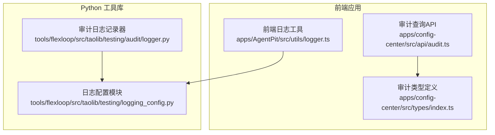
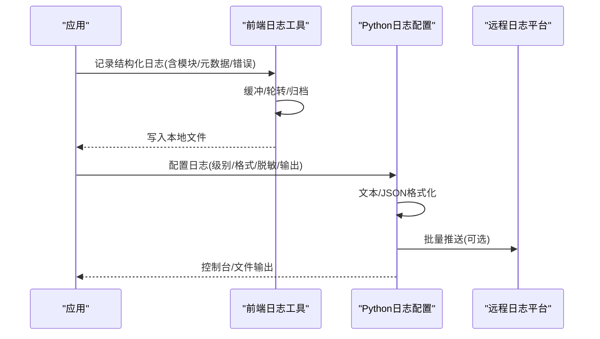
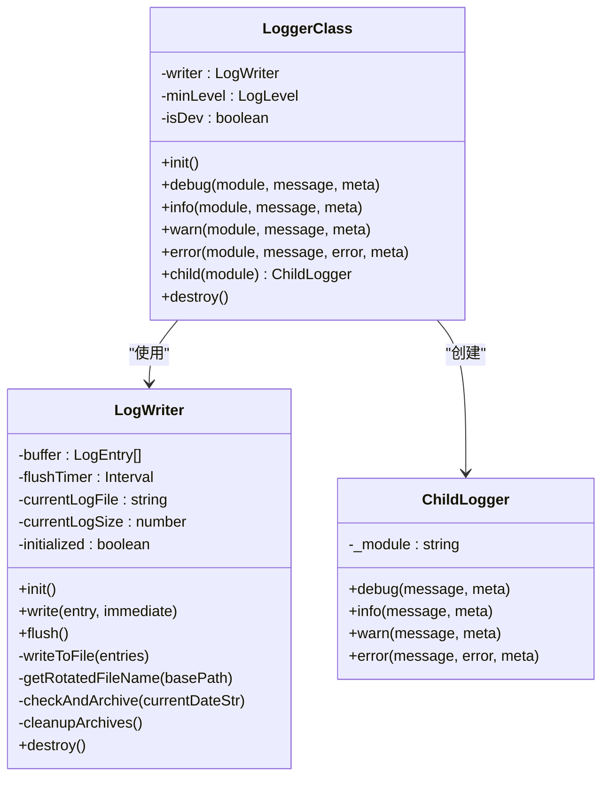
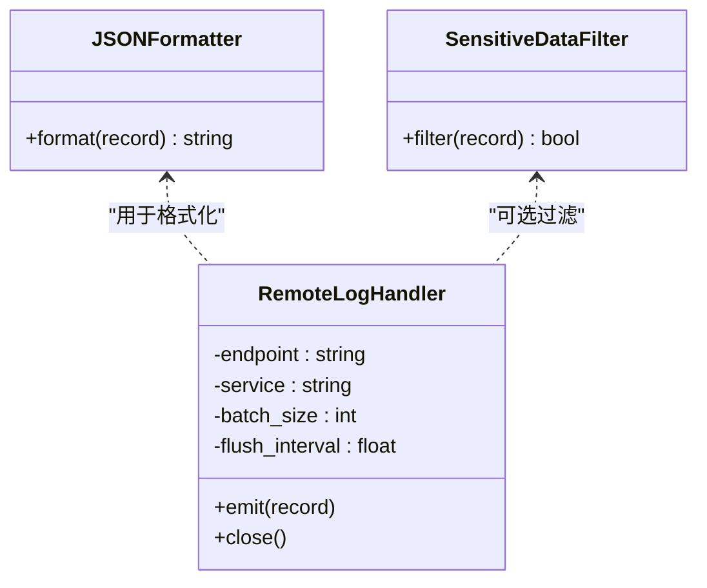
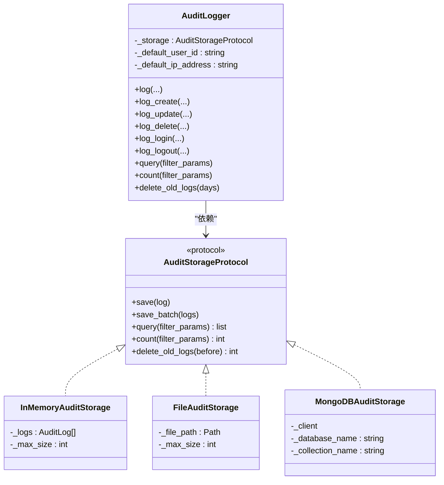
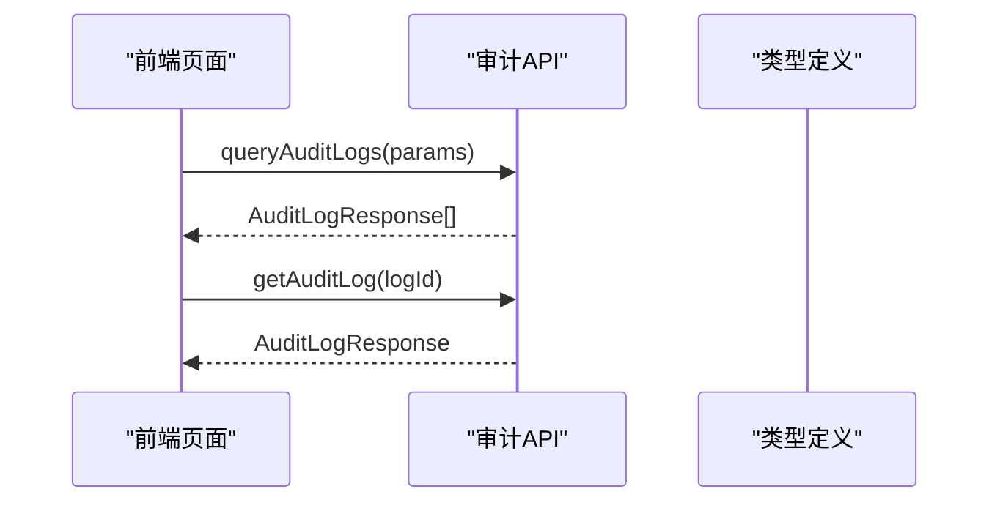
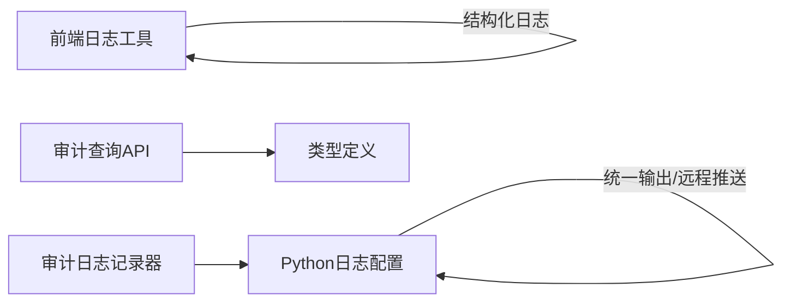

# 审计日志记录

<cite>
**本文引用的文件**
- [logger.ts](file://apps/AgentPit/src/utils/logger.ts)
- [logging_config.py](file://tools/flexloop/src/taolib/testing/logging_config.py)
- [audit/logger.py](file://tools/flexloop/src/taolib/testing/audit/logger.py)
- [audit.ts](file://apps/config-center/src/api/audit.ts)
- [index.ts](file://apps/config-center/src/types/index.ts)
- [test_logging_config.py](file://tools/flexloop/tests/testing/test_logging_config.py)
- [test_config_center/test_models_version_audit.py](file://tools/flexloop/tests/testing/test_config_center/test_models_version_audit.py)
</cite>

## 目录
1. [简介](#简介)
2. [项目结构](#项目结构)
3. [核心组件](#核心组件)
4. [架构总览](#架构总览)
5. [详细组件分析](#详细组件分析)
6. [依赖分析](#依赖分析)
7. [性能考虑](#性能考虑)
8. [故障排查指南](#故障排查指南)
9. [结论](#结论)
10. [附录](#附录)

## 简介
本文件面向审计日志记录的技术文档，系统阐述审计日志的生成机制、日志级别与格式规范、输出目标配置、触发条件与处理策略、结构化数据设计、配置示例、日志轮转与存储管理、性能优化以及与外部日志系统的集成与合规性要求。文档基于仓库中已实现的前端日志工具、Python 日志配置与审计日志记录器等组件进行说明，并提供可视化流程图帮助理解。

## 项目结构
围绕审计日志的关键文件分布如下：
- 前端日志工具：提供结构化日志记录、缓冲与轮转、归档清理能力
- Python 日志配置：提供统一日志配置、JSON 格式化、敏感数据脱敏、远程日志推送
- 审计日志记录器：提供审计日志模型、多存储后端（内存/文件/MongoDB）、查询与清理接口
- 审计 API：前端应用对审计日志的查询接口封装
- 类型定义：审计日志响应模型与枚举类型

图表来源
- [logger.ts:1-412](file://apps/AgentPit/src/utils/logger.ts#L1-L412)
- [logging_config.py:1-540](file://tools/flexloop/src/taolib/testing/logging_config.py#L1-L540)
- [audit/logger.py:1-747](file://tools/flexloop/src/taolib/testing/audit/logger.py#L1-L747)
- [audit.ts:1-18](file://apps/config-center/src/api/audit.ts#L1-L18)
- [index.ts:75-91](file://apps/config-center/src/types/index.ts#L75-L91)

章节来源
- [logger.ts:1-412](file://apps/AgentPit/src/utils/logger.ts#L1-L412)
- [logging_config.py:1-540](file://tools/flexloop/src/taolib/testing/logging_config.py#L1-L540)
- [audit/logger.py:1-747](file://tools/flexloop/src/taolib/testing/audit/logger.py#L1-L747)
- [audit.ts:1-18](file://apps/config-center/src/api/audit.ts#L1-L18)
- [index.ts:75-91](file://apps/config-center/src/types/index.ts#L75-L91)

## 核心组件
- 前端日志工具：提供结构化日志条目、按级别输出、缓冲写入、文件轮转与归档清理、即时落盘等能力
- Python 日志配置：提供统一日志配置入口、文本/JSON 格式、敏感数据脱敏、本地文件与控制台输出、远程日志推送
- 审计日志记录器：提供审计日志模型与多存储后端（内存/文件/MongoDB），支持查询、计数、清理过期日志
- 审计 API：前端应用对审计日志的查询接口封装
- 类型定义：审计日志响应模型与枚举类型

章节来源
- [logger.ts:1-412](file://apps/AgentPit/src/utils/logger.ts#L1-L412)
- [logging_config.py:255-336](file://tools/flexloop/src/taolib/testing/logging_config.py#L255-L336)
- [audit/logger.py:470-747](file://tools/flexloop/src/taolib/testing/audit/logger.py#L470-L747)
- [audit.ts:1-18](file://apps/config-center/src/api/audit.ts#L1-L18)
- [index.ts:75-91](file://apps/config-center/src/types/index.ts#L75-L91)

## 架构总览
审计日志的生成与流转涉及前端与后端两条路径：
- 前端路径：应用通过前端日志工具记录结构化日志，按配置写入本地文件并进行轮转与归档
- 后端路径：应用通过 Python 日志配置统一输出，支持 JSON 格式、敏感数据脱敏、远程日志推送；审计日志记录器负责持久化与查询

图表来源
- [logger.ts:374-406](file://apps/AgentPit/src/utils/logger.ts#L374-L406)
- [logging_config.py:255-336](file://tools/flexloop/src/taolib/testing/logging_config.py#L255-L336)
- [logging_config.py:350-486](file://tools/flexloop/src/taolib/testing/logging_config.py#L350-L486)

## 详细组件分析

### 前端日志工具（结构化日志与轮转）
- 结构化日志条目包含时间戳、级别、模块、消息、可选元数据与错误信息
- 支持 DEBUG/INFO/WARN/ERROR 四级别，按开发/生产环境设定最小输出级别
- 写入策略：缓冲满或错误时立即落盘；定时刷新；文件大小超限触发轮转
- 存储与归档：按日期命名日志文件，超期自动移动至 archive 目录，定期清理过期归档
- 配置项：缓冲大小、刷新间隔、最大文件大小、归档保留天数、删除归档天数、日志目录

图表来源
- [logger.ts:279-406](file://apps/AgentPit/src/utils/logger.ts#L279-L406)
- [logger.ts:96-277](file://apps/AgentPit/src/utils/logger.ts#L96-L277)

章节来源
- [logger.ts:1-412](file://apps/AgentPit/src/utils/logger.ts#L1-L412)

### Python 日志配置（统一日志与远程推送）
- 统一日志配置：支持控制台与文件输出，可设置日志级别、日期格式、输出格式（文本/JSON）
- JSON 格式化：输出每行一个 JSON 对象，包含时间戳、级别、记录器名、消息、模块、函数、行号、异常、请求ID等
- 敏感数据脱敏：支持密码、JWT 密钥、API Key、邮箱、手机号、IP 地址等脱敏规则，可自定义规则
- 远程日志推送：通过 HTTP 批量发送到远程日志平台，支持批量大小、刷新间隔、优雅降级与缓冲保护

图表来源
- [logging_config.py:21-54](file://tools/flexloop/src/taolib/testing/logging_config.py#L21-L54)
- [logging_config.py:56-254](file://tools/flexloop/src/taolib/testing/logging_config.py#L56-L254)
- [logging_config.py:350-486](file://tools/flexloop/src/taolib/testing/logging_config.py#L350-L486)

章节来源
- [logging_config.py:255-336](file://tools/flexloop/src/taolib/testing/logging_config.py#L255-L336)
- [logging_config.py:350-486](file://tools/flexloop/src/taolib/testing/logging_config.py#L350-L486)
- [test_logging_config.py:25-110](file://tools/flexloop/tests/testing/test_logging_config.py#L25-L110)

### 审计日志记录器（模型、存储与查询）
- 审计日志模型：包含操作者、资源类型/ID、动作、状态、时间戳、详情、IP、UA、错误信息等
- 存储后端：内存、文件、MongoDB，均实现统一协议，支持保存、批量保存、查询、计数、删除旧日志
- 查询与过滤：支持按用户ID、动作、资源类型/ID、状态、时间范围、IP 等条件过滤
- 清理策略：按保留天数删除旧日志，避免无限增长

图表来源
- [audit/logger.py:22-77](file://tools/flexloop/src/taolib/testing/audit/logger.py#L22-L77)
- [audit/logger.py:79-184](file://tools/flexloop/src/taolib/testing/audit/logger.py#L79-L184)
- [audit/logger.py:186-323](file://tools/flexloop/src/taolib/testing/audit/logger.py#L186-L323)
- [audit/logger.py:325-468](file://tools/flexloop/src/taolib/testing/audit/logger.py#L325-L468)
- [audit/logger.py:470-747](file://tools/flexloop/src/taolib/testing/audit/logger.py#L470-L747)

章节来源
- [audit/logger.py:470-747](file://tools/flexloop/src/taolib/testing/audit/logger.py#L470-L747)
- [index.ts:75-91](file://apps/config-center/src/types/index.ts#L75-L91)

### 审计查询 API（前端）
- 提供分页查询审计日志的能力，支持按资源类型/ID、操作者、动作、偏移/限制等参数
- 返回结构化审计日志响应模型，包含动作、资源、操作者、状态、时间戳等

图表来源
- [audit.ts:1-18](file://apps/config-center/src/api/audit.ts#L1-L18)
- [index.ts:75-91](file://apps/config-center/src/types/index.ts#L75-L91)

章节来源
- [audit.ts:1-18](file://apps/config-center/src/api/audit.ts#L1-L18)
- [index.ts:75-91](file://apps/config-center/src/types/index.ts#L75-L91)

## 依赖分析
- 前端日志工具与 Python 日志配置相互独立，均可单独使用
- 审计日志记录器依赖 Python 日志配置以实现统一输出与远程推送
- 审计 API 依赖类型定义以保证前后端数据一致性

图表来源
- [logger.ts:1-412](file://apps/AgentPit/src/utils/logger.ts#L1-L412)
- [logging_config.py:1-540](file://tools/flexloop/src/taolib/testing/logging_config.py#L1-L540)
- [audit/logger.py:1-747](file://tools/flexloop/src/taolib/testing/audit/logger.py#L1-L747)
- [audit.ts:1-18](file://apps/config-center/src/api/audit.ts#L1-L18)
- [index.ts:75-91](file://apps/config-center/src/types/index.ts#L75-L91)

章节来源
- [logger.ts:1-412](file://apps/AgentPit/src/utils/logger.ts#L1-L412)
- [logging_config.py:1-540](file://tools/flexloop/src/taolib/testing/logging_config.py#L1-L540)
- [audit/logger.py:1-747](file://tools/flexloop/src/taolib/testing/audit/logger.py#L1-L747)
- [audit.ts:1-18](file://apps/config-center/src/api/audit.ts#L1-L18)
- [index.ts:75-91](file://apps/config-center/src/types/index.ts#L75-L91)

## 性能考虑
- 前端日志
  - 缓冲写入与定时刷新降低磁盘 IO；错误时立即落盘保证可靠性
  - 文件大小阈值触发轮转，避免单文件过大影响读写
  - 归档与删除策略控制磁盘占用，建议结合监控与告警
- Python 日志
  - JSON 格式利于日志聚合系统解析；可通过环境变量切换格式
  - 远程推送采用批量与线程刷新，缓冲上限防止内存膨胀
  - 敏感数据脱敏减少泄露风险，同时保持日志可用性
- 审计日志
  - 多存储后端适配不同场景；MongoDB 可建立索引提升查询性能
  - 批量保存与删除旧日志避免数据无限增长

[本节为通用性能讨论，不直接分析具体文件]

## 故障排查指南
- 前端日志
  - 写入失败：检查日志目录权限与磁盘空间；确认缓冲刷新定时器是否正常
  - 轮转异常：确认文件大小阈值与日期命名规则；检查归档目录是否存在
- Python 日志
  - 远程推送失败：检查网络连通性与认证头；查看优雅降级日志；确认批量大小与刷新间隔
  - 脱敏规则不生效：核对启用开关与自定义规则正则表达式
- 审计日志
  - 存储异常：检查存储后端连接与权限；查看异常堆栈定位问题
  - 查询性能差：确认索引是否创建；优化过滤条件与分页参数

章节来源
- [logger.ts:148-160](file://apps/AgentPit/src/utils/logger.ts#L148-L160)
- [logging_config.py:427-450](file://tools/flexloop/src/taolib/testing/logging_config.py#L427-L450)
- [audit/logger.py:354-383](file://tools/flexloop/src/taolib/testing/audit/logger.py#L354-L383)

## 结论
本仓库提供了从前端到后端的完整审计日志方案：前端日志工具负责结构化记录与本地轮转，Python 日志配置提供统一输出与远程推送，审计日志记录器覆盖多存储后端与查询能力。通过明确的日志级别、格式规范与配置选项，可在保证合规性的前提下满足可观测性与性能需求。

[本节为总结性内容，不直接分析具体文件]

## 附录

### 日志级别定义与触发条件
- 前端日志级别：DEBUG/INFO/WARN/ERROR，按开发/生产环境设定最小输出级别
- Python 日志级别：DEBUG/INFO/WARNING/ERROR/CRITICAL，支持无效级别回退为 INFO
- 触发条件：成功操作（INFO/WARN）、失败操作（ERROR）、异常情况（捕获异常并记录）

章节来源
- [logger.ts:297-299](file://apps/AgentPit/src/utils/logger.ts#L297-L299)
- [test_logging_config.py:78-99](file://tools/flexloop/tests/testing/test_logging_config.py#L78-L99)

### 日志格式规范
- 前端：结构化 JSON，包含时间戳、级别、模块、消息、元数据、错误信息
- Python：文本或 JSON 格式，JSON 包含时间戳、级别、记录器名、消息、模块、函数、行号、异常、请求ID等

章节来源
- [logger.ts:3-14](file://apps/AgentPit/src/utils/logger.ts#L3-L14)
- [logging_config.py:21-54](file://tools/flexloop/src/taolib/testing/logging_config.py#L21-L54)

### 输出目标配置
- 前端：日志目录、缓冲大小、刷新间隔、最大文件大小、归档保留天数、删除归档天数
- Python：控制台/文件输出、日志级别、日期格式、输出格式（text/json）、敏感数据脱敏、远程推送端点与认证

章节来源
- [logger.ts:16-32](file://apps/AgentPit/src/utils/logger.ts#L16-L32)
- [logging_config.py:255-336](file://tools/flexloop/src/taolib/testing/logging_config.py#L255-L336)
- [logging_config.py:488-537](file://tools/flexloop/src/taolib/testing/logging_config.py#L488-L537)

### 日志轮转策略与存储管理
- 前端：按日期命名日志文件，超限轮转；超期自动归档至 archive 目录；定期清理过期归档
- Python：通过远程处理器批量推送，结合本地文件输出与脱敏策略
- 审计日志：内存/文件/MongoDB 多后端，支持删除旧日志与索引优化

章节来源
- [logger.ts:170-209](file://apps/AgentPit/src/utils/logger.ts#L170-L209)
- [logger.ts:221-268](file://apps/AgentPit/src/utils/logger.ts#L221-L268)
- [audit/logger.py:325-468](file://tools/flexloop/src/taolib/testing/audit/logger.py#L325-L468)

### 与外部日志系统的集成
- Python 远程日志推送：HTTP 批量发送，支持认证头、批量大小、刷新间隔与优雅降级
- JSON 格式：便于 ELK/Loki 等日志聚合系统解析

章节来源
- [logging_config.py:350-486](file://tools/flexloop/src/taolib/testing/logging_config.py#L350-L486)

### 合规性要求
- 敏感数据脱敏：密码、JWT 密钥、API Key、邮箱、手机号、IP 地址等
- 审计日志模型：包含操作者、资源、动作、状态、时间戳、详情、IP、UA、错误信息等，满足审计追踪需求

章节来源
- [logging_config.py:56-254](file://tools/flexloop/src/taolib/testing/logging_config.py#L56-L254)
- [audit/logger.py:498-553](file://tools/flexloop/src/taolib/testing/audit/logger.py#L498-L553)
- [index.ts:75-91](file://apps/config-center/src/types/index.ts#L75-L91)