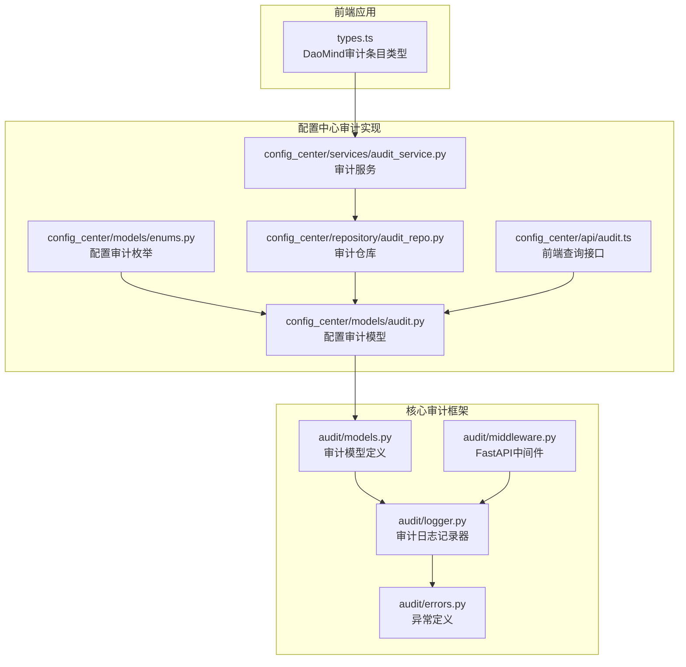
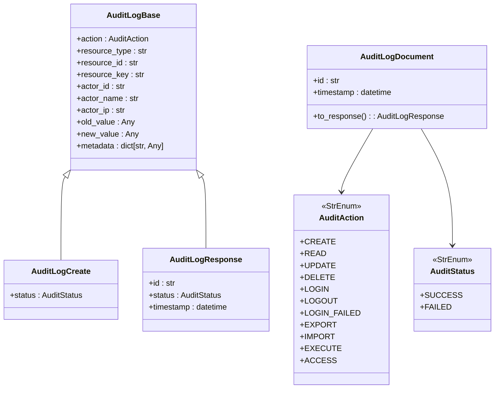
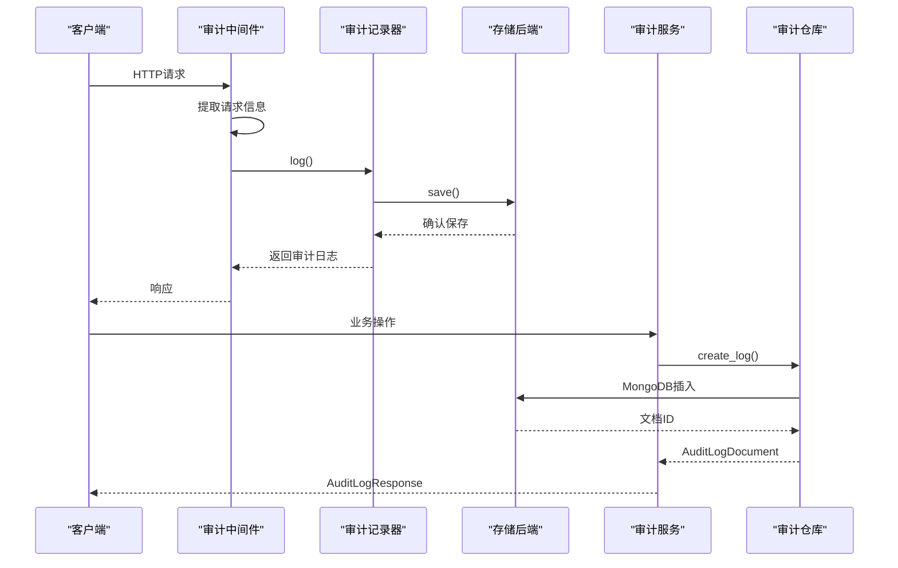
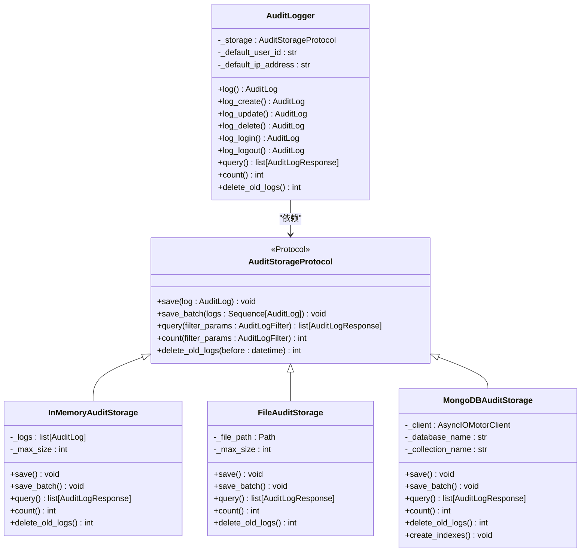
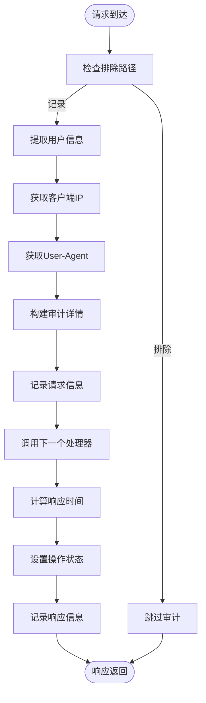
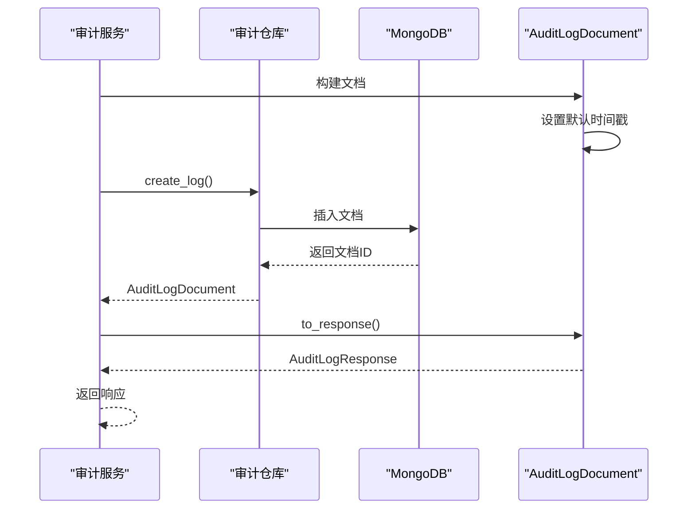
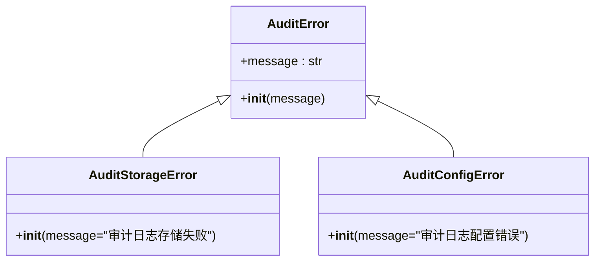
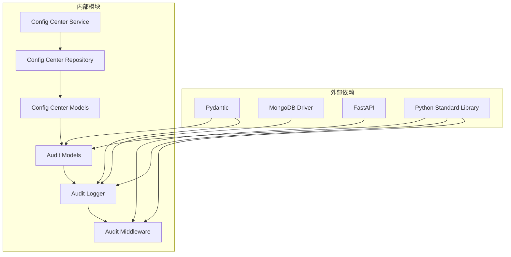

# 审计模型设计

<cite>
**本文档引用的文件**
- [audit/models.py](file://tools/flexloop/src/taolib/testing/audit/models.py)
- [audit/logger.py](file://tools/flexloop/src/taolib/testing/audit/logger.py)
- [audit/errors.py](file://tools/flexloop/src/taolib/testing/audit/errors.py)
- [audit/middleware.py](file://tools/flexloop/src/taolib/testing/audit/middleware.py)
- [config_center/models/audit.py](file://tools/flexloop/src/taolib/testing/config_center/models/audit.py)
- [config_center/models/enums.py](file://tools/flexloop/src/taolib/testing/config_center/models/enums.py)
- [config_center/services/audit_service.py](file://tools/flexloop/src/taolib/testing/config_center/services/audit_service.py)
- [config_center/repository/audit_repo.py](file://tools/flexloop/src/taolib/testing/config_center/repository/audit_repo.py)
- [config_center/api/audit.ts](file://apps/config-center/src/api/audit.ts)
- [test_models_version_audit.py](file://tools/flexloop/tests/testing/test_config_center/test_models_version_audit.py)
- [types.ts](file://apps/DaoMind/packages/daoFeedback/src/types.ts)
</cite>

## 目录
1. [简介](#简介)
2. [项目结构](#项目结构)
3. [核心组件](#核心组件)
4. [架构概览](#架构概览)
5. [详细组件分析](#详细组件分析)
6. [依赖关系分析](#依赖关系分析)
7. [性能考虑](#性能考虑)
8. [故障排除指南](#故障排除指南)
9. [结论](#结论)
10. [附录](#附录)

## 简介

本文档详细阐述了 DAOApps 项目中的审计模型设计，涵盖审计事件的数据结构设计、继承关系与扩展性、错误处理机制以及实际使用示例。该审计系统采用分层架构，结合 Pydantic 数据模型、协议驱动的存储后端、中间件自动采集和多种持久化策略，实现了高可扩展性和强一致性的审计能力。

## 项目结构

审计模型在项目中主要分布在两个区域：

- 核心审计框架：位于 `tools/flexloop/src/taolib/testing/audit/`，提供通用的审计日志模型、存储协议、日志记录器和 FastAPI 中间件。
- 配置中心审计实现：位于 `tools/flexloop/src/taolib/testing/config_center/`，基于核心框架实现配置变更的审计记录，并通过 MongoDB 进行持久化。



**图表来源**
- [audit/models.py:1-199](file://tools/flexloop/src/taolib/testing/audit/models.py#L1-L199)
- [audit/logger.py:1-747](file://tools/flexloop/src/taolib/testing/audit/logger.py#L1-L747)
- [audit/errors.py:1-29](file://tools/flexloop/src/taolib/testing/audit/errors.py#L1-L29)
- [audit/middleware.py:1-275](file://tools/flexloop/src/taolib/testing/audit/middleware.py#L1-L275)
- [config_center/models/audit.py:1-85](file://tools/flexloop/src/taolib/testing/config_center/models/audit.py#L1-L85)
- [config_center/models/enums.py:1-65](file://tools/flexloop/src/taolib/testing/config_center/models/enums.py#L1-L65)
- [config_center/services/audit_service.py:1-112](file://tools/flexloop/src/taolib/testing/config_center/services/audit_service.py#L1-L112)
- [config_center/repository/audit_repo.py:1-103](file://tools/flexloop/src/taolib/testing/config_center/repository/audit_repo.py#L1-L103)
- [config_center/api/audit.ts:1-18](file://apps/config-center/src/api/audit.ts#L1-L18)
- [types.ts:58-66](file://apps/DaoMind/packages/daoFeedback/src/types.ts#L58-L66)

**章节来源**
- [audit/models.py:1-199](file://tools/flexloop/src/taolib/testing/audit/models.py#L1-L199)
- [config_center/models/audit.py:1-85](file://tools/flexloop/src/taolib/testing/config_center/models/audit.py#L1-L85)

## 核心组件

### 审计事件数据结构

审计系统采用分层的数据模型设计，确保数据验证、序列化和持久化的统一性：

- **基础模型层**：定义通用的审计字段和约束
- **请求/响应模型层**：分离输入验证和输出格式
- **文档模型层**：针对特定存储后端的优化表示



**图表来源**
- [audit/models.py:14-70](file://tools/flexloop/src/taolib/testing/audit/models.py#L14-L70)
- [config_center/models/audit.py:14-83](file://tools/flexloop/src/taolib/testing/config_center/models/audit.py#L14-L83)

### 时间戳管理机制

系统采用 UTC 时区统一管理时间戳，确保跨时区部署的一致性：

- **默认时间戳**：使用 `datetime.now(UTC)` 生成当前时间
- **MongoDB 文档映射**：通过 `alias="_id"` 实现 ObjectId 到字符串的转换
- **精确到微秒**：支持高精度的时间排序和查询

**章节来源**
- [audit/models.py:57-59](file://tools/flexloop/src/taolib/testing/audit/models.py#L57-L59)
- [config_center/models/audit.py:60-62](file://tools/flexloop/src/taolib/testing/config_center/models/audit.py#L60-L62)

### 元数据字段规范

元数据系统提供灵活的扩展机制：

- **结构化存储**：使用 `dict[str, Any]` 支持任意键值对
- **默认空字典**：避免空引用问题
- **JSON 序列化**：支持复杂数据类型的持久化

**章节来源**
- [audit/models.py:64-68](file://tools/flexloop/src/taolib/testing/audit/models.py#L64-L68)
- [config_center/models/audit.py:26-27](file://tools/flexloop/src/taolib/testing/config_center/models/audit.py#L26-L27)

## 架构概览

审计系统采用分层架构，实现关注点分离和高度可扩展性：



**图表来源**
- [audit/middleware.py:178-247](file://tools/flexloop/src/taolib/testing/audit/middleware.py#L178-L247)
- [audit/logger.py:498-553](file://tools/flexloop/src/taolib/testing/audit/logger.py#L498-L553)
- [config_center/services/audit_service.py:24-71](file://tools/flexloop/src/taolib/testing/config_center/services/audit_service.py#L24-L71)

## 详细组件分析

### 审计日志记录器

审计记录器是系统的核心组件，提供统一的日志记录接口：



**图表来源**
- [audit/logger.py:22-76](file://tools/flexloop/src/taolib/testing/audit/logger.py#L22-L76)
- [audit/logger.py:79-184](file://tools/flexloop/src/taolib/testing/audit/logger.py#L79-L184)
- [audit/logger.py:186-323](file://tools/flexloop/src/taolib/testing/audit/logger.py#L186-L323)
- [audit/logger.py:325-467](file://tools/flexloop/src/taolib/testing/audit/logger.py#L325-L467)
- [audit/logger.py:470-746](file://tools/flexloop/src/taolib/testing/audit/logger.py#L470-L746)

#### 存储后端特性对比

| 存储类型 | 适用场景 | 特性 | 优点 | 局限性 |
|---------|----------|------|------|--------|
| 内存存储 | 开发/测试 | 临时缓存 | 低延迟、易配置 | 数据不持久、容量有限 |
| 文件存储 | 开发/小规模 | JSON文件 | 简单可靠、易备份 | I/O瓶颈、并发受限 |
| MongoDB存储 | 生产环境 | 分布式、索引 | 高性能、可扩展 | 配置复杂、运维成本 |

**章节来源**
- [audit/logger.py:79-184](file://tools/flexloop/src/taolib/testing/audit/logger.py#L79-L184)
- [audit/logger.py:186-323](file://tools/flexloop/src/taolib/testing/audit/logger.py#L186-L323)
- [audit/logger.py:325-467](file://tools/flexloop/src/taolib/testing/audit/logger.py#L325-L467)

### FastAPI 审计中间件

中间件提供自动化的请求审计能力：



**图表来源**
- [audit/middleware.py:178-247](file://tools/flexloop/src/taolib/testing/audit/middleware.py#L178-L247)

#### 敏感信息保护机制

中间件实现了多层次的敏感信息保护：

- **请求头过滤**：自动屏蔽授权相关头部
- **请求体控制**：根据路径敏感性决定是否记录
- **响应体选择**：默认不记录响应体，避免泄露

**章节来源**
- [audit/middleware.py:27-33](file://tools/flexloop/src/taolib/testing/audit/middleware.py#L27-L33)
- [audit/middleware.py:86-98](file://tools/flexloop/src/taolib/testing/audit/middleware.py#L86-L98)
- [audit/middleware.py:210-221](file://tools/flexloop/src/taolib/testing/audit/middleware.py#L210-L221)

### 配置中心审计实现

配置中心的审计系统专门针对配置变更场景：



**图表来源**
- [config_center/services/audit_service.py:24-71](file://tools/flexloop/src/taolib/testing/config_center/services/audit_service.py#L24-L71)
- [config_center/repository/audit_repo.py:26-37](file://tools/flexloop/src/taolib/testing/config_center/repository/audit_repo.py#L26-L37)
- [config_center/models/audit.py:66-82](file://tools/flexloop/src/taolib/testing/config_center/models/audit.py#L66-L82)

#### 配置审计专用枚举

配置中心使用专门的审计操作类型：

- **CONFIG_CREATE**: 配置创建
- **CONFIG_UPDATE**: 配置更新  
- **CONFIG_DELETE**: 配置删除
- **CONFIG_PUBLISH**: 配置发布
- **CONFIG_ROLLBACK**: 配置回滚
- **USER_LOGIN**: 用户登录
- **USER_LOGOUT**: 用户登出
- **ROLE_ASSIGN**: 角色分配

**章节来源**
- [config_center/models/enums.py:45-62](file://tools/flexloop/src/taolib/testing/config_center/models/enums.py#L45-L62)

### 错误处理机制

系统采用分层的错误处理策略：



**图表来源**
- [audit/errors.py:7-29](file://tools/flexloop/src/taolib/testing/audit/errors.py#L7-L29)

#### 异常传播策略

- **存储层异常**：捕获并包装为 `AuditStorageError`
- **配置层异常**：抛出 `AuditConfigError`
- **中间件异常**：记录日志但不影响请求处理流程

**章节来源**
- [audit/errors.py:1-29](file://tools/flexloop/src/taolib/testing/audit/errors.py#L1-L29)
- [audit/logger.py:364-365](file://tools/flexloop/src/taolib/testing/audit/logger.py#L364-L365)
- [audit/middleware.py:244-245](file://tools/flexloop/src/taolib/testing/audit/middleware.py#L244-L245)

## 依赖关系分析

审计系统的依赖关系清晰且解耦：



**图表来源**
- [audit/logger.py:1-18](file://tools/flexloop/src/taolib/testing/audit/logger.py#L1-L18)
- [config_center/services/audit_service.py:1-11](file://tools/flexloop/src/taolib/testing/config_center/services/audit_service.py#L1-L11)
- [config_center/repository/audit_repo.py:1-12](file://tools/flexloop/src/taolib/testing/config_center/repository/audit_repo.py#L1-L12)

### 数据验证规则

系统在多个层面实施数据验证：

- **字段长度限制**：如 `resource_type` 最大100字符，`resource_key` 最大500字符
- **IP地址格式验证**：支持IPv4和IPv6格式
- **枚举值约束**：确保操作类型和状态的有效性
- **必填字段检查**：使用 `Field(...)` 标记必需字段

**章节来源**
- [audit/models.py:62-68](file://tools/flexloop/src/taolib/testing/audit/models.py#L62-L68)
- [config_center/models/audit.py:18-23](file://tools/flexloop/src/taolib/testing/config_center/models/audit.py#L18-L23)

### 序列化格式

系统支持多种序列化格式：

- **JSON序列化**：用于网络传输和文件存储
- **MongoDB BSON**：用于数据库存储优化
- **Pydantic模型验证**：确保数据结构一致性

**章节来源**
- [audit/logger.py:233-235](file://tools/flexloop/src/taolib/testing/audit/logger.py#L233-L235)
- [audit/logger.py:360-361](file://tools/flexloop/src/taolib/testing/audit/logger.py#L360-L361)

### 持久化策略

系统提供灵活的持久化选项：

- **MongoDB集成**：生产环境推荐，支持索引和TTL
- **文件存储**：开发环境使用，简单可靠
- **内存存储**：测试环境使用，快速高效

**章节来源**
- [config_center/repository/audit_repo.py:89-100](file://tools/flexloop/src/taolib/testing/config_center/repository/audit_repo.py#L89-L100)
- [audit/logger.py:431-437](file://tools/flexloop/src/taolib/testing/audit/logger.py#L431-L437)

## 性能考虑

### 查询优化

- **索引策略**：MongoDB集合创建多字段复合索引
- **TTL索引**：自动清理90天前的日志数据
- **分页查询**：限制每次查询返回的数量

### 批量处理

- **批量写入**：支持批量保存审计日志
- **内存管理**：内存存储实现大小限制和自动清理

### 缓存策略

- **响应缓存**：中间件自动缓存敏感信息
- **连接池**：MongoDB连接池优化数据库访问

## 故障排除指南

### 常见问题诊断

1. **审计日志未记录**
   - 检查中间件是否正确安装
   - 验证排除路径配置
   - 确认存储后端可用性

2. **MongoDB连接失败**
   - 检查连接字符串配置
   - 验证网络连通性
   - 确认数据库权限

3. **数据验证错误**
   - 检查字段长度限制
   - 验证枚举值有效性
   - 确认必填字段完整性

### 调试建议

- 启用详细日志记录
- 使用单元测试验证模型
- 监控存储后端性能指标

**章节来源**
- [audit/logger.py:223-225](file://tools/flexloop/src/taolib/testing/audit/logger.py#L223-L225)
- [audit/middleware.py:150-162](file://tools/flexloop/src/taolib/testing/audit/middleware.py#L150-L162)

## 结论

DAOApps 的审计模型设计体现了现代软件工程的最佳实践：

- **模块化设计**：清晰的分层架构便于维护和扩展
- **协议驱动**：通过存储协议实现后端无关性
- **强类型系统**：Pydantic模型确保数据完整性
- **自动化程度高**：中间件自动采集请求信息
- **可扩展性强**：支持多种存储后端和自定义扩展

该设计为项目的审计需求提供了坚实的基础，支持从开发到生产的全生命周期使用。

## 附录

### 使用示例

#### 创建审计事件

```typescript
// 前端查询审计日志
const logs = await queryAuditLogs({
  resource_type: 'config',
  resource_id: 'config-123',
  skip: 0,
  limit: 50
});
```

#### 设置上下文信息

```typescript
// DaoMind 审计条目
interface AuditEntry {
  readonly stage: 'perceive' | 'aggregate' | 'harmonize' | 'return';
  readonly timestamp: number;
  readonly nodeId: string;
  readonly action: string;
  readonly data: unknown;
}
```

#### 处理审计失败场景

```python
# Python 审计日志记录
try:
    audit_logger.log(
        action='create',
        resource_type='user',
        resource_id='user-1',
        user_id='admin'
    )
except AuditStorageError as e:
    logger.error(f"Audit storage failed: {e}")
    # 处理存储失败逻辑
```

**章节来源**
- [config_center/api/audit.ts:4-17](file://apps/config-center/src/api/audit.ts#L4-L17)
- [types.ts:58-66](file://apps/DaoMind/packages/daoFeedback/src/types.ts#L58-L66)
- [audit/logger.py:528-553](file://tools/flexloop/src/taolib/testing/audit/logger.py#L528-L553)