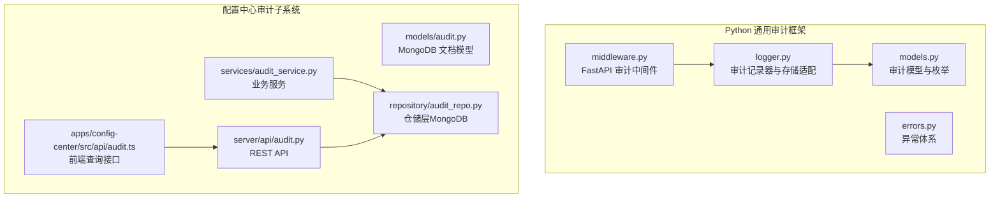
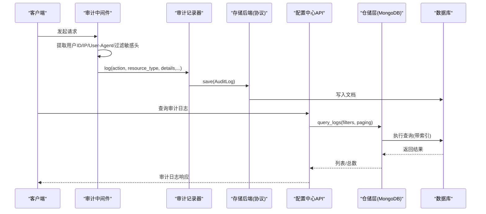
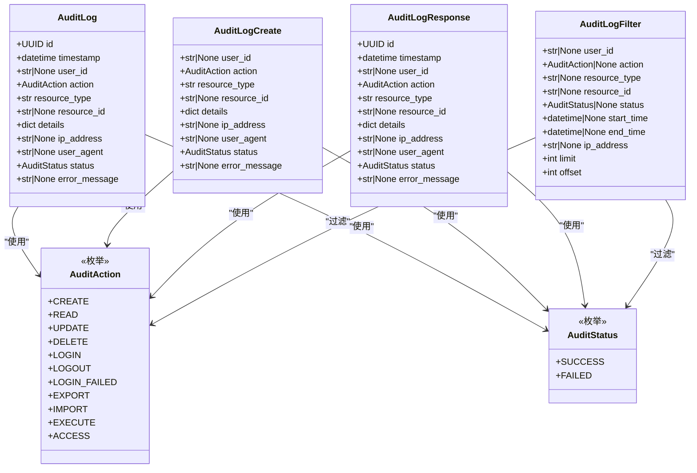
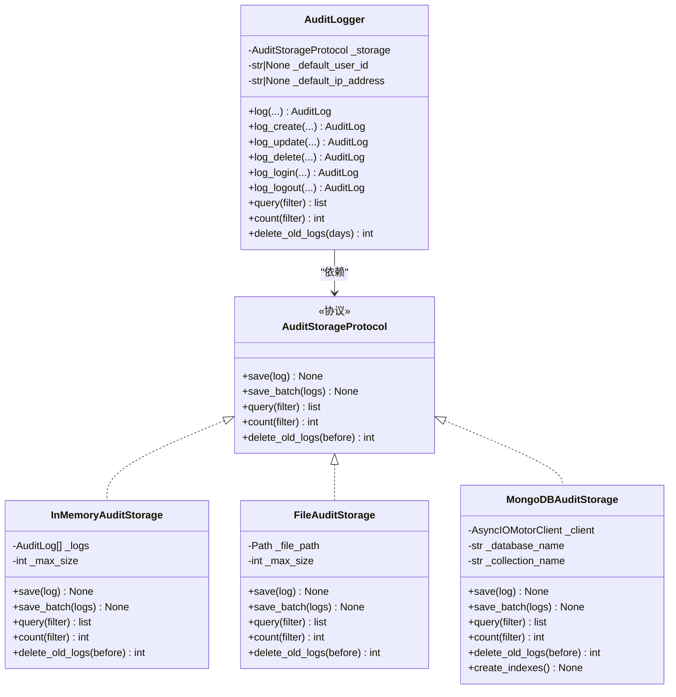
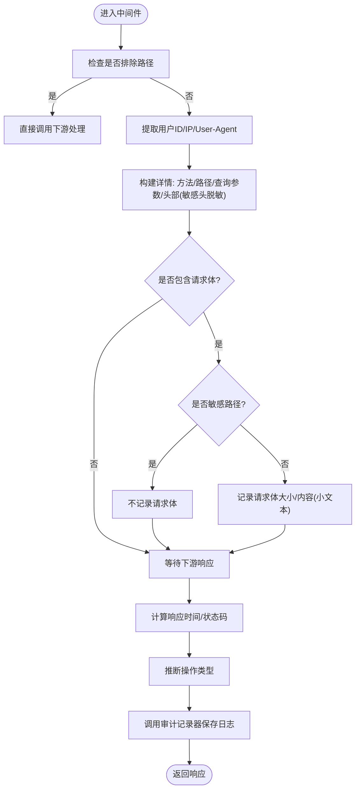
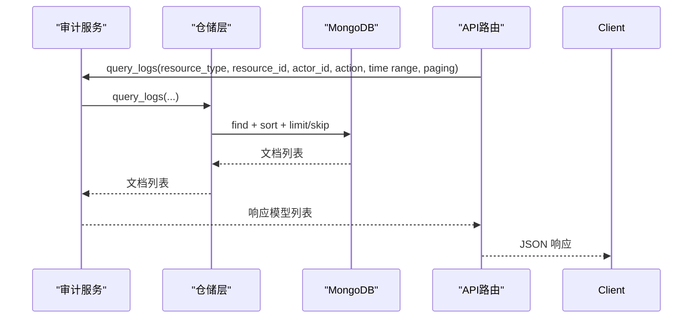
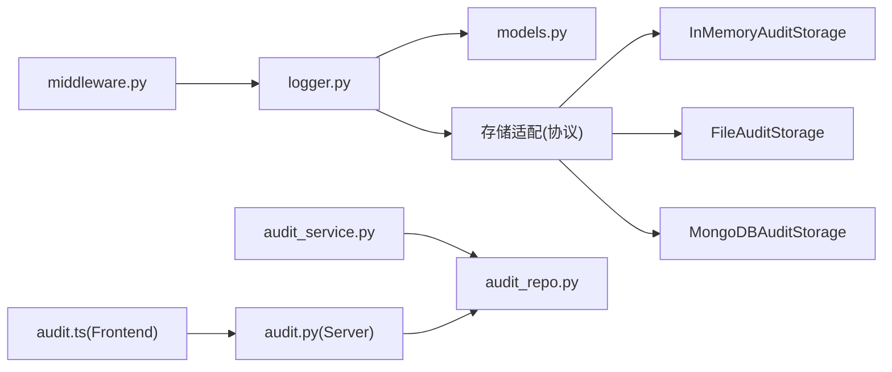

# 审计系统

<cite>
**本文引用的文件**
- [logger.py](file://tools/flexloop/src/taolib/testing/audit/logger.py)
- [models.py](file://tools/flexloop/src/taolib/testing/audit/models.py)
- [middleware.py](file://tools/flexloop/src/taolib/testing/audit/middleware.py)
- [errors.py](file://tools/flexloop/src/taolib/testing/audit/errors.py)
- [audit.ts](file://apps/config-center/src/api/audit.ts)
- [audit_service.py](file://tools/flexloop/src/taolib/testing/config_center/services/audit_service.py)
- [audit.py](file://tools/flexloop/src/taolib/testing/config_center/server/api/audit.py)
- [audit_repo.py](file://tools/flexloop/src/taolib/testing/config_center/repository/audit_repo.py)
- [audit.py](file://tools/flexloop/src/taolib/testing/config_center/models/audit.py)
- [safety.ts](file://apps/DaoMind/packages/daoFeedback/src/safety.ts)
</cite>

## 目录
1. [简介](#简介)
2. [项目结构](#项目结构)
3. [核心组件](#核心组件)
4. [架构总览](#架构总览)
5. [组件详解](#组件详解)
6. [依赖关系分析](#依赖关系分析)
7. [性能考量](#性能考量)
8. [故障排查指南](#故障排查指南)
9. [结论](#结论)
10. [附录](#附录)

## 简介
本技术文档面向“审计系统”的整体设计与实现，覆盖以下方面：
- 审计事件捕获：自动中间件拦截、上下文信息采集、敏感信息过滤与异常处理
- 数据记录与模型：审计事件结构、元数据字段、时间戳管理
- 仓库模式与持久化：事件持久化、查询接口、统计分析、索引与保留策略
- 中间件实现：自动审计拦截、上下文信息收集、异常处理
- 配置示例：审计规则、敏感信息过滤、保留策略
- 性能优化、存储管理与隐私保护
- 合规性与审计报告生成

## 项目结构
审计系统由两套实现并行存在：
- 基于 Python 的通用审计框架（工具库），提供协议化存储、中间件、模型与异常体系
- 基于 Python 的配置中心审计子系统（服务层+仓储层+API层），提供 MongoDB 存储、查询与索引

**图表来源**
- [models.py:1-199](file://tools/flexloop/src/taolib/testing/audit/models.py#L1-L199)
- [logger.py:1-747](file://tools/flexloop/src/taolib/testing/audit/logger.py#L1-L747)
- [middleware.py:1-275](file://tools/flexloop/src/taolib/testing/audit/middleware.py#L1-L275)
- [errors.py:1-29](file://tools/flexloop/src/taolib/testing/audit/errors.py#L1-L29)
- [audit.py:1-85](file://tools/flexloop/src/taolib/testing/config_center/models/audit.py#L1-L85)
- [audit_repo.py:1-103](file://tools/flexloop/src/taolib/testing/config_center/repository/audit_repo.py#L1-L103)
- [audit_service.py:1-112](file://tools/flexloop/src/taolib/testing/config_center/services/audit_service.py#L1-L112)
- [audit.py:1-88](file://tools/flexloop/src/taolib/testing/config_center/server/api/audit.py#L1-L88)
- [audit.ts:1-18](file://apps/config-center/src/api/audit.ts#L1-L18)

**章节来源**
- [models.py:1-199](file://tools/flexloop/src/taolib/testing/audit/models.py#L1-L199)
- [logger.py:1-747](file://tools/flexloop/src/taolib/testing/audit/logger.py#L1-L747)
- [middleware.py:1-275](file://tools/flexloop/src/taolib/testing/audit/middleware.py#L1-L275)
- [errors.py:1-29](file://tools/flexloop/src/taolib/testing/audit/errors.py#L1-L29)
- [audit.py:1-85](file://tools/flexloop/src/taolib/testing/config_center/models/audit.py#L1-L85)
- [audit_repo.py:1-103](file://tools/flexloop/src/taolib/testing/config_center/repository/audit_repo.py#L1-L103)
- [audit_service.py:1-112](file://tools/flexloop/src/taolib/testing/config_center/services/audit_service.py#L1-L112)
- [audit.py:1-88](file://tools/flexloop/src/taolib/testing/config_center/server/api/audit.py#L1-L88)
- [audit.ts:1-18](file://apps/config-center/src/api/audit.ts#L1-L18)

## 核心组件
- 审计模型与枚举：统一定义操作类型、状态、日志结构与过滤器
- 审计记录器：封装日志创建、批量写入、查询、统计与清理
- 存储适配：内存、文件、MongoDB 三种后端，统一协议接口
- FastAPI 中间件：自动拦截 API 请求，提取上下文，过滤敏感信息，记录审计日志
- 配置中心审计子系统：基于 MongoDB 的仓储层、服务层与 API 层，提供查询与索引

**章节来源**
- [models.py:14-199](file://tools/flexloop/src/taolib/testing/audit/models.py#L14-L199)
- [logger.py:470-747](file://tools/flexloop/src/taolib/testing/audit/logger.py#L470-L747)
- [middleware.py:101-275](file://tools/flexloop/src/taolib/testing/audit/middleware.py#L101-L275)
- [audit.py:14-85](file://tools/flexloop/src/taolib/testing/config_center/models/audit.py#L14-L85)
- [audit_repo.py:15-103](file://tools/flexloop/src/taolib/testing/config_center/repository/audit_repo.py#L15-L103)
- [audit_service.py:13-112](file://tools/flexloop/src/taolib/testing/config_center/services/audit_service.py#L13-L112)
- [audit.py:15-88](file://tools/flexloop/src/taolib/testing/config_center/server/api/audit.py#L15-L88)

## 架构总览
通用审计框架通过协议化存储与中间件，实现跨系统的审计事件捕获与持久化；配置中心审计子系统在该框架基础上，针对 MongoDB 提供仓储与 API。

**图表来源**
- [middleware.py:178-247](file://tools/flexloop/src/taolib/testing/audit/middleware.py#L178-L247)
- [logger.py:498-553](file://tools/flexloop/src/taolib/testing/audit/logger.py#L498-L553)
- [audit.py:15-57](file://tools/flexloop/src/taolib/testing/config_center/server/api/audit.py#L15-L57)
- [audit_repo.py:39-87](file://tools/flexloop/src/taolib/testing/config_center/repository/audit_repo.py#L39-L87)

## 组件详解

### 审计模型与数据结构
- 操作类型与状态：统一使用枚举，保证跨系统一致性
- 审计日志结构：包含唯一标识、时间戳、用户ID、操作类型、资源类型/ID、详情、IP、UA、状态、错误信息等
- 过滤器与响应：支持多维过滤与分页，响应模型与创建模型分离

**图表来源**
- [models.py:14-199](file://tools/flexloop/src/taolib/testing/audit/models.py#L14-L199)

**章节来源**
- [models.py:14-199](file://tools/flexloop/src/taolib/testing/audit/models.py#L14-L199)

### 审计记录器与存储适配
- 协议化存储：定义统一的存储接口，支持内存、文件、MongoDB 三种后端
- 记录器职责：将输入参数标准化为枚举，构造日志对象并调用存储后端保存
- 批量写入与查询：提供批量保存、分页查询、计数与旧日志清理
- MongoDB 索引：对常用查询维度建立索引，提升查询性能

**图表来源**
- [logger.py:22-77](file://tools/flexloop/src/taolib/testing/audit/logger.py#L22-L77)
- [logger.py:79-468](file://tools/flexloop/src/taolib/testing/audit/logger.py#L79-L468)
- [logger.py:470-747](file://tools/flexloop/src/taolib/testing/audit/logger.py#L470-L747)

**章节来源**
- [logger.py:22-77](file://tools/flexloop/src/taolib/testing/audit/logger.py#L22-L77)
- [logger.py:79-468](file://tools/flexloop/src/taolib/testing/audit/logger.py#L79-L468)
- [logger.py:470-747](file://tools/flexloop/src/taolib/testing/audit/logger.py#L470-L747)

### FastAPI 审计中间件
- 自动拦截：对 API 请求进行拦截，排除健康检查等路径
- 上下文采集：提取用户ID、IP、UA、查询参数、请求头（敏感头过滤）
- 敏感信息处理：默认不记录请求体，敏感路径不记录请求体
- 动作推断：根据方法与路径推断操作类型（读/增/改/删/登录/登出）
- 异常处理：记录失败时的日志并抑制中间件异常影响业务

**图表来源**
- [middleware.py:178-247](file://tools/flexloop/src/taolib/testing/audit/middleware.py#L178-L247)

**章节来源**
- [middleware.py:17-275](file://tools/flexloop/src/taolib/testing/audit/middleware.py#L17-L275)

### 配置中心审计子系统（仓储/服务/API）
- 文档模型：统一的 MongoDB 文档结构，包含操作人、资源、变更前后值、元数据与时间戳
- 仓储层：提供创建、查询、分页排序、索引创建（含 TTL）
- 服务层：封装业务逻辑，对外暴露创建与查询接口
- API 层：提供 REST 查询与详情接口，支持分页与过滤

**图表来源**
- [audit_service.py:73-110](file://tools/flexloop/src/taolib/testing/config_center/services/audit_service.py#L73-L110)
- [audit_repo.py:39-87](file://tools/flexloop/src/taolib/testing/config_center/repository/audit_repo.py#L39-L87)
- [audit.py:15-57](file://tools/flexloop/src/taolib/testing/config_center/server/api/audit.py#L15-L57)

**章节来源**
- [audit.py:14-85](file://tools/flexloop/src/taolib/testing/config_center/models/audit.py#L14-L85)
- [audit_repo.py:15-103](file://tools/flexloop/src/taolib/testing/config_center/repository/audit_repo.py#L15-L103)
- [audit_service.py:13-112](file://tools/flexloop/src/taolib/testing/config_center/services/audit_service.py#L13-L112)
- [audit.py:15-88](file://tools/flexloop/src/taolib/testing/config_center/server/api/audit.py#L15-L88)

### 隐私与合规要点
- 敏感头过滤：中间件默认过滤授权、Cookie、API Key 等敏感头
- 请求体控制：默认不记录请求体，敏感路径明确禁止记录
- 时间戳与索引：统一 UTC 时间戳，MongoDB 建立复合索引与 TTL 索引
- 报告生成：前端提供查询接口，结合服务层与仓储层实现报表导出

**章节来源**
- [middleware.py:27-98](file://tools/flexloop/src/taolib/testing/audit/middleware.py#L27-L98)
- [audit_repo.py:89-100](file://tools/flexloop/src/taolib/testing/config_center/repository/audit_repo.py#L89-L100)
- [audit.ts:1-18](file://apps/config-center/src/api/audit.ts#L1-L18)

## 依赖关系分析
- 通用审计框架内部依赖清晰：中间件依赖记录器，记录器依赖存储协议，模型独立
- 配置中心子系统依赖仓储层，API 层依赖仓储层与依赖注入
- 前端通过 TypeScript 接口调用后端 API

**图表来源**
- [middleware.py:1-275](file://tools/flexloop/src/taolib/testing/audit/middleware.py#L1-L275)
- [logger.py:1-747](file://tools/flexloop/src/taolib/testing/audit/logger.py#L1-L747)
- [models.py:1-199](file://tools/flexloop/src/taolib/testing/audit/models.py#L1-L199)
- [audit_service.py:1-112](file://tools/flexloop/src/taolib/testing/config_center/services/audit_service.py#L1-L112)
- [audit_repo.py:1-103](file://tools/flexloop/src/taolib/testing/config_center/repository/audit_repo.py#L1-L103)
- [audit.py:1-88](file://tools/flexloop/src/taolib/testing/config_center/server/api/audit.py#L1-L88)
- [audit.ts:1-18](file://apps/config-center/src/api/audit.ts#L1-L18)

**章节来源**
- [middleware.py:1-275](file://tools/flexloop/src/taolib/testing/audit/middleware.py#L1-L275)
- [logger.py:1-747](file://tools/flexloop/src/taolib/testing/audit/logger.py#L1-L747)
- [models.py:1-199](file://tools/flexloop/src/taolib/testing/audit/models.py#L1-L199)
- [audit_service.py:1-112](file://tools/flexloop/src/taolib/testing/config_center/services/audit_service.py#L1-L112)
- [audit_repo.py:1-103](file://tools/flexloop/src/taolib/testing/config_center/repository/audit_repo.py#L1-L103)
- [audit.py:1-88](file://tools/flexloop/src/taolib/testing/config_center/server/api/audit.py#L1-L88)
- [audit.ts:1-18](file://apps/config-center/src/api/audit.ts#L1-L18)

## 性能考量
- 存储后端选择：生产建议使用 MongoDB，具备索引与 TTL 能力
- 索引策略：对常用过滤字段建立复合索引，避免全表扫描
- 批量写入：记录器支持批量保存，降低写入开销
- 分页与限制：查询过滤器限制单次返回条数，避免一次性拉取过多
- 请求体控制：默认不记录请求体，敏感路径禁用，减少 IO 与日志体积

**章节来源**
- [logger.py:367-384](file://tools/flexloop/src/taolib/testing/audit/logger.py#L367-L384)
- [audit_repo.py:89-100](file://tools/flexloop/src/taolib/testing/config_center/repository/audit_repo.py#L89-L100)
- [middleware.py:143-148](file://tools/flexloop/src/taolib/testing/audit/middleware.py#L143-L148)

## 故障排查指南
- 存储异常：捕获存储错误并记录日志，不影响主流程
- 中间件异常：记录失败日志并抑制异常传播
- 查询无结果：确认过滤条件与索引是否匹配，检查时间范围与分页参数
- 清理策略：确认保留天数与清理任务执行情况

**章节来源**
- [errors.py:15-26](file://tools/flexloop/src/taolib/testing/audit/errors.py#L15-L26)
- [logger.py:729-744](file://tools/flexloop/src/taolib/testing/audit/logger.py#L729-L744)
- [middleware.py:244-246](file://tools/flexloop/src/taolib/testing/audit/middleware.py#L244-L246)

## 结论
该审计系统通过协议化存储与中间件拦截，实现了跨系统的统一审计能力；配置中心子系统在 MongoDB 上提供了完善的仓储、服务与 API 支撑。结合索引与 TTL、敏感信息过滤与请求体控制，兼顾了性能、隐私与合规需求。建议在生产环境中采用 MongoDB 存储，并配合定期清理与监控，以满足长期运营与审计要求。

## 附录

### 审计配置示例（概念性说明）
- 审计规则
  - 排除路径：健康检查、指标、文档等非业务路径
  - 敏感路径：登录、注册、密码修改等接口不记录请求体
- 敏感信息过滤
  - 请求头：Authorization、Cookie、Set-Cookie、X-API-Key、X-Auth-Token 等脱敏
  - 请求体：默认不记录，仅在必要时开启并限定长度
- 保留策略
  - MongoDB TTL：默认 180 天，可通过索引配置调整
  - 清理任务：按天执行，删除早于阈值的日志

**章节来源**
- [middleware.py:17-98](file://tools/flexloop/src/taolib/testing/audit/middleware.py#L17-L98)
- [audit_repo.py:96-100](file://tools/flexloop/src/taolib/testing/config_center/repository/audit_repo.py#L96-L100)
- [logger.py:729-744](file://tools/flexloop/src/taolib/testing/audit/logger.py#L729-L744)

### 审计报告生成（概念性说明）
- 查询接口：前端通过查询接口获取审计日志，支持按资源、操作人、时间范围与动作过滤
- 报表导出：结合服务层与仓储层，可将查询结果导出为 CSV/Excel 等格式
- 合规报告：依据法规要求生成固定周期的合规审计报告

**章节来源**
- [audit.ts:1-18](file://apps/config-center/src/api/audit.ts#L1-L18)
- [audit.py:15-57](file://tools/flexloop/src/taolib/testing/config_center/server/api/audit.py#L15-L57)

### 安全与可追溯性（DaoMind 安全机制）
- 审计链：按阶段记录操作，支持完整性校验与缺口检测
- 共识机制：提案与投票，确保关键变更的共识
- 快照与回滚：稳定态快照与校验，支持回滚
- 重分发：对未确认节点进行重分发与跟踪

**章节来源**
- [safety.ts:96-178](file://apps/DaoMind/packages/daoFeedback/src/safety.ts#L96-L178)
- [safety.ts:180-266](file://apps/DaoMind/packages/daoFeedback/src/safety.ts#L180-L266)
- [safety.ts:267-320](file://apps/DaoMind/packages/daoFeedback/src/safety.ts#L267-L320)
- [safety.ts:321-388](file://apps/DaoMind/packages/daoFeedback/src/safety.ts#L321-L388)
- [safety.ts:390-436](file://apps/DaoMind/packages/daoFeedback/src/safety.ts#L390-L436)