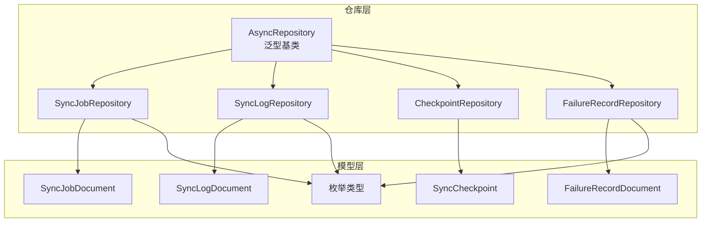
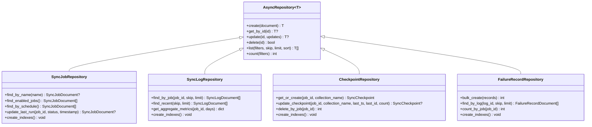
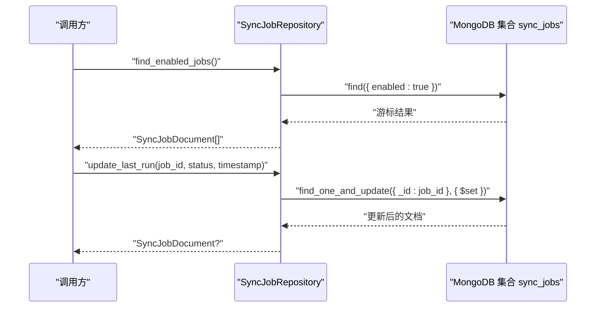
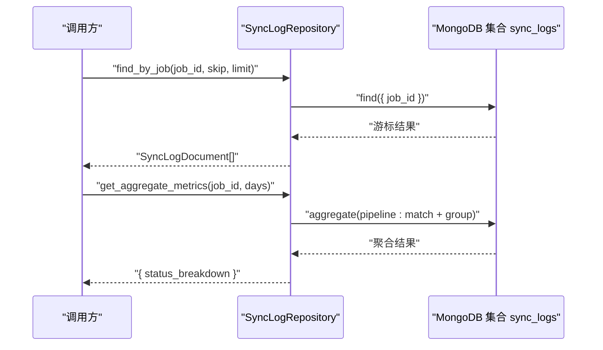
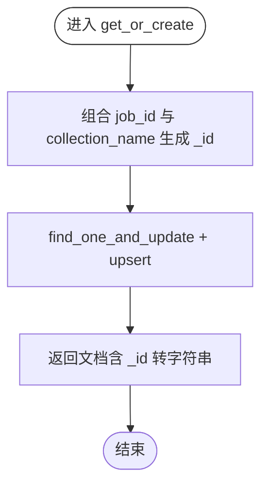
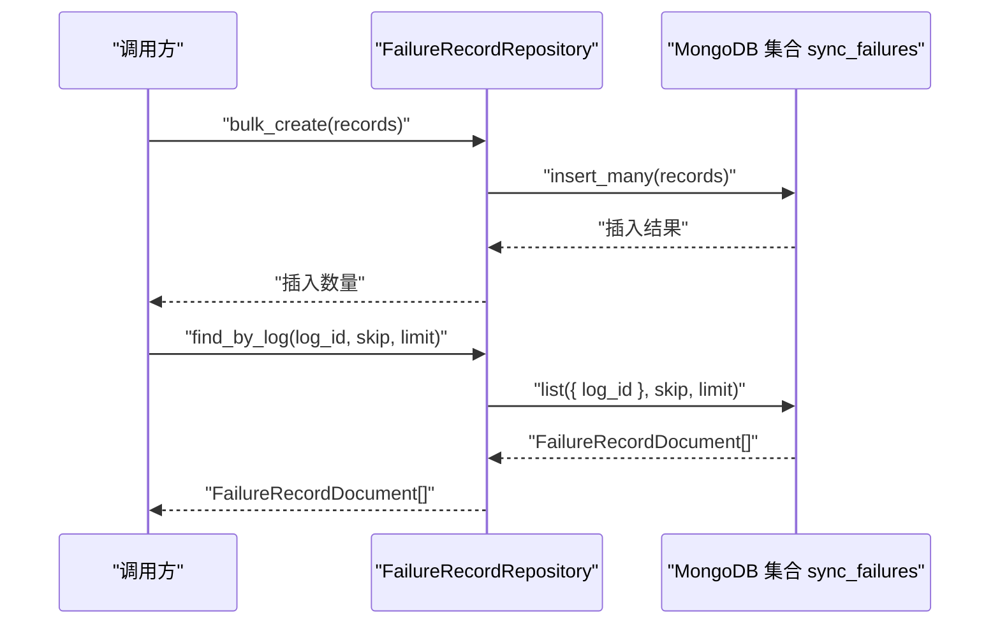
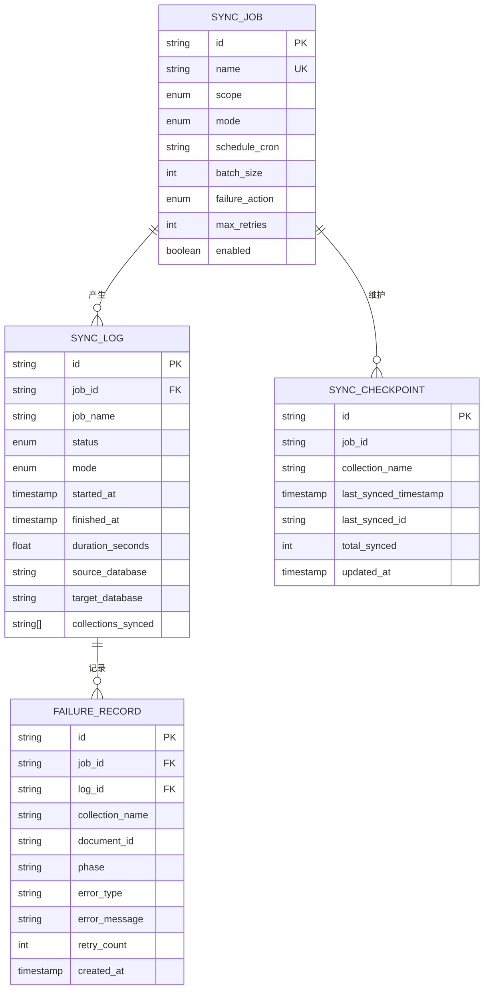
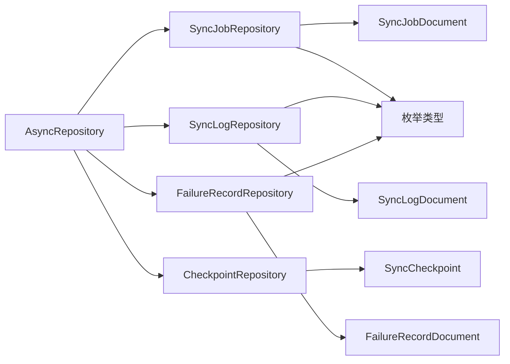

# 仓库模式

<cite>
**本文引用的文件**
- [仓库基类 AsyncRepository](file://tools/flexloop/src/taolib/testing/_base/repository.py)
- [检查点仓库 CheckpointRepository](file://tools/flexloop/src/taolib/testing/data_sync/repository/checkpoint_repo.py)
- [失败记录仓库 FailureRecordRepository](file://tools/flexloop/src/taolib/testing/data_sync/repository/failure_repo.py)
- [作业仓库 SyncJobRepository](file://tools/flexloop/src/taolib/testing/data_sync/repository/job_repo.py)
- [日志仓库 SyncLogRepository](file://tools/flexloop/src/taolib/testing/data_sync/repository/log_repo.py)
- [检查点数据模型 SyncCheckpoint](file://tools/flexloop/src/taolib/testing/data_sync/models/checkpoint.py)
- [失败记录数据模型 FailureRecordDocument](file://tools/flexloop/src/taolib/testing/data_sync/models/failure.py)
- [作业数据模型 SyncJobDocument](file://tools/flexloop/src/taolib/testing/data_sync/models/job.py)
- [日志数据模型 SyncLogDocument](file://tools/flexloop/src/taolib/testing/data_sync/models/log.py)
- [枚举类型定义](file://tools/flexloop/src/taolib/testing/data_sync/models/enums.py)
- [仓库层导出入口](file://tools/flexloop/src/taolib/testing/data_sync/repository/__init__.py)
- [数据同步仓库单元测试](file://tools/flexloop/tests/testing/test_data_sync/test_repository.py)
</cite>

## 目录
1. [简介](#简介)
2. [项目结构](#项目结构)
3. [核心组件](#核心组件)
4. [架构总览](#架构总览)
5. [详细组件分析](#详细组件分析)
6. [依赖分析](#依赖分析)
7. [性能考虑](#性能考虑)
8. [故障排查指南](#故障排查指南)
9. [结论](#结论)
10. [附录](#附录)

## 简介
本文件系统性阐述仓库模式在数据同步子系统中的应用与实现，覆盖以下主题：
- 数据持久化：基于异步 MongoDB 访问，统一的 CRUD 能力与模型绑定
- 查询优化：索引设计、聚合查询与分页策略
- 事务管理：MongoDB 事务语义与并发控制要点
- 仓库职责：检查点仓库、失败记录仓库、作业仓库、日志仓库的职责边界与协作
- 数据模型：实体关系、字段约束与索引策略
- 错误处理与重试：失败记录、重试计数与故障恢复
- 性能调优：批量写入、TTL 策略与查询优化技巧

## 项目结构
仓库层位于数据同步子系统，采用“泛型基类 + 具体仓库”的分层组织方式：
- 泛型基类 AsyncRepository 提供统一的异步 CRUD 与查询能力
- 四个具体仓库分别对应四大核心实体：作业、日志、检查点、失败记录
- 数据模型使用 Pydantic 定义，确保入库/出参的一致性与校验
- 枚举类型集中定义同步状态、范围、模式与失败动作等域语义

图表来源
- [仓库基类 AsyncRepository:15-131](file://tools/flexloop/src/taolib/testing/_base/repository.py#L15-L131)
- [检查点仓库 CheckpointRepository:15-111](file://tools/flexloop/src/taolib/testing/data_sync/repository/checkpoint_repo.py#L15-L111)
- [失败记录仓库 FailureRecordRepository:12-83](file://tools/flexloop/src/taolib/testing/data_sync/repository/failure_repo.py#L12-L83)
- [作业仓库 SyncJobRepository:12-74](file://tools/flexloop/src/taolib/testing/data_sync/repository/job_repo.py#L12-L74)
- [日志仓库 SyncLogRepository:15-110](file://tools/flexloop/src/taolib/testing/data_sync/repository/log_repo.py#L15-L110)
- [检查点数据模型 SyncCheckpoint:11-25](file://tools/flexloop/src/taolib/testing/data_sync/models/checkpoint.py#L11-L25)
- [失败记录数据模型 FailureRecordDocument:11-29](file://tools/flexloop/src/taolib/testing/data_sync/models/failure.py#L11-L29)
- [作业数据模型 SyncJobDocument:84-125](file://tools/flexloop/src/taolib/testing/data_sync/models/job.py#L84-L125)
- [日志数据模型 SyncLogDocument:57-84](file://tools/flexloop/src/taolib/testing/data_sync/models/log.py#L57-L84)
- [枚举类型定义:9-42](file://tools/flexloop/src/taolib/testing/data_sync/models/enums.py#L9-L42)

章节来源
- [仓库基类 AsyncRepository:1-131](file://tools/flexloop/src/taolib/testing/_base/repository.py#L1-L131)
- [仓库层导出入口:1-18](file://tools/flexloop/src/taolib/testing/data_sync/repository/__init__.py#L1-L18)

## 核心组件
- 异步仓库基类 AsyncRepository：提供 create/get_by_id/update/delete/list/count 等通用能力，统一处理 _id 字段类型转换与模型反序列化
- 作业仓库 SyncJobRepository：围绕 SyncJobDocument 的业务查询（启用、计划任务、运行状态更新）与索引
- 日志仓库 SyncLogRepository：围绕 SyncLogDocument 的查询（按作业、最近日志）、聚合指标与索引
- 检查点仓库 CheckpointRepository：围绕 SyncCheckpoint 的获取/创建、更新、删除与索引
- 失败记录仓库 FailureRecordRepository：围绕 FailureRecordDocument 的批量创建、按日志查询、按作业计数与索引

章节来源
- [仓库基类 AsyncRepository:30-128](file://tools/flexloop/src/taolib/testing/_base/repository.py#L30-L128)
- [作业仓库 SyncJobRepository:23-72](file://tools/flexloop/src/taolib/testing/data_sync/repository/job_repo.py#L23-L72)
- [日志仓库 SyncLogRepository:26-107](file://tools/flexloop/src/taolib/testing/data_sync/repository/log_repo.py#L26-L107)
- [检查点仓库 CheckpointRepository:26-109](file://tools/flexloop/src/taolib/testing/data_sync/repository/checkpoint_repo.py#L26-L109)
- [失败记录仓库 FailureRecordRepository:23-80](file://tools/flexloop/src/taolib/testing/data_sync/repository/failure_repo.py#L23-L80)

## 架构总览
仓库层通过 AsyncRepository 统一抽象，具体仓库仅关注领域语义与查询条件；模型层使用 Pydantic 确保数据一致性；枚举类型统一语义。

图表来源
- [仓库基类 AsyncRepository:15-131](file://tools/flexloop/src/taolib/testing/_base/repository.py#L15-L131)
- [作业仓库 SyncJobRepository:12-74](file://tools/flexloop/src/taolib/testing/data_sync/repository/job_repo.py#L12-L74)
- [日志仓库 SyncLogRepository:15-110](file://tools/flexloop/src/taolib/testing/data_sync/repository/log_repo.py#L15-L110)
- [检查点仓库 CheckpointRepository:15-111](file://tools/flexloop/src/taolib/testing/data_sync/repository/checkpoint_repo.py#L15-L111)
- [失败记录仓库 FailureRecordRepository:12-83](file://tools/flexloop/src/taolib/testing/data_sync/repository/failure_repo.py#L12-L83)

## 详细组件分析

### 作业仓库（SyncJobRepository）
职责与实现要点：
- 名称查询：通过 get_by_id 实现，集合主键即作业名称
- 启用作业查询：filters={enabled: True}
- 计划任务查询：filters={schedule_cron: {"$ne": None}}
- 运行状态更新：update_last_run 写入 last_run_status 与 last_run_at
- 索引策略：name 唯一索引；复合索引用于启用与计划查询

图表来源
- [作业仓库 SyncJobRepository:34-66](file://tools/flexloop/src/taolib/testing/data_sync/repository/job_repo.py#L34-L66)

章节来源
- [作业仓库 SyncJobRepository:23-72](file://tools/flexloop/src/taolib/testing/data_sync/repository/job_repo.py#L23-L72)
- [作业数据模型 SyncJobDocument:84-125](file://tools/flexloop/src/taolib/testing/data_sync/models/job.py#L84-L125)

### 日志仓库（SyncLogRepository）
职责与实现要点：
- 按作业查询：filters={job_id} 并按 started_at 降序
- 最近日志：无过滤按 started_at 降序分页
- 聚合指标：get_aggregate_metrics 使用聚合管道按状态分组统计数量与平均时长
- 索引策略：复合索引支持按作业+时间排序；TTL 索引按 started_at 自动清理

图表来源
- [日志仓库 SyncLogRepository:26-98](file://tools/flexloop/src/taolib/testing/data_sync/repository/log_repo.py#L26-L98)

章节来源
- [日志仓库 SyncLogRepository:26-107](file://tools/flexloop/src/taolib/testing/data_sync/repository/log_repo.py#L26-L107)
- [日志数据模型 SyncLogDocument:57-84](file://tools/flexloop/src/taolib/testing/data_sync/models/log.py#L57-L84)

### 检查点仓库（CheckpointRepository）
职责与实现要点：
- 获取或创建：基于 job_id:collection_name 组合生成 _id，使用 upsert 保证幂等
- 更新检查点：原子更新 last_synced_timestamp、last_synced_id、total_synced 与 updated_at
- 删除作业级检查点：按 job_id 批量删除
- 索引策略：复合唯一索引避免重复检查点

图表来源
- [检查点仓库 CheckpointRepository:26-58](file://tools/flexloop/src/taolib/testing/data_sync/repository/checkpoint_repo.py#L26-L58)

章节来源
- [检查点仓库 CheckpointRepository:26-109](file://tools/flexloop/src/taolib/testing/data_sync/repository/checkpoint_repo.py#L26-L109)
- [检查点数据模型 SyncCheckpoint:11-25](file://tools/flexloop/src/taolib/testing/data_sync/models/checkpoint.py#L11-L25)

### 失败记录仓库（FailureRecordRepository）
职责与实现要点：
- 批量创建：bulk_create 支持高吞吐写入
- 按日志查询：按 log_id 分页查询失败记录
- 按作业计数：统计 job_id 对应失败总数
- 索引策略：复合索引支持作业+日志；TTL 索引按 created_at 清理历史

图表来源
- [失败记录仓库 FailureRecordRepository:23-60](file://tools/flexloop/src/taolib/testing/data_sync/repository/failure_repo.py#L23-L60)

章节来源
- [失败记录仓库 FailureRecordRepository:23-80](file://tools/flexloop/src/taolib/testing/data_sync/repository/failure_repo.py#L23-L80)
- [失败记录数据模型 FailureRecordDocument:11-29](file://tools/flexloop/src/taolib/testing/data_sync/models/failure.py#L11-L29)

### 数据模型与实体关系
- 作业（SyncJobDocument）：包含同步范围、模式、连接配置、调度、批大小、失败处理策略等
- 日志（SyncLogDocument）：记录每次同步的执行状态、开始/结束时间、耗时、数据库信息、已同步集合与指标
- 检查点（SyncCheckpoint）：记录每个作业在各集合上的同步位点（时间戳与文档 ID）
- 失败记录（FailureRecordDocument）：记录失败阶段、异常类型、消息、文档快照与重试计数

图表来源
- [作业数据模型 SyncJobDocument:84-125](file://tools/flexloop/src/taolib/testing/data_sync/models/job.py#L84-L125)
- [日志数据模型 SyncLogDocument:57-84](file://tools/flexloop/src/taolib/testing/data_sync/models/log.py#L57-L84)
- [检查点数据模型 SyncCheckpoint:11-25](file://tools/flexloop/src/taolib/testing/data_sync/models/checkpoint.py#L11-L25)
- [失败记录数据模型 FailureRecordDocument:11-29](file://tools/flexloop/src/taolib/testing/data_sync/models/failure.py#L11-L29)
- [枚举类型定义:9-42](file://tools/flexloop/src/taolib/testing/data_sync/models/enums.py#L9-L42)

章节来源
- [作业数据模型 SyncJobDocument:23-125](file://tools/flexloop/src/taolib/testing/data_sync/models/job.py#L23-L125)
- [日志数据模型 SyncLogDocument:14-84](file://tools/flexloop/src/taolib/testing/data_sync/models/log.py#L14-L84)
- [检查点数据模型 SyncCheckpoint:11-25](file://tools/flexloop/src/taolib/testing/data_sync/models/checkpoint.py#L11-L25)
- [失败记录数据模型 FailureRecordDocument:11-29](file://tools/flexloop/src/taolib/testing/data_sync/models/failure.py#L11-L29)
- [枚举类型定义:9-42](file://tools/flexloop/src/taolib/testing/data_sync/models/enums.py#L9-L42)

## 依赖分析
- 组件耦合：四个具体仓库均依赖 AsyncRepository，降低重复代码，提升内聚性
- 外部依赖：Motor 异步驱动访问 MongoDB，Pydantic 模型进行数据校验与序列化
- 导出入口：仓库层通过 __init__.py 统一导出，便于上层模块按需导入

图表来源
- [仓库基类 AsyncRepository:15-131](file://tools/flexloop/src/taolib/testing/_base/repository.py#L15-L131)
- [仓库层导出入口:6-16](file://tools/flexloop/src/taolib/testing/data_sync/repository/__init__.py#L6-L16)

章节来源
- [仓库层导出入口:1-18](file://tools/flexloop/src/taolib/testing/data_sync/repository/__init__.py#L1-L18)

## 性能考虑
- 批量写入：FailureRecordRepository 提供 bulk_create，适合高并发失败场景
- 索引优化：各仓库在高频查询字段上建立索引，减少扫描成本
- TTL 策略：日志与失败记录集合设置 TTL 索引，自动清理历史数据，控制存储膨胀
- 聚合查询：日志仓库使用聚合管道进行分组统计，避免应用侧二次计算
- 分页与排序：list 方法支持 skip/limit/sort，结合索引可有效支撑分页查询

章节来源
- [失败记录仓库 FailureRecordRepository:23-80](file://tools/flexloop/src/taolib/testing/data_sync/repository/failure_repo.py#L23-L80)
- [日志仓库 SyncLogRepository:67-107](file://tools/flexloop/src/taolib/testing/data_sync/repository/log_repo.py#L67-L107)
- [仓库基类 AsyncRepository:90-128](file://tools/flexloop/src/taolib/testing/_base/repository.py#L90-L128)

## 故障排查指南
- 事务与并发：MongoDB 事务适用于跨集合的强一致写入；单文档更新（如 find_one_and_update）具备原子性，适合检查点与日志状态更新
- 错误记录与重试：失败记录包含 phase、error_type、retry_count 等字段，配合作业的 failure_action 与 max_retries 实现重试策略
- 索引缺失导致慢查询：若发现查询缓慢，优先检查相应仓库的 create_indexes 是否已生效
- TTL 数据清理：确认 expireAfterSeconds 设置合理，避免历史数据占用空间
- 单元测试参考：仓库层提供完备的测试用例，可作为行为验证与回归测试依据

章节来源
- [数据同步仓库单元测试:17-100](file://tools/flexloop/tests/testing/test_data_sync/test_repository.py#L17-L100)
- [作业数据模型 SyncJobDocument:37-42](file://tools/flexloop/src/taolib/testing/data_sync/models/job.py#L37-L42)
- [失败记录数据模型 FailureRecordDocument:23-24](file://tools/flexloop/src/taolib/testing/data_sync/models/failure.py#L23-L24)

## 结论
仓库模式在数据同步子系统中提供了清晰的职责边界与可复用的基础设施能力。通过统一的异步基类、明确的领域仓库与严谨的数据模型，系统实现了：
- 可靠的数据持久化与查询
- 可扩展的索引与聚合优化
- 可观测的失败记录与重试机制
- 可维护的事务与并发控制策略

建议在新增仓库时遵循现有模式：继承 AsyncRepository、定义领域查询方法、在 create_indexes 中声明必要索引，并配套单元测试。

## 附录
- 仓库导出清单：CheckpointRepository、FailureRecordRepository、SyncJobRepository、SyncLogRepository
- 关键流程参考：检查点获取/创建、日志聚合指标、失败记录批量写入

章节来源
- [仓库层导出入口:11-16](file://tools/flexloop/src/taolib/testing/data_sync/repository/__init__.py#L11-L16)