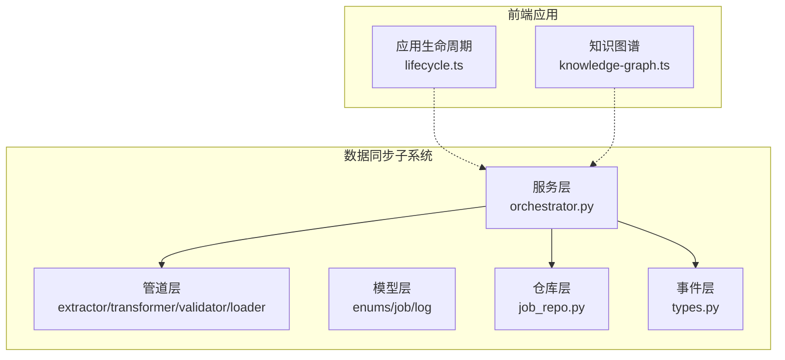
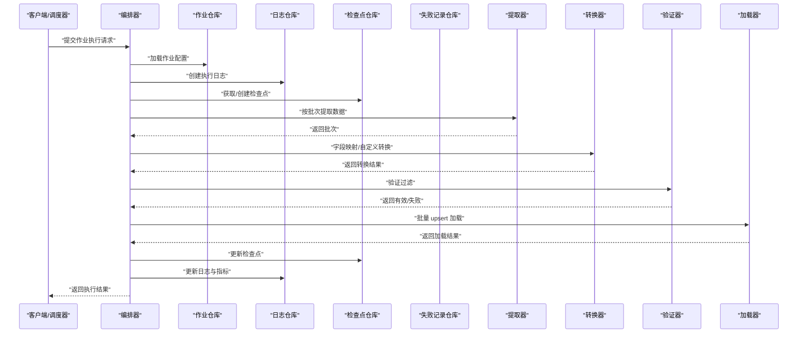
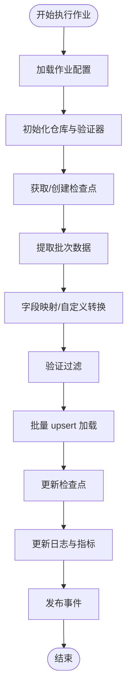
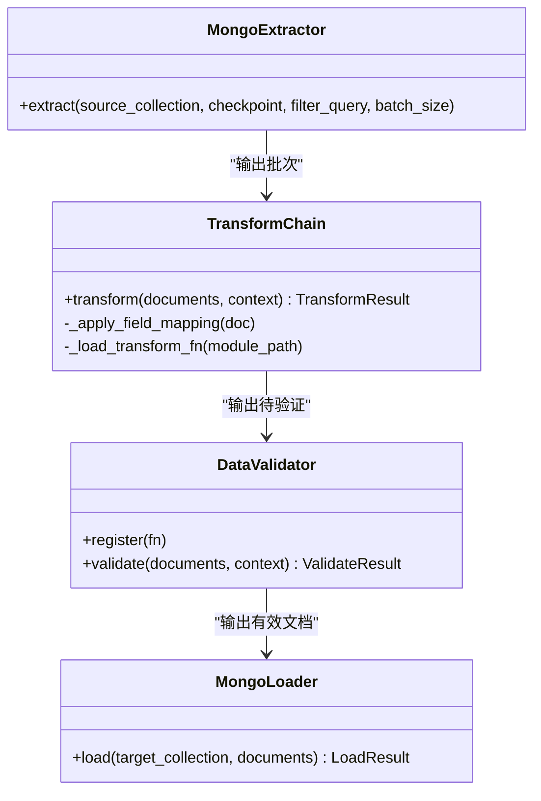
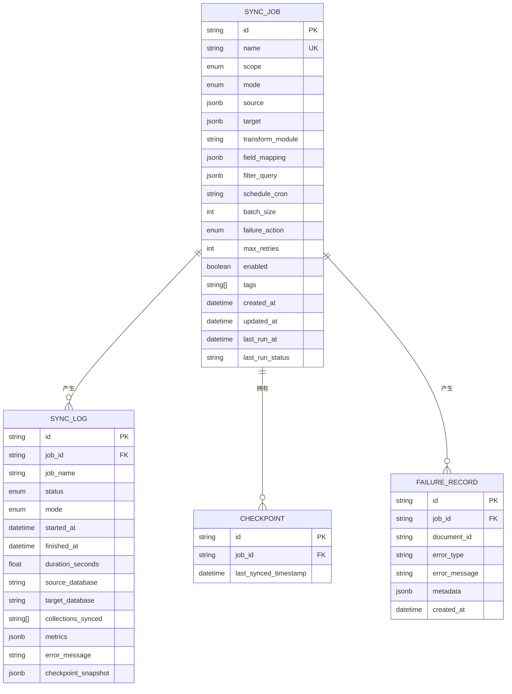
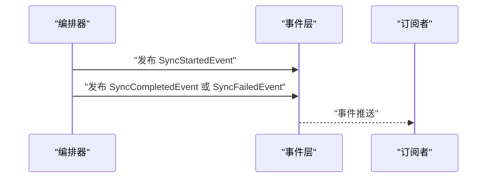
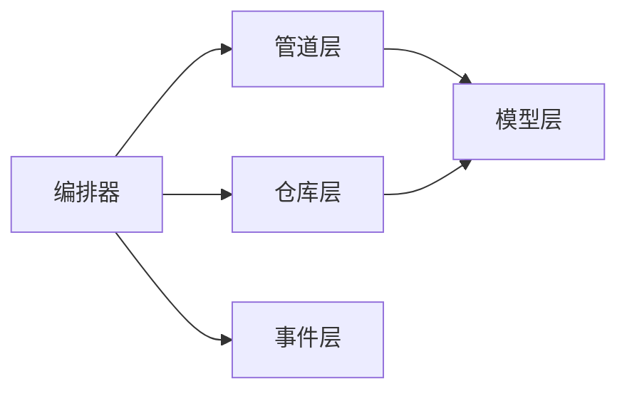

# 数据同步系统

<cite>
**本文引用的文件**
- [orchestrator.py](file://tools/flexloop/src/taolib/testing/data_sync/services/orchestrator.py)
- [protocols.py](file://tools/flexloop/src/taolib/testing/data_sync/pipeline/protocols.py)
- [extractor.py](file://tools/flexloop/src/taolib/testing/data_sync/pipeline/extractor.py)
- [transformer.py](file://tools/flexloop/src/taolib/testing/data_sync/pipeline/transformer.py)
- [loader.py](file://tools/flexloop/src/taolib/testing/data_sync/pipeline/loader.py)
- [validator.py](file://tools/flexloop/src/taolib/testing/data_sync/pipeline/validator.py)
- [enums.py](file://tools/flexloop/src/taolib/testing/data_sync/models/enums.py)
- [job.py](file://tools/flexloop/src/taolib/testing/data_sync/models/job.py)
- [log.py](file://tools/flexloop/src/taolib/testing/data_sync/models/log.py)
- [__init__.py](file://tools/flexloop/src/taolib/testing/data_sync/models/__init__.py)
- [job_repo.py](file://tools/flexloop/src/taolib/testing/data_sync/repository/job_repo.py)
- [__init__.py](file://tools/flexloop/src/taolib/testing/data_sync/repository/__init__.py)
- [types.py](file://tools/flexloop/src/taolib/testing/data_sync/events/types.py)
- [__init__.py](file://tools/flexloop/src/taolib/testing/data_sync/events/__init__.py)
- [base.py](file://tools/flexloop/src/taolib/testing/config_center/repository/base.py)
- [__init__.py](file://tools/flexloop/src/taolib/testing/config_center/repository/__init__.py)
- [lifecycle.ts](file://apps/DaoMind/packages/daoApps/src/lifecycle.ts)
- [base.test.ts](file://apps/DaoMind/packages/daoAgents/src/__tests__/base.test.ts)
- [knowledge-graph.ts](file://apps/DaoMind/packages/daoDocs/src/knowledge-graph.ts)
</cite>

## 目录
1. [简介](#简介)
2. [项目结构](#项目结构)
3. [核心组件](#核心组件)
4. [架构总览](#架构总览)
5. [详细组件分析](#详细组件分析)
6. [依赖分析](#依赖分析)
7. [性能考虑](#性能考虑)
8. [故障排查指南](#故障排查指南)
9. [结论](#结论)
10. [附录](#附录)

## 简介
本技术文档面向“数据同步系统”，围绕以下目标展开：  
- 同步架构设计：同步策略、冲突解决与一致性保障  
- 数据管道实现：提取、转换、加载、验证流程  
- 仓库模式：数据持久化、查询优化与事务管理  
- 服务端实现：API 接口、事件处理与状态管理  
- 数据模型：实体关系、字段约束与索引策略  
- 性能优化、错误处理与监控告警  
- 与其他系统的数据交换格式与集成方式  

该系统以 Python 为主实现语言，采用分层架构（服务层、管道层、模型层、仓库层、事件层），并结合 MongoDB 作为主要存储介质；同时在前端侧提供应用生命周期管理与知识图谱等能力，支撑上层业务。

## 项目结构
本项目包含多应用与工具模块，其中与数据同步直接相关的核心位于 tools/flexloop 下的 data_sync 子系统，并在 apps/DaoMind 中提供应用生命周期与知识图谱等配套能力。

图表来源
- [orchestrator.py:48-120](file://tools/flexloop/src/taolib/testing/data_sync/services/orchestrator.py#L48-L120)
- [extractor.py:17-78](file://tools/flexloop/src/taolib/testing/data_sync/pipeline/extractor.py#L17-L78)
- [transformer.py:17-105](file://tools/flexloop/src/taolib/testing/data_sync/pipeline/transformer.py#L17-L105)
- [validator.py:16-94](file://tools/flexloop/src/taolib/testing/data_sync/pipeline/validator.py#L16-L94)
- [loader.py:18-98](file://tools/flexloop/src/taolib/testing/data_sync/pipeline/loader.py#L18-L98)
- [job_repo.py:12-74](file://tools/flexloop/src/taolib/testing/data_sync/repository/job_repo.py#L12-L74)
- [enums.py:9-42](file://tools/flexloop/src/taolib/testing/data_sync/models/enums.py#L9-L42)
- [job.py:23-125](file://tools/flexloop/src/taolib/testing/data_sync/models/job.py#L23-L125)
- [log.py:25-84](file://tools/flexloop/src/taolib/testing/data_sync/models/log.py#L25-L84)
- [types.py:11-73](file://tools/flexloop/src/taolib/testing/data_sync/events/types.py#L11-L73)
- [lifecycle.ts:9-48](file://apps/DaoMind/packages/daoApps/src/lifecycle.ts#L9-L48)
- [knowledge-graph.ts:103-131](file://apps/DaoMind/packages/daoDocs/src/knowledge-graph.ts#L103-L131)

章节来源
- [orchestrator.py:48-120](file://tools/flexloop/src/taolib/testing/data_sync/services/orchestrator.py#L48-L120)
- [job_repo.py:12-74](file://tools/flexloop/src/taolib/testing/data_sync/repository/job_repo.py#L12-L74)
- [enums.py:9-42](file://tools/flexloop/src/taolib/testing/data_sync/models/enums.py#L9-L42)
- [job.py:23-125](file://tools/flexloop/src/taolib/testing/data_sync/models/job.py#L23-L125)
- [log.py:25-84](file://tools/flexloop/src/taolib/testing/data_sync/models/log.py#L25-L84)
- [types.py:11-73](file://tools/flexloop/src/taolib/testing/data_sync/events/types.py#L11-L73)
- [lifecycle.ts:9-48](file://apps/DaoMind/packages/daoApps/src/lifecycle.ts#L9-L48)
- [knowledge-graph.ts:103-131](file://apps/DaoMind/packages/daoDocs/src/knowledge-graph.ts#L103-L131)

## 核心组件
- 编排器（SyncOrchestrator）：负责加载作业配置、连接源/目标数据库、执行 ETL 流程、更新检查点与日志、处理失败与重试、发布事件。
- 管道层（Extractor/Transformer/Validator/Loader）：实现增量/全量提取、字段映射与自定义转换、验证过滤、批量 upsert 加载。
- 模型层（枚举、作业、日志）：统一状态、范围、模式、失败动作等枚举；定义作业与日志的 Pydantic 模型及文档形态。
- 仓库层（SyncJobRepository 等）：封装 MongoDB 操作，提供索引、查询与更新能力。
- 事件层（SyncStarted/SyncCompleted/SyncFailed）：标准化同步生命周期事件，便于外部订阅与可观测性。

章节来源
- [orchestrator.py:48-120](file://tools/flexloop/src/taolib/testing/data_sync/services/orchestrator.py#L48-L120)
- [protocols.py:14-56](file://tools/flexloop/src/taolib/testing/data_sync/pipeline/protocols.py#L14-L56)
- [extractor.py:17-78](file://tools/flexloop/src/taolib/testing/data_sync/pipeline/extractor.py#L17-L78)
- [transformer.py:17-105](file://tools/flexloop/src/taolib/testing/data_sync/pipeline/transformer.py#L17-L105)
- [validator.py:16-94](file://tools/flexloop/src/taolib/testing/data_sync/pipeline/validator.py#L16-L94)
- [loader.py:18-98](file://tools/flexloop/src/taolib/testing/data_sync/pipeline/loader.py#L18-L98)
- [enums.py:9-42](file://tools/flexloop/src/taolib/testing/data_sync/models/enums.py#L9-L42)
- [job.py:23-125](file://tools/flexloop/src/taolib/testing/data_sync/models/job.py#L23-L125)
- [log.py:25-84](file://tools/flexloop/src/taolib/testing/data_sync/models/log.py#L25-L84)
- [job_repo.py:12-74](file://tools/flexloop/src/taolib/testing/data_sync/repository/job_repo.py#L12-L74)
- [types.py:11-73](file://tools/flexloop/src/taolib/testing/data_sync/events/types.py#L11-L73)

## 架构总览
下图展示了从作业配置到最终加载的完整流程，以及事件发布与日志记录的关键节点。

图表来源
- [orchestrator.py:82-120](file://tools/flexloop/src/taolib/testing/data_sync/services/orchestrator.py#L82-L120)
- [extractor.py:31-78](file://tools/flexloop/src/taolib/testing/data_sync/pipeline/extractor.py#L31-L78)
- [transformer.py:43-105](file://tools/flexloop/src/taolib/testing/data_sync/pipeline/transformer.py#L43-L105)
- [validator.py:45-94](file://tools/flexloop/src/taolib/testing/data_sync/pipeline/validator.py#L45-L94)
- [loader.py:24-98](file://tools/flexloop/src/taolib/testing/data_sync/pipeline/loader.py#L24-L98)
- [job_repo.py:12-74](file://tools/flexloop/src/taolib/testing/data_sync/repository/job_repo.py#L12-L74)
- [log.py:25-84](file://tools/flexloop/src/taolib/testing/data_sync/models/log.py#L25-L84)

## 详细组件分析

### 编排器（SyncOrchestrator）
- 职责：协调 ETL 全流程，管理检查点、日志与失败记录，支持重试与失败动作策略，发布生命周期事件。
- 关键流程：加载作业 → 连接源/目标 → 提取 → 转换 → 验证 → 加载 → 更新检查点 → 记录日志 → 发布事件。
- 错误处理：捕获连接、作业不存在、转换异常等，按失败动作（跳过/重试/中止）决策后续行为。

图表来源
- [orchestrator.py:82-120](file://tools/flexloop/src/taolib/testing/data_sync/services/orchestrator.py#L82-L120)
- [job_repo.py:12-74](file://tools/flexloop/src/taolib/testing/data_sync/repository/job_repo.py#L12-L74)
- [log.py:25-84](file://tools/flexloop/src/taolib/testing/data_sync/models/log.py#L25-L84)

章节来源
- [orchestrator.py:48-120](file://tools/flexloop/src/taolib/testing/data_sync/services/orchestrator.py#L48-L120)

### 管道层组件
- 提取器（MongoExtractor）：支持增量（基于 updated_at）与全量提取，按批次返回，确保排序一致性。
- 转换器（TransformChain）：字段映射 + 可选自定义模块函数转换，异常转为失败记录。
- 验证器（DataValidator）：注册多个验证函数，返回通过/失败列表，失败记录包含快照信息。
- 加载器（MongoLoader）：使用 ReplaceOne + upsert 批量加载，捕获部分失败并生成失败明细。

图表来源
- [extractor.py:17-78](file://tools/flexloop/src/taolib/testing/data_sync/pipeline/extractor.py#L17-L78)
- [transformer.py:17-105](file://tools/flexloop/src/taolib/testing/data_sync/pipeline/transformer.py#L17-L105)
- [validator.py:16-94](file://tools/flexloop/src/taolib/testing/data_sync/pipeline/validator.py#L16-L94)
- [loader.py:18-98](file://tools/flexloop/src/taolib/testing/data_sync/pipeline/loader.py#L18-L98)

章节来源
- [extractor.py:17-78](file://tools/flexloop/src/taolib/testing/data_sync/pipeline/extractor.py#L17-L78)
- [transformer.py:17-105](file://tools/flexloop/src/taolib/testing/data_sync/pipeline/transformer.py#L17-L105)
- [validator.py:16-94](file://tools/flexloop/src/taolib/testing/data_sync/pipeline/validator.py#L16-L94)
- [loader.py:18-98](file://tools/flexloop/src/taolib/testing/data_sync/pipeline/loader.py#L18-L98)

### 模型层与数据持久化
- 枚举（SyncStatus/SyncScope/SyncMode/FailureAction）：统一状态与策略。
- 作业模型（SyncJob*）：定义连接配置、同步范围/模式、过滤/映射、调度、批大小、失败动作与重试等。
- 日志模型（SyncLog*）：记录执行状态、模式、起止时间、耗时、数据库名、已同步集合、指标与检查点快照。
- 仓库层（SyncJobRepository）：提供按名称、启用状态、计划任务等查询，维护索引，更新最后运行状态。

图表来源
- [job.py:23-125](file://tools/flexloop/src/taolib/testing/data_sync/models/job.py#L23-L125)
- [log.py:25-84](file://tools/flexloop/src/taolib/testing/data_sync/models/log.py#L25-L84)
- [enums.py:9-42](file://tools/flexloop/src/taolib/testing/data_sync/models/enums.py#L9-L42)
- [job_repo.py:12-74](file://tools/flexloop/src/taolib/testing/data_sync/repository/job_repo.py#L12-L74)

章节来源
- [enums.py:9-42](file://tools/flexloop/src/taolib/testing/data_sync/models/enums.py#L9-L42)
- [job.py:23-125](file://tools/flexloop/src/taolib/testing/data_sync/models/job.py#L23-L125)
- [log.py:25-84](file://tools/flexloop/src/taolib/testing/data_sync/models/log.py#L25-L84)
- [job_repo.py:12-74](file://tools/flexloop/src/taolib/testing/data_sync/repository/job_repo.py#L12-L74)

### 事件与状态管理
- 事件类型：同步开始、完成、失败，携带作业信息、日志 ID、指标与时间戳。
- 应用生命周期：提供状态变更监听与历史记录，支持回调错误隔离与历史上限控制。
- 知识图谱：统计节点/边数量与平均连接度，辅助知识关联与检索。

图表来源
- [types.py:11-73](file://tools/flexloop/src/taolib/testing/data_sync/events/types.py#L11-L73)
- [lifecycle.ts:9-48](file://apps/DaoMind/packages/daoApps/src/lifecycle.ts#L9-L48)

章节来源
- [types.py:11-73](file://tools/flexloop/src/taolib/testing/data_sync/events/types.py#L11-L73)
- [lifecycle.ts:9-48](file://apps/DaoMind/packages/daoApps/src/lifecycle.ts#L9-L48)
- [knowledge-graph.ts:103-131](file://apps/DaoMind/packages/daoDocs/src/knowledge-graph.ts#L103-L131)

## 依赖分析
- 组件耦合：编排器依赖仓库层与管道层；管道层内部通过协议解耦；模型层为纯数据结构；事件层独立于核心流程。
- 外部依赖：MongoDB（Motor/Pymongo）、Pydantic（模型）、Python 标准库与 typing 扩展。
- 可能的循环依赖：未发现模块间循环导入；各层职责清晰，接口契约明确。

图表来源
- [orchestrator.py:48-120](file://tools/flexloop/src/taolib/testing/data_sync/services/orchestrator.py#L48-L120)
- [job_repo.py:12-74](file://tools/flexloop/src/taolib/testing/data_sync/repository/job_repo.py#L12-L74)
- [extractor.py:17-78](file://tools/flexloop/src/taolib/testing/data_sync/pipeline/extractor.py#L17-L78)
- [transformer.py:17-105](file://tools/flexloop/src/taolib/testing/data_sync/pipeline/transformer.py#L17-L105)
- [validator.py:16-94](file://tools/flexloop/src/taolib/testing/data_sync/pipeline/validator.py#L16-L94)
- [loader.py:18-98](file://tools/flexloop/src/taolib/testing/data_sync/pipeline/loader.py#L18-L98)
- [enums.py:9-42](file://tools/flexloop/src/taolib/testing/data_sync/models/enums.py#L9-L42)
- [job.py:23-125](file://tools/flexloop/src/taolib/testing/data_sync/models/job.py#L23-L125)
- [log.py:25-84](file://tools/flexloop/src/taolib/testing/data_sync/models/log.py#L25-L84)
- [types.py:11-73](file://tools/flexloop/src/taolib/testing/data_sync/events/types.py#L11-L73)

章节来源
- [orchestrator.py:48-120](file://tools/flexloop/src/taolib/testing/data_sync/services/orchestrator.py#L48-L120)
- [job_repo.py:12-74](file://tools/flexloop/src/taolib/testing/data_sync/repository/job_repo.py#L12-L74)
- [extractor.py:17-78](file://tools/flexloop/src/taolib/testing/data_sync/pipeline/extractor.py#L17-L78)
- [transformer.py:17-105](file://tools/flexloop/src/taolib/testing/data_sync/pipeline/transformer.py#L17-L105)
- [validator.py:16-94](file://tools/flexloop/src/taolib/testing/data_sync/pipeline/validator.py#L16-L94)
- [loader.py:18-98](file://tools/flexloop/src/taolib/testing/data_sync/pipeline/loader.py#L18-L98)
- [enums.py:9-42](file://tools/flexloop/src/taolib/testing/data_sync/models/enums.py#L9-L42)
- [job.py:23-125](file://tools/flexloop/src/taolib/testing/data_sync/models/job.py#L23-L125)
- [log.py:25-84](file://tools/flexloop/src/taolib/testing/data_sync/models/log.py#L25-L84)
- [types.py:11-73](file://tools/flexloop/src/taolib/testing/data_sync/events/types.py#L11-L73)

## 性能考虑
- 批处理与游标：提取阶段使用批量游标与排序，减少内存占用与提升吞吐。
- 批量写入：加载阶段使用 ReplaceOne + upsert 的批量写入，降低网络往返与写放大。
- 索引优化：作业仓库创建唯一索引与复合索引，加速查询与筛选。
- 字段映射与验证：在转换阶段尽早剔除无效字段，减少后续验证成本。
- 指标采集：日志模型包含传输字节数与各类计数，便于性能分析与容量规划。
- 并发与重试：编排器支持最大重试次数与失败动作策略，平衡可靠性与资源消耗。

章节来源
- [extractor.py:31-78](file://tools/flexloop/src/taolib/testing/data_sync/pipeline/extractor.py#L31-L78)
- [loader.py:24-98](file://tools/flexloop/src/taolib/testing/data_sync/pipeline/loader.py#L24-L98)
- [job_repo.py:68-74](file://tools/flexloop/src/taolib/testing/data_sync/repository/job_repo.py#L68-L74)
- [log.py:14-41](file://tools/flexloop/src/taolib/testing/data_sync/models/log.py#L14-L41)
- [job.py:36-42](file://tools/flexloop/src/taolib/testing/data_sync/models/job.py#L36-L42)

## 故障排查指南
- 连接与作业：确认 MongoDB 连接字符串、数据库名与集合存在；检查作业是否存在且启用。
- 增量同步：检查检查点 last_synced_timestamp 是否正确更新；确认源集合存在 updated_at 字段。
- 转换失败：查看转换器异常记录与文档快照；核对字段映射与自定义转换模块路径。
- 验证失败：逐条核验验证器返回的错误消息；必要时临时禁用验证定位问题。
- 加载失败：关注部分失败的 writeErrors 明细；检查主键冲突与索引约束。
- 事件与日志：通过事件订阅与日志查询定位异常阶段；结合指标分析耗时与失败率。

章节来源
- [orchestrator.py:82-120](file://tools/flexloop/src/taolib/testing/data_sync/services/orchestrator.py#L82-L120)
- [transformer.py:73-83](file://tools/flexloop/src/taolib/testing/data_sync/pipeline/transformer.py#L73-L83)
- [validator.py:67-91](file://tools/flexloop/src/taolib/testing/data_sync/pipeline/validator.py#L67-L91)
- [loader.py:57-95](file://tools/flexloop/src/taolib/testing/data_sync/pipeline/loader.py#L57-L95)
- [types.py:11-73](file://tools/flexloop/src/taolib/testing/data_sync/events/types.py#L11-L73)
- [log.py:25-84](file://tools/flexloop/src/taolib/testing/data_sync/models/log.py#L25-L84)

## 结论
该数据同步系统以清晰的分层架构与协议化设计实现了高内聚、低耦合的 ETL 流程。通过检查点、重试与失败动作策略保障一致性与可靠性；通过仓库层索引与批量写入优化性能；通过事件与日志体系提供可观测性。前端侧的应用生命周期与知识图谱能力进一步增强了系统的可运维性与业务价值。

## 附录
- 与其他系统集成建议：  
  - API 接口：以作业模型与日志模型为基础，提供创建、查询、更新与删除接口；支持分页与过滤。  
  - 事件集成：通过事件层发布标准事件，供外部系统订阅；事件内容包含作业、日志与指标，便于统一告警。  
  - 数据交换格式：统一使用 JSON Schema（Pydantic）定义模型，确保跨系统一致性；对大字段采用压缩或分片策略。  
  - 监控告警：基于日志指标（耗时、失败率、传输字节数）设置阈值告警；结合事件流实现实时告警推送。  
  - 事务管理：MongoDB 单文档事务可用于单集合内的原子性操作；跨集合/跨数据库需通过幂等设计与补偿机制保障最终一致。