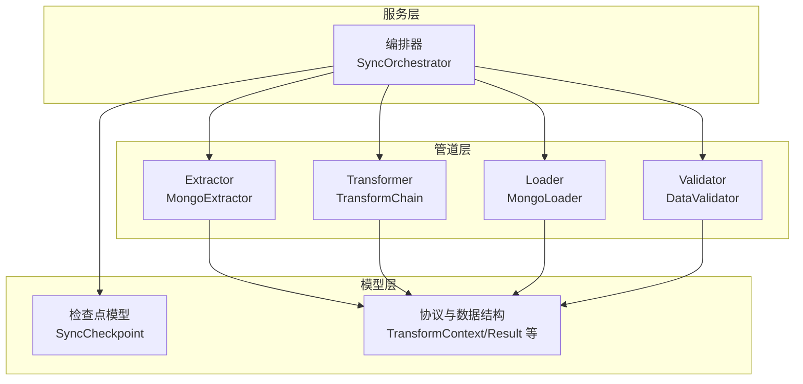
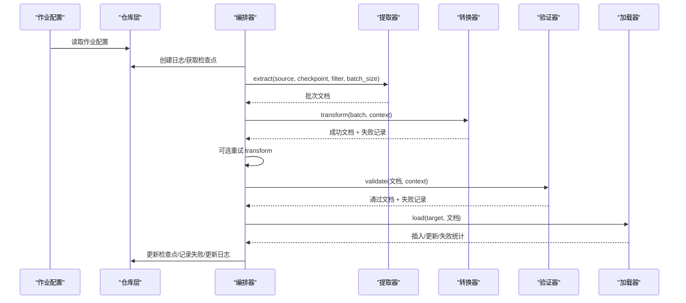
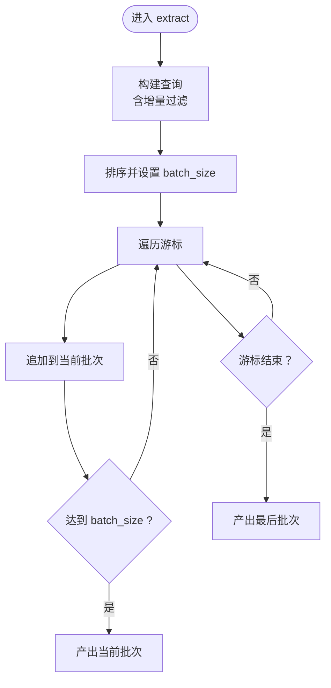
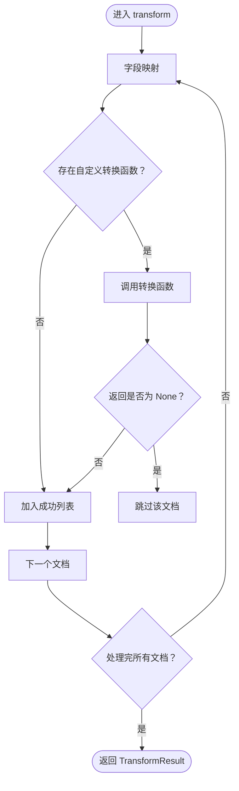
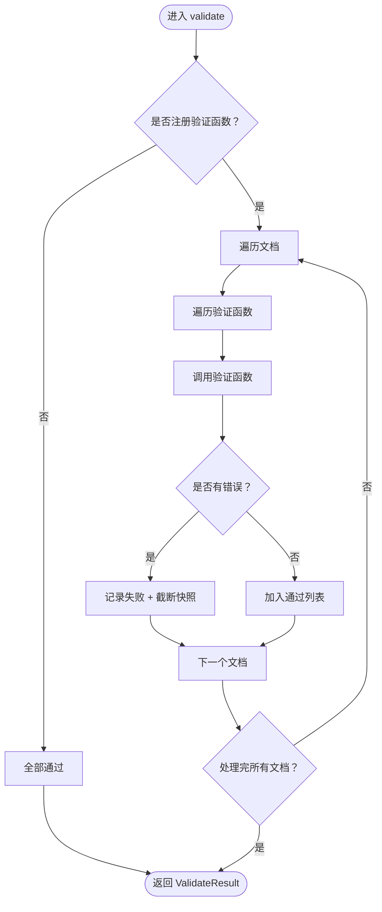
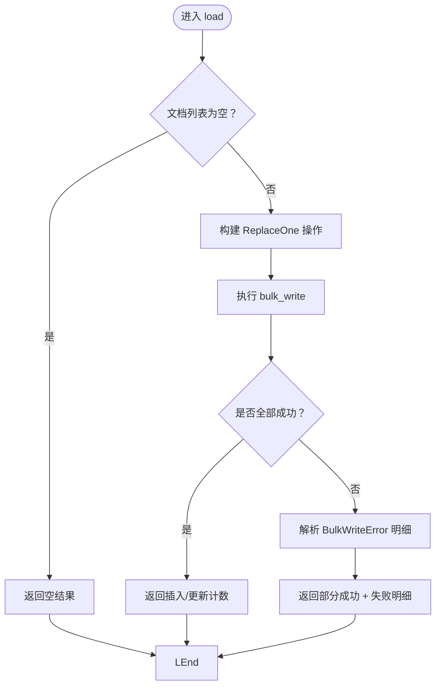
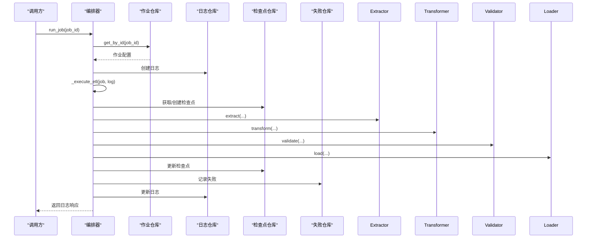
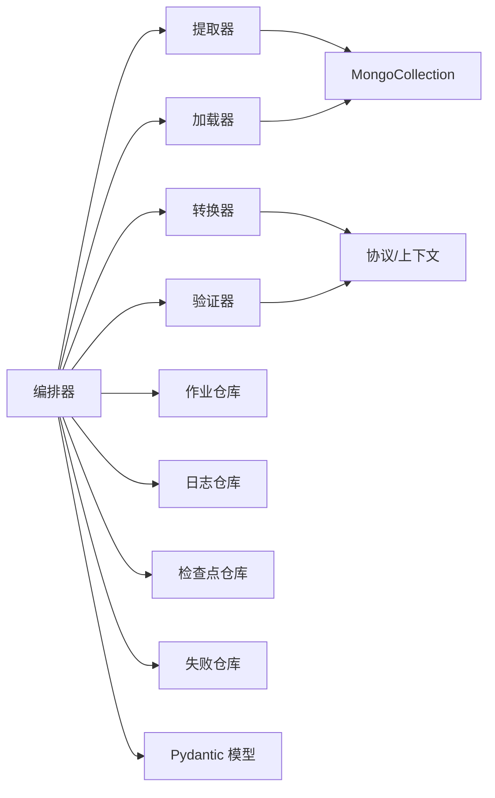

# 数据管道

<cite>
**本文引用的文件**
- [协议与数据结构 protocols.py](file://tools/flexloop/src/taolib/testing/data_sync/pipeline/protocols.py)
- [提取器 extractor.py](file://tools/flexloop/src/taolib/testing/data_sync/pipeline/extractor.py)
- [转换器 transformer.py](file://tools/flexloop/src/taolib/testing/data_sync/pipeline/transformer.py)
- [加载器 loader.py](file://tools/flexloop/src/taolib/testing/data_sync/pipeline/loader.py)
- [验证器 validator.py](file://tools/flexloop/src/taolib/testing/data_sync/pipeline/validator.py)
- [编排器 orchestrator.py](file://tools/flexloop/src/taolib/testing/data_sync/services/orchestrator.py)
- [检查点模型 checkpoint.py](file://tools/flexloop/src/taolib/testing/data_sync/models/checkpoint.py)
- [工具函数 utils.py](file://tools/flexloop/src/taolib/testing/data_sync/pipeline/utils.py)
- [管道组件测试 test_pipeline.py](file://tools/flexloop/tests/testing/test_data_sync/test_pipeline.py)
- [编排器集成测试 test_orchestrator.py](file://tools/flexloop/tests/testing/test_data_sync/test_orchestrator.py)
</cite>

## 目录
1. [引言](#引言)
2. [项目结构](#项目结构)
3. [核心组件](#核心组件)
4. [架构总览](#架构总览)
5. [详细组件分析](#详细组件分析)
6. [依赖分析](#依赖分析)
7. [性能考虑](#性能考虑)
8. [故障排查指南](#故障排查指南)
9. [结论](#结论)
10. [附录](#附录)

## 引言
本文件面向“数据管道”模块，系统性阐述其四大核心阶段：数据提取（Extractor）、数据转换（Transformer）、数据加载（Loader）与数据验证（Validator）的实现机制、配置参数、处理流程与错误处理策略。文档同时给出并发处理、批量优化、内存管理、监控指标、性能基准与故障恢复的实践建议，并说明与系统其他组件的集成与数据流转过程。

## 项目结构
数据管道位于 tools/flexloop 子模块下，采用分层组织：
- pipeline 层：定义协议与具体实现（提取、转换、加载、验证）
- services 层：编排器负责 ETL 协调、重试、日志与检查点更新
- models 层：同步作业、日志、检查点等数据模型
- tests：针对管道组件与编排器的单元与集成测试

图表来源
- [编排器 orchestrator.py:48-605](file://tools/flexloop/src/taolib/testing/data_sync/services/orchestrator.py#L48-L605)
- [提取器 extractor.py:17-78](file://tools/flexloop/src/taolib/testing/data_sync/pipeline/extractor.py#L17-L78)
- [转换器 transformer.py:17-105](file://tools/flexloop/src/taolib/testing/data_sync/pipeline/transformer.py#L17-L105)
- [验证器 validator.py:16-94](file://tools/flexloop/src/taolib/testing/data_sync/pipeline/validator.py#L16-L94)
- [加载器 loader.py:18-98](file://tools/flexloop/src/taolib/testing/data_sync/pipeline/loader.py#L18-L98)
- [协议与数据结构 protocols.py:14-134](file://tools/flexloop/src/taolib/testing/data_sync/pipeline/protocols.py#L14-L134)
- [检查点模型 checkpoint.py:11-25](file://tools/flexloop/src/taolib/testing/data_sync/models/checkpoint.py#L11-L25)

章节来源
- [编排器 orchestrator.py:48-605](file://tools/flexloop/src/taolib/testing/data_sync/services/orchestrator.py#L48-L605)
- [协议与数据结构 protocols.py:1-134](file://tools/flexloop/src/taolib/testing/data_sync/pipeline/protocols.py#L1-L134)

## 核心组件
- 提取器（Extractor）
  - 功能：基于时间戳的增量/全量提取，支持排序与游标分批输出
  - 关键参数：batch_size、filter_query、checkpoint
  - 输出：异步迭代器，逐批返回文档列表
- 转换器（Transformer）
  - 功能：字段映射、可选自定义 Python 函数转换、失败记录与快照截断
  - 关键参数：field_mapping、transform_module_path
  - 输出：转换结果（成功文档 + 失败记录）
- 验证器（Validator）
  - 功能：注册多个验证函数，对文档进行前置校验，返回通过/失败
  - 关键参数：无（通过注册函数配置）
  - 输出：验证结果（通过文档 + 失败记录）
- 加载器（Loader）
  - 功能：批量 upsert（ReplaceOne + upsert），统计插入/更新/失败
  - 关键参数：无（接收文档列表）
  - 输出：加载结果（inserted + updated + failed + 失败明细）

章节来源
- [提取器 extractor.py:17-78](file://tools/flexloop/src/taolib/testing/data_sync/pipeline/extractor.py#L17-L78)
- [转换器 transformer.py:17-105](file://tools/flexloop/src/taolib/testing/data_sync/pipeline/transformer.py#L17-L105)
- [验证器 validator.py:16-94](file://tools/flexloop/src/taolib/testing/data_sync/pipeline/validator.py#L16-L94)
- [加载器 loader.py:18-98](file://tools/flexloop/src/taolib/testing/data_sync/pipeline/loader.py#L18-L98)
- [协议与数据结构 protocols.py:42-134](file://tools/flexloop/src/taolib/testing/data_sync/pipeline/protocols.py#L42-L134)

## 架构总览
数据管道以编排器为核心，串联四阶段处理，并在关键节点记录日志、检查点与失败明细，支持失败重试与中止策略。

图表来源
- [编排器 orchestrator.py:162-392](file://tools/flexloop/src/taolib/testing/data_sync/services/orchestrator.py#L162-L392)
- [提取器 extractor.py:31-76](file://tools/flexloop/src/taolib/testing/data_sync/pipeline/extractor.py#L31-L76)
- [转换器 transformer.py:43-83](file://tools/flexloop/src/taolib/testing/data_sync/pipeline/transformer.py#L43-L83)
- [验证器 validator.py:45-91](file://tools/flexloop/src/taolib/testing/data_sync/pipeline/validator.py#L45-L91)
- [加载器 loader.py:24-95](file://tools/flexloop/src/taolib/testing/data_sync/pipeline/loader.py#L24-L95)

## 详细组件分析

### 提取器（MongoExtractor）
- 配置参数
  - batch_size：每批文档数量，默认 1000
  - filter_query：额外过滤条件
  - checkpoint：增量同步时使用，基于 updated_at > 上次时间戳
- 处理流程
  - 构造查询（含增量过滤）
  - 按 updated_at, _id 排序，设置 batch_size
  - 遍历游标，累积到 batch_size 后产出批次；最后一批不足也产出
  - 将 ObjectId 转为字符串，确保下游统一
- 错误处理
  - 无显式异常捕获；由上层编排器捕获连接/游标异常
- 并发与批量
  - 使用 Motor 游标分批，避免一次性拉取过多
  - batch_size 控制内存占用与网络传输

图表来源
- [提取器 extractor.py:31-76](file://tools/flexloop/src/taolib/testing/data_sync/pipeline/extractor.py#L31-L76)

章节来源
- [提取器 extractor.py:17-78](file://tools/flexloop/src/taolib/testing/data_sync/pipeline/extractor.py#L17-L78)

### 转换器（TransformChain）
- 配置参数
  - field_mapping：字段名映射表
  - transform_module_path：可选模块路径，动态导入其中的 transform 函数
- 处理流程
  - 依次应用字段映射
  - 若存在自定义转换函数，调用之；若返回 None 则跳过该文档
  - 捕获异常并记录失败，包含文档快照（截断）
- 错误处理
  - 异常转为失败记录，包含错误类型、消息与截断后的快照
- 并发与批量
  - 单批内串行处理，适合 CPU 密集或需要顺序保证的场景

图表来源
- [转换器 transformer.py:43-83](file://tools/flexloop/src/taolib/testing/data_sync/pipeline/transformer.py#L43-L83)
- [工具函数 utils.py:15-65](file://tools/flexloop/src/taolib/testing/data_sync/pipeline/utils.py#L15-L65)

章节来源
- [转换器 transformer.py:17-105](file://tools/flexloop/src/taolib/testing/data_sync/pipeline/transformer.py#L17-L105)
- [工具函数 utils.py:1-68](file://tools/flexloop/src/taolib/testing/data_sync/pipeline/utils.py#L1-L68)

### 验证器（DataValidator）
- 配置参数
  - 通过 register 注册多个验证函数；每个函数签名：(doc, context) -> list[str]
- 处理流程
  - 依次调用各验证函数，收集错误消息
  - 任一错误即判定失败，记录失败详情与截断快照
- 错误处理
  - 验证函数异常会被捕获并计入错误消息
- 并发与批量
  - 单批内串行验证，适合强一致校验

图表来源
- [验证器 validator.py:45-91](file://tools/flexloop/src/taolib/testing/data_sync/pipeline/validator.py#L45-L91)
- [工具函数 utils.py:15-65](file://tools/flexloop/src/taolib/testing/data_sync/pipeline/utils.py#L15-L65)

章节来源
- [验证器 validator.py:16-94](file://tools/flexloop/src/taolib/testing/data_sync/pipeline/validator.py#L16-L94)

### 加载器（MongoLoader）
- 配置参数
  - 无显式参数，接收文档列表
- 处理流程
  - 构造 ReplaceOne(upsert=True) 批量操作
  - 执行 bulk_write，统计 inserted/modified
  - 部分失败时解析 BulkWriteError，生成失败明细
  - 其他异常时返回完全失败
- 错误处理
  - 部分失败：记录失败条目与对应文档 ID
  - 完全失败：记录批次级错误
- 并发与批量
  - 使用 MongoDB 批量写入，提升吞吐

图表来源
- [加载器 loader.py:24-95](file://tools/flexloop/src/taolib/testing/data_sync/pipeline/loader.py#L24-L95)

章节来源
- [加载器 loader.py:18-98](file://tools/flexloop/src/taolib/testing/data_sync/pipeline/loader.py#L18-L98)

### 编排器（SyncOrchestrator）
- 职责
  - 加载作业配置、连接源/目标数据库
  - 协调 Extract → Transform → Validate → Load 四阶段
  - 更新检查点、记录日志与失败、发布事件
  - 支持失败重试（transform/load）与中止策略
- 关键流程
  - 连接源/目标数据库
  - 遍历集合执行同步，统计指标
  - transform 失败可按最大重试次数重试
  - validate 阶段过滤失败文档并记录
  - load 失败可按最大重试次数重试
  - 更新检查点（基于最后文档的 updated_at/_id）
- 错误处理
  - 作业不存在/禁用：抛出特定异常
  - 连接失败：抛出连接异常
  - 其他异常：记录失败日志并发布失败事件
- 并发与批量
  - 单作业内串行集合同步；集合内分批处理
  - 可通过外部调度器并行运行多个作业

图表来源
- [编排器 orchestrator.py:82-247](file://tools/flexloop/src/taolib/testing/data_sync/services/orchestrator.py#L82-L247)
- [编排器 orchestrator.py:248-392](file://tools/flexloop/src/taolib/testing/data_sync/services/orchestrator.py#L248-L392)

章节来源
- [编排器 orchestrator.py:48-605](file://tools/flexloop/src/taolib/testing/data_sync/services/orchestrator.py#L48-L605)

### 协议与数据结构
- TransformContext：携带 job_id、collection_name、field_mapping、transform_fn
- TransformResult：transform 成功文档 + 失败记录
- LoadResult：inserted、updated、failed、failures
- ValidateResult：valid、failures
- 协议：ExtractorProtocol、TransformerProtocol、LoaderProtocol、ValidatorProtocol

章节来源
- [协议与数据结构 protocols.py:14-134](file://tools/flexloop/src/taolib/testing/data_sync/pipeline/protocols.py#L14-L134)

### 检查点模型
- SyncCheckpoint：记录作业在集合上的同步位点（时间戳、ID、累计数、更新时间）

章节来源
- [检查点模型 checkpoint.py:11-25](file://tools/flexloop/src/taolib/testing/data_sync/models/checkpoint.py#L11-L25)

## 依赖分析
- 组件耦合
  - 编排器依赖管道组件与仓库层（作业、日志、检查点、失败记录）
  - 管道组件彼此解耦，通过协议与数据结构交互
- 外部依赖
  - Motor（异步 MongoDB 客户端）
  - Pydantic（数据模型）
  - MongoDB（批量写入 ReplaceOne）

图表来源
- [编排器 orchestrator.py:30-43](file://tools/flexloop/src/taolib/testing/data_sync/services/orchestrator.py#L30-L43)
- [提取器 extractor.py](file://tools/flexloop/src/taolib/testing/data_sync/pipeline/extractor.py#L10)
- [加载器 loader.py](file://tools/flexloop/src/taolib/testing/data_sync/pipeline/loader.py#L9)
- [协议与数据结构 protocols.py:6-11](file://tools/flexloop/src/taolib/testing/data_sync/pipeline/protocols.py#L6-L11)
- [检查点模型 checkpoint.py](file://tools/flexloop/src/taolib/testing/data_sync/models/checkpoint.py#L8)

章节来源
- [编排器 orchestrator.py:30-43](file://tools/flexloop/src/taolib/testing/data_sync/services/orchestrator.py#L30-L43)
- [协议与数据结构 protocols.py:6-11](file://tools/flexloop/src/taolib/testing/data_sync/pipeline/protocols.py#L6-L11)

## 性能考虑
- 并发处理
  - 当前实现为单作业串行集合同步；可通过外部调度器并行运行多个作业
  - 集合内分批处理，避免一次性拉取过多数据
- 批量操作优化
  - 提取：使用游标与 batch_size 控制内存
  - 转换：单批内串行，避免锁竞争
  - 加载：使用 bulk_write + ReplaceOne，减少往返
- 内存管理
  - 文档快照截断（默认 4096 字节），防止日志过大
  - 提取阶段将 ObjectId 转为字符串，降低后续处理成本
- 监控与指标
  - 编排器统计：extracted、transformed、loaded、failed、skipped
  - 日志记录：开始/完成/失败事件，便于观测
- 故障恢复
  - 基于检查点的增量同步，失败后可从上次位点继续
  - transform/load 失败可按最大重试次数重试
  - 失败明细入库，支持人工干预与重放

章节来源
- [编排器 orchestrator.py:162-392](file://tools/flexloop/src/taolib/testing/data_sync/services/orchestrator.py#L162-L392)
- [工具函数 utils.py:15-65](file://tools/flexloop/src/taolib/testing/data_sync/pipeline/utils.py#L15-L65)
- [加载器 loader.py:45-95](file://tools/flexloop/src/taolib/testing/data_sync/pipeline/loader.py#L45-L95)

## 故障排查指南
- 常见问题定位
  - 连接失败：检查源/目标 MongoDB 地址与凭据
  - 作业不存在/禁用：确认作业配置与启用状态
  - transform 失败：查看失败记录中的错误类型/消息与截断快照
  - validate 失败：确认验证函数逻辑与输入文档结构
  - load 失败：查看 BulkWriteError 明细与对应文档 ID
- 重试策略
  - transform/load 失败可按最大重试次数重试
  - 中止策略：当失败动作为 ABORT 且出现失败时立即中止
- 日志与审计
  - 使用失败仓库记录失败明细，便于回溯
  - 编排器发布开始/完成/失败事件，便于监控

章节来源
- [编排器 orchestrator.py:112-126](file://tools/flexloop/src/taolib/testing/data_sync/services/orchestrator.py#L112-L126)
- [编排器 orchestrator.py:220-224](file://tools/flexloop/src/taolib/testing/data_sync/services/orchestrator.py#L220-L224)
- [编排器 orchestrator.py:300-326](file://tools/flexloop/src/taolib/testing/data_sync/services/orchestrator.py#L300-L326)
- [编排器 orchestrator.py:354-378](file://tools/flexloop/src/taolib/testing/data_sync/services/orchestrator.py#L354-L378)

## 结论
该数据管道以清晰的协议与职责分离实现了稳定的 ETL 流程：提取、转换、验证、加载各司其职，编排器负责协调与可观测性。通过检查点、重试与失败明细，系统具备良好的容错与恢复能力。建议在生产环境中结合外部调度器实现多作业并行，并根据业务规模调整 batch_size 与重试策略，持续监控指标以保障稳定性与性能。

## 附录

### 配置参数速查
- 提取器（MongoExtractor）
  - batch_size：每批文档数量（默认 1000）
  - filter_query：过滤条件
  - checkpoint：增量同步位点
- 转换器（TransformChain）
  - field_mapping：字段映射表
  - transform_module_path：自定义转换模块路径
- 加载器（MongoLoader）
  - 无显式参数，接收文档列表
- 验证器（DataValidator）
  - 通过 register 注册验证函数

章节来源
- [提取器 extractor.py:23-48](file://tools/flexloop/src/taolib/testing/data_sync/pipeline/extractor.py#L23-L48)
- [转换器 transformer.py:26-42](file://tools/flexloop/src/taolib/testing/data_sync/pipeline/transformer.py#L26-L42)
- [协议与数据结构 protocols.py:14-39](file://tools/flexloop/src/taolib/testing/data_sync/pipeline/protocols.py#L14-L39)

### 自定义实现示例（路径指引）
- 自定义提取器
  - 实现 ExtractorProtocol 或继承 MongoExtractor 并覆写 extract
  - 参考路径：[提取器实现:31-76](file://tools/flexloop/src/taolib/testing/data_sync/pipeline/extractor.py#L31-L76)
- 自定义转换器
  - 实现 TransformerProtocol 或扩展 TransformChain 的 transform_fn
  - 参考路径：[转换器实现:43-83](file://tools/flexloop/src/taolib/testing/data_sync/pipeline/transformer.py#L43-L83)
- 自定义加载器
  - 实现 LoaderProtocol 或基于 MongoLoader 的批量 upsert
  - 参考路径：[加载器实现:24-95](file://tools/flexloop/src/taolib/testing/data_sync/pipeline/loader.py#L24-L95)
- 自定义验证器
  - 通过 DataValidator.register 注册验证函数
  - 参考路径：[验证器实现:34-43](file://tools/flexloop/src/taolib/testing/data_sync/pipeline/validator.py#L34-L43)

### 测试参考
- 管道组件测试
  - 提取器初始化与默认 batch_size
  - 转换器字段映射与失败处理
  - 参考路径：[管道组件测试:11-99](file://tools/flexloop/tests/testing/test_data_sync/test_pipeline.py#L11-L99)
- 编排器集成测试
  - 作业不存在/禁用、成功执行、重试行为
  - 参考路径：[编排器集成测试:148-172](file://tools/flexloop/tests/testing/test_data_sync/test_orchestrator.py#L148-L172)