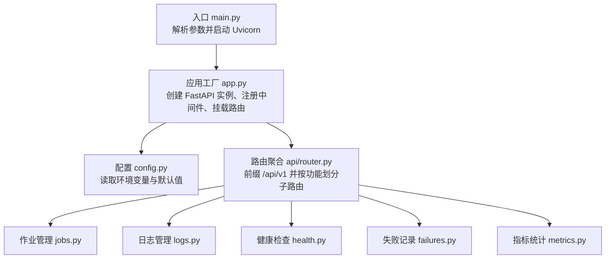
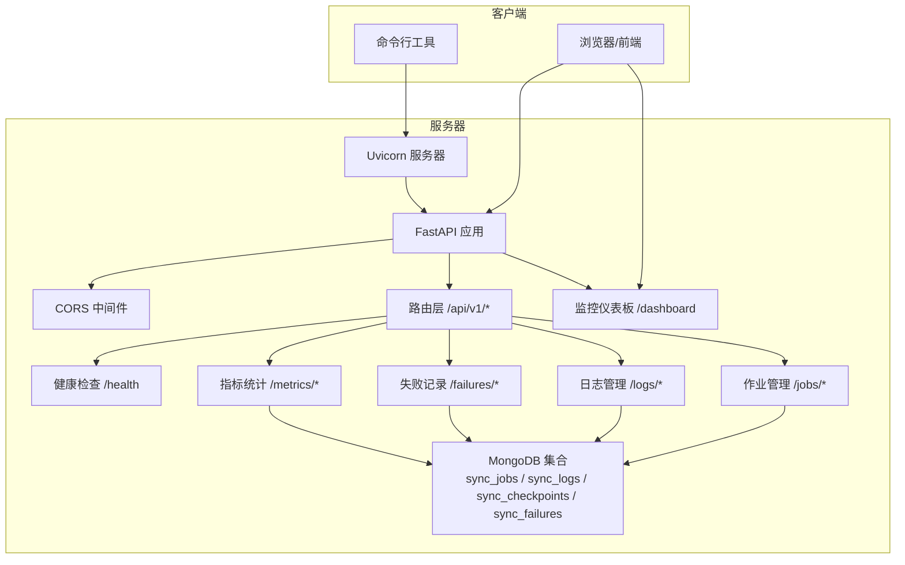
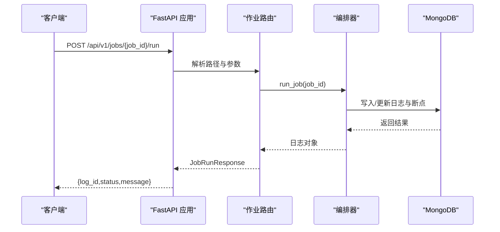
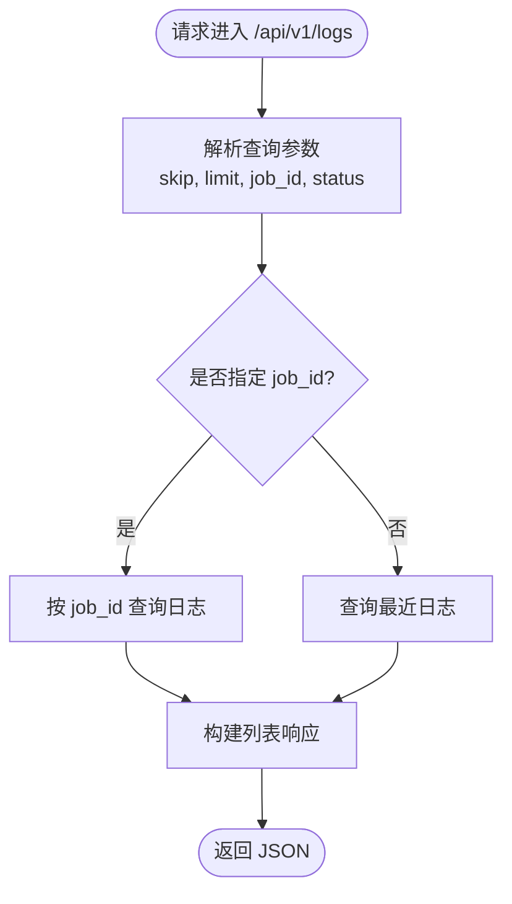
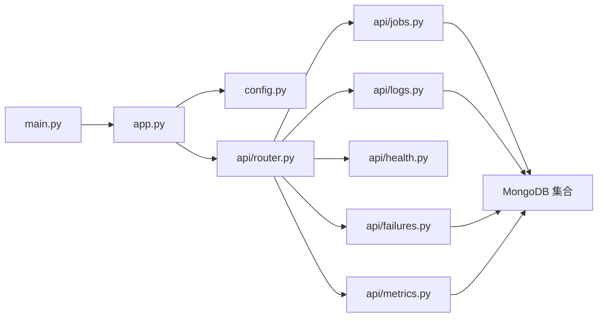

# 服务器端实现

<cite>
**本文引用的文件**
- [tools\flexloop\src\taolib\testing\data_sync\server\main.py](file://tools\flexloop\src\taolib\testing\data_sync\server\main.py)
- [tools\flexloop\src\taolib\testing\data_sync\server\app.py](file://tools\flexloop\src\taolib\testing\data_sync\server\app.py)
- [tools\flexloop\src\taolib\testing\data_sync\server\config.py](file://tools\flexloop\src\taolib\testing\data_sync\server\config.py)
- [tools\flexloop\src\taolib\testing\data_sync\server\api\router.py](file://tools\flexloop\src\taolib\testing\data_sync\server\api\router.py)
- [tools\flexloop\src\taolib\testing\data_sync\server\api\jobs.py](file://tools\flexloop\src\taolib\testing\data_sync\server\api\jobs.py)
- [tools\flexloop\src\taolib\testing\data_sync\server\api\logs.py](file://tools\flexloop\src\taolib\testing\data_sync\server\api\logs.py)
- [tools\flexloop\src\taolib\testing\data_sync\server\api\health.py](file://tools\flexloop\src\taolib\testing\data_sync\server\api\health.py)
- [tools\flexloop\src\taolib\testing\data_sync\server\api\failures.py](file://tools\flexloop\src\taolib\testing\data_sync\server\api\failures.py)
- [tools\flexloop\src\taolib\testing\data_sync\server\api\metrics.py](file://tools\flexloop\src\taolib\testing\data_sync\server\api\metrics.py)
</cite>

## 目录
1. [简介](#简介)
2. [项目结构](#项目结构)
3. [核心组件](#核心组件)
4. [架构总览](#架构总览)
5. [详细组件分析](#详细组件分析)
6. [依赖关系分析](#依赖关系分析)
7. [性能考量](#性能考量)
8. [故障排查指南](#故障排查指南)
9. [结论](#结论)
10. [附录](#附录)

## 简介
本文件面向服务器端实现模块，系统性阐述数据同步服务的架构与实现细节，涵盖 FastAPI 应用配置、路由管理、中间件与生命周期、各 API 端点功能（作业管理、失败记录、日志管理、健康检查、指标统计）、异步任务处理与实时状态推送思路、安全认证与访问控制策略、监控与日志、性能分析以及部署与运维建议。内容基于仓库中“data_sync”测试服务器的实际代码进行归纳总结。

## 项目结构
数据同步服务位于 tools/flexloop/src/taolib/testing/data_sync/server 目录，采用分层组织：
- 应用入口与生命周期：main.py、app.py
- 配置中心：config.py
- API 路由聚合：api/router.py
- 具体业务路由：jobs.py、logs.py、health.py、failures.py、metrics.py

图示来源
- [tools\flexloop\src\taolib\testing\data_sync\server\main.py:1-48](file://tools\flexloop\src\taolib\testing\data_sync\server\main.py#L1-L48)
- [tools\flexloop\src\taolib\testing\data_sync\server\app.py:1-84](file://tools\flexloop\src\taolib\testing\data_sync\server\app.py#L1-L84)
- [tools\flexloop\src\taolib\testing\data_sync\server\config.py:1-43](file://tools\flexloop\src\taolib\testing\data_sync\server\config.py#L1-L43)
- [tools\flexloop\src\taolib\testing\data_sync\server\api\router.py:1-17](file://tools\flexloop\src\taolib\testing\data_sync\server\api\router.py#L1-L17)

章节来源
- [tools\flexloop\src\taolib\testing\data_sync\server\main.py:1-48](file://tools\flexloop\src\taolib\testing\data_sync\server\main.py#L1-L48)
- [tools\flexloop\src\taolib\testing\data_sync\server\app.py:1-84](file://tools\flexloop\src\taolib\testing\data_sync\server\app.py#L1-L84)
- [tools\flexloop\src\taolib\testing\data_sync\server\config.py:1-43](file://tools\flexloop\src\taolib\testing\data_sync\server\config.py#L1-L43)
- [tools\flexloop\src\taolib\testing\data_sync\server\api\router.py:1-17](file://tools\flexloop\src\taolib\testing\data_sync\server\api\router.py#L1-L17)

## 核心组件
- 应用工厂与生命周期
  - 使用 lifespan 管理 MongoDB 连接与索引初始化；在关闭阶段释放连接。
  - 注册 CORS 中间件，支持跨域访问。
  - 挂载 /api/v1 前缀路由，并提供 /dashboard 静态页面用于监控。
- 配置中心
  - 通过 pydantic-settings 从 .env 文件加载配置，支持环境变量前缀 DATA_SYNC_。
  - 关键配置项：MongoDB 连接串与数据库名、JWT 密钥与算法（可选）、监听地址与端口、CORS 源等。
- 路由聚合
  - 统一在 api/router.py 中注册各功能子路由，便于扩展与维护。

章节来源
- [tools\flexloop\src\taolib\testing\data_sync\server\app.py:21-84](file://tools\flexloop\src\taolib\testing\data_sync\server\app.py#L21-L84)
- [tools\flexloop\src\taolib\testing\data_sync\server\config.py:10-43](file://tools\flexloop\src\taolib\testing\data_sync\server\config.py#L10-L43)
- [tools\flexloop\src\taolib\testing\data_sync\server\api\router.py:7-14](file://tools\flexloop\src\taolib\testing\data_sync\server\api\router.py#L7-L14)

## 架构总览
下图展示从客户端到后端服务、数据库与监控仪表板的整体交互流程：

图示来源
- [tools\flexloop\src\taolib\testing\data_sync\server\main.py:14-41](file://tools\flexloop\src\taolib\testing\data_sync\server\main.py#L14-L41)
- [tools\flexloop\src\taolib\testing\data_sync\server\app.py:57-84](file://tools\flexloop\src\taolib\testing\data_sync\server\app.py#L57-L84)
- [tools\flexloop\src\taolib\testing\data_sync\server\api\router.py:7-14](file://tools\flexloop\src\taolib\testing\data_sync\server\api\router.py#L7-L14)

## 详细组件分析

### FastAPI 应用与中间件
- 生命周期管理
  - 在启动时建立 MongoDB 连接，注入 app.state；初始化集合索引（唯一索引、排序索引、TTL 索引等）。
  - 在关闭时释放连接。
- 中间件
  - CORS：允许跨域访问，支持通配符源，允许任意方法与头。
- 静态页面
  - 提供 /dashboard 页面，内置简单监控面板，通过 /api/v1 接口拉取作业、日志与失败信息。

章节来源
- [tools\flexloop\src\taolib\testing\data_sync\server\app.py:21-54](file://tools\flexloop\src\taolib\testing\data_sync\server\app.py#L21-L54)
- [tools\flexloop\src\taolib\testing\data_sync\server\app.py:66-73](file://tools\flexloop\src\taolib\testing\data_sync\server\app.py#L66-L73)
- [tools\flexloop\src\taolib\testing\data_sync\server\app.py:78-84](file://tools\flexloop\src\taolib\testing\data_sync\server\app.py#L78-L84)

### 配置中心（Settings）
- 支持的配置项
  - mongo_url：MongoDB 连接串
  - mongo_db：数据库名
  - jwt_secret：JWT 密钥（留空表示禁用认证）
  - jwt_algorithm：JWT 算法
  - host/port：监听地址与端口
  - debug：调试模式
  - cors_origins：CORS 源列表
- 加载方式
  - 通过 pydantic-settings 从 .env 文件加载，环境变量前缀为 DATA_SYNC_。

章节来源
- [tools\flexloop\src\taolib\testing\data_sync\server\config.py:10-43](file://tools\flexloop\src\taolib\testing\data_sync\server\config.py#L10-L43)

### 路由管理
- 聚合路由
  - 所有业务路由均挂载于 /api/v1 前缀下，按功能划分子路由：
    - /jobs：作业管理
    - /logs：日志管理
    - /health：健康检查
    - /metrics：指标统计
    - /failures：失败记录

章节来源
- [tools\flexloop\src\taolib\testing\data_sync\server\api\router.py:7-14](file://tools\flexloop\src\taolib\testing\data_sync\server\api\router.py#L7-L14)

### 作业管理（Jobs）
- 功能概述
  - 列表查询、详情查询、创建、更新、删除、手动运行。
  - 支持按 enabled 过滤启用的作业。
- 关键端点
  - GET /api/v1/jobs
  - GET /api/v1/jobs/{job_id}
  - POST /api/v1/jobs
  - PATCH /api/v1/jobs/{job_id}
  - DELETE /api/v1/jobs/{job_id}
  - POST /api/v1/jobs/{job_id}/run
- 请求与响应模型
  - 列表响应：items（数组）、total（整数）
  - 运行响应：log_id（字符串）、status（字符串）、message（字符串）
  - 创建请求：name、description、scope、mode、source、target、batch_size、failure_action、schedule_cron、tags
  - 更新请求：enabled、batch_size、failure_action、schedule_cron
- 错误处理
  - 404：作业不存在
  - 409：同名作业冲突
  - 400：无有效更新字段
- 异步与编排
  - 运行作业通过编排器执行，返回日志对象；异常时返回失败状态与消息。

图示来源
- [tools\flexloop\src\taolib\testing\data_sync\server\api\jobs.py:189-212](file://tools\flexloop\src\taolib\testing\data_sync\server\api\jobs.py#L189-L212)

章节来源
- [tools\flexloop\src\taolib\testing\data_sync\server\api\jobs.py:51-73](file://tools\flexloop\src\taolib\testing\data_sync\server\api\jobs.py#L51-L73)
- [tools\flexloop\src\taolib\testing\data_sync\server\api\jobs.py:106-137](file://tools\flexloop\src\taolib\testing\data_sync\server\api\jobs.py#L106-L137)
- [tools\flexloop\src\taolib\testing\data_sync\server\api\jobs.py:149-173](file://tools\flexloop\src\taolib\testing\data_sync\server\api\jobs.py#L149-L173)
- [tools\flexloop\src\taolib\testing\data_sync\server\api\jobs.py:176-186](file://tools\flexloop\src\taolib\testing\data_sync\server\api\jobs.py#L176-L186)
- [tools\flexloop\src\taolib\testing\data_sync\server\api\jobs.py:189-212](file://tools\flexloop\src\taolib\testing\data_sync\server\api\jobs.py#L189-L212)

### 日志管理（Logs）
- 功能概述
  - 列出同步日志，支持按 job_id 过滤或最近记录查询。
  - 获取单条日志详情。
- 关键端点
  - GET /api/v1/logs
  - GET /api/v1/logs/{log_id}
- 查询参数
  - skip、limit、job_id、status
- 响应模型
  - 列表响应：items（数组）、total（整数）

图示来源
- [tools\flexloop\src\taolib\testing\data_sync\server\api\logs.py:25-45](file://tools\flexloop\src\taolib\testing\data_sync\server\api\logs.py#L25-L45)

章节来源
- [tools\flexloop\src\taolib\testing\data_sync\server\api\logs.py:25-45](file://tools\flexloop\src\taolib\testing\data_sync\server\api\logs.py#L25-L45)
- [tools\flexloop\src\taolib\testing\data_sync\server\api\logs.py:48-61](file://tools\flexloop\src\taolib\testing\data_sync\server\api\logs.py#L48-L61)

### 健康检查（Health）
- 功能概述
  - 提供服务健康状态检查端点，通常用于探活与负载均衡。
- 端点
  - GET /api/v1/health

章节来源
- [tools\flexloop\src\taolib\testing\data_sync\server\api\health.py](file://tools\flexloop\src\taolib\testing\data_sync\server\api\health.py)

### 失败记录（Failures）
- 功能概述
  - 提供失败记录的查询与管理能力，常用于定位同步过程中的异常。
- 端点
  - GET /api/v1/failures

章节来源
- [tools\flexloop\src\taolib\testing\data_sync\server\api\failures.py](file://tools\flexloop\src\taolib\testing\data_sync\server\api\failures.py)

### 指标统计（Metrics）
- 功能概述
  - 提供系统关键指标，如作业总数、近期运行次数、失败次数等，用于监控面板展示。
- 端点
  - GET /api/v1/metrics

章节来源
- [tools\flexloop\src\taolib\testing\data_sync\server\api\metrics.py](file://tools\flexloop\src\taolib\testing\data_sync\server\api\metrics.py)

## 依赖关系分析
- 组件耦合
  - 路由层仅负责参数解析与调用仓储/编排器，职责清晰。
  - 应用工厂集中管理生命周期与中间件，降低重复配置。
- 外部依赖
  - FastAPI：Web 框架与路由
  - Motor：异步 MongoDB 客户端
  - Uvicorn：ASGI 服务器
  - Pydantic Settings：配置加载

图示来源
- [tools\flexloop\src\taolib\testing\data_sync\server\main.py:10-11](file://tools\flexloop\src\taolib\testing\data_sync\server\main.py#L10-L11)
- [tools\flexloop\src\taolib\testing\data_sync\server\app.py:15-16](file://tools\flexloop\src\taolib\testing\data_sync\server\app.py#L15-L16)
- [tools\flexloop\src\taolib\testing\data_sync\server\api\router.py:5-14](file://tools\flexloop\src\taolib\testing\data_sync\server\api\router.py#L5-L14)

章节来源
- [tools\flexloop\src\taolib\testing\data_sync\server\main.py:10-11](file://tools\flexloop\src\taolib\testing\data_sync\server\main.py#L10-L11)
- [tools\flexloop\src\taolib\testing\data_sync\server\app.py:15-16](file://tools\flexloop\src\taolib\testing\data_sync\server\app.py#L15-L16)
- [tools\flexloop\src\taolib\testing\data_sync\server\api\router.py:5-14](file://tools\flexloop\src\taolib\testing\data_sync\server\api\router.py#L5-L14)

## 性能考量
- 数据库索引
  - 作业集合：name 唯一索引、enabled 索引
  - 日志集合：job_id 索引、按时间倒序索引
  - 断点集合：job_id 与 collection_name 组合唯一索引
  - 失败集合：按创建时间设置 TTL（7 天），自动清理过期失败记录
- 查询优化
  - 列表接口支持 skip/limit 分页
  - 按 job_id 过滤日志，减少扫描范围
- 并发与异步
  - 使用 Motor 异步访问数据库，提升并发吞吐
- 缓存与降级
  - 可结合 Redis 缓存热点作业元数据与最近日志摘要
- 监控与告警
  - 指标端点输出关键指标，结合外部监控系统进行告警

章节来源
- [tools\flexloop\src\taolib\testing\data_sync\server\app.py:32-45](file://tools\flexloop\src\taolib\testing\data_sync\server\app.py#L32-L45)

## 故障排查指南
- 常见问题与定位
  - 404 作业不存在：确认 job_id 是否正确，或是否被删除
  - 409 名称冲突：创建作业时检查是否存在同名作业
  - 400 无更新字段：PATCH 更新时确保至少传入一个可更新字段
  - 运行失败：查看 /logs 详情与 /failures 记录，结合断点定位异常阶段
- 日志与监控
  - 通过 /dashboard 查看作业状态、日志与失败记录
  - 指标端点用于快速评估系统健康度
- 数据库健康
  - 确认 MongoDB 连接串与数据库名配置正确
  - 检查索引是否创建成功，TTL 是否生效

章节来源
- [tools\flexloop\src\taolib\testing\data_sync\server\api\jobs.py:82-86](file://tools\flexloop\src\taolib\testing\data_sync\server\api\jobs.py#L82-L86)
- [tools\flexloop\src\taolib\testing\data_sync\server\api\jobs.py:113-117](file://tools\flexloop\src\taolib\testing\data_sync\server\api\jobs.py#L113-L117)
- [tools\flexloop\src\taolib\testing\data_sync\server\api\jobs.py:159-163](file://tools\flexloop\src\taolib\testing\data_sync\server\api\jobs.py#L159-L163)
- [tools\flexloop\src\taolib\testing\data_sync\server\api\logs.py:54-58](file://tools\flexloop\src\taolib\testing\data_sync\server\api\logs.py#L54-L58)

## 结论
该数据同步服务以 FastAPI 为核心，配合异步数据库访问与简洁的路由分层，提供了作业管理、日志管理、失败记录与健康检查等关键能力。通过统一的生命周期管理、CORS 中间件与监控仪表板，系统具备良好的可维护性与可观测性。后续可在认证鉴权、权限控制、实时推送与性能优化方面进一步完善。

## 附录

### API 接口文档（概要）
- 作业管理（Jobs）
  - GET /api/v1/jobs
    - 查询参数：skip、limit、enabled
    - 响应：items（数组）、total（整数）
  - GET /api/v1/jobs/{job_id}
    - 响应：作业详情
  - POST /api/v1/jobs
    - 请求体：name、description、scope、mode、source、target、batch_size、failure_action、schedule_cron、tags
    - 响应：作业详情
  - PATCH /api/v1/jobs/{job_id}
    - 请求体：enabled、batch_size、failure_action、schedule_cron
    - 响应：作业详情
  - DELETE /api/v1/jobs/{job_id}
    - 响应：无内容
  - POST /api/v1/jobs/{job_id}/run
    - 响应：log_id、status、message
- 日志管理（Logs）
  - GET /api/v1/logs
    - 查询参数：skip、limit、job_id、status
    - 响应：items（数组）、total（整数）
  - GET /api/v1/logs/{log_id}
    - 响应：日志详情
- 健康检查（Health）
  - GET /api/v1/health
    - 响应：健康状态
- 失败记录（Failures）
  - GET /api/v1/failures
    - 响应：失败记录列表
- 指标统计（Metrics）
  - GET /api/v1/metrics
    - 响应：系统关键指标

章节来源
- [tools\flexloop\src\taolib\testing\data_sync\server\api\jobs.py:51-73](file://tools\flexloop\src\taolib\testing\data_sync\server\api\jobs.py#L51-L73)
- [tools\flexloop\src\taolib\testing\data_sync\server\api\jobs.py:76-88](file://tools\flexloop\src\taolib\testing\data_sync\server\api\jobs.py#L76-L88)
- [tools\flexloop\src\taolib\testing\data_sync\server\api\jobs.py:106-137](file://tools\flexloop\src\taolib\testing\data_sync\server\api\jobs.py#L106-L137)
- [tools\flexloop\src\taolib\testing\data_sync\server\api\jobs.py:149-173](file://tools\flexloop\src\taolib\testing\data_sync\server\api\jobs.py#L149-L173)
- [tools\flexloop\src\taolib\testing\data_sync\server\api\jobs.py:176-186](file://tools\flexloop\src\taolib\testing\data_sync\server\api\jobs.py#L176-L186)
- [tools\flexloop\src\taolib\testing\data_sync\server\api\jobs.py:189-212](file://tools\flexloop\src\taolib\testing\data_sync\server\api\jobs.py#L189-L212)
- [tools\flexloop\src\taolib\testing\data_sync\server\api\logs.py:25-45](file://tools\flexloop\src\taolib\testing\data_sync\server\api\logs.py#L25-L45)
- [tools\flexloop\src\taolib\testing\data_sync\server\api\logs.py:48-61](file://tools\flexloop\src\taolib\testing\data_sync\server\api\logs.py#L48-L61)
- [tools\flexloop\src\taolib\testing\data_sync\server\api\health.py](file://tools\flexloop\src\taolib\testing\data_sync\server\api\health.py)
- [tools\flexloop\src\taolib\testing\data_sync\server\api\failures.py](file://tools\flexloop\src\taolib\testing\data_sync\server\api\failures.py)
- [tools\flexloop\src\taolib\testing\data_sync\server\api\metrics.py](file://tools\flexloop\src\taolib\testing\data_sync\server\api\metrics.py)

### 安全认证、权限控制与访问限制
- 当前实现
  - JWT 密钥可通过配置项启用认证（留空则禁用）
  - CORS 已启用，支持跨域访问
- 建议
  - 引入统一的认证中间件与权限装饰器
  - 对敏感端点增加角色校验
  - 配置速率限制与 IP 白名单

章节来源
- [tools\flexloop\src\taolib\testing\data_sync\server\config.py:26-28](file://tools\flexloop\src\taolib\testing\data_sync\server\config.py#L26-L28)
- [tools\flexloop\src\taolib\testing\data_sync\server\app.py:66-73](file://tools\flexloop\src\taolib\testing\data_sync\server\app.py#L66-L73)

### 异步任务处理、WebSocket 与实时推送
- 当前实现
  - 作业运行通过编排器异步执行，返回日志 ID
  - 监控仪表板通过定时轮询 /api/v1 接口更新视图
- 建议
  - 引入 WebSocket 或 Server-Sent Events 实现实时状态推送
  - 将长时间运行的作业放入队列（如 Celery/Redis）并上报进度

章节来源
- [tools\flexloop\src\taolib\testing\data_sync\server\api\jobs.py:194-200](file://tools\flexloop\src\taolib\testing\data_sync\server\api\jobs.py#L194-L200)
- [tools\flexloop\src\taolib\testing\data_sync\server\app.py:226-236](file://tools\flexloop\src\taolib\testing\data_sync\server\app.py#L226-L236)

### 监控指标、日志与性能分析
- 指标
  - 通过 /metrics 输出系统关键指标，如作业总数、近期运行次数、失败次数
- 日志
  - 应用启动/关闭日志、请求处理日志、错误日志
- 性能分析
  - 建议接入 APM（如 OpenTelemetry）采集链路追踪与指标

章节来源
- [tools\flexloop\src\taolib\testing\data_sync\server\app.py:25-53](file://tools\flexloop\src\taolib\testing\data_sync\server\app.py#L25-L53)
- [tools\flexloop\src\taolib\testing\data_sync\server\api\metrics.py](file://tools\flexloop\src\taolib\testing\data_sync\server\api\metrics.py)

### 部署配置示例与运维最佳实践
- 部署配置示例
  - 监听地址与端口：host、port
  - MongoDB 连接串与数据库名：mongo_url、mongo_db
  - CORS 源：cors_origins
  - 启用/禁用认证：jwt_secret（留空禁用）
- 运维最佳实践
  - 使用容器编排（如 Docker/Podman）部署
  - 配置健康检查探针与重启策略
  - 设置日志切割与保留策略
  - 定期备份数据库并验证恢复流程

章节来源
- [tools\flexloop\src\taolib\testing\data_sync\server\config.py:20-36](file://tools\flexloop\src\taolib\testing\data_sync\server\config.py#L20-L36)
- [tools\flexloop\src\taolib\testing\data_sync\server\main.py:16-29](file://tools\flexloop\src\taolib\testing\data_sync\server\main.py#L16-L29)