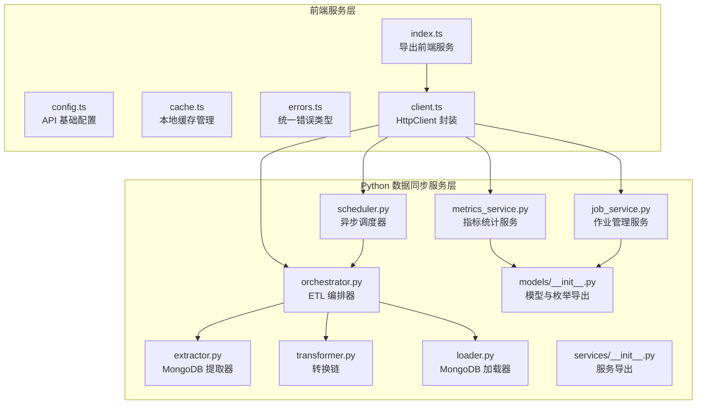
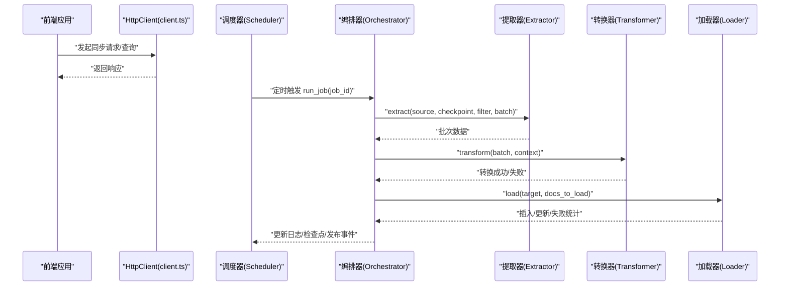
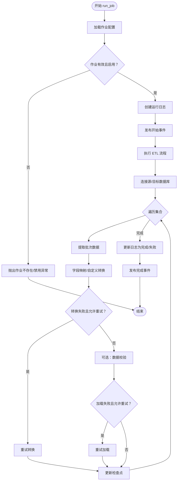
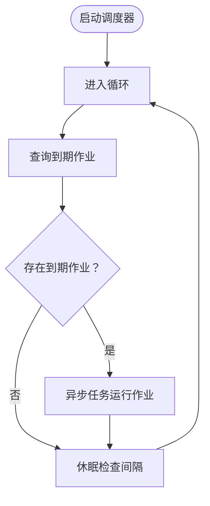
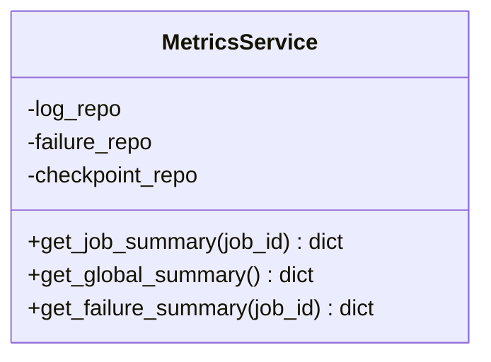
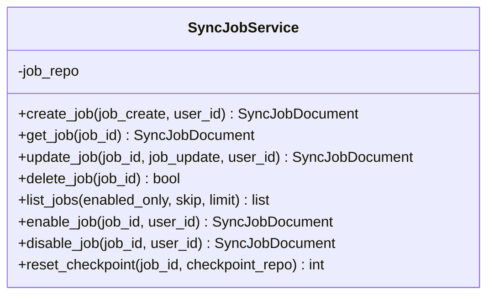
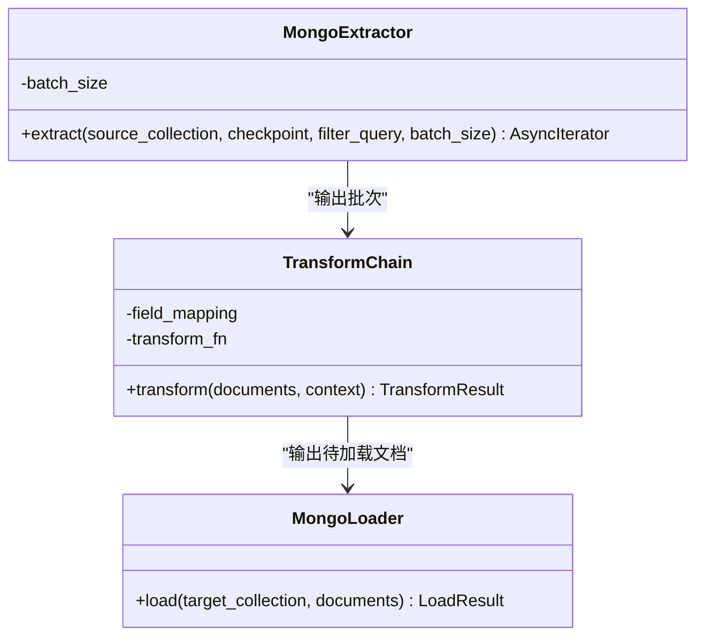
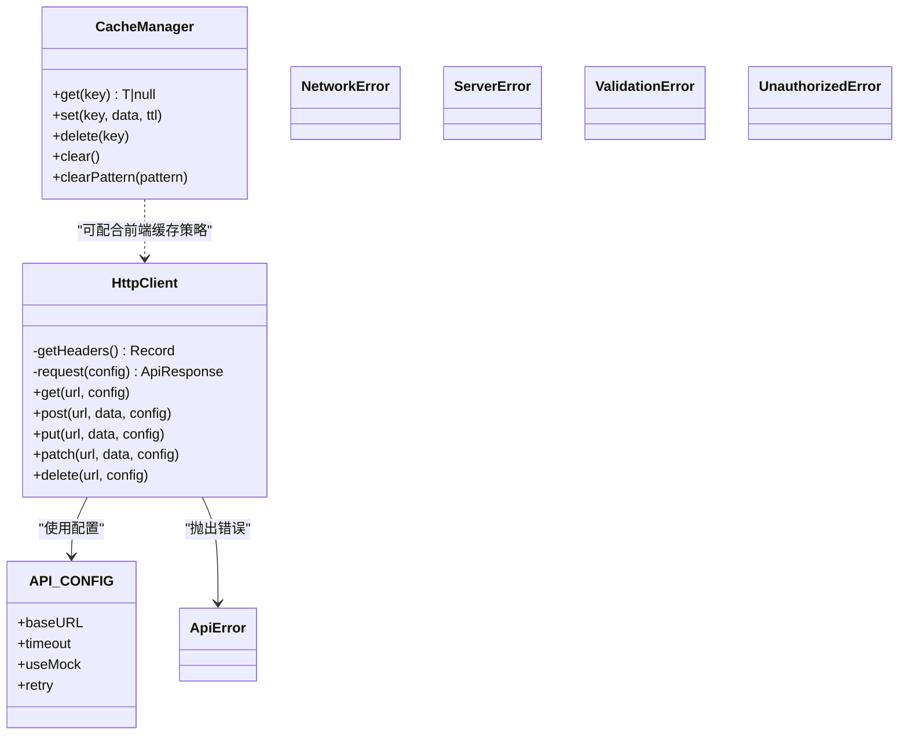
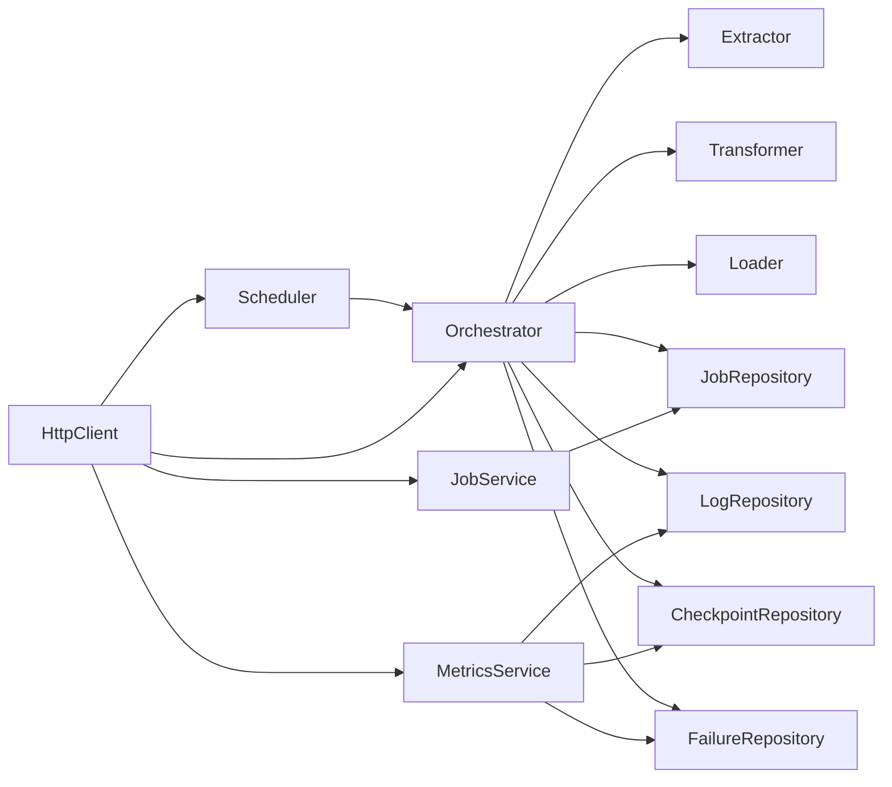

# 服务层

<cite>
**本文引用的文件**
- [orchestrator.py](file://tools/flexloop/src/taolib/testing/data_sync/services/orchestrator.py)
- [scheduler.py](file://tools/flexloop/src/taolib/testing/data_sync/services/scheduler.py)
- [metrics_service.py](file://tools/flexloop/src/taolib/testing/data_sync/services/metrics_service.py)
- [job_service.py](file://tools/flexloop/src/taolib/testing/data_sync/services/job_service.py)
- [extractor.py](file://tools/flexloop/src/taolib/testing/data_sync/pipeline/extractor.py)
- [loader.py](file://tools/flexloop/src/taolib/testing/data_sync/pipeline/loader.py)
- [transformer.py](file://tools/flexloop/src/taolib/testing/data_sync/pipeline/transformer.py)
- [models/__init__.py](file://tools/flexloop/src/taolib/testing/data_sync/models/__init__.py)
- [services/__init__.py](file://tools/flexloop/src/taolib/testing/data_sync/services/__init__.py)
- [index.ts](file://src/services/index.ts)
- [config.ts](file://src/services/config.ts)
- [cache.ts](file://src/services/cache.ts)
- [errors.ts](file://src/services/errors.ts)
- [client.ts](file://src/services/api/client.ts)
</cite>

## 目录
1. [引言](#引言)
2. [项目结构](#项目结构)
3. [核心组件](#核心组件)
4. [架构总览](#架构总览)
5. [详细组件分析](#详细组件分析)
6. [依赖分析](#依赖分析)
7. [性能考虑](#性能考虑)
8. [故障排查指南](#故障排查指南)
9. [结论](#结论)
10. [附录](#附录)

## 引言
本文件面向服务层模块，聚焦数据同步服务的实现与运维。围绕作业调度（Orchestrator）、任务编排（Scheduler）、指标统计（MetricsService）与作业管理（JobService）四大核心服务，系统阐述其业务逻辑、组件交互、数据流与错误处理机制，并结合前端服务层（HTTP 客户端、缓存、错误类型）给出端到端视图。文档同时提供可扩展性、负载均衡与容错策略建议，以及性能监控、资源管理与成本优化方法，帮助读者在复杂数据同步场景下快速落地与稳定运行。

## 项目结构
服务层由两部分组成：
- Python 数据同步服务层：负责核心 ETL 编排、调度、指标与作业管理。
- 前端服务层（Vite 应用）：提供 HTTP 客户端、配置、缓存与错误类型定义，供前端页面调用后端接口。

图表来源
- [index.ts:1-10](file://src/services/index.ts#L1-L10)
- [config.ts:1-11](file://src/services/config.ts#L1-L11)
- [cache.ts:1-50](file://src/services/cache.ts#L1-L50)
- [errors.ts:1-45](file://src/services/errors.ts#L1-L45)
- [client.ts:1-105](file://src/services/api/client.ts#L1-L105)
- [orchestrator.py:1-605](file://tools/flexloop/src/taolib/testing/data_sync/services/orchestrator.py#L1-L605)
- [scheduler.py:1-109](file://tools/flexloop/src/taolib/testing/data_sync/services/scheduler.py#L1-L109)
- [metrics_service.py:1-115](file://tools/flexloop/src/taolib/testing/data_sync/services/metrics_service.py#L1-L115)
- [job_service.py:1-168](file://tools/flexloop/src/taolib/testing/data_sync/services/job_service.py#L1-L168)
- [extractor.py:1-78](file://tools/flexloop/src/taolib/testing/data_sync/pipeline/extractor.py#L1-L78)
- [transformer.py:1-105](file://tools/flexloop/src/taolib/testing/data_sync/pipeline/transformer.py#L1-L105)
- [loader.py:1-98](file://tools/flexloop/src/taolib/testing/data_sync/pipeline/loader.py#L1-L98)
- [models/__init__.py:1-47](file://tools/flexloop/src/taolib/testing/data_sync/models/__init__.py#L1-L47)
- [services/__init__.py:1-18](file://tools/flexloop/src/taolib/testing/data_sync/services/__init__.py#L1-L18)

章节来源
- [index.ts:1-10](file://src/services/index.ts#L1-L10)
- [config.ts:1-11](file://src/services/config.ts#L1-L11)
- [cache.ts:1-50](file://src/services/cache.ts#L1-L50)
- [errors.ts:1-45](file://src/services/errors.ts#L1-L45)
- [client.ts:1-105](file://src/services/api/client.ts#L1-L105)
- [services/__init__.py:1-18](file://tools/flexloop/src/taolib/testing/data_sync/services/__init__.py#L1-L18)

## 核心组件
- 作业调度（Orchestrator）
  - 负责加载作业配置、建立源/目标数据库连接、执行 ETL 流程、更新检查点、记录日志与失败、发布事件。
  - 关键流程：Extract → Transform → Validate → Load；支持失败动作（中止/重试）与重试机制。
- 任务编排（Scheduler）
  - 基于 cron-like 表达式定时触发作业；以异步任务方式运行，避免阻塞调度循环。
- 指标统计（MetricsService）
  - 聚合作业运行摘要、全局运行概览与失败统计；可选读取检查点信息辅助分析。
- 作业管理（JobService）
  - 提供作业的创建、查询、更新、删除、启用/禁用与检查点重置等操作。

章节来源
- [orchestrator.py:48-161](file://tools/flexloop/src/taolib/testing/data_sync/services/orchestrator.py#L48-L161)
- [scheduler.py:21-109](file://tools/flexloop/src/taolib/testing/data_sync/services/scheduler.py#L21-L109)
- [metrics_service.py:16-115](file://tools/flexloop/src/taolib/testing/data_sync/services/metrics_service.py#L16-L115)
- [job_service.py:17-168](file://tools/flexloop/src/taolib/testing/data_sync/services/job_service.py#L17-L168)

## 架构总览
服务层采用“服务层 + 管道组件”的分层设计。前端通过 HttpClient 调用后端服务，后端服务层再驱动管道组件完成数据抽取、转换、校验与加载。

图表来源
- [client.ts:19-104](file://src/services/api/client.ts#L19-L104)
- [scheduler.py:62-107](file://tools/flexloop/src/taolib/testing/data_sync/services/scheduler.py#L62-L107)
- [orchestrator.py:82-392](file://tools/flexloop/src/taolib/testing/data_sync/services/orchestrator.py#L82-L392)
- [extractor.py:31-76](file://tools/flexloop/src/taolib/testing/data_sync/pipeline/extractor.py#L31-L76)
- [transformer.py:43-83](file://tools/flexloop/src/taolib/testing/data_sync/pipeline/transformer.py#L43-L83)
- [loader.py:24-95](file://tools/flexloop/src/taolib/testing/data_sync/pipeline/loader.py#L24-L95)

## 详细组件分析

### 作业调度（Orchestrator）分析
- 职责
  - 加载作业配置并校验启用状态
  - 创建运行日志、发布开始事件
  - 执行 ETL：逐集合增量/全量同步，支持字段映射、自定义转换、内置校验
  - 失败处理：记录失败明细、按策略中止或重试
  - 更新检查点、汇总指标、发布完成事件
- 关键流程图

图表来源
- [orchestrator.py:82-246](file://tools/flexloop/src/taolib/testing/data_sync/services/orchestrator.py#L82-L246)
- [orchestrator.py:248-392](file://tools/flexloop/src/taolib/testing/data_sync/services/orchestrator.py#L248-L392)
- [orchestrator.py:394-500](file://tools/flexloop/src/taolib/testing/data_sync/services/orchestrator.py#L394-L500)
- [orchestrator.py:502-573](file://tools/flexloop/src/taolib/testing/data_sync/services/orchestrator.py#L502-L573)

章节来源
- [orchestrator.py:48-605](file://tools/flexloop/src/taolib/testing/data_sync/services/orchestrator.py#L48-L605)

### 任务编排（Scheduler）分析
- 职责
  - 周期性检查满足 cron 表达式的作业，异步触发执行
  - 通过协程任务避免阻塞主循环
- 关键流程图

图表来源
- [scheduler.py:46-107](file://tools/flexloop/src/taolib/testing/data_sync/services/scheduler.py#L46-L107)

章节来源
- [scheduler.py:21-109](file://tools/flexloop/src/taolib/testing/data_sync/services/scheduler.py#L21-L109)

### 指标统计（MetricsService）分析
- 职责
  - 生成作业摘要（最近运行、成功率、聚合指标）
  - 生成全局摘要（作业数、最近运行、完成/失败统计）
  - 查询失败统计
  - 可选读取检查点信息辅助定位问题
- 类图

图表来源
- [metrics_service.py:16-115](file://tools/flexloop/src/taolib/testing/data_sync/services/metrics_service.py#L16-L115)

章节来源
- [metrics_service.py:16-115](file://tools/flexloop/src/taolib/testing/data_sync/services/metrics_service.py#L16-L115)

### 作业管理（JobService）分析
- 职责
  - 作业的创建、查询、更新、删除、启用/禁用
  - 支持重置检查点（强制下次全量同步）
- 类图

图表来源
- [job_service.py:17-168](file://tools/flexloop/src/taolib/testing/data_sync/services/job_service.py#L17-L168)

章节来源
- [job_service.py:17-168](file://tools/flexloop/src/taolib/testing/data_sync/services/job_service.py#L17-L168)

### 管道组件（Extractor/Transformer/Loader）分析
- 提取器（MongoExtractor）
  - 增量/全量提取：基于 updated_at 时间戳与 _id 排序保证顺序一致性
  - 支持自定义过滤条件与批次大小
- 转换器（TransformChain）
  - 字段映射与自定义转换函数（动态导入）
  - 返回转换成功/失败列表，失败包含快照信息
- 加载器（MongoLoader）
  - 使用 ReplaceOne + upsert 的批量写入
  - 部分失败时解析 BulkWriteError 并返回失败明细

图表来源
- [extractor.py:17-76](file://tools/flexloop/src/taolib/testing/data_sync/pipeline/extractor.py#L17-L76)
- [transformer.py:17-105](file://tools/flexloop/src/taolib/testing/data_sync/pipeline/transformer.py#L17-L105)
- [loader.py:18-95](file://tools/flexloop/src/taolib/testing/data_sync/pipeline/loader.py#L18-L95)

章节来源
- [extractor.py:17-78](file://tools/flexloop/src/taolib/testing/data_sync/pipeline/extractor.py#L17-L78)
- [transformer.py:17-105](file://tools/flexloop/src/taolib/testing/data_sync/pipeline/transformer.py#L17-L105)
- [loader.py:18-98](file://tools/flexloop/src/taolib/testing/data_sync/pipeline/loader.py#L18-L98)

### 前端服务层（HttpClient/配置/缓存/错误类型）
- HttpClient
  - 统一请求头（含 Authorization Bearer）、超时控制、错误分类（网络/服务器/参数等）
- 配置
  - 基础 URL、超时、Mock 开关、重试策略
- 缓存
  - 键值缓存、TTL、通配删除
- 错误类型
  - ApiError、NetworkError、ServerError、ValidationError、UnauthorizedError

图表来源
- [client.ts:19-104](file://src/services/api/client.ts#L19-L104)
- [config.ts:2-10](file://src/services/config.ts#L2-L10)
- [cache.ts:8-49](file://src/services/cache.ts#L8-L49)
- [errors.ts:2-44](file://src/services/errors.ts#L2-L44)

章节来源
- [client.ts:1-105](file://src/services/api/client.ts#L1-L105)
- [config.ts:1-11](file://src/services/config.ts#L1-L11)
- [cache.ts:1-50](file://src/services/cache.ts#L1-L50)
- [errors.ts:1-45](file://src/services/errors.ts#L1-L45)

## 依赖分析
- 服务层内部依赖
  - Scheduler 依赖 Orchestrator 与 JobRepository
  - Orchestrator 依赖 JobRepository、LogRepository、CheckpointRepository、FailureRepository、ValidatorProtocol 与管道组件
  - MetricsService 依赖 LogRepository、FailureRepository、CheckpointRepository
  - JobService 依赖 JobRepository
- 前端依赖后端服务层
  - 前端通过 HttpClient 调用后端接口，后端服务层负责业务编排与数据处理

图表来源
- [scheduler.py:15-16](file://tools/flexloop/src/taolib/testing/data_sync/services/scheduler.py#L15-L16)
- [orchestrator.py:42-43](file://tools/flexloop/src/taolib/testing/data_sync/services/orchestrator.py#L42-L43)
- [metrics_service.py:9-11](file://tools/flexloop/src/taolib/testing/data_sync/services/metrics_service.py#L9-L11)
- [job_service.py:12](file://tools/flexloop/src/taolib/testing/data_sync/services/job_service.py#L12)
- [client.ts:1-105](file://src/services/api/client.ts#L1-L105)

章节来源
- [services/__init__.py:6-16](file://tools/flexloop/src/taolib/testing/data_sync/services/__init__.py#L6-L16)

## 性能考虑
- 批处理与并发
  - 提取器与加载器均采用批量处理，减少网络往返与写入开销
  - Orchestrator 在集合级串行、批次内并行处理，避免内存峰值过高
- 指标与可观测性
  - MetricsService 聚合成功率、最近运行与失败统计，便于容量规划与告警
- 资源与成本优化
  - 增量同步（基于 updated_at）降低全量扫描成本
  - 合理设置 batch_size 与重试次数，平衡吞吐与稳定性
- 可扩展性与容错
  - 失败动作支持 ABORT 与 RETRY，结合重试机制提升鲁棒性
  - 异步调度器避免阻塞，支持多作业并行运行

[本节为通用指导，无需具体文件引用]

## 故障排查指南
- 常见异常与定位
  - 作业不存在/禁用：检查 JobService 的查询与启用状态
  - 连接失败：检查源/目标数据库 URL 与网络连通性
  - 转换失败：查看失败记录中的快照与错误类型，定位转换函数或字段映射问题
  - 加载失败：解析 BulkWriteError 明细，确认唯一键冲突或索引问题
- 日志与事件
  - Orchestrator 在开始/完成/失败时发布事件，便于外部监控系统采集
  - MetricsService 提供最近运行与聚合指标，辅助定位趋势异常
- 前端错误处理
  - HttpClient 将网络/服务器/参数错误分类，前端据此提示用户或自动重试

章节来源
- [orchestrator.py:112-126](file://tools/flexloop/src/taolib/testing/data_sync/services/orchestrator.py#L112-L126)
- [metrics_service.py:36-79](file://tools/flexloop/src/taolib/testing/data_sync/services/metrics_service.py#L36-L79)
- [errors.ts:2-44](file://src/services/errors.ts#L2-L44)
- [client.ts:56-68](file://src/services/api/client.ts#L56-L68)

## 结论
服务层通过清晰的职责划分与管道化设计，实现了高可靠、可观测、可扩展的数据同步能力。前端服务层提供一致的 HTTP 客户端与错误模型，后端服务层以 Orchestrator 为核心，结合 Scheduler、MetricsService 与 JobService，形成完整的数据同步闭环。配合合理的批处理策略、失败重试与指标监控，可在复杂场景下保持稳定与高效。

[本节为总结，无需具体文件引用]

## 附录
- 业务场景示例
  - 增量同步：配置作业为增量模式，基于 updated_at 时间戳与 _id 排序，持续拉取变更
  - 全量重跑：通过 JobService 重置检查点，触发全量同步
  - 失败恢复：根据失败记录定位问题，调整转换函数或修复数据后重试
- 配置管理与环境适配
  - 前端通过环境变量控制 API 基础地址、超时与 Mock 开关
  - 后端通过作业配置控制批大小、过滤条件、字段映射与失败动作
- 版本升级策略
  - 采用灰度发布与回滚策略，先在小范围作业上验证新转换函数或加载策略
  - 通过 MetricsService 观察成功率与延迟变化，及时发现问题

[本节为通用指导，无需具体文件引用]