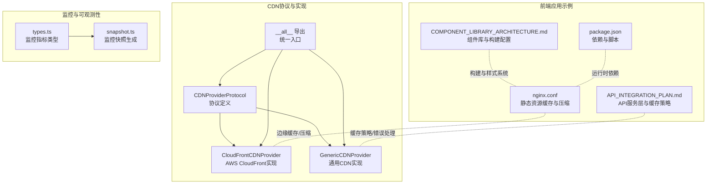
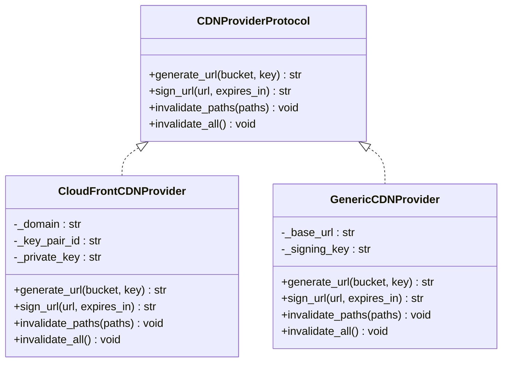
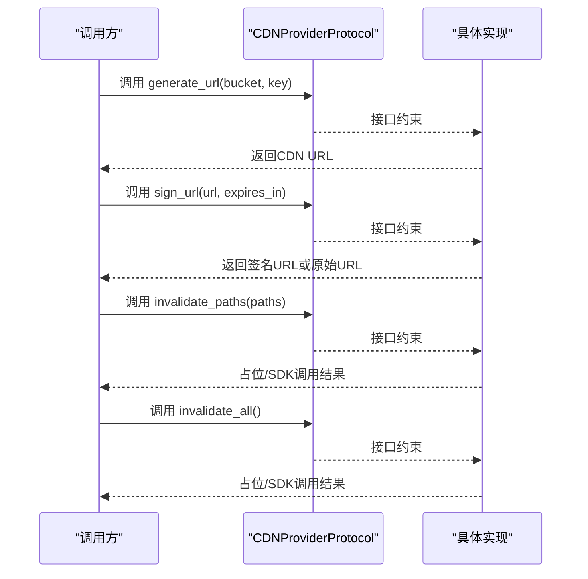
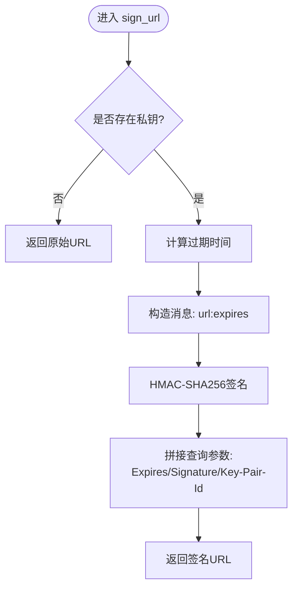
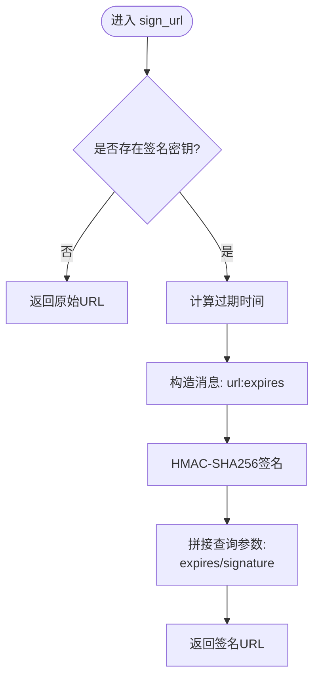
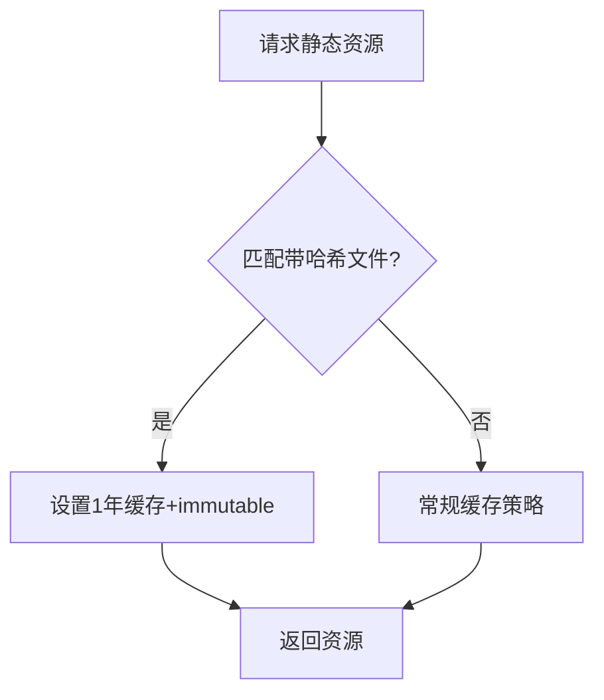
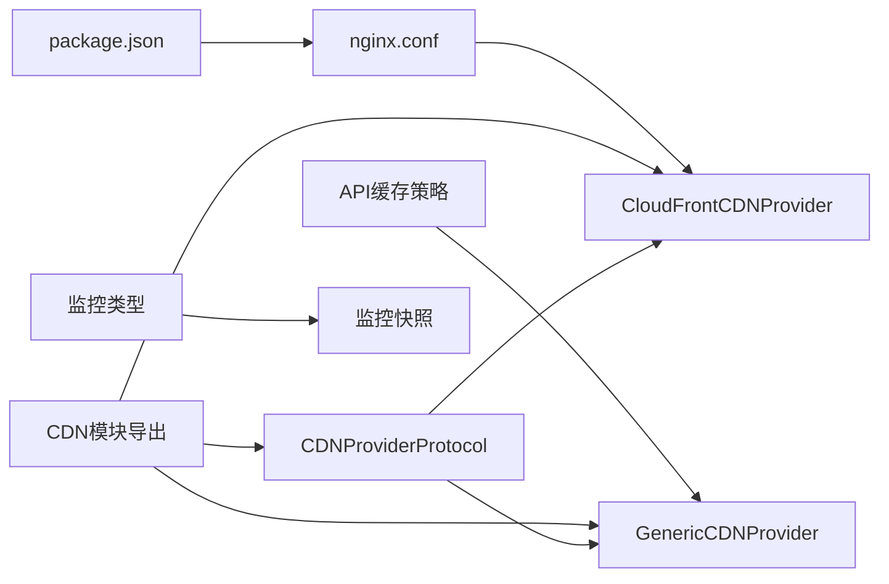

# CDN提供者集成

<cite>
**本文引用的文件**
- [cloudfront.py](file://tools/flexloop/src/taolib/testing/file_storage/cdn/cloudfront.py)
- [generic.py](file://tools/flexloop/src/taolib/testing/file_storage/cdn/generic.py)
- [protocols.py](file://tools/flexloop/src/taolib/testing/file_storage/cdn/protocols.py)
- [__init__.py](file://tools/flexloop/src/taolib/testing/file_storage/cdn/__init__.py)
- [nginx.conf](file://apps/AgentPit/nginx.conf)
- [API_INTEGRATION_PLAN.md](file://apps/AgentPit/docs/API_INTEGRATION_PLAN.md)
- [COMPONENT_LIBRARY_ARCHITECTURE.md](file://apps/AgentPit/docs/COMPONENT_LIBRARY_ARCHITECTURE.md)
- [package.json](file://apps/AgentPit/package.json)
- [types.ts](file://apps/DaoMind/packages/daoMonitor/src/types.ts)
- [snapshot.ts](file://apps/DaoMind/packages/daoMonitor/src/snapshot.ts)
</cite>

## 目录
1. [简介](#简介)
2. [项目结构](#项目结构)
3. [核心组件](#核心组件)
4. [架构总览](#架构总览)
5. [详细组件分析](#详细组件分析)
6. [依赖关系分析](#依赖关系分析)
7. [性能考量](#性能考量)
8. [故障排查指南](#故障排查指南)
9. [结论](#结论)
10. [附录](#附录)

## 简介
本文件面向CDN提供者集成，系统性阐述统一CDN协议接口设计、CloudFront与通用CDN提供者的实现差异、缓存策略与边缘节点管理、以及第三方CDN适配机制。文档同时给出配置示例、性能优化建议、缓存失效策略、带宽监控与成本控制方案，帮助在不同CDN供应商之间进行平滑切换与统一管理。

## 项目结构
CDN相关能力集中在工具库模块中，采用“协议 + 多实现”的分层设计，并在前端应用中提供Nginx缓存与压缩配置示例，形成从协议到实现再到边缘加速的整体闭环。

**图表来源**
- [protocols.py:1-29](file://tools/flexloop/src/taolib/testing/file_storage/cdn/protocols.py#L1-L29)
- [cloudfront.py:11-63](file://tools/flexloop/src/taolib/testing/file_storage/cdn/cloudfront.py#L11-L63)
- [generic.py:11-52](file://tools/flexloop/src/taolib/testing/file_storage/cdn/generic.py#L11-L52)
- [__init__.py:1-16](file://tools/flexloop/src/taolib/testing/file_storage/cdn/__init__.py#L1-L16)
- [nginx.conf:1-53](file://apps/AgentPit/nginx.conf#L1-L53)
- [API_INTEGRATION_PLAN.md:52-306](file://apps/AgentPit/docs/API_INTEGRATION_PLAN.md#L52-L306)
- [COMPONENT_LIBRARY_ARCHITECTURE.md:28-93](file://apps/AgentPit/docs/COMPONENT_LIBRARY_ARCHITECTURE.md#L28-L93)
- [package.json:1-74](file://apps/AgentPit/package.json#L1-L74)
- [types.ts:39-71](file://apps/DaoMind/packages/daoMonitor/src/types.ts#L39-L71)
- [snapshot.ts:38-75](file://apps/DaoMind/packages/daoMonitor/src/snapshot.ts#L38-L75)

**章节来源**
- [protocols.py:1-29](file://tools/flexloop/src/taolib/testing/file_storage/cdn/protocols.py#L1-L29)
- [cloudfront.py:11-63](file://tools/flexloop/src/taolib/testing/file_storage/cdn/cloudfront.py#L11-L63)
- [generic.py:11-52](file://tools/flexloop/src/taolib/testing/file_storage/cdn/generic.py#L11-L52)
- [__init__.py:1-16](file://tools/flexloop/src/taolib/testing/file_storage/cdn/__init__.py#L1-L16)
- [nginx.conf:1-53](file://apps/AgentPit/nginx.conf#L1-L53)
- [API_INTEGRATION_PLAN.md:52-306](file://apps/AgentPit/docs/API_INTEGRATION_PLAN.md#L52-L306)
- [COMPONENT_LIBRARY_ARCHITECTURE.md:28-93](file://apps/AgentPit/docs/COMPONENT_LIBRARY_ARCHITECTURE.md#L28-L93)
- [package.json:1-74](file://apps/AgentPit/package.json#L1-L74)
- [types.ts:39-71](file://apps/DaoMind/packages/daoMonitor/src/types.ts#L39-L71)
- [snapshot.ts:38-75](file://apps/DaoMind/packages/daoMonitor/src/snapshot.ts#L38-L75)

## 核心组件
- CDNProviderProtocol：定义统一的CDN接口，包括生成URL、签名URL、按路径刷新缓存、全量刷新缓存。
- CloudFrontCDNProvider：AWS CloudFront实现，提供URL生成、HMAC简化签名、缓存刷新占位实现。
- GenericCDNProvider：通用CDN实现，支持自定义base URL与HMAC签名，缓存刷新占位实现。
- CDN模块导出：统一暴露协议与实现，便于上层按需注入。

关键职责与行为：
- URL生成：根据bucket/key或自定义base URL拼接CDN访问地址。
- URL签名：在存在密钥时生成带过期时间的签名URL；无密钥则返回原始URL。
- 缓存刷新：提供按路径刷新与全量刷新接口，当前实现为占位，需结合具体供应商SDK落地。

**章节来源**
- [protocols.py:9-27](file://tools/flexloop/src/taolib/testing/file_storage/cdn/protocols.py#L9-L27)
- [cloudfront.py:14-61](file://tools/flexloop/src/taolib/testing/file_storage/cdn/cloudfront.py#L14-L61)
- [generic.py:17-49](file://tools/flexloop/src/taolib/testing/file_storage/cdn/generic.py#L17-L49)
- [__init__.py:6-14](file://tools/flexloop/src/taolib/testing/file_storage/cdn/__init__.py#L6-L14)

## 架构总览
CDN集成采用“协议抽象 + 多实现 + 边缘加速”的三层架构：
- 协议层：CDNProviderProtocol定义跨供应商统一接口。
- 实现层：CloudFrontCDNProvider与GenericCDNProvider分别对接AWS CloudFront与通用CDN。
- 边缘层：前端应用通过Nginx配置实现静态资源长期缓存、压缩与健康检查，降低CDN回源压力。

**图表来源**
- [protocols.py:9-27](file://tools/flexloop/src/taolib/testing/file_storage/cdn/protocols.py#L9-L27)
- [cloudfront.py:11-63](file://tools/flexloop/src/taolib/testing/file_storage/cdn/cloudfront.py#L11-L63)
- [generic.py:11-52](file://tools/flexloop/src/taolib/testing/file_storage/cdn/generic.py#L11-L52)

## 详细组件分析

### 协议接口设计（CDNProviderProtocol）
- 作用：为CDN提供者抽象统一接口，屏蔽不同供应商的差异。
- 关键方法：
  - generate_url：生成CDN访问URL。
  - sign_url：生成带过期时间的签名URL。
  - invalidate_paths：按路径刷新缓存。
  - invalidate_all：全量刷新缓存。

**图表来源**
- [protocols.py:9-27](file://tools/flexloop/src/taolib/testing/file_storage/cdn/protocols.py#L9-L27)

**章节来源**
- [protocols.py:9-27](file://tools/flexloop/src/taolib/testing/file_storage/cdn/protocols.py#L9-L27)

### CloudFront集成实现
- URL生成：基于distribution_domain与对象key拼接CDN URL。
- URL签名：在提供私钥时，生成包含过期时间、签名与Key-Pair-Id的签名URL；无私钥则直接返回原始URL。
- 缓存刷新：当前为占位实现，完整实现需调用AWS SDK的create_invalidation API。

**图表来源**
- [cloudfront.py:28-50](file://tools/flexloop/src/taolib/testing/file_storage/cdn/cloudfront.py#L28-L50)

**章节来源**
- [cloudfront.py:14-61](file://tools/flexloop/src/taolib/testing/file_storage/cdn/cloudfront.py#L14-L61)

### 通用CDN提供者适配机制
- URL生成：基于自定义base_url与bucket/key拼接CDN URL。
- URL签名：在提供signing_key时，生成包含过期时间与签名的查询参数；无密钥则直接返回原始URL。
- 缓存刷新：当前为占位实现，第三方CDN通常提供各自SDK或API进行刷新。

**图表来源**
- [generic.py:29-43](file://tools/flexloop/src/taolib/testing/file_storage/cdn/generic.py#L29-L43)

**章节来源**
- [generic.py:17-49](file://tools/flexloop/src/taolib/testing/file_storage/cdn/generic.py#L17-L49)

### 导出与统一入口
- CDN模块导出协议与两个实现，便于上层按需注入或配置切换。

**章节来源**
- [__init__.py:6-14](file://tools/flexloop/src/taolib/testing/file_storage/cdn/__init__.py#L6-L14)

### 边缘节点与静态资源缓存（Nginx示例）
- 长期缓存：对带哈希的静态资源（JS/CSS/媒体）设置一年缓存与immutable标志。
- 压缩：启用Gzip压缩，覆盖常见文本与JSON类型。
- 健康检查：提供/health端点返回200 OK。
- SPA回退：location /使用try_files回退至index.html。
- 安全头：添加X-Frame-Options等安全头。

**图表来源**
- [nginx.conf:34-39](file://apps/AgentPit/nginx.conf#L34-L39)

**章节来源**
- [nginx.conf:1-53](file://apps/AgentPit/nginx.conf#L1-L53)

## 依赖关系分析
- 协议与实现解耦：通过Protocol约束实现，避免上层与具体供应商耦合。
- 导出聚合：__all__统一导出，便于按需引入。
- 前端构建与运行时依赖：前端应用使用Vite、Tailwind CSS等，配合Nginx实现边缘加速。
- 监控与可观测性：监控快照包含系统健康度、告警与诊断，可用于评估CDN与边缘缓存效果。

**图表来源**
- [__init__.py:6-14](file://tools/flexloop/src/taolib/testing/file_storage/cdn/__init__.py#L6-L14)
- [protocols.py:9-27](file://tools/flexloop/src/taolib/testing/file_storage/cdn/protocols.py#L9-L27)
- [cloudfront.py:11-63](file://tools/flexloop/src/taolib/testing/file_storage/cdn/cloudfront.py#L11-L63)
- [generic.py:11-52](file://tools/flexloop/src/taolib/testing/file_storage/cdn/generic.py#L11-L52)
- [nginx.conf:1-53](file://apps/AgentPit/nginx.conf#L1-L53)
- [API_INTEGRATION_PLAN.md:254-306](file://apps/AgentPit/docs/API_INTEGRATION_PLAN.md#L254-L306)
- [package.json:1-74](file://apps/AgentPit/package.json#L1-L74)
- [types.ts:39-71](file://apps/DaoMind/packages/daoMonitor/src/types.ts#L39-L71)
- [snapshot.ts:38-75](file://apps/DaoMind/packages/daoMonitor/src/snapshot.ts#L38-L75)

**章节来源**
- [__init__.py:6-14](file://tools/flexloop/src/taolib/testing/file_storage/cdn/__init__.py#L6-L14)
- [protocols.py:9-27](file://tools/flexloop/src/taolib/testing/file_storage/cdn/protocols.py#L9-L27)
- [cloudfront.py:11-63](file://tools/flexloop/src/taolib/testing/file_storage/cdn/cloudfront.py#L11-L63)
- [generic.py:11-52](file://tools/flexloop/src/taolib/testing/file_storage/cdn/generic.py#L11-L52)
- [nginx.conf:1-53](file://apps/AgentPit/nginx.conf#L1-L53)
- [API_INTEGRATION_PLAN.md:254-306](file://apps/AgentPit/docs/API_INTEGRATION_PLAN.md#L254-L306)
- [package.json:1-74](file://apps/AgentPit/package.json#L1-L74)
- [types.ts:39-71](file://apps/DaoMind/packages/daoMonitor/src/types.ts#L39-L71)
- [snapshot.ts:38-75](file://apps/DaoMind/packages/daoMonitor/src/snapshot.ts#L38-L75)

## 性能考量
- 静态资源长期缓存：对带哈希的文件设置一年缓存与immutable，显著降低回源率。
- 压缩传输：启用Gzip压缩，减少带宽占用。
- 健康检查与回退：/health端点与SPA回退，提升可用性与用户体验。
- 缓存策略与错误处理：参考API集成方案中的缓存管理与错误处理，避免重复请求与网络抖动影响。
- 监控与诊断：通过监控快照评估系统健康度与异常，辅助定位CDN与边缘问题。

**章节来源**
- [nginx.conf:10-25](file://apps/AgentPit/nginx.conf#L10-L25)
- [nginx.conf:34-50](file://apps/AgentPit/nginx.conf#L34-L50)
- [API_INTEGRATION_PLAN.md:254-306](file://apps/AgentPit/docs/API_INTEGRATION_PLAN.md#L254-L306)
- [types.ts:39-71](file://apps/DaoMind/packages/daoMonitor/src/types.ts#L39-L71)
- [snapshot.ts:38-75](file://apps/DaoMind/packages/daoMonitor/src/snapshot.ts#L38-L75)

## 故障排查指南
- URL签名无效：
  - 检查是否提供私钥或签名密钥。
  - 确认过期时间是否正确计算。
  - 核对查询参数顺序与格式。
- 缓存刷新不生效：
  - 确认invalidate_paths/invalidate_all是否被正确调用。
  - 对CloudFront，需补充AWS SDK调用create_invalidation。
  - 对通用CDN，确认第三方SDK或API可用性。
- 边缘缓存命中异常：
  - 检查静态资源是否带哈希。
  - 确认Nginx缓存头与immutable设置。
  - 使用浏览器开发者工具查看缓存状态。
- 监控告警与诊断：
  - 依据监控快照中的告警与诊断信息定位瓶颈。
  - 结合系统健康度评估整体性能。

**章节来源**
- [cloudfront.py:28-61](file://tools/flexloop/src/taolib/testing/file_storage/cdn/cloudfront.py#L28-L61)
- [generic.py:29-49](file://tools/flexloop/src/taolib/testing/file_storage/cdn/generic.py#L29-L49)
- [nginx.conf:34-50](file://apps/AgentPit/nginx.conf#L34-L50)
- [types.ts:39-71](file://apps/DaoMind/packages/daoMonitor/src/types.ts#L39-L71)
- [snapshot.ts:38-75](file://apps/DaoMind/packages/daoMonitor/src/snapshot.ts#L38-L75)

## 结论
通过统一协议接口与多实现设计，CDN集成实现了对CloudFront与通用CDN的抽象与适配。结合前端Nginx边缘缓存与压缩、API层缓存与错误处理、以及监控快照诊断，可有效提升性能、稳定性与可观测性。后续建议完善各实现的缓存刷新SDK调用与签名算法细节，以满足生产环境需求。

## 附录

### CDN配置示例与最佳实践
- CloudFront配置要点：
  - 分发域名与对象访问路径。
  - 私有内容签名：提供Key-Pair-Id与私钥，生成带过期时间的签名URL。
  - 缓存刷新：使用AWS SDK调用create_invalidation。
- 通用CDN配置要点：
  - 自定义base URL与对象路径规则。
  - 签名密钥与过期时间参数。
  - 缓存刷新：接入第三方CDN提供的SDK或API。
- 前端边缘加速：
  - 对带哈希的静态资源设置一年缓存与immutable。
  - 启用Gzip压缩，覆盖常用文本与JSON类型。
  - 提供/health端点与SPA回退。

**章节来源**
- [cloudfront.py:14-61](file://tools/flexloop/src/taolib/testing/file_storage/cdn/cloudfront.py#L14-L61)
- [generic.py:17-49](file://tools/flexloop/src/taolib/testing/file_storage/cdn/generic.py#L17-L49)
- [nginx.conf:10-25](file://apps/AgentPit/nginx.conf#L10-L25)
- [nginx.conf:34-50](file://apps/AgentPit/nginx.conf#L34-L50)

### 缓存失效策略与成本控制
- 缓存失效策略：
  - 按路径刷新：针对特定资源更新。
  - 全量刷新：在重大版本升级时使用。
  - 结合版本化文件名（带哈希），减少不必要的全量刷新。
- 带宽监控与成本控制：
  - 通过监控快照评估系统健康度与异常。
  - 优化静态资源缓存与压缩策略，降低回源次数与带宽消耗。
  - 结合CDN提供商的用量与费用模型，制定预算与告警阈值。

**章节来源**
- [API_INTEGRATION_PLAN.md:254-306](file://apps/AgentPit/docs/API_INTEGRATION_PLAN.md#L254-L306)
- [types.ts:39-71](file://apps/DaoMind/packages/daoMonitor/src/types.ts#L39-L71)
- [snapshot.ts:38-75](file://apps/DaoMind/packages/daoMonitor/src/snapshot.ts#L38-L75)