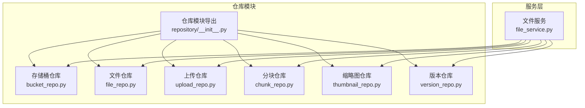
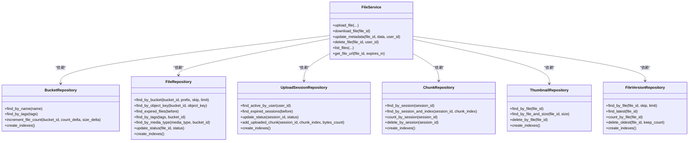
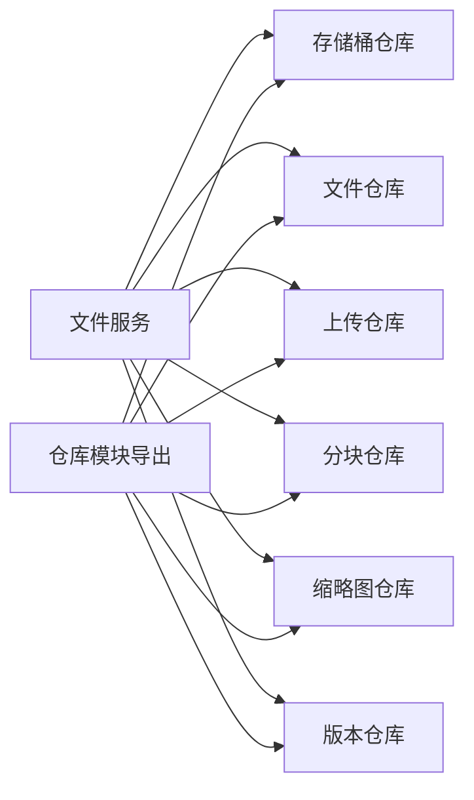

# 仓库层设计

<cite>
**本文引用的文件**
- [仓库模块导出](file://tools/flexloop/src/taolib/testing/file_storage/repository/__init__.py)
- [文件服务](file://tools/flexloop/src/taolib/testing/file_storage/services/file_service.py)
- [文件模型导出](file://tools/flexloop/src/taolib/testing/file_storage/models/__init__.py)
- [存储桶仓库](file://tools/flexloop/src/taolib/testing/file_storage/repository/bucket_repo.py)
- [文件仓库](file://tools/flexloop/src/taolib/testing/file_storage/repository/file_repo.py)
- [上传仓库](file://tools/flexloop/src/taolib/testing/file_storage/repository/upload_repo.py)
- [缩略图仓库](file://tools/flexloop/src/taolib/testing/file_storage/repository/thumbnail_repo.py)
- [版本仓库](file://tools/flexloop/src/taolib/testing/file_storage/repository/version_repo.py)
- [分块仓库](file://tools/flexloop/src/taolib/testing/file_storage/repository/chunk_repo.py)
- [文件服务测试](file://tools/flexloop/tests/testing/test_file_storage/test_services.py)
- [仓库测试](file://tools/flexloop/tests/testing/test_file_storage/test_repository.py)
</cite>

## 目录
1. [简介](#简介)
2. [项目结构](#项目结构)
3. [核心组件](#核心组件)
4. [架构总览](#架构总览)
5. [详细组件分析](#详细组件分析)
6. [依赖关系分析](#依赖关系分析)
7. [性能考量](#性能考量)
8. [故障排查指南](#故障排查指南)
9. [结论](#结论)
10. [附录](#附录)

## 简介
本文件系统性阐述仓库层设计与实现，聚焦于文件存储领域的仓库模式。仓库层通过抽象数据访问接口，将业务服务与底层存储解耦，统一提供对存储桶、文件元数据、上传会话、分片记录、缩略图以及版本信息的持久化能力。本文将详细说明各仓库类的职责边界、数据模型与索引策略、版本管理与生命周期管理、事务与并发控制建议，并给出典型使用场景与查询优化技巧。

## 项目结构
仓库层位于工具链模块中，采用“按功能域分层”的组织方式：
- 仓库模块导出：集中暴露所有仓库类，便于上层服务按需注入
- 仓库实现：每个仓库对应一个领域实体，封装 CRUD 与查询方法
- 服务层：文件服务等业务编排器，协调多个仓库与外部后端
- 测试：覆盖仓库行为与服务流程的单元与集成测试

图表来源
- [仓库模块导出:1-23](file://tools/flexloop/src/taolib/testing/file_storage/repository/__init__.py#L1-L23)
- [文件服务:30-48](file://tools/flexloop/src/taolib/testing/file_storage/services/file_service.py#L30-L48)

章节来源
- [仓库模块导出:1-23](file://tools/flexloop/src/taolib/testing/file_storage/repository/__init__.py#L1-L23)
- [文件服务:30-48](file://tools/flexloop/src/taolib/testing/file_storage/services/file_service.py#L30-L48)

## 核心组件
- 仓库基类：统一的异步仓库抽象，提供通用的 CRUD 与查询模板
- 存储桶仓库：负责存储桶的增删改查、标签过滤、文件计数与容量增量更新、索引维护
- 文件仓库：负责文件元数据的增删改查、按桶/前缀/标签/媒体类型的检索、过期文件扫描、状态更新、索引维护
- 上传仓库：负责上传会话的活跃查询、过期扫描、状态变更、已上传分片集合与字节累计更新、索引维护
- 分块仓库：负责分片记录的按会话查询、按索引查询、计数与批量清理、索引维护
- 缩略图仓库：负责按文件查询、按尺寸查询、按文件删除、索引维护
- 版本仓库：负责版本历史查询、最新版本获取、版本计数、删除最旧版本并保留指定数量、索引维护

章节来源
- [存储桶仓库:12-66](file://tools/flexloop/src/taolib/testing/file_storage/repository/bucket_repo.py#L12-L66)
- [文件仓库:14-128](file://tools/flexloop/src/taolib/testing/file_storage/repository/file_repo.py#L14-L128)
- [上传仓库:13-98](file://tools/flexloop/src/taolib/testing/file_storage/repository/upload_repo.py#L13-L98)
- [分块仓库:10-57](file://tools/flexloop/src/taolib/testing/file_storage/repository/chunk_repo.py#L10-L57)
- [缩略图仓库:11-48](file://tools/flexloop/src/taolib/testing/file_storage/repository/thumbnail_repo.py#L11-L48)
- [版本仓库:10-68](file://tools/flexloop/src/taolib/testing/file_storage/repository/version_repo.py#L10-L68)

## 架构总览
仓库层围绕“领域模型 + 仓库 + 服务”的分层架构展开。服务层通过依赖注入的方式组合多个仓库，完成复杂的业务流程；仓库层负责与底层存储交互并保证查询与更新的原子性与一致性。

图表来源
- [文件服务:30-48](file://tools/flexloop/src/taolib/testing/file_storage/services/file_service.py#L30-L48)
- [存储桶仓库:12-66](file://tools/flexloop/src/taolib/testing/file_storage/repository/bucket_repo.py#L12-L66)
- [文件仓库:14-128](file://tools/flexloop/src/taolib/testing/file_storage/repository/file_repo.py#L14-L128)
- [上传仓库:13-98](file://tools/flexloop/src/taolib/testing/file_storage/repository/upload_repo.py#L13-L98)
- [分块仓库:10-57](file://tools/flexloop/src/taolib/testing/file_storage/repository/chunk_repo.py#L10-L57)
- [缩略图仓库:11-48](file://tools/flexloop/src/taolib/testing/file_storage/repository/thumbnail_repo.py#L11-L48)
- [版本仓库:10-68](file://tools/flexloop/src/taolib/testing/file_storage/repository/version_repo.py#L10-L68)

## 详细组件分析

### 存储桶仓库（BucketRepository）
- 职责：存储桶的命名唯一性约束、标签过滤、按存储类别筛选、文件计数与容量的增量更新、索引维护
- 关键点：使用原子更新确保计数与容量的一致性；索引覆盖名称、标签、存储类别等高频查询字段
- 使用示例路径：在文件服务上传流程中调用计数增量更新，以同步桶统计

章节来源
- [存储桶仓库:18-57](file://tools/flexloop/src/taolib/testing/file_storage/repository/bucket_repo.py#L18-L57)
- [文件服务:124-127](file://tools/flexloop/src/taolib/testing/file_storage/services/file_service.py#L124-L127)

### 文件仓库（FileRepository）
- 职责：文件元数据的多维检索（桶、前缀、标签、媒体类型）、过期文件扫描、状态更新、索引维护
- 关键点：复合索引支持按桶+对象键唯一定位；按创建时间倒序排序用于最新文件展示
- 使用示例路径：文件服务的列表与查询接口均基于该仓库实现

章节来源
- [文件仓库:20-125](file://tools/flexloop/src/taolib/testing/file_storage/repository/file_repo.py#L20-L125)
- [文件服务:237-256](file://tools/flexloop/src/taolib/testing/file_storage/services/file_service.py#L237-L256)

### 上传仓库（UploadSessionRepository）
- 职责：用户活跃上传会话查询、过期会话扫描、状态变更、已上传分片集合与累计字节更新、索引维护
- 关键点：原子更新已上传分片集合与字节计数，避免重复提交与竞态条件
- 使用示例路径：分片上传服务在上传完成后调用此仓库更新会话状态与进度

章节来源
- [上传仓库:19-89](file://tools/flexloop/src/taolib/testing/file_storage/repository/upload_repo.py#L19-L89)
- [文件服务测试:500-641](file://tools/flexloop/tests/testing/test_file_storage/test_services.py#L500-L641)

### 分块仓库（ChunkRepository）
- 职责：按会话查询分片、按索引查询单一分片、统计与批量清理、索引维护
- 关键点：复合索引保证会话+分片索引的唯一性，支持有序遍历与清理
- 使用示例路径：分片上传服务在写入后查询与校验分片记录

章节来源
- [分块仓库:16-55](file://tools/flexloop/src/taolib/testing/file_storage/repository/chunk_repo.py#L16-L55)
- [仓库测试:145-179](file://tools/flexloop/tests/testing/test_file_storage/test_repository.py#L145-L179)

### 缩略图仓库（ThumbnailRepository）
- 职责：按文件查询缩略图、按尺寸查询特定缩略图、按文件删除缩略图记录、索引维护
- 关键点：复合索引保证文件+尺寸唯一性，便于快速定位目标缩略图
- 使用示例路径：文件服务在生成缩略图后写入并回填文件元数据

章节来源
- [缩略图仓库:17-45](file://tools/flexloop/src/taolib/testing/file_storage/repository/thumbnail_repo.py#L17-L45)
- [文件服务:129-170](file://tools/flexloop/src/taolib/testing/file_storage/services/file_service.py#L129-L170)

### 版本仓库（FileVersionRepository）
- 职责：版本历史查询（按版本号降序）、最新版本获取、版本计数、删除最旧版本并保留指定数量、索引维护
- 关键点：复合索引保证文件+版本号唯一性，支持高效版本回溯与生命周期清理
- 使用示例路径：版本创建与回滚流程中通过该仓库进行版本查询与清理

章节来源
- [版本仓库:16-65](file://tools/flexloop/src/taolib/testing/file_storage/repository/version_repo.py#L16-L65)
- [文件服务测试:772-797](file://tools/flexloop/tests/testing/test_file_storage/test_services.py#L772-L797)

### 数据模型与元数据存储机制
- 模型导出：统一导出枚举与数据模型，涵盖存储桶、文件元数据、上传会话、分片记录、缩略图信息、版本信息与统计响应
- 元数据字段：文件元数据包含桶标识、对象键、原始文件名、内容类型、大小、媒体类型、访问级别、标签、自定义元数据、存储路径、校验和、版本、状态、CDN 地址、缩略图列表、过期时间、创建者与时间戳等
- 生命周期：通过桶级生命周期规则自动计算过期时间；文件仓库提供过期扫描接口；上传仓库提供过期会话扫描接口

章节来源
- [文件模型导出:1-85](file://tools/flexloop/src/taolib/testing/file_storage/models/__init__.py#L1-L85)
- [文件服务:99-121](file://tools/flexloop/src/taolib/testing/file_storage/services/file_service.py#L99-L121)
- [文件仓库:59-72](file://tools/flexloop/src/taolib/testing/file_storage/repository/file_repo.py#L59-L72)
- [上传仓库:39-59](file://tools/flexloop/src/taolib/testing/file_storage/repository/upload_repo.py#L39-L59)

### 版本管理策略
- 版本控制：每次创建新版本时，从最新版本号递增；若无历史版本则从 1 开始
- 回滚机制：通过查询最新版本或指定版本号进行回滚；结合缩略图与存储路径保持一致性
- 生命周期管理：定期清理最旧版本，保留指定数量，降低存储压力

章节来源
- [文件服务测试:772-797](file://tools/flexloop/tests/testing/test_file_storage/test_services.py#L772-L797)
- [版本仓库:51-58](file://tools/flexloop/src/taolib/testing/file_storage/repository/version_repo.py#L51-L58)

### 事务处理、并发控制与一致性保障
- 原子更新：文件与桶的计数/容量更新采用原子更新，避免并发写导致的不一致
- 原子集合更新：上传会话使用原子更新追加已上传分片索引，确保幂等与一致性
- 并发读：查询接口使用索引与投影减少锁竞争；批量清理采用分批策略降低阻塞
- 一致性建议：跨仓库操作建议在服务层进行编排，必要时引入分布式锁或消息队列保证最终一致性

章节来源
- [存储桶仓库:43-53](file://tools/flexloop/src/taolib/testing/file_storage/repository/bucket_repo.py#L43-L53)
- [上传仓库:74-88](file://tools/flexloop/src/taolib/testing/file_storage/repository/upload_repo.py#L74-L88)
- [文件仓库:110-114](file://tools/flexloop/src/taolib/testing/file_storage/repository/file_repo.py#L110-L114)

### 查询优化技巧
- 复合索引：按查询条件构建复合索引，如文件仓库的桶+对象键唯一索引、版本仓库的文件+版本号唯一索引
- 排序与限制：列表接口默认按创建时间倒序并限制条数，避免全表扫描
- 前缀匹配：文件仓库支持按对象键前缀匹配，结合索引提升前缀查询效率
- 批量清理：分块与版本仓库提供批量删除接口，配合分批策略降低单次操作成本

章节来源
- [文件仓库:116-125](file://tools/flexloop/src/taolib/testing/file_storage/repository/file_repo.py#L116-L125)
- [版本仓库:60-66](file://tools/flexloop/src/taolib/testing/file_storage/repository/version_repo.py#L60-L66)
- [上传仓库:91-96](file://tools/flexloop/src/taolib/testing/file_storage/repository/upload_repo.py#L91-L96)
- [分块仓库:49-55](file://tools/flexloop/src/taolib/testing/file_storage/repository/chunk_repo.py#L49-L55)

## 依赖关系分析
仓库模块集中导出所有仓库类，服务层通过依赖注入组合多个仓库，形成清晰的依赖方向：服务层 → 仓库层。测试用例覆盖了仓库行为与服务流程的关键路径，确保依赖关系与契约稳定。

图表来源
- [仓库模块导出:6-20](file://tools/flexloop/src/taolib/testing/file_storage/repository/__init__.py#L6-L20)
- [文件服务:33-47](file://tools/flexloop/src/taolib/testing/file_storage/services/file_service.py#L33-L47)

章节来源
- [仓库模块导出:6-20](file://tools/flexloop/src/taolib/testing/file_storage/repository/__init__.py#L6-L20)
- [文件服务:33-47](file://tools/flexloop/src/taolib/testing/file_storage/services/file_service.py#L33-L47)

## 性能考量
- 索引策略：为高频查询字段建立复合索引，减少全表扫描；合理选择排序字段与投影字段
- 批处理：对批量删除与清理操作采用分批策略，避免长事务与锁竞争
- 流式读取：下载接口采用流式迭代器，降低内存占用
- CDN 集成：公开访问优先使用 CDN 直链，减少后端压力；私有访问使用预签名 URL

## 故障排查指南
- 上传会话异常
  - 症状：分片上传报错或会话状态异常
  - 排查：检查会话是否存在、是否已过期、分片索引是否越界、校验和是否匹配
  - 参考路径：[文件服务测试:591-641](file://tools/flexloop/tests/testing/test_file_storage/test_services.py#L591-L641)
- 文件不存在
  - 症状：下载或获取 URL 报错
  - 排查：确认文件 ID 是否正确、状态是否为已删除、存储路径是否有效
  - 参考路径：[文件服务:180-185](file://tools/flexloop/src/taolib/testing/file_storage/services/file_service.py#L180-L185)
- 版本回滚失败
  - 症状：无法获取指定版本或最新版本为空
  - 排查：确认版本仓库中是否存在历史版本、版本号是否连续、清理策略是否误删
  - 参考路径：[文件服务测试:772-797](file://tools/flexloop/tests/testing/test_file_storage/test_services.py#L772-L797)
- 过期资源未清理
  - 症状：存储空间持续增长
  - 排查：检查过期扫描任务是否执行、时间阈值设置是否合理、索引是否生效
  - 参考路径：[文件仓库:59-72](file://tools/flexloop/src/taolib/testing/file_storage/repository/file_repo.py#L59-L72), [上传仓库:39-59](file://tools/flexloop/src/taolib/testing/file_storage/repository/upload_repo.py#L39-L59)

章节来源
- [文件服务测试:591-641](file://tools/flexloop/tests/testing/test_file_storage/test_services.py#L591-L641)
- [文件服务:180-185](file://tools/flexloop/src/taolib/testing/file_storage/services/file_service.py#L180-L185)
- [文件仓库:59-72](file://tools/flexloop/src/taolib/testing/file_storage/repository/file_repo.py#L59-L72)
- [上传仓库:39-59](file://tools/flexloop/src/taolib/testing/file_storage/repository/upload_repo.py#L39-L59)

## 结论
仓库层通过统一的抽象接口与完善的索引策略，为文件存储提供了高内聚、低耦合的数据访问能力。结合服务层的编排与测试用例的覆盖，系统在版本管理、生命周期清理、并发控制与一致性保障方面具备良好的可维护性与扩展性。建议在生产环境中配合监控与告警，持续优化索引与批处理策略，确保性能与稳定性。

## 附录
- 仓库使用示例路径
  - 上传文件：[文件服务.upload_file:49-171](file://tools/flexloop/src/taolib/testing/file_storage/services/file_service.py#L49-L171)
  - 列出文件：[文件服务.list_files:237-256](file://tools/flexloop/src/taolib/testing/file_storage/services/file_service.py#L237-L256)
  - 获取文件 URL：[文件服务.get_file_url:258-271](file://tools/flexloop/src/taolib/testing/file_storage/services/file_service.py#L258-L271)
  - 创建版本：[文件服务测试.create_file_version:772-797](file://tools/flexloop/tests/testing/test_file_storage/test_services.py#L772-L797)
- 查询优化参考路径
  - 文件仓库索引：[文件仓库.create_indexes:116-125](file://tools/flexloop/src/taolib/testing/file_storage/repository/file_repo.py#L116-L125)
  - 版本仓库索引：[版本仓库.create_indexes:60-66](file://tools/flexloop/src/taolib/testing/file_storage/repository/version_repo.py#L60-L66)
  - 上传仓库索引：[上传仓库.create_indexes:91-96](file://tools/flexloop/src/taolib/testing/file_storage/repository/upload_repo.py#L91-L96)
  - 分块仓库索引：[分块仓库.create_indexes:49-55](file://tools/flexloop/src/taolib/testing/file_storage/repository/chunk_repo.py#L49-L55)