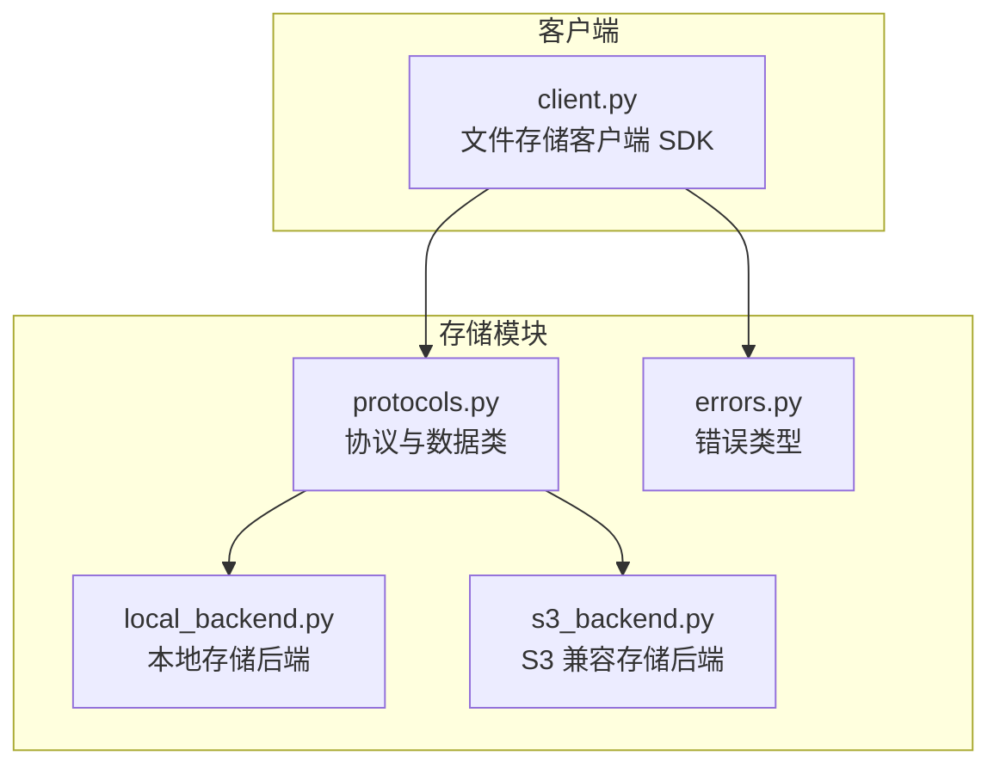
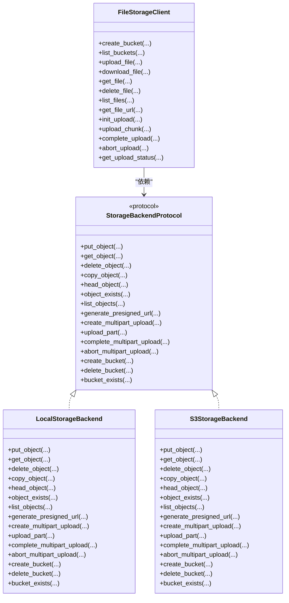
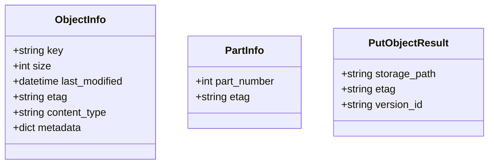
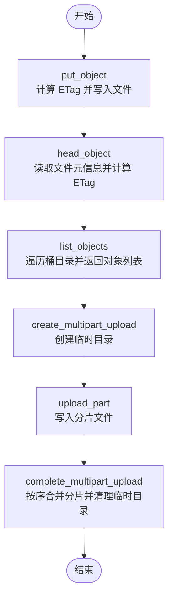
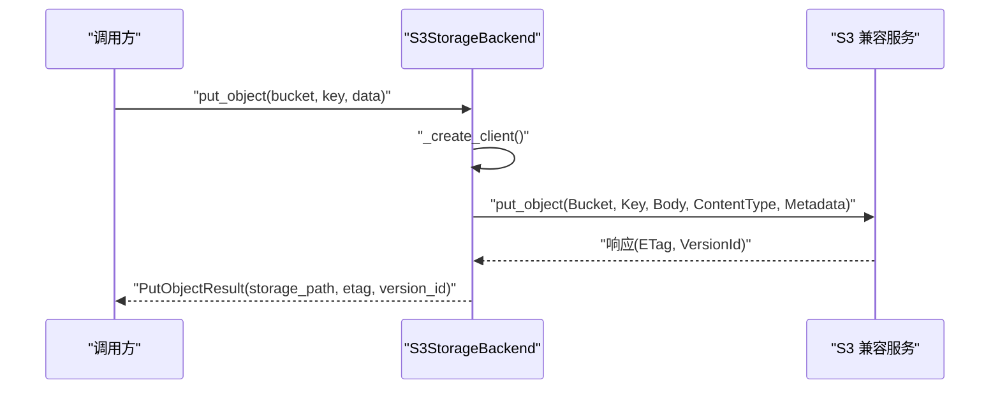
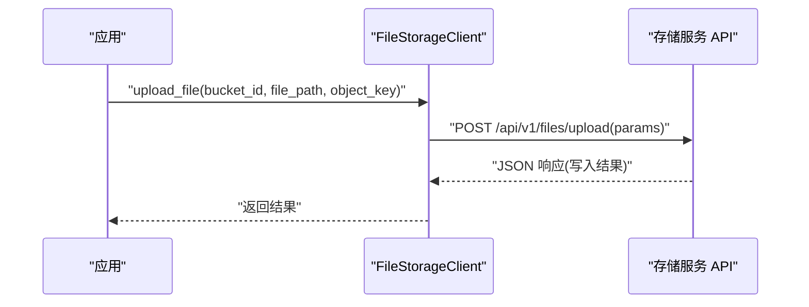
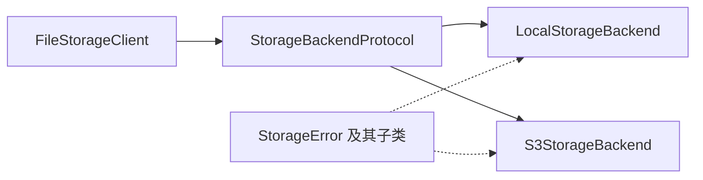

# 存储后端实现

<cite>
**本文引用的文件**
- [s3_backend.py](file://tools/flexloop/src/taolib/testing/file_storage/storage/s3_backend.py)
- [local_backend.py](file://tools/flexloop/src/taolib/testing/file_storage/storage/local_backend.py)
- [protocols.py](file://tools/flexloop/src/taolib/testing/file_storage/storage/protocols.py)
- [__init__.py（存储模块）](file://tools/flexloop/src/taolib/testing/file_storage/storage/__init__.py)
- [errors.py](file://tools/flexloop/src/taolib/testing/file_storage/errors.py)
- [client.py](file://tools/flexloop/src/taolib/testing/file_storage/client.py)
- [__init__.py（文件存储模块）](file://tools/flexloop/src/taolib/testing/file_storage/__init__.py)
</cite>

## 目录
1. [简介](#简介)
2. [项目结构](#项目结构)
3. [核心组件](#核心组件)
4. [架构总览](#架构总览)
5. [组件详解](#组件详解)
6. [依赖关系分析](#依赖关系分析)
7. [性能考量](#性能考量)
8. [故障排查指南](#故障排查指南)
9. [结论](#结论)
10. [附录：配置与使用示例](#附录配置与使用示例)

## 简介
本技术文档聚焦于存储后端实现，涵盖统一的存储协议接口设计、本地文件系统存储后端与 S3 兼容存储后端的实现细节，并提供配置示例、性能对比、故障转移与成本优化建议。该实现以协议驱动的方式屏蔽底层差异，既可运行于本地开发环境，也可对接 AWS S3、MinIO、阿里云 OSS 等 S3 兼容对象存储。

## 项目结构
存储子系统位于工具库模块内，采用“协议 + 多后端实现”的分层组织方式：
- 协议与数据模型：定义统一的存储操作接口与数据结构
- 后端实现：本地文件系统与 S3 兼容客户端
- 客户端 SDK：提供同步/异步调用封装
- 错误体系：统一的异常类型，便于上层处理

图表来源
- [protocols.py:41-157](file://tools/flexloop/src/taolib/testing/file_storage/storage/protocols.py#L41-L157)
- [local_backend.py:22-254](file://tools/flexloop/src/taolib/testing/file_storage/storage/local_backend.py#L22-L254)
- [s3_backend.py:18-337](file://tools/flexloop/src/taolib/testing/file_storage/storage/s3_backend.py#L18-L337)
- [errors.py:7-63](file://tools/flexloop/src/taolib/testing/file_storage/errors.py#L7-L63)
- [client.py:14-214](file://tools/flexloop/src/taolib/testing/file_storage/client.py#L14-L214)

章节来源
- [__init__.py（存储模块）:1-25](file://tools/flexloop/src/taolib/testing/file_storage/storage/__init__.py#L1-L25)
- [__init__.py（文件存储模块）:1-43](file://tools/flexloop/src/taolib/testing/file_storage/__init__.py#L1-L43)

## 核心组件
- 统一协议接口：通过协议类定义所有存储操作，确保不同后端的一致行为契约
- 数据模型：对象信息、分片信息、写入结果等不可变数据结构
- 本地存储后端：基于文件系统，支持分片上传、ETag 计算、桶目录管理
- S3 兼容存储后端：基于异步 S3 客户端，覆盖对象 CRUD、桶操作、分片上传与签名 URL
- 客户端 SDK：封装 HTTP 接口，支持简单上传、分片上传、下载、URL 获取等
- 错误体系：统一的异常类型，便于上层捕获与处理

章节来源
- [protocols.py:12-157](file://tools/flexloop/src/taolib/testing/file_storage/storage/protocols.py#L12-L157)
- [local_backend.py:22-254](file://tools/flexloop/src/taolib/testing/file_storage/storage/local_backend.py#L22-L254)
- [s3_backend.py:18-337](file://tools/flexloop/src/taolib/testing/file_storage/storage/s3_backend.py#L18-L337)
- [client.py:14-214](file://tools/flexloop/src/taolib/testing/file_storage/client.py#L14-L214)
- [errors.py:7-63](file://tools/flexloop/src/taolib/testing/file_storage/errors.py#L7-L63)

## 架构总览
下图展示协议、后端实现与客户端之间的关系，以及关键方法的调用链路。

图表来源
- [protocols.py:41-157](file://tools/flexloop/src/taolib/testing/file_storage/storage/protocols.py#L41-L157)
- [local_backend.py:22-254](file://tools/flexloop/src/taolib/testing/file_storage/storage/local_backend.py#L22-L254)
- [s3_backend.py:18-337](file://tools/flexloop/src/taolib/testing/file_storage/storage/s3_backend.py#L18-L337)
- [client.py:14-214](file://tools/flexloop/src/taolib/testing/file_storage/client.py#L14-L214)

## 组件详解

### 协议与数据模型
- 协议接口：定义了对象的增删改查、桶管理、分片上传与签名 URL 的完整能力集，确保多后端一致性
- 数据模型：
  - 对象信息：包含键、大小、最后修改时间、ETag、内容类型与元数据
  - 分片信息：包含分片编号与 ETag
  - 写入结果：包含存储路径、ETag 与版本号

图表来源
- [protocols.py:12-40](file://tools/flexloop/src/taolib/testing/file_storage/storage/protocols.py#L12-L40)

章节来源
- [protocols.py:12-157](file://tools/flexloop/src/taolib/testing/file_storage/storage/protocols.py#L12-L157)

### 本地存储后端（LocalStorageBackend）
- 路径管理：以基础目录为根，按桶名与对象键构建层级路径；桶即目录
- 权限控制：直接使用操作系统文件权限；开发/测试场景默认目录可写
- 磁盘空间监控：未内置自动监控；可通过外部工具或系统命令进行统计
- 分片上传：在临时目录维护分片，完成后合并并清理临时目录
- ETag：使用 MD5 计算内容摘要作为 ETag
- 主要方法：put_object、get_object、delete_object、copy_object、head_object、list_objects、generate_presigned_url、分片上传系列、桶操作

图表来源
- [local_backend.py:36-254](file://tools/flexloop/src/taolib/testing/file_storage/storage/local_backend.py#L36-L254)

章节来源
- [local_backend.py:22-254](file://tools/flexloop/src/taolib/testing/file_storage/storage/local_backend.py#L22-L254)

### S3 兼容存储后端（S3StorageBackend）
- 认证配置：支持区域、访问密钥、秘密密钥与端点 URL；延迟创建会话
- 对象操作：上传、下载（流式）、删除、复制、头信息获取、存在性检查、列举
- 分片上传：创建会话、上传分片、完成合并、中止会话
- 桶操作：创建、删除、存在性检查
- 签名 URL：生成 GET/PUT 预签名链接
- 主要方法：与协议一致，内部通过异步 S3 客户端调用对应 API

图表来源
- [s3_backend.py:57-93](file://tools/flexloop/src/taolib/testing/file_storage/storage/s3_backend.py#L57-L93)

章节来源
- [s3_backend.py:18-337](file://tools/flexloop/src/taolib/testing/file_storage/storage/s3_backend.py#L18-L337)

### 客户端 SDK（FileStorageClient）
- 提供同步与异步 HTTP 客户端封装
- 支持桶管理、文件上传/下载/删除/列举、获取访问 URL、分片上传全流程
- 自动推断内容类型，按文件大小选择简单/分片上传策略

图表来源
- [client.py:62-89](file://tools/flexloop/src/taolib/testing/file_storage/client.py#L62-L89)

章节来源
- [client.py:14-214](file://tools/flexloop/src/taolib/testing/file_storage/client.py#L14-L214)

## 依赖关系分析
- 协议与实现解耦：通过协议类约束，本地与 S3 后端均可注入到上层逻辑
- 客户端依赖协议：客户端不直接依赖具体后端，而是通过协议与后端交互
- 错误体系统一：所有后端异常最终归类到统一的错误类型，便于上层处理

图表来源
- [protocols.py:41-157](file://tools/flexloop/src/taolib/testing/file_storage/storage/protocols.py#L41-L157)
- [local_backend.py:22-254](file://tools/flexloop/src/taolib/testing/file_storage/storage/local_backend.py#L22-L254)
- [s3_backend.py:18-337](file://tools/flexloop/src/taolib/testing/file_storage/storage/s3_backend.py#L18-L337)
- [errors.py:7-63](file://tools/flexloop/src/taolib/testing/file_storage/errors.py#L7-L63)
- [client.py:14-214](file://tools/flexloop/src/taolib/testing/file_storage/client.py#L14-L214)

章节来源
- [__init__.py（存储模块）:1-25](file://tools/flexloop/src/taolib/testing/file_storage/storage/__init__.py#L1-L25)
- [__init__.py（文件存储模块）:1-43](file://tools/flexloop/src/taolib/testing/file_storage/__init__.py#L1-L43)

## 性能考量
- 本地存储
  - 顺序读写：适合小文件与开发测试场景
  - 分片上传：避免一次性加载大文件至内存，降低峰值内存占用
  - ETag：MD5 计算带来 CPU 开销，可结合缓存策略
- S3 兼容
  - 流式下载：减少内存占用，提升大文件下载稳定性
  - 分片上传：提高大文件传输可靠性与并发度
  - 网络抖动：建议重试与断点续传策略
- 通用建议
  - 小文件：优先简单上传；大文件：启用分片上传
  - 并发：合理设置分片大小与并发数
  - 缓存：对热点对象使用 CDN 或本地缓存

## 故障排查指南
- 常见错误类型
  - 存储后端错误：上传/下载/删除/列举失败时抛出
  - 文件/桶不存在：对象或桶不存在时抛出
  - 访问被拒绝：鉴权失败或权限不足
  - 上传会话相关：会话不存在或过期
  - 分片校验：分片索引或校验和不匹配
  - 配额超限：超出配额限制
  - 签名 URL 验证：签名 URL 校验失败
- 定位步骤
  - 检查后端连接参数（端点、区域、密钥）
  - 校验桶与对象键命名规范
  - 查看网络与 DNS 解析
  - 关注分片上传状态与会话 ID
  - 结合日志定位具体异常类型

章节来源
- [errors.py:7-63](file://tools/flexloop/src/taolib/testing/file_storage/errors.py#L7-L63)

## 结论
该存储后端实现以协议为核心，屏蔽了本地文件系统与 S3 兼容服务的差异，提供了统一的对象与桶管理能力。本地后端适合开发与测试，S3 后端可无缝对接多种对象存储服务。配合客户端 SDK，可快速实现从简单到复杂的文件存储与分片上传场景。

## 附录：配置与使用示例
以下为常见配置与使用要点（以路径引用代替具体代码片段）：
- 本地存储后端
  - 初始化：指定基础存储目录
  - 分片上传：创建会话、上传分片、完成合并
  - 示例参考：[local_backend.py:25-254](file://tools/flexloop/src/taolib/testing/file_storage/storage/local_backend.py#L25-L254)
- S3 兼容存储后端
  - 初始化：设置端点 URL、区域、访问密钥、秘密密钥
  - 桶操作：创建/删除/存在性检查
  - 对象操作：上传/下载/复制/删除/头信息/列举/签名 URL
  - 分片上传：创建会话、上传分片、完成合并/中止
  - 示例参考：[s3_backend.py:24-337](file://tools/flexloop/src/taolib/testing/file_storage/storage/s3_backend.py#L24-L337)
- 客户端 SDK
  - 桶管理：创建/列举
  - 文件操作：上传/下载/删除/列举/获取 URL
  - 分片上传：初始化/上传分片/完成/中止/查询状态
  - 示例参考：[client.py:45-212](file://tools/flexloop/src/taolib/testing/file_storage/client.py#L45-L212)
- 导出与聚合
  - 存储模块导出：本地后端、S3 后端、协议与数据类
  - 文件存储模块导出：客户端与枚举
  - 参考：[storage/__init__.py:1-25](file://tools/flexloop/src/taolib/testing/file_storage/storage/__init__.py#L1-L25)、[__init__.py（文件存储模块）:1-43](file://tools/flexloop/src/taolib/testing/file_storage/__init__.py#L1-L43)