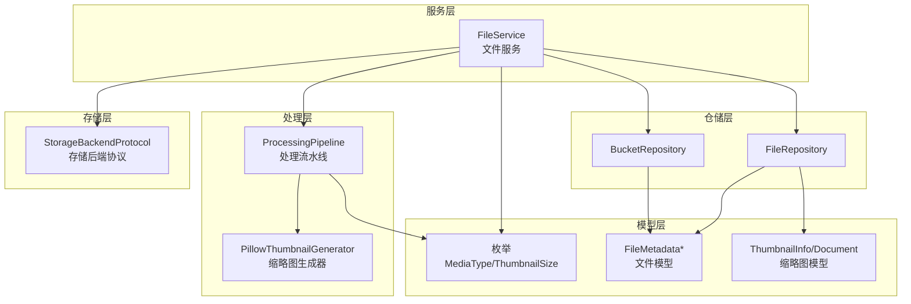
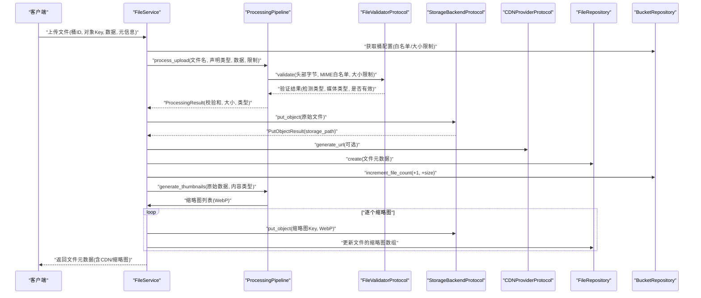
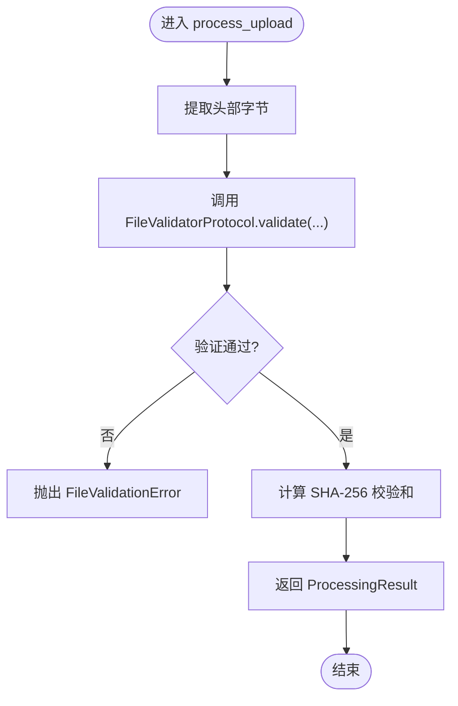
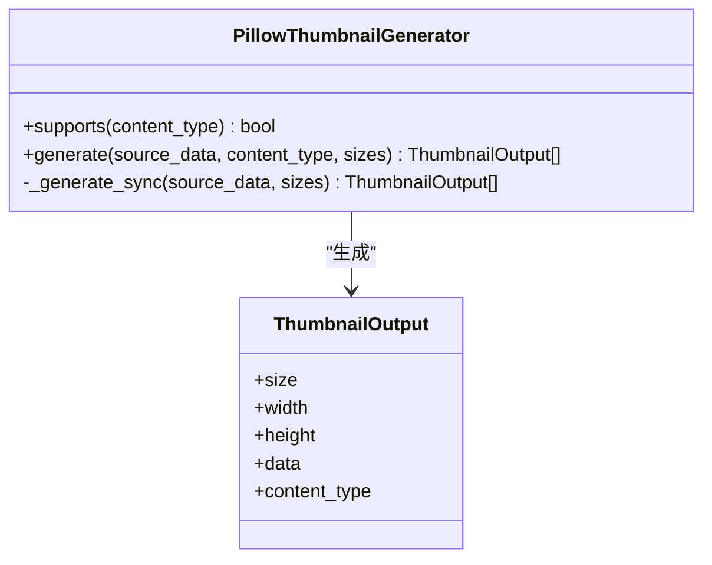
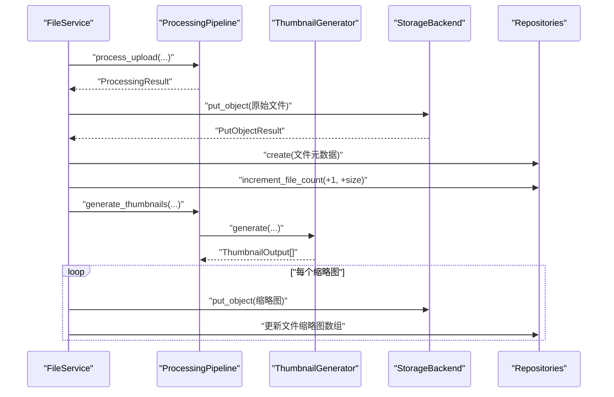
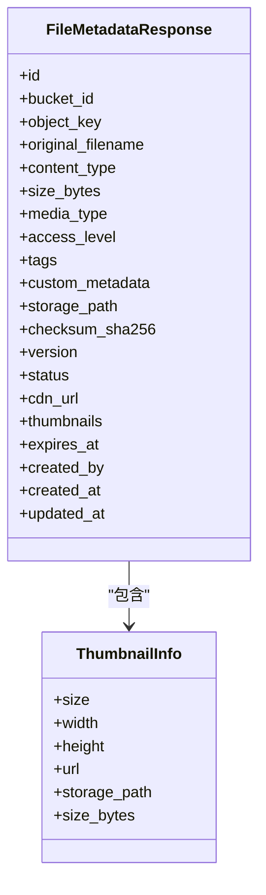
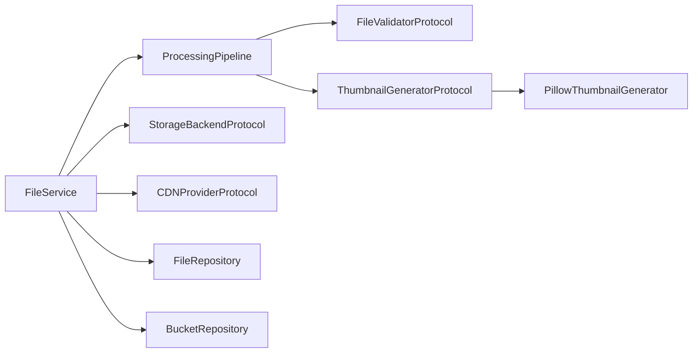

# 文件处理管道

<cite>
**本文引用的文件**
- [pipeline.py](file://tools/flexloop/src/taolib/testing/file_storage/processing/pipeline.py)
- [thumbnail.py](file://tools/flexloop/src/taolib/testing/file_storage/processing/thumbnail.py)
- [protocols.py](file://tools/flexloop/src/taolib/testing/file_storage/processing/protocols.py)
- [enums.py](file://tools/flexloop/src/taolib/testing/file_storage/models/enums.py)
- [file_service.py](file://tools/flexloop/src/taolib/testing/file_storage/services/file_service.py)
- [file.py](file://tools/flexloop/src/taolib/testing/file_storage/models/file.py)
- [thumbnail.py](file://tools/flexloop/src/taolib/testing/file_storage/models/thumbnail.py)
- [file_repo.py](file://tools/flexloop/src/taolib/testing/file_storage/repository/file_repo.py)
- [bucket_repo.py](file://tools/flexloop/src/taolib/testing/file_storage/repository/bucket_repo.py)
- [protocols.py](file://tools/flexloop/src/taolib/testing/file_storage/storage/protocols.py)
- [test_processing.py](file://tools/flexloop/tests/testing/test_file_storage/test_processing.py)
- [test_services.py](file://tools/flexloop/tests/testing/test_file_storage/test_services.py)
</cite>

## 目录
1. [简介](#简介)
2. [项目结构](#项目结构)
3. [核心组件](#核心组件)
4. [架构总览](#架构总览)
5. [详细组件分析](#详细组件分析)
6. [依赖分析](#依赖分析)
7. [性能考虑](#性能考虑)
8. [故障排查指南](#故障排查指南)
9. [结论](#结论)
10. [附录](#附录)

## 简介
本文件处理管道面向“文件上传—验证—转换—缩略图—持久化—CDN/URL”的完整流水线，覆盖以下关键能力：
- 上传处理：接收文件、提取头部字节、执行内容类型与大小校验、计算校验和。
- 格式转换：将图片统一转码为 WebP，按多规格生成缩略图。
- 缩略图生成：尺寸管理（小/中/大）、格式转换（WebP）、异步生成与存储。
- 验证机制：大小限制、MIME 白名单、魔数检测、内容安全与合规性提示。
- 后处理：写入存储后端、更新桶统计、生成 CDN URL、记录缩略图信息。
- 并发与弹性：线程池隔离 CPU 密集任务、异步生成缩略图、预签名 URL 与 CDN 结合。

## 项目结构
文件处理相关代码主要位于 tools/flexloop/src/taolib/testing/file_storage 目录下，按职责划分为：
- processing：处理流水线与缩略图生成
- services：业务服务（上传、下载、元数据管理）
- models：数据模型（文件、缩略图、枚举等）
- repository：仓储层（文件、桶、缩略图）
- storage：存储后端协议
- tests：单元/集成测试

图表来源
- [file_service.py:30-48](file://tools/flexloop/src/taolib/testing/file_storage/services/file_service.py#L30-L48)
- [pipeline.py:29-42](file://tools/flexloop/src/taolib/testing/file_storage/processing/pipeline.py#L29-L42)
- [thumbnail.py:30-48](file://tools/flexloop/src/taolib/testing/file_storage/processing/thumbnail.py#L30-L48)
- [enums.py:45-61](file://tools/flexloop/src/taolib/testing/file_storage/models/enums.py#L45-L61)
- [file_repo.py:14-18](file://tools/flexloop/src/taolib/testing/file_storage/repository/file_repo.py#L14-L18)
- [bucket_repo.py:12-16](file://tools/flexloop/src/taolib/testing/file_storage/repository/bucket_repo.py#L12-L16)
- [protocols.py:41-84](file://tools/flexloop/src/taolib/testing/file_storage/storage/protocols.py#L41-L84)

章节来源
- [file_service.py:30-48](file://tools/flexloop/src/taolib/testing/file_storage/services/file_service.py#L30-L48)
- [pipeline.py:29-42](file://tools/flexloop/src/taolib/testing/file_storage/processing/pipeline.py#L29-L42)
- [thumbnail.py:30-48](file://tools/flexloop/src/taolib/testing/file_storage/processing/thumbnail.py#L30-L48)
- [enums.py:45-61](file://tools/flexloop/src/taolib/testing/file_storage/models/enums.py#L45-L61)
- [file_repo.py:14-18](file://tools/flexloop/src/taolib/testing/file_storage/repository/file_repo.py#L14-L18)
- [bucket_repo.py:12-16](file://tools/flexloop/src/taolib/testing/file_storage/repository/bucket_repo.py#L12-L16)
- [protocols.py:41-84](file://tools/flexloop/src/taolib/testing/file_storage/storage/protocols.py#L41-L84)

## 核心组件
- 处理流水线 ProcessingPipeline：负责验证与后处理（校验和、媒体类型、内容类型），并委派缩略图生成。
- 缩略图生成器 PillowThumbnailGenerator：基于 Pillow 在线程池中生成多规格 WebP 缩略图。
- 文件服务 FileService：编排上传全流程，调用流水线、存储后端、CDN、仓储层。
- 协议与模型：FileValidatorProtocol/ThumbnailGeneratorProtocol、ProcessingResult/ThumbnailOutput、枚举与数据模型。
- 仓储层：FileRepository/BucketRepository 提供文件与桶的 CRUD、索引与统计更新。
- 存储后端协议 StorageBackendProtocol：抽象 S3 兼容/本地等后端的统一接口。

章节来源
- [pipeline.py:29-92](file://tools/flexloop/src/taolib/testing/file_storage/processing/pipeline.py#L29-L92)
- [thumbnail.py:30-89](file://tools/flexloop/src/taolib/testing/file_storage/processing/thumbnail.py#L30-L89)
- [file_service.py:49-171](file://tools/flexloop/src/taolib/testing/file_storage/services/file_service.py#L49-L171)
- [protocols.py:33-84](file://tools/flexloop/src/taolib/testing/file_storage/processing/protocols.py#L33-L84)
- [file_repo.py:14-127](file://tools/flexloop/src/taolib/testing/file_storage/repository/file_repo.py#L14-L127)
- [bucket_repo.py:12-57](file://tools/flexloop/src/taolib/testing/file_storage/repository/bucket_repo.py#L12-L57)
- [protocols.py:41-158](file://tools/flexloop/src/taolib/testing/file_storage/storage/protocols.py#L41-L158)

## 架构总览
文件处理管道的端到端流程如下：

图表来源
- [file_service.py:49-171](file://tools/flexloop/src/taolib/testing/file_storage/services/file_service.py#L49-L171)
- [pipeline.py:43-92](file://tools/flexloop/src/taolib/testing/file_storage/processing/pipeline.py#L43-L92)
- [protocols.py:48-57](file://tools/flexloop/src/taolib/testing/file_storage/storage/protocols.py#L48-L57)

章节来源
- [file_service.py:49-171](file://tools/flexloop/src/taolib/testing/file_storage/services/file_service.py#L49-L171)
- [pipeline.py:43-114](file://tools/flexloop/src/taolib/testing/file_storage/processing/pipeline.py#L43-L114)

## 详细组件分析

### 处理流水线 ProcessingPipeline
- 输入：文件名、声明的 Content-Type、原始数据、可选的 MIME 白名单与最大文件大小。
- 步骤：
  - 截取前若干字节作为头部，交由 FileValidatorProtocol 进行魔数与类型检测。
  - 若验证失败，抛出文件验证异常；否则继续。
  - 计算 SHA-256 校验和。
  - 返回 ProcessingResult（包含检测后的 Content-Type、媒体类型、校验和、大小）。
- 缩略图生成：若存在 ThumbnailGeneratorProtocol 且支持该类型，则异步生成指定尺寸列表（默认全规格）。

图表来源
- [pipeline.py:43-92](file://tools/flexloop/src/taolib/testing/file_storage/processing/pipeline.py#L43-L92)

章节来源
- [pipeline.py:43-92](file://tools/flexloop/src/taolib/testing/file_storage/processing/pipeline.py#L43-L92)
- [protocols.py:33-58](file://tools/flexloop/src/taolib/testing/file_storage/processing/protocols.py#L33-L58)

### 缩略图生成器 PillowThumbnailGenerator
- 支持类型：JPEG/PNG/WebP/GIF。
- 尺寸映射：小(150x150)、中(400x400)、大(800x800)。
- 处理流程：
  - 若不支持类型，直接返回空列表。
  - 使用 Pillow 将 RGBA/P 模式转换为 RGB，避免透明背景问题。
  - 按 LANCZOS 重采样生成缩略图，保存为 WebP（质量 85）。
  - 输出 ThumbnailOutput 列表（含尺寸、宽高、二进制数据、Content-Type）。
- 并发策略：在 asyncio 线程池中执行 CPU 密集的图像处理，避免阻塞事件循环。

图表来源
- [thumbnail.py:30-89](file://tools/flexloop/src/taolib/testing/file_storage/processing/thumbnail.py#L30-L89)
- [protocols.py:22-31](file://tools/flexloop/src/taolib/testing/file_storage/processing/protocols.py#L22-L31)

章节来源
- [thumbnail.py:30-89](file://tools/flexloop/src/taolib/testing/file_storage/processing/thumbnail.py#L30-L89)
- [enums.py:45-50](file://tools/flexloop/src/taolib/testing/file_storage/models/enums.py#L45-L50)

### 文件服务 FileService
- 上传主流程：
  - 获取桶配置（白名单、大小限制、生命周期等）。
  - 调用流水线进行验证与后处理。
  - 写入存储后端，生成存储路径。
  - 可选生成 CDN URL。
  - 创建文件元数据文档，更新桶统计。
  - 异步生成缩略图并写入存储，更新文件的缩略图数组。
- 其他能力：下载（流式）、更新元数据、删除（含缩略图清理）、列举、生成访问 URL（公开/预签名）。

图表来源
- [file_service.py:49-171](file://tools/flexloop/src/taolib/testing/file_storage/services/file_service.py#L49-L171)
- [pipeline.py:94-114](file://tools/flexloop/src/taolib/testing/file_storage/processing/pipeline.py#L94-L114)

章节来源
- [file_service.py:49-171](file://tools/flexloop/src/taolib/testing/file_storage/services/file_service.py#L49-L171)

### 数据模型与枚举
- 枚举：MediaType（图片/视频/文档/音频/其他）、ThumbnailSize（小/中/大）。
- 文件模型：FileMetadataResponse/Document/Base/Create/Update，包含桶ID、对象键、原始文件名、Content-Type、大小、媒体类型、访问级别、标签、自定义元数据、校验和、版本、状态、CDN URL、缩略图列表、过期时间、创建者与时间戳。
- 缩略图模型：ThumbnailInfo/Document，包含尺寸、宽高、URL、存储路径、大小。

图表来源
- [file.py:53-114](file://tools/flexloop/src/taolib/testing/file_storage/models/file.py#L53-L114)
- [thumbnail.py:13-48](file://tools/flexloop/src/taolib/testing/file_storage/models/thumbnail.py#L13-L48)
- [enums.py:53-61](file://tools/flexloop/src/taolib/testing/file_storage/models/enums.py#L53-L61)

章节来源
- [file.py:53-114](file://tools/flexloop/src/taolib/testing/file_storage/models/file.py#L53-L114)
- [thumbnail.py:13-48](file://tools/flexloop/src/taolib/testing/file_storage/models/thumbnail.py#L13-L48)
- [enums.py:45-61](file://tools/flexloop/src/taolib/testing/file_storage/models/enums.py#L45-L61)

### 仓储层与存储后端
- FileRepository：按桶、前缀、标签、媒体类型查询，更新状态，创建索引。
- BucketRepository：按名称/标签查询，增量更新文件数量与总大小。
- StorageBackendProtocol：统一抽象 put/get/delete/head/list/copy/multipart 等操作，并支持生成预签名 URL。

章节来源
- [file_repo.py:14-127](file://tools/flexloop/src/taolib/testing/file_storage/repository/file_repo.py#L14-L127)
- [bucket_repo.py:12-57](file://tools/flexloop/src/taolib/testing/file_storage/repository/bucket_repo.py#L12-L57)
- [protocols.py:41-158](file://tools/flexloop/src/taolib/testing/file_storage/storage/protocols.py#L41-L158)

## 依赖分析
- 组件耦合：
  - FileService 依赖 ProcessingPipeline、StorageBackendProtocol、CDNProviderProtocol、FileRepository、BucketRepository。
  - ProcessingPipeline 依赖 FileValidatorProtocol、ThumbnailGeneratorProtocol。
  - 缩略图生成器依赖 Pillow（运行时导入）。
- 协议解耦：
  - 通过 FileValidatorProtocol/ThumbnailGeneratorProtocol/StorageBackendProtocol 抽象，便于替换实现（如不同存储后端或验证策略）。
- 潜在环路：未发现直接循环依赖；各层职责清晰，遵循单向依赖。

图表来源
- [file_service.py:30-48](file://tools/flexloop/src/taolib/testing/file_storage/services/file_service.py#L30-L48)
- [pipeline.py:29-42](file://tools/flexloop/src/taolib/testing/file_storage/processing/pipeline.py#L29-L42)
- [protocols.py:33-84](file://tools/flexloop/src/taolib/testing/file_storage/processing/protocols.py#L33-L84)
- [thumbnail.py:30-48](file://tools/flexloop/src/taolib/testing/file_storage/processing/thumbnail.py#L30-L48)

章节来源
- [file_service.py:30-48](file://tools/flexloop/src/taolib/testing/file_storage/services/file_service.py#L30-L48)
- [pipeline.py:29-42](file://tools/flexloop/src/taolib/testing/file_storage/processing/pipeline.py#L29-L42)
- [protocols.py:33-84](file://tools/flexloop/src/taolib/testing/file_storage/processing/protocols.py#L33-L84)
- [thumbnail.py:30-48](file://tools/flexloop/src/taolib/testing/file_storage/processing/thumbnail.py#L30-L48)

## 性能考虑
- CPU 密集任务隔离：缩略图生成在 asyncio 线程池中执行，避免阻塞事件循环。
- I/O 并行：上传与缩略图生成采用异步并行策略，减少端到端延迟。
- 缓存策略：
  - 缩略图生成后直接写入存储后端，后续访问优先走 CDN。
  - 可结合应用层缓存（如内存/Redis）缓存热点缩略图元数据。
- 资源限制：通过桶级白名单与大小限制控制输入规模，避免异常流量。
- 存储与索引：仓储层创建必要索引以优化查询性能。

## 故障排查指南
- 常见错误与定位：
  - 文件验证失败：检查声明的 Content-Type 与实际魔数是否一致，确认是否命中白名单与大小限制。
  - 缩略图为空：确认内容类型是否受支持、是否注入了缩略图生成器。
  - 存储失败：检查存储后端可用性、桶权限、对象键冲突。
  - CDN 未生效：确认 CDN Provider 已配置，公开访问级别与 URL 生成逻辑。
- 单元测试参考：
  - 处理流程与验证：[test_processing.py:93-134](file://tools/flexloop/tests/testing/test_file_storage/test_processing.py#L93-L134)
  - 上传成功与缩略图流程：[test_services.py:314-343](file://tools/flexloop/tests/testing/test_file_storage/test_services.py#L314-L343)

章节来源
- [test_processing.py:93-134](file://tools/flexloop/tests/testing/test_file_storage/test_processing.py#L93-L134)
- [test_services.py:314-343](file://tools/flexloop/tests/testing/test_file_storage/test_services.py#L314-L343)

## 结论
该文件处理管道以协议与模型为核心，实现了从上传到缩略图生成的完整链路，具备良好的扩展性与可维护性。通过线程池隔离 CPU 密集任务、异步并行处理与 CDN 结合，能够在保证吞吐的同时提升用户体验。建议在生产环境中配合完善的监控与告警体系，持续优化缩略图质量参数与缓存策略。

## 附录

### 配置示例（概念性说明）
- 桶级配置（示例字段）：允许的 MIME 类型列表、最大文件大小、生命周期自动过期天数、访问级别策略。
- 缩略图规格：小/中/大三档尺寸，输出格式为 WebP，质量 85。
- 存储后端：S3 兼容或本地文件系统，需实现 StorageBackendProtocol。
- CDN：可选，用于生成公开访问 URL 或预签名 URL。

### 自定义处理器开发指南
- 自定义文件验证器：
  - 实现 FileValidatorProtocol.validate(...)，支持魔数检测、MIME 白名单、大小限制与错误收集。
  - 返回 FileValidationResult（valid、errors、detected_content_type、media_type）。
- 自定义缩略图生成器：
  - 实现 ThumbnailGeneratorProtocol.supports/generate，返回 ThumbnailOutput 列表。
  - 注意在线程池中执行 CPU 密集任务。
- 自定义存储后端：
  - 实现 StorageBackendProtocol 的所有方法，确保 put/get/delete/head/list 等行为一致。
- 集成到流水线：
  - 将自定义实现注入到 ProcessingPipeline 与 FileService 中，即可无缝替换默认行为。