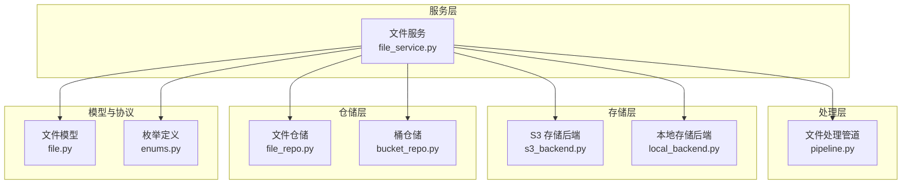
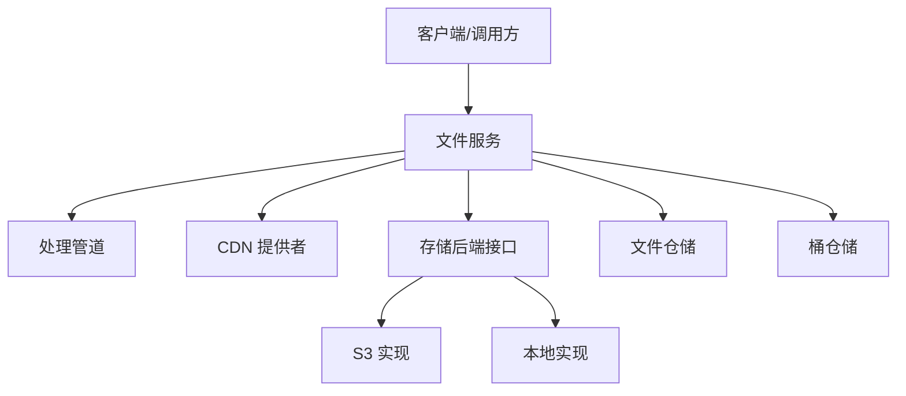
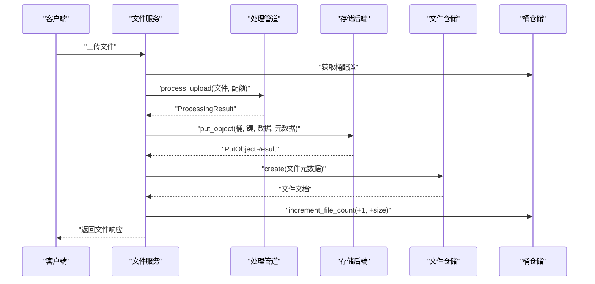
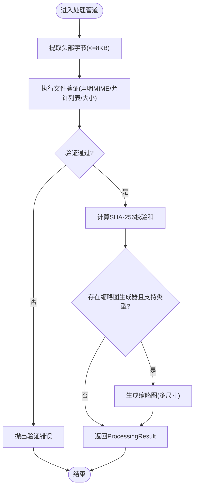
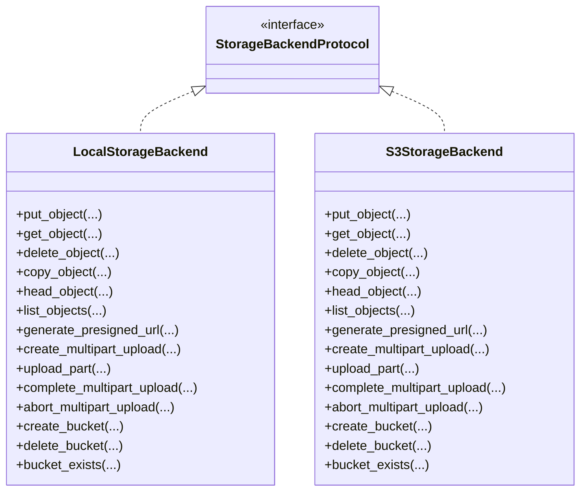
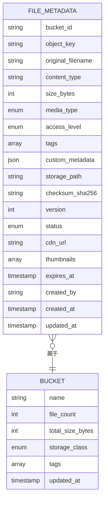
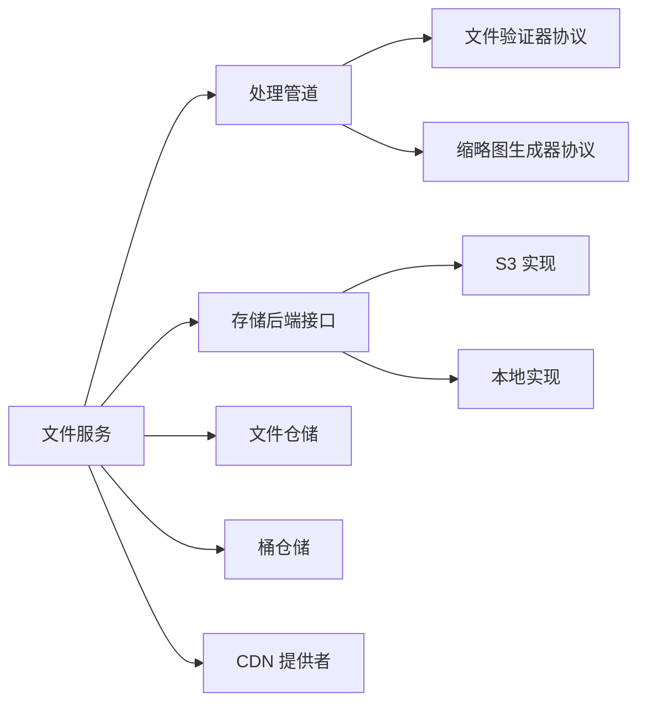

# 文件存储系统

<cite>
**本文引用的文件**
- [文件服务](file://tools/flexloop/src/taolib/testing/file_storage/services/file_service.py)
- [文件处理管道](file://tools/flexloop/src/taolib/testing/file_storage/processing/pipeline.py)
- [S3 存储后端](file://tools/flexloop/src/taolib/testing/file_storage/storage/s3_backend.py)
- [本地存储后端](file://tools/flexloop/src/taolib/testing/file_storage/storage/local_backend.py)
- [文件仓储](file://tools/flexloop/src/taolib/testing/file_storage/repository/file_repo.py)
- [桶仓储](file://tools/flexloop/src/taolib/testing/file_storage/repository/bucket_repo.py)
- [文件模型](file://tools/flexloop/src/taolib/testing/file_storage/models/file.py)
- [枚举定义](file://tools/flexloop/src/taolib/testing/file_storage/models/enums.py)
- [文件存储服务端应用](file://tools/flexloop/src/taolib/testing/file_storage/server/app.py)
- [文件存储单元测试（服务）](file://tools/flexloop/tests/testing/test_file_storage/test_services.py)
- [文件存储单元测试（处理）](file://tools/flexloop/tests/testing/test_file_storage/test_processing.py)
</cite>

## 目录
1. [简介](#简介)
2. [项目结构](#项目结构)
3. [核心组件](#核心组件)
4. [架构总览](#架构总览)
5. [详细组件分析](#详细组件分析)
6. [依赖关系分析](#依赖关系分析)
7. [性能考量](#性能考量)
8. [故障排查指南](#故障排查指南)
9. [结论](#结论)
10. [附录](#附录)

## 简介
本文件存储系统围绕“文件服务”为中心，结合“文件处理管道”、“存储后端抽象”、“CDN 协议”以及“仓储层”，提供统一的文件上传、下载、元数据管理、缩略图生成与访问控制能力。系统支持本地文件系统与 S3 兼容存储，并通过 CDN 提供加速访问；同时内置生命周期规则与版本化能力，满足多场景需求。

## 项目结构
该系统位于工具包子模块中，采用“服务-处理-存储-仓储-模型-协议”的分层组织方式，便于替换存储后端与扩展处理流程。

图表来源
- [文件服务:30-274](file://tools/flexloop/src/taolib/testing/file_storage/services/file_service.py#L30-L274)
- [文件处理管道:29-116](file://tools/flexloop/src/taolib/testing/file_storage/processing/pipeline.py#L29-L116)
- [S3 存储后端:18-337](file://tools/flexloop/src/taolib/testing/file_storage/storage/s3_backend.py#L18-L337)
- [本地存储后端:22-254](file://tools/flexloop/src/taolib/testing/file_storage/storage/local_backend.py#L22-L254)
- [文件仓储:14-128](file://tools/flexloop/src/taolib/testing/file_storage/repository/file_repo.py#L14-L128)
- [桶仓储:12-66](file://tools/flexloop/src/taolib/testing/file_storage/repository/bucket_repo.py#L12-L66)
- [文件模型:19-117](file://tools/flexloop/src/taolib/testing/file_storage/models/file.py#L19-L117)
- [枚举定义:9-63](file://tools/flexloop/src/taolib/testing/file_storage/models/enums.py#L9-L63)

章节来源
- [文件服务:1-274](file://tools/flexloop/src/taolib/testing/file_storage/services/file_service.py#L1-L274)
- [文件处理管道:1-117](file://tools/flexloop/src/taolib/testing/file_storage/processing/pipeline.py#L1-L117)
- [S3 存储后端:1-337](file://tools/flexloop/src/taolib/testing/file_storage/storage/s3_backend.py#L1-L337)
- [本地存储后端:1-254](file://tools/flexloop/src/taolib/testing/file_storage/storage/local_backend.py#L1-L254)
- [文件仓储:1-128](file://tools/flexloop/src/taolib/testing/file_storage/repository/file_repo.py#L1-L128)
- [桶仓储:1-66](file://tools/flexloop/src/taolib/testing/file_storage/repository/bucket_repo.py#L1-L66)
- [文件模型:1-117](file://tools/flexloop/src/taolib/testing/file_storage/models/file.py#L1-L117)
- [枚举定义:1-63](file://tools/flexloop/src/taolib/testing/file_storage/models/enums.py#L1-L63)

## 核心组件
- 文件服务：封装上传、下载、元数据更新、删除、列举等业务逻辑，协调处理管道、存储后端与仓储层。
- 文件处理管道：负责文件验证（含魔数检测）、计算校验和、可选缩略图生成。
- 存储后端：抽象出统一接口，分别提供本地文件系统与 S3 兼容实现。
- 仓储层：MongoDB 文档模型与 CRUD 封装，包含索引与聚合查询。
- 模型与枚举：定义文件元数据、访问级别、状态、媒体类型、缩略图尺寸等。
- CDN 协议：可插拔的 CDN 提供者，用于生成公开访问 URL 或签名 URL。

章节来源
- [文件服务:30-274](file://tools/flexloop/src/taolib/testing/file_storage/services/file_service.py#L30-L274)
- [文件处理管道:29-116](file://tools/flexloop/src/taolib/testing/file_storage/processing/pipeline.py#L29-L116)
- [S3 存储后端:18-337](file://tools/flexloop/src/taolib/testing/file_storage/storage/s3_backend.py#L18-L337)
- [本地存储后端:22-254](file://tools/flexloop/src/taolib/testing/file_storage/storage/local_backend.py#L22-L254)
- [文件仓储:14-128](file://tools/flexloop/src/taolib/testing/file_storage/repository/file_repo.py#L14-L128)
- [桶仓储:12-66](file://tools/flexloop/src/taolib/testing/file_storage/repository/bucket_repo.py#L12-L66)
- [文件模型:19-117](file://tools/flexloop/src/taolib/testing/file_storage/models/file.py#L19-L117)
- [枚举定义:9-63](file://tools/flexloop/src/taolib/testing/file_storage/models/enums.py#L9-L63)

## 架构总览
系统采用“服务编排 + 管道处理 + 后端适配 + 仓储持久化”的架构，支持本地与 S3 兼容存储无缝切换，并通过 CDN 提升访问性能。

图表来源
- [文件服务:30-274](file://tools/flexloop/src/taolib/testing/file_storage/services/file_service.py#L30-L274)
- [文件处理管道:29-116](file://tools/flexloop/src/taolib/testing/file_storage/processing/pipeline.py#L29-L116)
- [S3 存储后端:18-337](file://tools/flexloop/src/taolib/testing/file_storage/storage/s3_backend.py#L18-L337)
- [本地存储后端:22-254](file://tools/flexloop/src/taolib/testing/file_storage/storage/local_backend.py#L22-L254)
- [文件仓储:14-128](file://tools/flexloop/src/taolib/testing/file_storage/repository/file_repo.py#L14-L128)
- [桶仓储:12-66](file://tools/flexloop/src/taolib/testing/file_storage/repository/bucket_repo.py#L12-L66)

## 详细组件分析

### 文件服务（业务编排）
- 负责上传、下载、元数据更新、删除、列举、URL 生成等。
- 上传流程：桶配置校验 → 处理管道（验证+校验和）→ 存储后端写入 → 元数据入库 → 统计更新 → 缩略图异步生成与入库 → 返回响应。
- URL 生成：公开访问优先返回 CDN URL；否则生成预签名 URL。
- 删除流程：删除后端对象 → 删除缩略图及其记录 → 更新桶统计 → 标记文件为删除状态。

图表来源
- [文件服务:49-171](file://tools/flexloop/src/taolib/testing/file_storage/services/file_service.py#L49-L171)
- [文件处理管道:43-92](file://tools/flexloop/src/taolib/testing/file_storage/processing/pipeline.py#L43-L92)
- [文件仓储:17-128](file://tools/flexloop/src/taolib/testing/file_storage/repository/file_repo.py#L17-L128)
- [桶仓储:36-57](file://tools/flexloop/src/taolib/testing/file_storage/repository/bucket_repo.py#L36-L57)

章节来源
- [文件服务:30-274](file://tools/flexloop/src/taolib/testing/file_storage/services/file_service.py#L30-L274)

### 文件处理管道（验证与缩略图）
- 验证：基于前 8KB 头部字节进行魔数检测，结合声明 MIME 与允许列表、最大文件大小进行综合判定。
- 校验和：对完整数据计算 SHA-256。
- 缩略图：可选的缩略图生成器，按需生成指定尺寸列表，支持内容类型过滤。

图表来源
- [文件处理管道:43-116](file://tools/flexloop/src/taolib/testing/file_storage/processing/pipeline.py#L43-L116)

章节来源
- [文件处理管道:1-117](file://tools/flexloop/src/taolib/testing/file_storage/processing/pipeline.py#L1-L117)

### 存储后端（本地与 S3 兼容）
- 本地存储后端：面向开发/测试，提供对象读写、复制、头信息、列表、分片上传、桶管理等能力，预签名 URL 为 file:// 协议。
- S3 兼容后端：基于 aiobotocore，覆盖 PUT/GET/DELETE/COPY、HEAD、列举、预签名 URL、分片上传全流程，并支持自定义 endpoint。

图表来源
- [本地存储后端:22-254](file://tools/flexloop/src/taolib/testing/file_storage/storage/local_backend.py#L22-L254)
- [S3 存储后端:18-337](file://tools/flexloop/src/taolib/testing/file_storage/storage/s3_backend.py#L18-L337)

章节来源
- [本地存储后端:1-254](file://tools/flexloop/src/taolib/testing/file_storage/storage/local_backend.py#L1-L254)
- [S3 存储后端:1-337](file://tools/flexloop/src/taolib/testing/file_storage/storage/s3_backend.py#L1-L337)

### 仓储层（元数据与桶统计）
- 文件仓储：提供按桶、前缀、标签、媒体类型查询，索引覆盖常用查询与排序字段。
- 桶仓储：提供按名称/标签查询与文件计数/大小的原子增量更新，维护桶级统计。

图表来源
- [文件模型:73-117](file://tools/flexloop/src/taolib/testing/file_storage/models/file.py#L73-L117)
- [文件仓储:14-128](file://tools/flexloop/src/taolib/testing/file_storage/repository/file_repo.py#L14-L128)
- [桶仓储:12-66](file://tools/flexloop/src/taolib/testing/file_storage/repository/bucket_repo.py#L12-L66)

章节来源
- [文件仓储:1-128](file://tools/flexloop/src/taolib/testing/file_storage/repository/file_repo.py#L1-L128)
- [桶仓储:1-66](file://tools/flexloop/src/taolib/testing/file_storage/repository/bucket_repo.py#L1-L66)
- [文件模型:1-117](file://tools/flexloop/src/taolib/testing/file_storage/models/file.py#L1-L117)

### 访问权限与生命周期控制
- 访问级别：公共、私有、签名 URL 三档，决定 URL 生成策略。
- 生命周期：桶配置可设置自动过期天数，文件过期后可被清理任务识别。
- 版本管理：文件版本号字段可用于后续版本控制与回溯。

章节来源
- [枚举定义:9-63](file://tools/flexloop/src/taolib/testing/file_storage/models/enums.py#L9-L63)
- [文件服务:85-90](file://tools/flexloop/src/taolib/testing/file_storage/services/file_service.py#L85-L90)
- [文件模型:53-117](file://tools/flexloop/src/taolib/testing/file_storage/models/file.py#L53-L117)

### CDN 集成与预签名 URL
- 当启用 CDN 且文件为公开访问时，直接返回 CDN URL。
- 否则由存储后端生成预签名 URL，支持 GET/PUT 方法与过期时间参数。
- 单元测试覆盖了 CDN 与 S3 预签名 URL 的行为差异与自定义过期时间。

章节来源
- [文件服务:258-271](file://tools/flexloop/src/taolib/testing/file_storage/services/file_service.py#L258-L271)
- [文件存储单元测试（服务）:968-1014](file://tools/flexloop/tests/testing/test_file_storage/test_services.py#L968-L1014)

### 文件组织结构与缩略图
- 文件对象键遵循桶内路径规范；缩略图以固定前缀存放，便于检索与清理。
- 缩略图生成异步执行，成功后更新文件元数据中的缩略图列表。

章节来源
- [文件服务:129-171](file://tools/flexloop/src/taolib/testing/file_storage/services/file_service.py#L129-L171)

## 依赖关系分析
- 服务层依赖处理管道、存储后端、仓储层与 CDN 协议。
- 处理管道依赖验证器与可选缩略图生成器协议。
- 存储后端实现遵循统一协议，便于替换。
- 仓储层提供索引与查询封装，降低上层复杂度。

图表来源
- [文件服务:30-47](file://tools/flexloop/src/taolib/testing/file_storage/services/file_service.py#L30-L47)
- [文件处理管道:35-41](file://tools/flexloop/src/taolib/testing/file_storage/processing/pipeline.py#L35-L41)
- [S3 存储后端:18-337](file://tools/flexloop/src/taolib/testing/file_storage/storage/s3_backend.py#L18-L337)
- [本地存储后端:22-254](file://tools/flexloop/src/taolib/testing/file_storage/storage/local_backend.py#L22-L254)
- [文件仓储:14-128](file://tools/flexloop/src/taolib/testing/file_storage/repository/file_repo.py#L14-L128)
- [桶仓储:12-66](file://tools/flexloop/src/taolib/testing/file_storage/repository/bucket_repo.py#L12-L66)

章节来源
- [文件服务:1-274](file://tools/flexloop/src/taolib/testing/file_storage/services/file_service.py#L1-L274)
- [文件处理管道:1-117](file://tools/flexloop/src/taolib/testing/file_storage/processing/pipeline.py#L1-L117)

## 性能考量
- 流式下载：存储后端支持异步迭代器流式读取，避免大文件内存占用。
- 分片上传：S3 后端提供完整的分片上传流程，适合大文件与断点续传。
- 缓存与索引：仓储层建立多字段索引，提升查询与排序效率。
- 缩略图异步生成：上传主流程不阻塞，缩短首屏响应时间。
- CDN 加速：公开资源走 CDN，显著降低源站压力与延迟。

章节来源
- [文件服务:180-185](file://tools/flexloop/src/taolib/testing/file_storage/services/file_service.py#L180-L185)
- [S3 存储后端:223-292](file://tools/flexloop/src/taolib/testing/file_storage/storage/s3_backend.py#L223-L292)
- [文件仓储:116-125](file://tools/flexloop/src/taolib/testing/file_storage/repository/file_repo.py#L116-L125)

## 故障排查指南
- 上传失败：检查桶配置（允许 MIME 与最大大小）、验证器返回的错误信息、存储后端异常。
- 下载失败：确认对象键正确、对象存在、流式读取未中断。
- 预签名 URL 无效：核对过期时间、方法是否匹配、存储后端签名服务可用性。
- CDN URL 不生效：确认 CDN 提供者配置、对象访问级别与缓存策略。
- 缩略图缺失：确认缩略图生成器可用、支持的媒体类型、异步生成是否完成。

章节来源
- [文件服务:180-235](file://tools/flexloop/src/taolib/testing/file_storage/services/file_service.py#L180-L235)
- [文件处理管道:43-92](file://tools/flexloop/src/taolib/testing/file_storage/processing/pipeline.py#L43-L92)
- [文件存储单元测试（服务）:968-1014](file://tools/flexloop/tests/testing/test_file_storage/test_services.py#L968-L1014)
- [文件存储单元测试（处理）:103-134](file://tools/flexloop/tests/testing/test_file_storage/test_processing.py#L103-L134)

## 结论
该文件存储系统以“服务编排 + 管道处理 + 后端适配 + 仓储持久化”为核心，具备良好的扩展性与可维护性。通过本地与 S3 兼容存储的无缝切换、CDN 加速、缩略图异步生成与完善的权限控制，能够满足从开发测试到生产部署的多样化需求。

## 附录

### 文件操作示例（步骤说明）
- 上传文件
  - 步骤：准备桶 ID、对象键、文件数据、声明 MIME、可选标签与自定义元数据 → 调用上传接口 → 等待异步缩略图生成 → 获取文件响应。
  - 参考路径：[文件服务.upload_file:49-171](file://tools/flexloop/src/taolib/testing/file_storage/services/file_service.py#L49-L171)
- 生成预签名 URL
  - 步骤：指定文件 ID 与过期秒数 → 若公开访问且启用 CDN 则返回 CDN URL，否则由存储后端生成预签名 URL。
  - 参考路径：[文件服务.get_file_url:258-271](file://tools/flexloop/src/taolib/testing/file_storage/services/file_service.py#L258-L271)
- 批量处理
  - 步骤：循环调用上传接口或使用分片上传（S3 后端）→ 在后台任务中触发缩略图生成 → 定期清理过期文件。
  - 参考路径：[S3 分片上传接口:223-292](file://tools/flexloop/src/taolib/testing/file_storage/storage/s3_backend.py#L223-L292)

章节来源
- [文件服务:49-171](file://tools/flexloop/src/taolib/testing/file_storage/services/file_service.py#L49-L171)
- [S3 存储后端:223-292](file://tools/flexloop/src/taolib/testing/file_storage/storage/s3_backend.py#L223-L292)