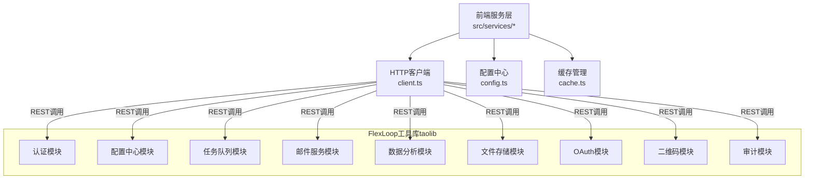
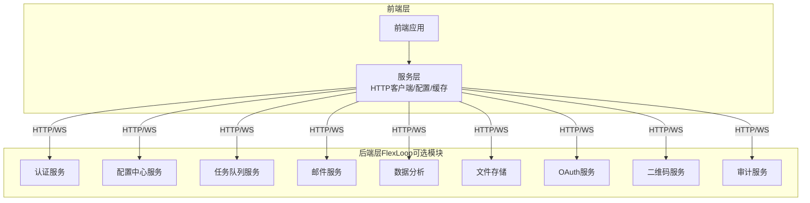
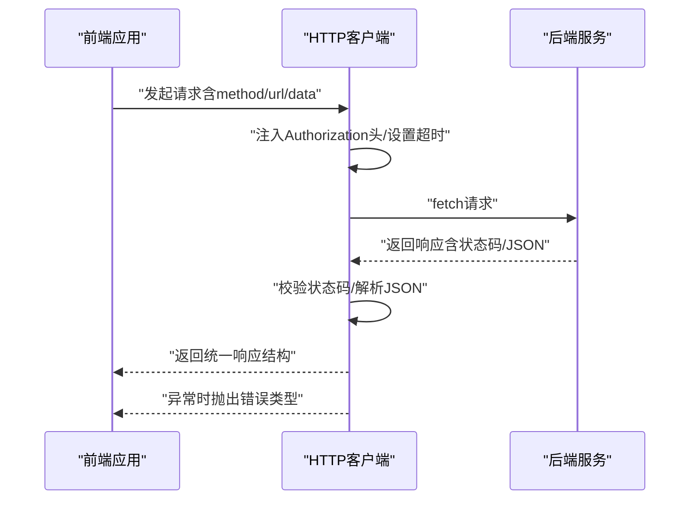
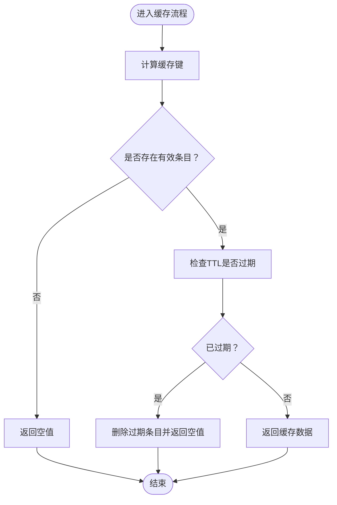
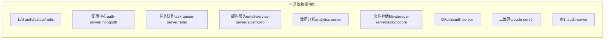
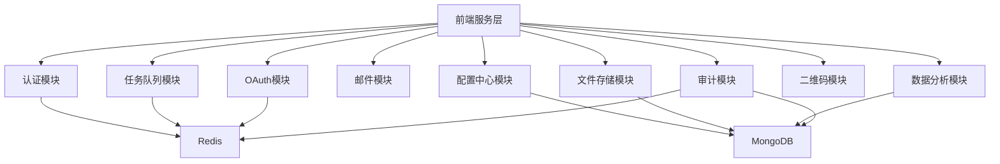

# 架构设计

<cite>
**本文引用的文件**
- [src/services/index.ts](file://src/services/index.ts)
- [src/services/api/client.ts](file://src/services/api/client.ts)
- [src/services/config.ts](file://src/services/config.ts)
- [src/services/cache.ts](file://src/services/cache.ts)
- [pyproject.toml（根）](file://pyproject.toml)
- [pyproject.toml（FlexLoop）](file://tools/flexloop/pyproject.toml)
- [README.md（FlexLoop）](file://tools/flexloop/README.md)
</cite>

## 目录
1. [引言](#引言)
2. [项目结构](#项目结构)
3. [核心组件](#核心组件)
4. [架构总览](#架构总览)
5. [详细组件分析](#详细组件分析)
6. [依赖分析](#依赖分析)
7. [性能考虑](#性能考虑)
8. [故障排查指南](#故障排查指南)
9. [结论](#结论)
10. [附录](#附录)

## 引言
本文件面向FlexLoop工作流引擎的架构设计，系统性阐述其模块化设计原则、组件间依赖关系、系统边界划分、技术栈选择、核心设计理念（可扩展性、容错性、性能优化）、部署架构（容器化、服务发现、负载均衡）以及与DAOApps其他组件的集成与数据流。文档同时提供架构图与组件关系图，帮助读者快速理解整体设计。

## 项目结构
DAOApps采用多应用与工具库并存的组织方式：
- 前端应用与服务层位于 src/services，提供统一的HTTP客户端、配置中心与缓存管理能力。
- FlexLoop作为独立的Python工具库（taolib），通过可选依赖组合不同子系统（认证、配置中心、任务队列、邮件服务、数据分析、文件存储、OAuth、二维码、审计等），形成“按需装配”的微服务化能力。
- 根级与FlexLoop工具库各自维护独立的pyproject.toml，分别定义开发、测试、文档与可选依赖集合。

**图表来源**
- [src/services/api/client.ts:1-105](file://src/services/api/client.ts#L1-L105)
- [src/services/config.ts:1-11](file://src/services/config.ts#L1-L11)
- [src/services/cache.ts:1-50](file://src/services/cache.ts#L1-L50)
- [pyproject.toml（FlexLoop）:20-235](file://tools/flexloop/pyproject.toml#L20-L235)

**章节来源**
- [src/services/index.ts:1-10](file://src/services/index.ts#L1-L10)
- [pyproject.toml（根）:39-58](file://pyproject.toml#L39-L58)
- [pyproject.toml（FlexLoop）:20-235](file://tools/flexloop/pyproject.toml#L20-L235)

## 核心组件
- HTTP客户端与错误体系
  - 统一的HttpClient封装fetch请求，内置超时控制、自动注入Authorization头、统一响应结构与错误分类（网络、服务端、校验）。
  - 通过API_CONFIG集中管理基础地址、超时、重试策略与Mock开关。
- 缓存管理
  - 基于内存Map的TTL缓存，支持键匹配清理与批量清理，适配前端侧轻量缓存需求。
- 模块化可选依赖
  - FlexLoop通过可选依赖组合认证、配置中心、任务队列、邮件服务、数据分析、文件存储、OAuth、二维码、审计等子系统，便于按需启用与解耦。

**章节来源**
- [src/services/api/client.ts:1-105](file://src/services/api/client.ts#L1-L105)
- [src/services/config.ts:1-11](file://src/services/config.ts#L1-L11)
- [src/services/cache.ts:1-50](file://src/services/cache.ts#L1-L50)
- [pyproject.toml（FlexLoop）:20-235](file://tools/flexloop/pyproject.toml#L20-L235)

## 架构总览
FlexLoop采用“前端服务层 + 可插拔后端模块”的双层架构：
- 前端服务层负责统一API访问、配置与缓存，向上游应用提供一致的接口。
- 后端模块通过FastAPI+Uvicorn提供REST服务，结合Redis/MongoDB等中间件实现高可用与可扩展。

**图表来源**
- [src/services/api/client.ts:1-105](file://src/services/api/client.ts#L1-L105)
- [pyproject.toml（FlexLoop）:63-235](file://tools/flexloop/pyproject.toml#L63-L235)

## 详细组件分析

### 组件A：HTTP客户端与错误处理
- 设计要点
  - 请求封装：统一方法（GET/POST/PUT/PATCH/DELETE）、超时控制、AbortController中断、统一JSON序列化与反序列化。
  - 头部注入：自动读取localStorage中的令牌并附加到Authorization头。
  - 错误分类：区分超时、网络异常、服务端错误与业务校验错误，便于上层统一处理。
- 数据流
  - 输入：method/url/data/headers/timeout
  - 处理：拼接基础URL、注入头部、fetch请求、状态码校验、JSON解析
  - 输出：统一响应结构（success/data/message）
  - 异常：抛出对应错误类型

**图表来源**
- [src/services/api/client.ts:19-102](file://src/services/api/client.ts#L19-L102)

**章节来源**
- [src/services/api/client.ts:1-105](file://src/services/api/client.ts#L1-L105)

### 组件B：配置中心与缓存
- 配置中心
  - API_CONFIG集中管理基础URL、超时、Mock开关与重试参数，支持Vite环境变量注入。
- 缓存管理
  - CacheManager基于Map实现内存缓存，支持TTL过期、批量清理与正则匹配清理，适合前端侧热点数据缓存。

**图表来源**
- [src/services/cache.ts:8-47](file://src/services/cache.ts#L8-L47)

**章节来源**
- [src/services/config.ts:1-11](file://src/services/config.ts#L1-L11)
- [src/services/cache.ts:1-50](file://src/services/cache.ts#L1-L50)

### 组件C：FlexLoop模块化能力
- 技术栈与模块划分
  - FastAPI/Uvicorn：服务端框架与ASGI服务器
  - Redis/Motor：任务队列、速率限制、OAuth、审计等模块的缓存与数据库访问
  - Elasticsearch/MongoDB：日志平台与审计数据存储
  - SQLAlchemy：站点模块的数据持久化
  - httpx/websockets：客户端SDK与WebSocket通信
- 可选依赖组合
  - 通过可选依赖按需启用各模块，避免不必要的运行时依赖，提升部署灵活性与安全性。

**图表来源**
- [pyproject.toml（FlexLoop）:55-235](file://tools/flexloop/pyproject.toml#L55-L235)

**章节来源**
- [pyproject.toml（FlexLoop）:20-235](file://tools/flexloop/pyproject.toml#L20-L235)
- [README.md（FlexLoop）:45-79](file://tools/flexloop/README.md#L45-L79)

## 依赖分析
- 前端服务层对FlexLoop模块的依赖
  - 通过HTTP客户端统一访问各后端模块，不直接耦合具体实现细节，降低模块替换成本。
- FlexLoop内部模块间的依赖
  - 多数模块共享认证、Redis、MongoDB等基础设施，形成清晰的分层与边界。
- 开发与测试依赖
  - 根与FlexLoop均配置pytest、覆盖率、类型检查与格式化工具，保障质量与一致性。

**图表来源**
- [src/services/api/client.ts:1-105](file://src/services/api/client.ts#L1-L105)
- [pyproject.toml（FlexLoop）:63-235](file://tools/flexloop/pyproject.toml#L63-L235)

**章节来源**
- [pyproject.toml（根）:39-58](file://pyproject.toml#L39-L58)
- [pyproject.toml（FlexLoop）:297-318](file://tools/flexloop/pyproject.toml#L297-L318)

## 性能考虑
- 前端侧
  - 使用TTL缓存减少重复请求；合理设置超时与重试，避免阻塞UI线程。
- 后端侧
  - Redis/MongoDB等中间件提供高并发与低延迟；FastAPI的异步特性与Uvicorn的高性能ASGI服务器配合，满足高吞吐场景。
- 可扩展性
  - 模块化可选依赖允许按需扩容；服务拆分与限流策略（速率限制模块）保障系统稳定性。

## 故障排查指南
- 常见错误类型
  - 网络错误：超时、断网、DNS解析失败
  - 服务端错误：HTTP状态码异常、服务不可用
  - 校验错误：参数校验失败、权限不足
- 排查步骤
  - 检查API_CONFIG基础URL与超时设置
  - 确认Authorization头是否正确注入
  - 查看缓存是否命中与TTL是否过期
  - 关注后端模块日志与健康检查接口

**章节来源**
- [src/services/api/client.ts:56-68](file://src/services/api/client.ts#L56-L68)
- [src/services/cache.ts:11-21](file://src/services/cache.ts#L11-L21)

## 结论
FlexLoop通过“前端服务层 + 模块化后端”的架构设计，实现了高内聚、低耦合与强扩展性的统一。前端以HTTP客户端为核心，后端以可选依赖为边界，既保证了易用性，又兼顾了性能与可靠性。结合容器化与微服务部署策略，可进一步提升弹性与可观测性。

## 附录
- 部署建议（概念性）
  - 容器化：为每个后端模块提供独立镜像，使用Compose/Kubernetes编排。
  - 服务发现：利用Kubernetes Service或Consul进行服务注册与发现。
  - 负载均衡：Ingress/Nginx/HAProxy分发流量至多个实例。
  - 监控与日志：结合Elasticsearch/Logstash/Kibana与Prometheus/Grafana实现全链路观测。
- 与DAOApps其他组件的集成
  - 前端应用通过HTTP客户端访问FlexLoop提供的REST接口，实现认证、配置、任务、邮件、文件、OAuth、审计等功能的统一接入。