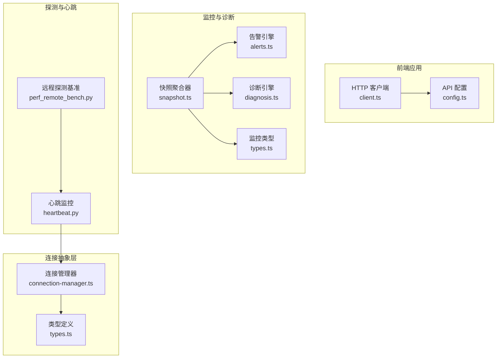
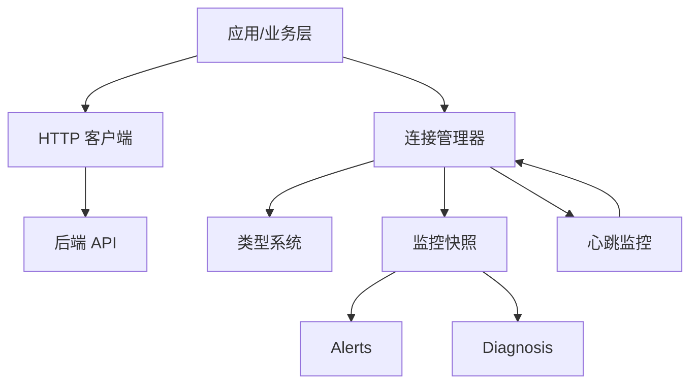
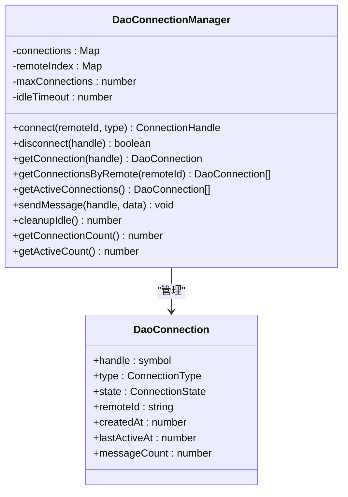
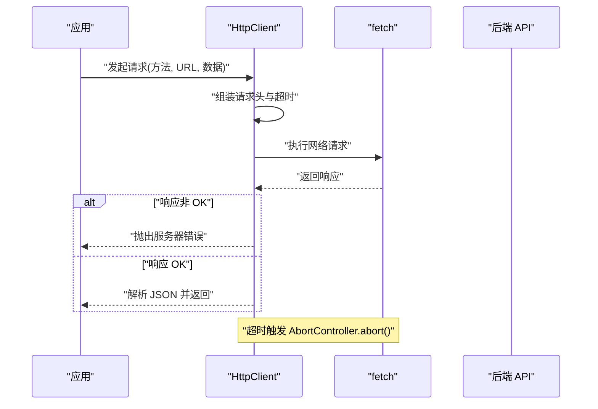
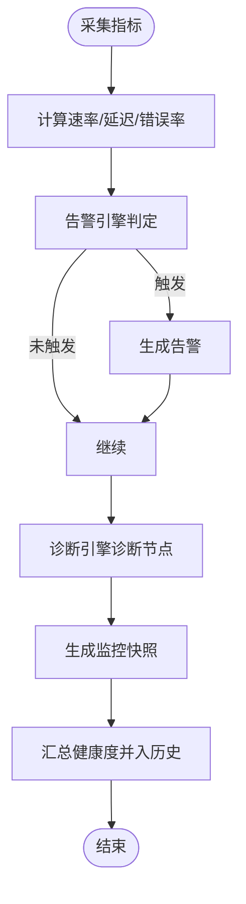
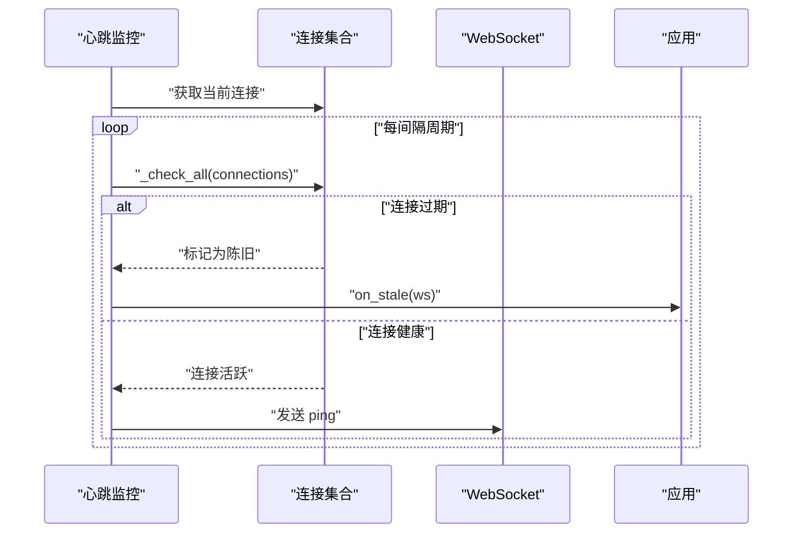
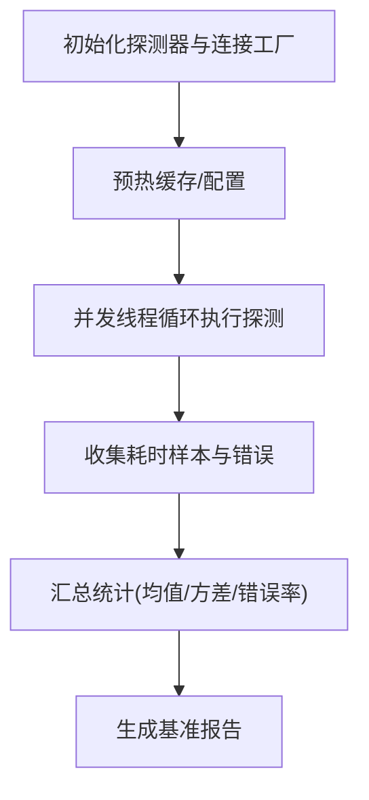
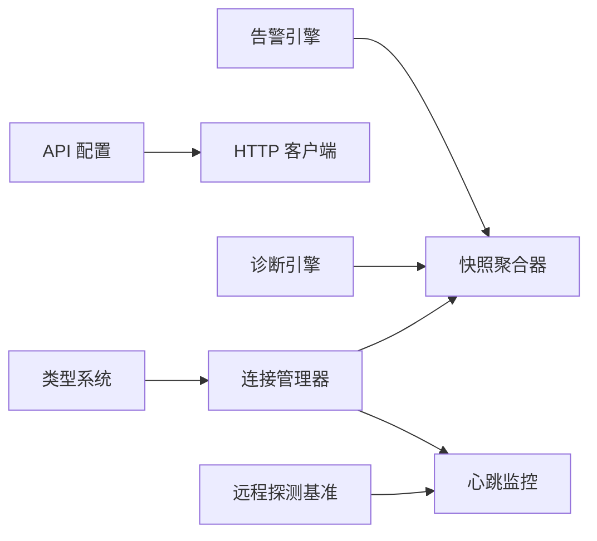

# 远程接口系统

<cite>
**本文引用的文件**
- [apps/DaoMind/packages/daoNexus/src/connection-manager.ts](file://apps/DaoMind/packages/daoNexus/src/connection-manager.ts)
- [apps/DaoMind/packages/daoNexus/src/types.ts](file://apps/DaoMind/packages/daoNexus/src/types.ts)
- [apps/AgentPit/src/services/api/client.ts](file://apps/AgentPit/src/services/api/client.ts)
- [apps/AgentPit/src/services/config.ts](file://apps/AgentPit/src/services/config.ts)
- [apps/DaoMind/packages/daoMonitor/src/snapshot.ts](file://apps/DaoMind/packages/daoMonitor/src/snapshot.ts)
- [apps/DaoMind/packages/daoMonitor/src/alerts.ts](file://apps/DaoMind/packages/daoMonitor/src/alerts.ts)
- [apps/DaoMind/packages/daoMonitor/src/diagnosis.ts](file://apps/DaoMind/packages/daoMonitor/src/diagnosis.ts)
- [apps/DaoMind/packages/daoMonitor/src/types.ts](file://apps/DaoMind/packages/daoMonitor/src/types.ts)
- [tools/flexloop/tests/testing/test_config_center/test_push_service.py](file://tools/flexloop/tests/testing/test_config_center/test_push_service.py)
- [tools/flexloop/src/taolib/testing/config_center/server/websocket/heartbeat.py](file://tools/flexloop/src/taolib/testing/config_center/server/websocket/heartbeat.py)
- [apps/DaoMind/tests/test-monitor-system.test.ts](file://apps/DaoMind/tests/test-monitor-system.test.ts)
- [tools/flexloop/tests/testing/perf_remote_bench.py](file://tools/flexloop/tests/testing/perf_remote_bench.py)
</cite>

## 目录
1. [引言](#引言)
2. [项目结构](#项目结构)
3. [核心组件](#核心组件)
4. [架构总览](#架构总览)
5. [详细组件分析](#详细组件分析)
6. [依赖关系分析](#依赖关系分析)
7. [性能考量](#性能考量)
8. [故障排查指南](#故障排查指南)
9. [结论](#结论)
10. [附录](#附录)

## 引言
本文件面向远程接口系统，聚焦连接管理、会话维护与探测机制，系统化阐述连接抽象层、协议适配、数据传输与错误处理；并结合监控与诊断能力，给出健康检查、性能监控与故障定位方法。文档同时提供连接配置示例、连接池管理、资源优化与安全建议，以及与远程服务的集成最佳实践。

## 项目结构
远程接口系统主要分布在以下模块：
- 连接管理与抽象：位于 DaoMind 的 nexus 包，提供连接生命周期、状态机与空闲清理。
- HTTP 客户端与配置：位于 AgentPit 的 services，提供统一的 API 客户端封装与超时、重试配置。
- 监控与诊断：位于 DaoMind 的 monitor 包，提供快照聚合、告警与诊断引擎。
- 探测与心跳：位于 flexloop 的测试与工具模块，提供心跳监控与远程探测基准测试。

**图表来源**
- [apps/AgentPit/src/services/api/client.ts:1-105](file://apps/AgentPit/src/services/api/client.ts#L1-L105)
- [apps/AgentPit/src/services/config.ts:1-11](file://apps/AgentPit/src/services/config.ts#L1-L11)
- [apps/DaoMind/packages/daoNexus/src/connection-manager.ts:1-140](file://apps/DaoMind/packages/daoNexus/src/connection-manager.ts#L1-L140)
- [apps/DaoMind/packages/daoNexus/src/types.ts:1-59](file://apps/DaoMind/packages/daoNexus/src/types.ts#L1-L59)
- [apps/DaoMind/packages/daoMonitor/src/snapshot.ts:1-76](file://apps/DaoMind/packages/daoMonitor/src/snapshot.ts#L1-L76)
- [apps/DaoMind/packages/daoMonitor/src/alerts.ts:1-122](file://apps/DaoMind/packages/daoMonitor/src/alerts.ts#L1-L122)
- [apps/DaoMind/packages/daoMonitor/src/diagnosis.ts:1-75](file://apps/DaoMind/packages/daoMonitor/src/diagnosis.ts#L1-L75)
- [apps/DaoMind/packages/daoMonitor/src/types.ts:39-71](file://apps/DaoMind/packages/daoMonitor/src/types.ts#L39-L71)
- [tools/flexloop/src/taolib/testing/config_center/server/websocket/heartbeat.py:45-87](file://tools/flexloop/src/taolib/testing/config_center/server/websocket/heartbeat.py#L45-L87)
- [tools/flexloop/tests/testing/perf_remote_bench.py:352-540](file://tools/flexloop/tests/testing/perf_remote_bench.py#L352-L540)

**章节来源**
- [apps/AgentPit/src/services/api/client.ts:1-105](file://apps/AgentPit/src/services/api/client.ts#L1-L105)
- [apps/AgentPit/src/services/config.ts:1-11](file://apps/AgentPit/src/services/config.ts#L1-L11)
- [apps/DaoMind/packages/daoNexus/src/connection-manager.ts:1-140](file://apps/DaoMind/packages/daoNexus/src/connection-manager.ts#L1-L140)
- [apps/DaoMind/packages/daoNexus/src/types.ts:1-59](file://apps/DaoMind/packages/daoNexus/src/types.ts#L1-L59)
- [apps/DaoMind/packages/daoMonitor/src/snapshot.ts:1-76](file://apps/DaoMind/packages/daoMonitor/src/snapshot.ts#L1-L76)
- [apps/DaoMind/packages/daoMonitor/src/alerts.ts:1-122](file://apps/DaoMind/packages/daoMonitor/src/alerts.ts#L1-L122)
- [apps/DaoMind/packages/daoMonitor/src/diagnosis.ts:1-75](file://apps/DaoMind/packages/daoMonitor/src/diagnosis.ts#L1-L75)
- [apps/DaoMind/packages/daoMonitor/src/types.ts:39-71](file://apps/DaoMind/packages/daoMonitor/src/types.ts#L39-L71)
- [tools/flexloop/src/taolib/testing/config_center/server/websocket/heartbeat.py:45-87](file://tools/flexloop/src/taolib/testing/config_center/server/websocket/heartbeat.py#L45-L87)
- [tools/flexloop/tests/testing/perf_remote_bench.py:352-540](file://tools/flexloop/tests/testing/perf_remote_bench.py#L352-L540)

## 核心组件
- 连接管理器：负责连接建立、状态转换、消息统计、空闲清理与按远端索引管理。
- 类型系统：定义连接类型、状态、句柄、路由规则、服务实例与指标等契约。
- HTTP 客户端：封装请求头、超时控制、错误分类与重试策略。
- 监控快照：聚合热力图、流向向量、仪表盘、告警与诊断，计算系统健康度。
- 告警引擎：基于规则检测拥塞、断连、延迟尖峰与错误率激增。
- 诊断引擎：对节点进行气血状态诊断，提供趋势与建议。
- 心跳监控：周期性检查连接活性，对陈旧连接触发清理或发送 ping。
- 远程探测基准：评估高延迟场景下的探测性能与开销。

**章节来源**
- [apps/DaoMind/packages/daoNexus/src/connection-manager.ts:1-140](file://apps/DaoMind/packages/daoNexus/src/connection-manager.ts#L1-L140)
- [apps/DaoMind/packages/daoNexus/src/types.ts:1-59](file://apps/DaoMind/packages/daoNexus/src/types.ts#L1-L59)
- [apps/AgentPit/src/services/api/client.ts:1-105](file://apps/AgentPit/src/services/api/client.ts#L1-L105)
- [apps/DaoMind/packages/daoMonitor/src/snapshot.ts:1-76](file://apps/DaoMind/packages/daoMonitor/src/snapshot.ts#L1-L76)
- [apps/DaoMind/packages/daoMonitor/src/alerts.ts:1-122](file://apps/DaoMind/packages/daoMonitor/src/alerts.ts#L1-L122)
- [apps/DaoMind/packages/daoMonitor/src/diagnosis.ts:1-75](file://apps/DaoMind/packages/daoMonitor/src/diagnosis.ts#L1-L75)
- [tools/flexloop/src/taolib/testing/config_center/server/websocket/heartbeat.py:45-87](file://tools/flexloop/src/taolib/testing/config_center/server/websocket/heartbeat.py#L45-L87)
- [tools/flexloop/tests/testing/perf_remote_bench.py:352-540](file://tools/flexloop/tests/testing/perf_remote_bench.py#L352-L540)

## 架构总览
远程接口系统采用“连接抽象层 + 协议适配 + 监控诊断”的分层设计：
- 连接抽象层：统一连接生命周期与状态机，屏蔽底层协议差异。
- 协议适配：HTTP 客户端作为典型适配器，封装超时、重试与错误处理。
- 监控诊断：以快照聚合为核心，联动告警与诊断引擎，形成闭环健康度评估。
- 探测机制：心跳监控与远程探测基准共同保障连接可用性与性能。

**图表来源**
- [apps/AgentPit/src/services/api/client.ts:1-105](file://apps/AgentPit/src/services/api/client.ts#L1-L105)
- [apps/DaoMind/packages/daoNexus/src/connection-manager.ts:1-140](file://apps/DaoMind/packages/daoNexus/src/connection-manager.ts#L1-L140)
- [apps/DaoMind/packages/daoMonitor/src/snapshot.ts:1-76](file://apps/DaoMind/packages/daoMonitor/src/snapshot.ts#L1-L76)
- [apps/DaoMind/packages/daoMonitor/src/alerts.ts:1-122](file://apps/DaoMind/packages/daoMonitor/src/alerts.ts#L1-L122)
- [apps/DaoMind/packages/daoMonitor/src/diagnosis.ts:1-75](file://apps/DaoMind/packages/daoMonitor/src/diagnosis.ts#L1-L75)
- [tools/flexloop/src/taolib/testing/config_center/server/websocket/heartbeat.py:45-87](file://tools/flexloop/src/taolib/testing/config_center/server/websocket/heartbeat.py#L45-L87)

## 详细组件分析

### 连接管理器与会话实现
- 连接建立：校验并发上限，分配句柄，初始化状态与时间戳，登记远端索引。
- 会话维护：记录消息计数与最后活跃时间，支持按远端查询与活跃连接筛选。
- 心跳与空闲：通过空闲超时清理长时间无活动的连接，避免资源泄漏。
- 断线与重连：断开时移除索引并标记关闭；上层可基于监控告警触发重连策略。

**图表来源**
- [apps/DaoMind/packages/daoNexus/src/connection-manager.ts:1-140](file://apps/DaoMind/packages/daoNexus/src/connection-manager.ts#L1-L140)
- [apps/DaoMind/packages/daoNexus/src/types.ts:14-23](file://apps/DaoMind/packages/daoNexus/src/types.ts#L14-L23)

**章节来源**
- [apps/DaoMind/packages/daoNexus/src/connection-manager.ts:21-115](file://apps/DaoMind/packages/daoNexus/src/connection-manager.ts#L21-L115)
- [apps/DaoMind/packages/daoNexus/src/types.ts:5-23](file://apps/DaoMind/packages/daoNexus/src/types.ts#L5-L23)

### HTTP 客户端与协议适配
- 请求封装：统一设置 Content-Type 与 Authorization，支持 GET/POST/PUT/PATCH/DELETE。
- 超时控制：基于 AbortController 实现可配置超时，超时抛出网络错误。
- 错误处理：区分服务器错误、网络错误与未知错误，便于上层重试与降级。
- 配置中心：集中管理 baseURL、timeout、重试次数与延迟。

**图表来源**
- [apps/AgentPit/src/services/api/client.ts:33-69](file://apps/AgentPit/src/services/api/client.ts#L33-L69)

**章节来源**
- [apps/AgentPit/src/services/api/client.ts:1-105](file://apps/AgentPit/src/services/api/client.ts#L1-L105)
- [apps/AgentPit/src/services/config.ts:1-11](file://apps/AgentPit/src/services/config.ts#L1-L11)

### 探测系统与健康检查
- 告警规则：基于消息速率、延迟与错误率设定阈值，生成不同严重级别的告警。
- 诊断引擎：对节点进行气血状态诊断，输出趋势与建议，辅助容量规划与优化。
- 快照聚合：整合热力图、流向、仪表盘、告警与诊断，计算系统健康度并持久化历史。

**图表来源**
- [apps/DaoMind/packages/daoMonitor/src/alerts.ts:66-98](file://apps/DaoMind/packages/daoMonitor/src/alerts.ts#L66-L98)
- [apps/DaoMind/packages/daoMonitor/src/diagnosis.ts:10-55](file://apps/DaoMind/packages/daoMonitor/src/diagnosis.ts#L10-L55)
- [apps/DaoMind/packages/daoMonitor/src/snapshot.ts:22-59](file://apps/DaoMind/packages/daoMonitor/src/snapshot.ts#L22-L59)

**章节来源**
- [apps/DaoMind/packages/daoMonitor/src/alerts.ts:1-122](file://apps/DaoMind/packages/daoMonitor/src/alerts.ts#L1-L122)
- [apps/DaoMind/packages/daoMonitor/src/diagnosis.ts:1-75](file://apps/DaoMind/packages/daoMonitor/src/diagnosis.ts#L1-L75)
- [apps/DaoMind/packages/daoMonitor/src/snapshot.ts:1-76](file://apps/DaoMind/packages/daoMonitor/src/snapshot.ts#L1-L76)
- [apps/DaoMind/packages/daoMonitor/src/types.ts:39-71](file://apps/DaoMind/packages/daoMonitor/src/types.ts#L39-L71)
- [apps/DaoMind/tests/test-monitor-system.test.ts:170-212](file://apps/DaoMind/tests/test-monitor-system.test.ts#L170-L212)

### 心跳监控与断线重连
- 心跳循环：周期性遍历连接，对陈旧连接触发清理回调，对健康连接发送 ping。
- 断线检测：通过 last_heartbeat 时间差判断连接是否陈旧，触发 on_stale 回调。
- 重连策略：上层监听 on_stale 或告警，触发重新连接流程（例如重新 connect）。

**图表来源**
- [tools/flexloop/src/taolib/testing/config_center/server/websocket/heartbeat.py:68-87](file://tools/flexloop/src/taolib/testing/config_center/server/websocket/heartbeat.py#L68-L87)
- [tools/flexloop/tests/testing/test_config_center/test_push_service.py:628-673](file://tools/flexloop/tests/testing/test_config_center/test_push_service.py#L628-L673)

**章节来源**
- [tools/flexloop/src/taolib/testing/config_center/server/websocket/heartbeat.py:45-87](file://tools/flexloop/src/taolib/testing/config_center/server/websocket/heartbeat.py#L45-L87)
- [tools/flexloop/tests/testing/test_config_center/test_push_service.py:628-673](file://tools/flexloop/tests/testing/test_config_center/test_push_service.py#L628-L673)

### 远程探测基准与性能监控
- 并发探测：多线程并发执行探测，统计吞吐与错误数，评估线程安全与稳定性。
- 高延迟场景：引入假连接延迟，评估探测在高延迟下的理论最小耗时与额外开销占比。
- 功能正确性：对比新旧实现输出，确保探测行为一致性。

**图表来源**
- [tools/flexloop/tests/testing/perf_remote_bench.py:352-540](file://tools/flexloop/tests/testing/perf_remote_bench.py#L352-L540)

**章节来源**
- [tools/flexloop/tests/testing/perf_remote_bench.py:352-540](file://tools/flexloop/tests/testing/perf_remote_bench.py#L352-L540)

## 依赖关系分析
- 连接管理器依赖类型系统提供的契约，保证连接状态与属性的一致性。
- HTTP 客户端依赖配置模块，统一超时与重试策略。
- 监控快照聚合器依赖告警与诊断引擎，形成闭环健康评估。
- 心跳监控依赖连接集合，驱动断线检测与重连策略。
- 远程探测基准依赖心跳监控与连接工厂，评估系统在高延迟下的表现。

**图表来源**
- [apps/DaoMind/packages/daoNexus/src/types.ts:1-59](file://apps/DaoMind/packages/daoNexus/src/types.ts#L1-L59)
- [apps/DaoMind/packages/daoNexus/src/connection-manager.ts:1-140](file://apps/DaoMind/packages/daoNexus/src/connection-manager.ts#L1-L140)
- [apps/AgentPit/src/services/config.ts:1-11](file://apps/AgentPit/src/services/config.ts#L1-L11)
- [apps/AgentPit/src/services/api/client.ts:1-105](file://apps/AgentPit/src/services/api/client.ts#L1-L105)
- [apps/DaoMind/packages/daoMonitor/src/alerts.ts:1-122](file://apps/DaoMind/packages/daoMonitor/src/alerts.ts#L1-L122)
- [apps/DaoMind/packages/daoMonitor/src/diagnosis.ts:1-75](file://apps/DaoMind/packages/daoMonitor/src/diagnosis.ts#L1-L75)
- [apps/DaoMind/packages/daoMonitor/src/snapshot.ts:1-76](file://apps/DaoMind/packages/daoMonitor/src/snapshot.ts#L1-L76)
- [tools/flexloop/src/taolib/testing/config_center/server/websocket/heartbeat.py:45-87](file://tools/flexloop/src/taolib/testing/config_center/server/websocket/heartbeat.py#L45-L87)
- [tools/flexloop/tests/testing/perf_remote_bench.py:352-540](file://tools/flexloop/tests/testing/perf_remote_bench.py#L352-L540)

**章节来源**
- [apps/DaoMind/packages/daoNexus/src/types.ts:1-59](file://apps/DaoMind/packages/daoNexus/src/types.ts#L1-L59)
- [apps/AgentPit/src/services/config.ts:1-11](file://apps/AgentPit/src/services/config.ts#L1-L11)
- [apps/AgentPit/src/services/api/client.ts:1-105](file://apps/AgentPit/src/services/api/client.ts#L1-L105)
- [apps/DaoMind/packages/daoMonitor/src/alerts.ts:1-122](file://apps/DaoMind/packages/daoMonitor/src/alerts.ts#L1-L122)
- [apps/DaoMind/packages/daoMonitor/src/diagnosis.ts:1-75](file://apps/DaoMind/packages/daoMonitor/src/diagnosis.ts#L1-L75)
- [apps/DaoMind/packages/daoMonitor/src/snapshot.ts:1-76](file://apps/DaoMind/packages/daoMonitor/src/snapshot.ts#L1-L76)
- [tools/flexloop/src/taolib/testing/config_center/server/websocket/heartbeat.py:45-87](file://tools/flexloop/src/taolib/testing/config_center/server/websocket/heartbeat.py#L45-L87)
- [tools/flexloop/tests/testing/perf_remote_bench.py:352-540](file://tools/flexloop/tests/testing/perf_remote_bench.py#L352-L540)

## 性能考量
- 连接池与空闲清理：通过最大连接数与空闲超时参数控制资源占用，定期清理陈旧连接。
- 超时与重试：合理设置请求超时与重试次数，避免阻塞与雪崩效应。
- 监控采样：快照聚合限制历史长度，平衡内存占用与可观测性。
- 探测开销：并发探测与高延迟场景下的理论最小耗时评估，指导阈值与频率调优。

[本节为通用性能讨论，无需列出章节来源]

## 故障排查指南
- 连接断开：检查心跳监控的 on_stale 回调是否被触发，确认 last_heartbeat 是否陈旧。
- 超时与网络错误：核对 HTTP 客户端超时配置与 AbortController 行为，定位网络波动。
- 告警定位：根据告警引擎规则，结合速率、延迟与错误率阈值，快速定位瓶颈。
- 诊断建议：参考诊断引擎对节点气血状态的判断，结合趋势与建议进行容量与拓扑优化。
- 健康度回溯：通过快照历史查看系统健康度变化，配合告警与诊断进行根因分析。

**章节来源**
- [tools/flexloop/src/taolib/testing/config_center/server/websocket/heartbeat.py:45-87](file://tools/flexloop/src/taolib/testing/config_center/server/websocket/heartbeat.py#L45-L87)
- [apps/AgentPit/src/services/api/client.ts:33-69](file://apps/AgentPit/src/services/api/client.ts#L33-L69)
- [apps/DaoMind/packages/daoMonitor/src/alerts.ts:14-57](file://apps/DaoMind/packages/daoMonitor/src/alerts.ts#L14-L57)
- [apps/DaoMind/packages/daoMonitor/src/diagnosis.ts:10-55](file://apps/DaoMind/packages/daoMonitor/src/diagnosis.ts#L10-L55)
- [apps/DaoMind/packages/daoMonitor/src/snapshot.ts:22-59](file://apps/DaoMind/packages/daoMonitor/src/snapshot.ts#L22-L59)
- [apps/DaoMind/tests/test-monitor-system.test.ts:170-212](file://apps/DaoMind/tests/test-monitor-system.test.ts#L170-L212)

## 结论
远程接口系统通过连接抽象层、协议适配与监控诊断的协同，实现了对连接生命周期的精细化管理、对健康状态的实时感知与对性能瓶颈的快速定位。结合心跳监控与远程探测基准，系统能够在复杂网络环境下保持稳定与高效。建议在生产环境中持续优化连接池参数、告警阈值与诊断策略，并结合快照历史进行容量与拓扑治理。

[本节为总结性内容，无需列出章节来源]

## 附录

### 连接配置示例与最佳实践
- 建立安全连接
  - 在 HTTP 客户端中设置 Authorization 头，携带访问令牌。
  - 使用 HTTPS 基地址，确保传输加密。
- 配置超时参数
  - 在配置模块中设置 baseURL、timeout、重试次数与延迟。
  - 对关键路径设置更短超时，非关键路径设置较长超时。
- 处理异常情况
  - 超时：抛出网络错误，上层进行指数退避重试。
  - 服务器错误：解析状态码并区分业务错误与系统错误。
  - 未知错误：统一包装为网络错误，记录日志并上报监控。

**章节来源**
- [apps/AgentPit/src/services/api/client.ts:19-102](file://apps/AgentPit/src/services/api/client.ts#L19-L102)
- [apps/AgentPit/src/services/config.ts:1-11](file://apps/AgentPit/src/services/config.ts#L1-L11)

### 连接池管理与资源优化
- 最大连接数：根据实例规格与负载峰值设定上限，避免资源耗尽。
- 空闲超时：定期清理长时间无活动的连接，释放内存与 FD。
- 监控指标：关注活跃连接数、消息速率与健康度，动态调整阈值。

**章节来源**
- [apps/DaoMind/packages/daoNexus/src/connection-manager.ts:97-115](file://apps/DaoMind/packages/daoNexus/src/connection-manager.ts#L97-L115)
- [apps/DaoMind/packages/daoMonitor/src/snapshot.ts:22-59](file://apps/DaoMind/packages/daoMonitor/src/snapshot.ts#L22-L59)

### 与远程服务的集成方式与最佳实践
- 适配器模式：以 HTTP 客户端为适配器，屏蔽底层协议差异，统一错误处理。
- 健康检查：结合告警与诊断引擎，定期评估服务可用性与性能。
- 探测基准：在高延迟与并发场景下评估系统表现，指导容量规划与限流策略。

**章节来源**
- [apps/AgentPit/src/services/api/client.ts:1-105](file://apps/AgentPit/src/services/api/client.ts#L1-L105)
- [apps/DaoMind/packages/daoMonitor/src/alerts.ts:1-122](file://apps/DaoMind/packages/daoMonitor/src/alerts.ts#L1-L122)
- [apps/DaoMind/packages/daoMonitor/src/diagnosis.ts:1-75](file://apps/DaoMind/packages/daoMonitor/src/diagnosis.ts#L1-L75)
- [tools/flexloop/tests/testing/perf_remote_bench.py:352-540](file://tools/flexloop/tests/testing/perf_remote_bench.py#L352-L540)