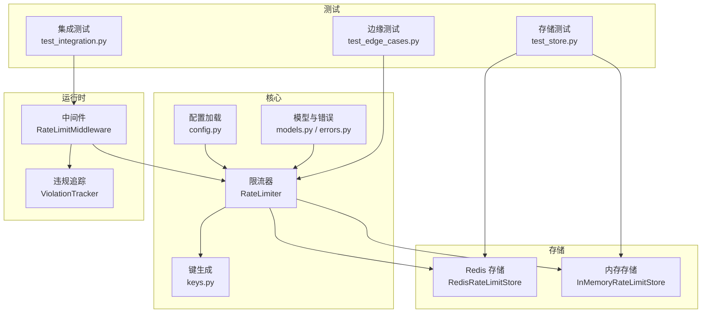
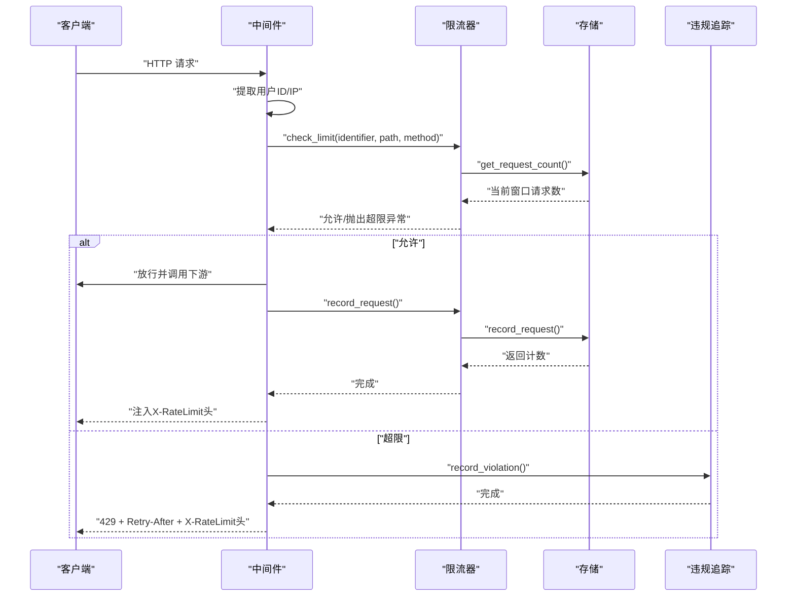
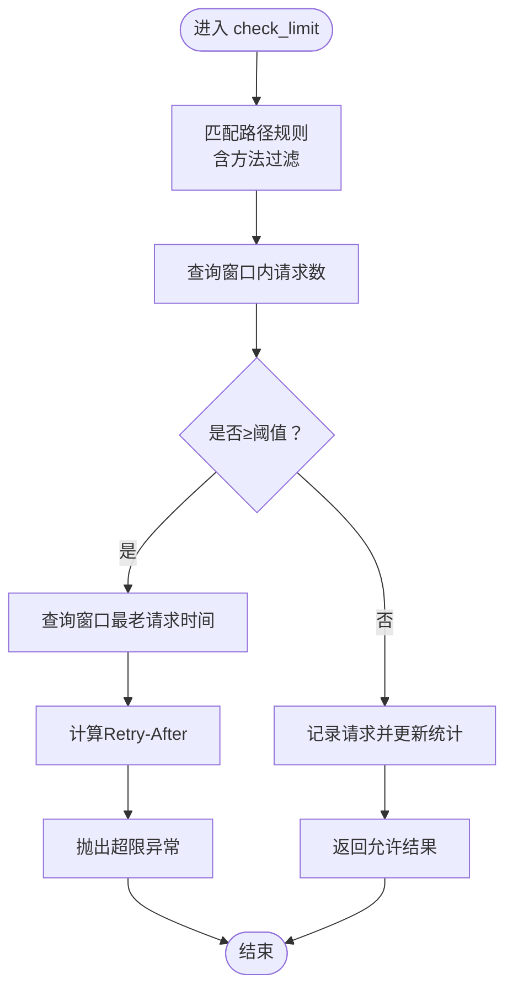
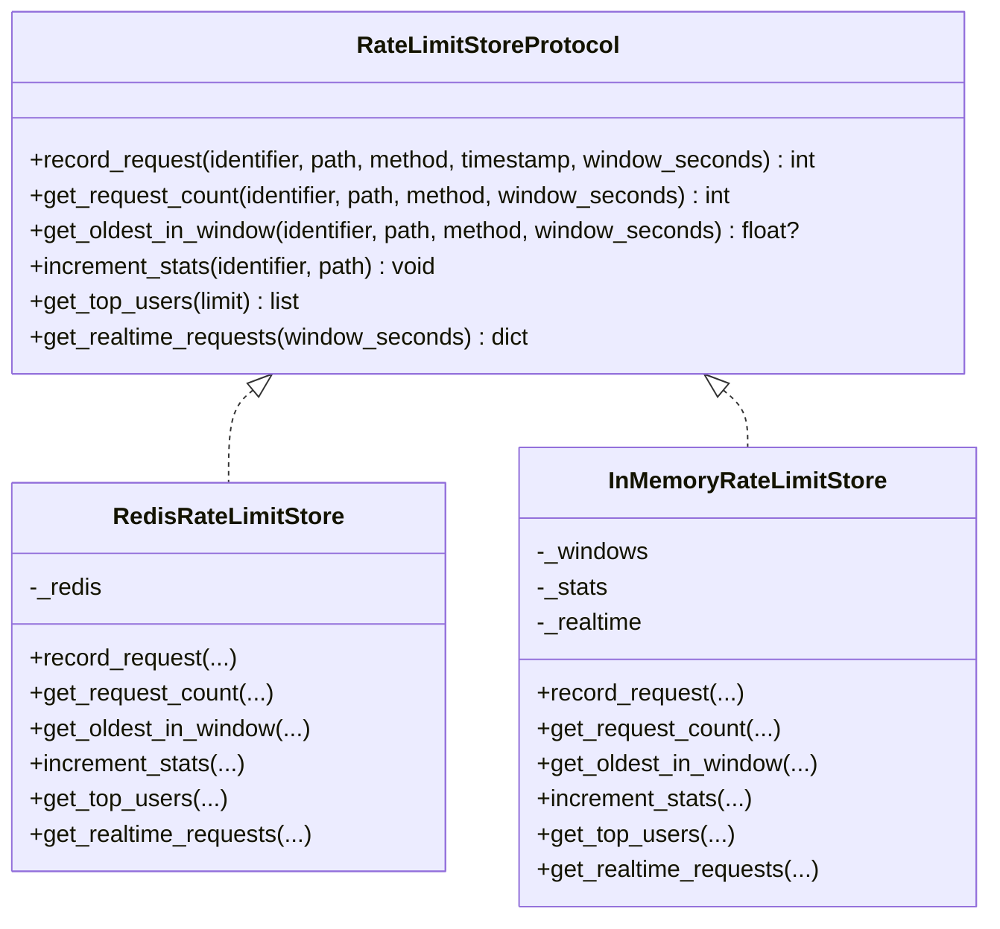
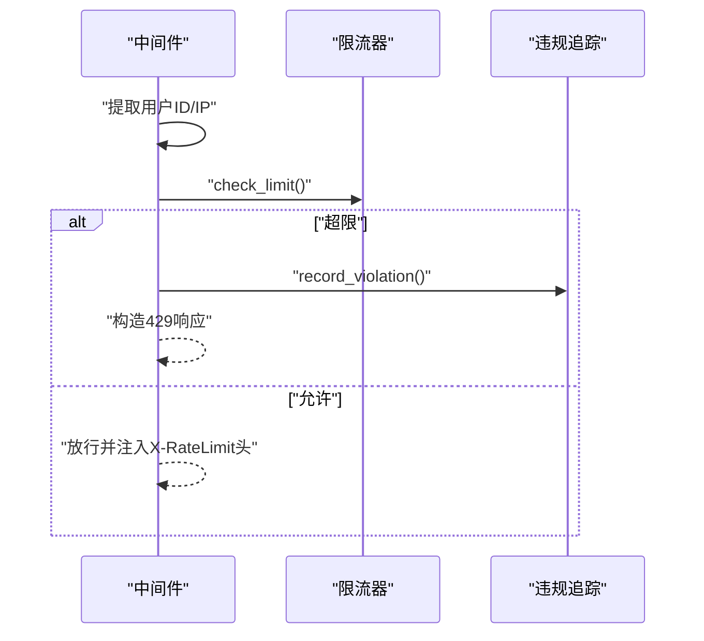
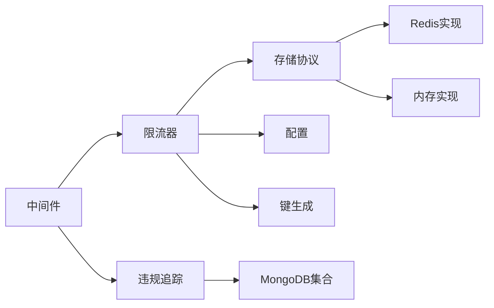

# 速率限制系统

<cite>
**本文引用的文件**
- [limiter.py](file://tools/flexloop/src/taolib/testing/rate_limiter/limiter.py)
- [store.py](file://tools/flexloop/src/taolib/testing/rate_limiter/store.py)
- [keys.py](file://tools/flexloop/src/taolib/testing/rate_limiter/keys.py)
- [config.py](file://tools/flexloop/src/taolib/testing/rate_limiter/config.py)
- [models.py](file://tools/flexloop/src/taolib/testing/rate_limiter/models.py)
- [errors.py](file://tools/flexloop/src/taolib/testing/rate_limiter/errors.py)
- [middleware.py](file://tools/flexloop/src/taolib/testing/rate_limiter/middleware.py)
- [violation_tracker.py](file://tools/flexloop/src/taolib/testing/rate_limiter/violation_tracker.py)
- [test_edge_cases.py](file://tools/flexloop/tests/testing/test_rate_limiter/test_edge_cases.py)
- [test_integration.py](file://tools/flexloop/tests/testing/test_rate_limiter/test_integration.py)
- [test_store.py](file://tools/flexloop/tests/testing/test_rate_limiter/test_store.py)
</cite>

## 目录
1. [简介](#简介)
2. [项目结构](#项目结构)
3. [核心组件](#核心组件)
4. [架构总览](#架构总览)
5. [详细组件分析](#详细组件分析)
6. [依赖关系分析](#依赖关系分析)
7. [性能考量](#性能考量)
8. [故障排查指南](#故障排查指南)
9. [结论](#结论)
10. [附录](#附录)

## 简介
本技术文档面向“速率限制系统”，围绕滑动窗口限流算法、存储策略（内存与 Redis）、统计监控、中间件实现、违规追踪与持久化、以及与 API 网关/业务系统的集成方式进行系统化阐述。文档同时提供配置示例、调优建议、性能监控与动态调整策略，帮助读者快速理解并落地部署。

## 项目结构
该系统位于工具模块 tools/flexloop 中，采用分层设计：
- 核心引擎：限流器与规则匹配
- 存储后端：Redis 与内存实现
- 中间件：FastAPI 集成与请求拦截
- 配置与模型：TOML 配置、Pydantic 数据模型
- 违规追踪：MongoDB 持久化与索引
- 测试：单元与集成测试覆盖边界与行为

图表来源
- [limiter.py:15-202](file://tools/flexloop/src/taolib/testing/rate_limiter/limiter.py#L15-L202)
- [store.py:112-336](file://tools/flexloop/src/taolib/testing/rate_limiter/store.py#L112-L336)
- [keys.py:4-57](file://tools/flexloop/src/taolib/testing/rate_limiter/keys.py#L4-L57)
- [config.py:19-82](file://tools/flexloop/src/taolib/testing/rate_limiter/config.py#L19-L82)
- [models.py:31-167](file://tools/flexloop/src/taolib/testing/rate_limiter/models.py#L31-L167)
- [errors.py:6-40](file://tools/flexloop/src/taolib/testing/rate_limiter/errors.py#L6-L40)
- [middleware.py:68-199](file://tools/flexloop/src/taolib/testing/rate_limiter/middleware.py#L68-L199)
- [violation_tracker.py:7-82](file://tools/flexloop/src/taolib/testing/rate_limiter/violation_tracker.py#L7-L82)
- [test_edge_cases.py:57-439](file://tools/flexloop/tests/testing/test_rate_limiter/test_edge_cases.py#L57-L439)
- [test_integration.py:147-188](file://tools/flexloop/tests/testing/test_rate_limiter/test_integration.py#L147-L188)
- [test_store.py:10-119](file://tools/flexloop/tests/testing/test_rate_limiter/test_store.py#L10-L119)

章节来源
- [limiter.py:1-202](file://tools/flexloop/src/taolib/testing/rate_limiter/limiter.py#L1-L202)
- [store.py:1-336](file://tools/flexloop/src/taolib/testing/rate_limiter/store.py#L1-L336)
- [keys.py:1-57](file://tools/flexloop/src/taolib/testing/rate_limiter/keys.py#L1-L57)
- [config.py:1-82](file://tools/flexloop/src/taolib/testing/rate_limiter/config.py#L1-L82)
- [models.py:1-167](file://tools/flexloop/src/taolib/testing/rate_limiter/models.py#L1-L167)
- [errors.py:1-40](file://tools/flexloop/src/taolib/testing/rate_limiter/errors.py#L1-L40)
- [middleware.py:1-199](file://tools/flexloop/src/taolib/testing/rate_limiter/middleware.py#L1-L199)
- [violation_tracker.py:1-82](file://tools/flexloop/src/taolib/testing/rate_limiter/violation_tracker.py#L1-L82)
- [test_edge_cases.py:1-439](file://tools/flexloop/tests/testing/test_rate_limiter/test_edge_cases.py#L1-L439)
- [test_integration.py:147-188](file://tools/flexloop/tests/testing/test_rate_limiter/test_integration.py#L147-L188)
- [test_store.py:1-119](file://tools/flexloop/tests/testing/test_rate_limiter/test_store.py#L1-L119)

## 核心组件
- 限流器（RateLimiter）：负责白名单检查、路径规则匹配、滑动窗口计数与限流决策；支持记录请求并更新统计。
- 存储后端：提供统一协议接口，包含 Redis 实现与内存实现（测试用途），均以 Sorted Set 存储请求时间戳并清理过期项。
- 中间件（RateLimitMiddleware）：在 FastAPI 中拦截请求，提取用户标识符与 IP，执行限流检查，注入响应头，并在被限流时记录违规。
- 配置加载（load_rate_limit_config）：支持 TOML 配置文件与环境变量覆盖，提供默认值与灵活部署。
- 违规追踪（ViolationTracker）：将超限事件写入 MongoDB，带 TTL 与复合索引，便于审计与分析。
- 模型与错误：定义配置、检查结果、错误响应、违规文档等数据结构。

章节来源
- [limiter.py:15-202](file://tools/flexloop/src/taolib/testing/rate_limiter/limiter.py#L15-L202)
- [store.py:15-336](file://tools/flexloop/src/taolib/testing/rate_limiter/store.py#L15-L336)
- [middleware.py:68-199](file://tools/flexloop/src/taolib/testing/rate_limiter/middleware.py#L68-L199)
- [config.py:19-82](file://tools/flexloop/src/taolib/testing/rate_limiter/config.py#L19-L82)
- [violation_tracker.py:7-82](file://tools/flexloop/src/taolib/testing/rate_limiter/violation_tracker.py#L7-L82)
- [models.py:31-167](file://tools/flexloop/src/taolib/testing/rate_limiter/models.py#L31-L167)
- [errors.py:6-40](file://tools/flexloop/src/taolib/testing/rate_limiter/errors.py#L6-L40)

## 架构总览
系统采用“中间件 + 引擎 + 存储 + 违规追踪”的分层架构。请求进入时由中间件提取标识符并调用限流器进行检查；限流器根据路径规则与滑动窗口计算是否放行；放行后由存储记录请求并更新统计；被限流时中间件返回标准 429 响应并记录违规。

图表来源
- [middleware.py:97-196](file://tools/flexloop/src/taolib/testing/rate_limiter/middleware.py#L97-L196)
- [limiter.py:123-200](file://tools/flexloop/src/taolib/testing/rate_limiter/limiter.py#L123-L200)
- [store.py:126-169](file://tools/flexloop/src/taolib/testing/rate_limiter/store.py#L126-L169)
- [violation_tracker.py:25-68](file://tools/flexloop/src/taolib/testing/rate_limiter/violation_tracker.py#L25-L68)

## 详细组件分析

### 限流器（滑动窗口与规则匹配）
- 规则匹配：按路径前缀匹配，支持方法过滤；若未命中路径规则，则回退到全局默认规则。
- 白名单：支持用户 ID 与 IP（CIDR）白名单，命中即放行。
- 滑动窗口：通过存储后端获取窗口内请求数，决定是否放行；若超限，计算最早请求时间并推导 Retry-After。
- 记录请求：放行后异步记录请求并更新统计。

图表来源
- [limiter.py:90-178](file://tools/flexloop/src/taolib/testing/rate_limiter/limiter.py#L90-L178)

章节来源
- [limiter.py:15-202](file://tools/flexloop/src/taolib/testing/rate_limiter/limiter.py#L15-L202)

### 存储后端（Redis 与内存）
- Redis 实现：使用 Sorted Set 存储请求时间戳，Score 为时间戳；通过管道批量操作实现原子性；自动清理过期项并设置 TTL；提供统计聚合能力。
- 内存实现：用于测试，模拟 Sorted Set 行为，清理过期项并维护实时统计。

图表来源
- [store.py:15-336](file://tools/flexloop/src/taolib/testing/rate_limiter/store.py#L15-L336)

章节来源
- [store.py:112-336](file://tools/flexloop/src/taolib/testing/rate_limiter/store.py#L112-L336)
- [test_store.py:10-119](file://tools/flexloop/tests/testing/test_rate_limiter/test_store.py#L10-L119)

### 中间件（请求拦截、规则匹配与响应处理）
- 标识符提取：优先从代理头与自定义头提取用户 ID，否则回退到 IP；分别检查对应白名单。
- 放行逻辑：禁用开关、Bypass 路径、白名单优先；其余请求交由限流器检查。
- 响应处理：允许时注入限流头；超限时返回 429，包含 Retry-After 与限流头；记录违规并写入 MongoDB。

图表来源
- [middleware.py:97-196](file://tools/flexloop/src/taolib/testing/rate_limiter/middleware.py#L97-L196)

章节来源
- [middleware.py:68-199](file://tools/flexloop/src/taolib/testing/rate_limiter/middleware.py#L68-L199)

### 配置与模型
- 配置加载：支持多路径查找与环境变量覆盖，提供默认值；支持从 TOML 加载。
- 数据模型：定义路径规则、白名单、全局配置、检查结果、错误响应、违规文档等。
- 错误模型：超限异常包含阈值、窗口、Retry-After 与重置时间戳。

章节来源
- [config.py:19-82](file://tools/flexloop/src/taolib/testing/rate_limiter/config.py#L19-L82)
- [models.py:31-167](file://tools/flexloop/src/taolib/testing/rate_limiter/models.py#L31-L167)
- [errors.py:6-40](file://tools/flexloop/src/taolib/testing/rate_limiter/errors.py#L6-L40)

### 违规追踪与持久化
- MongoDB 文档：记录标识符、类型、用户 ID、IP、路径、方法、窗口内请求数、限值、窗口、Retry-After、User-Agent 与时间戳。
- 索引策略：TTL 索引按时间过期；复合索引便于按标识符与时间查询；类型维度索引便于聚合分析。

章节来源
- [violation_tracker.py:7-82](file://tools/flexloop/src/taolib/testing/rate_limiter/violation_tracker.py#L7-L82)
- [models.py:136-165](file://tools/flexloop/src/taolib/testing/rate_limiter/models.py#L136-L165)

## 依赖关系分析
- 中间件依赖限流器与违规追踪；限流器依赖存储协议与配置；存储实现依赖键生成工具；违规追踪依赖 MongoDB 集合。
- 测试覆盖了滑动窗口边界、窗口过期、内存存储边界、Redis 键生成与解析等关键点。

图表来源
- [middleware.py:68-199](file://tools/flexloop/src/taolib/testing/rate_limiter/middleware.py#L68-L199)
- [limiter.py:15-202](file://tools/flexloop/src/taolib/testing/rate_limiter/limiter.py#L15-L202)
- [store.py:112-336](file://tools/flexloop/src/taolib/testing/rate_limiter/store.py#L112-L336)
- [keys.py:4-57](file://tools/flexloop/src/taolib/testing/rate_limiter/keys.py#L4-L57)
- [violation_tracker.py:7-82](file://tools/flexloop/src/taolib/testing/rate_limiter/violation_tracker.py#L7-L82)

章节来源
- [test_edge_cases.py:57-439](file://tools/flexloop/tests/testing/test_rate_limiter/test_edge_cases.py#L57-L439)
- [test_integration.py:147-188](file://tools/flexloop/tests/testing/test_rate_limiter/test_integration.py#L147-L188)
- [test_store.py:10-119](file://tools/flexloop/tests/testing/test_rate_limiter/test_store.py#L10-L119)

## 性能考量
- 存储性能
  - Redis：Sorted Set 原子操作与管道执行，避免往返开销；TTL 保障过期清理；适合高并发与跨节点共享状态。
  - 内存：适合单进程测试与低延迟场景，不具备持久化与分布式共享能力。
- 算法复杂度
  - 滑动窗口计数与清理均为 O(n)（n 为窗口内元素数），通常 n 很小；Redis zremrangebyscore/zcard 为对数复杂度。
- 并发与一致性
  - Redis 管道保证记录与清理的原子性；内存实现需注意多协程并发访问的互斥。
- 监控与统计
  - 实时统计包含活跃请求数、RPS 与热门路径；Top Users 便于识别高风险用户。

章节来源
- [store.py:126-241](file://tools/flexloop/src/taolib/testing/rate_limiter/store.py#L126-L241)
- [limiter.py:123-200](file://tools/flexloop/src/taolib/testing/rate_limiter/limiter.py#L123-L200)

## 故障排查指南
- 常见问题
  - 429 频繁出现：检查路径规则与默认阈值是否过严；确认 Retry-After 与窗口大小；核对白名单配置。
  - 统计异常：确认 Redis/TTL 设置；检查实时统计窗口与过期清理逻辑。
  - 中间件未生效：确认中间件已注册且未被禁用；检查标识符提取逻辑与白名单匹配。
- 调试建议
  - 启用日志：中间件会记录超限警告；结合违规追踪文档定位具体请求。
  - 单元测试：参考边缘测试与集成测试，验证边界条件与窗口行为。
  - 存储测试：验证记录、计数、过期与统计功能。

章节来源
- [middleware.py:134-196](file://tools/flexloop/src/taolib/testing/rate_limiter/middleware.py#L134-L196)
- [test_edge_cases.py:57-439](file://tools/flexloop/tests/testing/test_rate_limiter/test_edge_cases.py#L57-L439)
- [test_integration.py:147-188](file://tools/flexloop/tests/testing/test_rate_limiter/test_integration.py#L147-L188)
- [test_store.py:10-119](file://tools/flexloop/tests/testing/test_rate_limiter/test_store.py#L10-L119)

## 结论
该速率限制系统以滑动窗口为核心，结合灵活的路径规则、白名单与中间件集成，提供了高可用的限流能力。Redis 存储保障了分布式一致性与高性能，MongoDB 违规追踪支持审计与分析。通过 TOML 配置与环境变量覆盖，系统具备良好的可运维性与可扩展性。

## 附录

### 限流算法与调优要点
- 滑动窗口
  - 适用场景：需要平滑控制突发流量与长期速率。
  - 参数建议：窗口大小与阈值按业务峰值与 SLA 设定；短窗口更敏感，长窗口更平滑。
- 令牌桶
  - 适用场景：允许突发但限制平均速率。
  - 实现思路：可在现有存储基础上扩展，以固定速率向桶中添加令牌，请求消耗令牌。
- 动态调整
  - 基于实时统计（RPS、热门路径、Top Users）触发阈值或窗口的临时调整。

章节来源
- [limiter.py:123-178](file://tools/flexloop/src/taolib/testing/rate_limiter/limiter.py#L123-L178)
- [store.py:126-169](file://tools/flexloop/src/taolib/testing/rate_limiter/store.py#L126-L169)

### 存储后端选择与持久化策略
- Redis
  - 优点：高性能、原子操作、TTL 自动清理、统计聚合。
  - 注意：合理设置 TTL 与窗口倍数，避免内存膨胀。
- 内存
  - 优点：低延迟、易测试。
  - 局限：无持久化、无法跨进程共享。
- MongoDB
  - 优点：结构化存储、索引完善、可审计。
  - 注意：TTL 与复合索引配置；写入失败不影响主流程但需告警。

章节来源
- [store.py:112-336](file://tools/flexloop/src/taolib/testing/rate_limiter/store.py#L112-L336)
- [violation_tracker.py:70-80](file://tools/flexloop/src/taolib/testing/rate_limiter/violation_tracker.py#L70-L80)

### 中间件实现与集成
- FastAPI 集成
  - 注册中间件；确保在路由之前；正确注入限流头。
- 标识符提取
  - 优先代理头与自定义头；回退到直连 IP；区分用户与 IP 白名单。
- 响应处理
  - 允许：注入 X-RateLimit-Limit/Remaining/Reset。
  - 超限：429 + Retry-After + 限流头；记录违规。

章节来源
- [middleware.py:68-199](file://tools/flexloop/src/taolib/testing/rate_limiter/middleware.py#L68-L199)

### 限流配置示例（步骤说明）
- 创建 TOML 配置文件，设置：
  - enabled：是否启用
  - default_limit：默认阈值
  - window_seconds：窗口大小
  - whitelist：ips、user_ids、bypass_paths
  - path_rules：路径规则（limit、window_seconds、methods、description）
  - redis_url：Redis 连接
  - mongo_violation_ttl_days：违规记录保留天数
  - mongo_collection：违规集合名
- 通过环境变量覆盖：
  - TAOLIB_RATE_LIMIT_ENABLED
  - TAOLIB_RATE_LIMIT_DEFAULT_LIMIT
  - TAOLIB_RATE_LIMIT_WINDOW_SECONDS
  - TAOLIB_RATE_LIMIT_REDIS_URL

章节来源
- [config.py:19-82](file://tools/flexloop/src/taolib/testing/rate_limiter/config.py#L19-L82)
- [models.py:31-46](file://tools/flexloop/src/taolib/testing/rate_limiter/models.py#L31-L46)

### 性能监控与统计分析
- 实时统计
  - 活跃请求数、每秒请求数、热门路径 Top-N。
- 用户画像
  - Top Users 排行，辅助识别异常用户。
- 违规分析
  - MongoDB 文档字段可用于聚合统计与报表。

章节来源
- [store.py:208-241](file://tools/flexloop/src/taolib/testing/rate_limiter/store.py#L208-L241)
- [violation_tracker.py:7-82](file://tools/flexloop/src/taolib/testing/rate_limiter/violation_tracker.py#L7-L82)

### 与 API 网关和业务系统的集成
- API 网关
  - 在网关层注入中间件或调用限流服务；统一提取标识符与注入限流头。
- 业务系统
  - 通过配置中心下发规则；结合日志与监控平台联动；在灰度发布中动态调整阈值。

章节来源
- [middleware.py:97-196](file://tools/flexloop/src/taolib/testing/rate_limiter/middleware.py#L97-L196)
- [config.py:19-82](file://tools/flexloop/src/taolib/testing/rate_limiter/config.py#L19-L82)