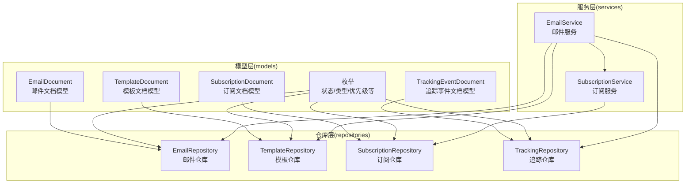
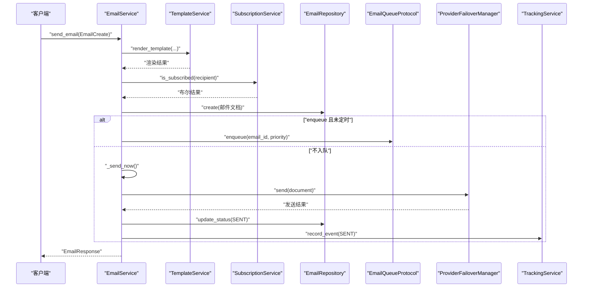
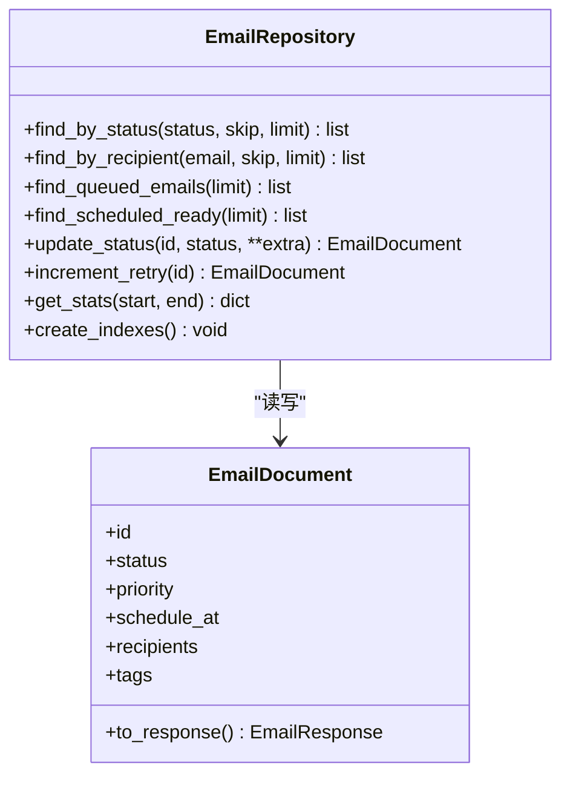
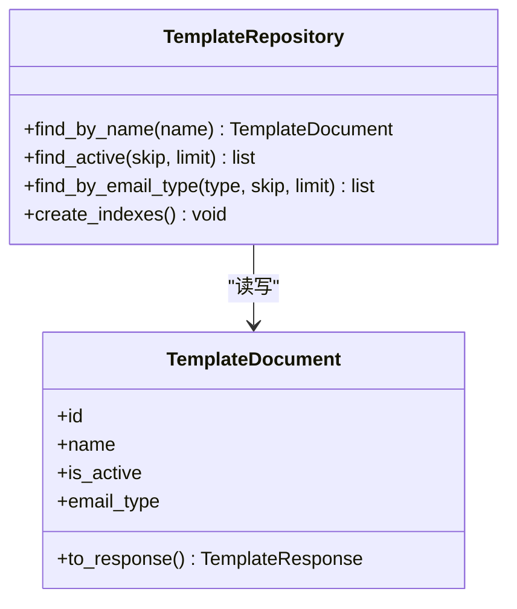
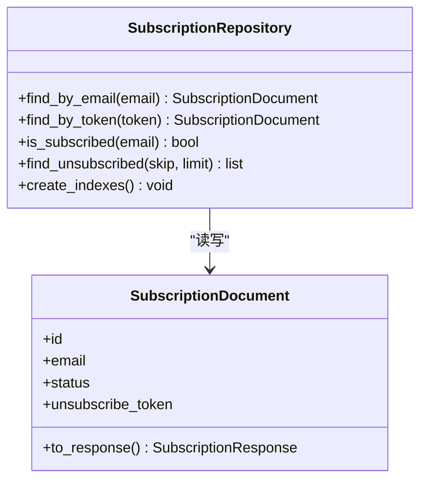
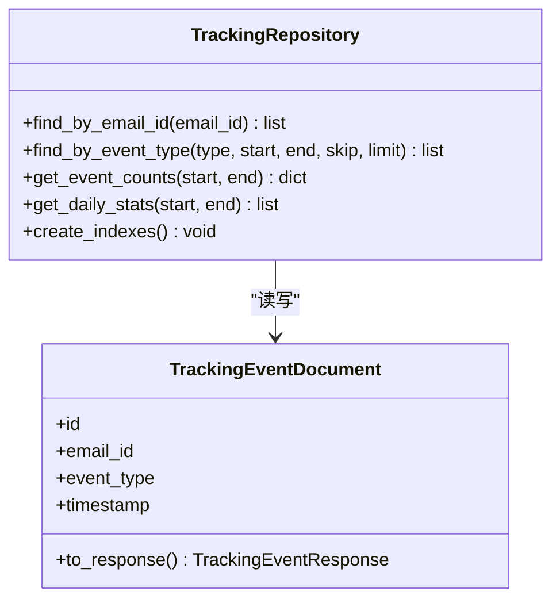
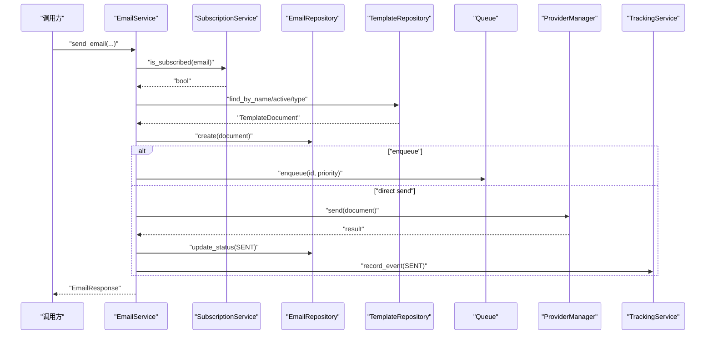
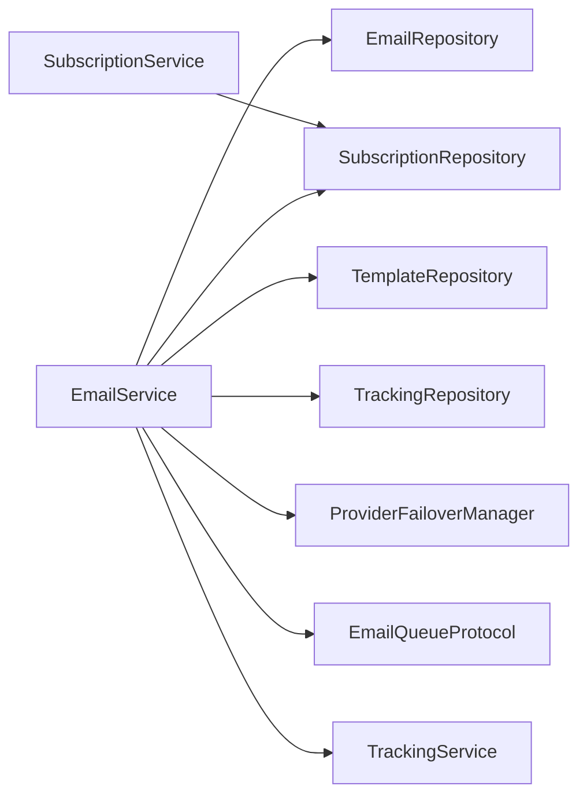

# 邮件仓库模式

<cite>
**本文引用的文件**
- [email_repo.py](file://tools/flexloop/src/taolib/testing/email_service/repository/email_repo.py)
- [subscription_repo.py](file://tools/flexloop/src/taolib/testing/email_service/repository/subscription_repo.py)
- [template_repo.py](file://tools/flexloop/src/taolib/testing/email_service/repository/template_repo.py)
- [tracking_repo.py](file://tools/flexloop/src/taolib/testing/email_service/repository/tracking_repo.py)
- [email.py](file://tools/flexloop/src/taolib/testing/email_service/models/email.py)
- [subscription.py](file://tools/flexloop/src/taolib/testing/email_service/models/subscription.py)
- [template.py](file://tools/flexloop/src/taolib/testing/email_service/models/template.py)
- [tracking.py](file://tools/flexloop/src/taolib/testing/email_service/models/tracking.py)
- [enums.py](file://tools/flexloop/src/taolib/testing/email_service/models/enums.py)
- [email_service.py](file://tools/flexloop/src/taolib/testing/email_service/services/email_service.py)
- [subscription_service.py](file://tools/flexloop/src/taolib/testing/email_service/services/subscription_service.py)
- [test_services.py](file://tools/flexloop/tests/testing/test_email_service/test_services.py)
</cite>

## 目录
1. [简介](#简介)
2. [项目结构](#项目结构)
3. [核心组件](#核心组件)
4. [架构总览](#架构总览)
5. [详细组件分析](#详细组件分析)
6. [依赖分析](#依赖分析)
7. [性能考虑](#性能考虑)
8. [故障排查指南](#故障排查指南)
9. [结论](#结论)
10. [附录](#附录)

## 简介
本文件系统化阐述“邮件仓库模式”的技术实现，聚焦数据访问层设计与数据库操作封装，覆盖以下主题：
- ORM/ODM 模型定义与数据结构
- 仓库类职责划分：邮件记录管理、订阅关系维护、模板存储、追踪事件聚合
- 数据模型间的关系、索引设计与查询优化
- 事务与并发控制：乐观锁与悲观锁的使用场景
- 数据迁移示例：新增字段、表结构变更与数据转换
- 性能优化策略：查询缓存、批量操作最佳实践

## 项目结构
该子系统位于工具模块内，采用“领域模型 + 仓库 + 服务”的分层设计：
- models：定义 Pydantic 模型与枚举，描述邮件、模板、订阅、追踪事件的结构与约束
- repository：面向集合的异步数据访问层，封装 CRUD、索引与聚合
- services：业务编排层，协调模板渲染、订阅检查、队列与提供商发送、追踪事件记录

图表来源
- [email_repo.py:14-116](file://tools/flexloop/src/taolib/testing/email_service/repository/email_repo.py#L14-L116)
- [template_repo.py:11-55](file://tools/flexloop/src/taolib/testing/email_service/repository/template_repo.py#L11-L55)
- [subscription_repo.py:11-62](file://tools/flexloop/src/taolib/testing/email_service/repository/subscription_repo.py#L11-L62)
- [tracking_repo.py:13-100](file://tools/flexloop/src/taolib/testing/email_service/repository/tracking_repo.py#L13-L100)
- [email.py:97-152](file://tools/flexloop/src/taolib/testing/email_service/models/email.py#L97-L152)
- [template.py:62-93](file://tools/flexloop/src/taolib/testing/email_service/models/template.py#L62-L93)
- [subscription.py:12-67](file://tools/flexloop/src/taolib/testing/email_service/models/subscription.py#L12-L67)
- [tracking.py:23-79](file://tools/flexloop/src/taolib/testing/email_service/models/tracking.py#L23-L79)
- [enums.py:1-71](file://tools/flexloop/src/taolib/testing/email_service/models/enums.py#L1-L71)
- [email_service.py:28-243](file://tools/flexloop/src/taolib/testing/email_service/services/email_service.py#L28-L243)
- [subscription_service.py:18-47](file://tools/flexloop/src/taolib/testing/email_service/services/subscription_service.py#L18-L47)

章节来源
- [email_repo.py:14-116](file://tools/flexloop/src/taolib/testing/email_service/repository/email_repo.py#L14-L116)
- [template_repo.py:11-55](file://tools/flexloop/src/taolib/testing/email_service/repository/template_repo.py#L11-L55)
- [subscription_repo.py:11-62](file://tools/flexloop/src/taolib/testing/email_service/repository/subscription_repo.py#L11-L62)
- [tracking_repo.py:13-100](file://tools/flexloop/src/taolib/testing/email_service/repository/tracking_repo.py#L13-L100)
- [email_service.py:28-243](file://tools/flexloop/src/taolib/testing/email_service/services/email_service.py#L28-L243)

## 核心组件
- 邮件仓库：负责邮件生命周期的查询、状态更新、重试计数、统计聚合与索引创建
- 模板仓库：负责模板的唯一性检索、激活状态筛选、按类型过滤与索引创建
- 订阅仓库：负责订阅/退订记录的唯一索引、状态检查与退订列表查询
- 追踪仓库：负责事件查询、按类型与时间聚合、按天聚合与 TTL 清理
- 邮件服务：编排模板渲染、订阅检查、入队/直发、错误重试与追踪事件记录
- 订阅服务：提供订阅记录的获取/创建、退订令牌生成与订阅状态判断

章节来源
- [email_repo.py:14-116](file://tools/flexloop/src/taolib/testing/email_service/repository/email_repo.py#L14-L116)
- [template_repo.py:11-55](file://tools/flexloop/src/taolib/testing/email_service/repository/template_repo.py#L11-L55)
- [subscription_repo.py:11-62](file://tools/flexloop/src/taolib/testing/email_service/repository/subscription_repo.py#L11-L62)
- [tracking_repo.py:13-100](file://tools/flexloop/src/taolib/testing/email_service/repository/tracking_repo.py#L13-L100)
- [email_service.py:28-243](file://tools/flexloop/src/taolib/testing/email_service/services/email_service.py#L28-L243)
- [subscription_service.py:18-47](file://tools/flexloop/src/taolib/testing/email_service/services/subscription_service.py#L18-L47)

## 架构总览
下图展示了从调用到数据持久化的端到端流程。

图表来源
- [email_service.py:64-213](file://tools/flexloop/src/taolib/testing/email_service/services/email_service.py#L64-L213)
- [email_repo.py:69-78](file://tools/flexloop/src/taolib/testing/email_service/repository/email_repo.py#L69-L78)

章节来源
- [email_service.py:28-243](file://tools/flexloop/src/taolib/testing/email_service/services/email_service.py#L28-L243)

## 详细组件分析

### 邮件仓库（EmailRepository）
职责与能力
- 查询与过滤：按状态、收件人、定时到期等条件查询
- 排序与分页：统一支持排序与分页参数
- 状态更新：原子更新状态与时间戳，支持额外字段
- 重试计数：原子自增并更新时间戳
- 统计聚合：按状态分组统计
- 索引管理：创建常用查询字段索引

复杂度与性能
- 查询复杂度取决于索引命中情况；通过复合索引可降低扫描成本
- 聚合查询使用管道，适合大体量统计

并发与一致性
- 原子更新与聚合保证了并发下的数据一致性
- 重试计数使用 find_one_and_update，避免竞态

图表来源
- [email_repo.py:14-116](file://tools/flexloop/src/taolib/testing/email_service/repository/email_repo.py#L14-L116)
- [email.py:97-152](file://tools/flexloop/src/taolib/testing/email_service/models/email.py#L97-L152)

章节来源
- [email_repo.py:14-116](file://tools/flexloop/src/taolib/testing/email_service/repository/email_repo.py#L14-L116)
- [email.py:97-152](file://tools/flexloop/src/taolib/testing/email_service/models/email.py#L97-L152)

### 模板仓库（TemplateRepository）
职责与能力
- 按名称唯一检索模板
- 激活模板筛选与按类型过滤
- 索引管理：名称唯一索引、激活状态与类型索引

复杂度与性能
- 名称唯一索引确保 O(log N) 查找
- 激活状态与类型索引支持高效过滤

图表来源
- [template_repo.py:11-55](file://tools/flexloop/src/taolib/testing/email_service/repository/template_repo.py#L11-L55)
- [template.py:62-93](file://tools/flexloop/src/taolib/testing/email_service/models/template.py#L62-L93)

章节来源
- [template_repo.py:11-55](file://tools/flexloop/src/taolib/testing/email_service/repository/template_repo.py#L11-L55)
- [template.py:62-93](file://tools/flexloop/src/taolib/testing/email_service/models/template.py#L62-L93)

### 订阅仓库（SubscriptionRepository）
职责与能力
- 按邮箱与退订令牌查询订阅记录
- 订阅状态判断：无记录默认视为已订阅
- 已退订列表查询与索引管理

并发与一致性
- 唯一索引保证邮箱与退订令牌的唯一性
- 状态判断逻辑对空记录进行安全兜底

图表来源
- [subscription_repo.py:11-62](file://tools/flexloop/src/taolib/testing/email_service/repository/subscription_repo.py#L11-L62)
- [subscription.py:12-67](file://tools/flexloop/src/taolib/testing/email_service/models/subscription.py#L12-L67)

章节来源
- [subscription_repo.py:11-62](file://tools/flexloop/src/taolib/testing/email_service/repository/subscription_repo.py#L11-L62)
- [subscription.py:12-67](file://tools/flexloop/src/taolib/testing/email_service/models/subscription.py#L12-L67)

### 追踪仓库（TrackingRepository）
职责与能力
- 按邮件 ID 与事件类型+时间范围查询
- 事件计数聚合与按天聚合
- TTL 策略：事件记录自动清理

复杂度与性能
- 时间范围聚合使用管道，适合大规模历史数据分析
- TTL 自动清理减少长期存储压力

图表来源
- [tracking_repo.py:13-100](file://tools/flexloop/src/taolib/testing/email_service/repository/tracking_repo.py#L13-L100)
- [tracking.py:23-79](file://tools/flexloop/src/taolib/testing/email_service/models/tracking.py#L23-L79)

章节来源
- [tracking_repo.py:13-100](file://tools/flexloop/src/taolib/testing/email_service/repository/tracking_repo.py#L13-L100)
- [tracking.py:23-79](file://tools/flexloop/src/taolib/testing/email_service/models/tracking.py#L23-L79)

### 邮件服务（EmailService）与订阅服务（SubscriptionService）
职责与能力
- 邮件服务：模板渲染、订阅检查、创建文档、入队/直发、错误重试、追踪事件记录
- 订阅服务：获取/创建订阅记录、退订令牌生成、订阅状态判断

图表来源
- [email_service.py:64-213](file://tools/flexloop/src/taolib/testing/email_service/services/email_service.py#L64-L213)
- [subscription_service.py:29-47](file://tools/flexloop/src/taolib/testing/email_service/services/subscription_service.py#L29-L47)

章节来源
- [email_service.py:28-243](file://tools/flexloop/src/taolib/testing/email_service/services/email_service.py#L28-L243)
- [subscription_service.py:18-47](file://tools/flexloop/src/taolib/testing/email_service/services/subscription_service.py#L18-L47)

## 依赖分析
- 仓库层依赖基础抽象与集合对象，提供统一的异步 CRUD 与聚合接口
- 服务层依赖多个仓库与外部协议（队列、提供商），形成清晰的编排职责
- 模型层通过 Pydantic 定义结构与序列化，确保跨层数据一致性

图表来源
- [email_service.py:38-62](file://tools/flexloop/src/taolib/testing/email_service/services/email_service.py#L38-L62)
- [subscription_service.py:21-27](file://tools/flexloop/src/taolib/testing/email_service/services/subscription_service.py#L21-L27)

章节来源
- [email_service.py:28-243](file://tools/flexloop/src/taolib/testing/email_service/services/email_service.py#L28-L243)
- [subscription_service.py:18-47](file://tools/flexloop/src/taolib/testing/email_service/services/subscription_service.py#L18-L47)

## 性能考虑
- 查询优化
  - 使用专用索引：状态、类型、时间、收件人邮箱、模板名称唯一索引
  - 聚合统计：利用管道进行分组与按天聚合，避免应用侧二次处理
- 批量操作
  - 批量发送时建议分批入队，结合队列处理器的速率限制
  - 批量查询使用 skip/limit 分页，避免一次性加载过多数据
- 缓存策略
  - 对热点模板与订阅状态进行短期缓存，降低数据库压力
  - 缓存失效策略基于 TTL 或变更事件触发
- TTL 清理
  - 追踪事件集合设置 TTL，定期清理历史数据，控制存储增长

## 故障排查指南
常见问题与定位要点
- 邮件未发送或状态异常
  - 检查队列是否正常入队与处理
  - 关注重试计数与最大重试阈值
  - 核对提供商返回与追踪事件记录
- 订阅检查导致收件人被过滤
  - 确认订阅状态与退订令牌生成逻辑
  - 核对邮箱唯一索引与状态字段
- 模板未生效
  - 确认模板名称唯一索引与激活状态
  - 检查按类型过滤逻辑与变量渲染

章节来源
- [email_service.py:193-212](file://tools/flexloop/src/taolib/testing/email_service/services/email_service.py#L193-L212)
- [subscription_repo.py:34-42](file://tools/flexloop/src/taolib/testing/email_service/repository/subscription_repo.py#L34-L42)
- [tracking_repo.py:46-86](file://tools/flexloop/src/taolib/testing/email_service/repository/tracking_repo.py#L46-L86)

## 结论
该邮件仓库模式通过清晰的分层与职责划分，实现了邮件生命周期的全链路管理。仓库层提供高性能的查询与聚合能力，服务层完成复杂的业务编排，模型层确保数据结构的一致性。配合索引与 TTL 等优化手段，可在高并发场景下保持稳定与可扩展性。

## 附录

### 数据模型关系与索引设计
- 邮件文档
  - 字段：状态、优先级、定时发送时间、收件人数组、标签、元数据
  - 常用查询：状态、类型、创建时间、定时到期、收件人邮箱、标签
  - 建议索引：状态、类型、创建时间降序、定时时间、收件人邮箱、标签
- 模板文档
  - 字段：名称、描述、主题与 HTML 模板、变量 Schema、类型、标签、激活状态
  - 常用查询：名称（唯一）、激活状态、类型
  - 建议索引：名称唯一、激活状态、类型、标签
- 订阅文档
  - 字段：邮箱、状态、退订原因、退订令牌、标签、时间戳
  - 常用查询：邮箱、退订令牌、状态
  - 建议索引：邮箱唯一、退订令牌唯一、状态
- 追踪事件文档
  - 字段：关联邮件 ID、事件类型、收件人、时间戳、IP/UA、点击 URL、退订原因
  - 常用查询：邮件 ID、事件类型+时间范围
  - 建议索引：邮件 ID、事件类型、时间戳降序、收件人、TTL（90 天）

章节来源
- [email_repo.py:106-114](file://tools/flexloop/src/taolib/testing/email_service/repository/email_repo.py#L106-L114)
- [template_repo.py:47-52](file://tools/flexloop/src/taolib/testing/email_service/repository/template_repo.py#L47-L52)
- [subscription_repo.py:55-59](file://tools/flexloop/src/taolib/testing/email_service/repository/subscription_repo.py#L55-L59)
- [tracking_repo.py:88-97](file://tools/flexloop/src/taolib/testing/email_service/repository/tracking_repo.py#L88-L97)

### 事务与并发控制
- 并发控制
  - 使用原子更新与聚合操作保证统计与状态变更的一致性
  - 重试计数使用 find_one_and_update，避免竞态条件
- 锁策略
  - 乐观锁：通过版本号/时间戳字段在更新时校验冲突（如需扩展）
  - 悲观锁：在需要强一致性的短事务中使用集合级锁（谨慎使用，影响吞吐）
- 建议
  - 将幂等性设计融入业务流程，减少对显式锁的依赖
  - 对关键路径采用补偿机制与可观测性监控

章节来源
- [email_repo.py:80-93](file://tools/flexloop/src/taolib/testing/email_service/repository/email_repo.py#L80-L93)
- [tracking_repo.py:46-86](file://tools/flexloop/src/taolib/testing/email_service/repository/tracking_repo.py#L46-L86)

### 数据迁移示例
- 新增字段
  - 示例：为邮件文档增加“营销标签”字段
  - 步骤：在模型层定义字段与默认值；在仓库层创建对应索引；编写迁移脚本批量填充默认值；验证查询与聚合
- 修改表结构
  - 示例：将“收件人数组”拆分为独立集合（如需强关系查询）
  - 步骤：设计新模型与关系；编写双向迁移脚本；重建索引；逐步切换查询路径
- 数据转换
  - 示例：将旧状态枚举映射到新枚举
  - 步骤：编写映射表；批量更新状态字段；更新索引与查询条件；回归测试

章节来源
- [email.py:97-152](file://tools/flexloop/src/taolib/testing/email_service/models/email.py#L97-L152)
- [email_repo.py:106-114](file://tools/flexloop/src/taolib/testing/email_service/repository/email_repo.py#L106-L114)

### 测试参考
- 单元测试与集成测试覆盖了服务编排、仓库查询与索引行为
- 建议在迁移前后补充针对性测试，确保索引与查询路径正确性

章节来源
- [test_services.py:141-162](file://tools/flexloop/tests/testing/test_email_service/test_services.py#L141-L162)