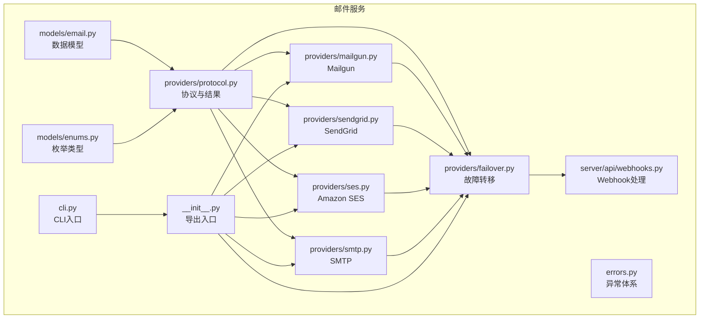
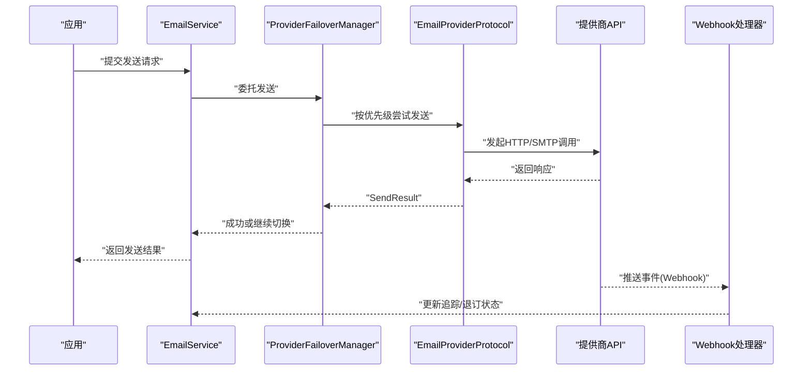
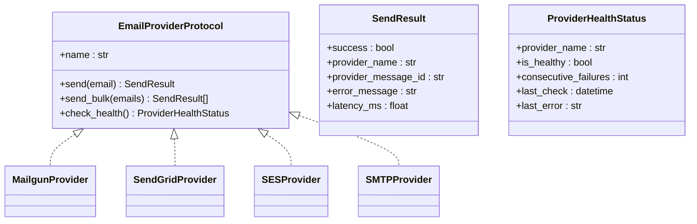
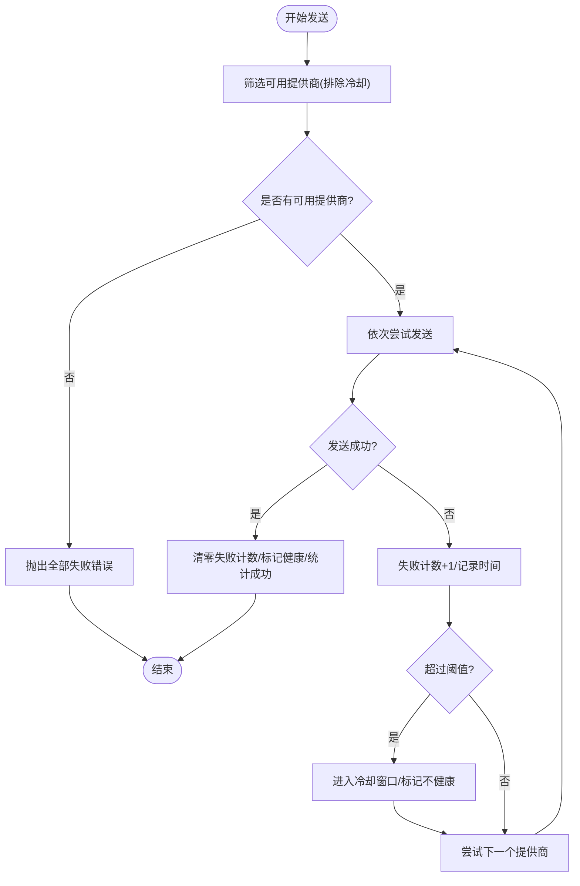
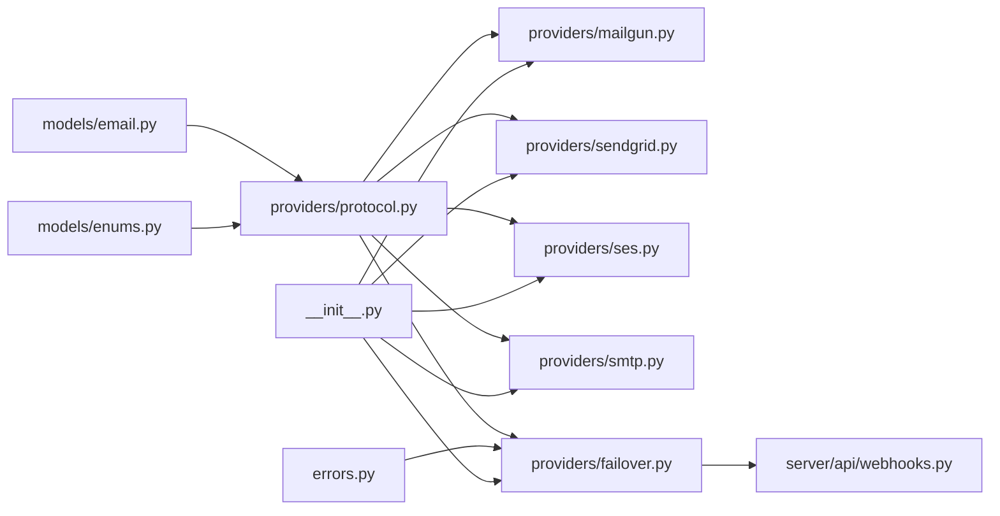

# 邮件提供者集成

<cite>
**本文引用的文件**
- [protocol.py](file://tools/flexloop/src/taolib/testing/email_service/providers/protocol.py)
- [mailgun.py](file://tools/flexloop/src/taolib/testing/email_service/providers/mailgun.py)
- [sendgrid.py](file://tools/flexloop/src/taolib/testing/email_service/providers/sendgrid.py)
- [ses.py](file://tools/flexloop/src/taolib/testing/email_service/providers/ses.py)
- [smtp.py](file://tools/flexloop/src/taolib/testing/email_service/providers/smtp.py)
- [failover.py](file://tools/flexloop/src/taolib/testing/email_service/providers/failover.py)
- [email.py](file://tools/flexloop/src/taolib/testing/email_service/models/email.py)
- [enums.py](file://tools/flexloop/src/taolib/testing/email_service/models/enums.py)
- [errors.py](file://tools/flexloop/src/taolib/testing/email_service/errors.py)
- [__init__.py](file://tools/flexloop/src/taolib/testing/email_service/__init__.py)
- [webhooks.py](file://tools/flexloop/src/taolib/testing/email_service/server/api/webhooks.py)
- [cli.py](file://tools/flexloop/src/taolib/testing/email_service/cli.py)
</cite>

## 目录
1. [简介](#简介)
2. [项目结构](#项目结构)
3. [核心组件](#核心组件)
4. [架构总览](#架构总览)
5. [详细组件分析](#详细组件分析)
6. [依赖关系分析](#依赖关系分析)
7. [性能考虑](#性能考虑)
8. [故障排查指南](#故障排查指南)
9. [结论](#结论)
10. [附录](#附录)

## 简介
本文件面向邮件提供者集成，系统性阐述多提供商适配与统一抽象层设计，覆盖 SendGrid、Mailgun、Amazon SES 以及传统 SMTP 的配置与实现要点；详述故障转移机制（含切换策略与冷却逻辑）、速率限制与错误恢复策略，并给出与主服务层的集成路径与监控指标建议。文档同时提供可直接定位到源码的参考路径，便于快速查阅与落地实施。

## 项目结构
邮件服务位于工具包子模块中，采用“模型-协议-提供者-故障转移-服务层”的分层组织方式，便于扩展与替换不同提供商。

图示来源
- [email.py:1-152](file://tools/flexloop/src/taolib/testing/email_service/models/email.py#L1-L152)
- [enums.py:1-71](file://tools/flexloop/src/taolib/testing/email_service/models/enums.py#L1-L71)
- [protocol.py:1-77](file://tools/flexloop/src/taolib/testing/email_service/providers/protocol.py#L1-L77)
- [mailgun.py:1-123](file://tools/flexloop/src/taolib/testing/email_service/providers/mailgun.py#L1-L123)
- [sendgrid.py:1-144](file://tools/flexloop/src/taolib/testing/email_service/providers/sendgrid.py#L1-L144)
- [ses.py:1-116](file://tools/flexloop/src/taolib/testing/email_service/providers/ses.py#L1-L116)
- [smtp.py:1-133](file://tools/flexloop/src/taolib/testing/email_service/providers/smtp.py#L1-L133)
- [failover.py:1-175](file://tools/flexloop/src/taolib/testing/email_service/providers/failover.py#L1-L175)
- [errors.py:1-65](file://tools/flexloop/src/taolib/testing/email_service/errors.py#L1-L65)
- [__init__.py:1-129](file://tools/flexloop/src/taolib/testing/email_service/__init__.py#L1-L129)
- [webhooks.py:106-143](file://tools/flexloop/src/taolib/testing/email_service/server/api/webhooks.py#L106-L143)
- [cli.py:1-55](file://tools/flexloop/src/taolib/testing/email_service/cli.py#L1-L55)

章节来源
- [__init__.py:1-129](file://tools/flexloop/src/taolib/testing/email_service/__init__.py#L1-L129)

## 核心组件
- 统一协议与数据结构
  - 协议接口定义了提供商需实现的统一方法与属性，确保多提供商可被一致调用与治理。
  - 发送结果与健康状态用于标准化返回与可观测性。
- 提供商实现
  - Mailgun、SendGrid、Amazon SES、SMTP 四类提供商分别封装各自 API/协议细节。
- 故障转移管理器
  - 基于优先级与冷却窗口的自动切换策略，提升整体可用性与弹性。
- 业务模型与枚举
  - 定义邮件、收件人、附件、状态与类型等模型，支撑发送、追踪与退订管理。
- 异常体系
  - 明确服务层与提供商层的错误边界，便于上层进行差异化处理。

章节来源
- [protocol.py:13-77](file://tools/flexloop/src/taolib/testing/email_service/providers/protocol.py#L13-L77)
- [mailgun.py:15-123](file://tools/flexloop/src/taolib/testing/email_service/providers/mailgun.py#L15-L123)
- [sendgrid.py:15-144](file://tools/flexloop/src/taolib/testing/email_service/providers/sendgrid.py#L15-L144)
- [ses.py:15-116](file://tools/flexloop/src/taolib/testing/email_service/providers/ses.py#L15-L116)
- [smtp.py:15-133](file://tools/flexloop/src/taolib/testing/email_service/providers/smtp.py#L15-L133)
- [failover.py:32-175](file://tools/flexloop/src/taolib/testing/email_service/providers/failover.py#L32-L175)
- [email.py:10-152](file://tools/flexloop/src/taolib/testing/email_service/models/email.py#L10-L152)
- [enums.py:6-71](file://tools/flexloop/src/taolib/testing/email_service/models/enums.py#L6-L71)
- [errors.py:7-65](file://tools/flexloop/src/taolib/testing/email_service/errors.py#L7-L65)

## 架构总览
下图展示了从应用调用到提供商发送、再到 Webhook 回传与追踪的整体流程。

图示来源
- [failover.py:59-114](file://tools/flexloop/src/taolib/testing/email_service/providers/failover.py#L59-L114)
- [mailgun.py:41-71](file://tools/flexloop/src/taolib/testing/email_service/providers/mailgun.py#L41-L71)
- [sendgrid.py:51-81](file://tools/flexloop/src/taolib/testing/email_service/providers/sendgrid.py#L51-L81)
- [ses.py:46-89](file://tools/flexloop/src/taolib/testing/email_service/providers/ses.py#L46-L89)
- [smtp.py:49-87](file://tools/flexloop/src/taolib/testing/email_service/providers/smtp.py#L49-L87)
- [webhooks.py:106-143](file://tools/flexloop/src/taolib/testing/email_service/server/api/webhooks.py#L106-L143)

## 详细组件分析

### 抽象层与统一接口
- 协议接口
  - 要求提供商实现名称标识、单发与批量发送、健康检查等方法，保证上层调用一致性。
- 结果与健康状态
  - SendResult 统一携带成功标志、提供商名称、消息ID与延迟；ProviderHealthStatus 提供健康度与连续失败计数等观测字段。

图示来源
- [protocol.py:35-77](file://tools/flexloop/src/taolib/testing/email_service/providers/protocol.py#L35-L77)
- [mailgun.py:15-39](file://tools/flexloop/src/taolib/testing/email_service/providers/mailgun.py#L15-L39)
- [sendgrid.py:15-49](file://tools/flexloop/src/taolib/testing/email_service/providers/sendgrid.py#L15-L49)
- [ses.py:15-44](file://tools/flexloop/src/taolib/testing/email_service/providers/ses.py#L15-L44)
- [smtp.py:15-47](file://tools/flexloop/src/taolib/testing/email_service/providers/smtp.py#L15-L47)

章节来源
- [protocol.py:13-77](file://tools/flexloop/src/taolib/testing/email_service/providers/protocol.py#L13-L77)

### Mailgun 提供商
- 配置要点
  - 需要 API Key 与域名；构造 HTTP 客户端并使用表单数据发送。
- 关键行为
  - 构建 from/to/cc/bcc/html/text/tags 等字段；健康检查访问域名资源。
- 适用场景
  - 适合交易类邮件与中小规模发送，配置简单、生态完善。

章节来源
- [mailgun.py:21-96](file://tools/flexloop/src/taolib/testing/email_service/providers/mailgun.py#L21-L96)
- [mailgun.py:97-121](file://tools/flexloop/src/taolib/testing/email_service/providers/mailgun.py#L97-L121)

### SendGrid 提供商
- 配置要点
  - 需要 API Key；可选默认发件人信息；使用 JSON 负载发送。
- 关键行为
  - 构建 personalizations、content、categories 等字段；支持最多 10 个分类标签；健康检查访问 scopes。
- 适用场景
  - 适合高吞吐与丰富元数据的邮件发送，支持更丰富的营销能力。

章节来源
- [sendgrid.py:21-99](file://tools/flexloop/src/taolib/testing/email_service/providers/sendgrid.py#L21-L99)
- [sendgrid.py:101-141](file://tools/flexloop/src/taolib/testing/email_service/providers/sendgrid.py#L101-L141)

### Amazon SES 提供商
- 配置要点
  - 需要 AWS 区域、Access Key ID 与 Secret Access Key；使用 v2 HTTP API。
- 关键行为
  - 构建目标地址等负载；健康检查访问账户资源；注释提示生产环境建议使用 aiobotocore 进行签名。
- 适用场景
  - 适合企业级大规模发送与合规要求较高的场景。

章节来源
- [ses.py:22-89](file://tools/flexloop/src/taolib/testing/email_service/providers/ses.py#L22-L89)
- [ses.py:112-116](file://tools/flexloop/src/taolib/testing/email_service/providers/ses.py#L112-L116)

### SMTP 提供商
- 配置要点
  - 需要主机、端口、用户名、密码与是否启用 TLS；使用 aiosmtplib 异步发送。
- 关键行为
  - 构建 MIME 消息；健康检查连接、STARTTLS 与 NOOP。
- 适用场景
  - 适合自有邮件服务器或对发送通道有强控制需求的场景。

章节来源
- [smtp.py:21-109](file://tools/flexloop/src/taolib/testing/email_service/providers/smtp.py#L21-L109)
- [smtp.py:111-131](file://tools/flexloop/src/taolib/testing/email_service/providers/smtp.py#L111-L131)

### 故障转移机制
- 设计要点
  - 按优先级排序提供商；失败达到阈值进入冷却窗口；冷却结束后通过健康检查恢复。
  - 单次发送遍历可用提供商，遇到成功即返回；全部失败则抛出聚合错误。
- 关键参数
  - 最大连续失败阈值、冷却时长（秒）。
- 观测与运维
  - 提供状态查询接口，便于外部定时健康检查与恢复尝试。

图示来源
- [failover.py:59-114](file://tools/flexloop/src/taolib/testing/email_service/providers/failover.py#L59-L114)
- [failover.py:139-156](file://tools/flexloop/src/taolib/testing/email_service/providers/failover.py#L139-L156)

章节来源
- [failover.py:32-175](file://tools/flexloop/src/taolib/testing/email_service/providers/failover.py#L32-L175)
- [errors.py:37-51](file://tools/flexloop/src/taolib/testing/email_service/errors.py#L37-L51)

### 数据模型与类型
- 邮件模型
  - 支持发件人、收件人（含 CC/BCC）、主题、类型、优先级、标签、模板变量、正文、附件、调度时间、元数据等。
- 枚举类型
  - 邮件状态、类型、优先级、提供商类型、追踪事件类型、退订状态等，统一语义与取值范围。

章节来源
- [email.py:10-152](file://tools/flexloop/src/taolib/testing/email_service/models/email.py#L10-L152)
- [enums.py:6-71](file://tools/flexloop/src/taolib/testing/email_service/models/enums.py#L6-L71)

### 与主服务层的集成与监控
- 集成方式
  - 通过统一协议注入多个提供商，交由故障转移管理器编排；发送结果与健康状态可用于监控与告警。
- Webhook 处理
  - 支持 Mailgun 与 SES 的事件回推，用于更新投递状态、退订与点击追踪。
- CLI 入口
  - 提供 server/send/templates 等子命令，便于本地调试与验证。

章节来源
- [webhooks.py:106-143](file://tools/flexloop/src/taolib/testing/email_service/server/api/webhooks.py#L106-L143)
- [cli.py:7-55](file://tools/flexloop/src/taolib/testing/email_service/cli.py#L7-L55)
- [__init__.py:49-67](file://tools/flexloop/src/taolib/testing/email_service/__init__.py#L49-L67)

## 依赖关系分析
- 组件耦合
  - 提供商实现依赖协议与模型；故障转移管理器依赖提供商协议与健康状态；服务层依赖故障转移与模型。
- 外部依赖
  - HTTP 客户端（httpx）、异步 SMTP（aiosmtplib）等第三方库。
- 循环依赖
  - 当前结构清晰，无明显循环导入。

图示来源
- [protocol.py:1-77](file://tools/flexloop/src/taolib/testing/email_service/providers/protocol.py#L1-L77)
- [mailgun.py:1-123](file://tools/flexloop/src/taolib/testing/email_service/providers/mailgun.py#L1-L123)
- [sendgrid.py:1-144](file://tools/flexloop/src/taolib/testing/email_service/providers/sendgrid.py#L1-L144)
- [ses.py:1-116](file://tools/flexloop/src/taolib/testing/email_service/providers/ses.py#L1-L116)
- [smtp.py:1-133](file://tools/flexloop/src/taolib/testing/email_service/providers/smtp.py#L1-L133)
- [failover.py:1-175](file://tools/flexloop/src/taolib/testing/email_service/providers/failover.py#L1-L175)
- [email.py:1-152](file://tools/flexloop/src/taolib/testing/email_service/models/email.py#L1-L152)
- [enums.py:1-71](file://tools/flexloop/src/taolib/testing/email_service/models/enums.py#L1-L71)
- [errors.py:1-65](file://tools/flexloop/src/taolib/testing/email_service/errors.py#L1-L65)
- [__init__.py:1-129](file://tools/flexloop/src/taolib/testing/email_service/__init__.py#L1-L129)
- [webhooks.py:106-143](file://tools/flexloop/src/taolib/testing/email_service/server/api/webhooks.py#L106-L143)

## 性能考虑
- 并发与超时
  - 提供商实现普遍采用异步客户端并设置合理超时，避免阻塞；建议在上层队列与并发调度中配合背压策略。
- 批量发送
  - 提供商支持逐封发送；若需更高吞吐，可在上层批量组装并利用提供商的批量接口（如 SendGrid 的一次性多收件人）。
- 延迟与可观测性
  - 统一记录发送延迟与提供商消息ID，便于端到端性能分析与 SLA 对齐。
- 速率限制
  - 合理设置最大连续失败阈值与冷却时间，避免雪崩效应；结合提供商的速率限制与配额策略进行限流。
- 缓存与预热
  - 健康检查可周期性执行，提前发现异常并进入冷却，减少对用户请求的影响。

## 故障排查指南
- 常见错误定位
  - 提供商返回非 2xx 或异常抛出时，检查凭据、端点与网络连通性；查看 SendResult 中的错误信息。
- 健康检查
  - 使用提供商的健康检查接口确认可用性；故障转移管理器会自动将不健康提供商进入冷却。
- Webhook 回推
  - 确认回调地址可达且能正确解析事件类型；根据事件类型更新追踪状态。
- CLI 调试
  - 使用 CLI 的 server 子命令启动服务，通过 API 端点验证发送流程。

章节来源
- [failover.py:139-156](file://tools/flexloop/src/taolib/testing/email_service/providers/failover.py#L139-L156)
- [errors.py:31-51](file://tools/flexloop/src/taolib/testing/email_service/errors.py#L31-L51)
- [webhooks.py:106-143](file://tools/flexloop/src/taolib/testing/email_service/server/api/webhooks.py#L106-L143)
- [cli.py:30-49](file://tools/flexloop/src/taolib/testing/email_service/cli.py#L30-L49)

## 结论
该邮件服务通过统一协议抽象与故障转移机制，实现了对多种提供商的灵活适配与高可用编排。结合健康检查、冷却窗口与可观测性指标，能够在复杂环境中稳定地完成邮件发送与追踪。建议在生产部署中结合业务流量特征调整阈值与冷却策略，并完善监控与告警体系。

## 附录

### 配置示例（路径指引）
- Mailgun
  - 初始化参数：API Key、域名
  - 参考路径：[mailgun.py:21-34](file://tools/flexloop/src/taolib/testing/email_service/providers/mailgun.py#L21-L34)
- SendGrid
  - 初始化参数：API Key、默认发件人（可选）
  - 参考路径：[sendgrid.py:21-44](file://tools/flexloop/src/taolib/testing/email_service/providers/sendgrid.py#L21-L44)
- Amazon SES
  - 初始化参数：区域、Access Key ID、Secret Access Key
  - 参考路径：[ses.py:22-39](file://tools/flexloop/src/taolib/testing/email_service/providers/ses.py#L22-L39)
- SMTP
  - 初始化参数：主机、端口、用户名、密码、是否启用 TLS
  - 参考路径：[smtp.py:21-43](file://tools/flexloop/src/taolib/testing/email_service/providers/smtp.py#L21-L43)

### 监控指标建议
- 发送成功率与失败率
- 各提供商延迟分布（P50/P95/P99）
- 健康检查通过率与冷却时长
- Webhook 回推事件到达率与处理耗时
- 退订与退信分类统计