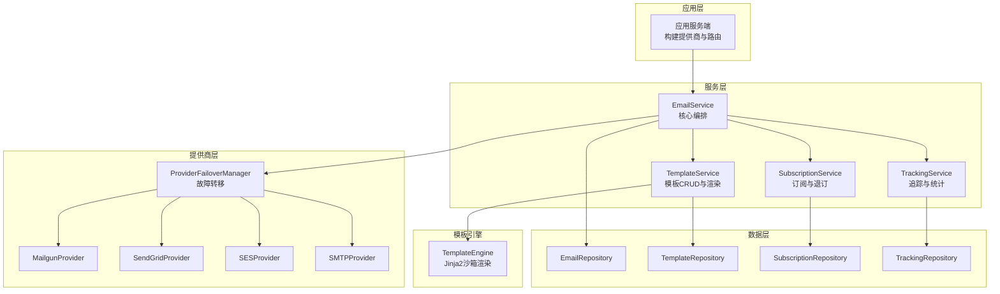
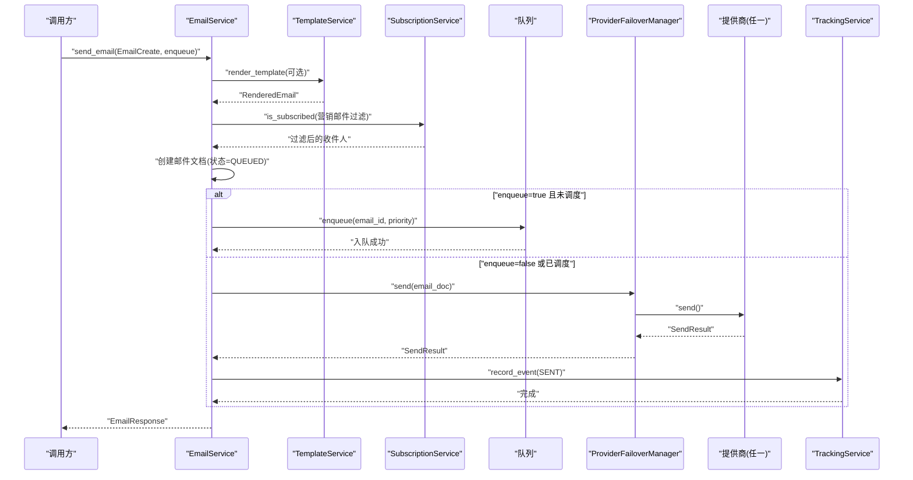
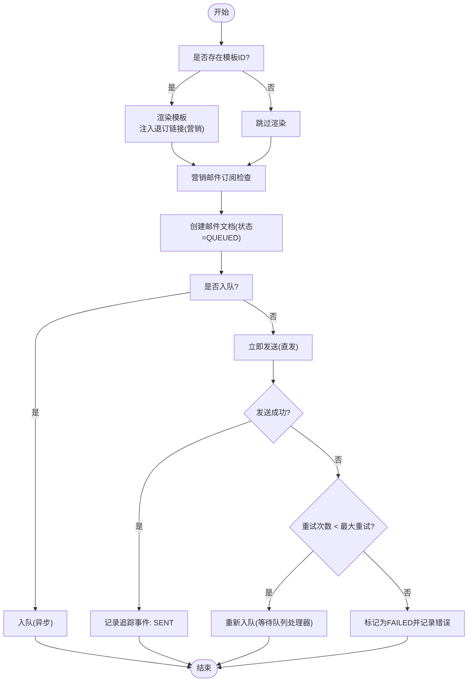
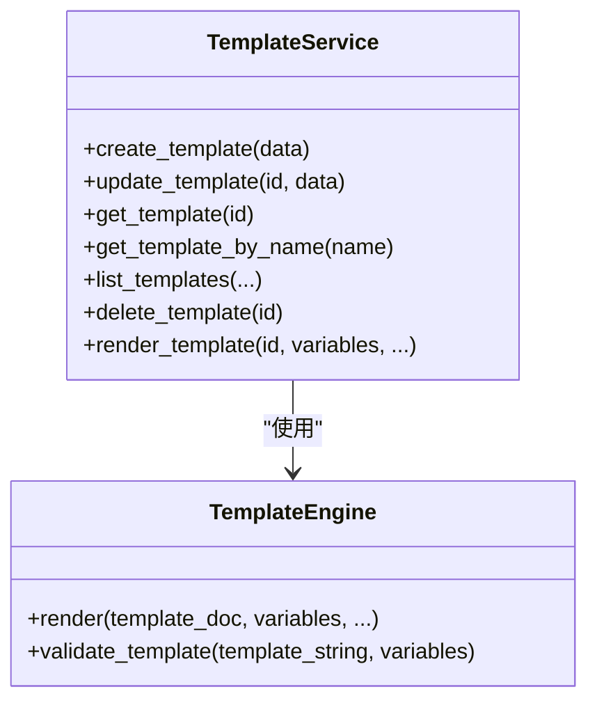
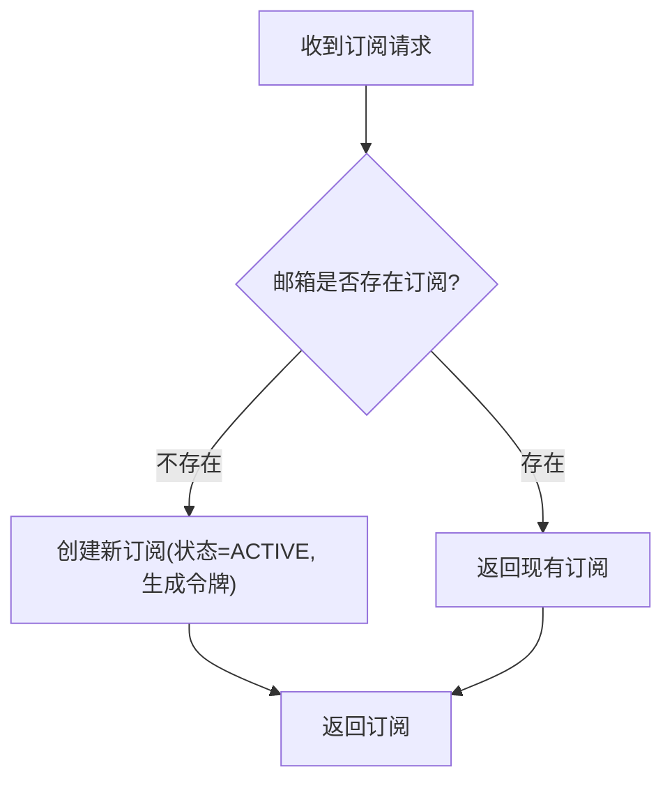
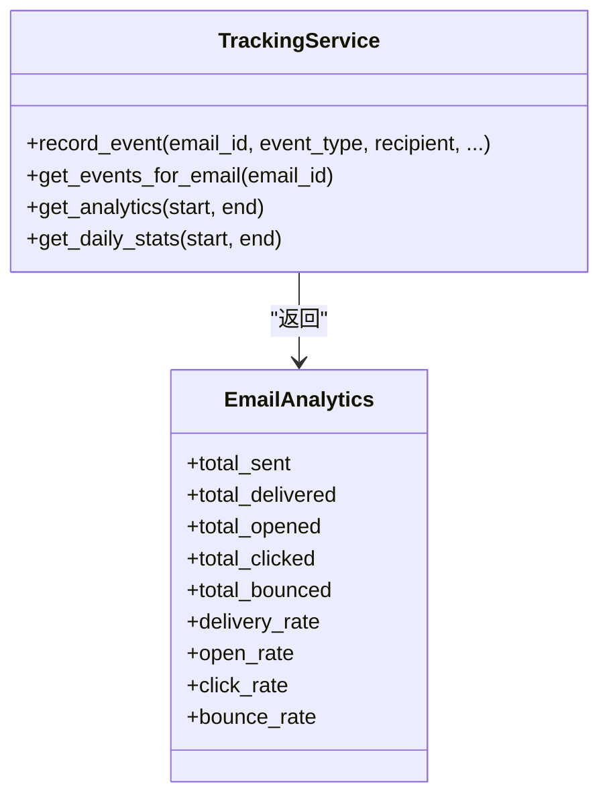
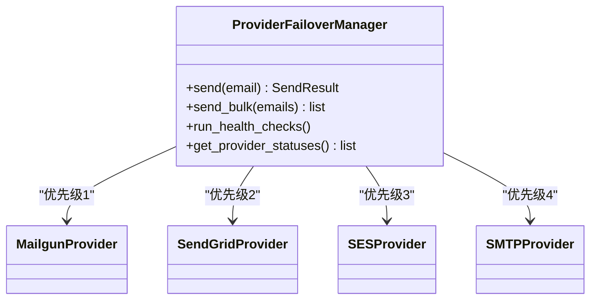
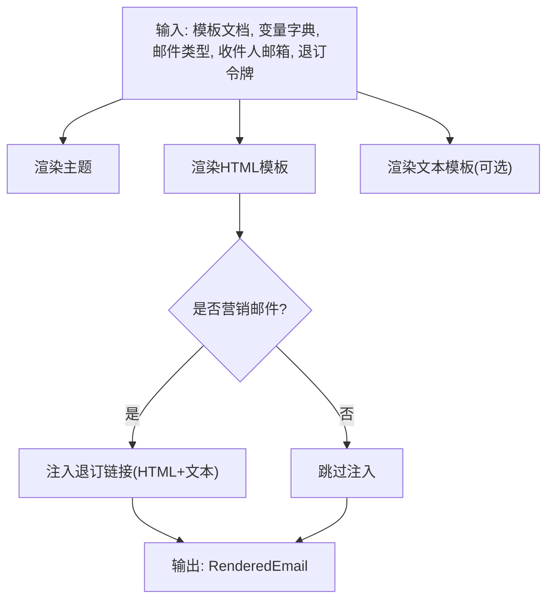
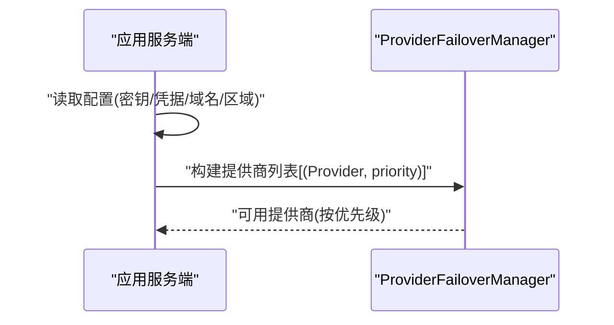
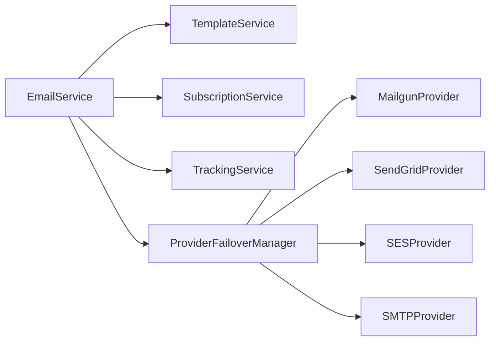

# 邮件服务

<cite>
**本文引用的文件**
- [邮件服务导出入口](file://tools/flexloop/src/taolib/testing/email_service/__init__.py)
- [邮件服务核心类](file://tools/flexloop/src/taolib/testing/email_service/services/email_service.py)
- [模板服务](file://tools/flexloop/src/taolib/testing/email_service/services/template_service.py)
- [订阅服务](file://tools/flexloop/src/taolib/testing/email_service/services/subscription_service.py)
- [追踪服务](file://tools/flexloop/src/taolib/testing/email_service/services/tracking_service.py)
- [提供商故障转移管理器](file://tools/flexloop/src/taolib/testing/email_service/providers/failover.py)
- [Mailgun 提供商](file://tools/flexloop/src/taolib/testing/email_service/providers/mailgun.py)
- [SendGrid 提供商](file://tools/flexloop/src/taolib/testing/email_service/providers/sendgrid.py)
- [SES 提供商](file://tools/flexloop/src/taolib/testing/email_service/providers/ses.py)
- [SMTP 提供商](file://tools/flexloop/src/taolib/testing/email_service/providers/smtp.py)
- [模板引擎](file://tools/flexloop/src/taolib/testing/email_service/template/engine.py)
- [模型定义](file://tools/flexloop/src/taolib/testing/email_service/models/__init__.py)
- [测试用例（服务）](file://tools/flexloop/tests/testing/test_email_service/test_services.py)
- [应用服务端（构建提供商）](file://tools/flexloop/src/taolib/testing/email_service/server/app.py)
</cite>

## 目录
1. [简介](#简介)
2. [项目结构](#项目结构)
3. [核心组件](#核心组件)
4. [架构总览](#架构总览)
5. [详细组件分析](#详细组件分析)
6. [依赖分析](#依赖分析)
7. [性能考量](#性能考量)
8. [故障排查指南](#故障排查指南)
9. [结论](#结论)
10. [附录](#附录)

## 简介
本邮件服务是一个面向企业与应用系统的可扩展邮件发送平台，具备以下能力：
- 多提供商自动故障转移（SendGrid、Mailgun、Amazon SES、SMTP）
- 模板引擎与变量渲染（Jinja2 沙箱环境，支持营销邮件退订链接注入）
- 队列化异步发送与即时直发
- 订阅管理与退订处理
- 投递追踪与统计分析
- 完整的仓库模式（Repository）用于邮件、模板、订阅、追踪事件的数据持久化

该系统既可作为微服务模块集成到业务系统，也可通过内置的队列处理器与追踪服务进行离线处理与监控。

## 项目结构
邮件服务位于工具包目录下，采用“分层+协议”的组织方式：
- providers：各邮件提供商实现与故障转移管理
- services：业务服务层（邮件、模板、订阅、追踪）
- template：模板引擎与渲染
- models：数据模型与枚举
- server：应用示例（构建提供商、路由等）
- tests：单元与集成测试

图表来源
- [应用服务端（构建提供商）:34-90](file://tools/flexloop/src/taolib/testing/email_service/server/app.py#L34-L90)
- [邮件服务核心类:28-63](file://tools/flexloop/src/taolib/testing/email_service/services/email_service.py#L28-L63)
- [模板服务:20-36](file://tools/flexloop/src/taolib/testing/email_service/services/template_service.py#L20-L36)
- [订阅服务:18-28](file://tools/flexloop/src/taolib/testing/email_service/services/subscription_service.py#L18-L28)
- [追踪服务:34-50](file://tools/flexloop/src/taolib/testing/email_service/services/tracking_service.py#L34-L50)
- [提供商故障转移管理器:32-58](file://tools/flexloop/src/taolib/testing/email_service/providers/failover.py#L32-L58)
- [Mailgun 提供商:15-35](file://tools/flexloop/src/taolib/testing/email_service/providers/mailgun.py#L15-L35)
- [SendGrid 提供商:15-44](file://tools/flexloop/src/taolib/testing/email_service/providers/sendgrid.py#L15-L44)
- [SES 提供商:15-39](file://tools/flexloop/src/taolib/testing/email_service/providers/ses.py#L15-L39)
- [SMTP 提供商:15-43](file://tools/flexloop/src/taolib/testing/email_service/providers/smtp.py#L15-L43)
- [模板引擎:46-64](file://tools/flexloop/src/taolib/testing/email_service/template/engine.py#L46-L64)

章节来源
- [邮件服务导出入口:1-129](file://tools/flexloop/src/taolib/testing/email_service/__init__.py#L1-L129)
- [模型定义:1-64](file://tools/flexloop/src/taolib/testing/email_service/models/__init__.py#L1-L64)

## 核心组件
- EmailService：编排模板渲染、订阅检查、邮件文档创建、入队或直发，并负责失败重试与状态更新。
- TemplateService：模板的创建、更新、查询与渲染；支持版本递增与渲染校验。
- SubscriptionService：订阅生命周期管理（创建、退订、重新订阅）、退订令牌生成与邮箱退订。
- TrackingService：追踪事件记录、邮件状态同步、统计分析与每日指标。
- ProviderFailoverManager：多提供商故障转移与健康检查，带冷却与失败计数。
- 各提供商实现：Mailgun、SendGrid、SES、SMTP，统一遵循发送协议与健康检查接口。
- TemplateEngine：基于 Jinja2 的沙箱渲染，支持变量替换与营销邮件退订链接注入。

章节来源
- [邮件服务核心类:28-63](file://tools/flexloop/src/taolib/testing/email_service/services/email_service.py#L28-L63)
- [模板服务:20-36](file://tools/flexloop/src/taolib/testing/email_service/services/template_service.py#L20-L36)
- [订阅服务:18-28](file://tools/flexloop/src/taolib/testing/email_service/services/subscription_service.py#L18-L28)
- [追踪服务:34-50](file://tools/flexloop/src/taolib/testing/email_service/services/tracking_service.py#L34-L50)
- [提供商故障转移管理器:32-58](file://tools/flexloop/src/taolib/testing/email_service/providers/failover.py#L32-L58)
- [模板引擎:46-64](file://tools/flexloop/src/taolib/testing/email_service/template/engine.py#L46-L64)

## 架构总览
邮件发送主流程如下：
- 输入：EmailCreate（可选模板ID与变量、收件人、抄送、密送、主题、正文、标签、调度时间、元数据等）
- 处理：
  1) 模板渲染（若提供模板ID）
  2) 营销邮件订阅检查（过滤退订用户）
  3) 创建邮件文档（含状态、优先级、标签、附件、元数据等）
  4) 入队（异步）或直发（同步）
- 输出：EmailResponse（包含邮件ID、状态、提供商信息等）

图表来源
- [邮件服务核心类:64-147](file://tools/flexloop/src/taolib/testing/email_service/services/email_service.py#L64-L147)
- [模板服务:103-136](file://tools/flexloop/src/taolib/testing/email_service/services/template_service.py#L103-L136)
- [订阅服务:136-143](file://tools/flexloop/src/taolib/testing/email_service/services/subscription_service.py#L136-L143)
- [提供商故障转移管理器:59-113](file://tools/flexloop/src/taolib/testing/email_service/providers/failover.py#L59-L113)
- [追踪服务:51-89](file://tools/flexloop/src/taolib/testing/email_service/services/tracking_service.py#L51-L89)

## 详细组件分析

### 邮件服务（EmailService）
职责与流程要点：
- 模板渲染：当传入模板ID时，使用模板服务渲染 HTML/文本正文，并可注入退订链接（营销邮件）。
- 订阅检查：对营销邮件过滤掉退订用户，避免向非订阅用户发送。
- 文档创建：生成邮件文档，包含发送者、收件人、主题、正文、标签、附件、优先级、调度时间、元数据等。
- 入队/直发：默认入队异步发送；若 enqueue=False 或已设置 schedule_at，则立即直发。
- 失败重试：直发失败时，根据重试次数与最大重试阈值决定是否重新入队（指数退避由队列处理器控制），否则标记为失败并保留错误信息。

图表来源
- [邮件服务核心类:64-213](file://tools/flexloop/src/taolib/testing/email_service/services/email_service.py#L64-L213)

章节来源
- [邮件服务核心类:28-243](file://tools/flexloop/src/taolib/testing/email_service/services/email_service.py#L28-L243)

### 模板服务（TemplateService）
- 模板 CRUD：创建、更新（版本递增）、查询、删除。
- 渲染：根据模板文档与变量字典渲染 HTML/文本；支持模板语法校验。
- 与订阅服务协作：在营销邮件场景下，将退订令牌注入模板渲染结果。

图表来源
- [模板服务:20-136](file://tools/flexloop/src/taolib/testing/email_service/services/template_service.py#L20-L136)
- [模板引擎:46-157](file://tools/flexloop/src/taolib/testing/email_service/template/engine.py#L46-L157)

章节来源
- [模板服务:20-139](file://tools/flexloop/src/taolib/testing/email_service/services/template_service.py#L20-L139)

### 订阅服务（SubscriptionService）
- 订阅生命周期：创建订阅（无则自动创建并激活）、退订（按令牌或邮箱）、重新订阅。
- 退订令牌：为每个订阅生成唯一令牌，用于模板注入与退订处理。
- 与邮件服务协作：在营销邮件发送前过滤退订用户，确保合规。

图表来源
- [订阅服务:29-54](file://tools/flexloop/src/taolib/testing/email_service/services/subscription_service.py#L29-L54)

章节来源
- [订阅服务:18-146](file://tools/flexloop/src/taolib/testing/email_service/services/subscription_service.py#L18-L146)

### 追踪服务（TrackingService）
- 事件记录：记录发送、投递、打开、点击、退信等事件，同时更新邮件状态。
- 统计分析：提供总发送、投递、打开、点击、退信数量与比率计算。
- 日常指标：按日聚合统计数据，便于趋势分析。

图表来源
- [追踪服务:34-144](file://tools/flexloop/src/taolib/testing/email_service/services/tracking_service.py#L34-L144)

章节来源
- [追踪服务:19-144](file://tools/flexloop/src/taolib/testing/email_service/services/tracking_service.py#L19-L144)

### 提供商与故障转移
- ProviderFailoverManager：按优先级选择可用提供商；失败超过阈值进入冷却；支持健康检查恢复。
- 各提供商：Mailgun、SendGrid、SES、SMTP，均实现统一的发送协议与健康检查接口。

图表来源
- [提供商故障转移管理器:32-175](file://tools/flexloop/src/taolib/testing/email_service/providers/failover.py#L32-L175)
- [Mailgun 提供商:15-123](file://tools/flexloop/src/taolib/testing/email_service/providers/mailgun.py#L15-L123)
- [SendGrid 提供商:15-144](file://tools/flexloop/src/taolib/testing/email_service/providers/sendgrid.py#L15-L144)
- [SES 提供商:15-140](file://tools/flexloop/src/taolib/testing/email_service/providers/ses.py#L15-L140)
- [SMTP 提供商:15-133](file://tools/flexloop/src/taolib/testing/email_service/providers/smtp.py#L15-L133)

章节来源
- [提供商故障转移管理器:32-175](file://tools/flexloop/src/taolib/testing/email_service/providers/failover.py#L32-L175)
- [Mailgun 提供商:15-123](file://tools/flexloop/src/taolib/testing/email_service/providers/mailgun.py#L15-L123)
- [SendGrid 提供商:15-144](file://tools/flexloop/src/taolib/testing/email_service/providers/sendgrid.py#L15-L144)
- [SES 提供商:15-140](file://tools/flexloop/src/taolib/testing/email_service/providers/ses.py#L15-L140)
- [SMTP 提供商:15-133](file://tools/flexloop/src/taolib/testing/email_service/providers/smtp.py#L15-L133)

### 模板引擎（TemplateEngine）
- 基于 Jinja2 沙箱环境，严格未定义变量检测，防止模板注入。
- 支持主题与 HTML/文本模板分别渲染。
- 营销邮件自动注入退订链接（HTML 与纯文本），并支持自定义退订基础 URL。

图表来源
- [模板引擎:65-157](file://tools/flexloop/src/taolib/testing/email_service/template/engine.py#L65-L157)

章节来源
- [模板引擎:46-157](file://tools/flexloop/src/taolib/testing/email_service/template/engine.py#L46-L157)

### 应用服务端（构建提供商）
应用服务端示例展示了如何根据配置动态构建提供商列表，并按优先级排序，以便在 EmailService 中使用 ProviderFailoverManager 实现故障转移。

图表来源
- [应用服务端（构建提供商）:34-90](file://tools/flexloop/src/taolib/testing/email_service/server/app.py#L34-L90)

章节来源
- [应用服务端（构建提供商）:34-90](file://tools/flexloop/src/taolib/testing/email_service/server/app.py#L34-L90)

## 依赖分析
- 松耦合：EmailService 通过依赖注入组合 TemplateService、SubscriptionService、TrackingService、ProviderFailoverManager 与队列协议，便于替换与测试。
- 协议约束：各提供商实现 EmailProviderProtocol（抽象于协议文件），统一 send、send_bulk、check_health 接口。
- 数据一致性：追踪服务在记录事件的同时更新邮件状态，保证状态与事件一致。
- 可观测性：ProviderFailoverManager 提供健康状态查询与恢复机制，便于运维监控。

图表来源
- [邮件服务核心类:28-63](file://tools/flexloop/src/taolib/testing/email_service/services/email_service.py#L28-L63)
- [提供商故障转移管理器:32-58](file://tools/flexloop/src/taolib/testing/email_service/providers/failover.py#L32-L58)

章节来源
- [邮件服务核心类:28-63](file://tools/flexloop/src/taolib/testing/email_service/services/email_service.py#L28-L63)
- [提供商故障转移管理器:32-58](file://tools/flexloop/src/taolib/testing/email_service/providers/failover.py#L32-L58)

## 性能考量
- 异步队列：默认入队异步发送，避免阻塞请求路径；队列处理器可结合指数退避策略降低提供商压力。
- 健康检查与冷却：ProviderFailoverManager 对失败提供商进行冷却，减少抖动与资源浪费。
- 模板渲染：Jinja2 沙箱渲染在安全性与性能间平衡，建议缓存常用模板与变量组合。
- 并发发送：SendGrid/Mailgun/SES 均支持批量逐封发送；如需更高吞吐，可在上层增加并发控制与限速策略。

## 故障排查指南
常见问题与定位思路：
- 发送失败重试：检查邮件文档的 retry_count 与 max_retries，确认是否重新入队；查看提供商错误信息与状态码。
- 所有提供商失败：ProviderFailoverManager 会在全部冷却或失败时抛出 AllProvidersFailedError，检查健康检查与凭据配置。
- 模板渲染异常：TemplateRenderError 通常由模板语法或未定义变量导致，使用 validate_template 进行预检。
- 退订无效：检查退订令牌是否正确传递至模板引擎，以及 SubscriptionService 的退订流程是否执行成功。
- 追踪事件缺失：确认 TrackingService 的 record_event 是否被调用，以及邮件状态映射是否正确。

章节来源
- [邮件服务核心类:193-213](file://tools/flexloop/src/taolib/testing/email_service/services/email_service.py#L193-L213)
- [提供商故障转移管理器:79-113](file://tools/flexloop/src/taolib/testing/email_service/providers/failover.py#L79-L113)
- [模板引擎:107-111](file://tools/flexloop/src/taolib/testing/email_service/template/engine.py#L107-L111)
- [订阅服务:71-90](file://tools/flexloop/src/taolib/testing/email_service/services/subscription_service.py#L71-L90)
- [追踪服务:51-89](file://tools/flexloop/src/taolib/testing/email_service/services/tracking_service.py#L51-L89)

## 结论
该邮件服务通过清晰的分层与协议设计，实现了高可用、可扩展、可观测的邮件发送能力。其多提供商故障转移、模板渲染、订阅与追踪机制，能够满足从交易型到营销型邮件的多样化需求。配合队列化异步处理与健康检查，可在生产环境中稳定运行并持续优化。

## 附录

### 配置与集成示例（路径指引）
- 构建提供商列表（SendGrid/Mailgun/SES/SMTP）：参考应用服务端示例中的构建逻辑。
  - [应用服务端（构建提供商）:34-90](file://tools/flexloop/src/taolib/testing/email_service/server/app.py#L34-L90)
- 初始化 EmailService 与 ProviderFailoverManager：
  - [邮件服务核心类:38-63](file://tools/flexloop/src/taolib/testing/email_service/services/email_service.py#L38-L63)
- 使用模板变量渲染邮件：
  - [模板服务:103-136](file://tools/flexloop/src/taolib/testing/email_service/services/template_service.py#L103-L136)
- 批量发送邮件：
  - [邮件服务核心类:149-155](file://tools/flexloop/src/taolib/testing/email_service/services/email_service.py#L149-L155)
- 订阅管理与退订处理：
  - [订阅服务:56-104](file://tools/flexloop/src/taolib/testing/email_service/services/subscription_service.py#L56-L104)
- 追踪事件与统计：
  - [追踪服务:51-118](file://tools/flexloop/src/taolib/testing/email_service/services/tracking_service.py#L51-L118)

### 第三方提供商适配要点
- SendGrid：使用 v3 Mail Send API，注意 categories 数量限制与认证头。
  - [SendGrid 提供商:15-144](file://tools/flexloop/src/taolib/testing/email_service/providers/sendgrid.py#L15-L144)
- Mailgun：使用 v3 Messages API，注意 form-data 字段与域名配置。
  - [Mailgun 提供商:15-123](file://tools/flexloop/src/taolib/testing/email_service/providers/mailgun.py#L15-L123)
- SES：使用 v2 HTTP API，生产环境建议使用 aiobotocore 进行签名。
  - [SES 提供商:15-140](file://tools/flexloop/src/taolib/testing/email_service/providers/ses.py#L15-L140)
- SMTP：使用 aiosmtplib，支持 STARTTLS；适用于自建 SMTP 或兼容 SMTP 的服务。
  - [SMTP 提供商:15-133](file://tools/flexloop/src/taolib/testing/email_service/providers/smtp.py#L15-L133)

### 队列与处理机制
- 队列协议：EmailQueueProtocol 定义了入队与出队接口，支持内存队列与 Redis 队列实现。
  - [邮件服务导出入口（队列导出）:110-112](file://tools/flexloop/src/taolib/testing/email_service/__init__.py#L110-L112)
- 测试用例演示了入队与出队行为：
  - [测试用例（服务）:180-189](file://tools/flexloop/tests/testing/test_email_service/test_services.py#L180-L189)