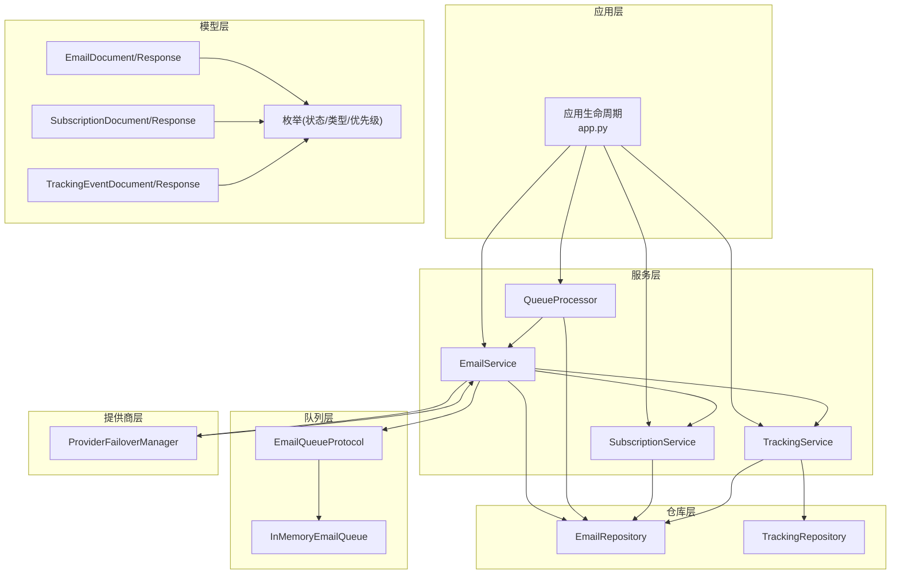
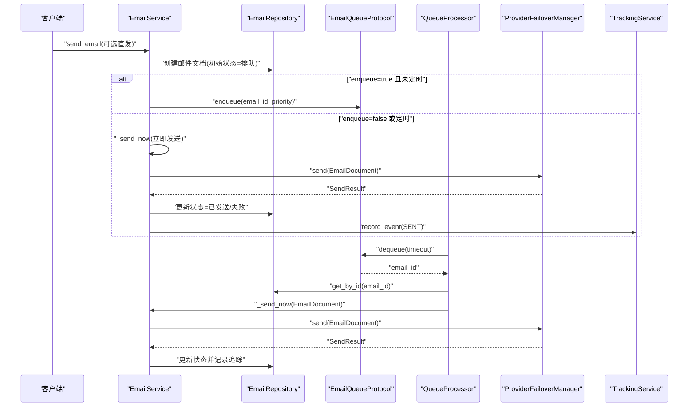
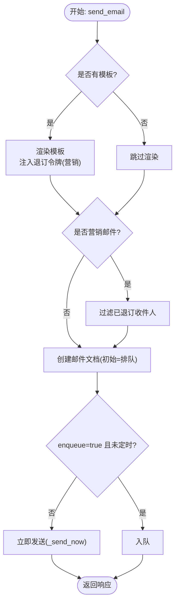
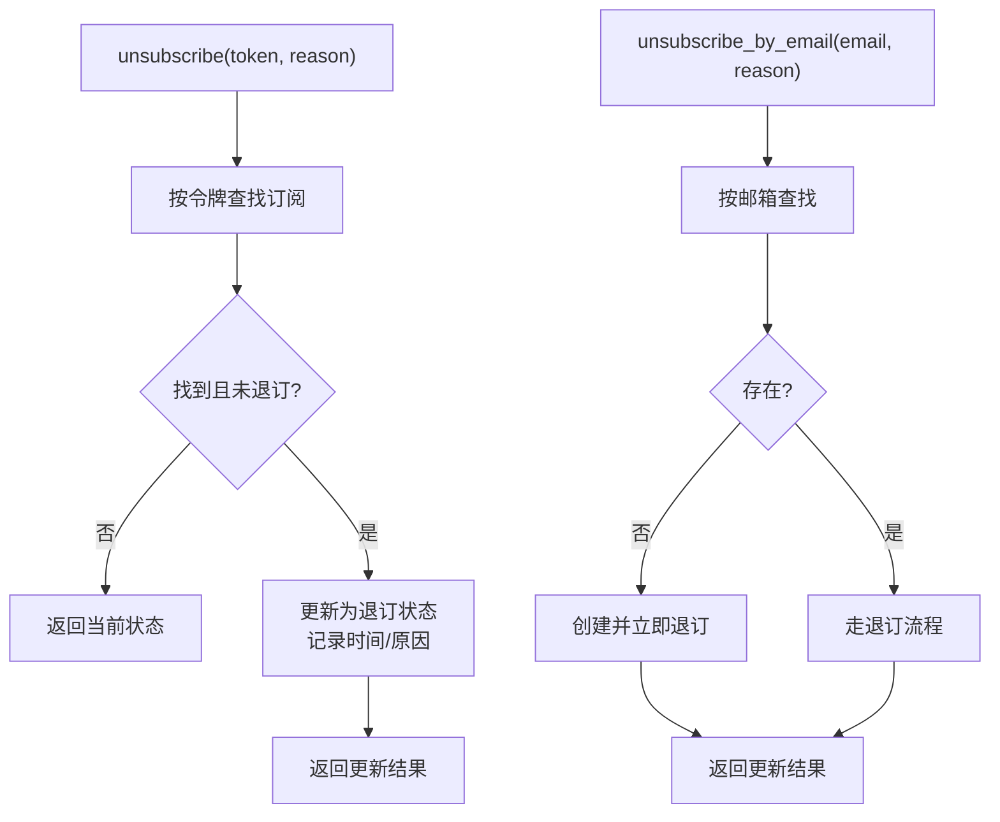
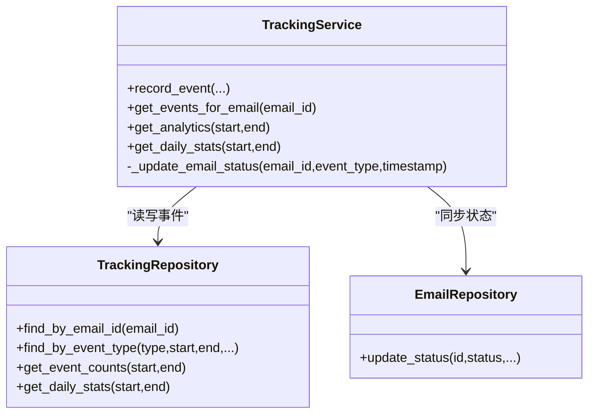
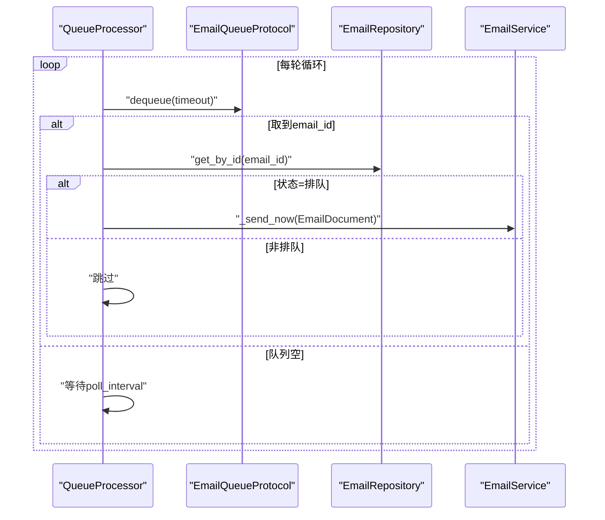
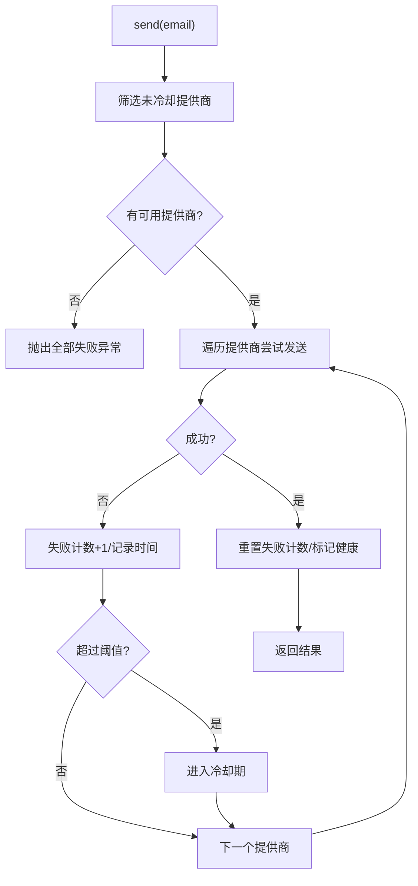
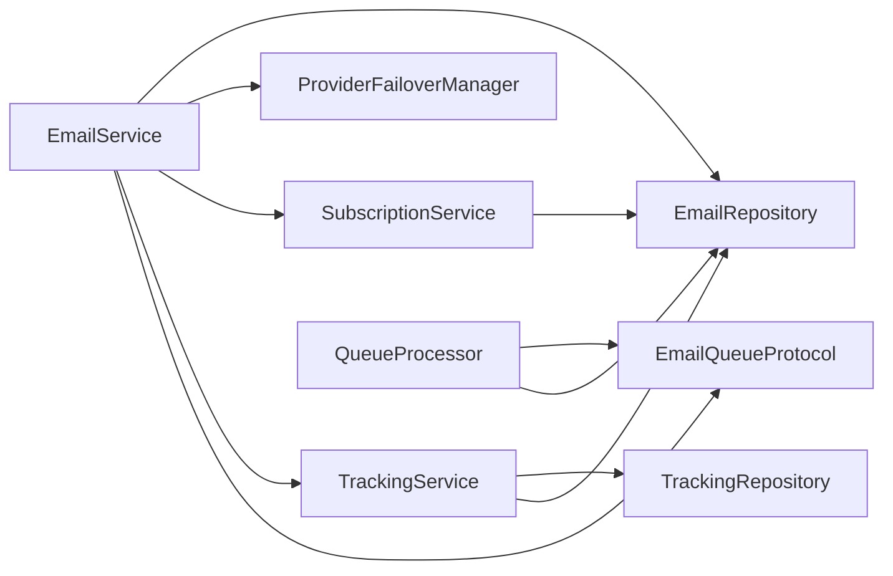
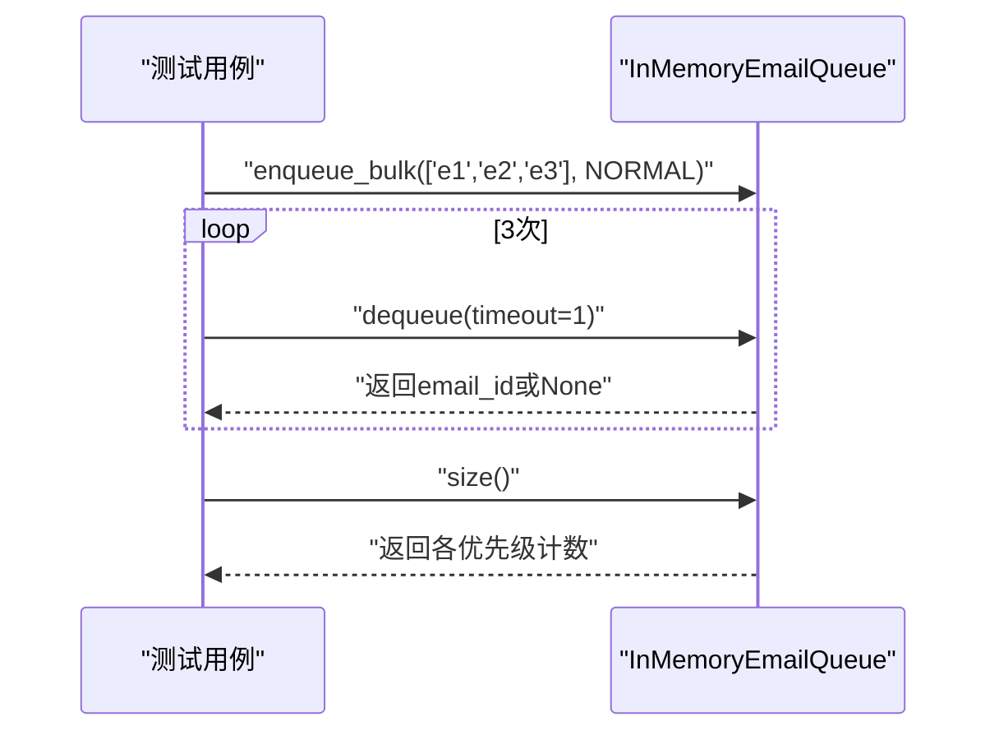

# 邮件服务层

<cite>
**本文引用的文件**
- [email_service.py](file://tools/flexloop/src/taolib/testing/email_service/services/email_service.py)
- [subscription_service.py](file://tools/flexloop/src/taolib/testing/email_service/services/subscription_service.py)
- [tracking_service.py](file://tools/flexloop/src/taolib/testing/email_service/services/tracking_service.py)
- [queue_processor.py](file://tools/flexloop/src/taolib/testing/email_service/services/queue_processor.py)
- [memory_queue.py](file://tools/flexloop/src/taolib/testing/email_service/queue/memory_queue.py)
- [protocol.py](file://tools/flexloop/src/taolib/testing/email_service/queue/protocol.py)
- [email.py](file://tools/flexloop/src/taolib/testing/email_service/models/email.py)
- [subscription.py](file://tools/flexloop/src/taolib/testing/email_service/models/subscription.py)
- [tracking.py](file://tools/flexloop/src/taolib/testing/email_service/models/tracking.py)
- [enums.py](file://tools/flexloop/src/taolib/testing/email_service/models/enums.py)
- [email_repo.py](file://tools/flexloop/src/taolib/testing/email_service/repository/email_repo.py)
- [tracking_repo.py](file://tools/flexloop/src/taolib/testing/email_service/repository/tracking_repo.py)
- [failover.py](file://tools/flexloop/src/taolib/testing/email_service/providers/failover.py)
- [app.py](file://tools/flexloop/src/taolib/testing/email_service/server/app.py)
- [test_queue.py](file://tools/flexloop/tests/testing/test_email_service/test_queue.py)
</cite>

## 目录
1. [简介](#简介)
2. [项目结构](#项目结构)
3. [核心组件](#核心组件)
4. [架构总览](#架构总览)
5. [详细组件分析](#详细组件分析)
6. [依赖关系分析](#依赖关系分析)
7. [性能考量](#性能考量)
8. [故障排查指南](#故障排查指南)
9. [结论](#结论)
10. [附录](#附录)

## 简介
本文件面向邮件服务层的技术文档，系统性阐述以下能力与实现细节：
- 异步发送与后台队列处理：包括队列协议、内存队列实现、后台处理器与指数退避策略。
- 批量处理：批量入队、批量发送与批量健康检查。
- 优先级队列管理：基于优先级的调度与出队顺序。
- 订阅服务：订阅管理、退订处理、退订令牌生成与状态跟踪。
- 退信处理机制：退信事件记录、分类与后续处理策略（如自动退订）。
- 追踪服务：打开率、点击率、送达确认等指标统计与分析。
- 服务配置示例：队列轮询间隔、批处理大小、重试策略与超时设置。
- 监控与诊断：健康检查、错误日志、统计聚合与 TTL 清理。

## 项目结构
邮件服务层位于工具包目录下，采用“分层+协议化”的组织方式：
- 服务层：EmailService、SubscriptionService、TrackingService、QueueProcessor
- 队列层：EmailQueueProtocol、InMemoryEmailQueue
- 模型层：Email、Subscription、Tracking、枚举
- 仓库层：EmailRepository、TrackingRepository
- 提供商层：ProviderFailoverManager（含健康检查与故障转移）
- 应用集成：FastAPI 应用生命周期中装配服务与启动队列处理器

图表来源
- [app.py:138-175](file://tools/flexloop/src/taolib/testing/email_service/server/app.py#L138-L175)
- [email_service.py:28-63](file://tools/flexloop/src/taolib/testing/email_service/services/email_service.py#L28-L63)
- [subscription_service.py:18-28](file://tools/flexloop/src/taolib/testing/email_service/services/subscription_service.py#L18-L28)
- [tracking_service.py:34-49](file://tools/flexloop/src/taolib/testing/email_service/services/tracking_service.py#L34-L49)
- [queue_processor.py:16-46](file://tools/flexloop/src/taolib/testing/email_service/services/queue_processor.py#L16-L46)
- [protocol.py:11-61](file://tools/flexloop/src/taolib/testing/email_service/queue/protocol.py#L11-L61)
- [memory_queue.py:17-62](file://tools/flexloop/src/taolib/testing/email_service/queue/memory_queue.py#L17-L62)
- [email_repo.py:14-116](file://tools/flexloop/src/taolib/testing/email_service/repository/email_repo.py#L14-L116)
- [tracking_repo.py:13-100](file://tools/flexloop/src/taolib/testing/email_service/repository/tracking_repo.py#L13-L100)
- [failover.py:32-58](file://tools/flexloop/src/taolib/testing/email_service/providers/failover.py#L32-L58)

章节来源
- [app.py:138-175](file://tools/flexloop/src/taolib/testing/email_service/server/app.py#L138-L175)

## 核心组件
- EmailService：编排模板渲染、订阅检查、创建邮件文档、入队或直发；负责发送成功/失败后的状态更新与追踪事件记录。
- SubscriptionService：订阅/退订/重新订阅、退订令牌生成与查询。
- TrackingService：追踪事件记录、邮件状态同步、统计分析与每日聚合。
- QueueProcessor：后台任务，周期性拉取队列、批量处理、调用发送回调。
- InMemoryEmailQueue：内存队列，按优先级存储邮件 ID，支持批量入队与超时出队。
- ProviderFailoverManager：多提供商故障转移，内置健康检查与冷却策略。
- 邮件/订阅/追踪模型：统一的数据结构与枚举类型。
- EmailRepository/TrackingRepository：MongoDB 数据访问与聚合统计。

章节来源
- [email_service.py:28-243](file://tools/flexloop/src/taolib/testing/email_service/services/email_service.py#L28-L243)
- [subscription_service.py:18-146](file://tools/flexloop/src/taolib/testing/email_service/services/subscription_service.py#L18-L146)
- [tracking_service.py:34-144](file://tools/flexloop/src/taolib/testing/email_service/services/tracking_service.py#L34-L144)
- [queue_processor.py:16-110](file://tools/flexloop/src/taolib/testing/email_service/services/queue_processor.py#L16-L110)
- [memory_queue.py:17-62](file://tools/flexloop/src/taolib/testing/email_service/queue/memory_queue.py#L17-L62)
- [failover.py:32-175](file://tools/flexloop/src/taolib/testing/email_service/providers/failover.py#L32-L175)
- [email.py:27-152](file://tools/flexloop/src/taolib/testing/email_service/models/email.py#L27-L152)
- [subscription.py:12-67](file://tools/flexloop/src/taolib/testing/email_service/models/subscription.py#L12-L67)
- [tracking.py:12-79](file://tools/flexloop/src/taolib/testing/email_service/models/tracking.py#L12-L79)
- [email_repo.py:14-116](file://tools/flexloop/src/taolib/testing/email_service/repository/email_repo.py#L14-L116)
- [tracking_repo.py:13-100](file://tools/flexloop/src/taolib/testing/email_service/repository/tracking_repo.py#L13-L100)

## 架构总览
邮件服务层采用“服务编排 + 协议抽象 + 后台处理 + 健康容错”的设计：
- 业务入口通过 EmailService 统一编排；模板渲染与订阅检查在入队前完成。
- 队列采用协议化设计，便于替换为生产队列实现（当前提供内存队列用于测试）。
- QueueProcessor 以异步任务持续拉取队列，批量处理并调用发送回调。
- ProviderFailoverManager 提供多提供商自动切换与健康检查。
- TrackingService 将追踪事件写入仓库并同步邮件状态，支持统计分析。

图表来源
- [email_service.py:64-213](file://tools/flexloop/src/taolib/testing/email_service/services/email_service.py#L64-L213)
- [queue_processor.py:66-108](file://tools/flexloop/src/taolib/testing/email_service/services/queue_processor.py#L66-L108)
- [failover.py:59-114](file://tools/flexloop/src/taolib/testing/email_service/providers/failover.py#L59-L114)
- [tracking_service.py:51-89](file://tools/flexloop/src/taolib/testing/email_service/services/tracking_service.py#L51-L89)

## 详细组件分析

### 邮件发送服务（EmailService）
职责与流程：
- 模板渲染：若提供模板 ID，则渲染 HTML/文本，并注入退订令牌（营销邮件）。
- 订阅检查：营销邮件需过滤已退订收件人。
- 创建文档：写入数据库，初始状态为排队。
- 入队或直发：enqueue=true 且非定时则入队；否则立即发送。
- 成功/失败处理：成功更新状态为已发送并记录追踪事件；失败则递增重试并在阈值内重新入队。

图表来源
- [email_service.py:64-147](file://tools/flexloop/src/taolib/testing/email_service/services/email_service.py#L64-L147)
- [email_service.py:157-213](file://tools/flexloop/src/taolib/testing/email_service/services/email_service.py#L157-L213)

章节来源
- [email_service.py:28-243](file://tools/flexloop/src/taolib/testing/email_service/services/email_service.py#L28-L243)

### 订阅服务（SubscriptionService）
功能点：
- 获取或创建订阅：无记录则创建激活状态并生成唯一退订令牌。
- 退订处理：按令牌查找并更新为退订状态，支持记录退订原因。
- 按邮箱退订：用于硬退信自动退订场景。
- 重新订阅：将退订状态恢复为激活。
- 订阅状态查询与退订令牌获取。

图表来源
- [subscription_service.py:56-104](file://tools/flexloop/src/taolib/testing/email_service/services/subscription_service.py#L56-L104)

章节来源
- [subscription_service.py:18-146](file://tools/flexloop/src/taolib/testing/email_service/services/subscription_service.py#L18-L146)
- [subscription.py:12-67](file://tools/flexloop/src/taolib/testing/email_service/models/subscription.py#L12-L67)

### 追踪服务（TrackingService）
能力：
- 记录追踪事件：支持打开、点击、送达、退信、投诉、退订等事件类型。
- 同步邮件状态：根据事件类型更新邮件状态与附加字段（如送达时间、打开时间）。
- 统计分析：提供总发送/投递/打开/点击/退信数量与比率。
- 日常聚合：按日期聚合事件统计。

图表来源
- [tracking_service.py:34-144](file://tools/flexloop/src/taolib/testing/email_service/services/tracking_service.py#L34-L144)
- [tracking_repo.py:13-100](file://tools/flexloop/src/taolib/testing/email_service/repository/tracking_repo.py#L13-L100)
- [email_repo.py:69-78](file://tools/flexloop/src/taolib/testing/email_service/repository/email_repo.py#L69-L78)

章节来源
- [tracking_service.py:19-144](file://tools/flexloop/src/taolib/testing/email_service/services/tracking_service.py#L19-L144)
- [tracking_repo.py:13-100](file://tools/flexloop/src/taolib/testing/email_service/repository/tracking_repo.py#L13-L100)
- [tracking.py:12-79](file://tools/flexloop/src/taolib/testing/email_service/models/tracking.py#L12-L79)

### 队列与后台处理器
- 队列协议：统一 enqueue/dequeue/bulk/sizes 接口。
- 内存队列：使用 asyncio.PriorityQueue，按优先级出队；支持批量入队与超时出队。
- 后台处理器：周期轮询队列，批量拉取并处理；对单封邮件进行状态校验后调用发送回调；支持计划邮件到期入队。

图表来源
- [queue_processor.py:66-108](file://tools/flexloop/src/taolib/testing/email_service/services/queue_processor.py#L66-L108)
- [protocol.py:11-61](file://tools/flexloop/src/taolib/testing/email_service/queue/protocol.py#L11-L61)
- [memory_queue.py:43-49](file://tools/flexloop/src/taolib/testing/email_service/queue/memory_queue.py#L43-L49)

章节来源
- [queue_processor.py:16-110](file://tools/flexloop/src/taolib/testing/email_service/services/queue_processor.py#L16-L110)
- [memory_queue.py:17-62](file://tools/flexloop/src/taolib/testing/email_service/queue/memory_queue.py#L17-L62)
- [protocol.py:11-61](file://tools/flexloop/src/taolib/testing/email_service/queue/protocol.py#L11-L61)

### 提供商故障转移（ProviderFailoverManager）
特性：
- 多提供商按优先级排序，依次尝试发送。
- 失败计数与冷却：连续失败超过阈值进入冷却期，冷却结束后尝试健康检查恢复。
- 健康检查：定期尝试恢复冷却中的提供商。
- 批量发送：逐封尝试，记录每封结果。

图表来源
- [failover.py:59-114](file://tools/flexloop/src/taolib/testing/email_service/providers/failover.py#L59-L114)
- [failover.py:139-173](file://tools/flexloop/src/taolib/testing/email_service/providers/failover.py#L139-L173)

章节来源
- [failover.py:32-175](file://tools/flexloop/src/taolib/testing/email_service/providers/failover.py#L32-L175)

### 应用集成与生命周期
- 在应用启动阶段装配 EmailService、SubscriptionService、TrackingService、BounceHandler，并创建 ProviderFailoverManager。
- 初始化队列处理器，传入队列、仓库与发送回调，设置轮询间隔与批处理大小。
- 启动/停止队列处理器，确保优雅关闭。

章节来源
- [app.py:138-175](file://tools/flexloop/src/taolib/testing/email_service/server/app.py#L138-L175)

## 依赖关系分析
- EmailService 依赖：EmailRepository、TemplateService、SubscriptionService、ProviderFailoverManager、EmailQueueProtocol、TrackingService。
- QueueProcessor 依赖：EmailQueueProtocol、EmailRepository、发送回调。
- TrackingService 依赖：TrackingRepository、EmailRepository。
- ProviderFailoverManager 依赖：EmailProviderProtocol（外部实现）。
- 队列层：EmailQueueProtocol 抽象 + InMemoryEmailQueue 实现。

图表来源
- [email_service.py:38-62](file://tools/flexloop/src/taolib/testing/email_service/services/email_service.py#L38-L62)
- [queue_processor.py:23-46](file://tools/flexloop/src/taolib/testing/email_service/services/queue_processor.py#L23-L46)
- [tracking_service.py:37-49](file://tools/flexloop/src/taolib/testing/email_service/services/tracking_service.py#L37-L49)
- [subscription_service.py:21-27](file://tools/flexloop/src/taolib/testing/email_service/services/subscription_service.py#L21-L27)

## 性能考量
- 队列批处理：通过批处理大小控制每次处理的邮件数量，平衡吞吐与延迟。
- 轮询间隔：合理设置轮询间隔，避免频繁空转或漏取。
- 优先级队列：高优邮件优先出队，保障关键业务及时送达。
- 指数退避：失败重试由队列处理器与提供商层共同配合，避免雪崩。
- 索引优化：邮件与追踪仓库建立常用查询索引，提升查询与聚合性能。
- TTL 清理：追踪事件集合设置 TTL，自动清理历史数据，降低存储压力。

## 故障排查指南
- 发送失败与重试
  - EmailService 在发送失败时递增重试计数并重新入队；超过最大重试后标记失败。
  - 检查 ProviderFailoverManager 的健康状态与冷却情况。
- 队列处理异常
  - QueueProcessor 循环中捕获异常并记录日志；检查队列是否为空、邮件状态是否正确。
  - 确认队列实现满足协议要求，特别是超时与批量接口。
- 订阅状态异常
  - 退订令牌无效或重复退订：检查 SubscriptionService 的令牌查找与状态更新逻辑。
- 追踪事件缺失
  - 确认 TrackingService 已记录事件并同步邮件状态；检查仓库索引与聚合管道。
- 应用启动问题
  - 确保在应用生命周期中正确装配服务与启动队列处理器；关注启动/关闭钩子。

章节来源
- [email_service.py:193-212](file://tools/flexloop/src/taolib/testing/email_service/services/email_service.py#L193-L212)
- [queue_processor.py:66-108](file://tools/flexloop/src/taolib/testing/email_service/services/queue_processor.py#L66-L108)
- [subscription_service.py:56-90](file://tools/flexloop/src/taolib/testing/email_service/services/subscription_service.py#L56-L90)
- [tracking_service.py:51-89](file://tools/flexloop/src/taolib/testing/email_service/services/tracking_service.py#L51-L89)
- [failover.py:139-173](file://tools/flexloop/src/taolib/testing/email_service/providers/failover.py#L139-L173)

## 结论
该邮件服务层通过协议化设计与清晰的服务边界，实现了从模板渲染、订阅检查、队列入队、后台发送、追踪统计到故障转移的完整闭环。其优先级队列与后台处理器保证了异步与批量处理能力，而订阅与追踪模块则提供了完善的用户行为与质量度量。结合合理的配置与监控，可在生产环境中稳定支撑高并发的邮件发送需求。

## 附录

### 服务配置示例（参数说明）
- 队列轮询间隔（秒）
  - 作用：QueueProcessor 每轮等待时间，控制 CPU 占用与延迟。
  - 设置位置：应用生命周期中传入队列处理器构造参数。
  - 参考路径：[app.py:160-166](file://tools/flexloop/src/taolib/testing/email_service/server/app.py#L160-L166)
- 批处理大小
  - 作用：每轮从队列取出并处理的邮件数量上限。
  - 设置位置：同上。
  - 参考路径：[app.py:160-166](file://tools/flexloop/src/taolib/testing/email_service/server/app.py#L160-L166)
- 重试策略与最大重试
  - 作用：发送失败时递增重试计数，超过阈值标记失败。
  - 设置位置：邮件文档模型中的最大重试字段。
  - 参考路径：[email.py:109](file://tools/flexloop/src/taolib/testing/email_service/models/email.py#L109)
- 超时设置
  - 出队超时：队列出队的等待超时，避免长时间阻塞。
  - 参考路径：[memory_queue.py:43-49](file://tools/flexloop/src/taolib/testing/email_service/queue/memory_queue.py#L43-L49)
- 健康检查与冷却
  - 作用：提供商失败后进入冷却，冷却结束后尝试恢复。
  - 设置位置：ProviderFailoverManager 构造参数（失败阈值、冷却秒数）。
  - 参考路径：[failover.py:39-57](file://tools/flexloop/src/taolib/testing/email_service/providers/failover.py#L39-L57)

### 关键流程图（代码级）

#### 队列批量测试流程

图表来源
- [test_queue.py:39-56](file://tools/flexloop/tests/testing/test_email_service/test_queue.py#L39-L56)
- [memory_queue.py:36-59](file://tools/flexloop/src/taolib/testing/email_service/queue/memory_queue.py#L36-L59)