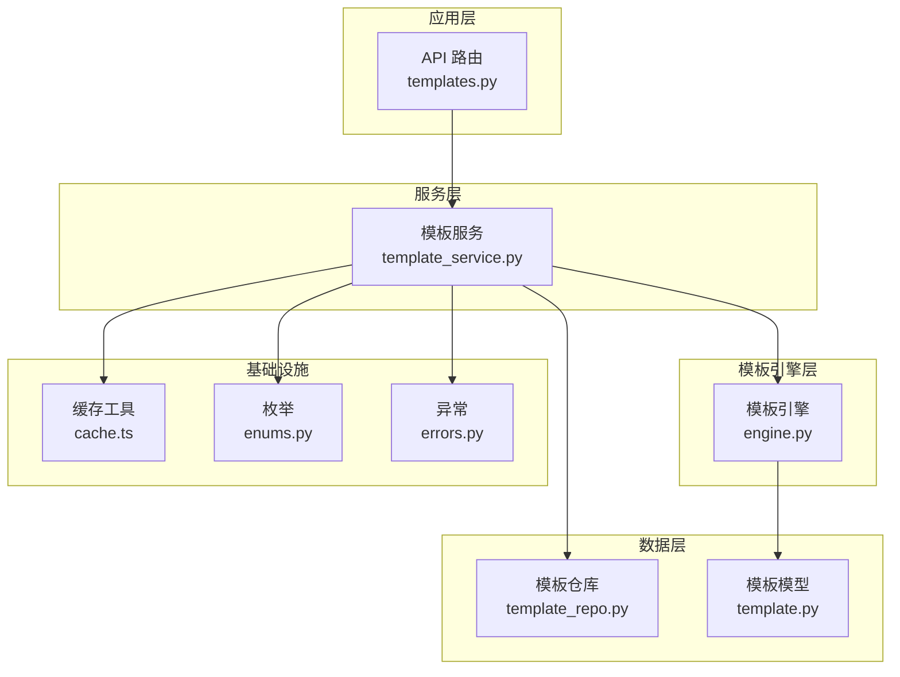
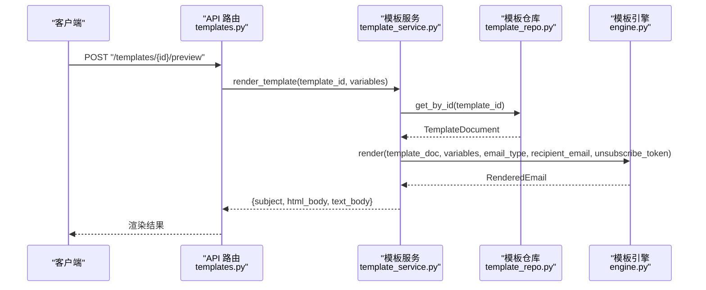
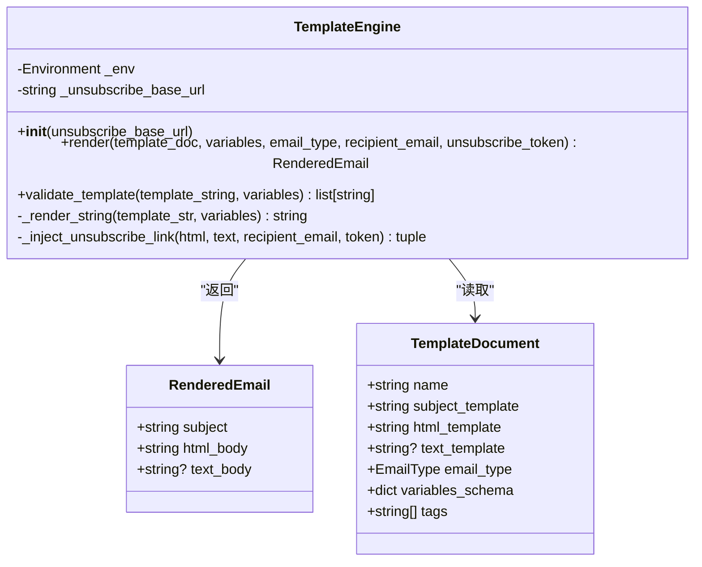
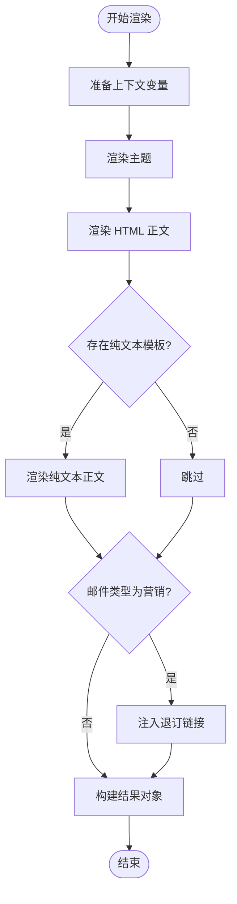
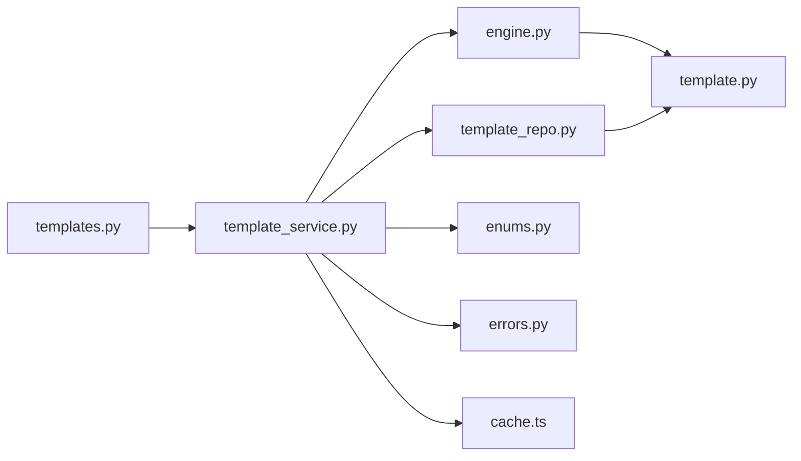

# 邮件模板引擎

<cite>
**本文引用的文件**
- [engine.py](file://tools/flexloop/src/taolib/testing/email_service/template/engine.py)
- [template.py](file://tools/flexloop/src/taolib/testing/email_service/models/template.py)
- [template_repo.py](file://tools/flexloop/src/taolib/testing/email_service/repository/template_repo.py)
- [template_service.py](file://tools/flexloop/src/taolib/testing/email_service/services/template_service.py)
- [enums.py](file://tools/flexloop/src/taolib/testing/email_service/models/enums.py)
- [errors.py](file://tools/flexloop/src/taolib/testing/email_service/errors.py)
- [templates.py](file://tools/flexloop/src/taolib/testing/email_service/server/api/templates.py)
- [email.py](file://tools/flexloop/src/taolib/testing/email_service/models/email.py)
- [subscription.py](file://tools/flexloop/src/taolib/testing/email_service/models/subscription.py)
- [mailgun.py](file://tools/flexloop/src/taolib/testing/email_service/providers/mailgun.py)
- [sendgrid.py](file://tools/flexloop/src/taolib/testing/email_service/providers/sendgrid.py)
- [cache.ts](file://src/services/cache.ts)
- [cache.ts](file://apps/AgentPit/src/services/cache.ts)
- [test_template_engine.py](file://tools/flexloop/tests/testing/test_email_service/test_template_engine.py)
</cite>

## 目录
1. [简介](#简介)
2. [项目结构](#项目结构)
3. [核心组件](#核心组件)
4. [架构总览](#架构总览)
5. [详细组件分析](#详细组件分析)
6. [依赖关系分析](#依赖关系分析)
7. [性能考量](#性能考量)
8. [故障排查指南](#故障排查指南)
9. [结论](#结论)
10. [附录](#附录)

## 简介
本技术文档围绕邮件模板引擎展开，系统性阐述基于 Jinja2 的沙箱模板渲染实现、模板加载与缓存策略、变量绑定与安全过滤、模板继承与宏定义能力、以及模板开发实践与调试优化方法。该引擎在保证安全性的前提下，提供条件判断、循环迭代等常用模板语法支持，并针对营销邮件自动注入退订链接，满足合规要求。

## 项目结构
邮件模板引擎位于工具链子项目中，采用分层架构：模型层（Pydantic）、仓库层（MongoDB 访问）、服务层（业务编排）、模板引擎层（Jinja2 渲染）、API 层（FastAPI 路由）、提供商层（邮件发送），并辅以通用缓存工具。

图表来源
- [templates.py:1-86](file://tools/flexloop/src/taolib/testing/email_service/server/api/templates.py#L1-L86)
- [template_service.py:1-139](file://tools/flexloop/src/taolib/testing/email_service/services/template_service.py#L1-L139)
- [engine.py:1-121](file://tools/flexloop/src/taolib/testing/email_service/template/engine.py#L1-L121)
- [template_repo.py:1-55](file://tools/flexloop/src/taolib/testing/email_service/repository/template_repo.py#L1-L55)
- [template.py:1-93](file://tools/flexloop/src/taolib/testing/email_service/models/template.py#L1-L93)
- [cache.ts:1-49](file://src/services/cache.ts#L1-L49)
- [enums.py:1-71](file://tools/flexloop/src/taolib/testing/email_service/models/enums.py#L1-L71)
- [errors.py:1-65](file://tools/flexloop/src/taolib/testing/email_service/errors.py#L1-L65)

章节来源
- [templates.py:1-86](file://tools/flexloop/src/taolib/testing/email_service/server/api/templates.py#L1-L86)
- [template_service.py:1-139](file://tools/flexloop/src/taolib/testing/email_service/services/template_service.py#L1-L139)
- [engine.py:1-121](file://tools/flexloop/src/taolib/testing/email_service/template/engine.py#L1-L121)
- [template_repo.py:1-55](file://tools/flexloop/src/taolib/testing/email_service/repository/template_repo.py#L1-L55)
- [template.py:1-93](file://tools/flexloop/src/taolib/testing/email_service/models/template.py#L1-L93)
- [cache.ts:1-49](file://src/services/cache.ts#L1-L49)
- [enums.py:1-71](file://tools/flexloop/src/taolib/testing/email_service/models/enums.py#L1-L71)
- [errors.py:1-65](file://tools/flexloop/src/taolib/testing/email_service/errors.py#L1-L65)

## 核心组件
- 模板引擎 TemplateEngine：基于 SandboxedEnvironment 提供安全渲染，支持变量替换、条件判断、循环；对缺失变量严格报错；支持营销邮件自动注入退订链接。
- 模型 TemplateDocument：描述模板文档结构，包含主题、HTML 正文、可选纯文本正文、邮件类型、变量类型映射、标签等。
- 仓库 TemplateRepository：封装 MongoDB 访问，提供按名称、激活状态、邮件类型查询及索引管理。
- 服务 TemplateService：协调仓库与引擎，完成模板的创建、更新、查询、渲染与版本控制。
- API 模块 templates.py：提供模板的创建、查询、更新、删除与预览接口。
- 引擎异常与枚举：统一的异常体系与邮件类型、优先级、提供商等枚举。
- 缓存工具：通用内存缓存管理器，支持 TTL、模式清理等。

章节来源
- [engine.py:46-121](file://tools/flexloop/src/taolib/testing/email_service/template/engine.py#L46-L121)
- [template.py:62-93](file://tools/flexloop/src/taolib/testing/email_service/models/template.py#L62-L93)
- [template_repo.py:11-55](file://tools/flexloop/src/taolib/testing/email_service/repository/template_repo.py#L11-L55)
- [template_service.py:20-139](file://tools/flexloop/src/taolib/testing/email_service/services/template_service.py#L20-L139)
- [templates.py:1-86](file://tools/flexloop/src/taolib/testing/email_service/server/api/templates.py#L1-L86)
- [enums.py:20-42](file://tools/flexloop/src/taolib/testing/email_service/models/enums.py#L20-L42)
- [errors.py:19-28](file://tools/flexloop/src/taolib/testing/email_service/errors.py#L19-L28)
- [cache.ts:1-49](file://src/services/cache.ts#L1-L49)

## 架构总览
模板引擎的调用链从 API 路由进入，经服务层协调仓库与引擎，最终返回渲染结果。营销邮件场景下，引擎会在 HTML 与文本正文中注入退订链接。

图表来源
- [templates.py:62-84](file://tools/flexloop/src/taolib/testing/email_service/server/api/templates.py#L62-L84)
- [template_service.py:103-136](file://tools/flexloop/src/taolib/testing/email_service/services/template_service.py#L103-L136)
- [template_repo.py:14-24](file://tools/flexloop/src/taolib/testing/email_service/repository/template_repo.py#L14-L24)
- [engine.py:65-111](file://tools/flexloop/src/taolib/testing/email_service/template/engine.py#L65-L111)

章节来源
- [templates.py:62-84](file://tools/flexloop/src/taolib/testing/email_service/server/api/templates.py#L62-L84)
- [template_service.py:103-136](file://tools/flexloop/src/taolib/testing/email_service/services/template_service.py#L103-L136)
- [engine.py:65-111](file://tools/flexloop/src/taolib/testing/email_service/template/engine.py#L65-L111)

## 详细组件分析

### 模板引擎类图

图表来源
- [engine.py:46-121](file://tools/flexloop/src/taolib/testing/email_service/template/engine.py#L46-L121)
- [template.py:62-93](file://tools/flexloop/src/taolib/testing/email_service/models/template.py#L62-L93)

章节来源
- [engine.py:46-121](file://tools/flexloop/src/taolib/testing/email_service/template/engine.py#L46-L121)
- [template.py:62-93](file://tools/flexloop/src/taolib/testing/email_service/models/template.py#L62-L93)

### 模板渲染流程（含退订注入）

图表来源
- [engine.py:65-111](file://tools/flexloop/src/taolib/testing/email_service/template/engine.py#L65-L111)

章节来源
- [engine.py:65-111](file://tools/flexloop/src/taolib/testing/email_service/template/engine.py#L65-L111)

### 模板加载与缓存策略
- 模板加载：服务层通过仓库按 ID 或名称查询模板文档，仓库基于 MongoDB 进行检索并建立索引以提升查询效率。
- 内存缓存：提供通用缓存工具，支持 TTL、按模式清理等能力，可用于缓存模板元数据或渲染结果，降低重复查询与渲染开销。
- 热更新机制：模板更新时递增版本号，结合缓存失效策略与定时刷新，确保新版本尽快生效。

章节来源
- [template_repo.py:18-52](file://tools/flexloop/src/taolib/testing/email_service/repository/template_repo.py#L18-L52)
- [template_service.py:50-66](file://tools/flexloop/src/taolib/testing/email_service/services/template_service.py#L50-L66)
- [cache.ts:1-49](file://src/services/cache.ts#L1-L49)

### 模板变量绑定与安全过滤
- 上下文数据准备：服务层将请求变量传入引擎，引擎使用 SandboxedEnvironment 渲染，避免执行任意代码。
- 变量验证：引擎对缺失变量抛出异常；同时提供模板语法验证方法，提前发现语法错误。
- 安全过滤：StrictUndefined 确保未定义变量立即报错；autoescape 开启自动转义；沙箱环境限制危险操作。

章节来源
- [engine.py:53-63](file://tools/flexloop/src/taolib/testing/email_service/template/engine.py#L53-L63)
- [engine.py:112-121](file://tools/flexloop/src/taolib/testing/email_service/template/engine.py#L112-L121)
- [test_template_engine.py:48-57](file://tools/flexloop/tests/testing/test_email_service/test_template_engine.py#L48-L57)

### 模板继承与宏定义
- 继承与宏：当前实现聚焦于变量替换、条件判断与循环，未见显式的模板继承与宏定义语法支持。如需扩展，可在现有引擎基础上引入 Jinja2 的 include/import 与 macro 语法，并配套安全白名单校验。

章节来源
- [engine.py:9-15](file://tools/flexloop/src/taolib/testing/email_service/template/engine.py#L9-L15)
- [template.py:10-28](file://tools/flexloop/src/taolib/testing/email_service/models/template.py#L10-L28)

### 模板开发示例与最佳实践
- 创建响应式邮件模板：建议使用内联样式与媒体查询，确保在主流邮件客户端兼容。
- 嵌入图片与链接：使用绝对 URL；对图片进行 Base64 内联或外部托管，注意隐私与性能平衡。
- 预览与调试：通过 API 的预览端点快速验证渲染结果；利用模板验证方法提前发现语法问题。
- 营销邮件合规：确保每封营销邮件包含退订链接，引擎已内置注入逻辑。

章节来源
- [templates.py:62-84](file://tools/flexloop/src/taolib/testing/email_service/server/api/templates.py#L62-L84)
- [engine.py:95-100](file://tools/flexloop/src/taolib/testing/email_service/template/engine.py#L95-L100)

### 邮件发送与跟踪
- 发送提供商：支持 Mailgun 与 SendGrid，提供健康检查与批量发送能力。
- 邮件模型：EmailDocument 包含收件人、附件、调度时间、元数据等字段，便于完整邮件生命周期管理。
- 订阅与退订：SubscriptionDocument 记录退订状态与令牌，配合模板引擎的退订注入形成闭环。

章节来源
- [mailgun.py:15-123](file://tools/flexloop/src/taolib/testing/email_service/providers/mailgun.py#L15-L123)
- [sendgrid.py:15-144](file://tools/flexloop/src/taolib/testing/email_service/providers/sendgrid.py#L15-L144)
- [email.py:97-152](file://tools/flexloop/src/taolib/testing/email_service/models/email.py#L97-L152)
- [subscription.py:12-67](file://tools/flexloop/src/taolib/testing/email_service/models/subscription.py#L12-L67)

## 依赖关系分析

图表来源
- [templates.py:1-86](file://tools/flexloop/src/taolib/testing/email_service/server/api/templates.py#L1-L86)
- [template_service.py:1-139](file://tools/flexloop/src/taolib/testing/email_service/services/template_service.py#L1-L139)
- [template_repo.py:1-55](file://tools/flexloop/src/taolib/testing/email_service/repository/template_repo.py#L1-L55)
- [engine.py:1-121](file://tools/flexloop/src/taolib/testing/email_service/template/engine.py#L1-L121)
- [template.py:1-93](file://tools/flexloop/src/taolib/testing/email_service/models/template.py#L1-L93)
- [enums.py:1-71](file://tools/flexloop/src/taolib/testing/email_service/models/enums.py#L1-L71)
- [errors.py:1-65](file://tools/flexloop/src/taolib/testing/email_service/errors.py#L1-L65)
- [cache.ts:1-49](file://src/services/cache.ts#L1-L49)

章节来源
- [templates.py:1-86](file://tools/flexloop/src/taolib/testing/email_service/server/api/templates.py#L1-L86)
- [template_service.py:1-139](file://tools/flexloop/src/taolib/testing/email_service/services/template_service.py#L1-L139)
- [engine.py:1-121](file://tools/flexloop/src/taolib/testing/email_service/template/engine.py#L1-L121)
- [template_repo.py:1-55](file://tools/flexloop/src/taolib/testing/email_service/repository/template_repo.py#L1-L55)
- [template.py:1-93](file://tools/flexloop/src/taolib/testing/email_service/models/template.py#L1-L93)
- [enums.py:1-71](file://tools/flexloop/src/taolib/testing/email_service/models/enums.py#L1-L71)
- [errors.py:1-65](file://tools/flexloop/src/taolib/testing/email_service/errors.py#L1-L65)
- [cache.ts:1-49](file://src/services/cache.ts#L1-L49)

## 性能考量
- 渲染性能：Jinja2 沙箱环境与 StrictUndefined 有助于早期发现问题，避免运行时错误导致的重试成本。
- 缓存策略：利用通用缓存工具对模板元数据与渲染结果进行短期缓存，结合 TTL 与模式清理，降低数据库压力。
- 查询优化：仓库层已建立多字段索引，建议在高并发场景下评估复合索引与读写分离策略。
- 发送性能：提供商层支持异步 HTTP 客户端，建议结合批量发送与健康检查，提升整体吞吐。

## 故障排查指南
- 模板渲染失败：检查模板语法与变量是否匹配；使用模板验证方法定位问题；关注缺失变量导致的异常。
- 模板未找到：确认模板 ID 或名称正确；检查仓库查询逻辑与索引是否存在。
- 营销邮件无退订链接：核对邮件类型与退订令牌参数；确保引擎注入逻辑被触发。
- 发送失败：查看提供商健康检查与错误日志；根据状态码与错误信息定位问题。

章节来源
- [errors.py:19-28](file://tools/flexloop/src/taolib/testing/email_service/errors.py#L19-L28)
- [template_service.py:126-129](file://tools/flexloop/src/taolib/testing/email_service/services/template_service.py#L126-L129)
- [engine.py:95-111](file://tools/flexloop/src/taolib/testing/email_service/template/engine.py#L95-L111)
- [mailgun.py:41-71](file://tools/flexloop/src/taolib/testing/email_service/providers/mailgun.py#L41-L71)
- [sendgrid.py:51-81](file://tools/flexloop/src/taolib/testing/email_service/providers/sendgrid.py#L51-L81)

## 结论
该邮件模板引擎以安全为核心，结合 Jinja2 的强大语法与严格的沙箱环境，提供了可靠的模板渲染能力。通过服务层的统一编排、仓库层的高效查询与通用缓存工具，能够支撑高并发场景下的模板管理与渲染需求。营销邮件的退订注入进一步增强了合规性。未来可在继承与宏定义方面做进一步扩展，以满足更复杂的模板复用场景。

## 附录
- 模板开发清单
  - 明确变量类型与默认值，完善 variables_schema。
  - 使用条件与循环组织复杂结构，保持模板简洁。
  - 在营销邮件中确保退订链接可用且可追踪。
  - 通过预览端点与验证方法进行充分测试。
- 安全建议
  - 严格限制模板可执行能力，避免任意代码注入。
  - 对用户输入进行最小化白名单过滤。
  - 定期审计模板与变量，防止敏感信息泄露。