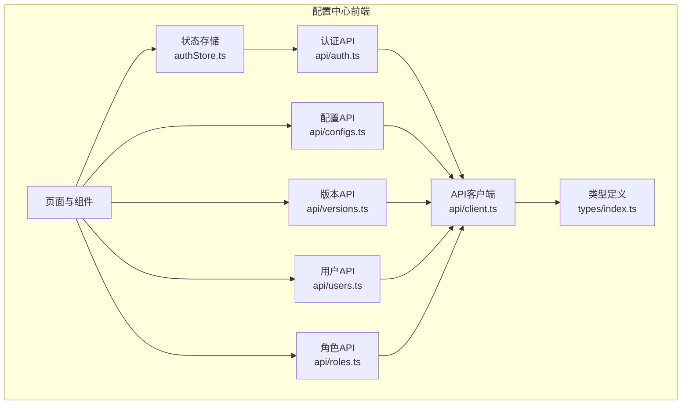
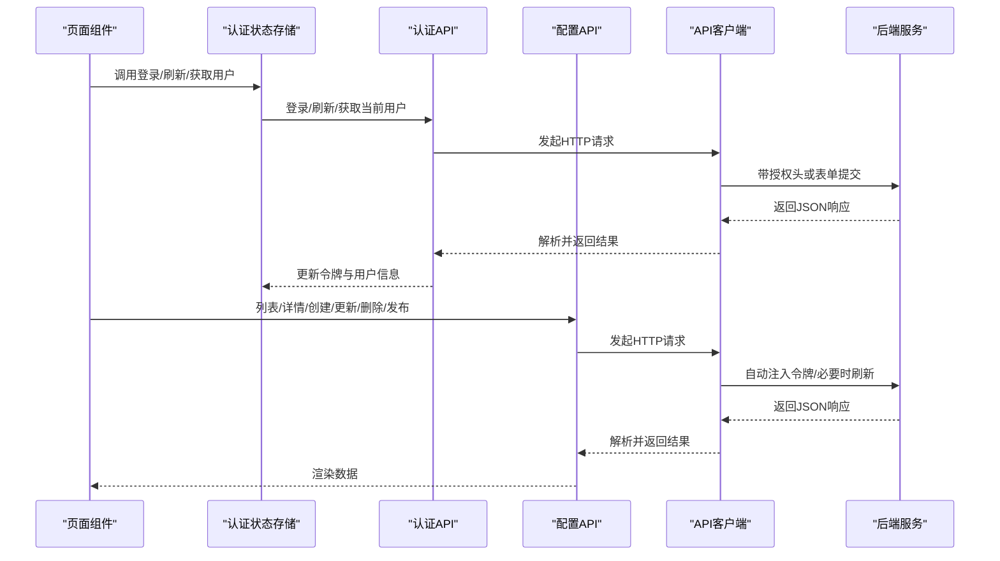
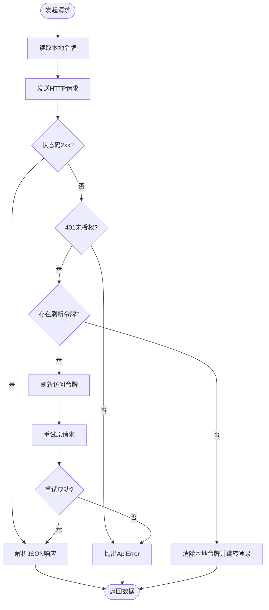
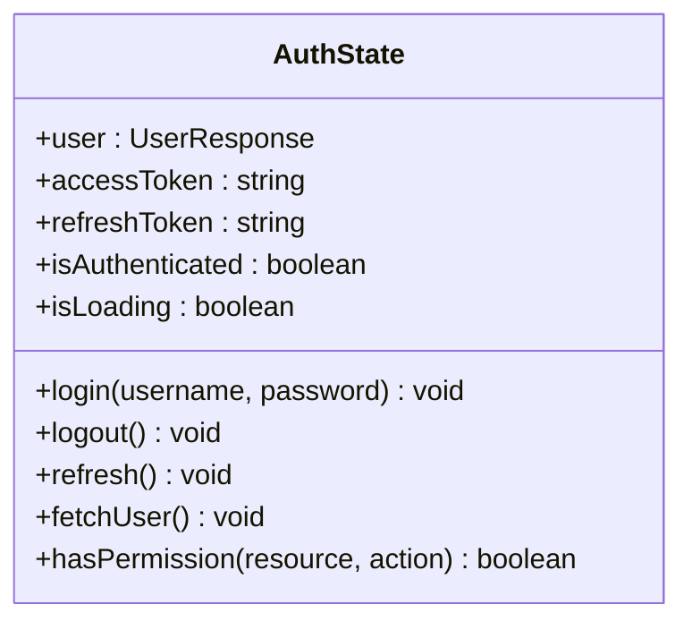
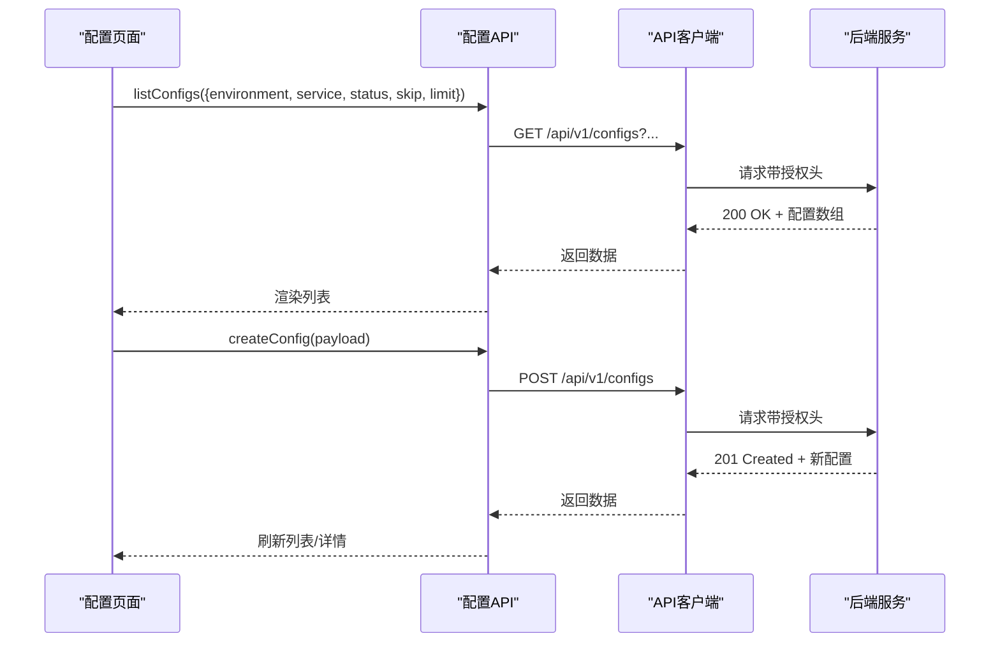
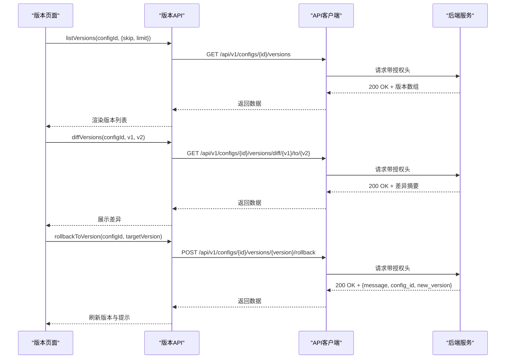
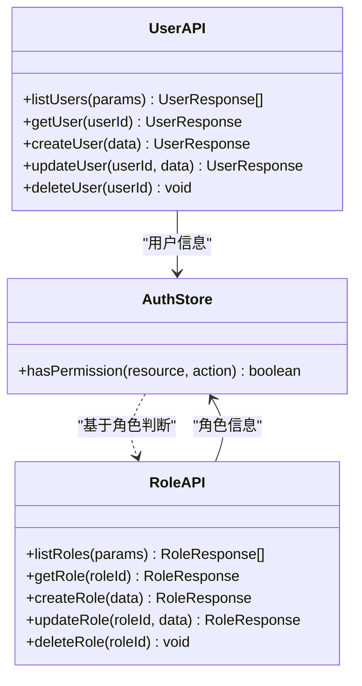
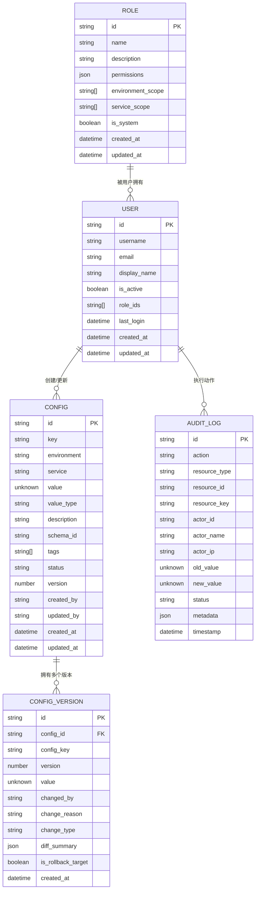
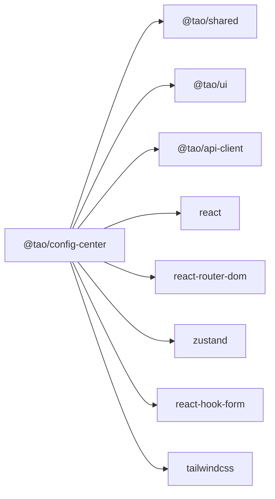

# 仓库模式实现

<cite>
**本文引用的文件**
- [apps/config-center/src/api/client.ts](file://apps/config-center/src/api/client.ts)
- [apps/config-center/src/store/authStore.ts](file://apps/config-center/src/store/authStore.ts)
- [apps/config-center/src/types/index.ts](file://apps/config-center/src/types/index.ts)
- [apps/config-center/src/api/auth.ts](file://apps/config-center/src/api/auth.ts)
- [apps/config-center/src/api/configs.ts](file://apps/config-center/src/api/configs.ts)
- [apps/config-center/src/api/versions.ts](file://apps/config-center/src/api/versions.ts)
- [apps/config-center/src/api/users.ts](file://apps/config-center/src/api/users.ts)
- [apps/config-center/src/api/roles.ts](file://apps/config-center/src/api/roles.ts)
- [apps/config-center/package.json](file://apps/config-center/package.json)
</cite>

## 目录
1. [引言](#引言)
2. [项目结构](#项目结构)
3. [核心组件](#核心组件)
4. [架构总览](#架构总览)
5. [详细组件分析](#详细组件分析)
6. [依赖分析](#依赖分析)
7. [性能考虑](#性能考虑)
8. [故障排查指南](#故障排查指南)
9. [结论](#结论)
10. [附录](#附录)

## 引言
本文件面向“配置中心”的仓库模式实现，系统性阐述仓库层在配置数据管理中的职责与边界：基础仓库抽象、具体仓库实现、数据模型设计、CRUD与查询优化、版本历史与回滚、用户与权限管理、以及与后端API的交互模式。文档同时给出数据一致性、并发控制与性能优化策略建议，并通过图示帮助读者快速理解各模块之间的关系。

## 项目结构
配置中心前端采用 React + TypeScript 构建，仓库模式以“API 客户端 + 类型定义 + 状态存储”三者协作的方式落地：
- API 客户端封装统一的请求、鉴权与重试逻辑
- 类型定义集中描述配置、版本、审计、用户与角色等数据模型
- 状态存储负责认证态与UI状态的持久化与派发
- 各业务域（配置、版本、用户、角色）通过独立的API模块暴露方法

图表来源
- [apps/config-center/src/api/client.ts:1-172](file://apps/config-center/src/api/client.ts#L1-L172)
- [apps/config-center/src/store/authStore.ts:1-108](file://apps/config-center/src/store/authStore.ts#L1-L108)
- [apps/config-center/src/types/index.ts:1-163](file://apps/config-center/src/types/index.ts#L1-L163)
- [apps/config-center/src/api/auth.ts:1-15](file://apps/config-center/src/api/auth.ts#L1-L15)
- [apps/config-center/src/api/configs.ts:1-33](file://apps/config-center/src/api/configs.ts#L1-L33)
- [apps/config-center/src/api/versions.ts:1-29](file://apps/config-center/src/api/versions.ts#L1-L29)
- [apps/config-center/src/api/users.ts:1-26](file://apps/config-center/src/api/users.ts#L1-L26)
- [apps/config-center/src/api/roles.ts:1-26](file://apps/config-center/src/api/roles.ts#L1-L26)

章节来源
- [apps/config-center/package.json:1-41](file://apps/config-center/package.json#L1-L41)

## 核心组件
- API 客户端：统一处理鉴权头注入、刷新令牌、错误包装与重试；支持 GET/POST/PUT/DELETE/Form 提交
- 认证仓库：登录、刷新令牌、获取当前用户信息；配合状态存储维护令牌与用户态
- 配置仓库：配置项的分页列表、详情、创建、更新、删除、发布
- 版本仓库：版本列表、指定版本详情、版本差异、回滚到指定版本
- 用户仓库：用户列表、详情、创建、更新、删除
- 角色仓库：角色列表、详情、创建、更新、删除
- 数据模型：环境、值类型、状态、变更类型、审计动作、审计状态等枚举与实体接口

章节来源
- [apps/config-center/src/api/client.ts:1-172](file://apps/config-center/src/api/client.ts#L1-L172)
- [apps/config-center/src/store/authStore.ts:1-108](file://apps/config-center/src/store/authStore.ts#L1-L108)
- [apps/config-center/src/types/index.ts:1-163](file://apps/config-center/src/types/index.ts#L1-L163)
- [apps/config-center/src/api/auth.ts:1-15](file://apps/config-center/src/api/auth.ts#L1-L15)
- [apps/config-center/src/api/configs.ts:1-33](file://apps/config-center/src/api/configs.ts#L1-L33)
- [apps/config-center/src/api/versions.ts:1-29](file://apps/config-center/src/api/versions.ts#L1-L29)
- [apps/config-center/src/api/users.ts:1-26](file://apps/config-center/src/api/users.ts#L1-L26)
- [apps/config-center/src/api/roles.ts:1-26](file://apps/config-center/src/api/roles.ts#L1-L26)

## 架构总览
下图展示了从页面到API再到客户端的调用链路，以及认证态如何贯穿整个流程。

图表来源
- [apps/config-center/src/store/authStore.ts:1-108](file://apps/config-center/src/store/authStore.ts#L1-L108)
- [apps/config-center/src/api/auth.ts:1-15](file://apps/config-center/src/api/auth.ts#L1-L15)
- [apps/config-center/src/api/configs.ts:1-33](file://apps/config-center/src/api/configs.ts#L1-L33)
- [apps/config-center/src/api/client.ts:1-172](file://apps/config-center/src/api/client.ts#L1-L172)

## 详细组件分析

### API 客户端与认证流程
- 统一鉴权：从本地存储读取访问令牌与刷新令牌，自动注入 Authorization 头
- 令牌刷新：当收到 401 且存在刷新令牌时，异步刷新访问令牌并重试原请求
- 错误处理：捕获非 2xx 响应，构造带状态码与细节的错误对象
- 表单提交：提供 postForm 方法用于用户名密码登录场景
- 本地存储：刷新成功后同步更新本地存储中的令牌

图表来源
- [apps/config-center/src/api/client.ts:1-172](file://apps/config-center/src/api/client.ts#L1-L172)

章节来源
- [apps/config-center/src/api/client.ts:1-172](file://apps/config-center/src/api/client.ts#L1-L172)

### 认证仓库（状态存储）
- 职责：维护用户、访问令牌、刷新令牌、是否已认证、加载状态
- 功能：登录、登出、刷新令牌、获取当前用户、基于角色的简单权限提示
- 持久化：使用 zustand/persist 将令牌与用户信息持久化到本地存储

图表来源
- [apps/config-center/src/store/authStore.ts:6-18](file://apps/config-center/src/store/authStore.ts#L6-L18)

章节来源
- [apps/config-center/src/store/authStore.ts:1-108](file://apps/config-center/src/store/authStore.ts#L1-L108)

### 配置仓库（配置项CRUD与发布）
- 查询：支持按环境、服务、状态、分页参数查询配置列表
- 单条：按ID获取配置详情
- 变更：创建、更新、删除配置项
- 发布：将配置项标记为“发布”，使其进入生效流程
- 批量处理建议：后端支持批量导入/导出接口时，前端可采用分批并发请求与进度反馈

图表来源
- [apps/config-center/src/api/configs.ts:1-33](file://apps/config-center/src/api/configs.ts#L1-L33)
- [apps/config-center/src/api/client.ts:131-154](file://apps/config-center/src/api/client.ts#L131-L154)

章节来源
- [apps/config-center/src/api/configs.ts:1-33](file://apps/config-center/src/api/configs.ts#L1-L33)

### 版本仓库（历史、快照与回滚）
- 查询：列出配置的历史版本，支持分页
- 详情：按版本号获取历史快照
- 差异：计算两个版本之间的差异摘要
- 回滚：将当前配置回滚到指定历史版本，返回新版本号

图表来源
- [apps/config-center/src/api/versions.ts:1-29](file://apps/config-center/src/api/versions.ts#L1-L29)
- [apps/config-center/src/api/client.ts:85-129](file://apps/config-center/src/api/client.ts#L85-L129)

章节来源
- [apps/config-center/src/api/versions.ts:1-29](file://apps/config-center/src/api/versions.ts#L1-L29)

### 用户与角色仓库（权限与访问控制）
- 用户：支持分页列表、详情、创建、更新、删除
- 角色：支持分页列表、详情、创建、更新、删除
- 权限：前端提供基于角色的简单权限判断（超级管理员拥有全部权限），实际权限由后端校验

图表来源
- [apps/config-center/src/api/users.ts:1-26](file://apps/config-center/src/api/users.ts#L1-L26)
- [apps/config-center/src/api/roles.ts:1-26](file://apps/config-center/src/api/roles.ts#L1-L26)
- [apps/config-center/src/store/authStore.ts:84-95](file://apps/config-center/src/store/authStore.ts#L84-L95)

章节来源
- [apps/config-center/src/api/users.ts:1-26](file://apps/config-center/src/api/users.ts#L1-L26)
- [apps/config-center/src/api/roles.ts:1-26](file://apps/config-center/src/api/roles.ts#L1-L26)
- [apps/config-center/src/store/authStore.ts:1-108](file://apps/config-center/src/store/authStore.ts#L1-L108)

### 数据模型设计
- 枚举与常量：环境、值类型、状态、变更类型、审计动作、审计状态
- 配置模型：键、环境、服务、值、值类型、描述、标签、状态、版本、创建/更新信息
- 版本模型：版本号、变更人、变更原因、变更类型、差异摘要、是否回滚目标
- 审计模型：动作、资源、执行者、旧值/新值、状态、元数据、时间戳
- 用户模型：用户名、邮箱、显示名、激活状态、角色ID、最近登录时间
- 角色模型：名称、描述、权限集合、环境/服务作用域、是否系统内置

图表来源
- [apps/config-center/src/types/index.ts:1-163](file://apps/config-center/src/types/index.ts#L1-L163)

章节来源
- [apps/config-center/src/types/index.ts:1-163](file://apps/config-center/src/types/index.ts#L1-L163)

## 依赖分析
- 运行时依赖：React、路由、表单库、状态存储、通知、图标、TailwindCSS
- 开发依赖：TypeScript、Vite、测试工具等
- 内部共享包：@tao/shared、@tao/ui、@tao/api-client

图表来源
- [apps/config-center/package.json:14-26](file://apps/config-center/package.json#L14-L26)

章节来源
- [apps/config-center/package.json:1-41](file://apps/config-center/package.json#L1-L41)

## 性能考虑
- 请求缓存与去重：对相同查询参数的请求进行去重与缓存，避免重复网络开销
- 分页与懒加载：列表采用分页与虚拟滚动，减少一次性渲染压力
- 并发控制：批量操作采用并发上限控制，避免过度占用网络与服务器资源
- 本地持久化：认证态与常用筛选条件持久化，降低重复请求
- 传输优化：优先使用二进制或压缩格式（如适用），减少首屏数据体积
- 预取与预渲染：在路由切换前预取关键数据，提升感知性能

## 故障排查指南
- 401 未授权
  - 现象：刷新令牌失败或访问令牌过期
  - 排查：确认本地存储中是否存在刷新令牌；检查刷新接口返回；确保时间同步
  - 处理：触发刷新流程，若失败则清空本地令牌并跳转登录
- 网络异常
  - 现象：请求超时或断网导致失败
  - 排查：检查网络连通性与代理设置；查看浏览器开发者工具的网络面板
  - 处理：增加重试与退避策略；提供手动重试入口
- 数据不一致
  - 现象：版本回滚后界面未更新
  - 排查：确认回滚接口返回的新版本号；检查前端是否主动刷新版本列表
  - 处理：回滚成功后强制刷新相关视图
- 权限不足
  - 现象：普通用户无法看到某些按钮或功能
  - 排查：确认用户角色与资源权限；注意前端仅作UI提示，最终以服务端为准
  - 处理：引导用户联系管理员或调整角色

章节来源
- [apps/config-center/src/api/client.ts:98-120](file://apps/config-center/src/api/client.ts#L98-L120)
- [apps/config-center/src/store/authStore.ts:84-95](file://apps/config-center/src/store/authStore.ts#L84-L95)

## 结论
配置中心的仓库模式通过“API 客户端 + 类型定义 + 状态存储”的组合，清晰地分离了数据访问、业务状态与UI表现。配置仓库实现了完整的CRUD与发布流程，版本仓库提供了历史追踪与回滚能力，用户与角色仓库支撑了细粒度的权限体系。结合合理的缓存、分页与并发控制策略，可在保证数据一致性的同时获得良好的用户体验。

## 附录
- 最佳实践清单
  - 使用强类型接口约束请求/响应，降低契约变更风险
  - 对高频查询建立本地缓存与失效策略
  - 在批量操作中提供进度反馈与取消能力
  - 严格区分前端权限提示与后端安全边界
  - 对敏感操作（回滚、删除）提供二次确认与审计记录