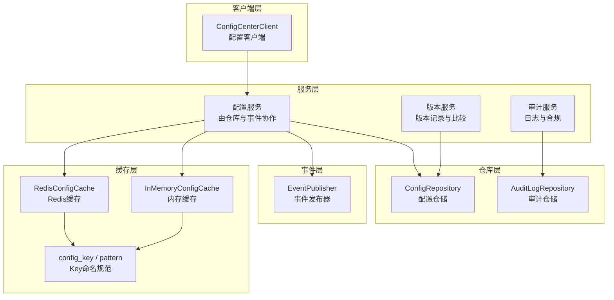
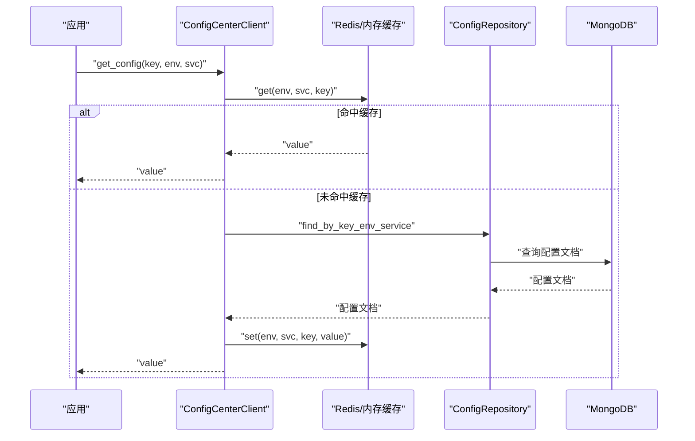
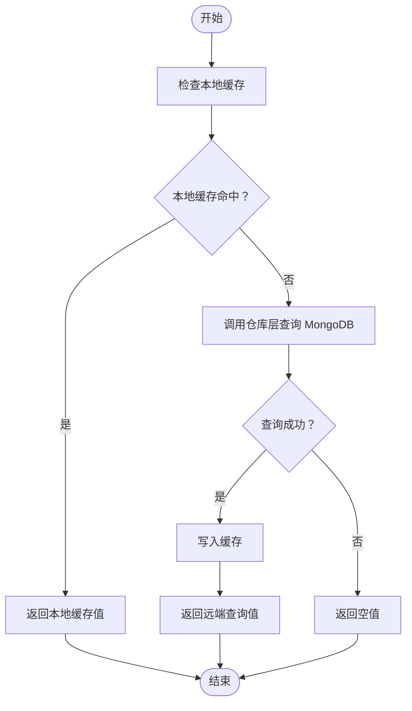
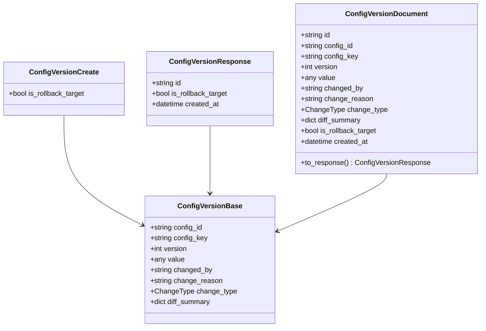
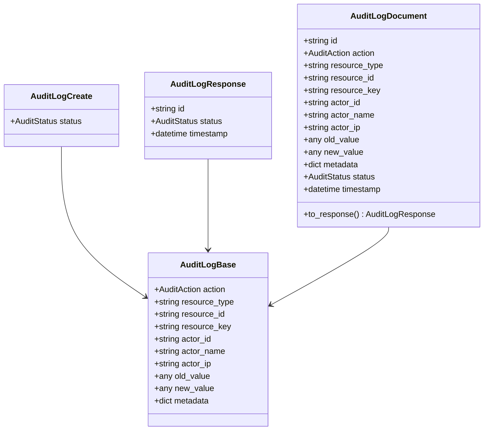
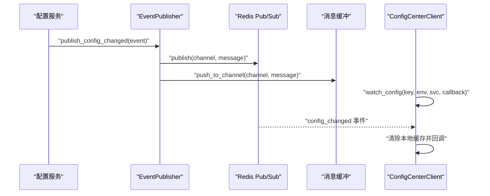
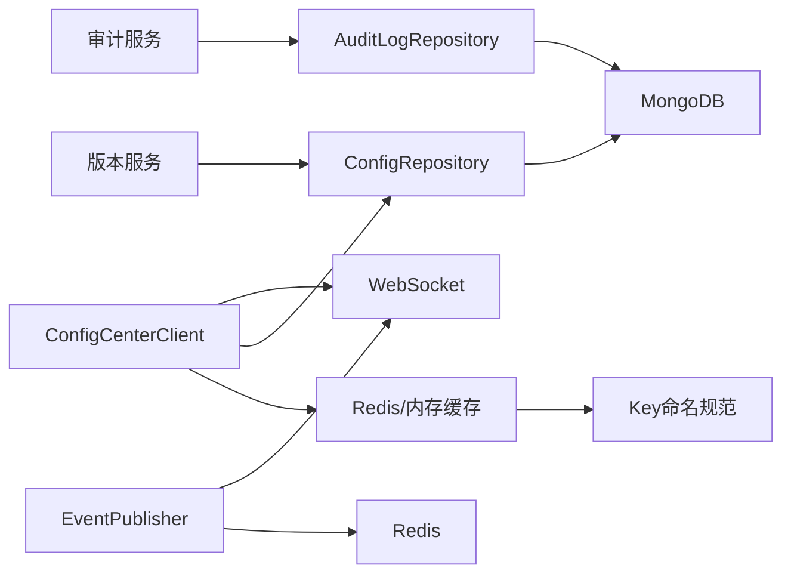

# 服务层实现

<cite>
**本文引用的文件**
- [client.py](file://tools/flexloop/src/taolib/testing/config_center/client.py)
- [config_cache.py](file://tools/flexloop/src/taolib/testing/config_center/cache/config_cache.py)
- [keys.py](file://tools/flexloop/src/taolib/testing/config_center/cache/keys.py)
- [config.py](file://tools/flexloop/src/taolib/testing/config_center/models/config.py)
- [version.py](file://tools/flexloop/src/taolib/testing/config_center/models/version.py)
- [audit.py](file://tools/flexloop/src/taolib/testing/config_center/models/audit.py)
- [enums.py](file://tools/flexloop/src/taolib/testing/config_center/models/enums.py)
- [config_repo.py](file://tools/flexloop/src/taolib/testing/config_center/repository/config_repo.py)
- [audit_repo.py](file://tools/flexloop/src/taolib/testing/config_center/repository/audit_repo.py)
- [publisher.py](file://tools/flexloop/src/taolib/testing/config_center/events/publisher.py)
</cite>

## 目录
1. [简介](#简介)
2. [项目结构](#项目结构)
3. [核心组件](#核心组件)
4. [架构总览](#架构总览)
5. [详细组件分析](#详细组件分析)
6. [依赖关系分析](#依赖关系分析)
7. [性能考量](#性能考量)
8. [故障排查指南](#故障排查指南)
9. [结论](#结论)
10. [附录](#附录)

## 简介
本文件面向配置中心服务层，系统化阐述服务层架构设计与实现细节，覆盖以下主题：
- 服务层职责与分层边界：配置服务、版本服务、审计服务
- 配置获取接口的实现逻辑：缓存命中、回退策略、错误处理
- 版本管理服务：版本控制、变更历史、版本比较
- 审计服务：操作日志、权限审计、合规追踪
- API 接口文档：请求参数、响应格式、错误处理
- 服务层与仓库层交互模式与事务管理
- 异常处理、重试机制与性能优化策略

## 项目结构
配置中心服务层位于工具链工程 tools/flexloop 下，采用“模型-仓库-事件-客户端”的分层组织方式：
- 模型层：定义配置、版本、审计等数据模型与枚举
- 仓库层：封装 MongoDB 操作，提供 CRUD 与查询能力
- 事件层：基于 Redis 的事件发布器，支持广播、缓冲与优先级
- 客户端层：提供应用侧的配置获取与监听能力

图示来源
- [client.py:18-210](file://tools/flexloop/src/taolib/testing/config_center/client.py#L18-L210)
- [config_cache.py:75-172](file://tools/flexloop/src/taolib/testing/config_center/cache/config_cache.py#L75-L172)
- [keys.py:7-79](file://tools/flexloop/src/taolib/testing/config_center/cache/keys.py#L7-L79)
- [config_repo.py:15-145](file://tools/flexloop/src/taolib/testing/config_center/repository/config_repo.py#L15-L145)
- [audit_repo.py:15-103](file://tools/flexloop/src/taolib/testing/config_center/repository/audit_repo.py#L15-L103)
- [publisher.py:20-194](file://tools/flexloop/src/taolib/testing/config_center/events/publisher.py#L20-L194)

章节来源
- [client.py:1-210](file://tools/flexloop/src/taolib/testing/config_center/client.py#L1-L210)
- [config_cache.py:1-172](file://tools/flexloop/src/taolib/testing/config_center/cache/config_cache.py#L1-L172)
- [keys.py:1-79](file://tools/flexloop/src/taolib/testing/config_center/cache/keys.py#L1-L79)
- [config_repo.py:1-145](file://tools/flexloop/src/taolib/testing/config_center/repository/config_repo.py#L1-L145)
- [audit_repo.py:1-103](file://tools/flexloop/src/taolib/testing/config_center/repository/audit_repo.py#L1-L103)
- [publisher.py:1-194](file://tools/flexloop/src/taolib/testing/config_center/events/publisher.py#L1-L194)

## 核心组件
- 配置客户端：提供同步/异步获取配置、批量获取、WebSocket 监听等能力，并内置本地缓存
- 配置缓存：Redis 缓存与内存缓存两种实现，统一协议接口
- 数据模型：配置、版本、审计三类模型，配合枚举类型
- 仓库层：MongoDB 访问封装，提供按键/标签/状态/环境+服务等多维查询
- 事件发布器：基于 Redis Pub/Sub 的高可靠事件广播，支持批量发布与消息缓冲

章节来源
- [client.py:18-210](file://tools/flexloop/src/taolib/testing/config_center/client.py#L18-L210)
- [config_cache.py:18-172](file://tools/flexloop/src/taolib/testing/config_center/cache/config_cache.py#L18-L172)
- [config.py:14-106](file://tools/flexloop/src/taolib/testing/config_center/models/config.py#L14-L106)
- [version.py:14-79](file://tools/flexloop/src/taolib/testing/config_center/models/version.py#L14-L79)
- [audit.py:14-85](file://tools/flexloop/src/taolib/testing/config_center/models/audit.py#L14-L85)
- [config_repo.py:15-145](file://tools/flexloop/src/taolib/testing/config_center/repository/config_repo.py#L15-L145)
- [audit_repo.py:15-103](file://tools/flexloop/src/taolib/testing/config_center/repository/audit_repo.py#L15-L103)
- [publisher.py:20-194](file://tools/flexloop/src/taolib/testing/config_center/events/publisher.py#L20-L194)

## 架构总览
服务层围绕“配置-版本-审计”三大域构建，通过仓库层访问持久化存储，通过事件层实现跨实例通知与离线消息缓冲；客户端层为应用提供统一的配置获取入口。

图示来源
- [client.py:55-95](file://tools/flexloop/src/taolib/testing/config_center/client.py#L55-L95)
- [config_cache.py:86-108](file://tools/flexloop/src/taolib/testing/config_center/cache/config_cache.py#L86-L108)
- [config_repo.py:26-52](file://tools/flexloop/src/taolib/testing/config_center/repository/config_repo.py#L26-L52)

## 详细组件分析

### 配置服务（配置获取与缓存）
- 缓存策略
  - Redis 缓存：键空间命名规范，支持按环境/服务/键精确查询与批量删除
  - 内存缓存：用于测试场景，具备 TTL 过期与批量匹配删除
- 获取流程
  - 客户端先查本地缓存，命中直接返回
  - 未命中则调用仓库层查询 MongoDB，命中后写入缓存并返回
  - 对于批量获取，客户端会缓存整包配置，按需提取单键
- 回退机制
  - 当网络或 HTTP 错误时，记录警告日志并返回空值，避免阻塞业务
- 监听与广播
  - 通过事件发布器向 Redis 广播配置变更，客户端可订阅 WebSocket 实时刷新

图示来源
- [client.py:55-95](file://tools/flexloop/src/taolib/testing/config_center/client.py#L55-L95)
- [config_cache.py:86-108](file://tools/flexloop/src/taolib/testing/config_center/cache/config_cache.py#L86-L108)
- [config_repo.py:26-52](file://tools/flexloop/src/taolib/testing/config_center/repository/config_repo.py#L26-L52)

章节来源
- [client.py:18-210](file://tools/flexloop/src/taolib/testing/config_center/client.py#L18-L210)
- [config_cache.py:18-172](file://tools/flexloop/src/taolib/testing/config_center/cache/config_cache.py#L18-L172)
- [keys.py:7-79](file://tools/flexloop/src/taolib/testing/config_center/cache/keys.py#L7-L79)
- [config_repo.py:15-145](file://tools/flexloop/src/taolib/testing/config_center/repository/config_repo.py#L15-L145)

### 版本服务（版本控制与历史）
- 数据模型
  - 版本文档包含配置 ID、键、版本号、变更人、变更类型、差异摘要等字段
  - 支持回滚目标标记，便于安全回滚
- 功能要点
  - 通过仓库层维护版本历史，每次变更生成新版本记录
  - 提供版本比较与差异摘要，辅助审计与合规
- 与配置服务的协作
  - 配置变更触发版本记录创建，同时清理相关缓存键

图示来源
- [version.py:14-79](file://tools/flexloop/src/taolib/testing/config_center/models/version.py#L14-L79)

章节来源
- [version.py:14-79](file://tools/flexloop/src/taolib/testing/config_center/models/version.py#L14-L79)
- [enums.py:36-43](file://tools/flexloop/src/taolib/testing/config_center/models/enums.py#L36-L43)

### 审计服务（操作日志与合规）
- 数据模型
  - 审计日志包含操作类型、资源类型/ID/键、操作人信息、旧/新值、元数据、状态与时间戳
- 查询与索引
  - 支持按资源、操作人、动作、时间范围等条件组合查询
  - 建立复合索引与 TTL 索引，保障查询性能与数据生命周期管理
- 合规性
  - 统一的动作枚举与状态枚举，满足审计与合规要求

图示来源
- [audit.py:14-85](file://tools/flexloop/src/taolib/testing/config_center/models/audit.py#L14-L85)

章节来源
- [audit.py:14-85](file://tools/flexloop/src/taolib/testing/config_center/models/audit.py#L14-L85)
- [audit_repo.py:15-103](file://tools/flexloop/src/taolib/testing/config_center/repository/audit_repo.py#L15-L103)
- [enums.py:45-63](file://tools/flexloop/src/taolib/testing/config_center/models/enums.py#L45-L63)

### 事件与广播（配置变更通知）
- 事件发布器
  - 构造带优先级与确认需求的消息，发布到 Redis Pub/Sub
  - 支持批量发布与消息缓冲，确保至少一次投递
  - 为每个发布实例分配唯一实例 ID，便于溯源
- 客户端监听
  - 通过 WebSocket 订阅配置变更事件，收到后清除本地缓存并回调

图示来源
- [publisher.py:46-67](file://tools/flexloop/src/taolib/testing/config_center/events/publisher.py#L46-L67)
- [publisher.py:105-132](file://tools/flexloop/src/taolib/testing/config_center/events/publisher.py#L105-L132)
- [client.py:169-208](file://tools/flexloop/src/taolib/testing/config_center/client.py#L169-L208)

章节来源
- [publisher.py:20-194](file://tools/flexloop/src/taolib/testing/config_center/events/publisher.py#L20-L194)
- [client.py:169-208](file://tools/flexloop/src/taolib/testing/config_center/client.py#L169-L208)

### API 接口文档（客户端视角）
- 获取单个配置
  - 方法：GET
  - 路径：/api/v1/configs
  - 查询参数：
    - environment: 环境类型（必填）
    - service: 服务名称（必填）
  - 返回：配置数组（包含 key/value），客户端按 key 精确匹配
  - 错误：HTTP 非 200 时记录警告并返回空值
- 获取服务全部配置
  - 方法：GET
  - 路径：/api/v1/configs
  - 查询参数：同上
  - 返回：配置数组
  - 错误：HTTP 非 200 时记录警告并返回空数组
- WebSocket 监听
  - 协议：ws://host/api/v1/ws/configs?token=...&environments=...&services=...
  - 事件类型：config_changed
  - 负载：包含 config_key 等字段
  - 行为：收到后清除本地缓存并回调

章节来源
- [client.py:55-95](file://tools/flexloop/src/taolib/testing/config_center/client.py#L55-L95)
- [client.py:139-167](file://tools/flexloop/src/taolib/testing/config_center/client.py#L139-L167)
- [client.py:169-208](file://tools/flexloop/src/taolib/testing/config_center/client.py#L169-L208)

## 依赖关系分析
- 组件耦合
  - 客户端依赖缓存与仓库层；仓库层依赖 MongoDB；事件层依赖 Redis
  - 缓存键命名统一由 keys 模块提供，降低耦合度
- 直接/间接依赖
  - 客户端直连仓库与缓存；版本/审计服务通过仓库层间接依赖 MongoDB
- 循环依赖
  - 未见循环依赖迹象，分层清晰
- 外部依赖
  - Redis（事件与缓存）、MongoDB（持久化）、HTTP/WebSocket（客户端）

图示来源
- [client.py:18-210](file://tools/flexloop/src/taolib/testing/config_center/client.py#L18-L210)
- [config_cache.py:75-172](file://tools/flexloop/src/taolib/testing/config_center/cache/config_cache.py#L75-L172)
- [keys.py:7-79](file://tools/flexloop/src/taolib/testing/config_center/cache/keys.py#L7-L79)
- [config_repo.py:15-145](file://tools/flexloop/src/taolib/testing/config_center/repository/config_repo.py#L15-L145)
- [audit_repo.py:15-103](file://tools/flexloop/src/taolib/testing/config_center/repository/audit_repo.py#L15-L103)
- [publisher.py:20-194](file://tools/flexloop/src/taolib/testing/config_center/events/publisher.py#L20-L194)

章节来源
- [client.py:1-210](file://tools/flexloop/src/taolib/testing/config_center/client.py#L1-L210)
- [config_cache.py:1-172](file://tools/flexloop/src/taolib/testing/config_center/cache/config_cache.py#L1-L172)
- [keys.py:1-79](file://tools/flexloop/src/taolib/testing/config_center/cache/keys.py#L1-L79)
- [config_repo.py:1-145](file://tools/flexloop/src/taolib/testing/config_center/repository/config_repo.py#L1-L145)
- [audit_repo.py:1-103](file://tools/flexloop/src/taolib/testing/config_center/repository/audit_repo.py#L1-L103)
- [publisher.py:1-194](file://tools/flexloop/src/taolib/testing/config_center/events/publisher.py#L1-L194)

## 性能考量
- 缓存策略
  - 使用 Redis 缓存热点配置，减少数据库压力；内存缓存用于测试快速验证
  - 批量删除支持按环境/服务/键模式匹配，避免全表扫描
- 网络与超时
  - 客户端 HTTP 调用设置合理超时，避免阻塞；异步客户端提升并发吞吐
- 事件发布
  - Redis Pipeline 批量发布，降低网络往返；消息缓冲保障离线可达
- 索引与查询
  - 仓库层建立复合索引与 TTL 索引，优化查询与生命周期管理

## 故障排查指南
- 配置获取为空
  - 检查环境/服务/键是否正确；确认仓库层查询是否存在；查看缓存是否过期
- WebSocket 监听失败
  - 确认已安装 WebSocket 依赖；检查 Redis 与消息缓冲可用性；核对订阅参数
- 审计日志缺失
  - 检查 TTL 索引是否生效；确认查询条件与时间范围；核对动作枚举
- 事件未送达
  - 检查 Redis Pub/Sub 通道与消息缓冲；确认批量发布管道执行情况

章节来源
- [client.py:87-95](file://tools/flexloop/src/taolib/testing/config_center/client.py#L87-L95)
- [client.py:204-208](file://tools/flexloop/src/taolib/testing/config_center/client.py#L204-L208)
- [publisher.py:176-192](file://tools/flexloop/src/taolib/testing/config_center/events/publisher.py#L176-L192)
- [audit_repo.py:96-100](file://tools/flexloop/src/taolib/testing/config_center/repository/audit_repo.py#L96-L100)

## 结论
配置中心服务层通过清晰的分层与统一的数据模型，实现了配置获取、版本管理与审计追踪的完整闭环。结合 Redis 缓存与事件广播，既保证了低延迟与高可用，又提供了可观测与可追溯的能力。建议在生产环境中进一步完善重试与熔断策略，并持续优化索引与缓存键设计以适配更大规模的配置体量。

## 附录
- 关键枚举类型
  - 环境：development/staging/pre-production/production
  - 配置值类型：string/number/boolean/json/secret
  - 配置状态：draft/active/deprecated
  - 变更类型：create/update/delete/rollback
  - 审计动作：config.create/config.update/config.delete/config.publish/config.rollback/user.login/user.logout/role.assign
  - 审计状态：success/failed

章节来源
- [enums.py:9-65](file://tools/flexloop/src/taolib/testing/config_center/models/enums.py#L9-L65)