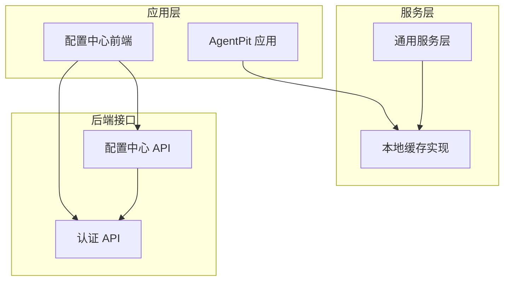
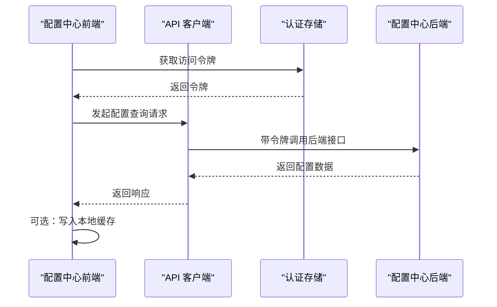
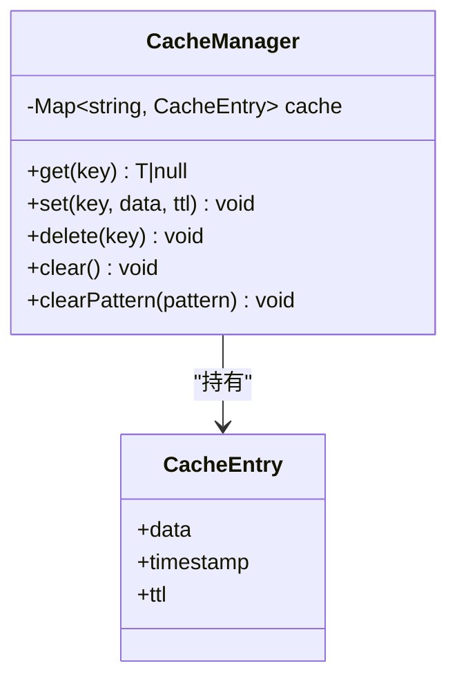
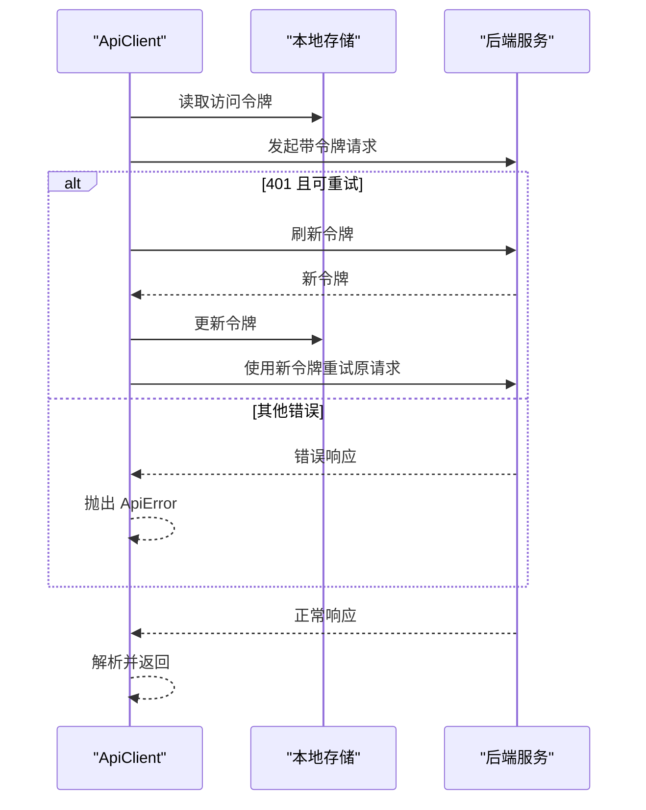
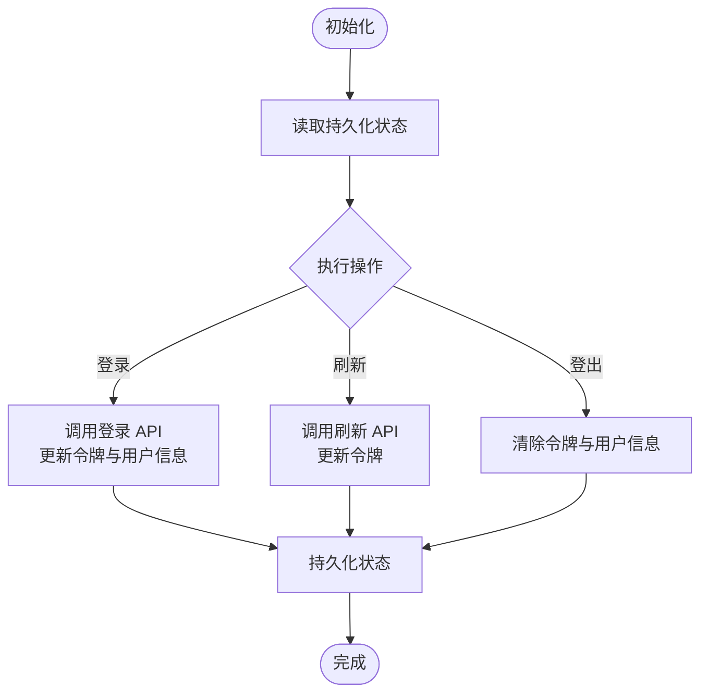
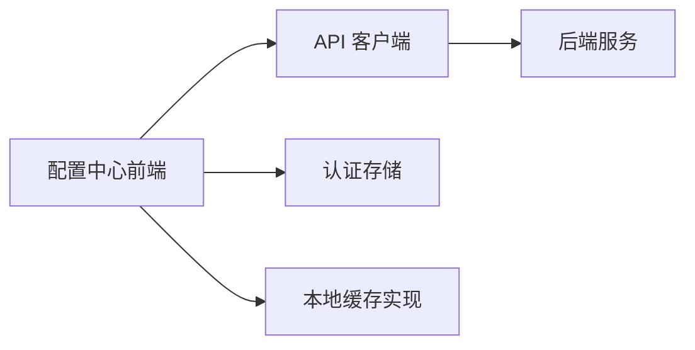

# 缓存策略实现

<cite>
**本文引用的文件**
- [apps/AgentPit/src/services/cache.ts](file://apps/AgentPit/src/services/cache.ts)
- [src/services/cache.ts](file://src/services/cache.ts)
- [apps/config-center/src/api/configs.ts](file://apps/config-center/src/api/configs.ts)
- [apps/config-center/src/api/client.ts](file://apps/config-center/src/api/client.ts)
- [apps/config-center/src/store/authStore.ts](file://apps/config-center/src/store/authStore.ts)
- [apps/config-center/src/store/uiStore.ts](file://apps/config-center/src/store/uiStore.ts)
- [apps/config-center/src/types/index.ts](file://apps/config-center/src/types/index.ts)
</cite>

## 目录
1. [引言](#引言)
2. [项目结构](#项目结构)
3. [核心组件](#核心组件)
4. [架构总览](#架构总览)
5. [详细组件分析](#详细组件分析)
6. [依赖关系分析](#依赖关系分析)
7. [性能考量](#性能考量)
8. [故障排查指南](#故障排查指南)
9. [结论](#结论)
10. [附录](#附录)

## 引言
本技术文档聚焦于配置中心的缓存策略实现，系统性阐述缓存架构设计、Redis 集成方案、缓存键命名规范与过期策略；详细说明配置缓存的预加载、热更新与失效策略；解释 Redis 客户端的配置与连接管理（连接池、故障转移、性能监控）；给出缓存键设计原则（命名空间、格式规范、冲突避免）；提供性能优化策略（内存使用、命中率、缓存穿透防护）；并展示缓存与数据库一致性保障（写入策略、读写分离、数据同步），最后包含监控、故障排查与容量规划建议。

## 项目结构
本仓库包含多个前端应用与服务模块，其中与缓存策略直接相关的核心文件如下：
- 应用级缓存实现：AgentPit 与通用服务层均提供了基于内存的本地缓存实现，用于演示与测试。
- 配置中心前端：提供配置列表、详情、发布等 API 调用封装，以及认证态与 UI 状态管理。
- 类型定义：统一了配置项、版本、审计日志、用户与角色等关键数据模型。

**图表来源**
- [apps/AgentPit/src/services/cache.ts:1-50](file://apps/AgentPit/src/services/cache.ts#L1-L50)
- [src/services/cache.ts:1-50](file://src/services/cache.ts#L1-L50)
- [apps/config-center/src/api/configs.ts:1-33](file://apps/config-center/src/api/configs.ts#L1-L33)
- [apps/config-center/src/api/client.ts:1-172](file://apps/config-center/src/api/client.ts#L1-L172)
- [apps/config-center/src/store/authStore.ts:1-108](file://apps/config-center/src/store/authStore.ts#L1-L108)

**章节来源**
- [apps/AgentPit/src/services/cache.ts:1-50](file://apps/AgentPit/src/services/cache.ts#L1-L50)
- [src/services/cache.ts:1-50](file://src/services/cache.ts#L1-L50)
- [apps/config-center/src/api/configs.ts:1-33](file://apps/config-center/src/api/configs.ts#L1-L33)
- [apps/config-center/src/api/client.ts:1-172](file://apps/config-center/src/api/client.ts#L1-L172)
- [apps/config-center/src/store/authStore.ts:1-108](file://apps/config-center/src/store/authStore.ts#L1-L108)
- [apps/config-center/src/store/uiStore.ts:1-14](file://apps/config-center/src/store/uiStore.ts#L1-L14)
- [apps/config-center/src/types/index.ts:1-163](file://apps/config-center/src/types/index.ts#L1-L163)

## 核心组件
- 本地缓存管理器：提供基于 Map 的内存缓存，支持 TTL 过期、按模式清理、批量清空等能力，适合作为本地预热与兜底缓存。
- 配置中心 API 客户端：封装认证态获取与刷新、请求重试与错误处理、参数序列化等逻辑，为缓存策略提供数据来源。
- 认证状态存储：使用持久化状态管理维护访问令牌与刷新令牌，支撑配置中心的鉴权与安全边界。
- 数据模型：统一的配置项、版本、审计日志、用户与角色等类型，确保缓存键与数据结构一致。

**章节来源**
- [apps/AgentPit/src/services/cache.ts:8-47](file://apps/AgentPit/src/services/cache.ts#L8-L47)
- [src/services/cache.ts:8-47](file://src/services/cache.ts#L8-L47)
- [apps/config-center/src/api/client.ts:14-171](file://apps/config-center/src/api/client.ts#L14-L171)
- [apps/config-center/src/store/authStore.ts:20-107](file://apps/config-center/src/store/authStore.ts#L20-L107)
- [apps/config-center/src/types/index.ts:15-50](file://apps/config-center/src/types/index.ts#L15-L50)

## 架构总览
下图展示了配置中心前端与缓存策略的整体交互：前端通过 API 客户端发起请求，认证态由状态存储管理；后端返回配置数据，可结合本地缓存进行预加载与热更新；同时预留 Redis 集成扩展点以实现分布式缓存与高可用。

**图表来源**
- [apps/config-center/src/api/client.ts:14-171](file://apps/config-center/src/api/client.ts#L14-L171)
- [apps/config-center/src/store/authStore.ts:20-107](file://apps/config-center/src/store/authStore.ts#L20-L107)
- [apps/config-center/src/api/configs.ts:1-33](file://apps/config-center/src/api/configs.ts#L1-L33)

## 详细组件分析

### 本地缓存管理器
- 设计要点
  - 使用 Map 存储键值对，每个条目包含数据、时间戳与 TTL。
  - 读取时检查是否过期，过期则删除并返回空。
  - 支持按模式正则清理，便于批量失效。
- 复杂度
  - 读写平均 O(1)，按模式清理 O(n)。
- 适用场景
  - 本地预热、短期缓存、开发与测试环境。

**图表来源**
- [apps/AgentPit/src/services/cache.ts:2-47](file://apps/AgentPit/src/services/cache.ts#L2-L47)
- [src/services/cache.ts:2-47](file://src/services/cache.ts#L2-L47)

**章节来源**
- [apps/AgentPit/src/services/cache.ts:8-47](file://apps/AgentPit/src/services/cache.ts#L8-L47)
- [src/services/cache.ts:8-47](file://src/services/cache.ts#L8-L47)

### 配置中心 API 客户端
- 认证与令牌刷新
  - 从本地存储读取访问与刷新令牌。
  - 401 时触发刷新流程，并重试原请求。
  - 刷新成功后更新本地存储中的令牌。
- 请求封装
  - 统一添加 Authorization 头与 Content-Type。
  - 支持 GET/POST/PUT/DELETE 与表单提交。
  - 对 204 特殊处理，异常统一包装为 ApiError。
- 与缓存策略的关系
  - 作为缓存的数据源，负责从后端拉取最新配置。
  - 可与本地缓存配合实现预加载与热更新。

**图表来源**
- [apps/config-center/src/api/client.ts:21-129](file://apps/config-center/src/api/client.ts#L21-L129)

**章节来源**
- [apps/config-center/src/api/client.ts:14-171](file://apps/config-center/src/api/client.ts#L14-L171)

### 认证状态存储
- 功能
  - 维护用户信息、访问令牌、刷新令牌与认证状态。
  - 提供登录、登出、刷新与获取用户信息等方法。
  - 使用持久化中间件将关键字段保存到本地存储。
- 与缓存策略的关系
  - 为 API 客户端提供令牌，间接保障缓存数据访问的安全性。

**图表来源**
- [apps/config-center/src/store/authStore.ts:20-107](file://apps/config-center/src/store/authStore.ts#L20-L107)

**章节来源**
- [apps/config-center/src/store/authStore.ts:1-108](file://apps/config-center/src/store/authStore.ts#L1-L108)

### 配置中心数据模型
- 关键实体
  - 配置项：包含键、环境、服务、值、类型、标签、状态、版本等。
  - 版本：记录每次变更的差异摘要与回滚目标标记。
  - 审计日志：记录操作者、资源、动作、结果与元数据。
  - 用户与角色：权限控制与作用域。
- 与缓存策略的关系
  - 为缓存键命名与失效策略提供结构化依据，确保键的唯一性与可追踪性。

**章节来源**
- [apps/config-center/src/types/index.ts:15-50](file://apps/config-center/src/types/index.ts#L15-L50)
- [apps/config-center/src/types/index.ts:54-73](file://apps/config-center/src/types/index.ts#L54-L73)
- [apps/config-center/src/types/index.ts:77-91](file://apps/config-center/src/types/index.ts#L77-L91)
- [apps/config-center/src/types/index.ts:110-120](file://apps/config-center/src/types/index.ts#L110-L120)
- [apps/config-center/src/types/index.ts:144-154](file://apps/config-center/src/types/index.ts#L144-L154)

## 依赖关系分析
- 组件耦合
  - 配置中心前端依赖 API 客户端与认证存储。
  - 本地缓存实现独立于业务层，可被多处复用。
- 外部依赖
  - 浏览器本地存储用于令牌持久化。
  - 后端提供配置与认证接口。
- 潜在风险
  - 本地缓存不具备持久化与跨进程共享能力，需结合 Redis 实现分布式缓存。
  - 认证态与缓存数据的生命周期需协调，避免出现“脏读”。

**图表来源**
- [apps/config-center/src/api/client.ts:14-171](file://apps/config-center/src/api/client.ts#L14-L171)
- [apps/config-center/src/store/authStore.ts:20-107](file://apps/config-center/src/store/authStore.ts#L20-L107)
- [apps/AgentPit/src/services/cache.ts:8-47](file://apps/AgentPit/src/services/cache.ts#L8-L47)
- [src/services/cache.ts:8-47](file://src/services/cache.ts#L8-L47)

**章节来源**
- [apps/config-center/src/api/client.ts:14-171](file://apps/config-center/src/api/client.ts#L14-L171)
- [apps/config-center/src/store/authStore.ts:20-107](file://apps/config-center/src/store/authStore.ts#L20-L107)
- [apps/AgentPit/src/services/cache.ts:8-47](file://apps/AgentPit/src/services/cache.ts#L8-L47)
- [src/services/cache.ts:8-47](file://src/services/cache.ts#L8-L47)

## 性能考量
- 内存使用优化
  - 限制缓存容量与 TTL，定期清理过期键；对热点键设置更短 TTL 以降低内存占用。
  - 使用压缩或二进制序列化减少对象体积（如适用）。
- 命中率提升
  - 将高频查询的配置项进行预加载；对冷数据设置较短 TTL。
  - 采用分层缓存：本地缓存 + 分布式缓存（Redis），优先查本地，再查远端。
- 缓存穿透防护
  - 对空结果也做短 TTL 缓存，防止恶意或异常请求持续穿透。
  - 使用布隆过滤器在进入后端前快速判断键是否存在。
- 一致性与并发
  - 写入时先更新数据库，再失效相关缓存键，避免读到旧值。
  - 并发写入时采用互斥锁或队列化，确保同一键的更新串行化。

[本节为通用性能指导，不直接分析具体文件]

## 故障排查指南
- 认证相关问题
  - 401 未授权：检查刷新令牌是否有效；确认刷新流程是否成功更新本地存储。
  - 令牌缺失：确认本地存储中是否存在认证数据，必要时重新登录。
- 缓存相关问题
  - 读取为空：确认键是否存在、是否过期、TTL 是否合理。
  - 清理无效：使用按模式清理功能定位并移除异常键。
- 接口异常
  - 统一捕获 ApiError，记录状态码与详情，定位后端错误原因。

**章节来源**
- [apps/config-center/src/api/client.ts:98-129](file://apps/config-center/src/api/client.ts#L98-L129)
- [apps/config-center/src/store/authStore.ts:57-72](file://apps/config-center/src/store/authStore.ts#L57-L72)
- [apps/AgentPit/src/services/cache.ts:39-46](file://apps/AgentPit/src/services/cache.ts#L39-L46)
- [src/services/cache.ts:39-46](file://src/services/cache.ts#L39-L46)

## 结论
本项目提供了本地缓存实现与配置中心前端的基础能力，为后续引入 Redis 分布式缓存奠定了基础。通过明确的缓存键命名规范、TTL 策略与失效机制，结合认证态与 API 客户端的协作，可在保证一致性的同时显著提升性能与稳定性。建议尽快落地 Redis 集成，完善连接池、故障转移与监控体系，并持续优化命中率与容量规划。

[本节为总结性内容，不直接分析具体文件]

## 附录

### 缓存键命名规范与过期策略
- 命名空间划分
  - 建议按“环境:服务:类型:键”组织，例如 development:config-center:config:key-name。
  - 类型区分：config、version、audit、user 等，便于按域清理。
- 键格式规范
  - 使用小写与冒号分隔，避免特殊字符；键长度适中，便于检索。
- 冲突避免
  - 在键中显式包含环境与服务维度，避免跨环境/跨服务污染。
- 过期策略
  - 热点配置：短 TTL（如 1-5 分钟），结合预热与后台刷新。
  - 常规配置：中 TTL（如 10-30 分钟），定期校验。
  - 历史版本：长 TTL 或永久，配合版本号与回滚标识。

[本节为设计原则说明，不直接分析具体文件]

### Redis 集成与连接管理
- 连接池设置
  - 最大连接数：根据 QPS 与 RT 预估，预留 20%-30% 安全余量。
  - 连接超时：读写超时分别设置，避免阻塞。
- 故障转移
  - 主从复制 + Sentinel/Cluster，自动切换与重试。
  - 客户端具备幂等与退避重试策略。
- 性能监控
  - 监控指标：命中率、延迟、内存使用、连接数、慢查询。
  - 告警阈值：命中率低于阈值、延迟突增、内存接近上限。

[本节为概念性建议，不直接分析具体文件]

### 缓存与数据库一致性
- 写入策略
  - 先写数据库，再失效缓存键；或写数据库后写入缓存新值。
- 读写分离
  - 读库只读，写库承担写入；缓存作为写后失效的旁路。
- 数据同步
  - 增量同步：监听数据库变更事件，推送至缓存失效队列。
  - 批量同步：定时任务扫描差异并更新缓存。

[本节为概念性建议，不直接分析具体文件]