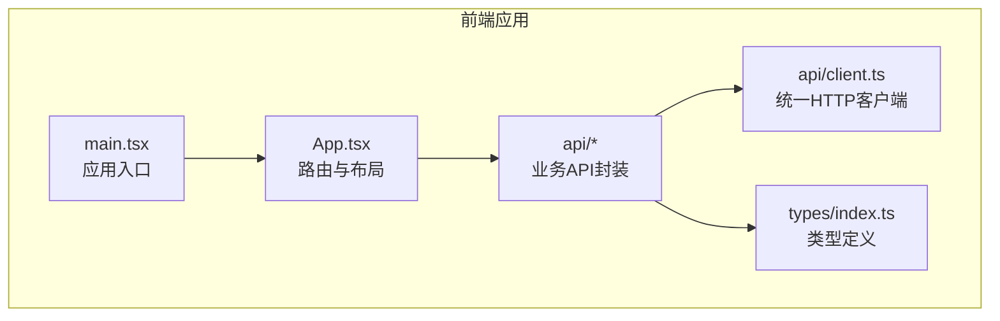
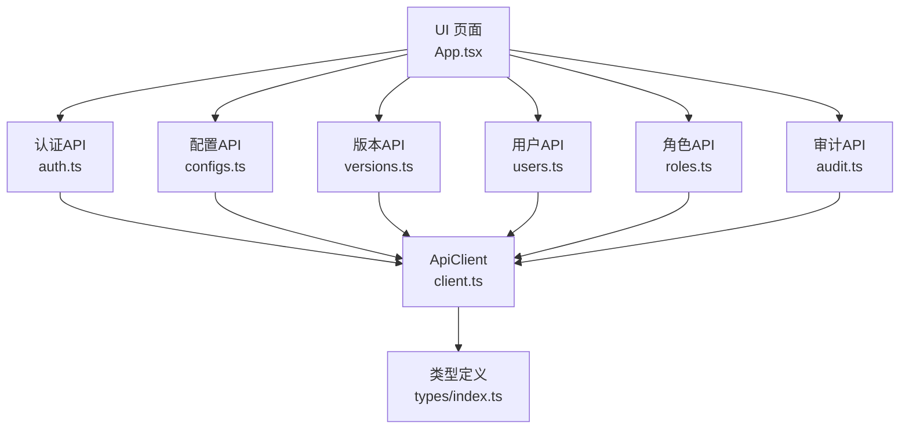
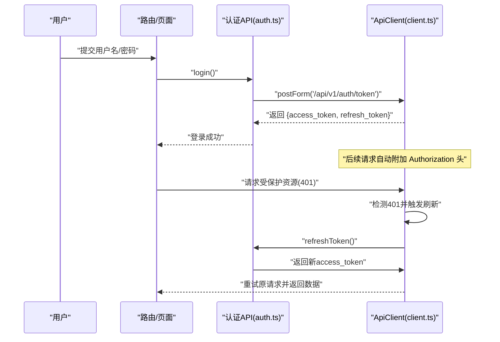
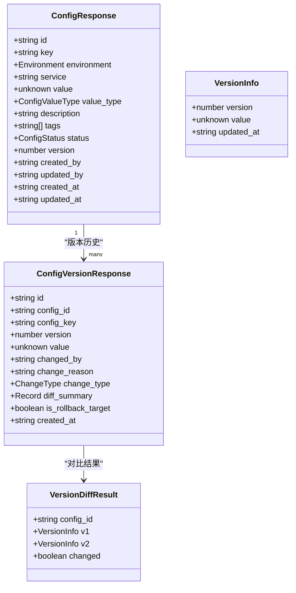
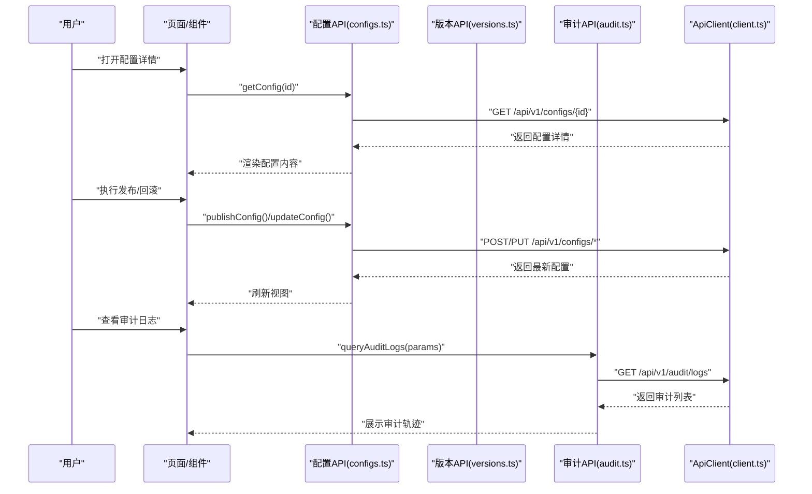
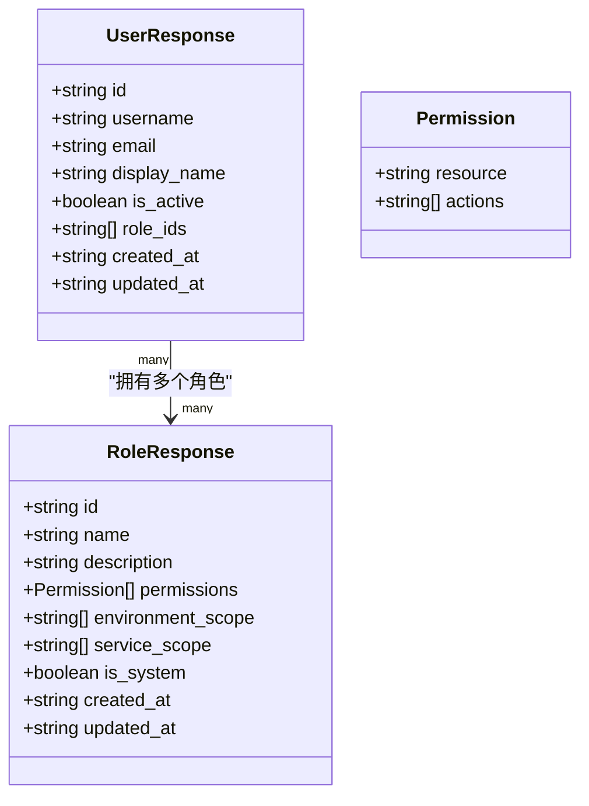
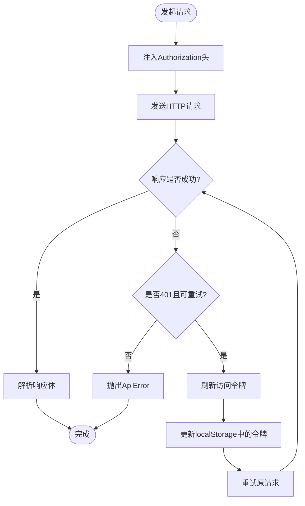
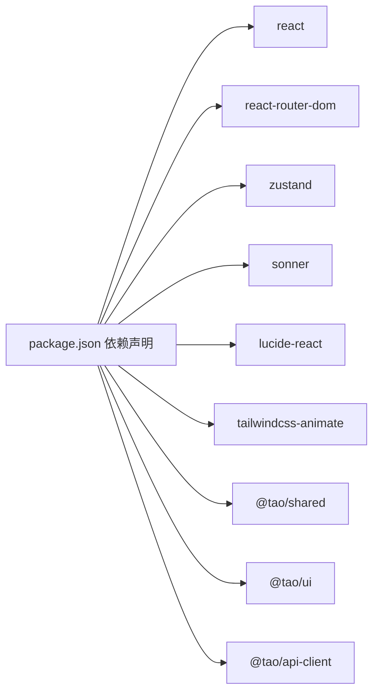

# 配置中心

<cite>
**本文引用的文件**
- [apps/config-center/package.json](file://apps/config-center/package.json)
- [apps/config-center/src/App.tsx](file://apps/config-center/src/App.tsx)
- [apps/config-center/src/main.tsx](file://apps/config-center/src/main.tsx)
- [apps/config-center/src/api/client.ts](file://apps/config-center/src/api/client.ts)
- [apps/config-center/src/api/auth.ts](file://apps/config-center/src/api/auth.ts)
- [apps/config-center/src/api/configs.ts](file://apps/config-center/src/api/configs.ts)
- [apps/config-center/src/api/versions.ts](file://apps/config-center/src/api/versions.ts)
- [apps/config-center/src/api/users.ts](file://apps/config-center/src/api/users.ts)
- [apps/config-center/src/api/roles.ts](file://apps/config-center/src/api/roles.ts)
- [apps/config-center/src/api/audit.ts](file://apps/config-center/src/api/audit.ts)
- [apps/config-center/src/types/index.ts](file://apps/config-center/src/types/index.ts)
</cite>

## 目录
1. [简介](#简介)
2. [项目结构](#项目结构)
3. [核心组件](#核心组件)
4. [架构总览](#架构总览)
5. [详细组件分析](#详细组件分析)
6. [依赖关系分析](#依赖关系分析)
7. [性能考量](#性能考量)
8. [故障排查指南](#故障排查指南)
9. [结论](#结论)
10. [附录](#附录)

## 简介
本技术文档面向“配置中心”前端系统，聚焦于配置模型、版本管理与实时推送机制的设计与实现；服务层接口（配置获取、变更通知、审计日志）；仓库模式在配置数据存储中的应用（配置项管理、用户权限与版本控制）；缓存策略（本地存储与令牌刷新）；以及与微服务的集成与配置热更新机制。文档以代码为依据，提供可操作的架构图、流程图与最佳实践建议。

## 项目结构
配置中心前端采用 React + TypeScript 技术栈，通过 Vite 构建，使用 React Router 进行路由管理，并通过自研 ApiClient 封装统一的 HTTP 客户端与鉴权逻辑。核心模块包括：
- 应用入口与路由：App.tsx、main.tsx
- API 层：auth.ts、configs.ts、versions.ts、users.ts、roles.ts、audit.ts
- 类型定义：types/index.ts
- 统一客户端：api/client.ts

图表来源
- [apps/config-center/src/main.tsx:1-11](file://apps/config-center/src/main.tsx#L1-L11)
- [apps/config-center/src/App.tsx:1-39](file://apps/config-center/src/App.tsx#L1-L39)
- [apps/config-center/src/api/client.ts:1-172](file://apps/config-center/src/api/client.ts#L1-L172)
- [apps/config-center/src/types/index.ts:1-163](file://apps/config-center/src/types/index.ts#L1-L163)

章节来源
- [apps/config-center/package.json:1-41](file://apps/config-center/package.json#L1-L41)
- [apps/config-center/src/main.tsx:1-11](file://apps/config-center/src/main.tsx#L1-L11)
- [apps/config-center/src/App.tsx:1-39](file://apps/config-center/src/App.tsx#L1-L39)

## 核心组件
- 路由与页面
  - 登录页、仪表盘、配置列表、配置详情、版本历史、审计日志、用户与角色管理等页面通过 React Router 声明式路由组织。
- 统一 API 客户端
  - ApiClient 提供 get/put/post/delete/postForm 等方法，内置鉴权头注入、401 自动刷新令牌、重试与错误包装。
- 类型体系
  - 定义环境、配置值类型、状态、审计动作、用户与角色权限模型等，确保前后端契约一致。

章节来源
- [apps/config-center/src/App.tsx:1-39](file://apps/config-center/src/App.tsx#L1-L39)
- [apps/config-center/src/api/client.ts:1-172](file://apps/config-center/src/api/client.ts#L1-L172)
- [apps/config-center/src/types/index.ts:1-163](file://apps/config-center/src/types/index.ts#L1-L163)

## 架构总览
配置中心前端通过 ApiClient 与后端 API 交互，支持认证、配置管理、版本回滚、审计日志与用户/角色管理。路由层负责页面级导航，API 层负责数据访问与错误处理。

图表来源
- [apps/config-center/src/App.tsx:1-39](file://apps/config-center/src/App.tsx#L1-L39)
- [apps/config-center/src/api/auth.ts:1-15](file://apps/config-center/src/api/auth.ts#L1-L15)
- [apps/config-center/src/api/configs.ts:1-33](file://apps/config-center/src/api/configs.ts#L1-L33)
- [apps/config-center/src/api/versions.ts:1-29](file://apps/config-center/src/api/versions.ts#L1-L29)
- [apps/config-center/src/api/users.ts:1-26](file://apps/config-center/src/api/users.ts#L1-L26)
- [apps/config-center/src/api/roles.ts:1-26](file://apps/config-center/src/api/roles.ts#L1-L26)
- [apps/config-center/src/api/audit.ts:1-18](file://apps/config-center/src/api/audit.ts#L1-L18)
- [apps/config-center/src/api/client.ts:1-172](file://apps/config-center/src/api/client.ts#L1-L172)
- [apps/config-center/src/types/index.ts:1-163](file://apps/config-center/src/types/index.ts#L1-L163)

## 详细组件分析

### 认证与会话管理
- 登录与刷新
  - 登录使用表单提交，返回访问令牌与刷新令牌；刷新接口在 401 时自动调用，避免频繁登录。
- 本地存储
  - 使用 localStorage 存储认证状态，包含 access_token 与 refresh_token；刷新成功后同步更新。
- 错误处理
  - 401 时清理本地存储并跳转到登录页；其他错误统一抛出 ApiError 并携带状态码与详情。

图表来源
- [apps/config-center/src/api/auth.ts:1-15](file://apps/config-center/src/api/auth.ts#L1-L15)
- [apps/config-center/src/api/client.ts:1-172](file://apps/config-center/src/api/client.ts#L1-L172)

章节来源
- [apps/config-center/src/api/auth.ts:1-15](file://apps/config-center/src/api/auth.ts#L1-L15)
- [apps/config-center/src/api/client.ts:1-172](file://apps/config-center/src/api/client.ts#L1-L172)

### 配置模型与版本管理
- 配置模型
  - 支持键、环境、服务、值类型、描述、标签、状态、版本号、创建/更新信息等字段；值类型覆盖字符串、数字、布尔、JSON、密文。
- 版本模型
  - 每个版本记录变更人、变更原因、变更类型（新增/修改/删除/回滚）、差异摘要与创建时间；支持版本对比与回滚。
- 变更通知
  - 通过发布接口将草稿变为生效状态；审计日志记录关键操作（创建、更新、删除、发布、回滚）。

图表来源
- [apps/config-center/src/types/index.ts:15-73](file://apps/config-center/src/types/index.ts#L15-L73)

章节来源
- [apps/config-center/src/types/index.ts:1-163](file://apps/config-center/src/types/index.ts#L1-L163)
- [apps/config-center/src/api/configs.ts:1-33](file://apps/config-center/src/api/configs.ts#L1-L33)
- [apps/config-center/src/api/versions.ts:1-29](file://apps/config-center/src/api/versions.ts#L1-L29)

### 服务层实现（配置获取、变更通知、审计日志）
- 配置获取
  - 列表查询支持按环境、服务、状态分页过滤；详情查询按 ID 获取；支持创建、更新、删除与发布。
- 变更通知
  - 发布接口将配置从草稿切换为生效；回滚接口将配置恢复到指定版本并返回新版本号。
- 审计日志
  - 查询与详情接口支持按资源类型/ID、操作者、动作等条件筛选；记录操作者 IP、旧值/新值、元数据与时间戳。

图表来源
- [apps/config-center/src/api/configs.ts:1-33](file://apps/config-center/src/api/configs.ts#L1-L33)
- [apps/config-center/src/api/versions.ts:1-29](file://apps/config-center/src/api/versions.ts#L1-L29)
- [apps/config-center/src/api/audit.ts:1-18](file://apps/config-center/src/api/audit.ts#L1-L18)
- [apps/config-center/src/api/client.ts:1-172](file://apps/config-center/src/api/client.ts#L1-L172)

章节来源
- [apps/config-center/src/api/configs.ts:1-33](file://apps/config-center/src/api/configs.ts#L1-L33)
- [apps/config-center/src/api/versions.ts:1-29](file://apps/config-center/src/api/versions.ts#L1-L29)
- [apps/config-center/src/api/audit.ts:1-18](file://apps/config-center/src/api/audit.ts#L1-L18)

### 仓库模式与权限控制
- 用户与角色
  - 用户模型包含激活状态、角色 ID 列表与创建/更新时间；角色模型包含名称、描述、权限集合与环境/服务作用域。
- 权限模型
  - 权限对象包含资源与动作数组，用于细粒度控制对配置、审计、用户与角色的操作范围。
- 仓库职责
  - 通过 users.ts 与 roles.ts 提供用户与角色的增删改查能力，配合后端权限策略实现最小授权与作用域隔离。

图表来源
- [apps/config-center/src/types/index.ts:94-154](file://apps/config-center/src/types/index.ts#L94-L154)
- [apps/config-center/src/api/users.ts:1-26](file://apps/config-center/src/api/users.ts#L1-L26)
- [apps/config-center/src/api/roles.ts:1-26](file://apps/config-center/src/api/roles.ts#L1-L26)

章节来源
- [apps/config-center/src/types/index.ts:94-154](file://apps/config-center/src/types/index.ts#L94-L154)
- [apps/config-center/src/api/users.ts:1-26](file://apps/config-center/src/api/users.ts#L1-L26)
- [apps/config-center/src/api/roles.ts:1-26](file://apps/config-center/src/api/roles.ts#L1-L26)

### 缓存策略与一致性
- 本地存储
  - 认证令牌与刷新令牌持久化于 localStorage，刷新成功后同步更新，减少重复登录与网络往返。
- 令牌刷新
  - 401 时自动触发刷新流程，若刷新失败则清空本地存储并跳转登录页，保证后续请求不会携带无效令牌。
- 一致性保障
  - 通过统一的 ApiClient 注入 Authorization 头，确保所有受保护请求具备最新令牌；对 204 无响应体的场景进行特殊处理。

图表来源
- [apps/config-center/src/api/client.ts:85-129](file://apps/config-center/src/api/client.ts#L85-L129)

章节来源
- [apps/config-center/src/api/client.ts:1-172](file://apps/config-center/src/api/client.ts#L1-L172)

### 实时推送机制（概念性说明）
- SSE/WS 推荐
  - 对于配置变更的实时推送，可在后端提供 Server-Sent Events 或 WebSocket 接口，前端通过 EventSource 或 WebSocket 客户端订阅配置变更事件。
- 前端集成要点
  - 在路由守卫或页面挂载时建立连接；收到变更事件后，优先拉取最新配置并触发 UI 更新；对断线进行指数退避重连。
- 与现有架构的衔接
  - 与 ApiClient 解耦，仅在需要实时性的页面启用推送；普通浏览仍使用常规 API 请求。

（本节为概念性说明，不直接对应具体源文件）

### 配置管理示例（定义结构、默认值与变更事件）
- 定义配置结构
  - 使用 ConfigCreate/ConfigUpdate/ConfigResponse 描述配置的创建、更新与返回结构；通过 value_type 区分字符串、数值、布尔、JSON、密文等类型。
- 设置默认值
  - 在前端表单中为必填字段提供默认值（如环境枚举、状态初始为草稿），并在提交前进行校验。
- 处理变更事件
  - 发布配置后，调用发布接口并监听返回的新版本号；回滚版本时，调用回滚接口并提示用户新版本号。

章节来源
- [apps/config-center/src/types/index.ts:15-50](file://apps/config-center/src/types/index.ts#L15-L50)
- [apps/config-center/src/api/configs.ts:18-32](file://apps/config-center/src/api/configs.ts#L18-L32)
- [apps/config-center/src/api/versions.ts:23-28](file://apps/config-center/src/api/versions.ts#L23-L28)

### 验证、权限控制与安全考虑
- 输入验证
  - 前端对必填字段与格式进行基础校验；后端应实施严格的数据校验与白名单策略。
- 权限控制
  - 角色模型通过权限数组与作用域限制操作范围；用户登录后根据角色动态渲染菜单与按钮。
- 安全措施
  - 敏感配置（如密文）应避免在审计日志中泄露；令牌传输必须走 HTTPS；localStorage 中的令牌需定期轮换与清理。

章节来源
- [apps/config-center/src/types/index.ts:124-154](file://apps/config-center/src/types/index.ts#L124-L154)
- [apps/config-center/src/api/client.ts:1-172](file://apps/config-center/src/api/client.ts#L1-L172)

### 与微服务的集成与配置热更新
- 集成方式
  - 微服务启动时向配置中心拉取初始配置；配置中心提供标准化 API 与版本管理，便于灰度与回滚。
- 热更新机制
  - 通过实时推送或定时轮询获取最新配置；服务端提供配置变更事件，客户端在收到事件后合并新配置并立即生效。

（本节为概念性说明，不直接对应具体源文件）

## 依赖关系分析
- 依赖概览
  - 应用依赖 React、React Router、Zustand（状态管理）、Sonner（消息提示）、Lucide React（图标）等；类型与 API 通过 @tao/api-client 与 @tao/shared 等工作区包共享。
- 内聚与耦合
  - API 层围绕 ApiClient 组织，内聚度高；路由与页面与 API 层解耦，便于测试与扩展。
- 外部依赖与风险
  - localStorage 的可用性与浏览器兼容性；fetch 的错误处理与超时控制；401 刷新的幂等性与并发刷新去重。

图表来源
- [apps/config-center/package.json:14-26](file://apps/config-center/package.json#L14-L26)

章节来源
- [apps/config-center/package.json:1-41](file://apps/config-center/package.json#L1-L41)

## 性能考量
- 请求优化
  - 合理使用分页参数（skip/limit）避免一次性加载过多数据；对高频查询增加本地缓存与防抖。
- 令牌管理
  - 刷新令牌并发去重，避免多次刷新；刷新失败快速降级至登录页。
- 渲染优化
  - 使用 React.memo 与懒加载减少不必要的重渲染；对长列表使用虚拟滚动。

（本节提供通用指导，不直接分析具体文件）

## 故障排查指南
- 常见问题
  - 401 未授权：检查本地存储中的令牌是否存在与有效；确认刷新流程是否成功。
  - 网络异常：查看 ApiError 的状态码与详情；确认后端地址与跨域配置。
  - 数据不一致：确认版本号与回滚目标；核对审计日志中的变更轨迹。
- 调试建议
  - 打开浏览器开发者工具 Network 面板观察请求与响应；在 ApiClient 中添加日志输出；对关键接口增加单元测试。

章节来源
- [apps/config-center/src/api/client.ts:1-172](file://apps/config-center/src/api/client.ts#L1-L172)
- [apps/config-center/src/api/audit.ts:1-18](file://apps/config-center/src/api/audit.ts#L1-L18)

## 结论
配置中心前端以 ApiClient 为核心，围绕认证、配置、版本、审计与用户/角色五大领域构建了清晰的服务层接口；类型定义确保前后端契约一致；本地存储与令牌刷新机制提升了用户体验与安全性。结合版本管理与审计日志，可实现完整的配置生命周期治理；通过与微服务的标准化集成，支撑配置热更新与灰度发布。

## 附录
- 关键接口速览
  - 认证：登录、刷新、当前用户
  - 配置：列表、详情、创建、更新、删除、发布
  - 版本：列表、详情、版本对比、回滚
  - 用户：列表、详情、创建、更新、删除
  - 角色：列表、详情、创建、更新、删除
  - 审计：查询、详情

章节来源
- [apps/config-center/src/api/auth.ts:1-15](file://apps/config-center/src/api/auth.ts#L1-L15)
- [apps/config-center/src/api/configs.ts:1-33](file://apps/config-center/src/api/configs.ts#L1-L33)
- [apps/config-center/src/api/versions.ts:1-29](file://apps/config-center/src/api/versions.ts#L1-L29)
- [apps/config-center/src/api/users.ts:1-26](file://apps/config-center/src/api/users.ts#L1-L26)
- [apps/config-center/src/api/roles.ts:1-26](file://apps/config-center/src/api/roles.ts#L1-L26)
- [apps/config-center/src/api/audit.ts:1-18](file://apps/config-center/src/api/audit.ts#L1-L18)