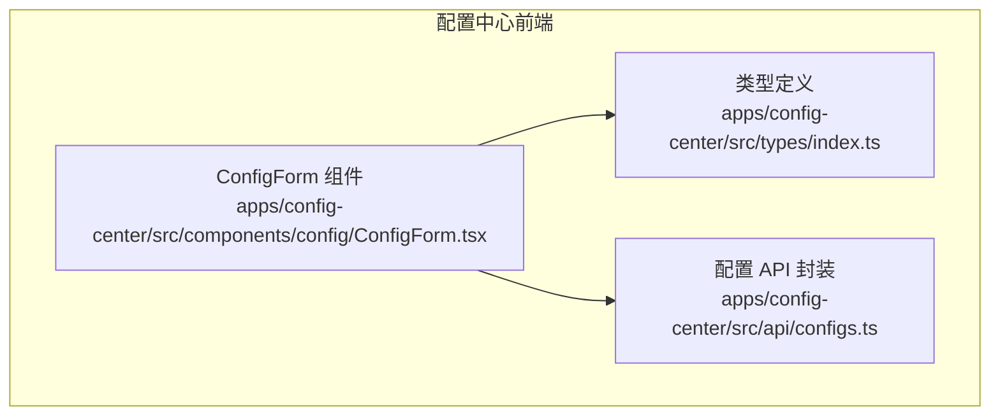
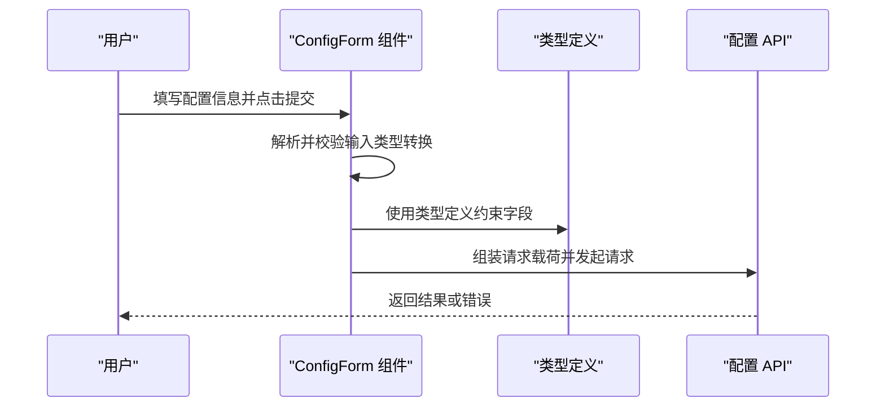
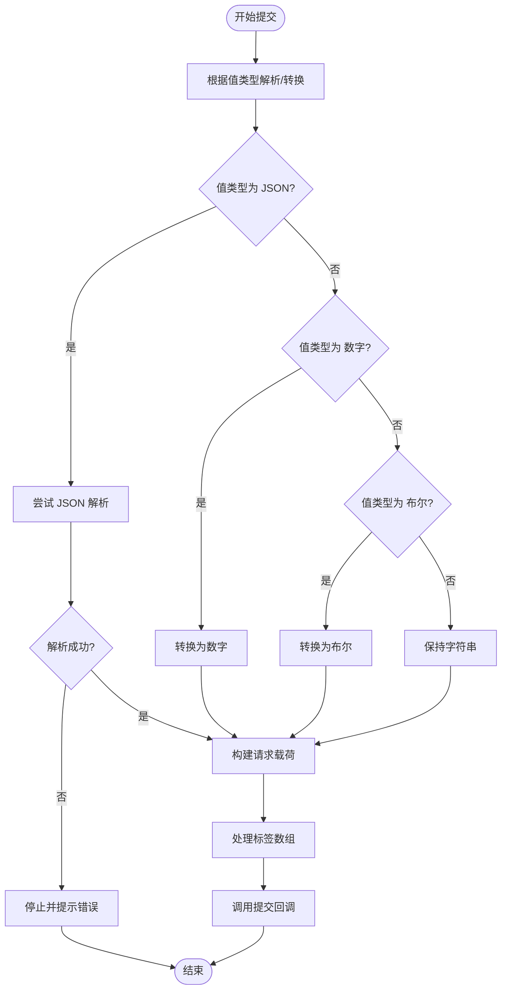
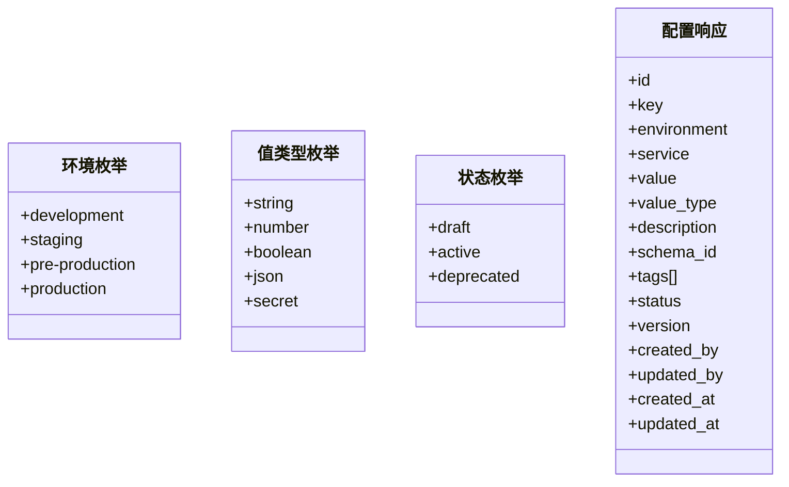
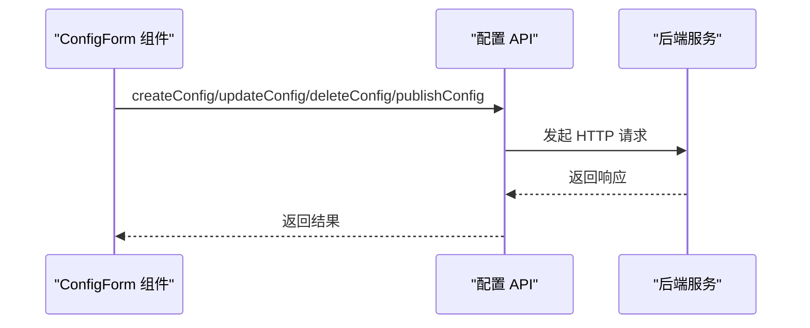
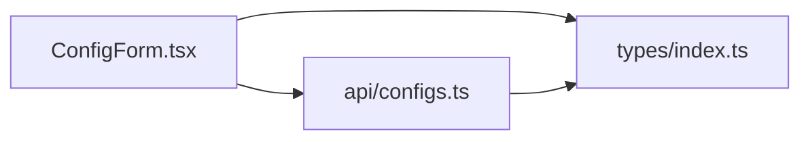

# 验证机制实现

<cite>
**本文引用的文件**
- [apps/config-center/src/components/config/ConfigForm.tsx](file://apps/config-center/src/components/config/ConfigForm.tsx)
- [apps/config-center/src/api/configs.ts](file://apps/config-center/src/api/configs.ts)
- [apps/config-center/src/types/index.ts](file://apps/config-center/src/types/index.ts)
</cite>

## 目录
1. [简介](#简介)
2. [项目结构](#项目结构)
3. [核心组件](#核心组件)
4. [架构总览](#架构总览)
5. [详细组件分析](#详细组件分析)
6. [依赖关系分析](#依赖关系分析)
7. [性能考虑](#性能考虑)
8. [故障排查指南](#故障排查指南)
9. [结论](#结论)
10. [附录](#附录)

## 简介
本文件聚焦于配置中心的验证机制实现，基于前端表单与后端接口的协作，梳理从输入解析到验证执行再到错误处理的完整流程。当前仓库中，验证逻辑主要体现在配置表单对用户输入的解析与类型转换，以及后端接口层对配置变更的请求参数封装。本文将围绕以下主题展开：基础验证器（类型解析）、特定验证器（JSON/数值/布尔/枚举）与验证注册表（概念性设计），并给出扩展与优化建议。

## 项目结构
配置中心前端位于 apps/config-center，关键文件包括：
- 表单组件：负责收集用户输入并进行基础解析与类型转换
- 类型定义：统一前后端数据契约，约束字段与取值范围
- API 层：封装 HTTP 请求，作为验证与业务处理的入口

**图表来源**
- [apps/config-center/src/components/config/ConfigForm.tsx:1-126](file://apps/config-center/src/components/config/ConfigForm.tsx#L1-L126)
- [apps/config-center/src/types/index.ts:1-163](file://apps/config-center/src/types/index.ts#L1-L163)
- [apps/config-center/src/api/configs.ts:1-33](file://apps/config-center/src/api/configs.ts#L1-L33)

**章节来源**
- [apps/config-center/src/components/config/ConfigForm.tsx:1-126](file://apps/config-center/src/components/config/ConfigForm.tsx#L1-L126)
- [apps/config-center/src/types/index.ts:1-163](file://apps/config-center/src/types/index.ts#L1-L163)
- [apps/config-center/src/api/configs.ts:1-33](file://apps/config-center/src/api/configs.ts#L1-L33)

## 核心组件
- 配置表单组件：负责收集键、环境、服务、值类型、值、描述、标签、状态等字段；在提交时对值进行解析与类型转换，并按是否编辑模式组装请求载荷。
- 类型定义：明确环境、值类型、状态等枚举取值，确保前后端一致。
- API 封装：提供列表、查询、创建、更新、删除、发布等操作，作为验证与业务处理的入口。

**章节来源**
- [apps/config-center/src/components/config/ConfigForm.tsx:13-55](file://apps/config-center/src/components/config/ConfigForm.tsx#L13-L55)
- [apps/config-center/src/types/index.ts:3-50](file://apps/config-center/src/types/index.ts#L3-L50)
- [apps/config-center/src/api/configs.ts:4-32](file://apps/config-center/src/api/configs.ts#L4-L32)

## 架构总览
下图展示了从前端表单到后端 API 的调用链路，体现验证与处理的关键节点：

**图表来源**
- [apps/config-center/src/components/config/ConfigForm.tsx:29-55](file://apps/config-center/src/components/config/ConfigForm.tsx#L29-L55)
- [apps/config-center/src/types/index.ts:3-50](file://apps/config-center/src/types/index.ts#L3-L50)
- [apps/config-center/src/api/configs.ts:18-32](file://apps/config-center/src/api/configs.ts#L18-L32)

## 详细组件分析

### 配置表单组件（验证与解析）
该组件承担了基础验证与解析职责：
- 输入收集：键、环境、服务、值类型、值、描述、标签、状态
- 值解析与类型转换：根据值类型对字符串进行 JSON 解析、数值转换、布尔转换
- 载荷组装：非编辑模式下补充键、环境、服务；处理标签数组；设置状态
- 错误处理：当 JSON 解析失败时中断提交流程

**图表来源**
- [apps/config-center/src/components/config/ConfigForm.tsx:29-55](file://apps/config-center/src/components/config/ConfigForm.tsx#L29-L55)

**章节来源**
- [apps/config-center/src/components/config/ConfigForm.tsx:13-55](file://apps/config-center/src/components/config/ConfigForm.tsx#L13-L55)

### 类型定义（枚举与契约）
类型定义明确了配置的核心字段与取值范围，为验证提供约束依据：
- 环境枚举：限定环境取值集合
- 值类型枚举：限定值的序列化/存储类型
- 状态枚举：限定配置生命周期状态
- 配置响应结构：统一返回字段，包含版本、审计信息等

**图表来源**
- [apps/config-center/src/types/index.ts:3-50](file://apps/config-center/src/types/index.ts#L3-L50)

**章节来源**
- [apps/config-center/src/types/index.ts:3-50](file://apps/config-center/src/types/index.ts#L3-L50)

### API 封装（请求与路由）
API 封装提供了配置的增删改查与发布操作，作为验证与业务处理的入口：
- 列表查询、详情获取、创建、更新、删除、发布
- 参数透传与响应类型约束

**图表来源**
- [apps/config-center/src/api/configs.ts:4-32](file://apps/config-center/src/api/configs.ts#L4-L32)

**章节来源**
- [apps/config-center/src/api/configs.ts:4-32](file://apps/config-center/src/api/configs.ts#L4-L32)

## 依赖关系分析
- 表单组件依赖类型定义以确保字段与取值合法
- 表单组件通过 API 封装与后端交互
- 类型定义为表单与 API 提供统一的数据契约

**图表来源**
- [apps/config-center/src/components/config/ConfigForm.tsx:1-126](file://apps/config-center/src/components/config/ConfigForm.tsx#L1-L126)
- [apps/config-center/src/types/index.ts:1-163](file://apps/config-center/src/types/index.ts#L1-L163)
- [apps/config-center/src/api/configs.ts:1-33](file://apps/config-center/src/api/configs.ts#L1-L33)

**章节来源**
- [apps/config-center/src/components/config/ConfigForm.tsx:1-126](file://apps/config-center/src/components/config/ConfigForm.tsx#L1-L126)
- [apps/config-center/src/types/index.ts:1-163](file://apps/config-center/src/types/index.ts#L1-L163)
- [apps/config-center/src/api/configs.ts:1-33](file://apps/config-center/src/api/configs.ts#L1-L33)

## 性能考虑
- 前端解析复杂度：JSON 解析与字符串处理为 O(n)，其中 n 为输入长度；建议对大 JSON 进行分步处理与节流
- 渲染优化：使用受控组件与最小化重渲染策略
- 网络请求：合并与去抖动请求，避免重复提交
- 后端处理：在 API 层增加幂等性与缓存策略，减少重复计算

## 故障排查指南
- JSON 解析失败：当值类型为 JSON 且解析异常时，表单会中断提交。请检查 JSON 格式与语法
- 类型不匹配：确保值类型与实际值一致（例如数值应为数字而非字符串）
- 必填字段缺失：键、服务等必填字段为空会导致提交失败
- 标签格式：标签应为逗号分隔的字符串，注意去除空项

**章节来源**
- [apps/config-center/src/components/config/ConfigForm.tsx:32-42](file://apps/config-center/src/components/config/ConfigForm.tsx#L32-L42)

## 结论
当前配置中心的验证机制以“前端表单解析 + 类型约束 + API 封装”为核心，实现了基础的输入解析与类型转换。为进一步完善验证体系，建议引入更丰富的验证器（如范围、正则、枚举）与集中式验证注册表，以提升可维护性与扩展性。

## 附录
- 扩展建议
  - 引入验证器注册表：将不同类型的验证器（JSON、范围、正则、枚举）注册到统一注册表，支持动态加载与优先级排序
  - 分层验证：前端轻量验证 + 后端强约束验证，保证一致性
  - 自定义验证器开发：提供接口规范与示例，便于业务扩展