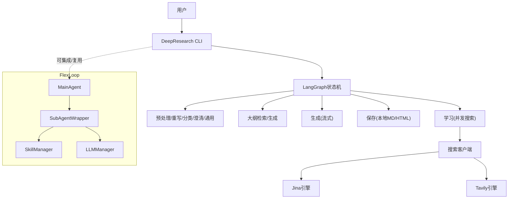
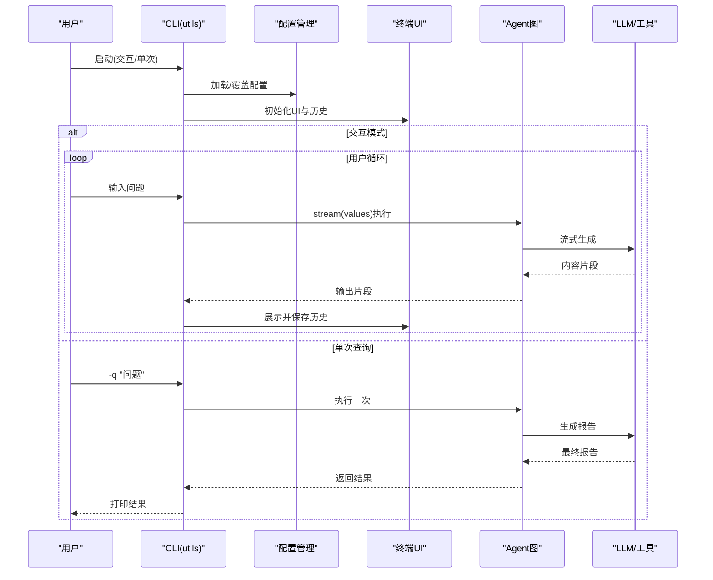
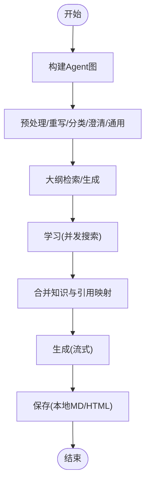
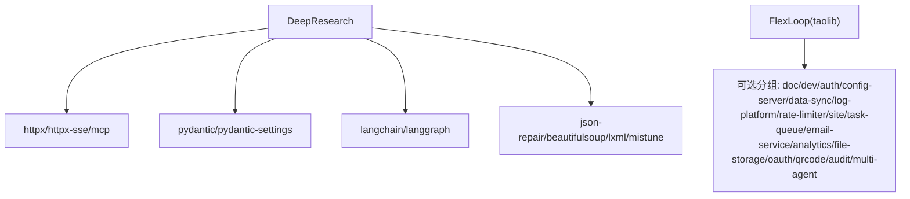

# 工具链系统

<cite>
**本文引用的文件**
- [tools/DeepResearch/src/deepresearch/__init__.py](file://tools/DeepResearch/src/deepresearch/__init__.py)
- [tools/DeepResearch/pyproject.toml](file://tools/DeepResearch/pyproject.toml)
- [tools/DeepResearch/doc/index.rst](file://tools/DeepResearch/doc/index.rst)
- [tools/DeepResearch/src/deepresearch/cli/utils.py](file://tools/DeepResearch/src/deepresearch/cli/utils.py)
- [tools/DeepResearch/src/deepresearch/agent/agent.py](file://tools/DeepResearch/src/deepresearch/agent/agent.py)
- [tools/DeepResearch/src/deepresearch/agent/generate.py](file://tools/DeepResearch/src/deepresearch/agent/generate.py)
- [tools/DeepResearch/src/deepresearch/agent/learning.py](file://tools/DeepResearch/src/deepresearch/agent/learning.py)
- [tools/DeepResearch/src/deepresearch/agent/message.py](file://tools/DeepResearch/src/deepresearch/agent/message.py)
- [tools/DeepResearch/src/deepresearch/tools/search.py](file://tools/DeepResearch/src/deepresearch/tools/search.py)
- [tools/DeepResearch/src/deepresearch/config/base.py](file://tools/DeepResearch/src/deepresearch/config/base.py)
- [tools/DeepResearch/config/workflow.toml](file://tools/DeepResearch/config/workflow.toml)
- [tools/DeepResearch/config/search.toml](file://tools/DeepResearch/config/search.toml)
- [tools/DeepResearch/config/llms.toml](file://tools/DeepResearch/config/llms.toml)
- [tools/flexloop/pyproject.toml](file://tools/flexloop/pyproject.toml)
- [tools/flexloop/README.md](file://tools/flexloop/README.md)
- [tools/flexloop/examples/multi_agent_example.py](file://tools/flexloop/examples/multi_agent_example.py)
- [tools/flexloop/src/taolib/__init__.py](file://tools/flexloop/src/taolib/__init__.py)
- [tools/flexloop/src/taolib/testing/multi_agent/__init__.py](file://tools/flexloop/src/taolib/testing/multi_agent/__init__.py)
</cite>

## 目录
1. [简介](#简介)
2. [项目结构](#项目结构)
3. [核心组件](#核心组件)
4. [架构总览](#架构总览)
5. [详细组件分析](#详细组件分析)
6. [依赖分析](#依赖分析)
7. [性能考虑](#性能考虑)
8. [故障排查指南](#故障排查指南)
9. [结论](#结论)
10. [附录](#附录)

## 简介
本文件面向DAOApps工具链系统，聚焦两大子系统：
- DeepResearch：基于多LLM协作的深度研究框架，集成搜索与可视化输出，提供CLI交互与单次查询能力。
- FlexLoop：多智能体工作流引擎，支持容器化部署、多Agent编排与文件分析等能力，提供示例与可扩展的模块化架构。

本文将从系统架构、组件职责、数据与控制流、配置管理、性能优化与扩展机制等方面进行深入说明，并给出使用示例与集成指导，解释工具链在整个DAO生态中的价值定位。

## 项目结构
DAOApps仓库采用多工具链并行组织方式，其中：
- tools/DeepResearch：Python包，提供CLI与研究流程编排；核心位于src/deepresearch，配置位于config。
- tools/flexloop：Python包，提供多智能体与工作流能力；核心位于src/taolib，示例位于examples。

```mermaid
graph TB
subgraph "DeepResearch"
DR_CLI["CLI入口<br/>tools/DeepResearch/src/deepresearch/cli/utils.py"]
DR_Agent["Agent图构建<br/>tools/DeepResearch/src/deepresearch/agent/agent.py"]
DR_Gen["生成节点<br/>tools/DeepResearch/src/deepresearch/agent/generate.py"]
DR_Learn["学习节点<br/>tools/DeepResearch/src/deepresearch/agent/learning.py"]
DR_Search["搜索客户端<br/>tools/DeepResearch/src/deepresearch/tools/search.py"]
DR_Config["配置管理<br/>tools/DeepResearch/src/deepresearch/config/base.py"]
DR_PyProj["依赖与脚本<br/>tools/DeepResearch/pyproject.toml"]
end
subgraph "FlexLoop"
FL_Example["多智能体示例<br/>tools/flexloop/examples/multi_agent_example.py"]
FL_API["多智能体导出API<br/>tools/flexloop/src/taolib/testing/multi_agent/__init__.py"]
FL_Readme["使用说明<br/>tools/flexloop/README.md"]
FL_PyProj["依赖与分组<br/>tools/flexloop/pyproject.toml"]
end
DR_CLI --> DR_Agent
DR_Agent --> DR_Gen
DR_Agent --> DR_Learn
DR_Learn --> DR_Search
DR_CLI --> DR_Config
DR_PyProj -.-> DR_CLI
FL_Example --> FL_API
FL_Readme -.-> FL_Example
FL_PyProj -.-> FL_API
```

**图表来源**
- [tools/DeepResearch/src/deepresearch/cli/utils.py:1-575](file://tools/DeepResearch/src/deepresearch/cli/utils.py#L1-L575)
- [tools/DeepResearch/src/deepresearch/agent/agent.py:1-45](file://tools/DeepResearch/src/deepresearch/agent/agent.py#L1-L45)
- [tools/DeepResearch/src/deepresearch/agent/generate.py:1-343](file://tools/DeepResearch/src/deepresearch/agent/generate.py#L1-L343)
- [tools/DeepResearch/src/deepresearch/agent/learning.py:1-129](file://tools/DeepResearch/src/deepresearch/agent/learning.py#L1-L129)
- [tools/DeepResearch/src/deepresearch/tools/search.py:1-46](file://tools/DeepResearch/src/deepresearch/tools/search.py#L1-L46)
- [tools/DeepResearch/src/deepresearch/config/base.py:1-590](file://tools/DeepResearch/src/deepresearch/config/base.py#L1-L590)
- [tools/DeepResearch/pyproject.toml:1-93](file://tools/DeepResearch/pyproject.toml#L1-L93)
- [tools/flexloop/examples/multi_agent_example.py:1-196](file://tools/flexloop/examples/multi_agent_example.py#L1-L196)
- [tools/flexloop/src/taolib/testing/multi_agent/__init__.py:1-181](file://tools/flexloop/src/taolib/testing/multi_agent/__init__.py#L1-L181)
- [tools/flexloop/README.md:1-100](file://tools/flexloop/README.md#L1-L100)
- [tools/flexloop/pyproject.toml:1-318](file://tools/flexloop/pyproject.toml#L1-L318)

**章节来源**
- [tools/DeepResearch/doc/index.rst:1-41](file://tools/DeepResearch/doc/index.rst#L1-L41)
- [tools/DeepResearch/pyproject.toml:1-93](file://tools/DeepResearch/pyproject.toml#L1-L93)
- [tools/flexloop/README.md:1-100](file://tools/flexloop/README.md#L1-L100)

## 核心组件
- DeepResearch CLI与运行时
  - CLI入口负责参数解析、配置加载、信号处理、交互与单次查询模式切换，并驱动LangGraph状态机执行。
  - 关键文件：[tools/DeepResearch/src/deepresearch/cli/utils.py:1-575](file://tools/DeepResearch/src/deepresearch/cli/utils.py#L1-L575)
- 多LLM协作Agent图
  - 通过StateGraph定义预处理、重写、分类、澄清、通用处理、大纲检索与生成、学习、保存等节点与条件边。
  - 关键文件：[tools/DeepResearch/src/deepresearch/agent/agent.py:1-45](file://tools/DeepResearch/src/deepresearch/agent/agent.py#L1-L45)
- 生成与可视化输出
  - 生成节点将章节知识与大纲结合，流式生成报告正文；保存节点负责本地Markdown与HTML输出。
  - 关键文件：[tools/DeepResearch/src/deepresearch/agent/generate.py:1-343](file://tools/DeepResearch/src/deepresearch/agent/generate.py#L1-L343)
- 搜索与学习
  - 学习节点并发执行DeepSearch，聚合检索结果与引用映射，支持多线程与锁保证一致性。
  - 关键文件：[tools/DeepResearch/src/deepresearch/agent/learning.py:1-129](file://tools/DeepResearch/src/deepresearch/agent/learning.py#L1-L129)
- 搜索客户端
  - 根据配置选择Jina或Tavily搜索引擎，封装统一接口。
  - 关键文件：[tools/DeepResearch/src/deepresearch/tools/search.py:1-46](file://tools/DeepResearch/src/deepresearch/tools/search.py#L1-L46)
- 配置管理
  - 支持默认、文件、环境变量、代码四层覆盖；提供敏感字段脱敏与缓存清理。
  - 关键文件：[tools/DeepResearch/src/deepresearch/config/base.py:1-590](file://tools/DeepResearch/src/deepresearch/config/base.py#L1-L590)
- FlexLoop多智能体
  - 提供AgentFactory、MainAgent、SkillManager、LLMManager等模块化能力，示例展示技能使用、智能体创建与负载均衡。
  - 关键文件：[tools/flexloop/examples/multi_agent_example.py:1-196](file://tools/flexloop/examples/multi_agent_example.py#L1-L196)，[tools/flexloop/src/taolib/testing/multi_agent/__init__.py:1-181](file://tools/flexloop/src/taolib/testing/multi_agent/__init__.py#L1-L181)

**章节来源**
- [tools/DeepResearch/src/deepresearch/cli/utils.py:1-575](file://tools/DeepResearch/src/deepresearch/cli/utils.py#L1-L575)
- [tools/DeepResearch/src/deepresearch/agent/agent.py:1-45](file://tools/DeepResearch/src/deepresearch/agent/agent.py#L1-L45)
- [tools/DeepResearch/src/deepresearch/agent/generate.py:1-343](file://tools/DeepResearch/src/deepresearch/agent/generate.py#L1-L343)
- [tools/DeepResearch/src/deepresearch/agent/learning.py:1-129](file://tools/DeepResearch/src/deepresearch/agent/learning.py#L1-L129)
- [tools/DeepResearch/src/deepresearch/tools/search.py:1-46](file://tools/DeepResearch/src/deepresearch/tools/search.py#L1-L46)
- [tools/DeepResearch/src/deepresearch/config/base.py:1-590](file://tools/DeepResearch/src/deepresearch/config/base.py#L1-L590)
- [tools/flexloop/examples/multi_agent_example.py:1-196](file://tools/flexloop/examples/multi_agent_example.py#L1-L196)
- [tools/flexloop/src/taolib/testing/multi_agent/__init__.py:1-181](file://tools/flexloop/src/taolib/testing/multi_agent/__init__.py#L1-L181)

## 架构总览
DeepResearch采用“CLI → Agent图 → LLM/搜索/工具”的流水线式架构；FlexLoop提供多智能体与工作流能力，二者在DAOApps中分别承担“研究与报告”和“编排与任务”的角色。

**图表来源**
- [tools/DeepResearch/src/deepresearch/cli/utils.py:1-575](file://tools/DeepResearch/src/deepresearch/cli/utils.py#L1-L575)
- [tools/DeepResearch/src/deepresearch/agent/agent.py:1-45](file://tools/DeepResearch/src/deepresearch/agent/agent.py#L1-L45)
- [tools/DeepResearch/src/deepresearch/agent/generate.py:1-343](file://tools/DeepResearch/src/deepresearch/agent/generate.py#L1-L343)
- [tools/DeepResearch/src/deepresearch/agent/learning.py:1-129](file://tools/DeepResearch/src/deepresearch/agent/learning.py#L1-L129)
- [tools/DeepResearch/src/deepresearch/tools/search.py:1-46](file://tools/DeepResearch/src/deepresearch/tools/search.py#L1-L46)
- [tools/flexloop/examples/multi_agent_example.py:1-196](file://tools/flexloop/examples/multi_agent_example.py#L1-L196)

## 详细组件分析

### DeepResearch CLI与交互流程
- 功能要点
  - 参数解析与配置覆盖：支持深度、HTML保存、输出路径、日志级别、主题、配置目录等。
  - 信号处理：捕获SIGINT/SIGTERM，优雅中断。
  - 交互模式：支持help/history/clear/search等命令；单次查询模式直接返回结果。
  - 运行时：构建Agent图，按流式values迭代，提取输出并追加到消息历史。
- 关键流程序列图

**图表来源**
- [tools/DeepResearch/src/deepresearch/cli/utils.py:1-575](file://tools/DeepResearch/src/deepresearch/cli/utils.py#L1-L575)
- [tools/DeepResearch/src/deepresearch/agent/agent.py:1-45](file://tools/DeepResearch/src/deepresearch/agent/agent.py#L1-L45)

**章节来源**
- [tools/DeepResearch/src/deepresearch/cli/utils.py:1-575](file://tools/DeepResearch/src/deepresearch/cli/utils.py#L1-L575)

### 多LLM协作与搜索集成
- Agent图节点
  - 预处理/重写/分类/澄清/通用 → 大纲检索/生成 → 学习(并发) → 生成 → 保存。
- 并发学习与引用映射
  - 使用线程池限制并发度，为每个章节分配独立搜索ID，完成后回填真实引用ID。
- 搜索客户端
  - 根据配置选择引擎，统一返回SearchResult列表。

**图表来源**
- [tools/DeepResearch/src/deepresearch/agent/agent.py:1-45](file://tools/DeepResearch/src/deepresearch/agent/agent.py#L1-L45)
- [tools/DeepResearch/src/deepresearch/agent/learning.py:1-129](file://tools/DeepResearch/src/deepresearch/agent/learning.py#L1-L129)
- [tools/DeepResearch/src/deepresearch/agent/generate.py:1-343](file://tools/DeepResearch/src/deepresearch/agent/generate.py#L1-L343)
- [tools/DeepResearch/src/deepresearch/tools/search.py:1-46](file://tools/DeepResearch/src/deepresearch/tools/search.py#L1-L46)

**章节来源**
- [tools/DeepResearch/src/deepresearch/agent/agent.py:1-45](file://tools/DeepResearch/src/deepresearch/agent/agent.py#L1-L45)
- [tools/DeepResearch/src/deepresearch/agent/learning.py:1-129](file://tools/DeepResearch/src/deepresearch/agent/learning.py#L1-L129)
- [tools/DeepResearch/src/deepresearch/agent/generate.py:1-343](file://tools/DeepResearch/src/deepresearch/agent/generate.py#L1-L343)
- [tools/DeepResearch/src/deepresearch/tools/search.py:1-46](file://tools/DeepResearch/src/deepresearch/tools/search.py#L1-L46)

### 可视化输出与报告保存
- Markdown到HTML转换：将最终报告与参考文献合并，输出MD与HTML文件。
- 内嵌图表：识别<chart>标签，调用LLM生成ECharts配置，注入自定义HTML容器。
- 关键实现位置：[tools/DeepResearch/src/deepresearch/agent/generate.py:1-343](file://tools/DeepResearch/src/deepresearch/agent/generate.py#L1-L343)

**章节来源**
- [tools/DeepResearch/src/deepresearch/agent/generate.py:1-343](file://tools/DeepResearch/src/deepresearch/agent/generate.py#L1-L343)

### 配置管理与环境覆盖
- 配置来源与优先级
  - 代码默认 → 环境变量 → 配置文件 → 默认值。
  - 支持敏感字段脱敏、缓存清理、自定义配置目录。
- 关键实现位置：[tools/DeepResearch/src/deepresearch/config/base.py:1-590](file://tools/DeepResearch/src/deepresearch/config/base.py#L1-L590)
- 配置样例
  - 引擎与超时：[tools/DeepResearch/config/search.toml:1-6](file://tools/DeepResearch/config/search.toml#L1-L6)
  - 搜索topN：[tools/DeepResearch/config/workflow.toml:1-3](file://tools/DeepResearch/config/workflow.toml#L1-L3)
  - LLM分角色配置：[tools/DeepResearch/config/llms.toml:1-29](file://tools/DeepResearch/config/llms.toml#L1-L29)

**章节来源**
- [tools/DeepResearch/src/deepresearch/config/base.py:1-590](file://tools/DeepResearch/src/deepresearch/config/base.py#L1-L590)
- [tools/DeepResearch/config/search.toml:1-6](file://tools/DeepResearch/config/search.toml#L1-L6)
- [tools/DeepResearch/config/workflow.toml:1-3](file://tools/DeepResearch/config/workflow.toml#L1-L3)
- [tools/DeepResearch/config/llms.toml:1-29](file://tools/DeepResearch/config/llms.toml#L1-L29)

### FlexLoop多智能体与容器化部署
- 能力概览
  - 智能体工厂、主智能体、子智能体包装、技能管理、LLM管理与负载均衡。
  - 示例演示：技能注册与执行、智能体创建、主智能体生命周期、LLM配置与轮询策略。
- 容器化部署
  - 项目提供可选依赖分组与构建配置，便于打包与发布；README提供安装与文档构建指引。
- 关键实现位置
  - 示例：[tools/flexloop/examples/multi_agent_example.py:1-196](file://tools/flexloop/examples/multi_agent_example.py#L1-L196)
  - 导出API：[tools/flexloop/src/taolib/testing/multi_agent/__init__.py:1-181](file://tools/flexloop/src/taolib/testing/multi_agent/__init__.py#L1-L181)
  - 依赖与分组：[tools/flexloop/pyproject.toml:1-318](file://tools/flexloop/pyproject.toml#L1-L318)
  - 使用说明：[tools/flexloop/README.md:1-100](file://tools/flexloop/README.md#L1-L100)

**章节来源**
- [tools/flexloop/examples/multi_agent_example.py:1-196](file://tools/flexloop/examples/multi_agent_example.py#L1-L196)
- [tools/flexloop/src/taolib/testing/multi_agent/__init__.py:1-181](file://tools/flexloop/src/taolib/testing/multi_agent/__init__.py#L1-L181)
- [tools/flexloop/pyproject.toml:1-318](file://tools/flexloop/pyproject.toml#L1-L318)
- [tools/flexloop/README.md:1-100](file://tools/flexloop/README.md#L1-L100)

## 依赖分析
- DeepResearch依赖
  - HTTP与SSE、MCP、Pydantic与Settings、LangChain/LangGraph、JSON修复、解析库、Markdown渲染等。
  - CLI入口注册为命令行脚本。
- FlexLoop依赖
  - 提供丰富的可选依赖分组（文档、开发、认证、配置中心、数据同步、日志平台、限流、站点、任务队列、邮件、分析、文件存储、OAuth、二维码、审计、多智能体等），便于按需安装与容器化打包。

**图表来源**
- [tools/DeepResearch/pyproject.toml:1-93](file://tools/DeepResearch/pyproject.toml#L1-L93)
- [tools/flexloop/pyproject.toml:1-318](file://tools/flexloop/pyproject.toml#L1-L318)

**章节来源**
- [tools/DeepResearch/pyproject.toml:1-93](file://tools/DeepResearch/pyproject.toml#L1-L93)
- [tools/flexloop/pyproject.toml:1-318](file://tools/flexloop/pyproject.toml#L1-L318)

## 性能考虑
- 并发与限流
  - 学习节点使用线程池限制最大并发，避免LLM API过载；可根据实际资源调整max_workers。
  - LLM管理器支持轮询策略，可结合限流中间件实现全局速率控制。
- I/O与缓存
  - 配置文件读取使用LRU缓存；报告保存先写MD再转HTML，减少重复计算。
- 流式输出
  - 生成节点采用流式输出，降低首屏延迟；终端UI按片段实时渲染。
- 可观测性
  - CLI支持日志级别与文件输出；配置管理支持敏感字段脱敏，便于安全审计。

[本节为通用性能建议，不直接分析具体文件，故无“章节来源”]

## 故障排查指南
- 常见问题
  - 配置目录无效或不可读：CLI会抛出配置错误；检查路径存在性与权限。
  - 搜索引擎密钥缺失：根据配置engine选择对应API Key，确保环境变量或文件配置正确。
  - LLM返回异常：检查LLM分角色配置与网络连通性；必要时启用更详细的日志级别。
  - 报告保存失败：确认输出目录可写；查看日志中的错误信息。
- 关键实现位置
  - CLI异常与日志：[tools/DeepResearch/src/deepresearch/cli/utils.py:1-575](file://tools/DeepResearch/src/deepresearch/cli/utils.py#L1-L575)
  - 配置加载与校验：[tools/DeepResearch/src/deepresearch/config/base.py:1-590](file://tools/DeepResearch/src/deepresearch/config/base.py#L1-L590)

**章节来源**
- [tools/DeepResearch/src/deepresearch/cli/utils.py:1-575](file://tools/DeepResearch/src/deepresearch/cli/utils.py#L1-L575)
- [tools/DeepResearch/src/deepresearch/config/base.py:1-590](file://tools/DeepResearch/src/deepresearch/config/base.py#L1-L590)

## 结论
DAOApps工具链通过DeepResearch与FlexLoop形成“研究—编排”的双引擎架构：前者以多LLM协作与可视化输出为核心，后者以多智能体与可扩展模块化能力为核心。两者均具备完善的配置管理、可观测性与可扩展性，适合在DAO生态中作为基础设施组件，支撑知识发现、任务编排与自动化工作流。

[本节为总结性内容，不直接分析具体文件，故无“章节来源”]

## 附录

### 使用示例与集成指导
- DeepResearch
  - 交互模式：启动CLI后输入问题，支持help/history/clear/search等命令。
  - 单次查询：使用-q参数直接获取结果。
  - 配置覆盖：通过环境变量或自定义配置目录覆盖默认行为。
  - 参考实现：[tools/DeepResearch/src/deepresearch/cli/utils.py:1-575](file://tools/DeepResearch/src/deepresearch/cli/utils.py#L1-L575)
- FlexLoop
  - 安装与文档：参见README与pyproject可选分组。
  - 多智能体示例：展示技能使用、智能体创建、主智能体生命周期与LLM管理。
  - 参考实现：[tools/flexloop/README.md:1-100](file://tools/flexloop/README.md#L1-L100)，[tools/flexloop/examples/multi_agent_example.py:1-196](file://tools/flexloop/examples/multi_agent_example.py#L1-L196)

**章节来源**
- [tools/DeepResearch/src/deepresearch/cli/utils.py:1-575](file://tools/DeepResearch/src/deepresearch/cli/utils.py#L1-L575)
- [tools/flexloop/README.md:1-100](file://tools/flexloop/README.md#L1-L100)
- [tools/flexloop/examples/multi_agent_example.py:1-196](file://tools/flexloop/examples/multi_agent_example.py#L1-L196)