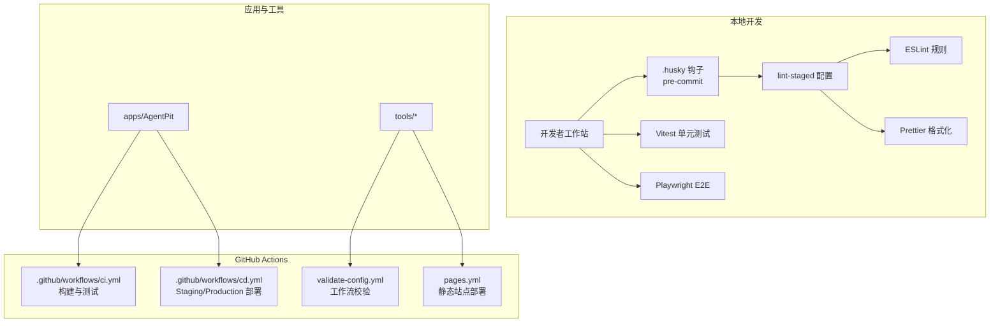
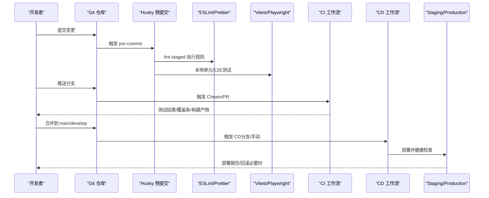
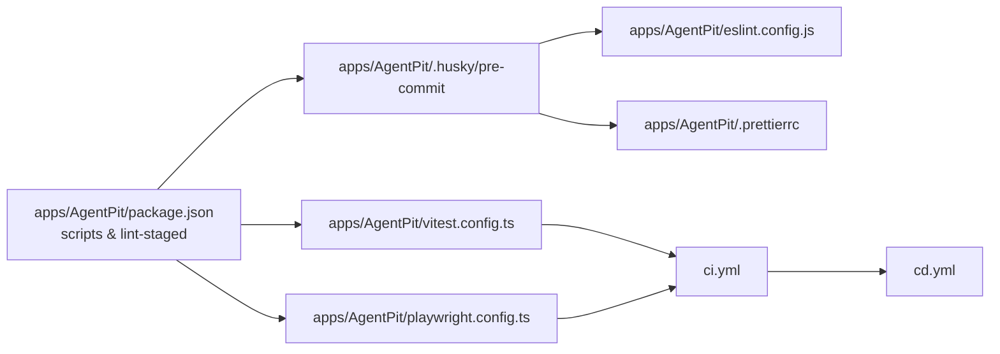

# Git工作流

<cite>
**本文引用的文件**
- [.github/workflows/ci.yml](file://.github/workflows/ci.yml)
- [.github/workflows/cd.yml](file://.github/workflows/cd.yml)
- [apps/AgentPit/package.json](file://apps/AgentPit/package.json)
- [apps/AgentPit/.husky/pre-commit](file://apps/AgentPit/.husky/pre-commit)
- [apps/AgentPit/eslint.config.js](file://apps/AgentPit/eslint.config.js)
- [apps/AgentPit/vitest.config.ts](file://apps/AgentPit/vitest.config.ts)
- [apps/AgentPit/playwright.config.ts](file://apps/AgentPit/playwright.config.ts)
- [.prettierrc](file://.prettierrc)
- [.gitignore](file://.gitignore)
- [.trae/tasks/Git分支管理与发布流程.md](file://.trae/tasks/Git分支管理与发布流程.md)
- [.trae/specs/agentpit-production-readiness/checklist.md](file://.trae/specs/agentpit-production-readiness/checklist.md)
- [.trae/specs/agentpit-performance-cd/tasks.md](file://.trae/specs/agentpit-performance-cd/tasks.md)
- [tools/DeepResearch/.github/workflows/validate-config.yml](file://tools/DeepResearch/.github/workflows/validate-config.yml)
- [tools/flexloop/.github/workflows/pages.yml](file://tools/flexloop/.github/workflows/pages.yml)
</cite>

## 目录
1. [引言](#引言)
2. [项目结构](#项目结构)
3. [核心组件](#核心组件)
4. [架构总览](#架构总览)
5. [详细组件分析](#详细组件分析)
6. [依赖分析](#依赖分析)
7. [性能考虑](#性能考虑)
8. [故障排查指南](#故障排查指南)
9. [结论](#结论)
10. [附录](#附录)

## 引言
本指南面向DAOApps项目团队，提供一套完整的Git工作流规范，涵盖分支管理策略、提交规范、合并流程、Husky钩子与预提交检查、自动化测试与CI/CD、版本标签与发布、回滚策略、团队协作与冲突解决、以及分支清理策略。目标是统一开发节奏、提升代码质量、降低发布风险，并确保跨应用与多仓库场景下的协同一致性。

## 项目结构
DAOApps采用多应用与多仓库混合结构，核心前端应用位于apps/AgentPit，另有多个独立应用与工具仓库。CI/CD流水线集中在GitHub Actions中，配合Husky与lint-staged在本地执行预提交检查，结合ESLint、Prettier与Vitest等工具形成质量门禁。

图表来源
- [.github/workflows/ci.yml:1-67](file://.github/workflows/ci.yml#L1-L67)
- [.github/workflows/cd.yml:1-247](file://.github/workflows/cd.yml#L1-L247)
- [apps/AgentPit/package.json:1-74](file://apps/AgentPit/package.json#L1-L74)
- [apps/AgentPit/.husky/pre-commit:1-2](file://apps/AgentPit/.husky/pre-commit#L1-L2)
- [apps/AgentPit/eslint.config.js:1-162](file://apps/AgentPit/eslint.config.js#L1-L162)
- [apps/AgentPit/vitest.config.ts:1-48](file://apps/AgentPit/vitest.config.ts#L1-L48)
- [apps/AgentPit/playwright.config.ts:1-28](file://apps/AgentPit/playwright.config.ts#L1-L28)
- [tools/DeepResearch/.github/workflows/validate-config.yml:1-55](file://tools/DeepResearch/.github/workflows/validate-config.yml#L1-L55)
- [tools/flexloop/.github/workflows/pages.yml:1-48](file://tools/flexloop/.github/workflows/pages.yml#L1-L48)

章节来源
- [.github/workflows/ci.yml:1-67](file://.github/workflows/ci.yml#L1-L67)
- [.github/workflows/cd.yml:1-247](file://.github/workflows/cd.yml#L1-L247)
- [apps/AgentPit/package.json:1-74](file://apps/AgentPit/package.json#L1-L74)
- [apps/AgentPit/.husky/pre-commit:1-2](file://apps/AgentPit/.husky/pre-commit#L1-L2)
- [apps/AgentPit/eslint.config.js:1-162](file://apps/AgentPit/eslint.config.js#L1-L162)
- [apps/AgentPit/vitest.config.ts:1-48](file://apps/AgentPit/vitest.config.ts#L1-L48)
- [apps/AgentPit/playwright.config.ts:1-28](file://apps/AgentPit/playwright.config.ts#L1-L28)
- [tools/DeepResearch/.github/workflows/validate-config.yml:1-55](file://tools/DeepResearch/.github/workflows/validate-config.yml#L1-L55)
- [tools/flexloop/.github/workflows/pages.yml:1-48](file://tools/flexloop/.github/workflows/pages.yml#L1-L48)

## 核心组件
- 本地质量门禁：Husky + lint-staged + ESLint + Prettier
- 自动化测试：Vitest（单元/覆盖率）+ Playwright（E2E）
- CI流水线：Node.js构建、类型检查、测试与覆盖率上传
- CD流水线：Staging/Production自动部署与健康检查，支持手动触发与回滚
- 配置校验：Actionlint语法校验与模板有效性检查
- 静态站点部署：GitHub Pages工作流

章节来源
- [apps/AgentPit/package.json:64-72](file://apps/AgentPit/package.json#L64-L72)
- [apps/AgentPit/.husky/pre-commit:1-2](file://apps/AgentPit/.husky/pre-commit#L1-L2)
- [apps/AgentPit/eslint.config.js:130-146](file://apps/AgentPit/eslint.config.js#L130-L146)
- [.prettierrc:1-1](file://.prettierrc#L1-L1)
- [apps/AgentPit/vitest.config.ts:11-36](file://apps/AgentPit/vitest.config.ts#L11-L36)
- [apps/AgentPit/playwright.config.ts:1-28](file://apps/AgentPit/playwright.config.ts#L1-L28)
- [.github/workflows/ci.yml:20-67](file://.github/workflows/ci.yml#L20-L67)
- [.github/workflows/cd.yml:19-247](file://.github/workflows/cd.yml#L19-L247)
- [tools/DeepResearch/.github/workflows/validate-config.yml:15-27](file://tools/DeepResearch/.github/workflows/validate-config.yml#L15-L27)

## 架构总览
下图展示从本地提交到CI/CD发布的端到端流程，强调质量门禁前置与自动化部署的协同。

图表来源
- [.github/workflows/ci.yml:3-7](file://.github/workflows/ci.yml#L3-L7)
- [.github/workflows/ci.yml:20-67](file://.github/workflows/ci.yml#L20-L67)
- [.github/workflows/cd.yml:3-18](file://.github/workflows/cd.yml#L3-L18)
- [.github/workflows/cd.yml:19-247](file://.github/workflows/cd.yml#L19-L247)
- [apps/AgentPit/.husky/pre-commit:1-2](file://apps/AgentPit/.husky/pre-commit#L1-L2)
- [apps/AgentPit/vitest.config.ts:7-41](file://apps/AgentPit/vitest.config.ts#L7-L41)
- [apps/AgentPit/playwright.config.ts:1-28](file://apps/AgentPit/playwright.config.ts#L1-L28)

## 详细组件分析

### 分支管理策略
- 主分支保护
  - main：承载生产就绪代码，触发CD至Production；建议启用“保护分支”限制直接推送，强制PR合并。
  - develop：承载集成与Staging发布，触发CD至Staging；建议开启“要求状态检查通过”。
- 功能分支
  - 命名：feature/xxx、feat/xxx；变更粒度适中，尽量短生命周期。
  - 合并与冲突：采用非快进式合并保留分支历史；冲突需Review与测试验证。
- 热修复分支
  - hotfix/xxx：从main切出，修复后同时合并回main与develop，并打补丁标签。
- 发布分支（可选）
  - release/xxx：用于发布前的最后校验与微调，完成后合并回main/develop并打标签。

章节来源
- [.trae/tasks/Git分支管理与发布流程.md:1-25](file://.trae/tasks/Git分支管理与发布流程.md#L1-L25)
- [.trae/specs/agentpit-production-readiness/checklist.md:95-153](file://.trae/specs/agentpit-production-readiness/checklist.md#L95-L153)

### 提交规范与信息模板
- 提交信息模板（建议）
  - type(scope): subject
  - body（可选）：变更动机、影响范围、迁移/回滚指引
  - footer（可选）：关联Issue/PR、Breaking Change、关闭Issue
- 提交类型参考
  - feat、fix、docs、style、refactor、perf、test、build、ci、chore、revert
- 与质量门禁联动
  - 本地pre-commit执行lint-staged，确保ESLint与Prettier先行拦截低质量提交。

章节来源
- [apps/AgentPit/package.json:64-72](file://apps/AgentPit/package.json#L64-L72)
- [apps/AgentPit/.husky/pre-commit:1-2](file://apps/AgentPit/.husky/pre-commit#L1-L2)
- [apps/AgentPit/eslint.config.js:130-146](file://apps/AgentPit/eslint.config.js#L130-L146)
- [.prettierrc:1-1](file://.prettierrc#L1-L1)

### 合并策略与Pull Request流程
- PR要求
  - 必须通过CI（构建、类型检查、测试、覆盖率）；本地已执行lint-staged与测试。
  - 至少一名Reviewer批准；阻塞式质量门禁未通过不得合并。
- 合并方式
  - 非快进式合并（--no-ff）保留分支历史；squash/fixup用于整理提交历史。
- 代码审查标准
  - 正确性、可读性、可维护性、安全性、性能与兼容性；关注复杂度与边界条件。
  - 对于重大变更，要求设计说明与测试覆盖。

章节来源
- [.github/workflows/ci.yml:20-67](file://.github/workflows/ci.yml#L20-L67)
- [.github/workflows/cd.yml:19-247](file://.github/workflows/cd.yml#L19-L247)
- [apps/AgentPit/vitest.config.ts:11-36](file://apps/AgentPit/vitest.config.ts#L11-L36)

### Husky钩子与预提交检查
- 配置要点
  - pre-commit：npx lint-staged，按package.json中lint-staged规则执行ESLint与Prettier。
  - 支持扩展：可增加TypeScript类型检查、单元测试等。
- lint-staged规则
  - JS/TS/Vue文件：eslint --fix + prettier --write
  - JSON/Markdown/CSS等：prettier --write

章节来源
- [apps/AgentPit/package.json:64-72](file://apps/AgentPit/package.json#L64-L72)
- [apps/AgentPit/.husky/pre-commit:1-2](file://apps/AgentPit/.husky/pre-commit#L1-L2)

### 自动化测试流程
- 单元测试（Vitest）
  - 环境：jsdom；覆盖率报告：text/json/html/lcov；阈值：行/函数/分支/语句≥80%。
  - 覆盖范围：组件、store、composables、utils；排除types/data/main等。
- E2E测试（Playwright）
  - 并行与重试策略；HTML报告；本地WebServer启动与端口配置。
- CI中的测试执行
  - CI流水线中运行测试与覆盖率收集，上传Codecov/lcov报告。

章节来源
- [apps/AgentPit/vitest.config.ts:7-41](file://apps/AgentPit/vitest.config.ts#L7-L41)
- [apps/AgentPit/playwright.config.ts:1-28](file://apps/AgentPit/playwright.config.ts#L1-L28)
- [.github/workflows/ci.yml:47-55](file://.github/workflows/ci.yml#L47-L55)

### 版本标签管理与发布流程
- 标签策略
  - annotated tag：git tag -a <tag> -m "<message>"；描述包含版本号、变更摘要、里程碑。
  - 命名：vX.Y.Z（语义化版本）；必要时附带rc、beta等后缀。
- 发布流程
  - 在main/develop上合并后打标签；推送标签触发CD至对应环境；生成部署报告。
- 回滚策略
  - 失败时自动回滚至最近一次稳定版本；生成回滚报告并归档。

章节来源
- [.trae/tasks/Git分支管理与发布流程.md:13](file://.trae/tasks/Git分支管理与发布流程.md#L13)
- [.github/workflows/cd.yml:209-247](file://.github/workflows/cd.yml#L209-L247)

### 回滚策略
- 触发条件：CD阶段失败或健康检查不通过。
- 执行步骤：回滚至备份/上一稳定版本；记录回滚报告并通知相关方。
- 预防措施：Staging充分验证、质量门禁严格、变更评审与灰度发布。

章节来源
- [.github/workflows/cd.yml:209-247](file://.github/workflows/cd.yml#L209-L247)

### 团队协作最佳实践
- 任务与复盘
  - 使用.Trae机制进行定期/不定期复盘，形成RCA与预防措施闭环。
- 代码审查
  - 明确审查标准与流程，鼓励建设性反馈与知识分享。
- 冲突解决
  - 优先通过沟通与小步快跑降低冲突；冲突必须通过Review与测试验证。
- 分支清理
  - 合并后及时删除已合并分支；hotfix/feature分支到期清理。

章节来源
- [.trae/reviews/README.md:1-336](file://.trae/reviews/README.md#L1-L336)

### 分支清理策略
- 清理时机：功能开发完成并合并后、热修复完成并发布后。
- 清理范围：本地与远程分支；确保不再需要的历史分支被移除。
- 注意事项：保留必要的备份分支（如backup-before-commits）以备回溯。

章节来源
- [.trae/specs/agentpit-production-readiness/checklist.md:95-153](file://.trae/specs/agentpit-production-readiness/checklist.md#L95-L153)

## 依赖分析
- 本地依赖
  - husky、lint-staged、eslint、prettier、vitest、playwright
- CI/CD依赖
  - Node.js、npm ci、构建脚本、覆盖率与报告上传
- 工作流校验
  - actionlint用于校验YAML语法与配置有效性

图表来源
- [apps/AgentPit/package.json:6-72](file://apps/AgentPit/package.json#L6-L72)
- [apps/AgentPit/.husky/pre-commit:1-2](file://apps/AgentPit/.husky/pre-commit#L1-L2)
- [apps/AgentPit/eslint.config.js:1-162](file://apps/AgentPit/eslint.config.js#L1-L162)
- [.prettierrc:1-1](file://.prettierrc#L1-L1)
- [apps/AgentPit/vitest.config.ts:1-48](file://apps/AgentPit/vitest.config.ts#L1-L48)
- [apps/AgentPit/playwright.config.ts:1-28](file://apps/AgentPit/playwright.config.ts#L1-L28)
- [.github/workflows/ci.yml:1-67](file://.github/workflows/ci.yml#L1-L67)
- [.github/workflows/cd.yml:1-247](file://.github/workflows/cd.yml#L1-L247)

章节来源
- [apps/AgentPit/package.json:6-72](file://apps/AgentPit/package.json#L6-L72)
- [.github/workflows/ci.yml:1-67](file://.github/workflows/ci.yml#L1-L67)
- [.github/workflows/cd.yml:1-247](file://.github/workflows/cd.yml#L1-L247)

## 性能考虑
- 本地开发
  - 使用lint-staged仅对暂存区文件执行检查，缩短反馈周期。
  - Vitest默认jsdom环境，适合组件与逻辑测试；必要时拆分集成测试。
- CI/CD
  - Node.js版本固定与缓存npm依赖，减少安装时间。
  - 并行与重试策略平衡稳定性与速度；报告与制品按需上传。
- 部署
  - Staging先行验证，Production人工审核，降低失败概率与回滚成本。

## 故障排查指南
- 本地检查失败
  - 确认pre-commit已安装（npm run prepare）；查看lint-staged规则是否匹配当前文件类型。
  - 使用ESLint与Prettier单独执行，定位规则冲突或格式问题。
- CI失败
  - 查看构建日志与覆盖率报告；确认类型检查与测试命令在CI中可复现。
  - 检查缓存与依赖安装路径是否正确。
- CD失败
  - 查看部署报告与回滚报告；确认健康检查命令与环境变量。
  - 如需回滚，使用回滚工作流或手动执行回滚脚本。
- 工作流配置问题
  - 使用validate-config.yml中的actionlint与YAML校验，确保语法正确。

章节来源
- [apps/AgentPit/.husky/pre-commit:1-2](file://apps/AgentPit/.husky/pre-commit#L1-L2)
- [apps/AgentPit/eslint.config.js:130-146](file://apps/AgentPit/eslint.config.js#L130-L146)
- [.github/workflows/ci.yml:20-67](file://.github/workflows/ci.yml#L20-L67)
- [.github/workflows/cd.yml:19-247](file://.github/workflows/cd.yml#L19-L247)
- [tools/DeepResearch/.github/workflows/validate-config.yml:15-27](file://tools/DeepResearch/.github/workflows/validate-config.yml#L15-L27)

## 结论
通过将本地质量门禁、CI/CD自动化与严格的分支/标签策略相结合，DAOApps项目可在保证交付速度的同时显著提升代码质量与发布可靠性。建议团队在实践中持续完善模板与检查清单，逐步引入更多自动化与可视化报告，形成可持续演进的质量体系。

## 附录
- 常用命令速查
  - 本地：npm run lint、npm run format、npm run test、npm run test:run
  - CI：npm ci、npx vue-tsc -b、codecov上传
  - CD：手动触发workflow、健康检查、回滚
- 配置文件索引
  - .prettierrc：统一格式化风格
  - .gitignore：忽略文件与目录
  - .github/workflows/*：CI/CD与配置校验

章节来源
- [apps/AgentPit/package.json:6-18](file://apps/AgentPit/package.json#L6-L18)
- [.prettierrc:1-1](file://.prettierrc#L1-L1)
- [.gitignore:1-177](file://.gitignore#L1-L177)
- [.github/workflows/ci.yml:1-67](file://.github/workflows/ci.yml#L1-L67)
- [.github/workflows/cd.yml:1-247](file://.github/workflows/cd.yml#L1-L247)