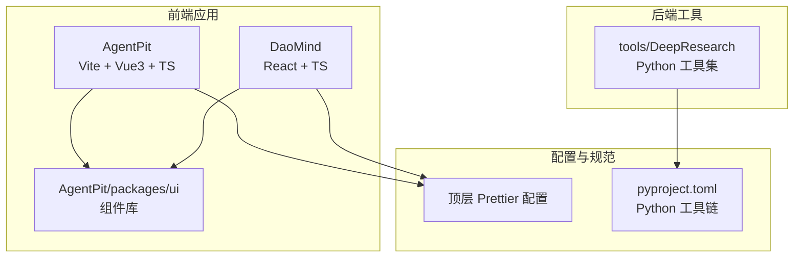
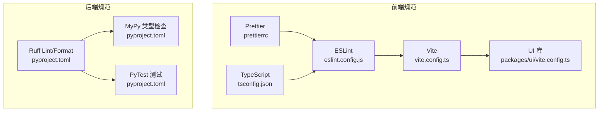
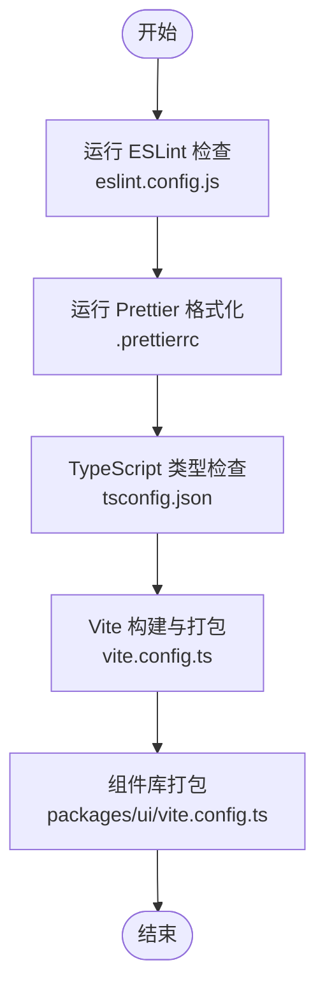
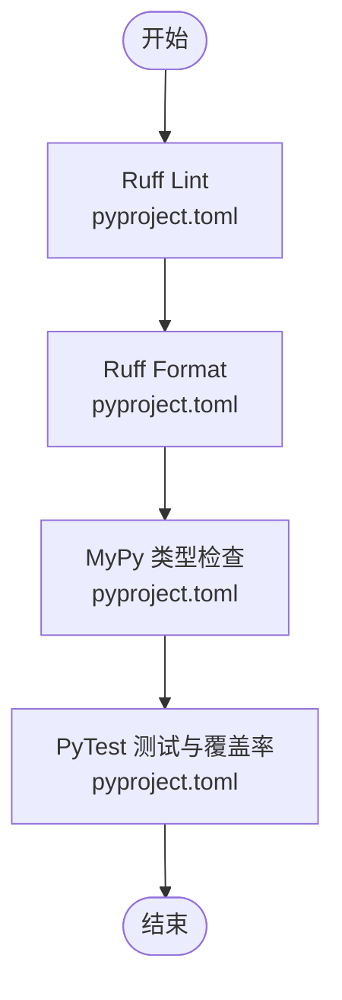
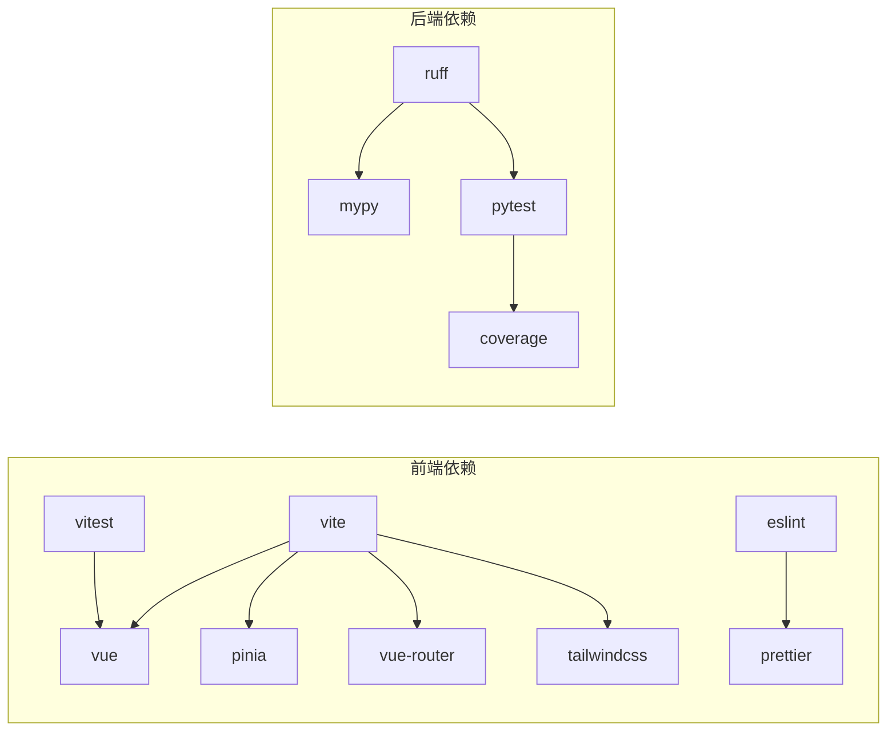

# 代码规范

<cite>
**本文引用的文件**
- [apps/AgentPit/.prettierrc](file://apps/AgentPit/.prettierrc)
- [apps/AgentPit/eslint.config.js](file://apps/AgentPit/eslint.config.js)
- [apps/AgentPit/package.json](file://apps/AgentPit/package.json)
- [apps/AgentPit/vite.config.ts](file://apps/AgentPit/vite.config.ts)
- [apps/AgentPit/packages/ui/vite.config.ts](file://apps/AgentPit/packages/ui/vite.config.ts)
- [apps/DaoMind/.prettierrc](file://apps/DaoMind/.prettierrc)
- [apps/DaoMind/eslint.config.js](file://apps/DaoMind/eslint.config.js)
- [apps/DaoMind/package.json](file://apps/DaoMind/package.json)
- [apps/DaoMind/tsconfig.json](file://apps/DaoMind/tsconfig.json)
- [.prettierrc](file://.prettierrc)
- [pyproject.toml](file://pyproject.toml)
</cite>

## 目录
1. [简介](#简介)
2. [项目结构](#项目结构)
3. [核心组件](#核心组件)
4. [架构总览](#架构总览)
5. [详细组件分析](#详细组件分析)
6. [依赖分析](#依赖分析)
7. [性能考虑](#性能考虑)
8. [故障排查指南](#故障排查指南)
9. [结论](#结论)
10. [附录](#附录)

## 简介
本文件为 DAOApps 项目的统一代码规范文档，覆盖前端（Vue.js + TypeScript）、后端（Python + FastAPI）与跨平台开发指导。内容包含 ESLint 配置规则、Prettier 格式化标准、TypeScript 类型约束、Python 编码风格、命名约定、文件组织结构、注释规范、错误处理模式、性能优化建议、安全编码实践与可维护性原则，并通过“路径+行号”的方式提供具体示例位置，便于对照与落地。

## 项目结构
DAOApps 采用多应用与多包混合的组织方式：
- 前端应用：AgentPit（Vite + Vue3 + TypeScript），DaoMind（React + TypeScript）等
- 组件库：AgentPit/packages/ui（Vue 组件库打包）
- 后端工具：tools/DeepResearch（Python + FastAPI 生态相关）
- 顶层配置：.prettierrc、pyproject.toml 等

图表来源
- [apps/AgentPit/vite.config.ts:1-15](file://apps/AgentPit/vite.config.ts#L1-L15)
- [apps/AgentPit/packages/ui/vite.config.ts:1-30](file://apps/AgentPit/packages/ui/vite.config.ts#L1-L30)
- [apps/DaoMind/tsconfig.json:1-1](file://apps/DaoMind/tsconfig.json#L1-L1)
- [pyproject.toml:1-161](file://pyproject.toml#L1-L161)

章节来源
- [apps/AgentPit/vite.config.ts:1-15](file://apps/AgentPit/vite.config.ts#L1-L15)
- [apps/AgentPit/packages/ui/vite.config.ts:1-30](file://apps/AgentPit/packages/ui/vite.config.ts#L1-L30)
- [apps/DaoMind/tsconfig.json:1-1](file://apps/DaoMind/tsconfig.json#L1-L1)
- [pyproject.toml:1-161](file://pyproject.toml#L1-L161)

## 核心组件
- 前端构建与别名：Vite 配置统一使用别名与插件，保证路径一致性与可维护性
- 组件库打包：UI 包以库模式构建，外部化 Vue 生态依赖，避免重复打包
- 规范工具链：ESLint + Prettier + TypeScript 检查贯穿前端；Ruff + MyPy + PyTest 贯穿后端
- 跨应用共享：通过 monorepo 式的 packages/ui 提供可复用组件与样式

章节来源
- [apps/AgentPit/vite.config.ts:1-15](file://apps/AgentPit/vite.config.ts#L1-L15)
- [apps/AgentPit/packages/ui/vite.config.ts:1-30](file://apps/AgentPit/packages/ui/vite.config.ts#L1-L30)
- [apps/AgentPit/package.json:1-74](file://apps/AgentPit/package.json#L1-L74)
- [apps/DaoMind/package.json:1-1](file://apps/DaoMind/package.json#L1-L1)
- [apps/DaoMind/tsconfig.json:1-1](file://apps/DaoMind/tsconfig.json#L1-L1)
- [pyproject.toml:71-80](file://pyproject.toml#L71-L80)

## 架构总览
前端与后端的开发规范在工具链层面相互独立但可协同：
- 前端：ESLint/Prettier/TS 检查 + Vite 构建 + Vitest/Jest 测试
- 后端：Ruff/Lint + Ruff/Format + MyPy + PyTest + 覆盖率

图表来源
- [apps/AgentPit/eslint.config.js:1-162](file://apps/AgentPit/eslint.config.js#L1-L162)
- [apps/AgentPit/.prettierrc:1-1](file://apps/AgentPit/.prettierrc#L1-L1)
- [apps/AgentPit/tsconfig.json:1-8](file://apps/AgentPit/tsconfig.json#L1-L8)
- [apps/AgentPit/vite.config.ts:1-15](file://apps/AgentPit/vite.config.ts#L1-L15)
- [apps/AgentPit/packages/ui/vite.config.ts:1-30](file://apps/AgentPit/packages/ui/vite.config.ts#L1-L30)
- [apps/DaoMind/eslint.config.js:1-27](file://apps/DaoMind/eslint.config.js#L1-L27)
- [apps/DaoMind/.prettierrc:1-1](file://apps/DaoMind/.prettierrc#L1-L1)
- [pyproject.toml:81-161](file://pyproject.toml#L81-L161)

## 详细组件分析

### 前端开发规范（Vue.js + TypeScript）

- ESLint 配置要点
  - 使用 flat 配置与推荐规则组合，关闭部分严格规则以适配实际工程
  - 对生产环境限制 console/debugger
  - 放宽 Vue 组件命名、v-html、未使用变量等规则
  - 为 Vue 文件单独指定解析器与 tsconfig

- Prettier 格式化标准
  - 单引号、缩进宽度 2、不使用 tab、无尾逗号、行长 100、分号存在
  - 不同应用可有差异，需遵循各自 .prettierrc

- TypeScript 类型约束
  - 使用 tsconfig 的 references 管理多项目引用
  - 在 Vite 中通过 vue-tsc 进行类型检查
  - 保持全局类型声明与浏览器 API 的一致性

- 文件组织与别名
  - 统一使用 @ 别名指向 src
  - 组件库以库模式构建，外部化 Vue 生态依赖

- 注释与错误处理
  - 保留必要的注释，避免过度注释
  - 错误处理遵循组件内捕获与全局错误边界结合的原则

- 性能与安全
  - 构建时移除 console/debugger
  - 合理拆分代码块，减少首屏体积
  - 输入校验与 DOM 操作使用安全库（如 dompurify）

图表来源
- [apps/AgentPit/eslint.config.js:1-162](file://apps/AgentPit/eslint.config.js#L1-L162)
- [apps/AgentPit/.prettierrc:1-1](file://apps/AgentPit/.prettierrc#L1-L1)
- [apps/AgentPit/tsconfig.json:1-8](file://apps/AgentPit/tsconfig.json#L1-L8)
- [apps/AgentPit/vite.config.ts:1-15](file://apps/AgentPit/vite.config.ts#L1-L15)
- [apps/AgentPit/packages/ui/vite.config.ts:1-30](file://apps/AgentPit/packages/ui/vite.config.ts#L1-L30)

章节来源
- [apps/AgentPit/eslint.config.js:1-162](file://apps/AgentPit/eslint.config.js#L1-L162)
- [apps/AgentPit/.prettierrc:1-1](file://apps/AgentPit/.prettierrc#L1-L1)
- [apps/AgentPit/tsconfig.json:1-8](file://apps/AgentPit/tsconfig.json#L1-L8)
- [apps/AgentPit/package.json:1-74](file://apps/AgentPit/package.json#L1-L74)
- [apps/AgentPit/vite.config.ts:1-15](file://apps/AgentPit/vite.config.ts#L1-L15)
- [apps/AgentPit/packages/ui/vite.config.ts:1-30](file://apps/AgentPit/packages/ui/vite.config.ts#L1-L30)

### 后端开发标准（Python + FastAPI）

- 工具链与脚本
  - 使用 Ruff 进行 Lint 与 Format，MyPy 进行类型检查
  - 使用 PyTest 运行测试与生成覆盖率报告
  - 提供统一的 clean、lint、format、type-check 等脚本

- Lint 规则与忽略项
  - 选择 E/W/F/I/UP/ANN/B/C4/SIM/RUF 等规则族
  - 针对测试文件与特定场景进行忽略，兼顾可读性与合规性
  - 行长 88，目标 Python 版本 3.14

- 类型检查与覆盖率
  - MyPy 开启关键警告，允许部分未严格定义场景
  - 覆盖率最低阈值 80%，排除测试目录与入口

- 安全与健壮性
  - 避免在 except 中直接 raise，优先使用 raise ... from
  - 保持异常信息清晰，避免记录敏感数据

图表来源
- [pyproject.toml:71-80](file://pyproject.toml#L71-L80)
- [pyproject.toml:81-161](file://pyproject.toml#L81-L161)

章节来源
- [pyproject.toml:71-80](file://pyproject.toml#L71-L80)
- [pyproject.toml:81-161](file://pyproject.toml#L81-L161)

### 跨平台开发指导

- 命名约定
  - 前端：组件名 PascalCase，文件名 kebab-case 或 PascalCase，常量 UPPER_SNAKE_CASE
  - 后端：模块与函数 snake_case，类名 PascalCase，常量 UPPER_SNAKE_CASE
  - 配置文件：.prettierrc、eslint.config.js、tsconfig.json 等统一管理

- 文件组织结构
  - 前端：按功能域划分 components、composables、stores、services、types、views
  - 后端：按子系统划分模块，公共逻辑放入 tools 子目录
  - 组件库：packages/ui 下按功能拆分 src/components、src/composables、src/styles、src/types

- 注释规范
  - 函数与复杂逻辑添加 JSDoc/Docstring 注释
  - 配置变更与破坏性改动在变更日志中明确记录

- 错误处理模式
  - 前端：统一的错误边界与提示，避免向用户暴露内部错误细节
  - 后端：结构化异常与日志，区分业务异常与系统异常

- 性能优化建议
  - 前端：懒加载、代码分割、移除调试语句、合理缓存
  - 后端：异步 I/O、连接池、查询优化、缓存策略

- 安全编码实践
  - 输入校验与输出转义，避免 XSS 与注入
  - 最小权限原则与密钥管理，避免硬编码敏感信息

- 可维护性原则
  - 单一职责、高内聚低耦合
  - 统一的工具链与规范，减少心智负担
  - 文档与注释同步更新

章节来源
- [apps/AgentPit/package.json:1-74](file://apps/AgentPit/package.json#L1-L74)
- [apps/DaoMind/package.json:1-1](file://apps/DaoMind/package.json#L1-L1)
- [apps/AgentPit/vite.config.ts:1-15](file://apps/AgentPit/vite.config.ts#L1-L15)
- [apps/AgentPit/packages/ui/vite.config.ts:1-30](file://apps/AgentPit/packages/ui/vite.config.ts#L1-L30)
- [pyproject.toml:81-161](file://pyproject.toml#L81-L161)

## 依赖分析
- 前端依赖
  - Vue3、Pinia、Vue Router、TailwindCSS、Vitest、ESLint、Prettier 等
  - 组件库外部化 Vue 生态依赖，降低重复打包风险

- 后端依赖
  - Ruff、MyPy、PyTest、Coverage 等开发与质量保障工具
  - 通过脚本统一执行 lint/format/type-check/test

图表来源
- [apps/AgentPit/package.json:20-63](file://apps/AgentPit/package.json#L20-L63)
- [apps/DaoMind/package.json:1-1](file://apps/DaoMind/package.json#L1-L1)
- [pyproject.toml:49-58](file://pyproject.toml#L49-L58)

章节来源
- [apps/AgentPit/package.json:1-74](file://apps/AgentPit/package.json#L1-L74)
- [apps/DaoMind/package.json:1-1](file://apps/DaoMind/package.json#L1-L1)
- [pyproject.toml:49-58](file://pyproject.toml#L49-L58)

## 性能考虑
- 前端
  - 构建时移除 console/debugger，启用压缩与代码分割
  - 合理拆分 vendor chunk，提升缓存命中率
  - 使用懒加载与虚拟滚动优化大列表渲染

- 后端
  - 使用异步接口与连接池，避免阻塞
  - 查询与缓存策略优化，减少数据库压力
  - 控制响应体大小与序列化开销

[本节为通用指导，无需列出章节来源]

## 故障排查指南
- ESLint 报错
  - 检查 eslint.config.js 的规则与忽略项，确认是否误报或需要调整
  - 参考路径：[apps/AgentPit/eslint.config.js:1-162](file://apps/AgentPit/eslint.config.js#L1-L162)，[apps/DaoMind/eslint.config.js:1-27](file://apps/DaoMind/eslint.config.js#L1-L27)

- Prettier 格式冲突
  - 统一 .prettierrc 配置，确保编辑器与 CI 使用一致规则
  - 参考路径：[apps/AgentPit/.prettierrc:1-1](file://apps/AgentPit/.prettierrc#L1-L1)，[apps/DaoMind/.prettierrc:1-1](file://apps/DaoMind/.prettierrc#L1-L1)，[.prettierrc:1-1](file://.prettierrc#L1-L1)

- TypeScript 类型错误
  - 使用 vue-tsc 或 tsserver 检查，必要时放宽局部规则
  - 参考路径：[apps/AgentPit/tsconfig.json:1-8](file://apps/AgentPit/tsconfig.json#L1-L8)，[apps/DaoMind/tsconfig.json:1-1](file://apps/DaoMind/tsconfig.json#L1-L1)

- Python Lint/格式问题
  - 使用 ruff check/format，修复或忽略不符合规则的代码
  - 参考路径：[pyproject.toml:74-78](file://pyproject.toml#L74-L78)，[pyproject.toml:81-129](file://pyproject.toml#L81-L129)

- 测试失败
  - 使用 pytest 与覆盖率报告定位问题，关注最小可复现用例
  - 参考路径：[pyproject.toml:130-151](file://pyproject.toml#L130-L151)

章节来源
- [apps/AgentPit/eslint.config.js:1-162](file://apps/AgentPit/eslint.config.js#L1-L162)
- [apps/DaoMind/eslint.config.js:1-27](file://apps/DaoMind/eslint.config.js#L1-L27)
- [apps/AgentPit/.prettierrc:1-1](file://apps/AgentPit/.prettierrc#L1-L1)
- [apps/DaoMind/.prettierrc:1-1](file://apps/DaoMind/.prettierrc#L1-L1)
- [.prettierrc:1-1](file://.prettierrc#L1-L1)
- [apps/AgentPit/tsconfig.json:1-8](file://apps/AgentPit/tsconfig.json#L1-L8)
- [apps/DaoMind/tsconfig.json:1-1](file://apps/DaoMind/tsconfig.json#L1-L1)
- [pyproject.toml:74-78](file://pyproject.toml#L74-L78)
- [pyproject.toml:81-129](file://pyproject.toml#L81-L129)
- [pyproject.toml:130-151](file://pyproject.toml#L130-L151)

## 结论
通过统一的工具链与规范，DAOApps 实现了前后端开发的一致性与可维护性。建议团队在日常协作中：
- 严格遵守 ESLint/Prettier/TS 与 Ruff/MyPy/PyTest 的流程
- 在 PR 中附带测试与覆盖率报告
- 将规范文档作为新成员入职必读材料

[本节为总结性内容，无需列出章节来源]

## 附录
- 快速检查清单
  - 前端：ESLint 通过、Prettier 格式化、TS 类型检查、Vitest 通过
  - 后端：Ruff Lint/Format 通过、MyPy 类型检查、PyTest 通过、覆盖率达标

- 示例路径索引
  - ESLint 配置：[apps/AgentPit/eslint.config.js:1-162](file://apps/AgentPit/eslint.config.js#L1-L162)，[apps/DaoMind/eslint.config.js:1-27](file://apps/DaoMind/eslint.config.js#L1-L27)
  - Prettier 配置：[apps/AgentPit/.prettierrc:1-1](file://apps/AgentPit/.prettierrc#L1-L1)，[apps/DaoMind/.prettierrc:1-1](file://apps/DaoMind/.prettierrc#L1-L1)，[.prettierrc:1-1](file://.prettierrc#L1-L1)
  - TypeScript 配置：[apps/AgentPit/tsconfig.json:1-8](file://apps/AgentPit/tsconfig.json#L1-L8)，[apps/DaoMind/tsconfig.json:1-1](file://apps/DaoMind/tsconfig.json#L1-L1)
  - Vite 配置：[apps/AgentPit/vite.config.ts:1-15](file://apps/AgentPit/vite.config.ts#L1-L15)，[apps/AgentPit/packages/ui/vite.config.ts:1-30](file://apps/AgentPit/packages/ui/vite.config.ts#L1-L30)
  - Python 工具链：[pyproject.toml:71-80](file://pyproject.toml#L71-L80)，[pyproject.toml:81-161](file://pyproject.toml#L81-L161)