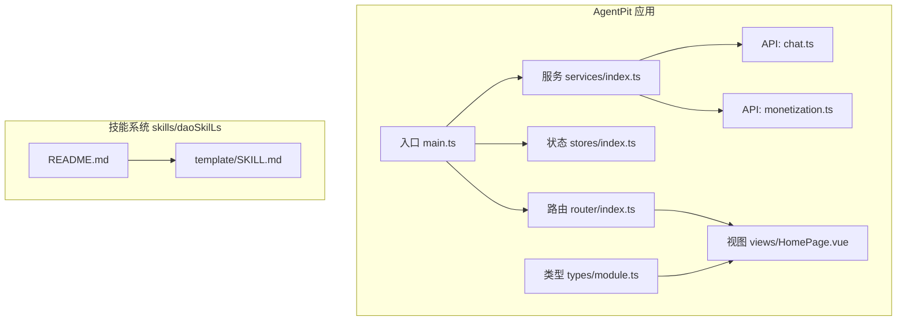
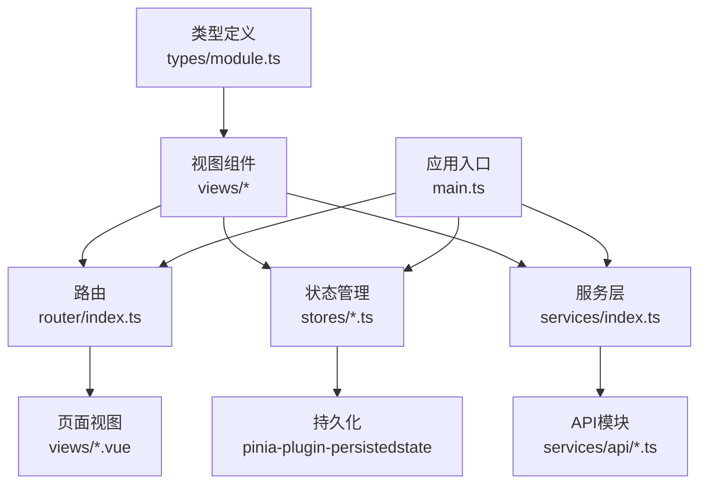
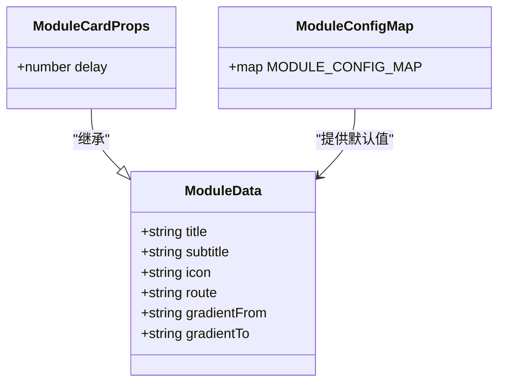
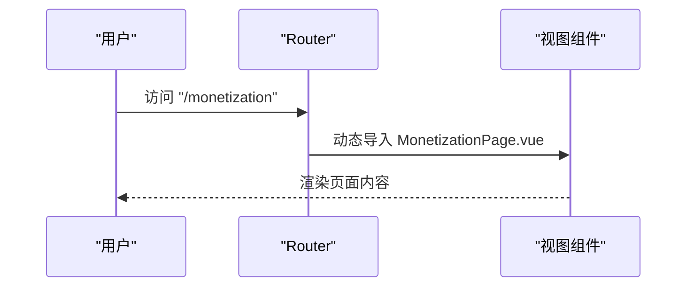
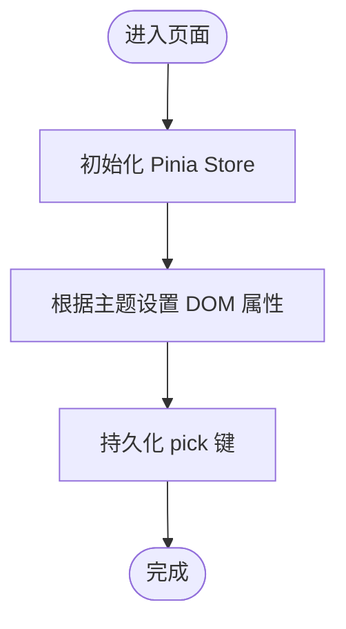
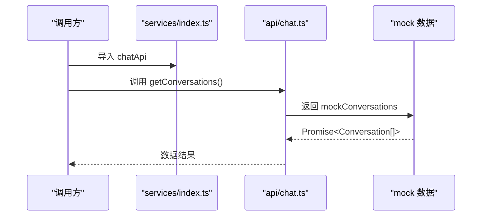
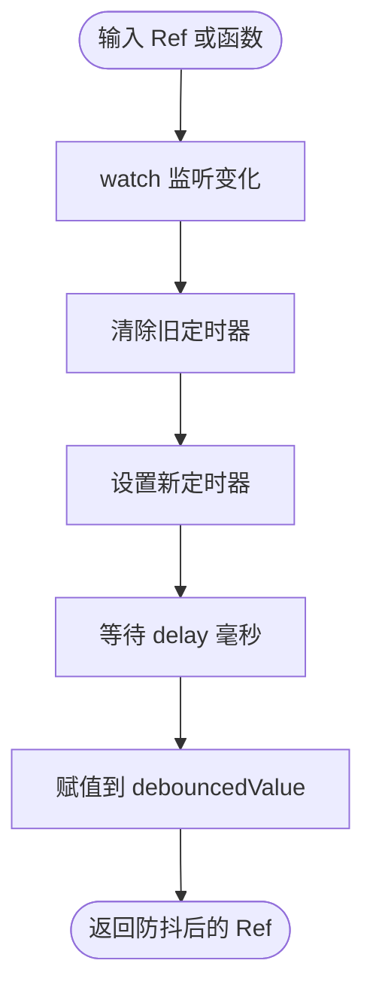
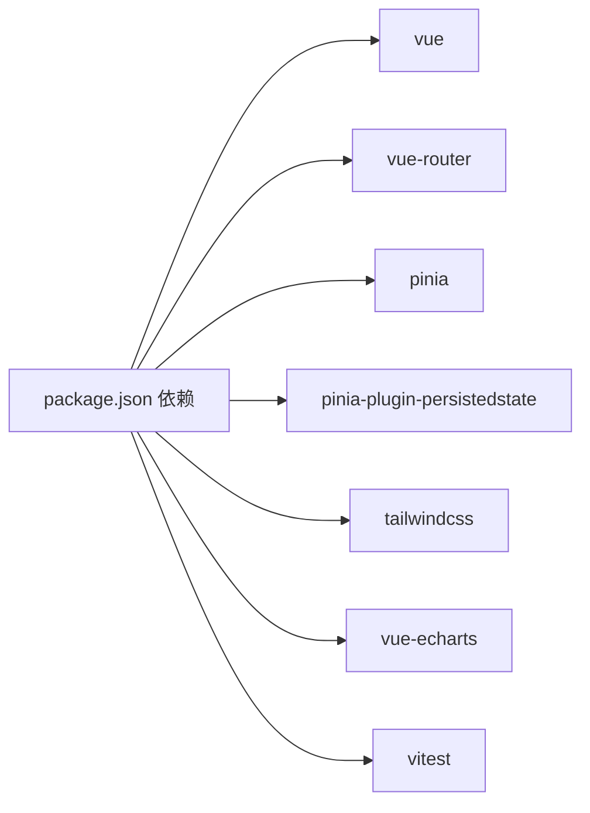

# 功能扩展

<cite>
**本文引用的文件**
- [apps/AgentPit/src/main.ts](file://apps/AgentPit/src/main.ts)
- [apps/AgentPit/src/router/index.ts](file://apps/AgentPit/src/router/index.ts)
- [apps/AgentPit/src/stores/index.ts](file://apps/AgentPit/src/stores/index.ts)
- [apps/AgentPit/src/services/index.ts](file://apps/AgentPit/src/services/index.ts)
- [apps/AgentPit/package.json](file://apps/AgentPit/package.json)
- [apps/AgentPit/src/App.vue](file://apps/AgentPit/src/App.vue)
- [apps/AgentPit/src/types/module.ts](file://apps/AgentPit/src/types/module.ts)
- [apps/AgentPit/src/composables/useDebounce.ts](file://apps/AgentPit/src/composables/useDebounce.ts)
- [apps/AgentPit/src/stores/useAppStore.ts](file://apps/AgentPit/src/stores/useAppStore.ts)
- [apps/AgentPit/src/stores/useUserStore.ts](file://apps/AgentPit/src/stores/useUserStore.ts)
- [apps/AgentPit/src/services/api/chat.ts](file://apps/AgentPit/src/services/api/chat.ts)
- [apps/AgentPit/src/services/api/monetization.ts](file://apps/AgentPit/src/services/api/monetization.ts)
- [apps/AgentPit/src/views/HomePage.vue](file://apps/AgentPit/src/views/HomePage.vue)
- [skills/daoSkilLs/skills/anthropics-skills/README.md](file://skills/daoSkilLs/skills/anthropics-skills/README.md)
- [skills/daoSkilLs/skills/anthropics-skills/template/SKILL.md](file://skills/daoSkilLs/skills/anthropics-skills/template/SKILL.md)
</cite>

## 目录
1. [引言](#引言)
2. [项目结构](#项目结构)
3. [核心组件](#核心组件)
4. [架构总览](#架构总览)
5. [详细组件分析](#详细组件分析)
6. [依赖分析](#依赖分析)
7. [性能考虑](#性能考虑)
8. [故障排查指南](#故障排查指南)
9. [结论](#结论)
10. [附录](#附录)

## 引言
本指南面向DAOApps项目的功能扩展开发者，系统阐述功能模块开发流程、插件系统架构与API扩展方法。内容覆盖从需求分析到设计文档、技术实现、测试策略、性能评估与向后兼容性保障的完整生命周期，并提供可直接落地的扩展示例（新模块创建、路由配置、状态管理），帮助团队在统一架构下高效、安全地迭代新增能力。

## 项目结构
DAOApps采用多应用工作区组织，AgentPit作为前端主应用，使用Vue 3 + Pinia + Vue Router构建；skills子仓库提供技能体系（Skill标准）以支撑AI能力扩展。整体结构清晰：应用层负责页面与交互，服务层封装API与缓存，状态层集中管理主题、用户与业务状态，类型层约束模块与数据结构，工具层提供通用组合式函数与防抖等。

图表来源
- [apps/AgentPit/src/main.ts:1-13](file://apps/AgentPit/src/main.ts#L1-L13)
- [apps/AgentPit/src/router/index.ts:1-73](file://apps/AgentPit/src/router/index.ts#L1-L73)
- [apps/AgentPit/src/stores/index.ts:1-15](file://apps/AgentPit/src/stores/index.ts#L1-L15)
- [apps/AgentPit/src/services/index.ts:1-10](file://apps/AgentPit/src/services/index.ts#L1-L10)
- [apps/AgentPit/src/types/module.ts:1-143](file://apps/AgentPit/src/types/module.ts#L1-L143)
- [apps/AgentPit/src/views/HomePage.vue:1-469](file://apps/AgentPit/src/views/HomePage.vue#L1-L469)
- [apps/AgentPit/src/services/api/chat.ts:1-18](file://apps/AgentPit/src/services/api/chat.ts#L1-L18)
- [apps/AgentPit/src/services/api/monetization.ts:1-59](file://apps/AgentPit/src/services/api/monetization.ts#L1-L59)
- [skills/daoSkilLs/skills/anthropics-skills/README.md:1-95](file://skills/daoSkilLs/skills/anthropics-skills/README.md#L1-L95)
- [skills/daoSkilLs/skills/anthropics-skills/template/SKILL.md:1-7](file://skills/daoSkilLs/skills/anthropics-skills/template/SKILL.md#L1-L7)

章节来源
- [apps/AgentPit/src/main.ts:1-13](file://apps/AgentPit/src/main.ts#L1-L13)
- [apps/AgentPit/src/router/index.ts:1-73](file://apps/AgentPit/src/router/index.ts#L1-L73)
- [apps/AgentPit/src/stores/index.ts:1-15](file://apps/AgentPit/src/stores/index.ts#L1-L15)
- [apps/AgentPit/src/services/index.ts:1-10](file://apps/AgentPit/src/services/index.ts#L1-L10)
- [apps/AgentPit/src/types/module.ts:1-143](file://apps/AgentPit/src/types/module.ts#L1-L143)
- [apps/AgentPit/src/views/HomePage.vue:1-469](file://apps/AgentPit/src/views/HomePage.vue#L1-L469)
- [apps/AgentPit/src/services/api/chat.ts:1-18](file://apps/AgentPit/src/services/api/chat.ts#L1-L18)
- [apps/AgentPit/src/services/api/monetization.ts:1-59](file://apps/AgentPit/src/services/api/monetization.ts#L1-L59)
- [skills/daoSkilLs/skills/anthropics-skills/README.md:1-95](file://skills/daoSkilLs/skills/anthropics-skills/README.md#L1-L95)
- [skills/daoSkilLs/skills/anthropics-skills/template/SKILL.md:1-7](file://skills/daoSkilLs/skills/anthropics-skills/template/SKILL.md#L1-L7)

## 核心组件
- 应用入口与挂载：创建Vue实例、注册Pinia与Router，挂载根组件。
- 路由系统：集中定义页面级路由，支持动态导入与参数化路由。
- 状态管理：Pinia Store集合，包含应用全局状态与用户状态，持久化策略明确。
- 服务层：统一导出API模块，便于按需引入与替换。
- 类型系统：模块类型与配置映射，确保模块卡片与路由的一致性。
- 工具函数：组合式工具如防抖，提升交互体验与性能。
- 视图层：首页聚合模块卡片，体现模块分类与动画过渡。

章节来源
- [apps/AgentPit/src/main.ts:1-13](file://apps/AgentPit/src/main.ts#L1-L13)
- [apps/AgentPit/src/router/index.ts:1-73](file://apps/AgentPit/src/router/index.ts#L1-L73)
- [apps/AgentPit/src/stores/index.ts:1-15](file://apps/AgentPit/src/stores/index.ts#L1-L15)
- [apps/AgentPit/src/services/index.ts:1-10](file://apps/AgentPit/src/services/index.ts#L1-L10)
- [apps/AgentPit/src/types/module.ts:1-143](file://apps/AgentPit/src/types/module.ts#L1-L143)
- [apps/AgentPit/src/composables/useDebounce.ts:1-21](file://apps/AgentPit/src/composables/useDebounce.ts#L1-L21)
- [apps/AgentPit/src/views/HomePage.vue:1-469](file://apps/AgentPit/src/views/HomePage.vue#L1-L469)

## 架构总览
AgentPit采用“视图-路由-状态-服务-类型”的分层架构，模块通过类型与配置映射进行声明式管理，API通过服务层抽象对外暴露，状态通过Pinia集中管理并持久化关键字段，路由负责页面导航与懒加载。

图表来源
- [apps/AgentPit/src/main.ts:1-13](file://apps/AgentPit/src/main.ts#L1-L13)
- [apps/AgentPit/src/router/index.ts:1-73](file://apps/AgentPit/src/router/index.ts#L1-L73)
- [apps/AgentPit/src/stores/index.ts:1-15](file://apps/AgentPit/src/stores/index.ts#L1-L15)
- [apps/AgentPit/src/services/index.ts:1-10](file://apps/AgentPit/src/services/index.ts#L1-L10)
- [apps/AgentPit/src/types/module.ts:1-143](file://apps/AgentPit/src/types/module.ts#L1-L143)

## 详细组件分析

### 组件A：模块系统与类型约束
模块系统通过类型与配置映射实现声明式模块管理，核心模块与扩展模块区分明确，路由与图标、渐变色等UI属性解耦于配置。

图表来源
- [apps/AgentPit/src/types/module.ts:22-143](file://apps/AgentPit/src/types/module.ts#L22-L143)

章节来源
- [apps/AgentPit/src/types/module.ts:1-143](file://apps/AgentPit/src/types/module.ts#L1-L143)
- [apps/AgentPit/src/views/HomePage.vue:1-469](file://apps/AgentPit/src/views/HomePage.vue#L1-L469)

### 组件B：路由与页面导航
路由系统集中定义页面级路由，支持嵌套路由与参数化路由，页面组件采用动态导入以优化首屏加载。

图表来源
- [apps/AgentPit/src/router/index.ts:1-73](file://apps/AgentPit/src/router/index.ts#L1-L73)
- [apps/AgentPit/src/views/HomePage.vue:1-469](file://apps/AgentPit/src/views/HomePage.vue#L1-L469)

章节来源
- [apps/AgentPit/src/router/index.ts:1-73](file://apps/AgentPit/src/router/index.ts#L1-L73)

### 组件C：状态管理与持久化
应用状态与用户状态分别管理主题、侧边栏、当前页与用户资料、通知数等，持久化仅保留必要键值，避免冗余。

图表来源
- [apps/AgentPit/src/stores/useAppStore.ts:11-89](file://apps/AgentPit/src/stores/useAppStore.ts#L11-L89)
- [apps/AgentPit/src/stores/useUserStore.ts:11-72](file://apps/AgentPit/src/stores/useUserStore.ts#L11-L72)
- [apps/AgentPit/src/stores/index.ts:1-15](file://apps/AgentPit/src/stores/index.ts#L1-L15)

章节来源
- [apps/AgentPit/src/stores/useAppStore.ts:1-89](file://apps/AgentPit/src/stores/useAppStore.ts#L1-L89)
- [apps/AgentPit/src/stores/useUserStore.ts:1-72](file://apps/AgentPit/src/stores/useUserStore.ts#L1-L72)
- [apps/AgentPit/src/stores/index.ts:1-15](file://apps/AgentPit/src/stores/index.ts#L1-L15)

### 组件D：API服务与Mock数据
服务层统一导出API模块，聊天与变现模块提供模拟数据接口，便于前后端并行开发与测试。

图表来源
- [apps/AgentPit/src/services/index.ts:1-10](file://apps/AgentPit/src/services/index.ts#L1-L10)
- [apps/AgentPit/src/services/api/chat.ts:1-18](file://apps/AgentPit/src/services/api/chat.ts#L1-L18)

章节来源
- [apps/AgentPit/src/services/index.ts:1-10](file://apps/AgentPit/src/services/index.ts#L1-L10)
- [apps/AgentPit/src/services/api/chat.ts:1-18](file://apps/AgentPit/src/services/api/chat.ts#L1-L18)
- [apps/AgentPit/src/services/api/monetization.ts:1-59](file://apps/AgentPit/src/services/api/monetization.ts#L1-L59)

### 组件E：防抖组合式函数
防抖函数基于watch监听输入变化，在指定延迟后更新结果，减少高频变更带来的重渲染与请求压力。

图表来源
- [apps/AgentPit/src/composables/useDebounce.ts:1-21](file://apps/AgentPit/src/composables/useDebounce.ts#L1-L21)

章节来源
- [apps/AgentPit/src/composables/useDebounce.ts:1-21](file://apps/AgentPit/src/composables/useDebounce.ts#L1-L21)

## 依赖分析
- 入口依赖：Vue、Pinia、Vue Router、TailwindCSS、ECharts、Vitest等。
- 路由与状态：路由懒加载与Pinia持久化插件配合，降低初始包体与提升用户体验。
- 服务层：API模块按需导出，便于替换真实后端或扩展新模块API。
- 技能系统：遵循Skill标准，通过模板与说明文档指导自定义技能开发。

图表来源
- [apps/AgentPit/package.json:20-63](file://apps/AgentPit/package.json#L20-L63)

章节来源
- [apps/AgentPit/package.json:1-74](file://apps/AgentPit/package.json#L1-L74)

## 性能考虑
- 路由懒加载：通过动态导入减少首屏资源体积，提升首屏渲染速度。
- 状态持久化：仅持久化必要键值，避免localStorage膨胀影响性能。
- 防抖与节流：对高频输入与滚动事件使用防抖，降低渲染与请求频率。
- 图表与媒体：按需引入ECharts等大体积库，结合懒加载与骨架屏优化。
- 测试覆盖率：通过Vitest与端到端测试保障功能稳定性，减少回归风险。

## 故障排查指南
- 路由不生效：检查路由定义与页面组件是否正确导出与命名一致。
- 状态未持久化：确认持久化插件已安装且pick键包含目标状态字段。
- API异常：核对服务层导出与调用点，优先使用Mock数据验证链路。
- 主题切换无效：检查主题应用逻辑与DOM属性设置。
- 性能问题：使用浏览器性能面板定位重渲染热点，结合防抖与懒加载优化。

## 结论
DAOApps提供了清晰的前端扩展基座：声明式模块类型、集中路由与状态管理、可替换的服务层以及可复用的工具函数。在此基础上，结合技能系统标准，团队可快速实现新功能模块的全生命周期交付，并通过完善的测试与性能策略保障质量与体验。

## 附录

### 新功能开发流程与生命周期
- 需求分析：明确业务目标、用户场景与边界条件。
- 设计文档：输出模块类型定义、路由规划、状态模型与API契约。
- 技术实现：创建页面组件、完善类型与配置映射、接入服务层API。
- 集成测试：单元测试、集成测试与端到端测试覆盖关键路径。
- 性能评估：首屏时长、内存占用、交互流畅度与图表渲染性能。
- 向后兼容：保持API签名稳定、类型扩展非破坏性、状态迁移策略。

### 插件系统架构与技能集成
- 技能标准：遵循Skill规范，使用模板生成技能目录与元信息。
- 开发流程：编写指令与示例、本地验证、注册到市场或API。
- 集成方式：通过API或客户端插件机制加载技能，动态增强Agent能力。

章节来源
- [skills/daoSkilLs/skills/anthropics-skills/README.md:1-95](file://skills/daoSkilLs/skills/anthropics-skills/README.md#L1-L95)
- [skills/daoSkilLs/skills/anthropics-skills/template/SKILL.md:1-7](file://skills/daoSkilLs/skills/anthropics-skills/template/SKILL.md#L1-L7)

### API扩展方法
- 新增API模块：在服务层新增API文件，导出函数并统一在服务入口聚合导出。
- 页面接入：在视图中导入API并调用，处理加载状态与错误回退。
- Mock到真实：逐步替换Mock数据为真实后端接口，保持调用签名不变。

章节来源
- [apps/AgentPit/src/services/index.ts:1-10](file://apps/AgentPit/src/services/index.ts#L1-L10)
- [apps/AgentPit/src/services/api/chat.ts:1-18](file://apps/AgentPit/src/services/api/chat.ts#L1-L18)
- [apps/AgentPit/src/services/api/monetization.ts:1-59](file://apps/AgentPit/src/services/api/monetization.ts#L1-L59)

### 扩展示例：创建新模块
- 创建页面组件：在views目录新增页面文件。
- 定义模块类型与配置：在类型文件中补充模块数据与配置映射。
- 注册路由：在路由表中添加新路由条目，支持参数化与嵌套。
- 接入状态：在store中新增必要状态并持久化关键字段。
- 页面渲染：在首页或导航中引用模块卡片，绑定路由跳转。

章节来源
- [apps/AgentPit/src/types/module.ts:1-143](file://apps/AgentPit/src/types/module.ts#L1-L143)
- [apps/AgentPit/src/router/index.ts:1-73](file://apps/AgentPit/src/router/index.ts#L1-L73)
- [apps/AgentPit/src/stores/index.ts:1-15](file://apps/AgentPit/src/stores/index.ts#L1-L15)
- [apps/AgentPit/src/views/HomePage.vue:1-469](file://apps/AgentPit/src/views/HomePage.vue#L1-L469)

### 功能测试策略
- 单元测试：针对组合式函数与Store动作进行断言。
- 集成测试：验证路由跳转、状态变更与API调用链路。
- 端到端测试：覆盖关键用户旅程，如登录、模块访问与数据提交。
- 性能测试：监控首屏加载、交互响应与图表渲染耗时。

章节来源
- [apps/AgentPit/package.json:16-18](file://apps/AgentPit/package.json#L16-L18)

### 性能评估方法
- 关键指标：FCP/LCP/TBT/CLS、内存峰值、CPU占用率。
- 工具链：Vitest覆盖率、Playwright端到端、Lighthouse审计。
- 优化手段：代码分割、懒加载、缓存策略、图片与字体优化。

### 向后兼容性保证
- 类型扩展：新增字段使用可选属性，避免破坏既有调用。
- API签名：保持参数与返回值结构稳定，新增字段向后兼容。
- 状态迁移：持久化键变更时提供迁移脚本或双写策略。