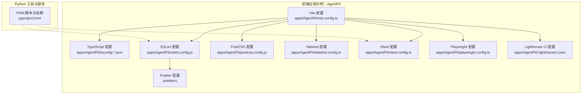
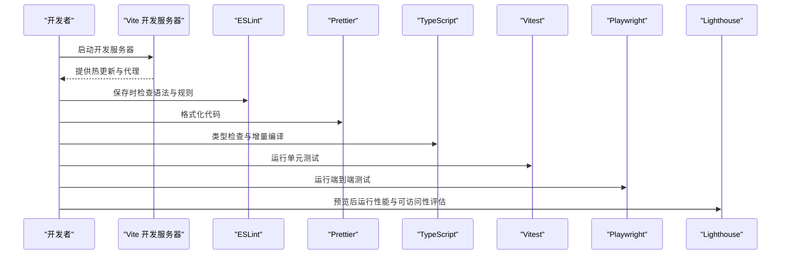
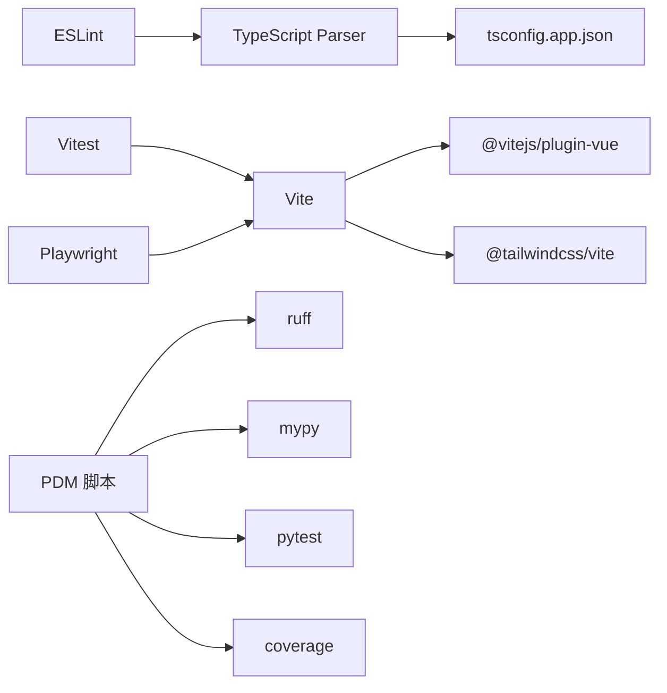

# 开发工具

<cite>
**本文引用的文件**
- [pyproject.toml](file://pyproject.toml)
- [.prettierrc](file://.prettierrc)
- [apps/AgentPit/vite.config.ts](file://apps/AgentPit/vite.config.ts)
- [apps/AgentPit/tailwind.config.ts](file://apps/AgentPit/tailwind.config.ts)
- [apps/AgentPit/tsconfig.json](file://apps/AgentPit/tsconfig.json)
- [apps/AgentPit/tsconfig.app.json](file://apps/AgentPit/tsconfig.app.json)
- [apps/AgentPit/tsconfig.node.json](file://apps/AgentPit/tsconfig.node.json)
- [apps/AgentPit/eslint.config.js](file://apps/AgentPit/eslint.config.js)
- [apps/AgentPit/postcss.config.js](file://apps/AgentPit/postcss.config.js)
- [apps/AgentPit/vitest.config.ts](file://apps/AgentPit/vitest.config.ts)
- [apps/AgentPit/playwright.config.ts](file://apps/AgentPit/playwright.config.ts)
- [apps/AgentPit/.lighthouserc.json](file://apps/AgentPit/.lighthouserc.json)
</cite>

## 目录
1. 引言
2. 项目结构
3. 核心组件
4. 架构总览
5. 详细组件分析
6. 依赖分析
7. 性能考虑
8. 故障排查指南
9. 结论
10. 附录

## 引言
本指南面向DAOApps项目的开发者，系统性地介绍开发环境配置、构建工具设置与调试技巧。内容覆盖Vite配置优化、TypeScript编译选项、Python虚拟环境管理、Docker容器化配置、调试与性能分析工具、监控工具配置、开发效率提升技巧（快捷键与IDE设置）、以及持续集成与自动化测试、部署工具使用等。文档以实际仓库中的配置文件为依据，提供可操作的步骤与最佳实践。

## 项目结构
DAOApps采用多应用架构，前端以Vite + Vue为主，配合TypeScript、TailwindCSS、ESLint、Prettier、Vitest、Playwright与Lighthouse；后端与工具链以Python为主，使用PDM作为包与脚本管理器，并通过pyproject.toml集中定义依赖、脚本与质量工具规则。

- 前端应用示例：apps/AgentPit
  - Vite、Vue、TailwindCSS、TypeScript、ESLint、Prettier、PostCSS、Vitest、Playwright、Lighthouse
- Python工具与服务：tools/DeepResearch、tools/flexloop
  - PDM管理依赖与脚本，pytest、ruff、mypy、coverage等质量工具
- 通用格式化与代码风格：.prettierrc

**图表来源**
- [apps/AgentPit/vite.config.ts:1-15](file://apps/AgentPit/vite.config.ts#L1-L15)
- [apps/AgentPit/tsconfig.json:1-8](file://apps/AgentPit/tsconfig.json#L1-L8)
- [apps/AgentPit/eslint.config.js:1-162](file://apps/AgentPit/eslint.config.js#L1-L162)
- [.prettierrc:1-1](file://.prettierrc#L1-L1)
- [apps/AgentPit/postcss.config.js:1-6](file://apps/AgentPit/postcss.config.js#L1-L6)
- [apps/AgentPit/tailwind.config.ts:1-27](file://apps/AgentPit/tailwind.config.ts#L1-L27)
- [apps/AgentPit/vitest.config.ts:1-48](file://apps/AgentPit/vitest.config.ts#L1-L48)
- [apps/AgentPit/playwright.config.ts:1-28](file://apps/AgentPit/playwright.config.ts#L1-L28)
- [apps/AgentPit/.lighthouserc.json:1-24](file://apps/AgentPit/.lighthouserc.json#L1-L24)
- [pyproject.toml:1-161](file://pyproject.toml#L1-L161)

**章节来源**
- [apps/AgentPit/vite.config.ts:1-15](file://apps/AgentPit/vite.config.ts#L1-L15)
- [apps/AgentPit/tsconfig.json:1-8](file://apps/AgentPit/tsconfig.json#L1-L8)
- [apps/AgentPit/eslint.config.js:1-162](file://apps/AgentPit/eslint.config.js#L1-L162)
- [.prettierrc:1-1](file://.prettierrc#L1-L1)
- [apps/AgentPit/postcss.config.js:1-6](file://apps/AgentPit/postcss.config.js#L1-L6)
- [apps/AgentPit/tailwind.config.ts:1-27](file://apps/AgentPit/tailwind.config.ts#L1-L27)
- [apps/AgentPit/vitest.config.ts:1-48](file://apps/AgentPit/vitest.config.ts#L1-L48)
- [apps/AgentPit/playwright.config.ts:1-28](file://apps/AgentPit/playwright.config.ts#L1-L28)
- [apps/AgentPit/.lighthouserc.json:1-24](file://apps/AgentPit/.lighthouserc.json#L1-L24)
- [pyproject.toml:1-161](file://pyproject.toml#L1-L161)

## 核心组件
- Vite 构建与开发服务器
  - 别名与插件：@ 指向 src，集成 @vitejs/plugin-vue 与 @tailwindcss/vite
  - 参考路径：[apps/AgentPit/vite.config.ts:1-15](file://apps/AgentPit/vite.config.ts#L1-L15)
- TypeScript 编译配置
  - 多项目引用：tsconfig.json 统一引用 tsconfig.app.json 与 tsconfig.node.json
  - 应用侧严格模式、路径映射、排除测试与特定文件
  - 参考路径：
    - [apps/AgentPit/tsconfig.json:1-8](file://apps/AgentPit/tsconfig.json#L1-L8)
    - [apps/AgentPit/tsconfig.app.json:1-1](file://apps/AgentPit/tsconfig.app.json#L1-L1)
    - [apps/AgentPit/tsconfig.node.json:1-25](file://apps/AgentPit/tsconfig.node.json#L1-L25)
- 代码质量与格式化
  - ESLint + Prettier：统一规则、忽略目录与文件、生产/开发环境差异
  - Prettier：单引号、制表符宽度、尾随逗号、行长、分号
  - PostCSS：autoprefixer
  - 参考路径：
    - [apps/AgentPit/eslint.config.js:1-162](file://apps/AgentPit/eslint.config.js#L1-L162)
    - [.prettierrc:1-1](file://.prettierrc#L1-L1)
    - [apps/AgentPit/postcss.config.js:1-6](file://apps/AgentPit/postcss.config.js#L1-L6)
- UI 框架与样式
  - TailwindCSS：content 覆盖范围、主题扩展（如 primary 色板）
  - 参考路径：[apps/AgentPit/tailwind.config.ts:1-27](file://apps/AgentPit/tailwind.config.ts#L1-L27)
- 测试与端到端
  - Vitest：jsdom 环境、覆盖率阈值、报告类型、别名与 setup 文件
  - Playwright：并行、重试、工作线程、报告器、设备与webServer启动
  - 参考路径：
    - [apps/AgentPit/vitest.config.ts:1-48](file://apps/AgentPit/vitest.config.ts#L1-L48)
    - [apps/AgentPit/playwright.config.ts:1-28](file://apps/AgentPit/playwright.config.ts#L1-L28)
- 性能与可访问性
  - Lighthouse CI：收集次数、断言阈值、上传目标
  - 参考路径：[apps/AgentPit/.lighthouserc.json:1-24](file://apps/AgentPit/.lighthouserc.json#L1-L24)
- Python 工具链
  - PDM：dev-dependencies、optional-dependencies、scripts（test、lint、format、type-check、clean）、pytest、ruff、mypy、coverage
  - 参考路径：[pyproject.toml:1-161](file://pyproject.toml#L1-L161)

**章节来源**
- [apps/AgentPit/vite.config.ts:1-15](file://apps/AgentPit/vite.config.ts#L1-L15)
- [apps/AgentPit/tsconfig.json:1-8](file://apps/AgentPit/tsconfig.json#L1-L8)
- [apps/AgentPit/tsconfig.app.json:1-1](file://apps/AgentPit/tsconfig.app.json#L1-L1)
- [apps/AgentPit/tsconfig.node.json:1-25](file://apps/AgentPit/tsconfig.node.json#L1-L25)
- [apps/AgentPit/eslint.config.js:1-162](file://apps/AgentPit/eslint.config.js#L1-L162)
- [.prettierrc:1-1](file://.prettierrc#L1-L1)
- [apps/AgentPit/postcss.config.js:1-6](file://apps/AgentPit/postcss.config.js#L1-L6)
- [apps/AgentPit/tailwind.config.ts:1-27](file://apps/AgentPit/tailwind.config.ts#L1-L27)
- [apps/AgentPit/vitest.config.ts:1-48](file://apps/AgentPit/vitest.config.ts#L1-L48)
- [apps/AgentPit/playwright.config.ts:1-28](file://apps/AgentPit/playwright.config.ts#L1-L28)
- [apps/AgentPit/.lighthouserc.json:1-24](file://apps/AgentPit/.lighthouserc.json#L1-L24)
- [pyproject.toml:1-161](file://pyproject.toml#L1-L161)

## 架构总览
下图展示前端应用在本地开发时的工具链交互：Vite 启动开发服务器，ESLint/Prettier 在编辑阶段保障代码质量，TypeScript 提供类型检查，Vitest 进行单元测试，Playwright 执行端到端测试，Lighthouse 在预览阶段进行性能与可访问性评估。

**图表来源**
- [apps/AgentPit/vite.config.ts:1-15](file://apps/AgentPit/vite.config.ts#L1-L15)
- [apps/AgentPit/eslint.config.js:1-162](file://apps/AgentPit/eslint.config.js#L1-L162)
- [.prettierrc:1-1](file://.prettierrc#L1-L1)
- [apps/AgentPit/tsconfig.app.json:1-1](file://apps/AgentPit/tsconfig.app.json#L1-L1)
- [apps/AgentPit/vitest.config.ts:1-48](file://apps/AgentPit/vitest.config.ts#L1-L48)
- [apps/AgentPit/playwright.config.ts:1-28](file://apps/AgentPit/playwright.config.ts#L1-L28)
- [apps/AgentPit/.lighthouserc.json:1-24](file://apps/AgentPit/.lighthouserc.json#L1-L24)

## 详细组件分析

### Vite 配置优化
- 插件与别名
  - 使用 @vitejs/plugin-vue 与 @tailwindcss/vite，别名 @ 指向 src，便于模块导入
  - 参考路径：[apps/AgentPit/vite.config.ts:1-15](file://apps/AgentPit/vite.config.ts#L1-L15)
- 生产与开发差异
  - 可结合 NODE_ENV 或环境变量调整插件与优化策略（例如条件启用压缩、Source Map 策略）
- 与其他工具联动
  - 与 ESLint、Prettier、TypeScript 的输出目录保持一致，避免重复扫描
  - 与 Vitest/Playwright 的别名与路径保持一致，确保测试命中源码

**章节来源**
- [apps/AgentPit/vite.config.ts:1-15](file://apps/AgentPit/vite.config.ts#L1-L15)

### TypeScript 编译选项
- 多项目引用
  - tsconfig.json 引用 tsconfig.app.json 与 tsconfig.node.json，实现应用层与 Node 层分离
  - 参考路径：
    - [apps/AgentPit/tsconfig.json:1-8](file://apps/AgentPit/tsconfig.json#L1-L8)
    - [apps/AgentPit/tsconfig.app.json:1-1](file://apps/AgentPit/tsconfig.app.json#L1-L1)
    - [apps/AgentPit/tsconfig.node.json:1-25](file://apps/AgentPit/tsconfig.node.json#L1-L25)
- 关键选项说明
  - 应用侧：严格模式、路径映射、排除测试与特定文件、忽略弃用提示
  - Node 侧：Bundler 模式、ES2023 目标、禁用 emit、严格未使用检测
- 与 ESLint 的配合
  - ESLint 使用 parserOptions.project 指向 tsconfig.app.json，确保规则基于真实编译上下文

**章节来源**
- [apps/AgentPit/tsconfig.json:1-8](file://apps/AgentPit/tsconfig.json#L1-L8)
- [apps/AgentPit/tsconfig.app.json:1-1](file://apps/AgentPit/tsconfig.app.json#L1-L1)
- [apps/AgentPit/tsconfig.node.json:1-25](file://apps/AgentPit/tsconfig.node.json#L1-L25)
- [apps/AgentPit/eslint.config.js:1-162](file://apps/AgentPit/eslint.config.js#L1-L162)

### 代码质量与格式化（ESLint + Prettier + PostCSS）
- ESLint 规则
  - 推荐配置组合、Vue 插件、Prettier 集成、忽略目录与文件列表
  - 生产环境对 console、debugger 的警告级别控制
  - 全局变量白名单与浏览器/Node 环境 API
  - 参考路径：[apps/AgentPit/eslint.config.js:1-162](file://apps/AgentPit/eslint.config.js#L1-L162)
- Prettier
  - 单引号、制表符宽度、尾随逗号、行长、分号
  - 参考路径：[.prettierrc:1-1](file://.prettierrc#L1-L1)
- PostCSS
  - 自动前缀器启用
  - 参考路径：[apps/AgentPit/postcss.config.js:1-6](file://apps/AgentPit/postcss.config.js#L1-L6)

**章节来源**
- [apps/AgentPit/eslint.config.js:1-162](file://apps/AgentPit/eslint.config.js#L1-L162)
- [.prettierrc:1-1](file://.prettierrc#L1-L1)
- [apps/AgentPit/postcss.config.js:1-6](file://apps/AgentPit/postcss.config.js#L1-L6)

### UI 框架与样式（TailwindCSS）
- 内容扫描范围
  - 包含 index.html 与 src 下的 Vue/JS/TS/JSX/TSX
  - 参考路径：[apps/AgentPit/tailwind.config.ts:1-27](file://apps/AgentPit/tailwind.config.ts#L1-L27)
- 主题扩展
  - 定义 primary 色板，便于全局复用
- 与 Vite/Tailwind 插件联动
  - 在 Vite 中启用 @tailwindcss/vite，确保按需生成样式

**章节来源**
- [apps/AgentPit/tailwind.config.ts:1-27](file://apps/AgentPit/tailwind.config.ts#L1-L27)
- [apps/AgentPit/vite.config.ts:1-15](file://apps/AgentPit/vite.config.ts#L1-L15)

### 测试与端到端（Vitest + Playwright）
- Vitest
  - jsdom 环境、全局启用、覆盖率报告类型与阈值、别名与 setup 文件
  - 参考路径：[apps/AgentPit/vitest.config.ts:1-48](file://apps/AgentPit/vitest.config.ts#L1-L48)
- Playwright
  - 并行执行、重试策略、工作线程、报告器、设备配置、webServer 启动命令与超时
  - 参考路径：[apps/AgentPit/playwright.config.ts:1-28](file://apps/AgentPit/playwright.config.ts#L1-L28)

**章节来源**
- [apps/AgentPit/vitest.config.ts:1-48](file://apps/AgentPit/vitest.config.ts#L1-L48)
- [apps/AgentPit/playwright.config.ts:1-28](file://apps/AgentPit/playwright.config.ts#L1-L28)

### 性能与可访问性（Lighthouse CI）
- 收集与断言
  - 指定 URL、运行次数、起始命令与就绪模式、断言阈值
  - 参考路径：[apps/AgentPit/.lighthouserc.json:1-24](file://apps/AgentPit/.lighthouserc.json#L1-L24)

**章节来源**
- [apps/AgentPit/.lighthouserc.json:1-24](file://apps/AgentPit/.lighthouserc.json#L1-L24)

### Python 虚拟环境与工具链（PDM）
- 依赖与脚本
  - dev-dependencies：ruff、mypy、pytest、Invoke 等
  - optional-dependencies：文档相关工具
  - scripts：test、test-cov、lint、lint-fix、format、format-check、type-check、clean
  - 参考路径：[pyproject.toml:1-161](file://pyproject.toml#L1-L161)
- 质量工具
  - ruff：lint、format、per-file-ignores、target-version
  - pytest：addopts、asyncio_mode、testpaths
  - coverage：branch、omit、fail_under、report
  - mypy：python_version、warn_return_any、warn_unused_configs、ignore_missing_imports
- 与前端工具链协作
  - 通过 scripts 统一入口，CI 中可直接调用 pdm run lint/format/test/type-check/clean

**章节来源**
- [pyproject.toml:1-161](file://pyproject.toml#L1-L161)

### Docker 容器化配置
- 当前仓库未发现 Dockerfile 或 docker-compose 配置文件
- 建议
  - 为前端应用创建多阶段构建（开发/生产），暴露静态资源端口，挂载卷用于热更新
  - 为 Python 工具与服务创建独立镜像，使用 .dockerignore 排除 node_modules、.pytest_cache 等
  - 在 CI 中缓存依赖层以加速构建
- 参考文件位置（若新增）
  - apps/AgentPit/Dockerfile
  - apps/AgentPit/docker-compose.yml
  - apps/AgentPit/.dockerignore

[本节为概念性建议，不涉及具体文件分析，故无“章节来源”]

## 依赖分析
- 前端工具链耦合关系
  - Vite 依赖 Vue 与 Tailwind 插件；TypeScript 通过 ESLint 解析器共享 tsconfig；Vitest/Playwright 依赖 Vite 别名与路径
- Python 工具链
  - PDM 将 ruff、mypy、pytest、coverage 作为统一入口，减少跨项目配置漂移

**图表来源**
- [apps/AgentPit/vite.config.ts:1-15](file://apps/AgentPit/vite.config.ts#L1-L15)
- [apps/AgentPit/eslint.config.js:1-162](file://apps/AgentPit/eslint.config.js#L1-L162)
- [apps/AgentPit/tsconfig.app.json:1-1](file://apps/AgentPit/tsconfig.app.json#L1-L1)
- [apps/AgentPit/vitest.config.ts:1-48](file://apps/AgentPit/vitest.config.ts#L1-L48)
- [apps/AgentPit/playwright.config.ts:1-28](file://apps/AgentPit/playwright.config.ts#L1-L28)
- [pyproject.toml:1-161](file://pyproject.toml#L1-L161)

**章节来源**
- [apps/AgentPit/vite.config.ts:1-15](file://apps/AgentPit/vite.config.ts#L1-L15)
- [apps/AgentPit/eslint.config.js:1-162](file://apps/AgentPit/eslint.config.js#L1-L162)
- [apps/AgentPit/tsconfig.app.json:1-1](file://apps/AgentPit/tsconfig.app.json#L1-L1)
- [apps/AgentPit/vitest.config.ts:1-48](file://apps/AgentPit/vitest.config.ts#L1-L48)
- [apps/AgentPit/playwright.config.ts:1-28](file://apps/AgentPit/playwright.config.ts#L1-L28)
- [pyproject.toml:1-161](file://pyproject.toml#L1-L161)

## 性能考虑
- Vite
  - 合理拆分依赖与动态导入，避免单页 bundle 过大
  - 在开发环境启用合适的 Source Map 与日志级别
- TypeScript
  - 使用增量编译与 tsbuildinfo 缓存，缩短二次构建时间
  - 分离应用与 Node 配置，避免不必要的类型检查
- 测试
  - Vitest 使用 jsdom 与并行 worker，合理设置 workers 与 retries
  - Playwright 使用并行与重试，CI 中限制 workers 以稳定资源占用
- Lighthouse
  - 在预览阶段运行，关注性能、可访问性、最佳实践与 SEO 的阈值

[本节提供一般性指导，不涉及具体文件分析]

## 故障排查指南
- ESLint 报错与 Prettier 冲突
  - 确保已安装 eslint-config-prettier，并在配置中启用
  - 参考路径：[apps/AgentPit/eslint.config.js:1-162](file://apps/AgentPit/eslint.config.js#L1-L162)
- TypeScript 类型错误
  - 检查 tsconfig.app.json 的 include/exclude 与 parserOptions.project
  - 参考路径：
    - [apps/AgentPit/tsconfig.app.json:1-1](file://apps/AgentPit/tsconfig.app.json#L1-L1)
    - [apps/AgentPit/eslint.config.js:1-162](file://apps/AgentPit/eslint.config.js#L1-L162)
- Vitest 覆盖率不生效
  - 确认 include/exclude 与 reportsDirectory 设置正确
  - 参考路径：[apps/AgentPit/vitest.config.ts:1-48](file://apps/AgentPit/vitest.config.ts#L1-L48)
- Playwright 无法连接本地服务
  - 检查 webServer.command、url、reuseExistingServer 与超时
  - 参考路径：[apps/AgentPit/playwright.config.ts:1-28](file://apps/AgentPit/playwright.config.ts#L1-L28)
- Lighthouse 断言失败
  - 调整 .lighthouserc.json 中的断言阈值或收集 URL
  - 参考路径：[apps/AgentPit/.lighthouserc.json:1-24](file://apps/AgentPit/.lighthouserc.json#L1-L24)
- Python 质量工具异常
  - 使用 pdm run lint/format/test/type-check/clean 确保脚本可用
  - 参考路径：[pyproject.toml:1-161](file://pyproject.toml#L1-L161)

**章节来源**
- [apps/AgentPit/eslint.config.js:1-162](file://apps/AgentPit/eslint.config.js#L1-L162)
- [apps/AgentPit/tsconfig.app.json:1-1](file://apps/AgentPit/tsconfig.app.json#L1-L1)
- [apps/AgentPit/vitest.config.ts:1-48](file://apps/AgentPit/vitest.config.ts#L1-L48)
- [apps/AgentPit/playwright.config.ts:1-28](file://apps/AgentPit/playwright.config.ts#L1-L28)
- [apps/AgentPit/.lighthouserc.json:1-24](file://apps/AgentPit/.lighthouserc.json#L1-L24)
- [pyproject.toml:1-161](file://pyproject.toml#L1-L161)

## 结论
DAOApps 的开发工具链以 Vite + Vue + TypeScript 为核心，辅以 ESLint、Prettier、PostCSS、TailwindCSS、Vitest、Playwright 与 Lighthouse，形成从开发到质量保障的完整闭环。Python 工具链通过 PDM 统一管理，便于在多项目环境中保持一致性。建议在现有基础上完善 Docker 容器化与 CI/CD 集成，进一步提升交付效率与稳定性。

## 附录
- 快捷键与 IDE 设置建议
  - VS Code：启用 ESLint、Prettier、Tailwind CSS IntelliSense 扩展；配置任务与启动配置以一键运行 dev/preview/test
  - WebStorm/IntelliJ：启用 TypeScript、Vue、Tailwind 插件；配置 ESLint 与 Prettier 为代码格式化工具
- 持续集成与自动化
  - 使用 GitHub Actions（参考 .github/workflows 下的 ci.yml、cd.yml）与 PDM 脚本配合，实现拉取、安装、测试、构建与部署流水线
  - 参考路径：[pyproject.toml:1-161](file://pyproject.toml#L1-L161)

**章节来源**
- [pyproject.toml:1-161](file://pyproject.toml#L1-L161)