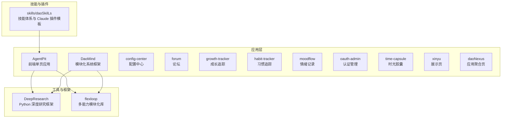
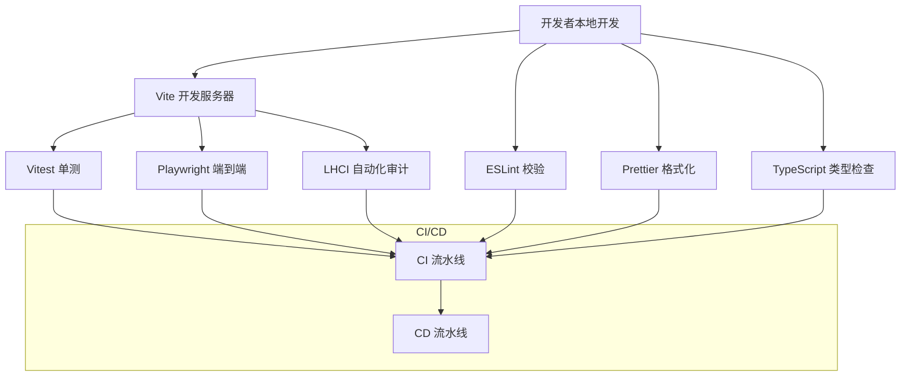
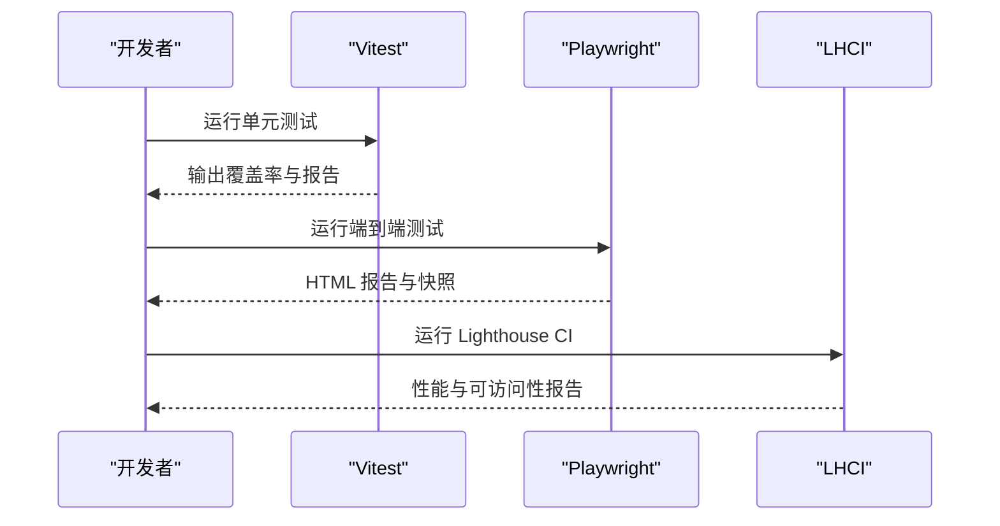
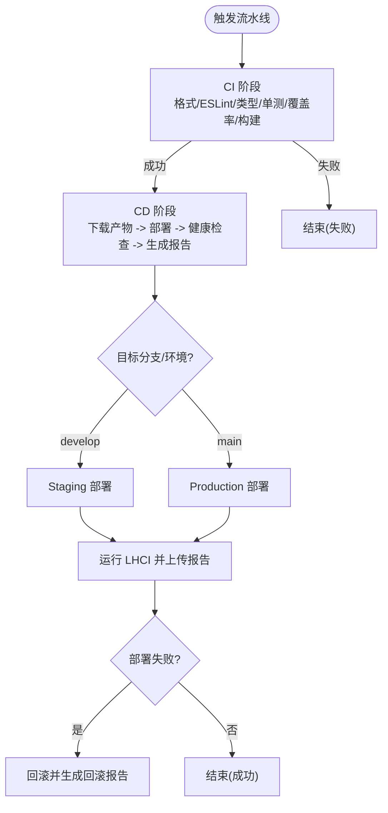
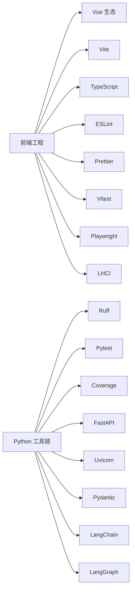

# 开发指南

<cite>
**本文引用的文件**
- [.github/workflows/ci.yml](file://.github/workflows/ci.yml)
- [.github/workflows/cd.yml](file://.github/workflows/cd.yml)
- [.prettierrc](file://.prettierrc)
- [apps/AgentPit/package.json](file://apps/AgentPit/package.json)
- [apps/AgentPit/eslint.config.js](file://apps/AgentPit/eslint.config.js)
- [apps/AgentPit/vite.config.ts](file://apps/AgentPit/vite.config.ts)
- [apps/AgentPit/tailwind.config.ts](file://apps/AgentPit/tailwind.config.ts)
- [apps/AgentPit/.editorconfig](file://apps/AgentPit/.editorconfig)
- [apps/AgentPit/.lighthouserc.json](file://apps/AgentPit/.lighthouserc.json)
- [apps/AgentPit/playwright.config.ts](file://apps/AgentPit/playwright.config.ts)
- [apps/AgentPit/vitest.config.ts](file://apps/AgentPit/vitest.config.ts)
- [apps/AgentPit/tsconfig.json](file://apps/AgentPit/tsconfig.json)
- [apps/DaoMind/package.json](file://apps/DaoMind/package.json)
- [skills/daoSkilLs/.gitignore](file://skills/daoSkilLs/.gitignore)
- [tools/DeepResearch/pyproject.toml](file://tools/DeepResearch/pyproject.toml)
- [tools/flexloop/pyproject.toml](file://tools/flexloop/pyproject.toml)
</cite>

## 目录
1. [简介](#简介)
2. [项目结构](#项目结构)
3. [核心组件](#核心组件)
4. [架构总览](#架构总览)
5. [详细组件分析](#详细组件分析)
6. [依赖分析](#依赖分析)
7. [性能考虑](#性能考虑)
8. [故障排查指南](#故障排查指南)
9. [结论](#结论)
10. [附录](#附录)

## 简介
本开发指南面向 DAOApps 项目的新老开发者，提供从代码规范、Git 工作流到代码审查、组件与功能模块开发、插件扩展、跨平台开发、工具配置、调试与性能优化、团队协作与知识分享的完整实践路径。内容以仓库现有配置与流水线为基础，结合前端（Vue 3/Vite）、测试（Vitest/Playwright）、质量保障（ESLint/Prettier/TSC/LHCI）与多语言工具链（Python/Ruff/Pytest），帮助团队建立一致、高效、可维护的开发体验。

## 项目结构
DAOApps 采用多应用与多工具并存的组织方式：
- 应用层：apps 下包含多个前端应用与页面型应用（如 AgentPit、DaoMind、config-center、forum、growth-tracker、habit-tracker、moodflow、oauth-admin、time-capsule、xinyu、daoNexus 等）
- 技能与插件：skills/daoSkilLs 提供技能体系与 Claude 插件模板
- 工具与框架：tools 下包含 Python 深度研究框架 DeepResearch 与多能力模块化库 flexloop
- 根级流水线：.github/workflows 提供 CI/CD 流水线

图表来源
- [apps/AgentPit/package.json:1-74](file://apps/AgentPit/package.json#L1-L74)
- [apps/DaoMind/package.json:1-1](file://apps/DaoMind/package.json#L1-L1)
- [tools/DeepResearch/pyproject.toml:1-93](file://tools/DeepResearch/pyproject.toml#L1-L93)
- [tools/flexloop/pyproject.toml:1-318](file://tools/flexloop/pyproject.toml#L1-L318)
- [skills/daoSkilLs/.gitignore:1-208](file://skills/daoSkilLs/.gitignore#L1-L208)

章节来源
- [apps/AgentPit/package.json:1-74](file://apps/AgentPit/package.json#L1-L74)
- [apps/DaoMind/package.json:1-1](file://apps/DaoMind/package.json#L1-L1)
- [tools/DeepResearch/pyproject.toml:1-93](file://tools/DeepResearch/pyproject.toml#L1-L93)
- [tools/flexloop/pyproject.toml:1-318](file://tools/flexloop/pyproject.toml#L1-L318)
- [skills/daoSkilLs/.gitignore:1-208](file://skills/daoSkilLs/.gitignore#L1-L208)

## 核心组件
- 前端工程化（Vite + Vue 3 + TypeScript）
  - 构建与预览：通过 Vite 配置与脚本实现开发、构建与预览
  - 类型检查：使用 vue-tsc 进行类型校验
  - 样式：TailwindCSS 配置与主题色扩展
  - 规范：ESLint + Prettier + EditorConfig 统一风格
- 质量与测试
  - 单元测试：Vitest 配置与覆盖率阈值
  - 端到端测试：Playwright 配置与设备集
  - Lighthouse CI：自动化性能与可访问性评估
- 流水线与发布
  - CI：Node.js 版本固定、格式检查、类型检查、单元测试、覆盖率上传、产物构建
  - CD：Staging/Production 双通道部署、健康检查、部署报告、失败自动回滚

章节来源
- [apps/AgentPit/vite.config.ts:1-15](file://apps/AgentPit/vite.config.ts#L1-L15)
- [apps/AgentPit/tailwind.config.ts:1-27](file://apps/AgentPit/tailwind.config.ts#L1-L27)
- [apps/AgentPit/eslint.config.js:1-162](file://apps/AgentPit/eslint.config.js#L1-L162)
- [.prettierrc:1-1](file://.prettierrc#L1-L1)
- [apps/AgentPit/.editorconfig:1-16](file://apps/AgentPit/.editorconfig#L1-L16)
- [apps/AgentPit/vitest.config.ts:1-48](file://apps/AgentPit/vitest.config.ts#L1-L48)
- [apps/AgentPit/playwright.config.ts:1-28](file://apps/AgentPit/playwright.config.ts#L1-L28)
- [apps/AgentPit/.lighthouserc.json:1-24](file://apps/AgentPit/.lighthouserc.json#L1-L24)
- [.github/workflows/ci.yml:1-67](file://.github/workflows/ci.yml#L1-L67)
- [.github/workflows/cd.yml:1-247](file://.github/workflows/cd.yml#L1-L247)

## 架构总览
下图展示了前端应用在本地开发、CI/CD 中的典型交互与职责分工：

图表来源
- [apps/AgentPit/vite.config.ts:1-15](file://apps/AgentPit/vite.config.ts#L1-L15)
- [apps/AgentPit/vitest.config.ts:1-48](file://apps/AgentPit/vitest.config.ts#L1-L48)
- [apps/AgentPit/playwright.config.ts:1-28](file://apps/AgentPit/playwright.config.ts#L1-L28)
- [apps/AgentPit/.lighthouserc.json:1-24](file://apps/AgentPit/.lighthouserc.json#L1-L24)
- [.github/workflows/ci.yml:1-67](file://.github/workflows/ci.yml#L1-L67)
- [.github/workflows/cd.yml:1-247](file://.github/workflows/cd.yml#L1-L247)

## 详细组件分析

### 前端工程化与开发环境
- 构建与别名
  - 使用 Vite 插件加载 Vue 与 TailwindCSS，并通过路径别名简化导入
- 类型与样式
  - TypeScript 二进制检查与 Tailwind 内容扫描范围明确
- 规范与编辑器
  - ESLint 平台化配置、Prettier 规则与 EditorConfig 行为统一
- 测试与覆盖率
  - Vitest 配置包含环境、全局设置、覆盖率阈值与排除规则
- 端到端与性能
  - Playwright 预设项目与 WebServer 启动；LHCI 收集与断言策略

章节来源
- [apps/AgentPit/vite.config.ts:1-15](file://apps/AgentPit/vite.config.ts#L1-L15)
- [apps/AgentPit/tailwind.config.ts:1-27](file://apps/AgentPit/tailwind.config.ts#L1-L27)
- [apps/AgentPit/tsconfig.json:1-8](file://apps/AgentPit/tsconfig.json#L1-L8)
- [apps/AgentPit/eslint.config.js:1-162](file://apps/AgentPit/eslint.config.js#L1-L162)
- [.prettierrc:1-1](file://.prettierrc#L1-L1)
- [apps/AgentPit/.editorconfig:1-16](file://apps/AgentPit/.editorconfig#L1-L16)
- [apps/AgentPit/vitest.config.ts:1-48](file://apps/AgentPit/vitest.config.ts#L1-L48)
- [apps/AgentPit/playwright.config.ts:1-28](file://apps/AgentPit/playwright.config.ts#L1-L28)
- [apps/AgentPit/.lighthouserc.json:1-24](file://apps/AgentPit/.lighthouserc.json#L1-L24)

### 测试与质量门禁流程
- 单元测试
  - Vitest 环境为 jsdom，覆盖组件、store、composables、utils，阈值 80%
- 端到端测试
  - Playwright 使用 Chromium 设备，支持重试与截图
- Lighthouse CI
  - 自动收集性能、可访问性、最佳实践、SEO 指标并断言

图表来源
- [apps/AgentPit/vitest.config.ts:1-48](file://apps/AgentPit/vitest.config.ts#L1-L48)
- [apps/AgentPit/playwright.config.ts:1-28](file://apps/AgentPit/playwright.config.ts#L1-L28)
- [apps/AgentPit/.lighthouserc.json:1-24](file://apps/AgentPit/.lighthouserc.json#L1-L24)

章节来源
- [apps/AgentPit/vitest.config.ts:1-48](file://apps/AgentPit/vitest.config.ts#L1-L48)
- [apps/AgentPit/playwright.config.ts:1-28](file://apps/AgentPit/playwright.config.ts#L1-L28)
- [apps/AgentPit/.lighthouserc.json:1-24](file://apps/AgentPit/.lighthouserc.json#L1-L24)

### CI/CD 流水线
- CI 步骤
  - 固定 Node.js 版本，安装依赖，格式检查，ESLint，类型检查，单测，覆盖率上传，构建产物
- CD 步骤
  - Staging/Production 双通道，下载构建产物，健康检查，生成部署报告，LHCI 报告上传，失败自动回滚

图表来源
- [.github/workflows/ci.yml:1-67](file://.github/workflows/ci.yml#L1-L67)
- [.github/workflows/cd.yml:1-247](file://.github/workflows/cd.yml#L1-L247)

章节来源
- [.github/workflows/ci.yml:1-67](file://.github/workflows/ci.yml#L1-L67)
- [.github/workflows/cd.yml:1-247](file://.github/workflows/cd.yml#L1-L247)

### 代码规范与格式化
- 统一风格
  - Prettier 规则集中于 .prettierrc，EditorConfig 控制换行、缩进、尾随空白等
  - ESLint 通过 flat 配置启用 Vue/TS 推荐规则并关闭部分生产环境警告
- 提交前检查
  - husky + lint-staged 在提交时自动执行 ESLint 修复与 Prettier 写入

章节来源
- [.prettierrc:1-1](file://.prettierrc#L1-L1)
- [apps/AgentPit/.editorconfig:1-16](file://apps/AgentPit/.editorconfig#L1-L16)
- [apps/AgentPit/eslint.config.js:1-162](file://apps/AgentPit/eslint.config.js#L1-L162)
- [apps/AgentPit/package.json:64-72](file://apps/AgentPit/package.json#L64-L72)

### 组件开发规范
- 组件组织
  - 建议按功能域划分目录（如 chat、collaboration、customize 等），保持单一职责
- 类型与状态
  - 使用 TypeScript 定义 props/emit/状态类型；Pinia store 管理跨组件状态
- 可组合逻辑
  - 将通用逻辑抽取为 composable，便于复用与测试
- 样式与主题
  - 基于 TailwindCSS 扩展主题色，避免内联样式

章节来源
- [apps/AgentPit/tailwind.config.ts:1-27](file://apps/AgentPit/tailwind.config.ts#L1-L27)

### 功能模块开发
- 页面与路由
  - 页面组件位于 views，路由集中配置；页面间通信优先通过 store 或 props
- 数据与服务
  - services 目录封装 API 调用、缓存与错误处理
- Mock 数据
  - data 目录提供 mock 数据，便于开发与测试

章节来源
- [apps/AgentPit/package.json:1-74](file://apps/AgentPit/package.json#L1-L74)

### 插件与技能开发指南
- Claude 插件
  - skills/daoSkilLs 提供插件模板与规范文件，遵循 marketplace 元数据约定
- 技能体系
  - 模块化设计，文档与参考材料齐全，便于扩展与复用

章节来源
- [skills/daoSkilLs/.gitignore:1-208](file://skills/daoSkilLs/.gitignore#L1-L208)

### 跨平台开发指导
- Node.js 版本一致性
  - CI/CD 固定 Node.js 版本，确保本地与流水线一致
- Python 工具链
  - DeepResearch 与 flexloop 使用 Python 3.14+，通过 pyproject.toml 管理依赖与测试配置
- 多语言协作
  - 前端（Vite/Vue/TS）、后端（Python/FastAPI）、数据库（Mongo/Redis/SQL）协同

章节来源
- [.github/workflows/ci.yml:13-15](file://.github/workflows/ci.yml#L13-L15)
- [tools/DeepResearch/pyproject.toml:9](file://tools/DeepResearch/pyproject.toml#L9-L9)
- [tools/flexloop/pyproject.toml:14](file://tools/flexloop/pyproject.toml#L14-L14)

### Git 工作流与代码审查
- 分支策略
  - develop 用于 Staging 发布，main 用于 Production 发布
- 提交前检查
  - husky + lint-staged 在提交时自动格式化与修复
- 代码审查
  - PR 触发 CI，通过后方可合并

章节来源
- [.github/workflows/cd.yml:3-8](file://.github/workflows/cd.yml#L3-L8)
- [apps/AgentPit/package.json:15-15](file://apps/AgentPit/package.json#L15-L15)
- [apps/AgentPit/package.json:64-72](file://apps/AgentPit/package.json#L64-L72)

### 开发工具配置与调试技巧
- IDE/编辑器
  - 使用 EditorConfig 与 Prettier 保证团队一致的编辑体验
- 调试
  - Vite 开发服务器热更新；Playwright 支持首次失败截图与 trace
- 性能
  - LHCI 断言性能与可访问性基线，持续监控

章节来源
- [apps/AgentPit/.editorconfig:1-16](file://apps/AgentPit/.editorconfig#L1-L16)
- [apps/AgentPit/.lighthouserc.json:1-24](file://apps/AgentPit/.lighthouserc.json#L1-L24)
- [apps/AgentPit/playwright.config.ts:1-28](file://apps/AgentPit/playwright.config.ts#L1-L28)

### 团队协作与知识分享
- 文档与规范
  - 工具链与贡献指南位于 tools/DeepResearch 与 tools/flexloop 的文档目录
- 任务与规范
  - .trae/specs 与 .trae/tasks 提供任务拆解与规范模板
- 知识沉淀
  - README、SPEC、CHECKLIST、REPORT 等文件形成知识资产

章节来源
- [tools/DeepResearch/pyproject.toml:1-93](file://tools/DeepResearch/pyproject.toml#L1-L93)
- [tools/flexloop/pyproject.toml:1-318](file://tools/flexloop/pyproject.toml#L1-L318)

## 依赖分析
- 前端依赖
  - Vue 3、Vue Router、Pinia、TailwindCSS、Vite、TypeScript、ESLint、Prettier、Vitest、Playwright、LHCI
- Python 工具链
  - Ruff、Pytest、Coverage、FastAPI、Uvicorn、Pydantic、LangChain、LangGraph 等

图表来源
- [apps/AgentPit/package.json:20-62](file://apps/AgentPit/package.json#L20-L62)
- [tools/DeepResearch/pyproject.toml:12-26](file://tools/DeepResearch/pyproject.toml#L12-L26)
- [tools/flexloop/pyproject.toml:5-18](file://tools/flexloop/pyproject.toml#L5-L18)

章节来源
- [apps/AgentPit/package.json:20-62](file://apps/AgentPit/package.json#L20-L62)
- [tools/DeepResearch/pyproject.toml:12-26](file://tools/DeepResearch/pyproject.toml#L12-L26)
- [tools/flexloop/pyproject.toml:5-18](file://tools/flexloop/pyproject.toml#L5-L18)

## 性能考虑
- 构建与体积
  - 使用 Vite 与 Tree-shaking，合理拆分包与懒加载
- 运行时性能
  - LHCI 断言性能与可访问性基线，定期回归
- 测试覆盖率
  - Vitest 覆盖率阈值约束关键模块，提升稳定性

章节来源
- [apps/AgentPit/.lighthouserc.json:1-24](file://apps/AgentPit/.lighthouserc.json#L1-L24)
- [apps/AgentPit/vitest.config.ts:30-35](file://apps/AgentPit/vitest.config.ts#L30-L35)

## 故障排查指南
- CI 失败
  - 检查格式、ESLint、类型检查、单测与覆盖率是否通过
- 部署失败
  - 查看部署报告与回滚报告，确认健康检查与产物完整性
- LHCI 不达标
  - 优化首屏渲染、资源压缩、可访问性标签与 SEO 元信息

章节来源
- [.github/workflows/ci.yml:35-55](file://.github/workflows/ci.yml#L35-L55)
- [.github/workflows/cd.yml:52-75](file://.github/workflows/cd.yml#L52-L75)
- [.github/workflows/cd.yml:226-246](file://.github/workflows/cd.yml#L226-L246)
- [apps/AgentPit/.lighthouserc.json:11-18](file://apps/AgentPit/.lighthouserc.json#L11-L18)

## 结论
本指南基于仓库现有配置，给出了从工程化、测试、质量门禁到 CI/CD、跨语言协作与团队规范的系统性实践建议。建议新成员优先熟悉前端工程化与测试配置，再逐步深入工具链与技能体系，配合 CI/CD 与 LHCI 形成闭环的质量保障。

## 附录
- 快速上手清单
  - 安装 Node.js（与 CI 一致版本）、安装依赖、运行格式检查与类型检查、启动开发服务器、运行单测与端到端测试、生成 LHCI 报告
- 常用脚本
  - dev/build/preview/lint/format/type-check/test/test:run/test:coverage

章节来源
- [.github/workflows/ci.yml:24-49](file://.github/workflows/ci.yml#L24-L49)
- [apps/AgentPit/package.json:6-18](file://apps/AgentPit/package.json#L6-L18)