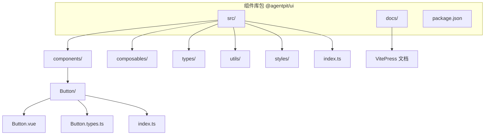
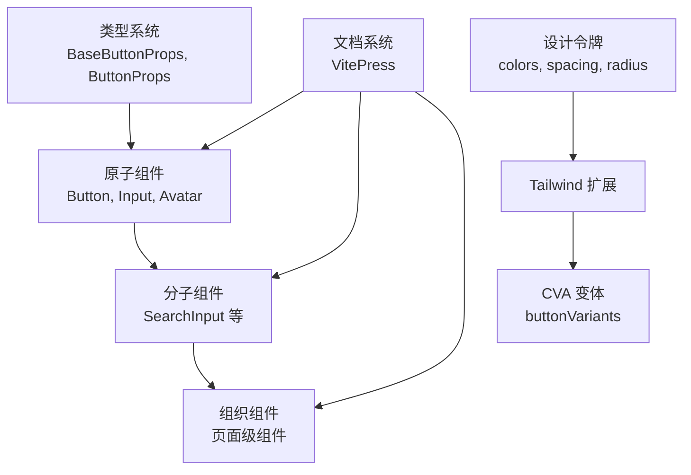
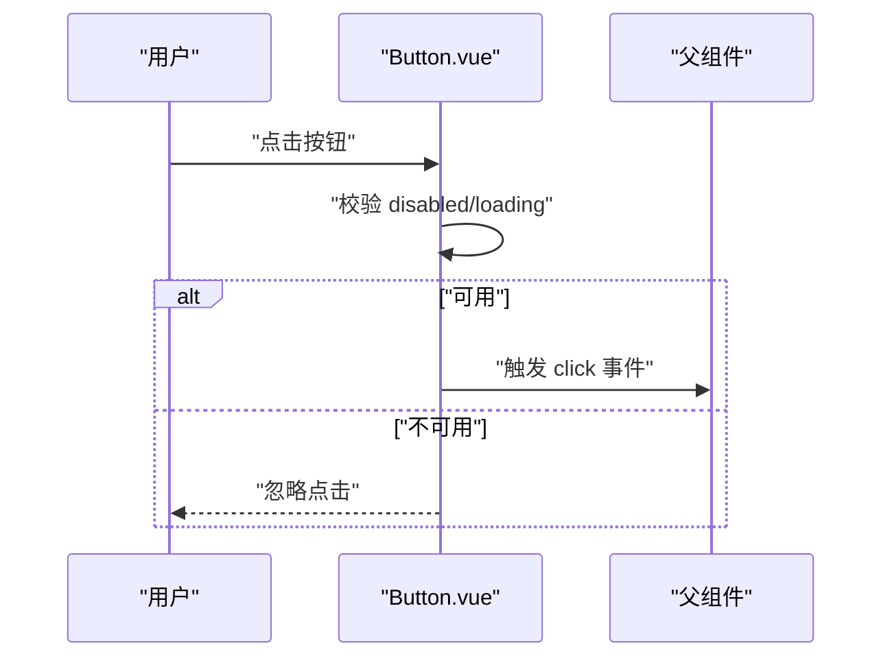
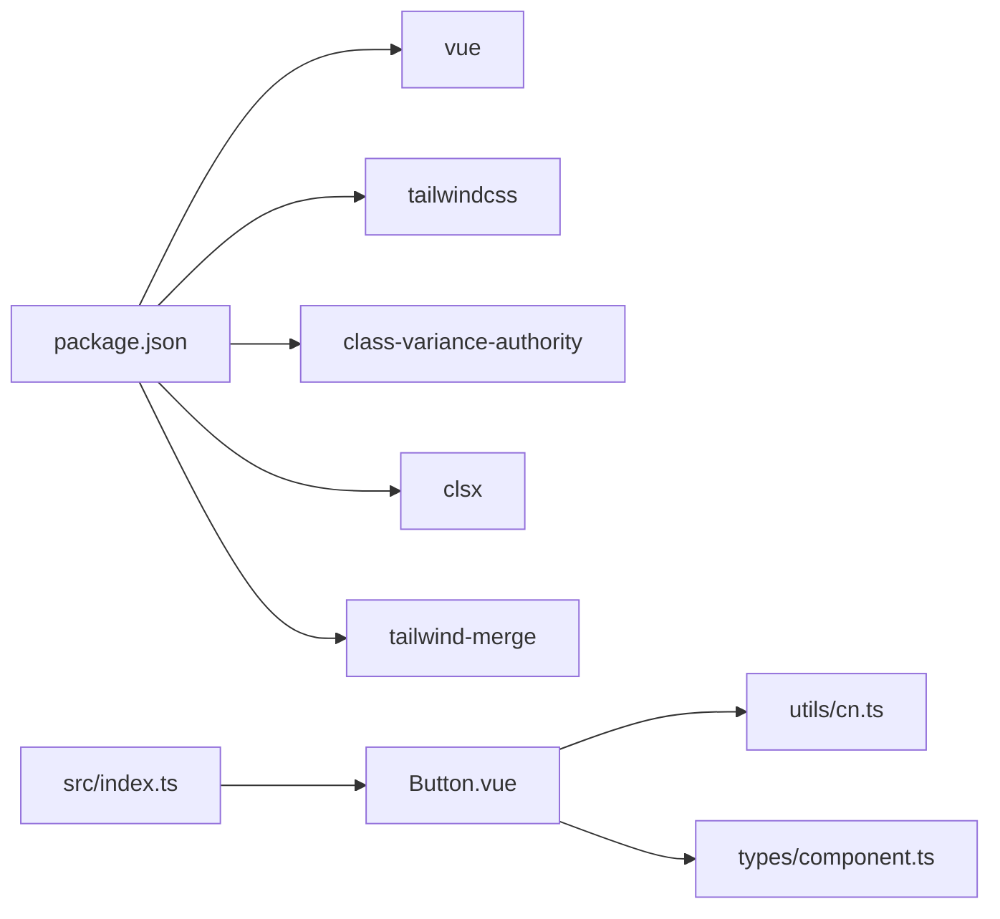

# 组件开发

<cite>
**本文引用的文件**
- [README.md](file://apps/AgentPit/packages/ui/README.md)
- [package.json](file://apps/AgentPit/packages/ui/package.json)
- [index.ts](file://apps/AgentPit/packages/ui/src/index.ts)
- [VUE3_COMPONENT_GUIDE.md](file://apps/AgentPit/docs/VUE3_COMPONENT_GUIDE.md)
- [COMPONENT_LIBRARY_ARCHITECTURE.md](file://apps/AgentPit/docs/COMPONENT_LIBRARY_ARCHITECTURE.md)
- [Button.vue](file://apps/AgentPit/packages/ui/src/components/Button/Button.vue)
- [Button.types.ts](file://apps/AgentPit/packages/ui/src/components/Button/Button.types.ts)
- [useToggle.ts](file://apps/AgentPit/packages/ui/src/composables/useToggle.ts)
</cite>

## 目录
1. [简介](#简介)
2. [项目结构](#项目结构)
3. [核心组件](#核心组件)
4. [架构总览](#架构总览)
5. [组件详解](#组件详解)
6. [依赖关系分析](#依赖关系分析)
7. [性能考量](#性能考量)
8. [故障排查指南](#故障排查指南)
9. [结论](#结论)
10. [附录](#附录)

## 简介
本指南面向 DAOApps 项目中的组件开发，聚焦于 UI 组件开发规范、业务组件封装方法与组件库架构设计。内容涵盖组件设计原则、Props 定义规范、事件处理模式、插槽使用指南；同时给出测试策略、文档编写要求与版本管理流程，并以 Button 组件为例提供实现细节与最佳实践，最后总结组件复用策略、性能优化技巧与无障碍访问支持建议。

## 项目结构
AgentPit UI 组件库位于 apps/AgentPit/packages/ui，采用模块化、分层清晰的目录结构：
- src/components：按组件维度独立文件夹，包含实现、类型与导出
- src/composables：可复用组合式函数（如 useToggle）
- src/types：通用类型与组件基类型
- src/utils：工具函数（如 cn、context、format、id）
- src/styles：设计令牌、主题与 Tailwind 配置
- docs：VitePress 文档站点
- 构建与发布：Vite + Vue 3 + TypeScript + Tailwind CSS

**图表来源**
- [COMPONENT_LIBRARY_ARCHITECTURE.md:32-93](file://apps/AgentPit/docs/COMPONENT_LIBRARY_ARCHITECTURE.md#L32-L93)
- [package.json:1-58](file://apps/AgentPit/packages/ui/package.json#L1-L58)

**章节来源**
- [COMPONENT_LIBRARY_ARCHITECTURE.md:28-140](file://apps/AgentPit/docs/COMPONENT_LIBRARY_ARCHITECTURE.md#L28-L140)
- [package.json:1-58](file://apps/AgentPit/packages/ui/package.json#L1-L58)

## 核心组件
- 组件实现：每个组件独立文件夹，包含实现文件、类型定义与导出入口
- 组合式函数：useToggle 等可复用逻辑，遵循单一职责
- 类型系统：BaseButtonProps 等基类型 + 组件特有类型，统一导出
- 样式系统：基于 class-variance-authority 的变体管理，结合 cn 工具与 Tailwind 设计令牌
- 文档体系：VitePress 组件文档，包含基础用法、API 与示例

**章节来源**
- [COMPONENT_LIBRARY_ARCHITECTURE.md:95-140](file://apps/AgentPit/docs/COMPONENT_LIBRARY_ARCHITECTURE.md#L95-L140)
- [Button.vue:1-81](file://apps/AgentPit/packages/ui/src/components/Button/Button.vue#L1-L81)
- [Button.types.ts:1-16](file://apps/AgentPit/packages/ui/src/components/Button/Button.types.ts#L1-L16)
- [useToggle.ts:1-25](file://apps/AgentPit/packages/ui/src/composables/useToggle.ts#L1-L25)

## 架构总览
组件库围绕“高复用、可维护、可扩展”设计，采用分层架构：
- 原子层：Button、Input、Avatar 等基础组件
- 分子层：由原子组件组合（如 SearchInput = Input + Button）
- 组织层：页面级组件，由分子组件组成
- 样式层：设计令牌 + Tailwind 扩展 + CVA 变体
- 类型层：统一导出，保障类型安全
- 文档层：VitePress 组件文档与指南

**图表来源**
- [COMPONENT_LIBRARY_ARCHITECTURE.md:494-583](file://apps/AgentPit/docs/COMPONENT_LIBRARY_ARCHITECTURE.md#L494-L583)

**章节来源**
- [COMPONENT_LIBRARY_ARCHITECTURE.md:440-583](file://apps/AgentPit/docs/COMPONENT_LIBRARY_ARCHITECTURE.md#L440-L583)

## 组件详解

### Button 组件实现与最佳实践
- 设计要点
  - 使用 class-variance-authority 定义变体与尺寸，结合 cn 合并类名
  - Props 通过 withDefaults 提供合理默认值，避免运行时歧义
  - 事件仅在非禁用且非 loading 时触发，保证交互一致性
  - 支持 loading 状态、图标位置、块级按钮等常用能力
- 关键实现路径
  - 组件实现：[Button.vue:1-81](file://apps/AgentPit/packages/ui/src/components/Button/Button.vue#L1-L81)
  - 类型定义：[Button.types.ts:1-16](file://apps/AgentPit/packages/ui/src/components/Button/Button.types.ts#L1-L16)
- 交互流程（点击事件）

**图表来源**
- [Button.vue:56-60](file://apps/AgentPit/packages/ui/src/components/Button/Button.vue#L56-L60)

**章节来源**
- [Button.vue:1-81](file://apps/AgentPit/packages/ui/src/components/Button/Button.vue#L1-L81)
- [Button.types.ts:1-16](file://apps/AgentPit/packages/ui/src/components/Button/Button.types.ts#L1-L16)

### 组件设计原则与规范
- 设计原则
  - 单一职责、开闭原则、依赖倒置
  - Props 严格类型、合理默认值；事件命名 kebab-case、参数简洁；插槽语义化
- 代码规范
  - 使用 <script setup lang="ts">、scoped 样式、Composition API
  - 导入路径使用 @ 别名、文件命名规范（组件 PascalCase、类型 ComponentName.types.ts）
- 目录结构
  - 组件独立文件夹，统一通过 index.ts 导出；类型与实现分离

**章节来源**
- [COMPONENT_LIBRARY_ARCHITECTURE.md:440-492](file://apps/AgentPit/docs/COMPONENT_LIBRARY_ARCHITECTURE.md#L440-L492)
- [VUE3_COMPONENT_GUIDE.md:506-574](file://apps/AgentPit/docs/VUE3_COMPONENT_GUIDE.md#L506-L574)

### Props 定义规范
- 基类继承：ButtonProps 继承 BaseButtonProps，确保一致的通用属性
- 变体与尺寸：通过枚举类型约束，减少运行时错误
- 默认值：withDefaults 提供合理默认，提升易用性
- 参考路径
  - [Button.types.ts:1-16](file://apps/AgentPit/packages/ui/src/components/Button/Button.types.ts#L1-L16)

**章节来源**
- [Button.types.ts:1-16](file://apps/AgentPit/packages/ui/src/components/Button/Button.types.ts#L1-L16)

### 事件处理模式
- 显式声明事件：defineEmits 确保事件契约清晰
- 防抖与禁用：在组件内部拦截不可用状态，避免无效事件传播
- 参考路径
  - [Button.vue:17-20](file://apps/AgentPit/packages/ui/src/components/Button/Button.vue#L17-L20)

**章节来源**
- [Button.vue:17-20](file://apps/AgentPit/packages/ui/src/components/Button/Button.vue#L17-L20)

### 插槽使用指南
- 默认插槽：承载按钮文本或内容
- 场景示例：Button 组件支持左右图标位置，通过默认插槽与条件渲染实现
- 参考路径
  - [Button.vue:63-80](file://apps/AgentPit/packages/ui/src/components/Button/Button.vue#L63-L80)

**章节来源**
- [Button.vue:63-80](file://apps/AgentPit/packages/ui/src/components/Button/Button.vue#L63-L80)

### 组合式函数封装示例
- useToggle：提供 value、toggle、setTrue、setFalse，满足开关类交互
- 复用策略：将通用逻辑抽取为 composable，降低组件复杂度
- 参考路径
  - [useToggle.ts:1-25](file://apps/AgentPit/packages/ui/src/composables/useToggle.ts#L1-L25)

**章节来源**
- [useToggle.ts:1-25](file://apps/AgentPit/packages/ui/src/composables/useToggle.ts#L1-L25)

## 依赖关系分析
- 组件库依赖
  - Vue 3（peerDependencies），构建工具 Vite，类型系统 TypeScript
  - 样式：Tailwind CSS 4.x、class-variance-authority、clsx、tailwind-merge
- 内部依赖
  - Button 依赖 utils/cn 与 types/component 中的基类型
  - 组件统一通过 src/index.ts 导出，便于消费端按需引入

**图表来源**
- [package.json:31-47](file://apps/AgentPit/packages/ui/package.json#L31-L47)
- [Button.vue:1-6](file://apps/AgentPit/packages/ui/src/components/Button/Button.vue#L1-L6)
- [index.ts:1-6](file://apps/AgentPit/packages/ui/src/index.ts#L1-L6)

**章节来源**
- [package.json:31-47](file://apps/AgentPit/packages/ui/package.json#L31-L47)
- [index.ts:1-6](file://apps/AgentPit/packages/ui/src/index.ts#L1-L6)

## 性能考量
- 计算属性缓存：大量计算使用 computed，避免重复计算
- 防抖与节流：在高频交互场景使用防抖/节流（如搜索）
- 虚拟滚动：长列表使用虚拟滚动降低 DOM 节点数
- 样式合并：使用 cn 合并类名，减少不必要的样式冲突
- 组件懒加载：路由级或大组件按需加载
- 事件拦截：在组件内部拦截不可用状态，减少无效回调

[本节为通用指导，无需特定文件引用]

## 故障排查指南
- 样式异常
  - 检查 scoped 样式是否正确隔离
  - 确认 Tailwind 配置与设计令牌是否生效
- 类名冲突
  - 使用 cn 工具合并类名，避免重复覆盖
- 事件未触发
  - 确认 disabled/loading 状态是否被设置
  - 检查事件是否在组件内部被拦截
- 类型错误
  - 确认 Props 类型与默认值是否匹配
  - 检查 BaseButtonProps 等基类型是否正确继承

**章节来源**
- [COMPONENT_LIBRARY_ARCHITECTURE.md:181-241](file://apps/AgentPit/docs/COMPONENT_LIBRARY_ARCHITECTURE.md#L181-L241)
- [Button.vue:56-60](file://apps/AgentPit/packages/ui/src/components/Button/Button.vue#L56-L60)
- [Button.types.ts:1-16](file://apps/AgentPit/packages/ui/src/components/Button/Button.types.ts#L1-L16)

## 结论
通过清晰的目录结构、严格的类型系统、可扩展的样式与文档体系，AgentPit UI 组件库实现了高复用、可维护与可扩展的目标。遵循本文的设计原则与规范，结合 Button 组件的实现细节，可高效产出高质量的 UI 组件，并在 DAOApps 项目中形成统一的组件开发与交付标准。

## 附录

### 组件测试策略
- 单元测试：针对组合式函数（如 useToggle）进行行为验证
- 组件测试：验证渲染、交互与事件触发（可参考现有测试实践）
- 文档即测试：组件文档中的示例可作为回归测试用例

**章节来源**
- [COMPONENT_LIBRARY_ARCHITECTURE.md:535-540](file://apps/AgentPit/docs/COMPONENT_LIBRARY_ARCHITECTURE.md#L535-L540)

### 文档编写要求
- 组件文档模板：包含基础用法、不同变体、API（Props/Events/Slots）
- 文档站点：VitePress，支持代码高亮与主题定制
- 文档命令：docs:dev、docs:build、docs:preview

**章节来源**
- [COMPONENT_LIBRARY_ARCHITECTURE.md:308-384](file://apps/AgentPit/docs/COMPONENT_LIBRARY_ARCHITECTURE.md#L308-L384)

### 版本管理流程
- 语义化版本：MAJOR/MINOR/PATCH
- 发布流程：更新 CHANGELOG、版本号、构建测试、打标签、发布 npm
- 分支策略：main（稳定）、develop（开发）、feature/*、hotfix/*

**章节来源**
- [COMPONENT_LIBRARY_ARCHITECTURE.md:387-437](file://apps/AgentPit/docs/COMPONENT_LIBRARY_ARCHITECTURE.md#L387-L437)

### 组件复用策略与无障碍访问支持
- 复用策略
  - 将通用逻辑抽取为 composable（如 useToggle）
  - 通过 Props、Slots、Events 提供扩展点
  - 使用基类型与变体系统增强可配置性
- 无障碍访问
  - 合理使用语义化标签与 aria 属性
  - 确保键盘可达与焦点管理
  - 提供足够的对比度与可读性

**章节来源**
- [COMPONENT_LIBRARY_ARCHITECTURE.md:494-583](file://apps/AgentPit/docs/COMPONENT_LIBRARY_ARCHITECTURE.md#L494-L583)