# Monorepo开发模式

<cite>
**本文档引用的文件**
- [pnpm-workspace.yaml](file://apps/DaoMind/pnpm-workspace.yaml)
- [package.json](file://apps/DaoMind/package.json)
- [tsconfig.base.json](file://apps/DaoMind/tsconfig.base.json)
- [tsconfig.json](file://apps/DaoMind/tsconfig.json)
- [package.json](file://apps/AgentPit/package.json)
- [tsconfig.json](file://apps/AgentPit/tsconfig.json)
- [package.json](file://apps/config-center/package.json)
- [vitest.config.ts](file://apps/config-center/vitest.config.ts)
- [vite.config.ts](file://apps/daoNexus/vite.config.ts)
- [package.json](file://apps/daoNexus/package.json)
</cite>

## 目录
1. [简介](#简介)
2. [项目结构](#项目结构)
3. [核心组件](#核心组件)
4. [架构概览](#架构概览)
5. [详细组件分析](#详细组件分析)
6. [依赖关系分析](#依赖关系分析)
7. [性能考虑](#性能考虑)
8. [故障排除指南](#故障排除指南)
9. [结论](#结论)
10. [附录](#附录)

## 简介

DAO Collective项目采用现代化的Monorepo开发模式，基于pnpm workspace构建，实现了多个应用和包的统一管理。该项目的核心目标是通过共享配置、依赖管理和构建流程，提高开发效率并保持代码一致性。

本指南将深入解析项目的Monorepo架构，包括pnpm workspace配置、包依赖关系管理、TypeScript项目引用、测试配置以及发布流程等关键方面。

## 项目结构

项目采用分层的Monorepo结构，主要分为以下几个层次：

```mermaid
graph TB
subgraph "根目录"
Root[根配置文件]
Workspace[pnpm-workspace.yaml]
BaseTS[基础tsconfig配置]
end
subgraph "应用层"
AgentPit[AgentPit应用]
ConfigCenter[配置中心应用]
DaoNexus[DAO Nexus应用]
Forum[论坛应用]
GrowthTracker[成长追踪器]
HabitTracker[习惯追踪器]
MoodFlow[情绪流应用]
OAuthAdmin[OAuth管理]
TimeCapsule[时光胶囊]
Xinyu[新语应用]
end
subgraph "包层"
Shared[共享包 @tao/shared]
UI[UI组件包 @tao/ui]
APIClient[API客户端 @tao/api-client]
Collective[Collective包 @daomind/collective]
Agents[Agents包 @daomind/agents]
Apps[Apps包 @daomind/apps]
Nothing[Nothing包 @daomind/nothing]
Qi[Qi包 @daomind/qi]
Monitor[Monitor包 @daomind/monitor]
Verify[Verify包 @daomind/verify]
end
Root --> Workspace
Workspace --> AgentPit
Workspace --> ConfigCenter
Workspace --> DaoNexus
Workspace --> Shared
Workspace --> UI
Workspace --> APIClient
Workspace --> Collective
Workspace --> Agents
Workspace --> Apps
Workspace --> Nothing
Workspace --> Qi
Workspace --> Monitor
Workspace --> Verify
```

**图表来源**
- [pnpm-workspace.yaml:1-3](file://apps/DaoMind/pnpm-workspace.yaml#L1-L3)
- [package.json:1-37](file://apps/AgentPit/package.json#L1-L37)

**章节来源**
- [pnpm-workspace.yaml:1-3](file://apps/DaoMind/pnpm-workspace.yaml#L1-L3)
- [package.json:1-1](file://apps/DaoMind/package.json#L1-L1)

## 核心组件

### pnpm workspace配置

项目使用pnpm workspace实现包管理的统一化，配置位于根目录的`pnpm-workspace.yaml`文件中：

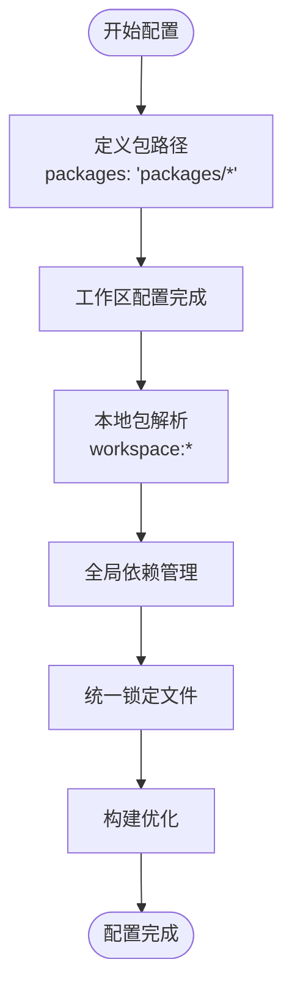

**图表来源**
- [pnpm-workspace.yaml:1-3](file://apps/DaoMind/pnpm-workspace.yaml#L1-L3)

### TypeScript配置体系

项目建立了完整的TypeScript配置体系，包括基础配置和应用特定配置：

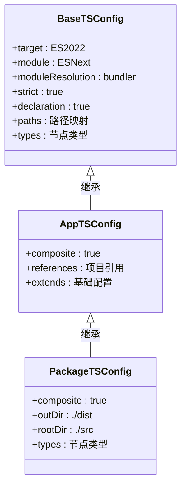

**图表来源**
- [tsconfig.base.json:1-1](file://apps/DaoMind/tsconfig.base.json#L1-L1)
- [tsconfig.json:1-1](file://apps/DaoMind/tsconfig.json#L1-L1)
- [tsconfig.json:1-1](file://apps/DaoMind/packages/daoCollective/tsconfig.json#L1-L1)

**章节来源**
- [tsconfig.base.json:1-1](file://apps/DaoMind/tsconfig.base.json#L1-L1)
- [tsconfig.json:1-1](file://apps/DaoMind/tsconfig.json#L1-L1)

## 架构概览

项目采用分层架构设计，实现了清晰的关注点分离：

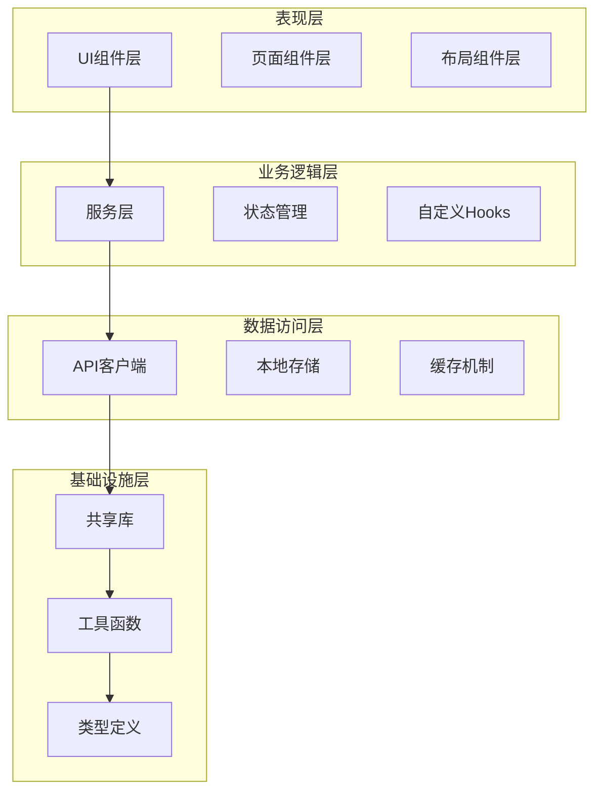

**图表来源**
- [package.json:14-26](file://apps/config-center/package.json#L14-L26)
- [package.json:13-21](file://apps/daoNexus/package.json#L13-L21)

## 详细组件分析

### 包依赖关系管理

项目实现了严格的包依赖管理策略，确保版本一致性和依赖解析的准确性：

```mermaid
graph LR
subgraph "外部依赖"
React[React ^18.3.1]
ReactDOM[React DOM ^18.3.1]
Router[React Router ^7.1.1]
Zustand[Zustand ^5.0.3]
end
subgraph "内部包依赖"
Shared[@tao/shared]
UI[@tao/ui]
APIClient[@tao/api-client]
end
subgraph "应用层"
ConfigCenter[配置中心]
DaoNexus[DAO Nexus]
AgentPit[AgentPit]
end
ConfigCenter --> Shared
ConfigCenter --> UI
ConfigCenter --> APIClient
DaoNexus --> Shared
DaoNexus --> UI
AgentPit --> React
AgentPit --> ReactDOM
AgentPit --> Router
AgentPit --> Zustand
```

**图表来源**
- [package.json:14-26](file://apps/config-center/package.json#L14-L26)
- [package.json:13-21](file://apps/daoNexus/package.json#L13-L21)
- [package.json:12-18](file://apps/AgentPit/package.json#L12-L18)

### 跨包引用最佳实践

项目实现了多种跨包引用策略，确保代码复用和模块化：

#### 路径别名配置

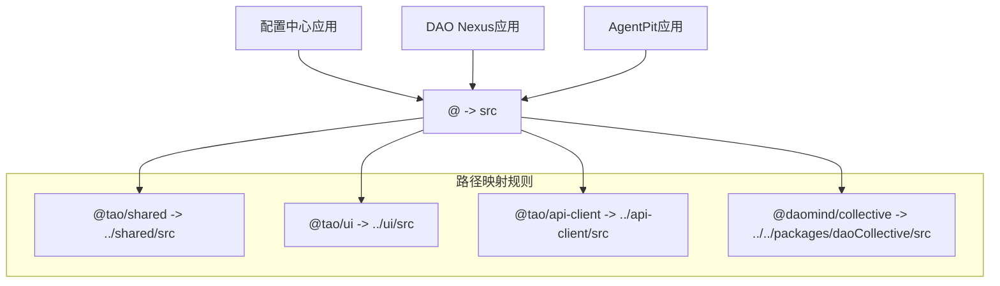

**图表来源**
- [vitest.config.ts:7-11](file://apps/config-center/vitest.config.ts#L7-L11)
- [vite.config.ts:7-11](file://apps/daoNexus/vite.config.ts#L7-L11)

#### TypeScript项目引用

项目使用TypeScript的项目引用功能实现编译时的模块化：

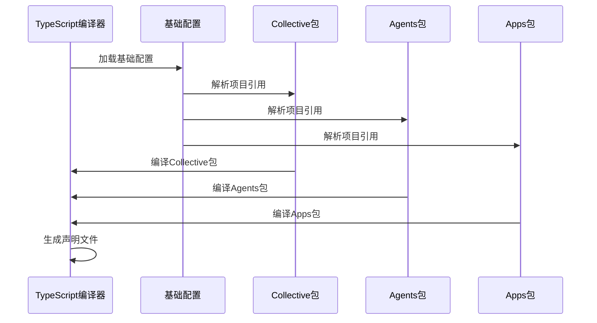

**图表来源**
- [tsconfig.json:1-1](file://apps/DaoMind/tsconfig.json#L1-L1)

**章节来源**
- [package.json:14-26](file://apps/config-center/package.json#L14-L26)
- [vitest.config.ts:7-11](file://apps/config-center/vitest.config.ts#L7-L11)

### 测试配置和运行策略

项目实现了多层次的测试策略，包括单元测试、集成测试和端到端测试：

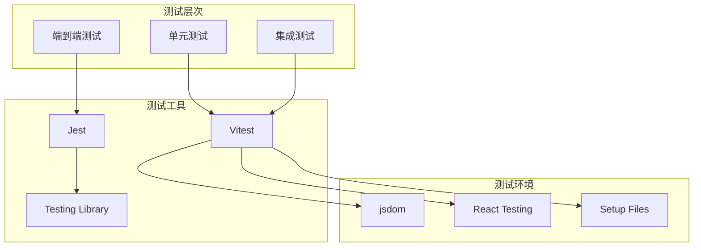

**图表来源**
- [vitest.config.ts:12-16](file://apps/config-center/vitest.config.ts#L12-L16)
- [package.json:11-12](file://apps/config-center/package.json#L11-L12)

**章节来源**
- [vitest.config.ts:1-18](file://apps/config-center/vitest.config.ts#L1-L18)
- [package.json:11-12](file://apps/config-center/package.json#L11-L12)

### 构建配置和优化

项目实现了高效的构建配置，支持多应用和多包的并行构建：

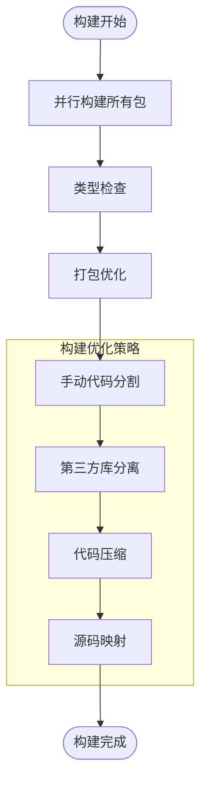

**图表来源**
- [vite.config.ts:12-35](file://apps/daoNexus/vite.config.ts#L12-L35)

**章节来源**
- [vite.config.ts:1-36](file://apps/daoNexus/vite.config.ts#L1-L36)

## 依赖关系分析

### 依赖图谱

项目建立了清晰的依赖关系图谱，实现了依赖的层次化管理：

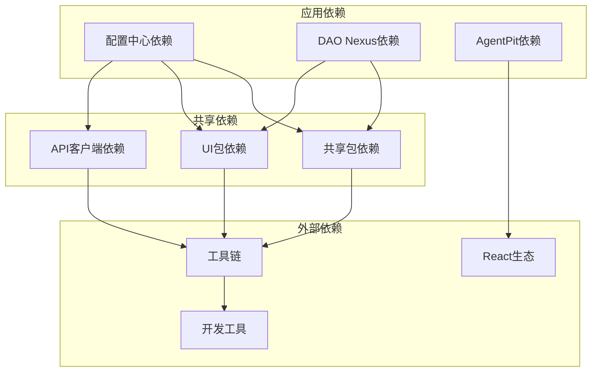

**图表来源**
- [package.json:14-26](file://apps/config-center/package.json#L14-L26)
- [package.json:12-18](file://apps/AgentPit/package.json#L12-L18)

### 版本管理策略

项目采用了统一的版本管理策略，确保各包版本的一致性：

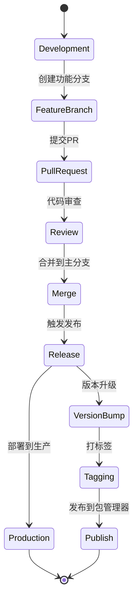

**图表来源**
- [package.json:2-4](file://apps/config-center/package.json#L2-L4)

**章节来源**
- [package.json:2-4](file://apps/config-center/package.json#L2-L4)

## 性能考虑

### 构建性能优化

项目实施了多项性能优化措施：

1. **并行构建**: 利用pnpm的并行特性加速包构建
2. **增量编译**: TypeScript项目引用实现增量编译
3. **代码分割**: 智能的代码分割策略减少初始加载时间
4. **缓存机制**: 利用pnpm的高效缓存系统

### 运行时性能优化

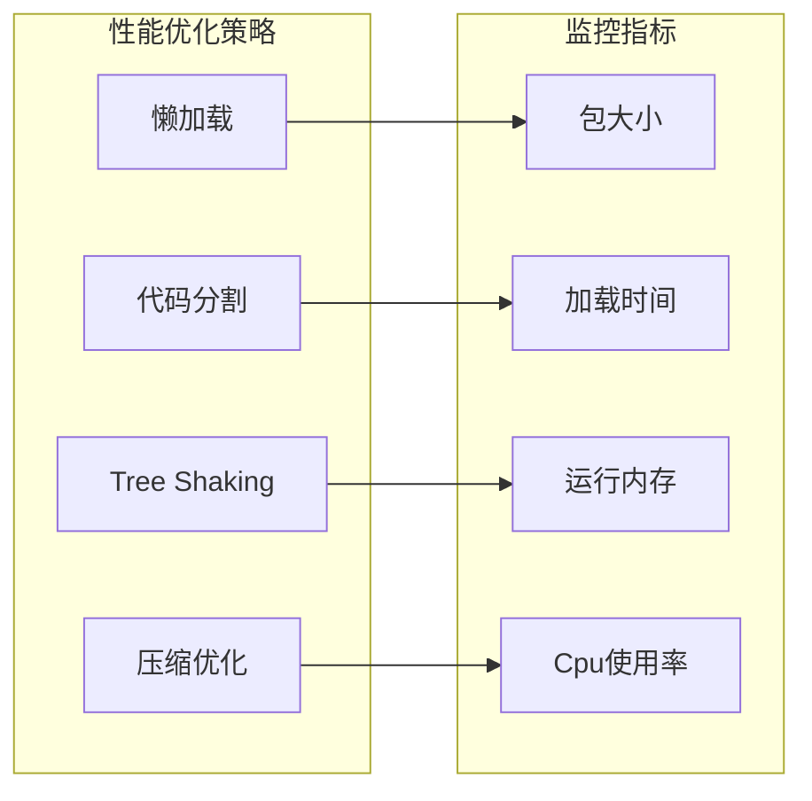

## 故障排除指南

### 常见问题及解决方案

#### 依赖解析问题

当遇到依赖解析失败时，检查以下配置：

1. **pnpm workspace配置**: 确保包路径正确配置
2. **路径别名**: 验证tsconfig中的路径映射
3. **类型声明**: 确保相关包的类型声明存在

#### 构建错误排查

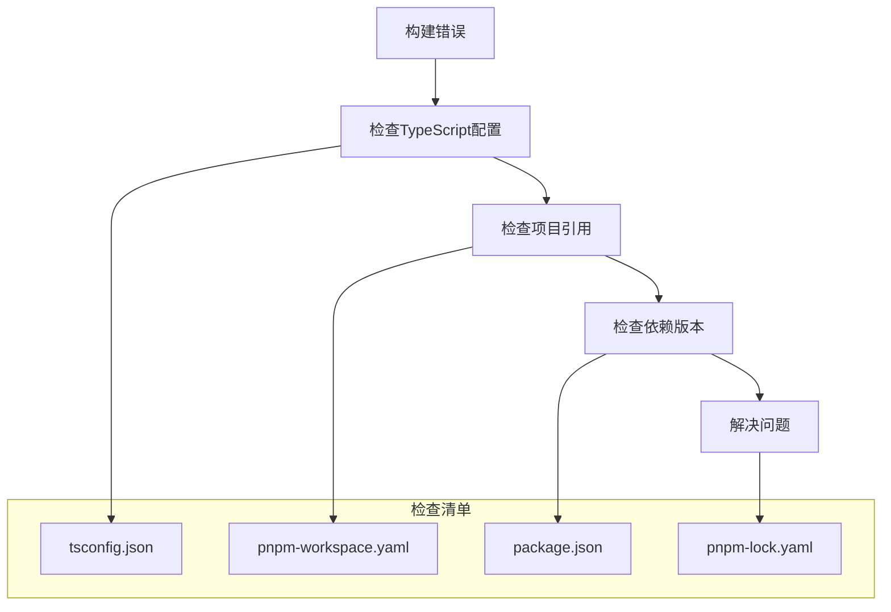

#### 开发服务器问题

当开发服务器出现问题时：

1. **清理缓存**: 删除node_modules和锁定文件
2. **重新安装**: 使用pnpm重新安装依赖
3. **检查端口**: 确认端口未被占用
4. **验证配置**: 检查Vite配置文件

**章节来源**
- [package.json:1-37](file://apps/AgentPit/package.json#L1-L37)

## 结论

DAO Collective项目的Monorepo架构展现了现代前端开发的最佳实践。通过pnpm workspace的深度集成、完善的TypeScript配置体系、严格的依赖管理策略以及高效的构建优化，项目实现了开发效率和代码质量的双重提升。

该架构的优势包括：
- 统一的包管理和服务化开发
- 清晰的依赖关系和版本控制
- 高效的构建和部署流程
- 完善的测试和质量保证体系

## 附录

### 开发工具链配置

项目集成了多种开发工具以提升开发体验：

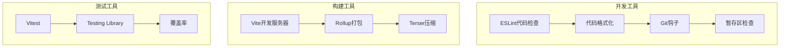

### CI/CD流程

项目支持多种CI/CD流程配置，可根据需要选择合适的方案：

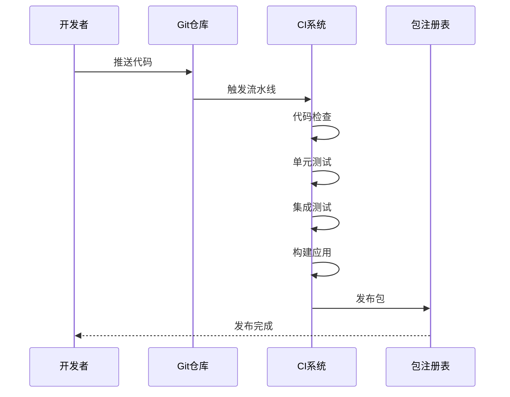