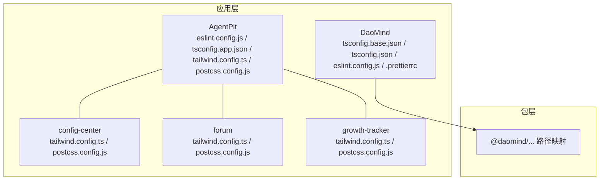
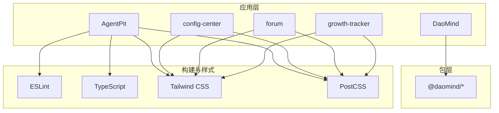
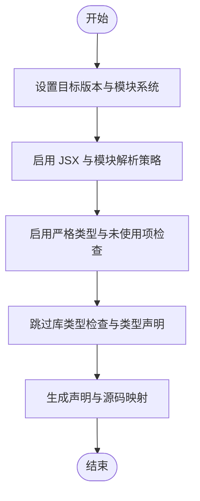
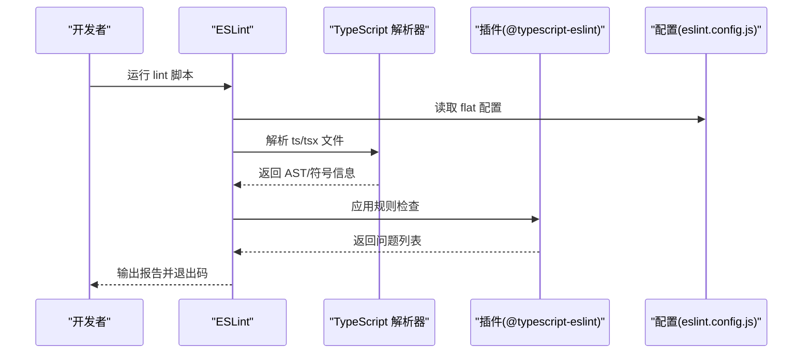
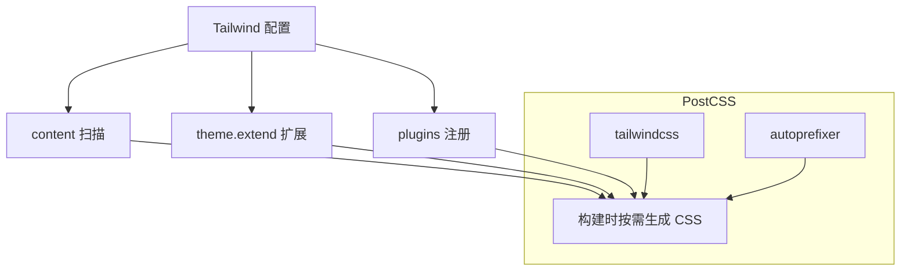
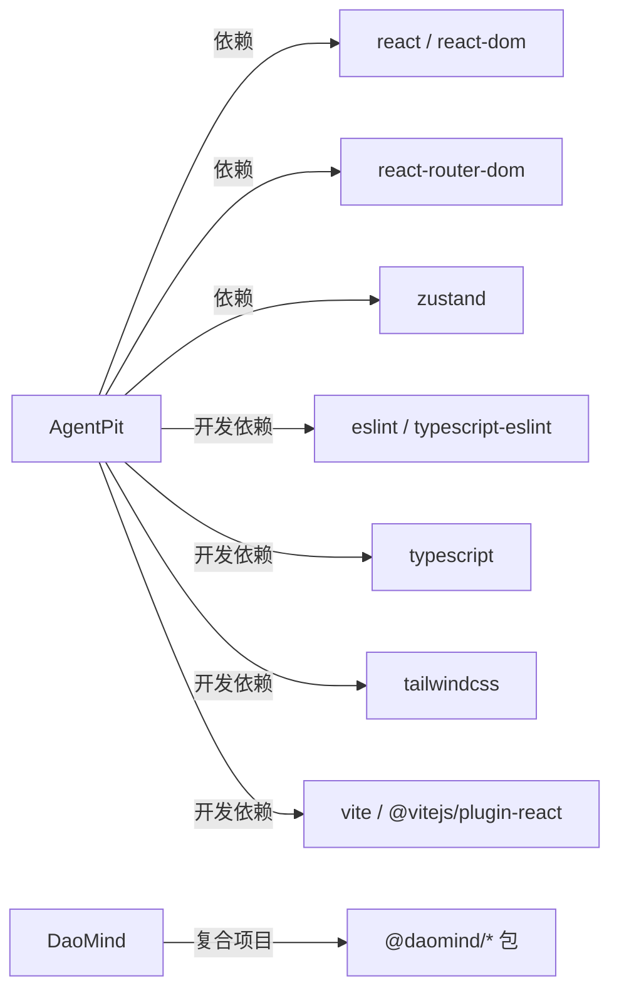

# 代码规范

<cite>
**本文引用的文件**
- [apps/AgentPit/eslint.config.js](file://apps/AgentPit/eslint.config.js)
- [apps/AgentPit/tailwind.config.ts](file://apps/AgentPit/tailwind.config.ts)
- [apps/AgentPit/tsconfig.app.json](file://apps/AgentPit/tsconfig.app.json)
- [apps/AgentPit/package.json](file://apps/AgentPit/package.json)
- [apps/AgentPit/postcss.config.js](file://apps/AgentPit/postcss.config.js)
- [apps/DaoMind/.prettierrc](file://apps/DaoMind/.prettierrc)
- [apps/DaoMind/eslint.config.js](file://apps/DaoMind/eslint.config.js)
- [apps/DaoMind/tsconfig.base.json](file://apps/DaoMind/tsconfig.base.json)
- [apps/DaoMind/tsconfig.json](file://apps/DaoMind/tsconfig.json)
- [apps/config-center/tailwind.config.ts](file://apps/config-center/tailwind.config.ts)
- [apps/forum/tailwind.config.ts](file://apps/forum/tailwind.config.ts)
- [apps/growth-tracker/tailwind.config.ts](file://apps/growth-tracker/tailwind.config.ts)
- [apps/config-center/postcss.config.js](file://apps/config-center/postcss.config.js)
- [apps/forum/postcss.config.js](file://apps/forum/postcss.config.js)
- [apps/growth-tracker/postcss.config.js](file://apps/growth-tracker/postcss.config.js)
</cite>

## 目录
1. [引言](#引言)
2. [项目结构](#项目结构)
3. [核心组件](#核心组件)
4. [架构总览](#架构总览)
5. [详细组件分析](#详细组件分析)
6. [依赖关系分析](#依赖关系分析)
7. [性能考虑](#性能考虑)
8. [故障排查指南](#故障排查指南)
9. [结论](#结论)
10. [附录](#附录)

## 引言
本文件为 DAO Collective 项目的统一代码规范文档，面向 TypeScript 编码、ESLint 规则与代码质量检查、Prettier 格式化、React 组件开发（函数组件、Hooks 使用、状态管理）、CSS/Tailwind 样式编写、注释与命名约定以及文件组织原则等维度，提供可操作的规范与最佳实践。文档同时给出代码审查检查清单与质量标准，帮助团队在多应用、多包的复杂工程中保持一致的开发体验与交付质量。

## 项目结构
DAO Collective 采用多应用（apps）与多包（packages）的 monorepo 结构。各应用独立维护其构建工具链与样式体系，但共享部分通用配置（如 Tailwind、PostCSS）。整体结构要点如下：
- 应用层：AgentPit、DaoMind、config-center、forum、growth-tracker 等，每个应用自包含 tsconfig、eslint、tailwind、postcss 等配置。
- 包层：DaoMind 下通过 tsconfig.base.json 与 tsconfig.json 声明复合项目与路径映射，便于跨包引用与类型生成。
- 样式层：各应用独立维护 tailwind.config.ts 与 postcss.config.js，确保内容扫描与自动前缀策略一致。

图表来源
- [apps/AgentPit/tailwind.config.ts:1-30](file://apps/AgentPit/tailwind.config.ts#L1-L30)
- [apps/DaoMind/tsconfig.base.json:1-1](file://apps/DaoMind/tsconfig.base.json#L1-L1)
- [apps/DaoMind/tsconfig.json:1-1](file://apps/DaoMind/tsconfig.json#L1-L1)

章节来源
- [apps/AgentPit/package.json:1-37](file://apps/AgentPit/package.json#L1-L37)
- [apps/DaoMind/tsconfig.base.json:1-1](file://apps/DaoMind/tsconfig.base.json#L1-L1)
- [apps/DaoMind/tsconfig.json:1-1](file://apps/DaoMind/tsconfig.json#L1-L1)

## 核心组件
本节聚焦于 TypeScript、ESLint、Prettier、Tailwind 与 React 开发的关键配置与规范要点。

- TypeScript 编码规范
  - 类型优先：优先使用明确类型，避免 any；对未使用参数使用下划线前缀模式以减少告警噪音。
  - 严格模式：启用严格类型检查、索引访问一致性、源码映射与声明文件生成，提升类型安全与可维护性。
  - 构建目标：统一使用 ES2023 与 esnext 模块解析，配合 bundler 语法与 verbatimModuleSyntax，确保现代打包器兼容。
  - 语言特性：开启 JSX 支持（react-jsx），保留无用变量/参数检查，避免 switch fallthrough 错误。

- ESLint 配置与规则
  - AgentPit：采用 flat 配置，集成 @eslint/js、typescript-eslint、react-hooks、react-refresh，覆盖 ts/tsx 文件，推荐规则集基础上扩展。
  - DaoMind：显式配置 @typescript-eslint 解析器与插件，针对未使用变量、显式返回类型、any 使用、console 使用设置警告级别，强调可读性与安全性。
  - 通用建议：统一 lint 脚本命名（如 lint），在 CI 中强制执行；对第三方产物忽略（dist、node_modules、coverage）。

- Prettier 格式化
  - DaoMind 的 .prettierrc 提供统一格式化风格：无分号、单引号、2 空格缩进、尾随逗号、100 字符行长、括号间距、箭头函数括号、LF 结尾。
  - 建议：在 IDE 中启用保存时格式化，并在仓库根或应用根添加 .editorconfig 以统一换行与缩进。

- Tailwind 与 PostCSS
  - 内容扫描：content 覆盖 index.html 与 src 下 ts/tsx，确保按需生成样式。
  - 主题扩展：颜色、圆角、字体、动画等通过 theme.extend 统一管理，支持暗色模式类名策略。
  - 插件：统一启用 tailwindcss-animate 插件，提供常用动画变体。
  - 自动前缀：postcss.config.js 统一配置 tailwindcss 与 autoprefixer。

- React 组件开发规范
  - 函数组件优先：使用函数组件与 Hooks，避免类组件。
  - Hooks 使用：遵循 Hooks 规则（仅在顶层调用、仅在条件语句外调用），合理拆分自定义 Hooks。
  - 状态管理：小范围本地状态使用 useState/useReducer；全局状态优先考虑 zustand 或上下文，避免深层 props drilling。
  - 类型安全：为 props、事件处理器、异步数据定义明确类型，结合 React.FC 或函数签名约束。

章节来源
- [apps/AgentPit/tsconfig.app.json:1-26](file://apps/AgentPit/tsconfig.app.json#L1-L26)
- [apps/AgentPit/eslint.config.js:1-24](file://apps/AgentPit/eslint.config.js#L1-L24)
- [apps/DaoMind/eslint.config.js:1-27](file://apps/DaoMind/eslint.config.js#L1-L27)
- [apps/DaoMind/.prettierrc:1-1](file://apps/DaoMind/.prettierrc#L1-L1)
- [apps/AgentPit/tailwind.config.ts:1-30](file://apps/AgentPit/tailwind.config.ts#L1-L30)
- [apps/AgentPit/postcss.config.js:1-7](file://apps/AgentPit/postcss.config.js#L1-L7)
- [apps/config-center/tailwind.config.ts:1-104](file://apps/config-center/tailwind.config.ts#L1-L104)
- [apps/forum/tailwind.config.ts:1-161](file://apps/forum/tailwind.config.ts#L1-L161)
- [apps/growth-tracker/tailwind.config.ts:1-134](file://apps/growth-tracker/tailwind.config.ts#L1-L134)

## 架构总览
下图展示应用层与包层之间的关系，以及样式与构建工具的协作方式：

图表来源
- [apps/DaoMind/tsconfig.base.json:1-1](file://apps/DaoMind/tsconfig.base.json#L1-L1)
- [apps/DaoMind/tsconfig.json:1-1](file://apps/DaoMind/tsconfig.json#L1-L1)
- [apps/AgentPit/eslint.config.js:1-24](file://apps/AgentPit/eslint.config.js#L1-L24)
- [apps/AgentPit/tailwind.config.ts:1-30](file://apps/AgentPit/tailwind.config.ts#L1-L30)
- [apps/AgentPit/postcss.config.js:1-7](file://apps/AgentPit/postcss.config.js#L1-L7)

## 详细组件分析

### TypeScript 配置分析
- 目标与模块系统
  - 目标版本：ES2023，适配现代浏览器与打包器。
  - 模块解析：bundler，支持 verbatimModuleSyntax，避免隐式模块行为。
  - JSX：react-jsx，确保 React 18+ JSX 转换正确。
- 严格性与检查
  - 启用 noUnusedLocals、noUnusedParameters、noFallthroughCasesInSwitch，降低潜在错误。
  - skipLibCheck 与 types 优化编译性能与类型检查稳定性。
- 复合项目与路径映射（DaoMind）
  - tsconfig.base.json 定义严格选项与路径别名，tsconfig.json 通过 references 组织复合项目，便于跨包开发与类型生成。

图表来源
- [apps/AgentPit/tsconfig.app.json:1-26](file://apps/AgentPit/tsconfig.app.json#L1-L26)
- [apps/DaoMind/tsconfig.base.json:1-1](file://apps/DaoMind/tsconfig.base.json#L1-L1)
- [apps/DaoMind/tsconfig.json:1-1](file://apps/DaoMind/tsconfig.json#L1-L1)

章节来源
- [apps/AgentPit/tsconfig.app.json:1-26](file://apps/AgentPit/tsconfig.app.json#L1-L26)
- [apps/DaoMind/tsconfig.base.json:1-1](file://apps/DaoMind/tsconfig.base.json#L1-L1)
- [apps/DaoMind/tsconfig.json:1-1](file://apps/DaoMind/tsconfig.json#L1-L1)

### ESLint 配置分析
- AgentPit（Flat 配置）
  - 扩展：@eslint/js 推荐规则、typescript-eslint 推荐规则、react-hooks 推荐规则、react-refresh Vite 专用规则。
  - 适用文件：所有 ts/tsx。
  - 语言选项：浏览器全局、ECMAScript 2020。
- DaoMind（显式插件配置）
  - 解析器：@typescript-eslint/parser。
  - 插件：@typescript-eslint/eslint-plugin。
  - 关键规则：
    - 未使用变量：忽略以下划线开头的参数。
    - 显式函数返回类型：警告，鼓励明确返回值类型。
    - any 使用：警告，鼓励更精确类型。
    - console 使用：允许 warn/error，禁止 log/debug。
  - 忽略目录：dist、node_modules、coverage、非 ts/tsx、.d.ts。

图表来源
- [apps/AgentPit/eslint.config.js:1-24](file://apps/AgentPit/eslint.config.js#L1-L24)
- [apps/DaoMind/eslint.config.js:1-27](file://apps/DaoMind/eslint.config.js#L1-L27)

章节来源
- [apps/AgentPit/eslint.config.js:1-24](file://apps/AgentPit/eslint.config.js#L1-L24)
- [apps/DaoMind/eslint.config.js:1-27](file://apps/DaoMind/eslint.config.js#L1-L27)

### Prettier 格式化配置
- DaoMind 的 .prettierrc 提供统一风格：
  - 半角分号关闭、单引号、2 空格缩进、尾随逗号、100 字符行长、括号间距、箭头函数括号、LF 结尾。
- 建议：
  - 在 IDE 中启用保存时格式化。
  - 在仓库根添加 .editorconfig 以统一换行与缩进。

章节来源
- [apps/DaoMind/.prettierrc:1-1](file://apps/DaoMind/.prettierrc#L1-L1)

### Tailwind 与 PostCSS 配置
- AgentPit
  - content：index.html 与 src 下 ts/tsx。
  - 主题扩展：定义 primary 颜色集。
  - 插件：空数组。
- DaoMind 生态（config-center、forum、growth-tracker）
  - content：index.html 与 src 及共享包路径。
  - 主题扩展：边框、输入、环形、背景、前景、主/次/破坏/柔和/强调/弹出/卡片、成功/警告、环境色阶、圆角、字体族、动画与关键帧。
  - 插件：tailwindcss-animate。
  - PostCSS：统一 tailwindcss 与 autoprefixer。

图表来源
- [apps/AgentPit/tailwind.config.ts:1-30](file://apps/AgentPit/tailwind.config.ts#L1-L30)
- [apps/config-center/tailwind.config.ts:1-104](file://apps/config-center/tailwind.config.ts#L1-L104)
- [apps/forum/tailwind.config.ts:1-161](file://apps/forum/tailwind.config.ts#L1-L161)
- [apps/growth-tracker/tailwind.config.ts:1-134](file://apps/growth-tracker/tailwind.config.ts#L1-L134)
- [apps/AgentPit/postcss.config.js:1-7](file://apps/AgentPit/postcss.config.js#L1-L7)
- [apps/config-center/postcss.config.js:1-7](file://apps/config-center/postcss.config.js#L1-L7)
- [apps/forum/postcss.config.js:1-7](file://apps/forum/postcss.config.js#L1-L7)
- [apps/growth-tracker/postcss.config.js:1-6](file://apps/growth-tracker/postcss.config.js#L1-L6)

章节来源
- [apps/AgentPit/tailwind.config.ts:1-30](file://apps/AgentPit/tailwind.config.ts#L1-L30)
- [apps/config-center/tailwind.config.ts:1-104](file://apps/config-center/tailwind.config.ts#L1-L104)
- [apps/forum/tailwind.config.ts:1-161](file://apps/forum/tailwind.config.ts#L1-L161)
- [apps/growth-tracker/tailwind.config.ts:1-134](file://apps/growth-tracker/tailwind.config.ts#L1-L134)
- [apps/AgentPit/postcss.config.js:1-7](file://apps/AgentPit/postcss.config.js#L1-L7)
- [apps/config-center/postcss.config.js:1-7](file://apps/config-center/postcss.config.js#L1-L7)
- [apps/forum/postcss.config.js:1-7](file://apps/forum/postcss.config.js#L1-L7)
- [apps/growth-tracker/postcss.config.js:1-6](file://apps/growth-tracker/postcss.config.js#L1-L6)

### React 组件开发规范
- 函数组件与 Hooks
  - 使用函数组件与 Hooks（useState、useEffect、useCallback、useMemo、自定义 Hooks）。
  - 仅在组件顶层与条件外调用 Hooks，避免循环、条件或嵌套函数中调用。
  - 将可复用逻辑抽取为自定义 Hooks，保持组件职责单一。
- 状态管理
  - 本地状态：useState/useReducer。
  - 全局状态：优先使用 zustand，避免深层 props drilling；必要时使用 Context。
- 类型安全
  - 为 props、事件处理器、异步数据定义明确类型；使用 React.FC 或函数签名约束。
  - 对外部 API 数据使用类型守卫与解构赋值，保证运行时安全。
- 性能优化
  - 合理使用 useMemo/useCallback 缓存计算结果与回调。
  - 使用 React.lazy 与 Suspense 实现路由级懒加载。
- 样式与主题
  - 优先使用 Tailwind 工具类；通过 theme.extend 统一颜色与动画。
  - 暗色模式通过 class 策略实现，确保组件在不同主题下表现一致。

章节来源
- [apps/AgentPit/package.json:1-37](file://apps/AgentPit/package.json#L1-L37)

## 依赖关系分析
- 应用与工具链
  - AgentPit：依赖 react、react-dom、react-router-dom、recharts、zustand；开发依赖包含 ESLint、TypeScript、Tailwind、Vite 等。
  - DaoMind：通过 tsconfig.base.json 与 tsconfig.json 组织复合项目，路径映射至多个 @daomind/* 包。
- 样式与构建
  - 各应用统一使用 Tailwind 与 PostCSS，content 覆盖 src 与共享包路径，确保样式按需生成且可复用。

图表来源
- [apps/AgentPit/package.json:1-37](file://apps/AgentPit/package.json#L1-L37)
- [apps/DaoMind/tsconfig.base.json:1-1](file://apps/DaoMind/tsconfig.base.json#L1-L1)
- [apps/DaoMind/tsconfig.json:1-1](file://apps/DaoMind/tsconfig.json#L1-L1)

章节来源
- [apps/AgentPit/package.json:1-37](file://apps/AgentPit/package.json#L1-L37)
- [apps/DaoMind/tsconfig.base.json:1-1](file://apps/DaoMind/tsconfig.base.json#L1-L1)
- [apps/DaoMind/tsconfig.json:1-1](file://apps/DaoMind/tsconfig.json#L1-L1)

## 性能考虑
- 构建与打包
  - 使用 bundler 模块解析与 verbatimModuleSyntax，减少模块边界歧义，提升打包器优化空间。
  - 启用 noEmit 与 tsBuildInfoFile，缩短增量编译时间。
- 样式体积
  - content 精准扫描，避免无关文件参与样式生成；通过 theme.extend 统一变量，减少重复定义。
  - 合理使用动画与阴影，避免过度重排与重绘。
- 运行时性能
  - 使用 useMemo/useCallback 缓存昂贵计算与回调；组件拆分与懒加载降低首屏负担。
  - 避免不必要的全局状态更新，使用细粒度 Store 与 selector。

## 故障排查指南
- ESLint 报错
  - AgentPit：确认 flat 配置已正确扩展推荐规则与插件；检查 files 匹配是否覆盖到 ts/tsx。
  - DaoMind：检查 @typescript-eslint 解析器与插件是否安装；核对忽略目录与项目路径配置。
- TypeScript 编译错误
  - 检查 tsconfig.app.json 的 target/moduleResolution/verbatimModuleSyntax 是否与打包器一致。
  - DaoMind：确认复合项目 references 与路径映射正确，避免类型解析失败。
- Tailwind 样式未生效
  - 确认 content 覆盖到实际使用的文件；检查 postcss.config.js 中 tailwindcss 与 autoprefixer 是否存在。
  - 若使用暗色模式，确认 class 策略与根元素类名一致。
- Prettier 格式化不一致
  - 确认 .prettierrc 存在且被编辑器识别；在 IDE 中启用保存时格式化；必要时添加 .editorconfig。

章节来源
- [apps/AgentPit/eslint.config.js:1-24](file://apps/AgentPit/eslint.config.js#L1-L24)
- [apps/DaoMind/eslint.config.js:1-27](file://apps/DaoMind/eslint.config.js#L1-L27)
- [apps/AgentPit/tsconfig.app.json:1-26](file://apps/AgentPit/tsconfig.app.json#L1-L26)
- [apps/DaoMind/tsconfig.base.json:1-1](file://apps/DaoMind/tsconfig.base.json#L1-L1)
- [apps/DaoMind/tsconfig.json:1-1](file://apps/DaoMind/tsconfig.json#L1-L1)
- [apps/AgentPit/tailwind.config.ts:1-30](file://apps/AgentPit/tailwind.config.ts#L1-L30)
- [apps/AgentPit/postcss.config.js:1-7](file://apps/AgentPit/postcss.config.js#L1-L7)
- [apps/DaoMind/.prettierrc:1-1](file://apps/DaoMind/.prettierrc#L1-L1)

## 结论
DAO Collective 的代码规范围绕“类型安全、规则一致、样式可控、组件清晰”展开。通过统一的 TypeScript、ESLint、Prettier、Tailwind 与 React 最佳实践，团队可在多应用与多包环境中保持高质量交付。建议在日常开发中严格执行 lint 与格式化流程，并在代码审查中对照规范逐项检查。

## 附录

### 代码审查检查清单
- TypeScript
  - 是否使用明确类型？是否避免 any？
  - 未使用变量/参数是否按约定处理？
  - 是否启用严格模式与相关检查？
- ESLint
  - 是否通过 lint 脚本？是否存在未修复的警告/错误？
  - 是否正确忽略第三方产物与声明文件？
- Prettier
  - 是否符合 .prettierrc 风格？保存时是否自动格式化？
- Tailwind
  - content 是否覆盖到实际文件？是否使用工具类而非内联样式？
  - 暗色模式与主题变量是否一致？
- React
  - 函数组件与 Hooks 使用是否符合规则？
  - 自定义 Hooks 是否职责单一？状态管理是否合理？
  - 是否进行必要的性能优化（缓存、懒加载）？

### 质量标准
- 代码可读性：命名清晰、注释必要、结构简洁。
- 类型安全：无 any、无未使用变量、返回类型明确。
- 规范一致性：ESLint 与 Prettier 通过 CI 强制执行。
- 样式一致性：Tailwind 主题统一、动画与交互一致。
- 组件质量：职责单一、可测试、可维护。