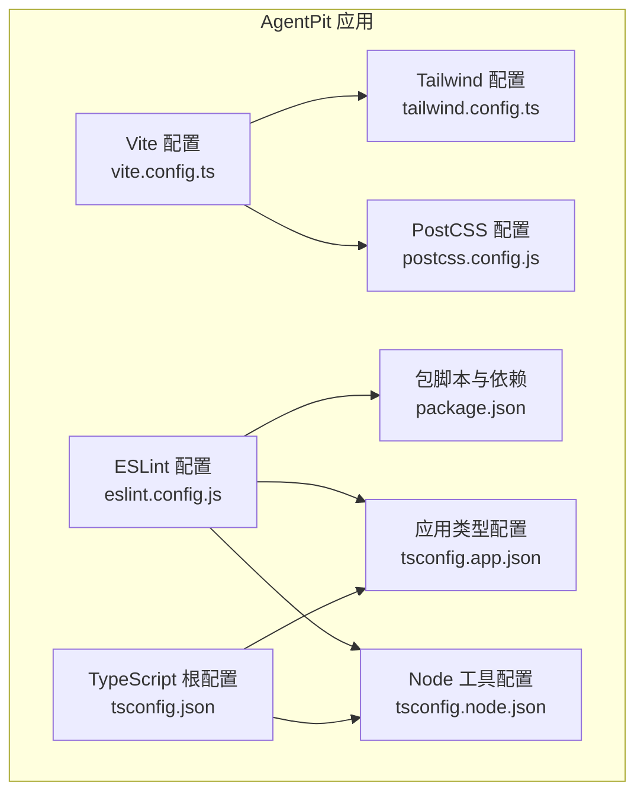
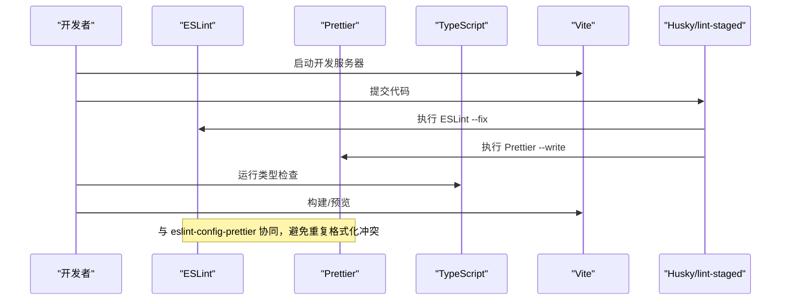
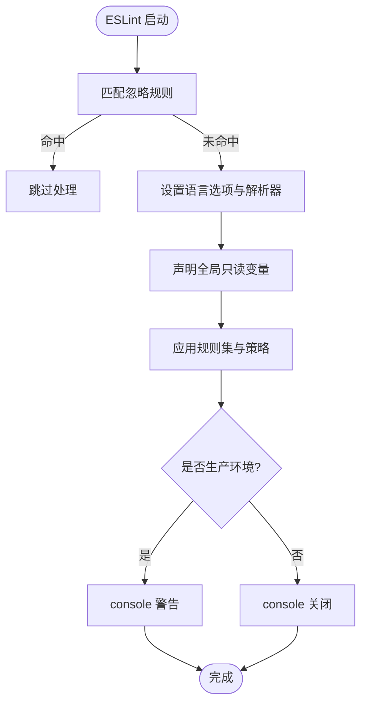
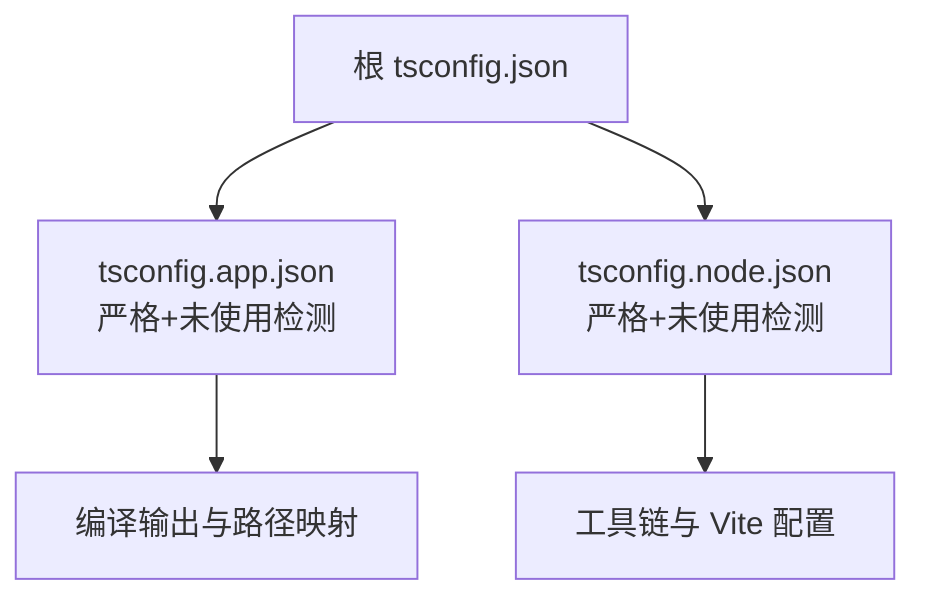
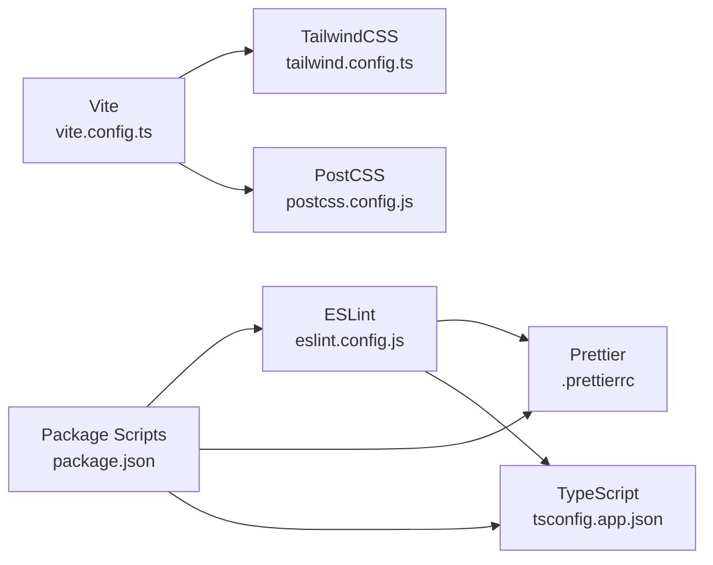

# 代码规范与风格

<cite>
**本文引用的文件**
- [apps/AgentPit/eslint.config.js](file://apps/AgentPit/eslint.config.js)
- [apps/AgentPit/tsconfig.json](file://apps/AgentPit/tsconfig.json)
- [apps/AgentPit/tsconfig.app.json](file://apps/AgentPit/tsconfig.app.json)
- [apps/AgentPit/tsconfig.node.json](file://apps/AgentPit/tsconfig.node.json)
- [apps/AgentPit/package.json](file://apps/AgentPit/package.json)
- [apps/AgentPit/tailwind.config.ts](file://apps/AgentPit/tailwind.config.ts)
- [apps/AgentPit/postcss.config.js](file://apps/AgentPit/postcss.config.js)
- [apps/AgentPit/vite.config.ts](file://apps/AgentPit/vite.config.ts)
- [apps/DaoMind/.prettierrc](file://apps/DaoMind/.prettierrc)
- [apps/DaoMind/tsconfig.base.json](file://apps/DaoMind/tsconfig.base.json)
- [apps/AgentPit/src/components/collaboration/AgentWorkspace.tsx](file://apps/AgentPit/src/components/collaboration/AgentWorkspace.tsx)
- [apps/AgentPit/src/pages/HomePage.tsx](file://apps/AgentPit/src/pages/HomePage.tsx)
- [apps/AgentPit/src/stores/useAppStore.ts](file://apps/AgentPit/src/stores/useAppStore.ts)
- [apps/AgentPit/src/types/chatTypes.ts](file://apps/AgentPit/src/types/chatTypes.ts)
- [apps/AgentPit/src/App.tsx](file://apps/AgentPit/src/App.tsx)
</cite>

## 目录
1. [简介](#简介)
2. [项目结构](#项目结构)
3. [核心组件](#核心组件)
4. [架构总览](#架构总览)
5. [详细组件分析](#详细组件分析)
6. [依赖关系分析](#依赖关系分析)
7. [性能考量](#性能考量)
8. [故障排查指南](#故障排查指南)
9. [结论](#结论)
10. [附录](#附录)

## 简介
本指南面向前端开发者，系统阐述本仓库的代码规范与风格，涵盖以下方面：
- ESLint 配置与规则策略
- TypeScript 类型检查与严格性设置
- Vue 组件命名与文件组织规范
- Prettier 格式化配置与编辑器集成
- 缩进、注释、变量命名等编码风格
- 全局变量声明、DOM 操作限制、异步编程规范
- IDE 配置建议与团队协作一致性保障

## 项目结构
本仓库采用多应用（apps）组织方式，每个应用独立维护其构建、类型检查、样式与工具链配置。AgentPit 应用作为主要前端工程，使用 Vite + Vue 3 + TypeScript + TailwindCSS + ESLint + Prettier 的技术栈。

图表来源
- [apps/AgentPit/vite.config.ts:1-15](file://apps/AgentPit/vite.config.ts#L1-L15)
- [apps/AgentPit/eslint.config.js:1-162](file://apps/AgentPit/eslint.config.js#L1-L162)
- [apps/AgentPit/tsconfig.json:1-8](file://apps/AgentPit/tsconfig.json#L1-L8)
- [apps/AgentPit/tsconfig.app.json:1-1](file://apps/AgentPit/tsconfig.app.json#L1-L1)
- [apps/AgentPit/tsconfig.node.json:1-25](file://apps/AgentPit/tsconfig.node.json#L1-L25)
- [apps/AgentPit/tailwind.config.ts:1-27](file://apps/AgentPit/tailwind.config.ts#L1-L27)
- [apps/AgentPit/postcss.config.js:1-6](file://apps/AgentPit/postcss.config.js#L1-L6)
- [apps/AgentPit/package.json:1-73](file://apps/AgentPit/package.json#L1-L73)

章节来源
- [apps/AgentPit/vite.config.ts:1-15](file://apps/AgentPit/vite.config.ts#L1-L15)
- [apps/AgentPit/package.json:1-73](file://apps/AgentPit/package.json#L1-L73)

## 核心组件
- ESLint 配置：采用 flat 配置风格，启用 JavaScript/TypeScript/Vue 推荐规则，并通过 eslint-config-prettier 关闭与 Prettier 冲突的规则；对生产环境关闭 console/debugger 警告。
- TypeScript 严格模式：应用层开启严格模式与未使用局部变量/参数检查；Node 工具链同样启用严格与未使用检测。
- Prettier 规则：统一分号、单引号、2 空格缩进、尾随逗号、行宽、括号间距、箭头函数括号策略与换行符。
- 构建与工具链：Vite 提供开发与打包能力；TailwindCSS 与 PostCSS 自动前缀；lint-staged 与 husky 在提交时自动格式化与修复。

章节来源
- [apps/AgentPit/eslint.config.js:1-162](file://apps/AgentPit/eslint.config.js#L1-L162)
- [apps/AgentPit/tsconfig.app.json:1-1](file://apps/AgentPit/tsconfig.app.json#L1-L1)
- [apps/AgentPit/tsconfig.node.json:1-25](file://apps/AgentPit/tsconfig.node.json#L1-L25)
- [apps/DaoMind/.prettierrc:1-1](file://apps/DaoMind/.prettierrc#L1-L1)
- [apps/AgentPit/package.json:1-73](file://apps/AgentPit/package.json#L1-L73)

## 架构总览
下图展示了从开发到提交的自动化流程，包括类型检查、ESLint 检查、Prettier 格式化与测试运行。

图表来源
- [apps/AgentPit/package.json:63-71](file://apps/AgentPit/package.json#L63-L71)
- [apps/AgentPit/eslint.config.js:3-4](file://apps/AgentPit/eslint.config.js#L3-L4)
- [apps/AgentPit/tsconfig.app.json:1-1](file://apps/AgentPit/tsconfig.app.json#L1-L1)

## 详细组件分析

### ESLint 配置与规则策略
- 忽略项：忽略 dist、node_modules、*.config.*、特定备份目录、e2e 测试与 __tests__ 目录。
- 语言选项：ECMAScript 2022，模块化解析；Vue 文件通过 vue-eslint-parser 解析；TypeScript 通过 @typescript-eslint/parser 解析并指定 tsconfig。
- 全局变量：显式声明浏览器与 Node 常见全局对象为只读，避免误用。
- 规则策略：
  - 生产环境对 console/debugger 发出警告而非阻断；
  - Vue 多词组件名规则关闭（便于兼容既有命名）；
  - v-html、重复属性、解析错误、toggle inside transition 等规则关闭；
  - any、未使用变量、未使用表达式、空语句、无意义赋值、属性顺序等规则关闭，以降低初期摩擦。

图表来源
- [apps/AgentPit/eslint.config.js:7-162](file://apps/AgentPit/eslint.config.js#L7-L162)

章节来源
- [apps/AgentPit/eslint.config.js:1-162](file://apps/AgentPit/eslint.config.js#L1-L162)

### TypeScript 类型检查与严格性
- 应用层严格模式与未使用检测：开启严格模式、未使用局部变量与参数、switch 无 fallthrough 检查。
- Node 工具链严格模式：目标 ES2023，启用严格与未使用检测。
- 根配置：通过 references 引入应用与 Node 配置，形成复合工程结构。

图表来源
- [apps/AgentPit/tsconfig.json:1-8](file://apps/AgentPit/tsconfig.json#L1-L8)
- [apps/AgentPit/tsconfig.app.json:1-1](file://apps/AgentPit/tsconfig.app.json#L1-L1)
- [apps/AgentPit/tsconfig.node.json:1-25](file://apps/AgentPit/tsconfig.node.json#L1-L25)

章节来源
- [apps/AgentPit/tsconfig.json:1-8](file://apps/AgentPit/tsconfig.json#L1-L8)
- [apps/AgentPit/tsconfig.app.json:1-1](file://apps/AgentPit/tsconfig.app.json#L1-L1)
- [apps/AgentPit/tsconfig.node.json:1-25](file://apps/AgentPit/tsconfig.node.json#L1-L25)

### Vue 组件命名与文件组织
- 组件命名：多词组件名规则关闭，但建议仍遵循多词命名以提升可读性与一致性。
- 文件组织：按功能域划分 components、pages、store、types 等目录，组件文件以 .tsx/.vue 结尾，页面文件以 Page 结尾。
- 示例参考：
  - 组件：AgentWorkspace.tsx、HomePage.tsx、useAppStore.ts、chatTypes.ts、App.tsx

章节来源
- [apps/AgentPit/eslint.config.js:133-133](file://apps/AgentPit/eslint.config.js#L133-L133)
- [apps/AgentPit/src/components/collaboration/AgentWorkspace.tsx](file://apps/AgentPit/src/components/collaboration/AgentWorkspace.tsx)
- [apps/AgentPit/src/pages/HomePage.tsx](file://apps/AgentPit/src/pages/HomePage.tsx)
- [apps/AgentPit/src/stores/useAppStore.ts](file://apps/AgentPit/src/stores/useAppStore.ts)
- [apps/AgentPit/src/types/chatTypes.ts](file://apps/AgentPit/src/types/chatTypes.ts)
- [apps/AgentPit/src/App.tsx](file://apps/AgentPit/src/App.tsx)

### Prettier 格式化配置与 IDE 集成
- 规则要点：不加分号、单引号、2 空格缩进、尾随逗号、行宽 100、括号间距、箭头函数括号、LF 换行。
- 插件：prettier-plugin-vue 支持 Vue SFC 格式化。
- IDE 集成：推荐安装 Prettier 与 ESLint 插件，保存时自动格式化；VS Code 可设置默认格式化程序为 Prettier 并启用 EditorConfig。

章节来源
- [apps/DaoMind/.prettierrc:1-1](file://apps/DaoMind/.prettierrc#L1-L1)
- [apps/AgentPit/package.json:55-56](file://apps/AgentPit/package.json#L55-L56)

### 缩进、注释与变量命名规范
- 缩进：统一 2 空格；避免混用制表符与空格。
- 注释：函数/类使用 JSDoc 风格注释；复杂逻辑添加行内注释说明。
- 变量命名：
  - 常量：UPPER_SNAKE_CASE
  - 变量/函数：camelCase
  - 类/接口/类型：PascalCase
  - 文件与目录：kebab-case 或 feature 目录下的 PascalCase 组件
- 导出与导入：优先使用命名导出，避免默认导出；按功能域分组导入。

### 全局变量声明与 DOM 操作限制
- 全局变量：仅允许声明浏览器与 Node 常见全局对象为只读；禁止新增未声明全局变量。
- DOM 操作：优先使用 Vue 响应式与指令；避免直接操作 DOM；如需操作，使用 ref 与生命周期钩子确保元素存在。

章节来源
- [apps/AgentPit/eslint.config.js:29-128](file://apps/AgentPit/eslint.config.js#L29-L128)

### 异步编程规范
- Promise/Await：优先使用 async/await；错误处理使用 try/catch；避免回调地狱。
- 错误传播：在组件或工具函数中明确抛出与捕获错误，避免静默失败。
- 并发控制：合理使用 Promise.all/any/finally；避免竞态条件。

## 依赖关系分析
- ESLint 与 Prettier：通过 eslint-config-prettier 关闭冲突规则，保证两者协同工作。
- TypeScript 与 Vue：Vue 文件由 @typescript-eslint/parser 解析，tsconfig.app.json 指定项目路径。
- 构建工具：Vite 集成 Vue 与 TailwindCSS 插件；PostCSS 自动前缀；别名 @ 指向 src。

图表来源
- [apps/AgentPit/eslint.config.js:1-162](file://apps/AgentPit/eslint.config.js#L1-L162)
- [apps/DaoMind/.prettierrc:1-1](file://apps/DaoMind/.prettierrc#L1-L1)
- [apps/AgentPit/tsconfig.app.json:1-1](file://apps/AgentPit/tsconfig.app.json#L1-L1)
- [apps/AgentPit/vite.config.ts:1-15](file://apps/AgentPit/vite.config.ts#L1-L15)
- [apps/AgentPit/tailwind.config.ts:1-27](file://apps/AgentPit/tailwind.config.ts#L1-L27)
- [apps/AgentPit/postcss.config.js:1-6](file://apps/AgentPit/postcss.config.js#L1-L6)
- [apps/AgentPit/package.json:1-73](file://apps/AgentPit/package.json#L1-L73)

章节来源
- [apps/AgentPit/package.json:1-73](file://apps/AgentPit/package.json#L1-L73)

## 性能考量
- 构建优化：Vite 默认按需加载与热更新；TailwindCSS 通过 content 白名单裁剪未使用样式。
- 类型检查：在 CI 中单独运行类型检查，避免影响开发体验。
- Lint 与格式化：通过 lint-staged 在提交前执行，减少大范围改动带来的性能损耗。

## 故障排查指南
- ESLint 报错与 Prettier 冲突：确认已引入 eslint-config-prettier；检查规则覆盖范围与文件匹配。
- TypeScript 报错：核对 tsconfig.app.json 的 include/exclude 与路径映射；确保类型定义完整。
- Prettier 未生效：检查 VS Code 默认格式化程序；确认 .prettierrc 与插件安装。
- Vite 别名失效：确认 vite.config.ts 中 @ 别名指向 src；重启开发服务器。

章节来源
- [apps/AgentPit/eslint.config.js:3-4](file://apps/AgentPit/eslint.config.js#L3-L4)
- [apps/AgentPit/tsconfig.app.json:1-1](file://apps/AgentPit/tsconfig.app.json#L1-L1)
- [apps/AgentPit/vite.config.ts:9-13](file://apps/AgentPit/vite.config.ts#L9-L13)
- [apps/DaoMind/.prettierrc:1-1](file://apps/DaoMind/.prettierrc#L1-L1)

## 结论
本规范以 ESLint + Prettier + TypeScript + Vue 为核心，结合 Vite 与 TailwindCSS，形成一致、可维护且高效的前端开发流程。建议团队在本地与 CI 中统一执行类型检查、ESLint 与 Prettier，以保障代码质量与一致性。

## 附录

### IDE 配置建议
- VS Code
  - 扩展：ESLint、Prettier、EditorConfig、Tailwind CSS IntelliSense
  - 设置：
    - editor.formatOnSave: true
    - editor.defaultFormatter: esbenp.prettier-vscode
    - editor.insertSpaces: true
    - editor.tabSize: 2
    - editor.detectIndentation: false
    - javascript.preferences.importModuleSpecifier: "relative"
    - typescript.preferences.importModuleSpecifier: "relative"
- WebStorm/IntelliJ IDEA
  - 使用 ESLint 与 Prettier 插件；在 File Watchers 中配置 Prettier；在 Settings -> Languages & Frameworks -> TypeScript 中启用类型检查。

### 团队协作最佳实践
- 提交前：运行 npm run lint 与 npm run format:check；确保类型检查通过。
- 分支管理：采用 feature/fix/refactor 分支命名；合并前进行代码审查。
- 文档同步：在 PR 描述中说明变更点与风险；重要规则变更更新本规范文档。