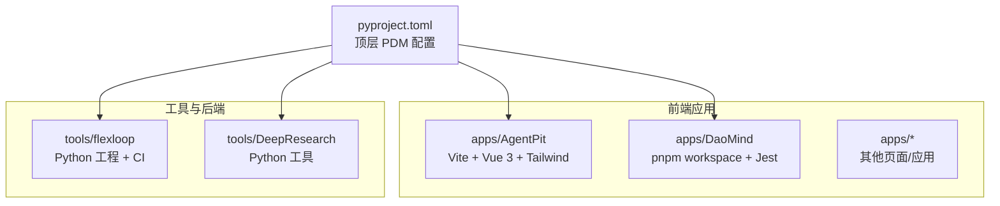
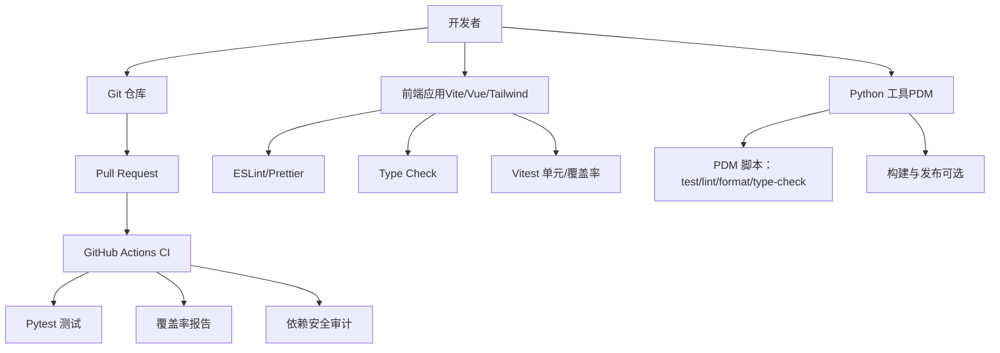
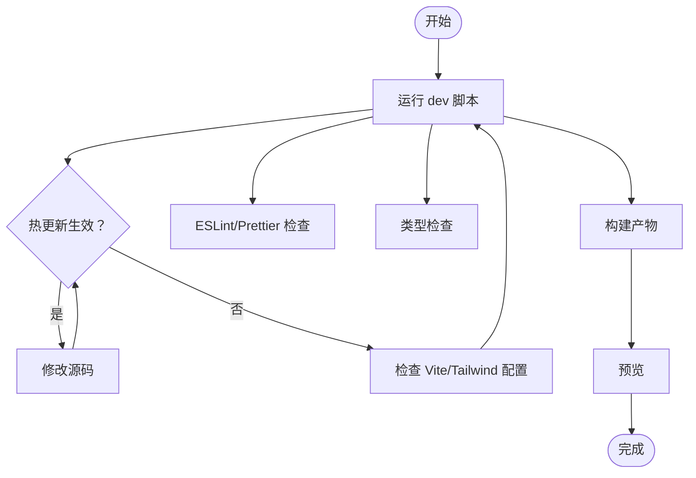
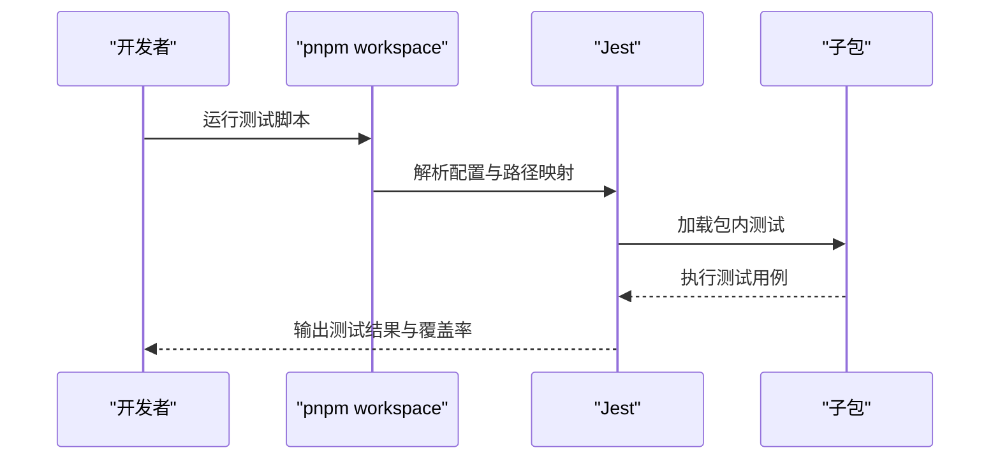
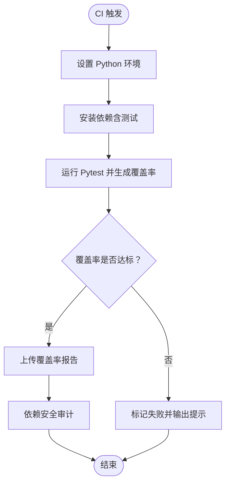
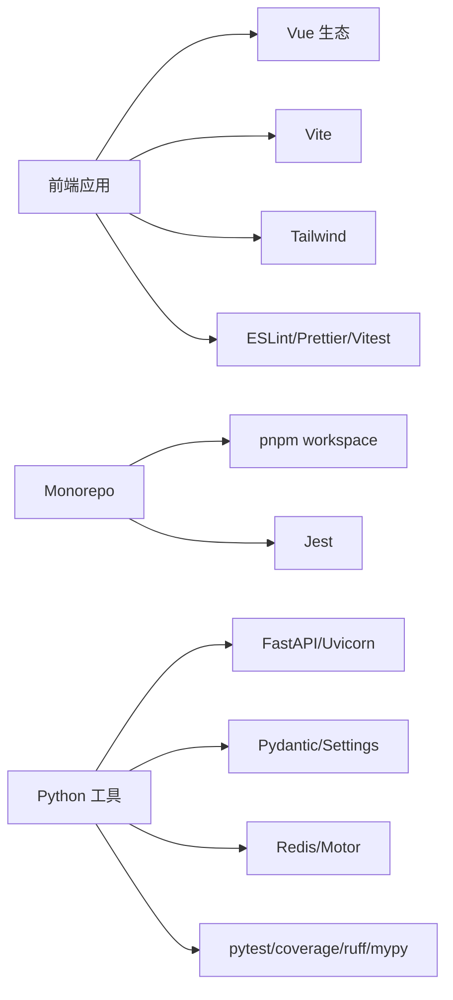

# 开发流程与工具

<cite>
**本文引用的文件**
- [pyproject.toml](file://pyproject.toml)
- [apps/AgentPit/package.json](file://apps/AgentPit/package.json)
- [apps/AgentPit/vite.config.ts](file://apps/AgentPit/vite.config.ts)
- [apps/AgentPit/tailwind.config.ts](file://apps/AgentPit/tailwind.config.ts)
- [apps/AgentPit/eslint.config.js](file://apps/AgentPit/eslint.config.js)
- [apps/DaoMind/pnpm-workspace.yaml](file://apps/DaoMind/pnpm-workspace.yaml)
- [apps/DaoMind/package.json](file://apps/DaoMind/package.json)
- [apps/DaoMind/jest.config.js](file://apps/DaoMind/jest.config.js)
- [tools/flexloop/pyproject.toml](file://tools/flexloop/pyproject.toml)
- [tools/flexloop/.github/workflows/ci.yml](file://tools/flexloop/.github/workflows/ci.yml)
- [apps/AgentPit/README.md](file://apps/AgentPit/README.md)
- [apps/DaoMind/README.md](file://apps/DaoMind/README.md)
- [tools/DeepResearch/CONTRIBUTING.md](file://tools/DeepResearch/CONTRIBUTING.md)
- [tools/flexloop/CONTRIBUTING.md](file://tools/flexloop/CONTRIBUTING.md)
</cite>

## 目录
1. [引言](#引言)
2. [项目结构](#项目结构)
3. [核心组件](#核心组件)
4. [架构总览](#架构总览)
5. [详细组件分析](#详细组件分析)
6. [依赖分析](#依赖分析)
7. [性能考虑](#性能考虑)
8. [故障排查指南](#故障排查指南)
9. [结论](#结论)
10. [附录](#附录)

## 引言
本指南面向开发者，系统讲解本仓库的版本控制实践、Monorepo 工程化实践、本地开发与调试、常见开发场景流程，以及持续集成与质量保障流程。内容覆盖 Git 工作流、分支策略、提交信息规范、PR 流程；Monorepo 的环境搭建、依赖管理与构建；前端开发服务器与热重载、调试工具；Python 工具链与测试、覆盖率、静态检查；以及 CI 的自动化测试与安全审计。

## 项目结构
本仓库采用多应用与工具并存的组织方式：
- 前端应用集中在 apps 下，包含多个 Vue 3 + Vite 应用与若干独立页面应用
- 工具与后端能力集中在 tools 下，包含 Python 工程与 GitHub Actions CI 配置
- 顶层使用 PDM 管理 Python 工程与脚本，部分前端应用使用 pnpm 管理工作区

图表来源
- [pyproject.toml](file://pyproject.toml)
- [apps/AgentPit/package.json](file://apps/AgentPit/package.json)
- [apps/DaoMind/pnpm-workspace.yaml](file://apps/DaoMind/pnpm-workspace.yaml)
- [tools/flexloop/pyproject.toml](file://tools/flexloop/pyproject.toml)

章节来源
- [pyproject.toml](file://pyproject.toml)
- [apps/AgentPit/README.md](file://apps/AgentPit/README.md)
- [apps/DaoMind/README.md](file://apps/DaoMind/README.md)

## 核心组件
- 前端工程化（Vite + Vue 3 + TypeScript + Tailwind + Vitest + ESLint + Prettier）
- Monorepo（pnpm workspace + Jest）
- Python 工程（PDM + Ruff + Mypy + Pytest + Coverage）
- CI（GitHub Actions）

章节来源
- [apps/AgentPit/package.json](file://apps/AgentPit/package.json)
- [apps/AgentPit/vite.config.ts](file://apps/AgentPit/vite.config.ts)
- [apps/AgentPit/tailwind.config.ts](file://apps/AgentPit/tailwind.config.ts)
- [apps/AgentPit/eslint.config.js](file://apps/AgentPit/eslint.config.js)
- [apps/DaoMind/pnpm-workspace.yaml](file://apps/DaoMind/pnpm-workspace.yaml)
- [apps/DaoMind/package.json](file://apps/DaoMind/package.json)
- [apps/DaoMind/jest.config.js](file://apps/DaoMind/jest.config.js)
- [tools/flexloop/pyproject.toml](file://tools/flexloop/pyproject.toml)

## 架构总览
整体由“前端应用 + 工具/后端”构成，前端应用通过各自构建脚本运行与测试；工具模块通过 PDM 管理依赖与脚本；CI 在 GitHub 上对 Python 工程进行测试、覆盖率与安全审计。

图表来源
- [tools/flexloop/.github/workflows/ci.yml](file://tools/flexloop/.github/workflows/ci.yml)
- [apps/AgentPit/package.json](file://apps/AgentPit/package.json)
- [apps/DaoMind/jest.config.js](file://apps/DaoMind/jest.config.js)
- [tools/flexloop/pyproject.toml](file://tools/flexloop/pyproject.toml)

## 详细组件分析

### Git 工作流程与分支管理
- 分支策略建议采用功能分支 + 主干保护
  - 功能开发：从 main 切出 feature/xxx
  - 修复补丁：从 main 切出 hotfix/xxx
  - 合并与保护：通过 PR 合并至 main，开启分支保护与 CI 强制检查
- 提交信息规范（建议）
  - 类型：feat、fix、docs、style、refactor、perf、test、build、ci、chore、revert
  - 格式：type(scope): subject
  - 示例：feat(agent): 新增协作面板组件
- PR 规范
  - 描述清晰，关联 Issue
  - 通过 CI、覆盖率与代码审查
  - 合并前清理不必要的提交历史

章节来源
- [tools/DeepResearch/CONTRIBUTING.md](file://tools/DeepResearch/CONTRIBUTING.md)
- [tools/flexloop/CONTRIBUTING.md](file://tools/flexloop/CONTRIBUTING.md)

### 前端开发环境与工具链（Vite + Vue 3 + TypeScript）
- 启动与构建
  - 开发：使用 Vite 提供的 dev 脚本
  - 预览：使用 preview 脚本
  - 构建：先类型检查再构建
- 代码质量
  - ESLint：统一规则，支持 Vue/TS/TSX
  - Prettier：统一格式化
  - 类型检查：vue-tsc
- 调试与热重载
  - Vite 默认支持 HMR
  - 可结合浏览器开发者工具与 Vue DevTools
- 路径别名与样式
  - 通过 Vite 别名指向 src
  - Tailwind 集成，按需扫描模板路径

图表来源
- [apps/AgentPit/package.json](file://apps/AgentPit/package.json)
- [apps/AgentPit/vite.config.ts](file://apps/AgentPit/vite.config.ts)
- [apps/AgentPit/tailwind.config.ts](file://apps/AgentPit/tailwind.config.ts)
- [apps/AgentPit/eslint.config.js](file://apps/AgentPit/eslint.config.js)

章节来源
- [apps/AgentPit/README.md](file://apps/AgentPit/README.md)
- [apps/AgentPit/package.json](file://apps/AgentPit/package.json)
- [apps/AgentPit/vite.config.ts](file://apps/AgentPit/vite.config.ts)
- [apps/AgentPit/tailwind.config.ts](file://apps/AgentPit/tailwind.config.ts)
- [apps/AgentPit/eslint.config.js](file://apps/AgentPit/eslint.config.js)

### Monorepo 工程化（pnpm workspace + Jest）
- 工作区配置
  - 使用 pnpm-workspace.yaml 声明 packages/*
- 依赖与构建
  - 根 package.json 定义 monorepo 级脚本与测试入口
  - 各子包独立构建与测试
- 测试配置
  - Jest 配置支持 ESM、TS、路径映射与覆盖率阈值
  - 支持按包粒度运行测试

图表来源
- [apps/DaoMind/pnpm-workspace.yaml](file://apps/DaoMind/pnpm-workspace.yaml)
- [apps/DaoMind/package.json](file://apps/DaoMind/package.json)
- [apps/DaoMind/jest.config.js](file://apps/DaoMind/jest.config.js)

章节来源
- [apps/DaoMind/README.md](file://apps/DaoMind/README.md)
- [apps/DaoMind/pnpm-workspace.yaml](file://apps/DaoMind/pnpm-workspace.yaml)
- [apps/DaoMind/package.json](file://apps/DaoMind/package.json)
- [apps/DaoMind/jest.config.js](file://apps/DaoMind/jest.config.js)

### Python 工程与质量工具（PDM + Ruff + Mypy + Pytest）
- 依赖与脚本
  - 使用 PDM 管理依赖与脚本，提供 test、test-cov、lint、lint-fix、format、type-check 等常用命令
- 代码质量
  - Ruff：lint 与格式化，忽略规则与选择规则明确
  - Mypy：类型检查，宽松策略与关键开关
- 测试与覆盖率
  - Pytest：统一测试入口与配置
  - 覆盖率：开启分支覆盖率，失败阈值 80%
- CI 流水线
  - 多平台矩阵：ubuntu/windows + Python 3.14
  - 步骤：安装依赖、运行测试并生成覆盖率 XML/HTML、上传覆盖率报告、依赖安全审计

图表来源
- [tools/flexloop/.github/workflows/ci.yml](file://tools/flexloop/.github/workflows/ci.yml)
- [tools/flexloop/pyproject.toml](file://tools/flexloop/pyproject.toml)
- [pyproject.toml](file://pyproject.toml)

章节来源
- [pyproject.toml](file://pyproject.toml)
- [tools/flexloop/pyproject.toml](file://tools/flexloop/pyproject.toml)
- [tools/flexloop/.github/workflows/ci.yml](file://tools/flexloop/.github/workflows/ci.yml)

### 常见开发场景操作步骤
- 新增功能（前端）
  - 在对应应用中新增页面/组件，编写单元测试
  - 运行类型检查与 ESLint/Prettier 校验
  - 本地预览无误后提交并发起 PR
- 修复 Bug（前端）
  - 编写最小化复现测试，定位问题
  - 修复后运行类型检查、ESLint、Prettier 与 Vitest
  - 提交并发起 PR
- 性能优化（前端）
  - 使用浏览器性能面板与 Vue DevTools 定位瓶颈
  - 优化渲染与状态管理，必要时拆分组件或引入缓存
- 新增功能（Python 工具）
  - 在 tools/flexloop 中新增模块或子包
  - 编写单元测试与集成测试，确保覆盖率达标
  - 运行 Ruff、Mypy、Pytest，提交并发起 PR
- 修复 Bug（Python 工具）
  - 编写针对性测试，修复后运行 CI 相关步骤
  - 提交并发起 PR

章节来源
- [apps/AgentPit/package.json](file://apps/AgentPit/package.json)
- [apps/DaoMind/jest.config.js](file://apps/DaoMind/jest.config.js)
- [tools/flexloop/pyproject.toml](file://tools/flexloop/pyproject.toml)

## 依赖分析
- 前端应用依赖
  - Vue 3、Vite、TailwindCSS、Pinia、Vue Router、ESLint、Prettier、Vitest、TypeScript
- Monorepo 依赖
  - pnpm workspace 管理子包，Jest 统一测试
- Python 工具依赖
  - FastAPI、Uvicorn、Pydantic、Redis/Motor、pytest、coverage、ruff、mypy 等

图表来源
- [apps/AgentPit/package.json](file://apps/AgentPit/package.json)
- [apps/DaoMind/pnpm-workspace.yaml](file://apps/DaoMind/pnpm-workspace.yaml)
- [apps/DaoMind/package.json](file://apps/DaoMind/package.json)
- [tools/flexloop/pyproject.toml](file://tools/flexloop/pyproject.toml)

章节来源
- [apps/AgentPit/package.json](file://apps/AgentPit/package.json)
- [apps/DaoMind/pnpm-workspace.yaml](file://apps/DaoMind/pnpm-workspace.yaml)
- [apps/DaoMind/package.json](file://apps/DaoMind/package.json)
- [tools/flexloop/pyproject.toml](file://tools/flexloop/pyproject.toml)

## 性能考虑
- 前端
  - 合理拆分组件与路由懒加载，减少首屏体积
  - 使用 Pinia 状态管理，避免不必要的响应式开销
  - Tailwind 按需引入与摇树优化
- Python 工具
  - 使用异步与连接池（Redis/Motor），避免阻塞
  - 严格类型检查与覆盖率门槛，降低运行期风险

## 故障排查指南
- 前端
  - 类型检查失败：优先修复类型错误，再进行后续步骤
  - ESLint/Prettier 报错：根据规则修正或调整配置
  - Vitest 测试失败：查看测试日志与断言，补充或修正用例
- Python 工具
  - Pytest 失败：检查测试用例与覆盖率阈值
  - 覆盖率不足：补充测试用例，确保关键路径覆盖
  - 依赖安全审计失败：升级依赖或修复已知漏洞

章节来源
- [apps/AgentPit/package.json](file://apps/AgentPit/package.json)
- [apps/DaoMind/jest.config.js](file://apps/DaoMind/jest.config.js)
- [tools/flexloop/pyproject.toml](file://tools/flexloop/pyproject.toml)
- [tools/flexloop/.github/workflows/ci.yml](file://tools/flexloop/.github/workflows/ci.yml)

## 结论
本指南提供了从版本控制、Monorepo 工程化、前端开发到 Python 工具链与 CI 的完整开发流程。建议团队在实际协作中严格执行分支与提交规范，配合质量工具与 CI，确保交付质量与效率。

## 附录
- 快速命令参考
  - 前端：dev/build/preview/lint/format/type-check/test/test:coverage
  - Python：test/test-cov/lint/lint-fix/format/format-check/type-check
  - Monorepo：pnpm workspace 构建与测试

章节来源
- [apps/AgentPit/package.json](file://apps/AgentPit/package.json)
- [pyproject.toml](file://pyproject.toml)
- [apps/DaoMind/package.json](file://apps/DaoMind/package.json)