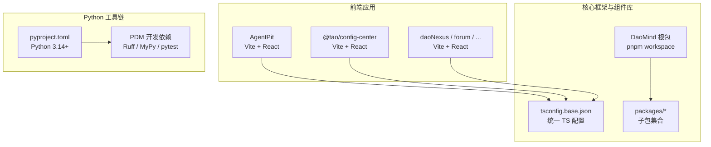
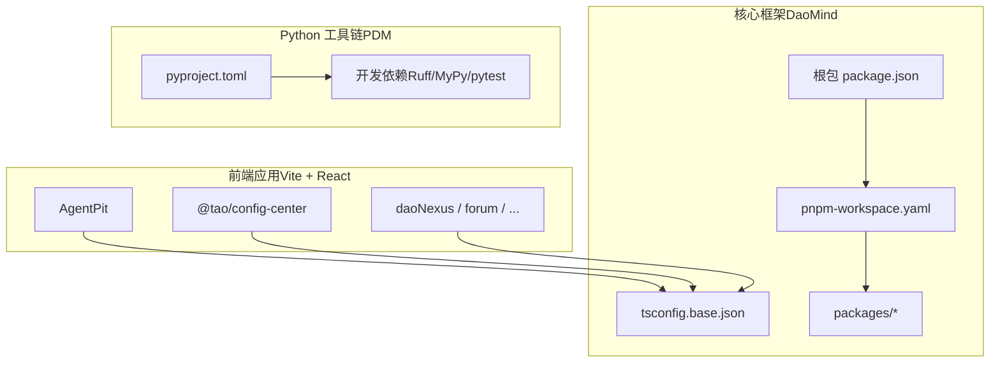
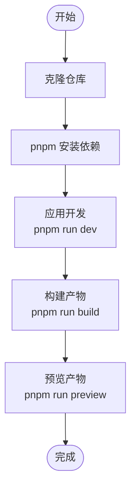
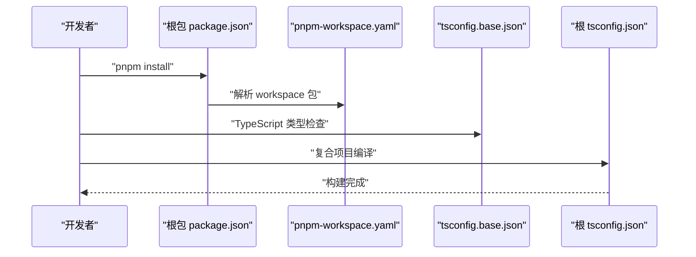
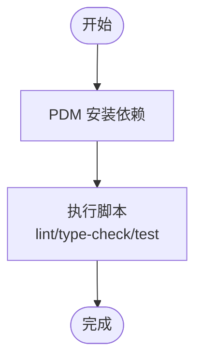
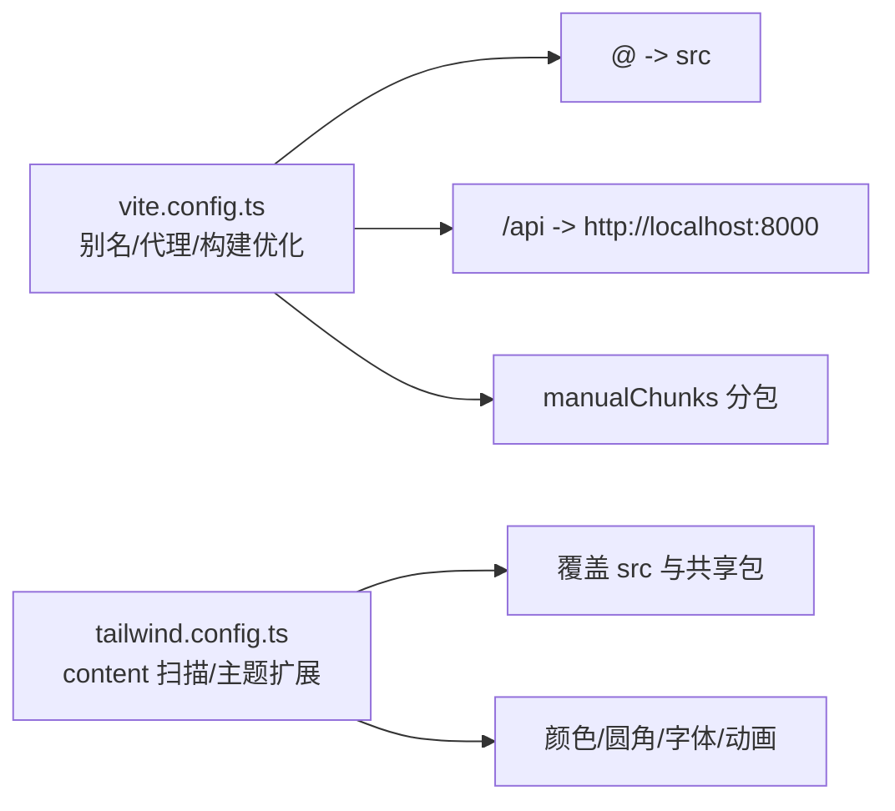
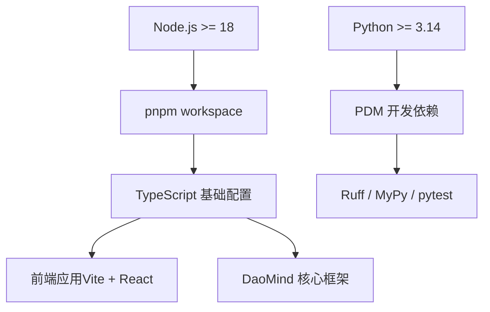

# 开发环境搭建

<cite>
**本文引用的文件**
- [apps/DaoMind/package.json](file://apps/DaoMind/package.json)
- [apps/DaoMind/pnpm-workspace.yaml](file://apps/DaoMind/pnpm-workspace.yaml)
- [apps/DaoMind/tsconfig.base.json](file://apps/DaoMind/tsconfig.base.json)
- [apps/DaoMind/tsconfig.json](file://apps/DaoMind/tsconfig.json)
- [apps/DaoMind/README.md](file://apps/DaoMind/README.md)
- [apps/AgentPit/package.json](file://apps/AgentPit/package.json)
- [apps/AgentPit/tsconfig.json](file://apps/AgentPit/tsconfig.json)
- [apps/AgentPit/README.md](file://apps/AgentPit/README.md)
- [apps/config-center/package.json](file://apps/config-center/package.json)
- [apps/config-center/vite.config.ts](file://apps/config-center/vite.config.ts)
- [apps/config-center/tailwind.config.ts](file://apps/config-center/tailwind.config.ts)
- [pyproject.toml](file://pyproject.toml)
- [.gitignore](file://.gitignore)
</cite>

## 目录
1. 引言
2. 项目结构
3. 核心组件
4. 架构总览
5. 详细组件分析
6. 依赖分析
7. 性能考虑
8. 故障排除指南
9. 结论
10. 附录

## 引言
本指南面向 DAO Collective 项目开发者，提供从零开始搭建开发环境的完整流程，涵盖系统要求、前置条件、Node.js 与 Python 版本选择、pnpm monorepo 工作空间配置、依赖管理、安装步骤、TypeScript 配置与编译设置、IDE 推荐与开发工具、以及常见问题排查与故障排除方法。目标是帮助你在本地快速完成环境准备并顺利开展开发。

## 项目结构
DAO Collective 采用多应用与多包混合的 monorepo 架构：
- 前端应用层：多个 Vite + React 应用（如 AgentPit、config-center、daoNexus、forum、growth-tracker、habit-tracker、moodflow、oauth-admin、time-capsule、xinyu），各自拥有独立的 package.json、TypeScript 配置与构建脚本。
- 核心框架与组件库：DaoMind 作为核心框架与组件库，采用 pnpm workspace 管理子包（packages/*），并通过根级 tsconfig.base.json 提供统一的 TypeScript 编译配置与路径映射。
- Python 工具链：顶层 pyproject.toml 定义了 Python 3.14 的最低版本要求，并通过 PDM 管理 Python 依赖与脚本；同时包含前端应用所需的工具链（如 Ruff、MyPy、pytest 等）。

图表来源
- [apps/DaoMind/pnpm-workspace.yaml:1-3](file://apps/DaoMind/pnpm-workspace.yaml#L1-L3)
- [apps/DaoMind/tsconfig.base.json:1-1](file://apps/DaoMind/tsconfig.base.json#L1-L1)
- [apps/AgentPit/package.json:1-37](file://apps/AgentPit/package.json#L1-L37)
- [apps/config-center/package.json:1-41](file://apps/config-center/package.json#L1-L41)
- [pyproject.toml:1-161](file://pyproject.toml#L1-L161)

章节来源
- [apps/DaoMind/README.md:323-351](file://apps/DaoMind/README.md#L323-L351)
- [apps/DaoMind/pnpm-workspace.yaml:1-3](file://apps/DaoMind/pnpm-workspace.yaml#L1-L3)
- [apps/DaoMind/tsconfig.base.json:1-1](file://apps/DaoMind/tsconfig.base.json#L1-L1)
- [apps/AgentPit/package.json:1-37](file://apps/AgentPit/package.json#L1-L37)
- [apps/config-center/package.json:1-41](file://apps/config-center/package.json#L1-L41)
- [pyproject.toml:1-161](file://pyproject.toml#L1-L161)

## 核心组件
- Node.js 与包管理器
  - Node.js 最低版本：根据 DaoMind 根包 engines 字段要求 Node >= 18.0.0。
  - 包管理器：优先使用 pnpm（版本 >= 6.0），以充分利用 workspace 与链接依赖能力。
- TypeScript 配置
  - DaoMind 提供 tsconfig.base.json 作为统一基础配置，包含严格模式、模块解析策略、路径映射等。
  - 各应用通过 tsconfig.json 或 tsconfig.app.json/tsconfig.node.json 的 references/extends 继承基础配置。
- Python 工具链
  - Python 最低版本：3.14。
  - 通过 PDM 管理开发依赖（Ruff、MyPy、pytest 等），并提供 lint、type-check、test、format 等脚本。

章节来源
- [apps/DaoMind/package.json:1-1](file://apps/DaoMind/package.json#L1-L1)
- [apps/DaoMind/tsconfig.base.json:1-1](file://apps/DaoMind/tsconfig.base.json#L1-L1)
- [apps/AgentPit/tsconfig.json:1-8](file://apps/AgentPit/tsconfig.json#L1-L8)
- [pyproject.toml:14-14](file://pyproject.toml#L14-L14)
- [pyproject.toml:49-58](file://pyproject.toml#L49-L58)
- [pyproject.toml:74-79](file://pyproject.toml#L74-L79)

## 架构总览
下图展示了前端应用、核心框架与 Python 工具链之间的关系，以及 workspace 与 monorepo 的组织方式。

图表来源
- [apps/DaoMind/package.json:1-1](file://apps/DaoMind/package.json#L1-L1)
- [apps/DaoMind/pnpm-workspace.yaml:1-3](file://apps/DaoMind/pnpm-workspace.yaml#L1-L3)
- [apps/DaoMind/tsconfig.base.json:1-1](file://apps/DaoMind/tsconfig.base.json#L1-L1)
- [apps/AgentPit/package.json:1-37](file://apps/AgentPit/package.json#L1-L37)
- [apps/config-center/package.json:1-41](file://apps/config-center/package.json#L1-L41)
- [pyproject.toml:1-161](file://pyproject.toml#L1-L161)

## 详细组件分析

### 前端应用（Vite + React）环境搭建
- 系统要求
  - Node.js：>= 18.0.0（参考根包 engines 字段）。
  - 包管理器：pnpm（workspace 支持）。
- 安装步骤
  - 克隆仓库后，在根目录执行 pnpm 安装依赖。
  - 各应用可通过各自 package.json 的脚本进行开发、构建与预览。
- TypeScript 配置
  - 多数应用采用复合项目结构（references/references），通过 tsconfig.json 组织 app 与 node 配置。
  - AgentPit 示例展示了如何通过 tsconfig.json 的 references 指向 tsconfig.app.json 与 tsconfig.node.json。
- IDE 配置建议
  - VS Code：安装 TypeScript/React/Vitest/ESLint 插件，启用“按需类型检查”与 ESLint 自动修复。
  - 保持 tsconfig.json 的 references 与 ESLint 的 parserOptions.project 对齐，避免类型检查漂移。

图表来源
- [apps/AgentPit/package.json:6-11](file://apps/AgentPit/package.json#L6-L11)
- [apps/AgentPit/tsconfig.json:1-8](file://apps/AgentPit/tsconfig.json#L1-L8)

章节来源
- [apps/AgentPit/package.json:1-37](file://apps/AgentPit/package.json#L1-L37)
- [apps/AgentPit/tsconfig.json:1-8](file://apps/AgentPit/tsconfig.json#L1-L8)
- [apps/AgentPit/README.md:1-74](file://apps/AgentPit/README.md#L1-L74)

### DaoMind 核心框架（pnpm workspace + TypeScript）
- workspace 配置
  - pnpm-workspace.yaml 指定 packages/* 为工作区包集合，支持 workspace:* 依赖解析。
- TypeScript 配置
  - tsconfig.base.json 提供统一的 compilerOptions、严格模式、路径映射与 include/exclude 规则。
  - 根 tsconfig.json 通过 references 指向各子包，形成复合项目结构，提升编译性能与类型安全性。
- 安装与验证
  - 使用 pnpm install 安装根依赖与子包依赖。
  - 通过 pnpm run typecheck 验证类型。
  - 通过 pnpm run build 执行全量构建。

图表来源
- [apps/DaoMind/pnpm-workspace.yaml:1-3](file://apps/DaoMind/pnpm-workspace.yaml#L1-L3)
- [apps/DaoMind/tsconfig.base.json:1-1](file://apps/DaoMind/tsconfig.base.json#L1-L1)
- [apps/DaoMind/tsconfig.json:1-1](file://apps/DaoMind/tsconfig.json#L1-L1)
- [apps/DaoMind/package.json:1-1](file://apps/DaoMind/package.json#L1-L1)

章节来源
- [apps/DaoMind/pnpm-workspace.yaml:1-3](file://apps/DaoMind/pnpm-workspace.yaml#L1-L3)
- [apps/DaoMind/tsconfig.base.json:1-1](file://apps/DaoMind/tsconfig.base.json#L1-L1)
- [apps/DaoMind/tsconfig.json:1-1](file://apps/DaoMind/tsconfig.json#L1-L1)
- [apps/DaoMind/README.md:27-72](file://apps/DaoMind/README.md#L27-L72)

### Python 工具链（PDM）
- 系统要求
  - Python：>= 3.14。
  - 包管理器：PDM（遵循 pyproject.toml）。
- 安装与脚本
  - 使用 PDM 安装开发依赖（Ruff、MyPy、pytest 等）。
  - 常用脚本：lint、lint-fix、format、format-check、type-check、test、test-cov、clean。
- 与前端协作
  - 前端应用的 Python 工具链（如 Ruff、MyPy）由 PDM 管理，可在同一环境中统一执行。

图表来源
- [pyproject.toml:49-79](file://pyproject.toml#L49-L79)
- [pyproject.toml:130-141](file://pyproject.toml#L130-L141)

章节来源
- [pyproject.toml:14-14](file://pyproject.toml#L14-L14)
- [pyproject.toml:49-79](file://pyproject.toml#L49-L79)
- [pyproject.toml:130-141](file://pyproject.toml#L130-L141)

### 配置中心应用（@tao/config-center）
- Vite 配置要点
  - 别名 @ 指向 src，便于统一导入路径。
  - 本地开发服务器通过代理将 /api 请求转发至后端服务（默认 http://localhost:8000）。
  - 构建时启用 Terser 压缩与手动分包策略，优化首屏加载。
- Tailwind 配置要点
  - content 覆盖 src 与共享包路径，确保样式扫描生效。
  - 主题扩展包含颜色、圆角、字体族、动画等，满足企业级 UI 需求。

图表来源
- [apps/config-center/vite.config.ts:1-41](file://apps/config-center/vite.config.ts#L1-L41)
- [apps/config-center/tailwind.config.ts:1-104](file://apps/config-center/tailwind.config.ts#L1-L104)

章节来源
- [apps/config-center/package.json:1-41](file://apps/config-center/package.json#L1-L41)
- [apps/config-center/vite.config.ts:1-41](file://apps/config-center/vite.config.ts#L1-L41)
- [apps/config-center/tailwind.config.ts:1-104](file://apps/config-center/tailwind.config.ts#L1-L104)

## 依赖分析
- Node.js 与包管理器
  - 根包 engines 指定 Node >= 18.0.0；建议使用 pnpm 6.0+ 以获得最佳 workspace 支持。
- TypeScript 与路径映射
  - tsconfig.base.json 提供统一的模块解析、严格模式与路径映射，确保跨包导入稳定。
- Python 依赖与脚本
  - pyproject.toml 定义 Python 最低版本与开发依赖，提供 lint/type-check/test/format/clean 等脚本。

图表来源
- [apps/DaoMind/package.json:1-1](file://apps/DaoMind/package.json#L1-L1)
- [apps/DaoMind/tsconfig.base.json:1-1](file://apps/DaoMind/tsconfig.base.json#L1-L1)
- [pyproject.toml:14-14](file://pyproject.toml#L14-L14)
- [pyproject.toml:49-58](file://pyproject.toml#L49-L58)

章节来源
- [apps/DaoMind/package.json:1-1](file://apps/DaoMind/package.json#L1-L1)
- [apps/DaoMind/tsconfig.base.json:1-1](file://apps/DaoMind/tsconfig.base.json#L1-L1)
- [pyproject.toml:14-14](file://pyproject.toml#L14-L14)
- [pyproject.toml:49-58](file://pyproject.toml#L49-L58)

## 性能考虑
- 前端构建优化
  - 使用 Vite 的原生 ES 模块与按需编译，减少冷启动时间。
  - 在 config-center 中启用 Terser 压缩与 manualChunks 分包，降低首屏体积。
- TypeScript 复合项目
  - 通过 references 与 composite 配置，提升增量编译速度与类型检查效率。
- Python 工具链
  - Ruff 与 MyPy 的缓存与增量检查，配合 PDM 脚本，减少重复工作。

## 故障排除指南
- Node.js 版本不匹配
  - 症状：pnpm 安装报错或运行时报错。
  - 解决：升级 Node.js 至 >= 18.0.0，重新安装依赖。
- pnpm 版本过低
  - 症状：workspace 解析失败或链接依赖异常。
  - 解决：升级 pnpm 至 6.0+，清理缓存后重试。
- TypeScript 类型检查失败
  - 症状：pnpm run typecheck 报错。
  - 解决：检查 tsconfig.base.json 与各应用 tsconfig 的 references/extends 是否一致；修复类型错误。
- 子包导入失败（模块未找到）
  - 症状：运行时或构建时报模块解析错误。
  - 解决：先执行 pnpm run build 完成全量构建；确认 tsconfig.json 的路径映射与 references 正确。
- Python 依赖安装失败
  - 症状：PDM 安装失败或脚本不可用。
  - 解决：确保 Python >= 3.14；使用 PDM 安装开发依赖；检查 pyproject.toml 中的 dev 依赖声明。
- Vite 代理与端口冲突
  - 症状：/api 请求无法转发或端口被占用。
  - 解决：修改 vite.config.ts 中的 proxy.target 或调整本地端口。

章节来源
- [apps/DaoMind/README.md:398-444](file://apps/DaoMind/README.md#L398-L444)
- [apps/AgentPit/README.md:1-74](file://apps/AgentPit/README.md#L1-L74)
- [apps/config-center/vite.config.ts:12-16](file://apps/config-center/vite.config.ts#L12-L16)
- [pyproject.toml:14-14](file://pyproject.toml#L14-L14)
- [pyproject.toml:49-58](file://pyproject.toml#L49-L58)

## 结论
通过以上步骤，你可以在本地完成 DAO Collective 项目的开发环境搭建：安装 Node.js 与 pnpm、配置 TypeScript 基础与复合项目、准备 Python 3.14+ 与 PDM 工具链，并针对具体应用（如 AgentPit、config-center）进行开发与构建。遇到问题时，可依据故障排除指南逐项定位并解决。

## 附录
- 常用命令速查
  - 安装依赖：pnpm install
  - 类型检查：pnpm run typecheck
  - 全量构建：pnpm run build
  - 单应用开发：进入对应应用目录执行 pnpm run dev
  - Python 工具：pnpm run lint / type-check / test / format
- IDE 推荐
  - VS Code：TypeScript React Testing Library ESLint Prettier Vitest 插件。
  - 保持 tsconfig 与 ESLint 的 parserOptions.project 与 references 一致，避免类型检查漂移。