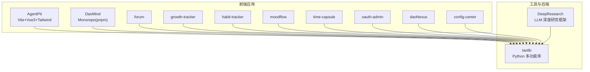
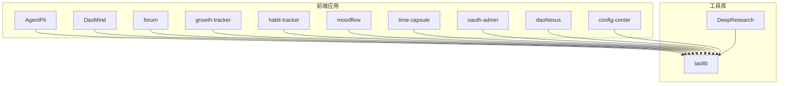
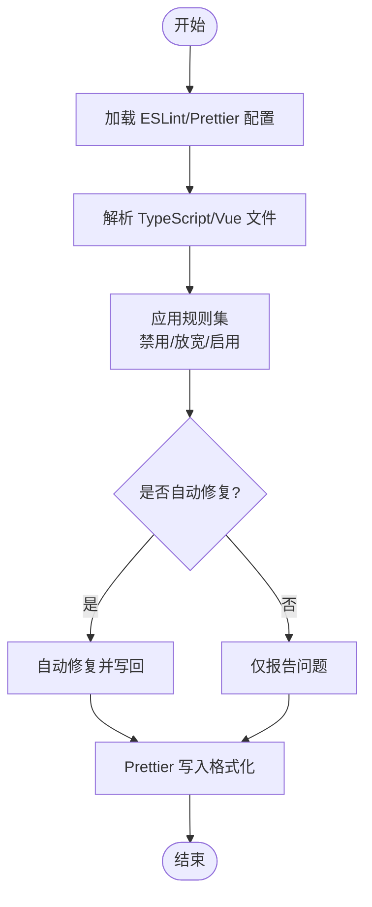
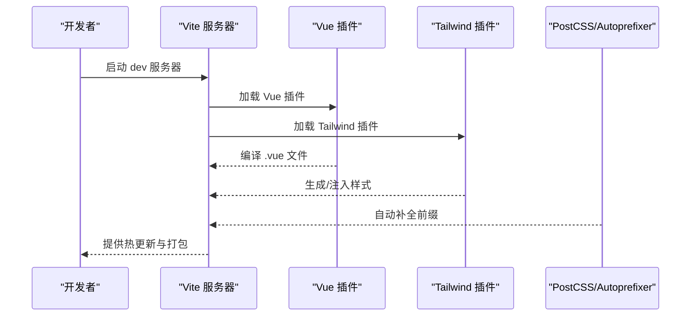
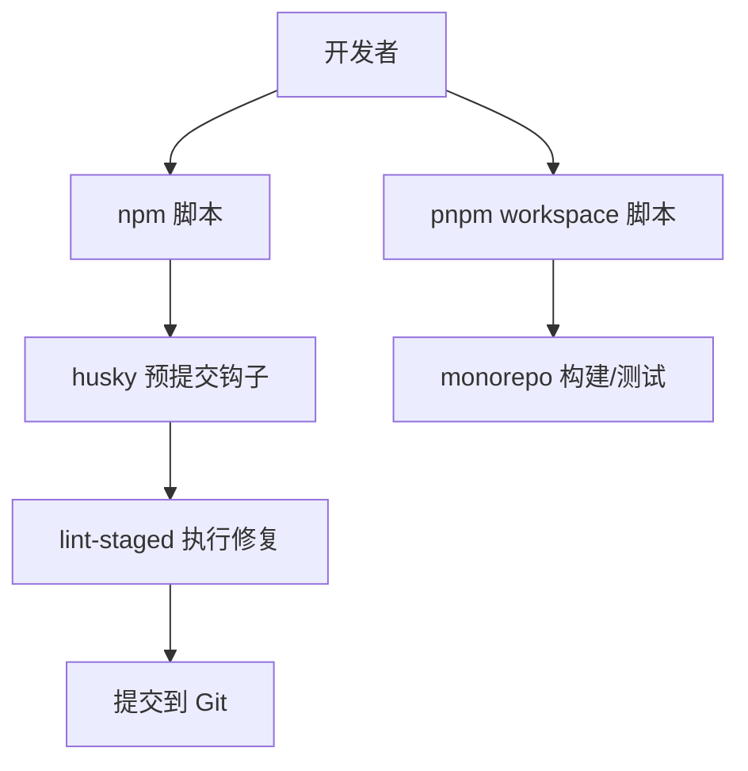
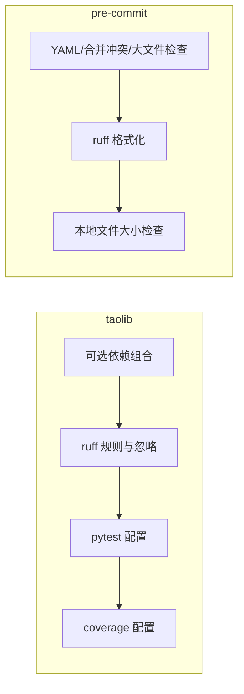
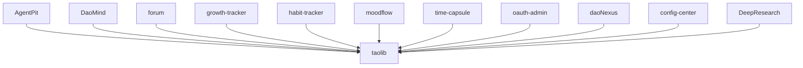

# 开发者指南

<cite>
**本文引用的文件**
- [apps/AgentPit/package.json](file://apps/AgentPit/package.json)
- [apps/AgentPit/eslint.config.js](file://apps/AgentPit/eslint.config.js)
- [apps/AgentPit/tailwind.config.ts](file://apps/AgentPit/tailwind.config.ts)
- [apps/AgentPit/postcss.config.js](file://apps/AgentPit/postcss.config.js)
- [apps/AgentPit/vite.config.ts](file://apps/AgentPit/vite.config.ts)
- [apps/DaoMind/.prettierrc](file://apps/DaoMind/.prettierrc)
- [apps/DaoMind/eslint.config.js](file://apps/DaoMind/eslint.config.js)
- [apps/DaoMind/package.json](file://apps/DaoMind/package.json)
- [apps/DaoMind/pnpm-workspace.yaml](file://apps/DaoMind/pnpm-workspace.yaml)
- [tools/flexloop/pyproject.toml](file://tools/flexloop/pyproject.toml)
- [tools/DeepResearch/pyproject.toml](file://tools/DeepResearch/pyproject.toml)
- [tools/flexloop/.pre-commit-config.yaml](file://tools/flexloop/.pre-commit-config.yaml)
- [tools/flexloop/CONTRIBUTING.md](file://tools/flexloop/CONTRIBUTING.md)
- [tools/DeepResearch/CONTRIBUTING.md](file://tools/DeepResearch/CONTRIBUTING.md)
- [tools/flexloop/README.md](file://tools/flexloop/README.md)
</cite>

## 目录
1. [简介](#简介)
2. [项目结构](#项目结构)
3. [核心组件](#核心组件)
4. [架构总览](#架构总览)
5. [详细组件分析](#详细组件分析)
6. [依赖关系分析](#依赖关系分析)
7. [性能考虑](#性能考虑)
8. [故障排查指南](#故障排查指南)
9. [结论](#结论)
10. [附录](#附录)

## 简介
本指南面向新老开发者，提供统一的开发规范与实践方法，覆盖代码规范与风格、提交与审查流程、本地开发环境配置、贡献指南、ESLint/Prettier 工具链、Git 工作流、PR 审查标准、命名与注释约定、文档编写质量要求、新成员入职指引、调试技巧与性能优化建议，以及版本管理、分支模型与发布流程等开发管理规范。内容基于仓库中实际存在的配置文件与贡献文档提炼总结，确保可执行、可落地。

## 项目结构
本仓库采用多应用与多工具并存的组织方式：
- 前端应用集中于 apps 目录，包含 Vue3 应用、React 生态迁移参考、论坛、成长追踪、习惯追踪、情绪日记、时间胶囊、OAuth 管理、Nexus 展示页、配置中心等子项目。
- 工具与后端能力集中在 tools 目录，包含 Python 多功能库 taolib、深度研究框架 DeepResearch 等。
- 各子项目均配有独立的包管理与构建配置，遵循各自工具链的最佳实践。

**章节来源**
- [apps/AgentPit/vite.config.ts:1-15](file://apps/AgentPit/vite.config.ts#L1-L15)
- [apps/DaoMind/pnpm-workspace.yaml:1-3](file://apps/DaoMind/pnpm-workspace.yaml#L1-L3)
- [tools/flexloop/pyproject.toml:1-318](file://tools/flexloop/pyproject.toml#L1-L318)
- [tools/DeepResearch/pyproject.toml:1-93](file://tools/DeepResearch/pyproject.toml#L1-L93)

## 核心组件
本节聚焦前端与工具链的核心开发配置，帮助快速建立一致的开发体验。

- ESLint 与 Prettier 配置
  - AgentPit 使用 flat 配置，集成 Vue、TypeScript、Prettier，并对生产环境关闭 console/debugger 规则，降低噪音。
  - DaoMind 使用 TypeScript ESLint 插件，强调未使用变量、显式返回类型、any 类型等规则，配合 Prettier 统一格式。
  - 两者均提供 lint 与 format 脚本，支持增量修复与检查。

- 构建与样式工具
  - Vite 配置启用 Vue 插件与 TailwindCSS 插件，设置路径别名，便于模块化开发。
  - Tailwind 配置声明 content 范围与主题色扩展，PostCSS 配置启用 autoprefixer。
  - Prettier 配置统一分号、单引号、缩进宽度、尾随逗号、行长、括号间距等。

- 包管理与脚本
  - AgentPit 使用 npm 脚本，涵盖 dev/build/lint/format/type-check/test/coverage 等常用命令，并集成 husky 与 lint-staged。
  - DaoMind 使用 pnpm workspace 管理多包，提供 monorepo 构建与测试脚本。

**章节来源**
- [apps/AgentPit/eslint.config.js:1-162](file://apps/AgentPit/eslint.config.js#L1-L162)
- [apps/AgentPit/package.json:1-73](file://apps/AgentPit/package.json#L1-L73)
- [apps/AgentPit/tailwind.config.ts:1-27](file://apps/AgentPit/tailwind.config.ts#L1-L27)
- [apps/AgentPit/postcss.config.js:1-6](file://apps/AgentPit/postcss.config.js#L1-L6)
- [apps/AgentPit/vite.config.ts:1-15](file://apps/AgentPit/vite.config.ts#L1-L15)
- [apps/DaoMind/.prettierrc:1-1](file://apps/DaoMind/.prettierrc#L1-L1)
- [apps/DaoMind/eslint.config.js:1-27](file://apps/DaoMind/eslint.config.js#L1-L27)
- [apps/DaoMind/package.json:1-1](file://apps/DaoMind/package.json#L1-L1)
- [apps/DaoMind/pnpm-workspace.yaml:1-3](file://apps/DaoMind/pnpm-workspace.yaml#L1-L3)

## 架构总览
下图展示前端应用与工具库之间的关系，以及开发工具链在各子项目中的落地方式。

**图表来源**
- [tools/flexloop/pyproject.toml:1-318](file://tools/flexloop/pyproject.toml#L1-L318)
- [tools/DeepResearch/pyproject.toml:1-93](file://tools/DeepResearch/pyproject.toml#L1-L93)

## 详细组件分析

### ESLint 与 Prettier 配置分析
- AgentPit 的 flat 配置
  - 忽略 dist/node_modules/配置文件/e2e/__tests__ 等目录，减少误报。
  - 语言选项启用 TS 解析器与 Vue 解析器，指定 tsconfig 路径，支持 Vue 单文件组件。
  - 规则层面在生产环境对 console/debugger 进行警告，在开发环境关闭严格限制，提升开发体验。
  - 对 Vue 特定规则进行宽松处理，避免过度约束组件命名与模板校验。

- DaoMind 的 TypeScript ESLint 配置
  - 显式开启未使用变量、显式函数返回类型、any 类型等规则，提升类型安全。
  - console 规则允许 warn/error，便于调试输出。
  - 配合 Prettier 统一格式，形成“静态检查 + 格式化”的双重保障。

- Prettier 配置
  - DaoMind 的 .prettierrc 明确了分号、单引号、制表符宽度、尾随逗号、行长、括号间距、箭头函数括号、换行符等策略，确保跨团队一致性。

**图表来源**
- [apps/AgentPit/eslint.config.js:1-162](file://apps/AgentPit/eslint.config.js#L1-L162)
- [apps/DaoMind/eslint.config.js:1-27](file://apps/DaoMind/eslint.config.js#L1-L27)
- [apps/DaoMind/.prettierrc:1-1](file://apps/DaoMind/.prettierrc#L1-L1)

**章节来源**
- [apps/AgentPit/eslint.config.js:1-162](file://apps/AgentPit/eslint.config.js#L1-L162)
- [apps/DaoMind/eslint.config.js:1-27](file://apps/DaoMind/eslint.config.js#L1-L27)
- [apps/DaoMind/.prettierrc:1-1](file://apps/DaoMind/.prettierrc#L1-L1)

### Vite 与 Tailwind 集成
- Vite 插件链
  - 启用 @vitejs/plugin-vue 与 @tailwindcss/vite 插件，实现 Vue 单文件组件与原子化样式的即时编译。
  - 设置路径别名为 @，简化导入路径，提升可读性与维护性。

- Tailwind 配置
  - content 覆盖 index.html 与 src 下所有模板/脚本文件，保证按需生成样式。
  - 主题扩展自定义 primary 色板，便于品牌化定制。

- PostCSS 与 Autoprefixer
  - 自动添加浏览器前缀，减少兼容性问题。

**图表来源**
- [apps/AgentPit/vite.config.ts:1-15](file://apps/AgentPit/vite.config.ts#L1-L15)
- [apps/AgentPit/tailwind.config.ts:1-27](file://apps/AgentPit/tailwind.config.ts#L1-L27)
- [apps/AgentPit/postcss.config.js:1-6](file://apps/AgentPit/postcss.config.js#L1-L6)

**章节来源**
- [apps/AgentPit/vite.config.ts:1-15](file://apps/AgentPit/vite.config.ts#L1-L15)
- [apps/AgentPit/tailwind.config.ts:1-27](file://apps/AgentPit/tailwind.config.ts#L1-L27)
- [apps/AgentPit/postcss.config.js:1-6](file://apps/AgentPit/postcss.config.js#L1-L6)

### 包管理与脚本
- AgentPit（npm）
  - 提供 dev/build/preview/lint/lint:check/format/format:check/type-check/prepare/test/coverage 等脚本。
  - 集成 husky 与 lint-staged，提交前自动执行 ESLint 与 Prettier。

- DaoMind（pnpm workspace）
  - 通过 pnpm-workspace.yaml 管理 packages/* 子包，提供 monorepo 构建与测试脚本。
  - 顶层 package.json 定义 TypeScript/Jest/ESLint 等开发依赖与脚本。

**图表来源**
- [apps/AgentPit/package.json:1-73](file://apps/AgentPit/package.json#L1-L73)
- [apps/DaoMind/package.json:1-1](file://apps/DaoMind/package.json#L1-L1)
- [apps/DaoMind/pnpm-workspace.yaml:1-3](file://apps/DaoMind/pnpm-workspace.yaml#L1-L3)

**章节来源**
- [apps/AgentPit/package.json:1-73](file://apps/AgentPit/package.json#L1-L73)
- [apps/DaoMind/package.json:1-1](file://apps/DaoMind/package.json#L1-L1)
- [apps/DaoMind/pnpm-workspace.yaml:1-3](file://apps/DaoMind/pnpm-workspace.yaml#L1-L3)

### Python 工程与测试配置
- taolib（Python）
  - pyproject.toml 定义模块、可选依赖、测试与覆盖率配置、ruff 规则与忽略项、pytest 配置等。
  - 支持多种子系统（认证、配置中心、数据同步、邮件服务、任务队列、审计、多智能体等）的可选依赖组合。
  - pre-commit 配置集成 YAML/合并冲突/大文件检查、ruff 格式化与本地钩子。

- DeepResearch（Python）
  - pyproject.toml 定义依赖、可选文档与开发依赖、pytest、ruff 格式化等。
  - 提供 CLI 入口与版本管理配置。

**图表来源**
- [tools/flexloop/pyproject.toml:1-318](file://tools/flexloop/pyproject.toml#L1-L318)
- [tools/flexloop/.pre-commit-config.yaml:1-29](file://tools/flexloop/.pre-commit-config.yaml#L1-L29)
- [tools/DeepResearch/pyproject.toml:1-93](file://tools/DeepResearch/pyproject.toml#L1-L93)

**章节来源**
- [tools/flexloop/pyproject.toml:1-318](file://tools/flexloop/pyproject.toml#L1-L318)
- [tools/flexloop/.pre-commit-config.yaml:1-29](file://tools/flexloop/.pre-commit-config.yaml#L1-L29)
- [tools/DeepResearch/pyproject.toml:1-93](file://tools/DeepResearch/pyproject.toml#L1-L93)

## 依赖关系分析
- 前端应用与工具库
  - 多个前端应用依赖 taolib（Python），体现“前端应用 + 后端工具库”的协作模式。
  - DeepResearch 作为独立 Python 工程，亦可与 taolib 协同使用。

- 语言与工具链
  - 前端：Vite + Vue + TailwindCSS + ESLint + Prettier + Vitest。
  - Python：PDM/Ruff/Mypy/Pytest/Coverage/预提交钩子。

**图表来源**
- [tools/flexloop/pyproject.toml:1-318](file://tools/flexloop/pyproject.toml#L1-L318)
- [tools/DeepResearch/pyproject.toml:1-93](file://tools/DeepResearch/pyproject.toml#L1-L93)

**章节来源**
- [tools/flexloop/pyproject.toml:1-318](file://tools/flexloop/pyproject.toml#L1-L318)
- [tools/DeepResearch/pyproject.toml:1-93](file://tools/DeepResearch/pyproject.toml#L1-L93)

## 性能考虑
- 前端
  - 使用 Vite 的按需编译与热更新，减少等待时间；Tailwind 按需扫描 content，避免生成冗余样式。
  - ESLint/Prettier 在开发阶段仅作用于变更文件，结合 lint-staged 提升提交效率。
- Python
  - ruff 作为 linter/formatter，性能优于传统 flake8/black 组合；pytest 与 coverage 配置确保测试与覆盖率可控。
  - pre-commit 钩子在本地拦截大文件与格式问题，降低 CI 压力。

[本节为通用指导，无需特定文件来源]

## 故障排查指南
- ESLint 报错
  - 检查对应项目的 eslint.config.js 是否正确加载 tsconfig 与解析器；确认规则是否与当前环境匹配。
  - 使用 lint:check 或 lint 脚本定位具体文件与规则。
- Prettier 格式异常
  - 确认 .prettierrc 配置与 IDE 插件一致；优先使用 format:check 与 format 脚本统一格式。
- Vite/Tailwind 构建问题
  - 检查 vite.config.ts 中插件与别名配置；确认 tailwind.config.ts 的 content 范围覆盖到目标文件。
- Python 工具链
  - ruff 报错：根据 pyproject.toml 的 select/ignore 规则调整；必要时在本地运行 ruff --fix。
  - pytest 失败：检查 testpaths 与 asyncio_mode；关注覆盖率阈值与排除路径。

**章节来源**
- [apps/AgentPit/eslint.config.js:1-162](file://apps/AgentPit/eslint.config.js#L1-L162)
- [apps/AgentPit/package.json:1-73](file://apps/AgentPit/package.json#L1-L73)
- [apps/AgentPit/tailwind.config.ts:1-27](file://apps/AgentPit/tailwind.config.ts#L1-L27)
- [apps/AgentPit/vite.config.ts:1-15](file://apps/AgentPit/vite.config.ts#L1-L15)
- [apps/DaoMind/.prettierrc:1-1](file://apps/DaoMind/.prettierrc#L1-L1)
- [apps/DaoMind/eslint.config.js:1-27](file://apps/DaoMind/eslint.config.js#L1-L27)
- [tools/flexloop/pyproject.toml:1-318](file://tools/flexloop/pyproject.toml#L1-L318)
- [tools/DeepResearch/pyproject.toml:1-93](file://tools/DeepResearch/pyproject.toml#L1-L93)

## 结论
本指南基于仓库现有配置文件与贡献文档，建立了统一的开发规范与工具链实践。建议团队在日常协作中：
- 严格遵循 ESLint/Prettier 规则，提交前使用 lint-staged 与 pre-commit 钩子。
- 保持 monorepo 与多语言工程的脚本一致性，明确各子项目的职责边界。
- 持续完善测试与覆盖率，确保变更质量与稳定性。

[本节为总结，无需特定文件来源]

## 附录

### 新成员加入指南
- 环境准备
  - 前端：Node.js（AgentPit 使用 npm；DaoMind 使用 pnpm），安装依赖后运行 dev 脚本。
  - Python：安装 Python >= 期望版本（taolib 要求 >= 3.14；DeepResearch >= 3.14），使用 PDM 或 pip 安装开发依赖。
- 快速上手
  - AgentPit：执行 dev 构建，访问本地服务；修改 ESLint/Prettier 配置前先与团队沟通。
  - DaoMind：在根目录执行 monorepo 构建脚本；在 packages/* 下进行模块开发。
  - Python 工程：参考 README 的安装与使用说明，按需安装 doc/dev/test 依赖组。

**章节来源**
- [apps/AgentPit/package.json:1-73](file://apps/AgentPit/package.json#L1-L73)
- [apps/DaoMind/pnpm-workspace.yaml:1-3](file://apps/DaoMind/pnpm-workspace.yaml#L1-L3)
- [tools/flexloop/README.md:1-100](file://tools/flexloop/README.md#L1-L100)
- [tools/DeepResearch/pyproject.toml:1-93](file://tools/DeepResearch/pyproject.toml#L1-L93)

### 本地开发环境配置清单
- 前端
  - 安装依赖：npm install 或 pnpm install
  - 启动开发：npm run dev 或 pnpm dev
  - 代码检查：npm run lint 或 pnpm run lint
  - 格式化：npm run format 或 pnpm run format
  - 测试：npm run test 或 pnpm run test
- Python
  - 安装依赖：pip install -e ".[dev,test]" 或使用 PDM
  - 运行测试：pytest 或 make test
  - 代码检查：ruff check 与 ruff format
  - 覆盖率：pytest --cov=src/taolib

**章节来源**
- [apps/AgentPit/package.json:1-73](file://apps/AgentPit/package.json#L1-L73)
- [apps/DaoMind/package.json:1-1](file://apps/DaoMind/package.json#L1-L1)
- [tools/flexloop/pyproject.toml:1-318](file://tools/flexloop/pyproject.toml#L1-L318)
- [tools/DeepResearch/pyproject.toml:1-93](file://tools/DeepResearch/pyproject.toml#L1-L93)

### 提交与审查流程
- Git 工作流
  - 分支命名：feature/<功能名>、fix/<问题编号>、docs/<文档主题>、chore/<杂项>。
  - 提交信息：简明描述 + 关联 Issue 编号；变更点与影响范围清晰说明。
- ESLint/Prettier
  - 提交前使用 lint-staged 自动修复；若仍有问题，手动修正后重试。
- PR 审查
  - 填写 PR 模板，附带测试用例与变更说明；确保通过 CI。
  - 审查要点：代码可读性、类型安全、性能影响、兼容性与回归风险。

**章节来源**
- [apps/AgentPit/package.json:1-73](file://apps/AgentPit/package.json#L1-L73)
- [tools/flexloop/.pre-commit-config.yaml:1-29](file://tools/flexloop/.pre-commit-config.yaml#L1-L29)
- [tools/DeepResearch/CONTRIBUTING.md:1-150](file://tools/DeepResearch/CONTRIBUTING.md#L1-L150)
- [tools/flexloop/CONTRIBUTING.md:1-3](file://tools/flexloop/CONTRIBUTING.md#L1-L3)

### 版本管理与发布
- Python 工程
  - 版本来源：pyproject.toml 中 scm 版本策略；可通过 PDM 或 setuptools_scm 管理版本。
  - 发布：遵循项目脚本与 CI 工作流（如存在），确保版本标签与发布产物一致。
- 前端工程
  - 版本由 package.json 管理；发布前确保构建产物与变更日志完备。

**章节来源**
- [tools/flexloop/pyproject.toml:237-240](file://tools/flexloop/pyproject.toml#L237-L240)
- [tools/DeepResearch/pyproject.toml:86-93](file://tools/DeepResearch/pyproject.toml#L86-L93)
- [apps/AgentPit/package.json:1-73](file://apps/AgentPit/package.json#L1-L73)

### 编码约定与注释标准
- 命名规范
  - 组件与页面：帕斯卡命名（如 App.tsx、Header.tsx）；常量使用 UPPER_SNAKE_CASE；变量与函数使用 camelCase。
  - 文件与目录：小写短横线分隔（如 memory-search.ts）。
- 注释与文档
  - 函数/类：提供简要说明与参数/返回值说明；复杂逻辑附带注释。
  - README/贡献文档：遵循现有模板，保持一致性。
- 类型安全
  - TypeScript 项目：尽量避免 any；为公共接口提供明确类型；使用 tsconfig 严格模式。

**章节来源**
- [apps/AgentPit/eslint.config.js:1-162](file://apps/AgentPit/eslint.config.js#L1-L162)
- [apps/DaoMind/eslint.config.js:1-27](file://apps/DaoMind/eslint.config.js#L1-L27)
- [tools/DeepResearch/CONTRIBUTING.md:113-118](file://tools/DeepResearch/CONTRIBUTING.md#L113-L118)

### 调试技巧与性能优化建议
- 前端
  - 使用 Vue DevTools 检查组件状态与事件流；利用 Vitest 的交互式运行与覆盖率报告定位问题。
  - Tailwind 按需扫描 content，避免生成无用样式；合理拆分组件，减少不必要的重渲染。
- Python
  - 使用 ruff 快速定位问题；pytest 的 --tb=short 输出更易读；覆盖率报告用于识别未覆盖路径。
  - pre-commit 钩子提前拦截格式与大文件问题，缩短反馈周期。

**章节来源**
- [apps/AgentPit/package.json:1-73](file://apps/AgentPit/package.json#L1-L73)
- [tools/flexloop/pyproject.toml:297-318](file://tools/flexloop/pyproject.toml#L297-L318)
- [tools/flexloop/.pre-commit-config.yaml:1-29](file://tools/flexloop/.pre-commit-config.yaml#L1-L29)