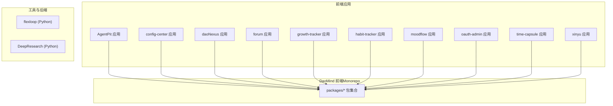
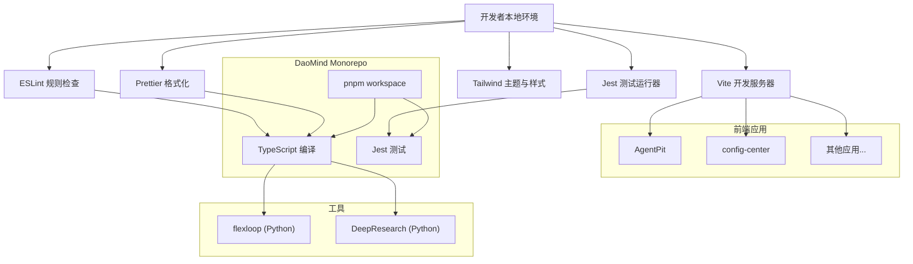
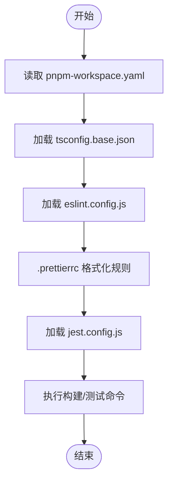
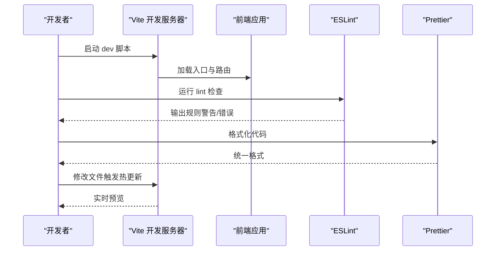
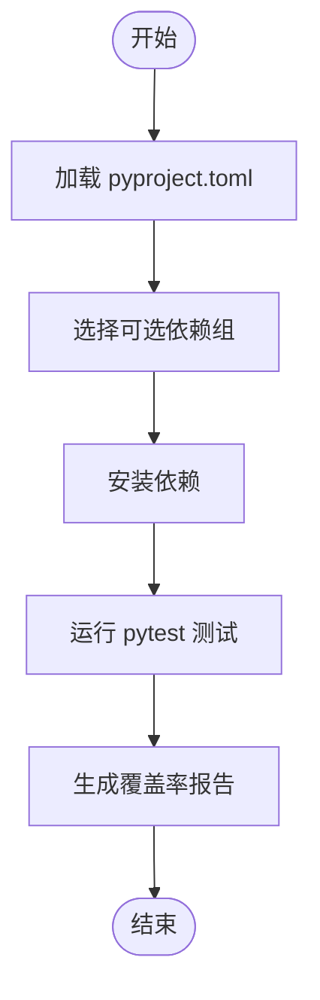
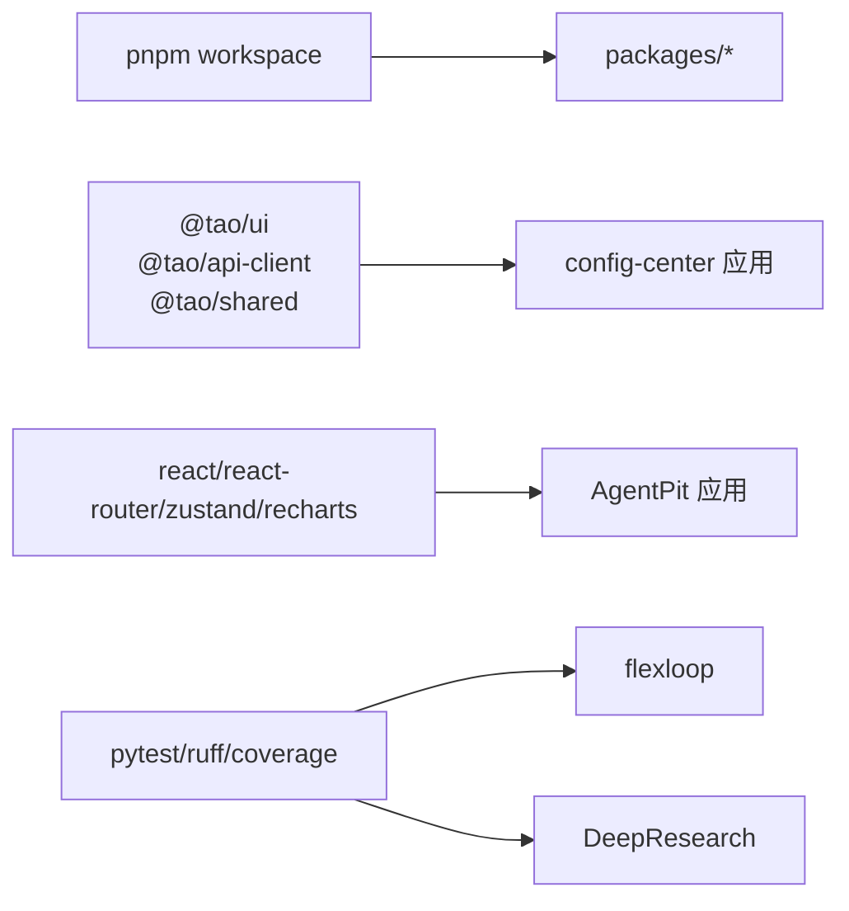

# 开发者指南

<cite>
**本文引用的文件**
- [apps/DaoMind/package.json](file://apps/DaoMind/package.json)
- [apps/DaoMind/pnpm-workspace.yaml](file://apps/DaoMind/pnpm-workspace.yaml)
- [apps/DaoMind/eslint.config.js](file://apps/DaoMind/eslint.config.js)
- [apps/DaoMind/.prettierrc](file://apps/DaoMind/.prettierrc)
- [apps/DaoMind/tsconfig.base.json](file://apps/DaoMind/tsconfig.base.json)
- [apps/DaoMind/jest.config.js](file://apps/DaoMind/jest.config.js)
- [apps/DaoMind/packages/daoCollective/package.json](file://apps/DaoMind/packages/daoCollective/package.json)
- [apps/AgentPit/package.json](file://apps/AgentPit/package.json)
- [apps/AgentPit/vite.config.ts](file://apps/AgentPit/vite.config.ts)
- [apps/AgentPit/tailwind.config.ts](file://apps/AgentPit/tailwind.config.ts)
- [apps/config-center/package.json](file://apps/config-center/package.json)
- [apps/config-center/vite.config.ts](file://apps/config-center/vite.config.ts)
- [apps/config-center/tailwind.config.ts](file://apps/config-center/tailwind.config.ts)
- [tools/flexloop/pyproject.toml](file://tools/flexloop/pyproject.toml)
- [tools/DeepResearch/pyproject.toml](file://tools/DeepResearch/pyproject.toml)
</cite>

## 目录
1. [简介](#简介)
2. [项目结构](#项目结构)
3. [核心组件](#核心组件)
4. [架构总览](#架构总览)
5. [详细组件分析](#详细组件分析)
6. [依赖关系分析](#依赖关系分析)
7. [性能考虑](#性能考虑)
8. [故障排查指南](#故障排查指南)
9. [结论](#结论)
10. [附录](#附录)

## 简介
本指南面向DAO Collective项目的开发者，覆盖开发环境搭建、代码规范与风格、贡献流程、monorepo开发工作流与包管理最佳实践、新功能开发流程、代码审查标准、发布流程、调试与性能分析、问题排查以及各子包的开发模式与集成方式。内容基于仓库中现有的配置文件与脚本进行归纳总结，帮助团队在统一规范下高效协作。

## 项目结构
DAO Collective采用多应用与多语言混合的monorepo组织方式：
- 前端应用：AgentPit、config-center、daoNexus、forum、growth-tracker、habit-tracker、moodflow、oauth-admin、time-capsule、xinyu 等，使用Vite + React + TypeScript构建。
- 核心工程：DaoMind（前端monorepo，包含多个packages），使用pnpm workspace + TypeScript + Jest。
- 工具与后端：tools/flexloop（Python）与tools/DeepResearch（Python）。

图表来源
- [apps/DaoMind/pnpm-workspace.yaml:1-3](file://apps/DaoMind/pnpm-workspace.yaml#L1-L3)
- [apps/DaoMind/packages/daoCollective/package.json:1-1](file://apps/DaoMind/packages/daoCollective/package.json#L1-L1)
- [apps/AgentPit/package.json:1-37](file://apps/AgentPit/package.json#L1-L37)
- [apps/config-center/package.json:1-41](file://apps/config-center/package.json#L1-L41)
- [tools/flexloop/pyproject.toml:1-318](file://tools/flexloop/pyproject.toml#L1-L318)
- [tools/DeepResearch/pyproject.toml:1-93](file://tools/DeepResearch/pyproject.toml#L1-L93)

章节来源
- [apps/DaoMind/pnpm-workspace.yaml:1-3](file://apps/DaoMind/pnpm-workspace.yaml#L1-L3)
- [apps/DaoMind/package.json:1-1](file://apps/DaoMind/package.json#L1-L1)
- [apps/AgentPit/package.json:1-37](file://apps/AgentPit/package.json#L1-L37)
- [apps/config-center/package.json:1-41](file://apps/config-center/package.json#L1-L41)
- [tools/flexloop/pyproject.toml:1-318](file://tools/flexloop/pyproject.toml#L1-L318)
- [tools/DeepResearch/pyproject.toml:1-93](file://tools/DeepResearch/pyproject.toml#L1-L93)

## 核心组件
- DaoMind monorepo（前端）
  - 使用pnpm workspace管理packages，支持workspace:*依赖解析。
  - TypeScript基础配置启用严格模式与路径映射，便于跨包引用。
  - ESLint配置集中于eslint.config.js，结合TypeScript解析器与插件。
  - Prettier通过.prettierrc统一格式化风格。
  - Jest用于单元测试与覆盖率阈值控制。
- 前端应用（Vite + React + TS）
  - 各应用通过独立package.json定义脚本与依赖，统一使用React生态。
  - TailwindCSS按需扩展主题与动画，提升UI一致性。
  - Vite配置支持代理、分包与产物优化。
- 工具与后端（Python）
  - flexloop与DeepResearch分别通过pyproject.toml定义依赖与测试配置，支持pytest与覆盖率统计。

章节来源
- [apps/DaoMind/pnpm-workspace.yaml:1-3](file://apps/DaoMind/pnpm-workspace.yaml#L1-L3)
- [apps/DaoMind/tsconfig.base.json:1-1](file://apps/DaoMind/tsconfig.base.json#L1-L1)
- [apps/DaoMind/eslint.config.js:1-27](file://apps/DaoMind/eslint.config.js#L1-L27)
- [apps/DaoMind/.prettierrc:1-1](file://apps/DaoMind/.prettierrc#L1-L1)
- [apps/DaoMind/jest.config.js:1-59](file://apps/DaoMind/jest.config.js#L1-L59)
- [apps/AgentPit/package.json:1-37](file://apps/AgentPit/package.json#L1-L37)
- [apps/AgentPit/tailwind.config.ts:1-30](file://apps/AgentPit/tailwind.config.ts#L1-L30)
- [apps/config-center/package.json:1-41](file://apps/config-center/package.json#L1-L41)
- [apps/config-center/tailwind.config.ts:1-104](file://apps/config-center/tailwind.config.ts#L1-L104)
- [tools/flexloop/pyproject.toml:1-318](file://tools/flexloop/pyproject.toml#L1-L318)
- [tools/DeepResearch/pyproject.toml:1-93](file://tools/DeepResearch/pyproject.toml#L1-L93)

## 架构总览
下图展示前端应用与DaoMind monorepo的关系，以及工具链（Vite、ESLint、Jest、Tailwind）在开发流程中的位置。

图表来源
- [apps/DaoMind/pnpm-workspace.yaml:1-3](file://apps/DaoMind/pnpm-workspace.yaml#L1-L3)
- [apps/DaoMind/tsconfig.base.json:1-1](file://apps/DaoMind/tsconfig.base.json#L1-L1)
- [apps/DaoMind/eslint.config.js:1-27](file://apps/DaoMind/eslint.config.js#L1-L27)
- [apps/DaoMind/.prettierrc:1-1](file://apps/DaoMind/.prettierrc#L1-L1)
- [apps/DaoMind/jest.config.js:1-59](file://apps/DaoMind/jest.config.js#L1-L59)
- [apps/AgentPit/vite.config.ts:1-8](file://apps/AgentPit/vite.config.ts#L1-L8)
- [apps/config-center/vite.config.ts:1-41](file://apps/config-center/vite.config.ts#L1-L41)
- [apps/AgentPit/tailwind.config.ts:1-30](file://apps/AgentPit/tailwind.config.ts#L1-L30)
- [apps/config-center/tailwind.config.ts:1-104](file://apps/config-center/tailwind.config.ts#L1-L104)
- [tools/flexloop/pyproject.toml:1-318](file://tools/flexloop/pyproject.toml#L1-L318)
- [tools/DeepResearch/pyproject.toml:1-93](file://tools/DeepResearch/pyproject.toml#L1-L93)

## 详细组件分析

### DaoMind 前端Monorepo
- 工作区与包管理
  - 通过pnpm-workspace.yaml声明packages目录为工作区，支持workspace:*依赖解析，便于跨包复用与版本统一。
- TypeScript配置
  - tsconfig.base.json启用严格模式、路径映射与ESM编译目标，确保类型安全与模块解析一致性。
- 代码质量
  - eslint.config.js集中配置TS解析器与插件，对未使用变量、显式返回类型、any使用等进行约束；同时允许warn级别以平衡开发效率。
  - .prettierrc统一缩进、引号、行尾等格式化规则，保证风格一致。
- 测试与覆盖率
  - jest.config.js配置ts-jest、ESM支持、模块名映射与覆盖率阈值，确保测试执行与报告稳定可靠。

图表来源
- [apps/DaoMind/pnpm-workspace.yaml:1-3](file://apps/DaoMind/pnpm-workspace.yaml#L1-L3)
- [apps/DaoMind/tsconfig.base.json:1-1](file://apps/DaoMind/tsconfig.base.json#L1-L1)
- [apps/DaoMind/eslint.config.js:1-27](file://apps/DaoMind/eslint.config.js#L1-L27)
- [apps/DaoMind/.prettierrc:1-1](file://apps/DaoMind/.prettierrc#L1-L1)
- [apps/DaoMind/jest.config.js:1-59](file://apps/DaoMind/jest.config.js#L1-L59)

章节来源
- [apps/DaoMind/pnpm-workspace.yaml:1-3](file://apps/DaoMind/pnpm-workspace.yaml#L1-L3)
- [apps/DaoMind/tsconfig.base.json:1-1](file://apps/DaoMind/tsconfig.base.json#L1-L1)
- [apps/DaoMind/eslint.config.js:1-27](file://apps/DaoMind/eslint.config.js#L1-L27)
- [apps/DaoMind/.prettierrc:1-1](file://apps/DaoMind/.prettierrc#L1-L1)
- [apps/DaoMind/jest.config.js:1-59](file://apps/DaoMind/jest.config.js#L1-L59)

### 前端应用（以AgentPit与config-center为例）
- AgentPit
  - 脚本：dev/build/lint/preview，依赖React、React Router、Zustand、Recharts等。
  - Vite配置：使用React插件，满足快速开发与热更新。
  - Tailwind配置：自定义主色系，适配组件化设计。
- config-center
  - 脚本：dev/build/preview/typecheck/test/watch，依赖React、React Router、Zustand、UI库与API客户端。
  - Vite配置：设置别名@指向src，配置代理到后端服务，构建时拆分vendor包并压缩console/debugger。
  - Tailwind配置：支持暗色模式、容器、动画与字体族扩展，适配企业级仪表盘。

图表来源
- [apps/AgentPit/package.json:1-37](file://apps/AgentPit/package.json#L1-L37)
- [apps/AgentPit/vite.config.ts:1-8](file://apps/AgentPit/vite.config.ts#L1-L8)
- [apps/AgentPit/tailwind.config.ts:1-30](file://apps/AgentPit/tailwind.config.ts#L1-L30)
- [apps/config-center/package.json:1-41](file://apps/config-center/package.json#L1-L41)
- [apps/config-center/vite.config.ts:1-41](file://apps/config-center/vite.config.ts#L1-L41)
- [apps/config-center/tailwind.config.ts:1-104](file://apps/config-center/tailwind.config.ts#L1-L104)

章节来源
- [apps/AgentPit/package.json:1-37](file://apps/AgentPit/package.json#L1-L37)
- [apps/AgentPit/vite.config.ts:1-8](file://apps/AgentPit/vite.config.ts#L1-L8)
- [apps/AgentPit/tailwind.config.ts:1-30](file://apps/AgentPit/tailwind.config.ts#L1-L30)
- [apps/config-center/package.json:1-41](file://apps/config-center/package.json#L1-L41)
- [apps/config-center/vite.config.ts:1-41](file://apps/config-center/vite.config.ts#L1-L41)
- [apps/config-center/tailwind.config.ts:1-104](file://apps/config-center/tailwind.config.ts#L1-L104)

### 工具与后端（Python）
- flexloop
  - pyproject.toml定义了丰富的可选依赖集（如auth、config-server、data-sync、task-queue、email-service、analytics、file-storage、oauth、qrcode、audit等），并配置pytest、ruff、coverage等工具。
  - 支持不同场景的组合安装，便于按需启用功能模块。
- DeepResearch
  - pyproject.toml定义研究框架所需的核心依赖（HTTP、LangChain、LangGraph、搜索工具等），并配置pytest与ruff。

图表来源
- [tools/flexloop/pyproject.toml:1-318](file://tools/flexloop/pyproject.toml#L1-L318)
- [tools/DeepResearch/pyproject.toml:1-93](file://tools/DeepResearch/pyproject.toml#L1-L93)

章节来源
- [tools/flexloop/pyproject.toml:1-318](file://tools/flexloop/pyproject.toml#L1-L318)
- [tools/DeepResearch/pyproject.toml:1-93](file://tools/DeepResearch/pyproject.toml#L1-L93)

## 依赖关系分析
- 包间依赖
  - DaoMind monorepo通过workspace:*解析内部包依赖，避免重复安装与版本漂移。
  - 前端应用通过package.json声明对共享UI、API客户端等workspace包的依赖，实现跨应用复用。
- 外部依赖
  - 前端应用依赖React、React Router、Zustand、Tailwind等主流生态库。
  - Python工具链依赖pytest、ruff、coverage等，保障代码质量与测试覆盖率。

图表来源
- [apps/DaoMind/pnpm-workspace.yaml:1-3](file://apps/DaoMind/pnpm-workspace.yaml#L1-L3)
- [apps/config-center/package.json:1-41](file://apps/config-center/package.json#L1-L41)
- [apps/AgentPit/package.json:1-37](file://apps/AgentPit/package.json#L1-L37)
- [tools/flexloop/pyproject.toml:1-318](file://tools/flexloop/pyproject.toml#L1-L318)
- [tools/DeepResearch/pyproject.toml:1-93](file://tools/DeepResearch/pyproject.toml#L1-L93)

章节来源
- [apps/DaoMind/pnpm-workspace.yaml:1-3](file://apps/DaoMind/pnpm-workspace.yaml#L1-L3)
- [apps/config-center/package.json:1-41](file://apps/config-center/package.json#L1-L41)
- [apps/AgentPit/package.json:1-37](file://apps/AgentPit/package.json#L1-L37)
- [tools/flexloop/pyproject.toml:1-318](file://tools/flexloop/pyproject.toml#L1-L318)
- [tools/DeepResearch/pyproject.toml:1-93](file://tools/DeepResearch/pyproject.toml#L1-L93)

## 性能考虑
- 前端构建优化
  - config-center的Vite配置开启terser压缩与手动分包策略，减少首屏体积与提升缓存命中率。
  - 关闭Source Map以降低生产包大小，提高加载速度。
- 测试与覆盖率
  - Jest配置合理超时与并发限制，避免CI资源浪费；覆盖率阈值确保关键逻辑被充分验证。
- Python工具链
  - ruff用于静态检查与格式化，pytest与coverage保障测试质量，适合在CI中并行执行。

章节来源
- [apps/config-center/vite.config.ts:1-41](file://apps/config-center/vite.config.ts#L1-L41)
- [apps/DaoMind/jest.config.js:1-59](file://apps/DaoMind/jest.config.js#L1-L59)
- [tools/flexloop/pyproject.toml:1-318](file://tools/flexloop/pyproject.toml#L1-L318)
- [tools/DeepResearch/pyproject.toml:1-93](file://tools/DeepResearch/pyproject.toml#L1-L93)

## 故障排查指南
- ESLint规则冲突
  - 若出现规则不生效或误报，检查eslint.config.js中的parserOptions.project是否指向正确tsconfig，确认文件扩展名匹配。
- TypeScript路径映射
  - 若模块导入失败，核对tsconfig.base.json的paths与moduleNameMapper是否一致。
- Vite代理与端口
  - 若config-center无法访问后端接口，检查vite.config.ts中的proxy配置与后端监听地址。
- Jest测试失败
  - 若测试超时或覆盖率异常，调整jest.config.js的testTimeout与maxWorkers，确保模块名映射与ts-jest配置正确。
- Python依赖与测试
  - 若pytest执行失败，检查pyproject.toml中的test依赖与pytest.ini配置，确保测试路径与类/函数命名规范一致。

章节来源
- [apps/DaoMind/eslint.config.js:1-27](file://apps/DaoMind/eslint.config.js#L1-L27)
- [apps/DaoMind/tsconfig.base.json:1-1](file://apps/DaoMind/tsconfig.base.json#L1-L1)
- [apps/config-center/vite.config.ts:1-41](file://apps/config-center/vite.config.ts#L1-L41)
- [apps/DaoMind/jest.config.js:1-59](file://apps/DaoMind/jest.config.js#L1-L59)
- [tools/flexloop/pyproject.toml:1-318](file://tools/flexloop/pyproject.toml#L1-L318)
- [tools/DeepResearch/pyproject.toml:1-93](file://tools/DeepResearch/pyproject.toml#L1-L93)

## 结论
DAO Collective通过清晰的monorepo结构与统一的工具链，实现了前端应用与工具链的高效协同。遵循本文的开发规范、贡献流程与排障建议，可在保证质量的前提下加速迭代与交付。

## 附录

### 开发环境搭建步骤
- 安装Node.js与包管理器
  - 前端应用与DaoMind monorepo需要满足最低Node版本要求（参考各package.json engines字段）。
  - 推荐使用pnpm作为包管理器，以充分利用workspace与依赖去重能力。
- 安装Python与工具链（如需参与Python相关模块）
  - 安装Python并使用pip或虚拟环境管理依赖，参考pyproject.toml中的依赖声明。
- 初始化项目
  - 在根目录执行安装命令以拉取所有依赖（前端与Python工具链）。
- 启动开发
  - 前端应用：进入对应应用目录，执行dev脚本启动Vite开发服务器。
  - DaoMind monorepo：在根目录执行构建或测试命令，确保包间依赖解析正常。
  - Python工具：根据需要安装可选依赖组并运行pytest进行测试。

章节来源
- [apps/DaoMind/package.json:1-1](file://apps/DaoMind/package.json#L1-L1)
- [apps/AgentPit/package.json:1-37](file://apps/AgentPit/package.json#L1-L37)
- [apps/config-center/package.json:1-41](file://apps/config-center/package.json#L1-L41)
- [tools/flexloop/pyproject.toml:1-318](file://tools/flexloop/pyproject.toml#L1-L318)
- [tools/DeepResearch/pyproject.toml:1-93](file://tools/DeepResearch/pyproject.toml#L1-L93)

### 代码规范与风格指南
- ESLint配置
  - 解析器与插件：使用TypeScript解析器与ESLint插件，确保对TS语法与类型检查的支持。
  - 规则示例：未使用变量、显式返回类型、any使用等规则已配置为warn/error，便于在质量与效率之间取得平衡。
- Prettier格式化
  - 统一缩进、引号、行尾、逗号等格式化参数，确保团队代码风格一致。
- TypeScript
  - 严格模式与路径映射：通过tsconfig.base.json启用严格模式与模块路径映射，提升类型安全性与模块解析效率。

章节来源
- [apps/DaoMind/eslint.config.js:1-27](file://apps/DaoMind/eslint.config.js#L1-L27)
- [apps/DaoMind/.prettierrc:1-1](file://apps/DaoMind/.prettierrc#L1-L1)
- [apps/DaoMind/tsconfig.base.json:1-1](file://apps/DaoMind/tsconfig.base.json#L1-L1)

### 贡献流程
- Fork与分支
  - Fork仓库至个人空间，创建特性分支进行开发，分支命名建议采用“feature/描述”或“fix/问题”格式。
- 提交与PR
  - 提交前先运行lint与format命令，确保无ESLint错误与格式化差异。
  - 提交信息应清晰描述变更内容与动机，必要时附带测试用例与变更日志。
  - 创建Pull Request并关联相关Issue，等待代码审查与CI通过。
- 代码审查
  - 审查重点包括：代码质量（ESLint/Jest覆盖率）、架构一致性（monorepo包依赖）、性能影响（构建与运行时）与可维护性（可读性与注释）。

章节来源
- [apps/DaoMind/eslint.config.js:1-27](file://apps/DaoMind/eslint.config.js#L1-L27)
- [apps/DaoMind/jest.config.js:1-59](file://apps/DaoMind/jest.config.js#L1-L59)
- [apps/DaoMind/pnpm-workspace.yaml:1-3](file://apps/DaoMind/pnpm-workspace.yaml#L1-L3)

### monorepo开发工作流与包管理最佳实践
- workspace依赖
  - 使用workspace:*解析内部包，避免重复安装与版本漂移，统一升级策略。
- 跨包引用
  - 通过tsconfig.base.json的paths与moduleNameMapper保持一致，确保IDE与编译器识别正确。
- 构建与测试
  - 在根目录执行批量构建与测试，确保包间依赖与导出一致；针对大型包采用分包策略减少冷启动时间。

章节来源
- [apps/DaoMind/pnpm-workspace.yaml:1-3](file://apps/DaoMind/pnpm-workspace.yaml#L1-L3)
- [apps/DaoMind/tsconfig.base.json:1-1](file://apps/DaoMind/tsconfig.base.json#L1-L1)
- [apps/DaoMind/jest.config.js:1-59](file://apps/DaoMind/jest.config.js#L1-L59)

### 新功能开发指南
- 设计与规划
  - 明确功能边界与数据流，评估对现有包的影响，必要时新增或扩展packages。
- 开发与测试
  - 遵循ESLint与Prettier规范，补充单元测试与集成测试，确保覆盖率达标。
- 集成与验证
  - 在config-center等应用中验证UI与交互，确认与后端接口对接顺畅。

章节来源
- [apps/DaoMind/eslint.config.js:1-27](file://apps/DaoMind/eslint.config.js#L1-L27)
- [apps/DaoMind/.prettierrc:1-1](file://apps/DaoMind/.prettierrc#L1-L1)
- [apps/DaoMind/jest.config.js:1-59](file://apps/DaoMind/jest.config.js#L1-L59)
- [apps/config-center/package.json:1-41](file://apps/config-center/package.json#L1-L41)

### 发布流程
- 前端应用
  - 执行build脚本生成生产包，校验产物与分包策略，上传至CDN或部署平台。
- Python工具
  - 根据pyproject.toml中的版本配置与构建系统，打包并发布至目标渠道（如需要）。
- 版本与变更
  - 在PR中同步更新变更日志与版本号，确保发布记录清晰可追溯。

章节来源
- [apps/AgentPit/package.json:1-37](file://apps/AgentPit/package.json#L1-L37)
- [apps/config-center/package.json:1-41](file://apps/config-center/package.json#L1-L41)
- [tools/flexloop/pyproject.toml:1-318](file://tools/flexloop/pyproject.toml#L1-L318)
- [tools/DeepResearch/pyproject.toml:1-93](file://tools/DeepResearch/pyproject.toml#L1-L93)

### 调试技巧与性能分析
- 前端
  - 使用浏览器开发者工具定位渲染与网络问题；在Vite中启用源码映射以便断点调试。
  - 分析bundle大小与分包策略，优化第三方依赖与动态导入。
- Python
  - 使用pytest的详细输出与覆盖率报告定位问题；结合ruff快速修复常见风格问题。

章节来源
- [apps/config-center/vite.config.ts:1-41](file://apps/config-center/vite.config.ts#L1-L41)
- [tools/flexloop/pyproject.toml:1-318](file://tools/flexloop/pyproject.toml#L1-L318)
- [tools/DeepResearch/pyproject.toml:1-93](file://tools/DeepResearch/pyproject.toml#L1-L93)

### 子包开发模式与集成方式
- DaoMind packages
  - 通过packages目录内的子包实现功能模块化，使用统一的TypeScript配置与测试策略。
- 前端应用集成
  - 在应用的package.json中声明对workspace包的依赖，确保构建时正确解析与打包。
- UI与API客户端
  - config-center示例展示了如何通过workspace:*依赖共享UI与API客户端，提升复用性与一致性。

章节来源
- [apps/DaoMind/packages/daoCollective/package.json:1-1](file://apps/DaoMind/packages/daoCollective/package.json#L1-L1)
- [apps/config-center/package.json:1-41](file://apps/config-center/package.json#L1-L41)