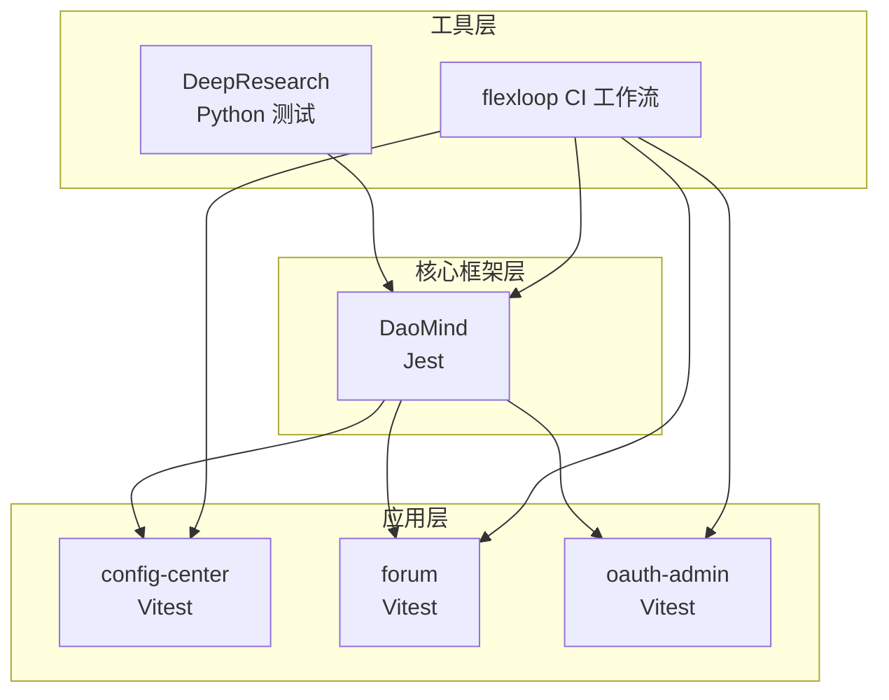
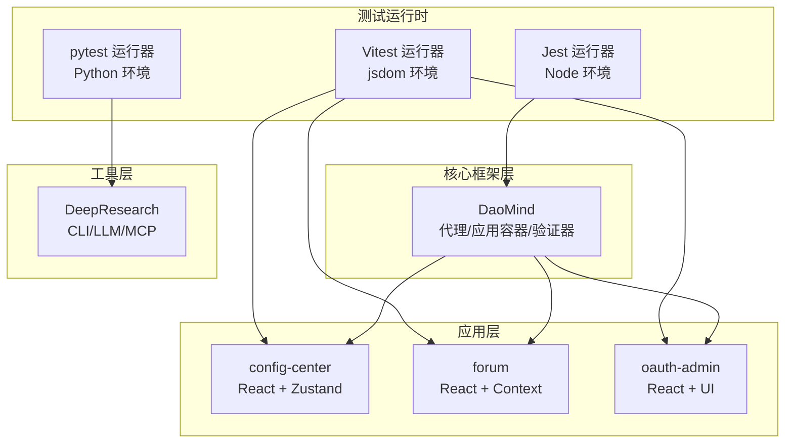
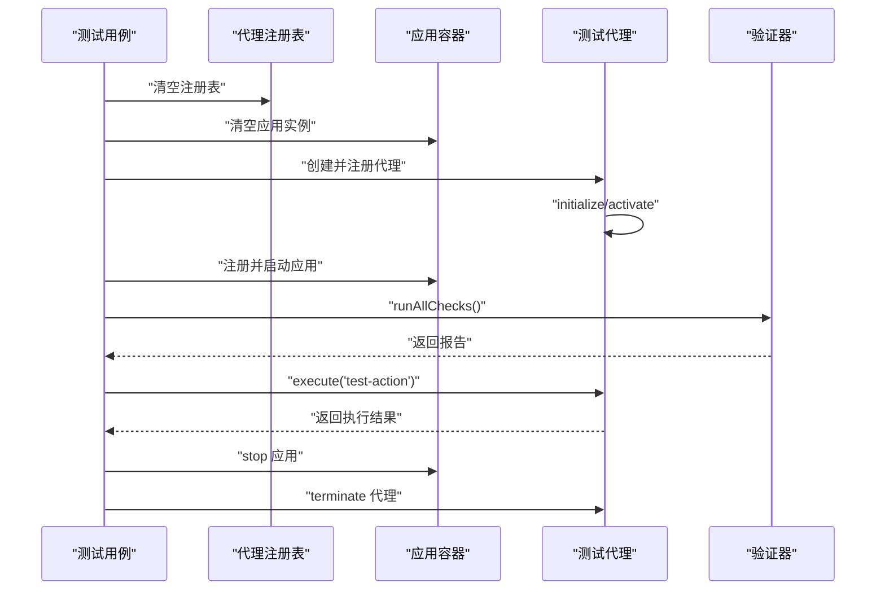
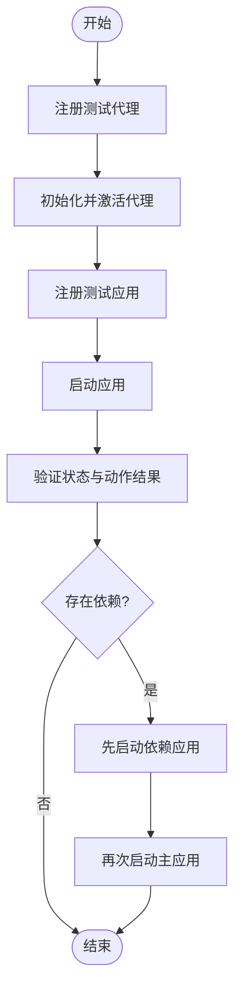
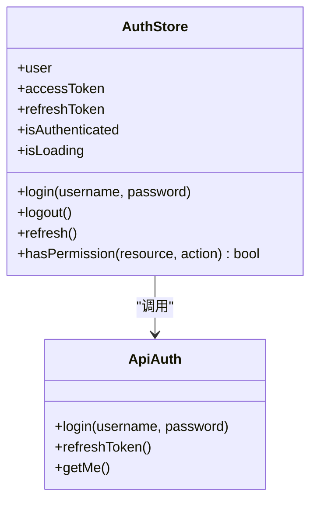
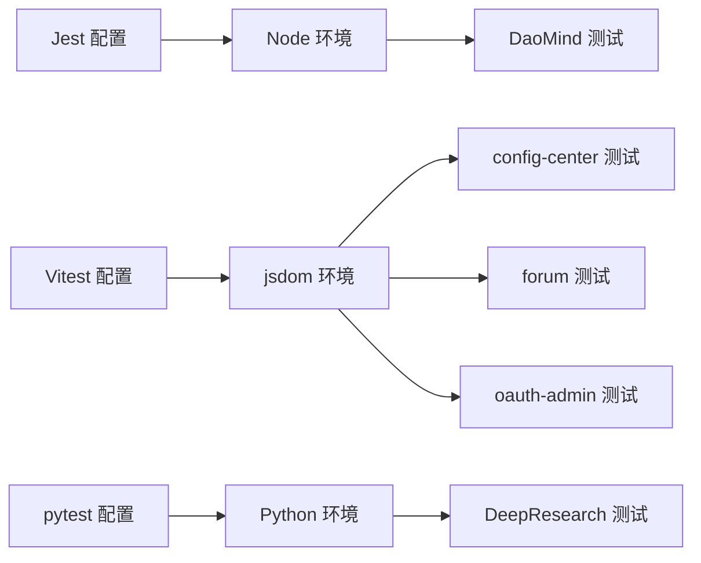

# 调试与测试

<cite>
**本文引用的文件**
- [apps/DaoMind/jest.config.js](file://apps/DaoMind/jest.config.js)
- [apps/DaoMind/package.json](file://apps/DaoMind/package.json)
- [apps/DaoMind/src/__tests__/e2e/full-system.test.ts](file://apps/DaoMind/src/__tests__/e2e/full-system.test.ts)
- [apps/DaoMind/src/__tests__/integration/agents-apps-integration.test.ts](file://apps/DaoMind/src/__tests__/integration/agents-apps-integration.test.ts)
- [apps/DaoMind/src/__tests__/integration/verify-integration.test.ts](file://apps/DaoMind/src/__tests__/integration/verify-integration.test.ts)
- [apps/config-center/vitest.config.ts](file://apps/config-center/vitest.config.ts)
- [apps/config-center/src/store/authStore.test.ts](file://apps/config-center/src/store/authStore.test.ts)
- [apps/config-center/src/test/setup.ts](file://apps/config-center/src/test/setup.ts)
- [apps/forum/vitest.config.ts](file://apps/forum/vitest.config.ts)
- [apps/oauth-admin/vitest.config.ts](file://apps/oauth-admin/vitest.config.ts)
- [tools/DeepResearch/tests/e2e/test_e2e.py](file://tools/DeepResearch/tests/e2e/test_e2e.py)
- [tools/DeepResearch/tests/integration/test_integration.py](file://tools/DeepResearch/tests/integration/test_integration.py)
- [tools/DeepResearch/tests/unit/cli/test_config.py](file://tools/DeepResearch/tests/unit/cli/test_config.py)
- [tools/DeepResearch/tests/performance/concurrency_test.py](file://tools/DeepResearch/tests/performance/concurrency_test.py)
- [tools/flexloop/.github/workflows/ci.yml](file://tools/flexloop/.github/workflows/ci.yml)
</cite>

## 目录
1. [简介](#简介)
2. [项目结构](#项目结构)
3. [核心组件](#核心组件)
4. [架构总览](#架构总览)
5. [详细组件分析](#详细组件分析)
6. [依赖关系分析](#依赖关系分析)
7. [性能考量](#性能考量)
8. [故障排查指南](#故障排查指南)
9. [结论](#结论)
10. [附录](#附录)

## 简介
本指南面向 DAO Collective 项目，提供系统化的调试与测试实践，覆盖单元测试、集成测试与端到端测试的编写与运行方法；对比 Jest 与 Vitest 的配置与使用差异；明确测试覆盖率与质量标准；阐述 Mock 策略与测试数据管理；给出浏览器与 Node.js 调试工具用法；提供性能分析与内存泄漏检测建议；总结常见问题排查与解决方案，并说明在持续集成中如何执行测试。

## 项目结构
DAO Collective 采用多应用与多工具并存的组织方式：
- 应用层：多个前端应用（如 config-center、forum、oauth-admin）使用 Vitest 进行单元与集成测试。
- 核心框架层：DaoMind 使用 Jest 进行端到端与集成测试，覆盖代理与应用容器的协同。
- 工具层：DeepResearch 提供 Python 测试套件（单元/集成/端到端/性能），flexloop 提供 CI 工作流示例。

图表来源
- [apps/DaoMind/jest.config.js:1-59](file://apps/DaoMind/jest.config.js#L1-L59)
- [apps/config-center/vitest.config.ts:1-18](file://apps/config-center/vitest.config.ts#L1-L18)
- [apps/forum/vitest.config.ts:1-41](file://apps/forum/vitest.config.ts#L1-L41)
- [apps/oauth-admin/vitest.config.ts:1-18](file://apps/oauth-admin/vitest.config.ts#L1-L18)
- [tools/DeepResearch/tests/e2e/test_e2e.py](file://tools/DeepResearch/tests/e2e/test_e2e.py)
- [tools/flexloop/.github/workflows/ci.yml](file://tools/flexloop/.github/workflows/ci.yml)

章节来源
- [apps/DaoMind/jest.config.js:1-59](file://apps/DaoMind/jest.config.js#L1-L59)
- [apps/DaoMind/package.json:1-1](file://apps/DaoMind/package.json#L1-L1)
- [apps/config-center/vitest.config.ts:1-18](file://apps/config-center/vitest.config.ts#L1-L18)
- [apps/forum/vitest.config.ts:1-41](file://apps/forum/vitest.config.ts#L1-L41)
- [apps/oauth-admin/vitest.config.ts:1-18](file://apps/oauth-admin/vitest.config.ts#L1-L18)
- [tools/DeepResearch/tests/e2e/test_e2e.py](file://tools/DeepResearch/tests/e2e/test_e2e.py)
- [tools/flexloop/.github/workflows/ci.yml](file://tools/flexloop/.github/workflows/ci.yml)

## 核心组件
- DaoMind 测试体系（Jest）
  - 端到端测试：覆盖代理注册、应用容器生命周期、验证报告生成等完整链路。
  - 集成测试：验证代理与应用容器协作、依赖关系处理、验证器分类执行。
- 应用层测试体系（Vitest）
  - 单元测试：针对 Store 逻辑、权限判断、异步 API 调用进行断言。
  - 集成测试：基于 jsdom 环境，模拟 DOM 行为与状态持久化。
- 工具层测试体系（Python）
  - 端到端、集成、单元与性能测试，覆盖 CLI、模板、LLM、MCP 客户端等模块。

章节来源
- [apps/DaoMind/src/__tests__/e2e/full-system.test.ts:1-120](file://apps/DaoMind/src/__tests__/e2e/full-system.test.ts#L1-L120)
- [apps/DaoMind/src/__tests__/integration/agents-apps-integration.test.ts:1-113](file://apps/DaoMind/src/__tests__/integration/agents-apps-integration.test.ts#L1-L113)
- [apps/DaoMind/src/__tests__/integration/verify-integration.test.ts:1-45](file://apps/DaoMind/src/__tests__/integration/verify-integration.test.ts#L1-L45)
- [apps/config-center/src/store/authStore.test.ts:1-159](file://apps/config-center/src/store/authStore.test.ts#L1-L159)
- [apps/config-center/src/test/setup.ts:1-25](file://apps/config-center/src/test/setup.ts#L1-L25)
- [tools/DeepResearch/tests/e2e/test_e2e.py](file://tools/DeepResearch/tests/e2e/test_e2e.py)
- [tools/DeepResearch/tests/integration/test_integration.py](file://tools/DeepResearch/tests/integration/test_integration.py)
- [tools/DeepResearch/tests/unit/cli/test_config.py](file://tools/DeepResearch/tests/unit/cli/test_config.py)
- [tools/DeepResearch/tests/performance/concurrency_test.py](file://tools/DeepResearch/tests/performance/concurrency_test.py)

## 架构总览
下图展示测试栈在不同层级的职责与交互：

图表来源
- [apps/DaoMind/jest.config.js:1-59](file://apps/DaoMind/jest.config.js#L1-L59)
- [apps/config-center/vitest.config.ts:1-18](file://apps/config-center/vitest.config.ts#L1-L18)
- [apps/forum/vitest.config.ts:1-41](file://apps/forum/vitest.config.ts#L1-L41)
- [apps/oauth-admin/vitest.config.ts:1-18](file://apps/oauth-admin/vitest.config.ts#L1-L18)
- [tools/DeepResearch/tests/e2e/test_e2e.py](file://tools/DeepResearch/tests/e2e/test_e2e.py)

## 详细组件分析

### DaoMind 端到端测试（Jest）
- 测试目标
  - 验证代理注册与激活、应用注册与启动、验证器报告生成与格式输出、应用停止与代理终止的完整流程。
  - 验证错误场景：未注册应用启动、重复代理注册、命名规范类别的验证结果。
- 关键流程
  - 初始化与清理：清空代理注册表与应用实例，确保测试隔离。
  - 代理与应用生命周期：注册、初始化、激活、执行动作、停止、终止。
  - 验证器：全量检查、指定类别检查、Markdown/JSON 报告生成。
- 断言要点
  - 状态断言：代理与应用的状态机转换。
  - 结果断言：动作返回值、报告结构与内容。
  - 异常断言：错误消息匹配与异常抛出。

图表来源
- [apps/DaoMind/src/__tests__/e2e/full-system.test.ts:1-120](file://apps/DaoMind/src/__tests__/e2e/full-system.test.ts#L1-L120)

章节来源
- [apps/DaoMind/src/__tests__/e2e/full-system.test.ts:1-120](file://apps/DaoMind/src/__tests__/e2e/full-system.test.ts#L1-L120)

### DaoMind 集成测试（Jest）
- 代理与应用容器集成
  - 验证代理与应用的注册、启动、状态查询与动作执行。
  - 依赖关系处理：主应用启动前依赖应用必须处于运行态。
- 验证器集成
  - 全量检查与指定类别检查，报告结构断言与 Markdown/JSON 输出校验。

图表来源
- [apps/DaoMind/src/__tests__/integration/agents-apps-integration.test.ts:1-113](file://apps/DaoMind/src/__tests__/integration/agents-apps-integration.test.ts#L1-L113)
- [apps/DaoMind/src/__tests__/integration/verify-integration.test.ts:1-45](file://apps/DaoMind/src/__tests__/integration/verify-integration.test.ts#L1-L45)

章节来源
- [apps/DaoMind/src/__tests__/integration/agents-apps-integration.test.ts:1-113](file://apps/DaoMind/src/__tests__/integration/agents-apps-integration.test.ts#L1-L113)
- [apps/DaoMind/src/__tests__/integration/verify-integration.test.ts:1-45](file://apps/DaoMind/src/__tests__/integration/verify-integration.test.ts#L1-L45)

### 应用层单元测试（Vitest）
- config-center 认证 Store 测试
  - Mock API 层：登录、刷新令牌、获取当前用户。
  - 状态断言：登录成功/失败、登出、刷新令牌成功/失败、权限判断。
  - 环境准备：通过 setup 文件模拟 localStorage，适配 Zustand 持久化中间件。
- forum 应用测试
  - 基于 jsdom 的 React 组件测试环境，支持覆盖率统计与 JSON 报告输出。
- oauth-admin 应用测试
  - 与 forum 类似的 Vitest 配置，统一的 setup 文件。

图表来源
- [apps/config-center/src/store/authStore.test.ts:1-159](file://apps/config-center/src/store/authStore.test.ts#L1-L159)

章节来源
- [apps/config-center/src/store/authStore.test.ts:1-159](file://apps/config-center/src/store/authStore.test.ts#L1-L159)
- [apps/config-center/src/test/setup.ts:1-25](file://apps/config-center/src/test/setup.ts#L1-L25)
- [apps/forum/vitest.config.ts:1-41](file://apps/forum/vitest.config.ts#L1-L41)
- [apps/oauth-admin/vitest.config.ts:1-18](file://apps/oauth-admin/vitest.config.ts#L1-L18)

### 工具层测试（Python）
- 端到端测试：覆盖完整工作流，验证外部接口与命令行行为。
- 集成测试：模块间协作与数据流转。
- 单元测试：独立功能点验证（如配置解析、模板渲染）。
- 性能测试：并发与稳定性测试脚本。

章节来源
- [tools/DeepResearch/tests/e2e/test_e2e.py](file://tools/DeepResearch/tests/e2e/test_e2e.py)
- [tools/DeepResearch/tests/integration/test_integration.py](file://tools/DeepResearch/tests/integration/test_integration.py)
- [tools/DeepResearch/tests/unit/cli/test_config.py](file://tools/DeepResearch/tests/unit/cli/test_config.py)
- [tools/DeepResearch/tests/performance/concurrency_test.py](file://tools/DeepResearch/tests/performance/concurrency_test.py)

## 依赖关系分析
- 测试运行器与环境
  - Jest：Node 环境，适合服务端与端到端测试。
  - Vitest：jsdom 环境，适合前端组件与状态逻辑测试。
  - pytest：Python 环境，适合工具层测试。
- 配置差异
  - Jest：全局覆盖率阈值、模块名映射、ESM 支持、超时时间。
  - Vitest：别名、setupFiles、覆盖率阈值、报告输出、超时时间。
- 质量门禁
  - DaoMind：全局覆盖率阈值（分支/函数/行/语句）。
  - forum：同上，额外输出 JSON 报告至 test-results。
  - config-center：通过 setup 文件模拟本地存储，避免持久化副作用。

图表来源
- [apps/DaoMind/jest.config.js:1-59](file://apps/DaoMind/jest.config.js#L1-L59)
- [apps/config-center/vitest.config.ts:1-18](file://apps/config-center/vitest.config.ts#L1-L18)
- [apps/forum/vitest.config.ts:1-41](file://apps/forum/vitest.config.ts#L1-L41)
- [apps/oauth-admin/vitest.config.ts:1-18](file://apps/oauth-admin/vitest.config.ts#L1-L18)

章节来源
- [apps/DaoMind/jest.config.js:1-59](file://apps/DaoMind/jest.config.js#L1-L59)
- [apps/config-center/vitest.config.ts:1-18](file://apps/config-center/vitest.config.ts#L1-L18)
- [apps/forum/vitest.config.ts:1-41](file://apps/forum/vitest.config.ts#L1-L41)
- [apps/oauth-admin/vitest.config.ts:1-18](file://apps/oauth-admin/vitest.config.ts#L1-L18)

## 性能考量
- 单测并发与超时
  - Jest：maxWorkers 与 testTimeout 已配置，建议根据机器资源调整。
  - Vitest：testTimeout 可按组件复杂度调整，避免长尾用例阻塞流水线。
- 覆盖率与性能平衡
  - 高覆盖率阈值有助于稳定，但过度覆盖会增加构建时间。建议分层控制：核心模块高阈值，UI 组件适度阈值。
- 性能测试
  - 工具层提供并发与稳定性测试脚本，可用于评估系统在高负载下的表现。
- 内存泄漏检测
  - 建议在长时间运行的测试中监控进程内存峰值，结合 Node.js 的 --inspect-brk 或 heapdump 分析。
  - 对于前端测试，可使用浏览器性能面板记录内存增长曲线。

## 故障排查指南
- Jest/Vitest 环境问题
  - 检查模块名映射与路径别名是否正确，确保 tsconfig 与运行器配置一致。
  - Node 环境下注意 ESM 与 CommonJS 的混用问题，必要时启用 useESM。
- Mock 失效
  - 确保在 import 之前进行 vi.mock 或 jest.mock，且被测试模块导入的是同一引用。
  - 对于 Zustand 持久化，需在 setup 中模拟 localStorage。
- 超时与不稳定
  - 适当提高 testTimeout；对异步操作使用合理的重试与超时策略。
- 覆盖率不达标
  - 补充边界条件与异常分支测试；对条件分支与循环进行充分覆盖。
- CI 执行失败
  - 查看工作流日志，确认安装依赖与缓存命中情况；对慢任务拆分并并行化。

章节来源
- [apps/DaoMind/jest.config.js:1-59](file://apps/DaoMind/jest.config.js#L1-L59)
- [apps/config-center/src/test/setup.ts:1-25](file://apps/config-center/src/test/setup.ts#L1-L25)
- [apps/forum/vitest.config.ts:1-41](file://apps/forum/vitest.config.ts#L1-L41)
- [apps/oauth-admin/vitest.config.ts:1-18](file://apps/oauth-admin/vitest.config.ts#L1-L18)

## 结论
DAO Collective 的测试体系覆盖了从单测到端到端的完整闭环，配合 Jest 与 Vitest 的差异化定位，以及工具层的 Python 测试，形成了跨语言、跨组件的质量保障。通过明确的覆盖率阈值、Mock 策略与测试数据管理，结合调试与性能分析手段，能够有效提升代码质量与交付稳定性。

## 附录

### 测试类型与运行方法
- 单元测试（Vitest/Jest）
  - 运行命令：使用包管理器脚本或直接调用对应测试运行器。
  - 覆盖率：Jest 与 Vitest 均支持多种报告格式，建议同时输出 LCOV 与 HTML。
- 集成测试（Jest/Vitest）
  - 针对组件间协作与外部依赖交互，建议在 jsdom 或 Node 环境中分别验证。
- 端到端测试（Jest/pytest）
  - 覆盖真实业务链路，建议在 CI 中分阶段执行，优先快速失败。

章节来源
- [apps/DaoMind/package.json:1-1](file://apps/DaoMind/package.json#L1-L1)
- [apps/DaoMind/jest.config.js:1-59](file://apps/DaoMind/jest.config.js#L1-L59)
- [apps/config-center/vitest.config.ts:1-18](file://apps/config-center/vitest.config.ts#L1-L18)
- [apps/forum/vitest.config.ts:1-41](file://apps/forum/vitest.config.ts#L1-L41)
- [apps/oauth-admin/vitest.config.ts:1-18](file://apps/oauth-admin/vitest.config.ts#L1-L18)
- [tools/DeepResearch/tests/e2e/test_e2e.py](file://tools/DeepResearch/tests/e2e/test_e2e.py)

### Jest 与 Vitest 配置与使用差异
- 环境
  - Jest：默认 Node 环境，适合服务端与端到端测试。
  - Vitest：默认 jsdom 环境，适合前端组件与状态逻辑测试。
- 配置项
  - Jest：collectCoverageFrom、coverageThreshold、moduleNameMapper、extensionsToTreatAsEsm。
  - Vitest：coverage.include/exclude、reporters、setupFiles、resolve.alias。
- 运行与报告
  - Jest：支持多种覆盖率报告格式；Vitest：可输出 JSON 报告便于 CI 消费。

章节来源
- [apps/DaoMind/jest.config.js:1-59](file://apps/DaoMind/jest.config.js#L1-L59)
- [apps/config-center/vitest.config.ts:1-18](file://apps/config-center/vitest.config.ts#L1-L18)
- [apps/forum/vitest.config.ts:1-41](file://apps/forum/vitest.config.ts#L1-L41)
- [apps/oauth-admin/vitest.config.ts:1-18](file://apps/oauth-admin/vitest.config.ts#L1-L18)

### 测试覆盖率要求与质量标准
- DaoMind（Jest）
  - 全局覆盖率阈值：分支、函数、行、语句均不低于 80%。
- forum（Vitest）
  - 同样以 80% 作为覆盖率阈值，额外输出 JSON 报告。
- config-center（Vitest）
  - 通过 setup 文件模拟本地存储，保证测试隔离与可重复性。

章节来源
- [apps/DaoMind/jest.config.js:10-17](file://apps/DaoMind/jest.config.js#L10-L17)
- [apps/forum/vitest.config.ts:14-19](file://apps/forum/vitest.config.ts#L14-L19)
- [apps/config-center/src/test/setup.ts:1-25](file://apps/config-center/src/test/setup.ts#L1-L25)

### Mock 策略与测试数据管理
- Mock 策略
  - 使用 vi.mock/jest.mock 在 import 之前定义，确保模块引用一致。
  - 对外部 API、存储与第三方库进行隔离，避免真实网络与磁盘 IO。
- 测试数据
  - 使用固定的数据结构与 ID，便于断言与复现。
  - 对于状态持久化（如 localStorage），在 setup 中统一模拟。

章节来源
- [apps/config-center/src/store/authStore.test.ts:1-159](file://apps/config-center/src/store/authStore.test.ts#L1-L159)
- [apps/config-center/src/test/setup.ts:1-25](file://apps/config-center/src/test/setup.ts#L1-L25)

### 调试工具使用
- 浏览器开发者工具
  - React DevTools：检查组件树、Props 与 State。
  - 性能面板：捕获内存增长、CPU 占用与长任务。
- Node.js 调试器
  - 使用 --inspect-brk 启动测试，连接 Chrome DevTools 进行断点调试。
  - Vitest/Jest 均支持在 CI 中开启调试模式以便远程排错。

章节来源
- [apps/DaoMind/jest.config.js:58-59](file://apps/DaoMind/jest.config.js#L58-L59)
- [apps/forum/vitest.config.ts:32-33](file://apps/forum/vitest.config.ts#L32-L33)

### 持续集成中的测试执行流程
- 工作流示例
  - flexloop 提供 CI 工作流，可参考其步骤顺序与缓存策略。
- 建议流程
  - 依赖安装 → 缓存命中检查 → 并行执行单元与集成测试 → 生成覆盖率与报告 → 失败快速回滚。

章节来源
- [tools/flexloop/.github/workflows/ci.yml](file://tools/flexloop/.github/workflows/ci.yml)