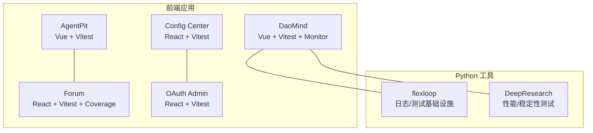
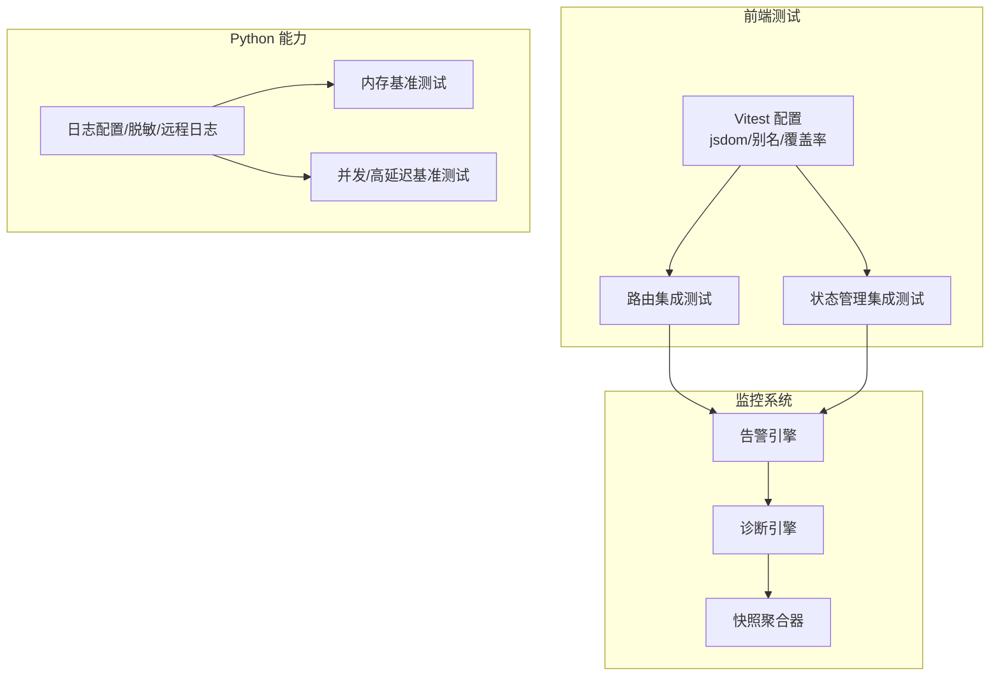
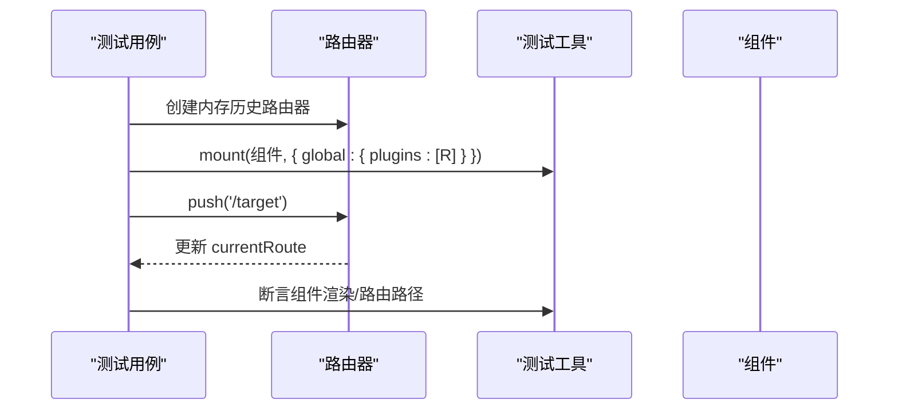
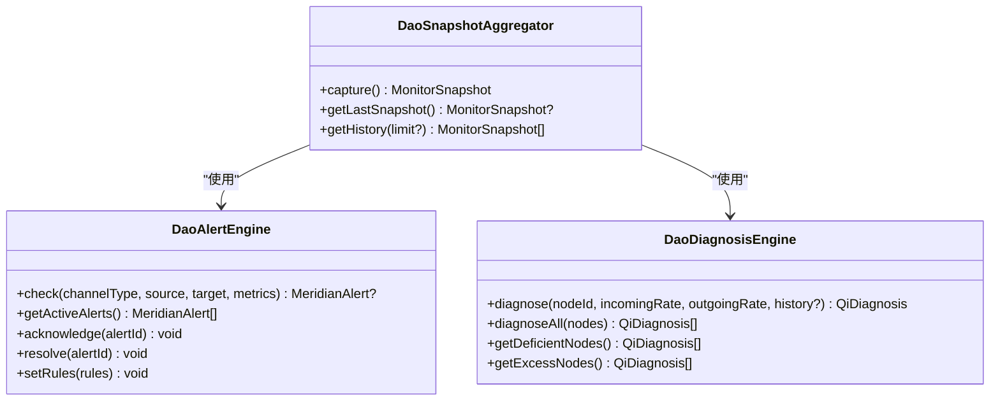
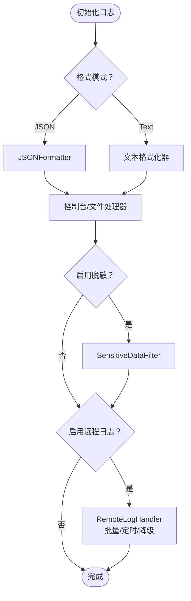
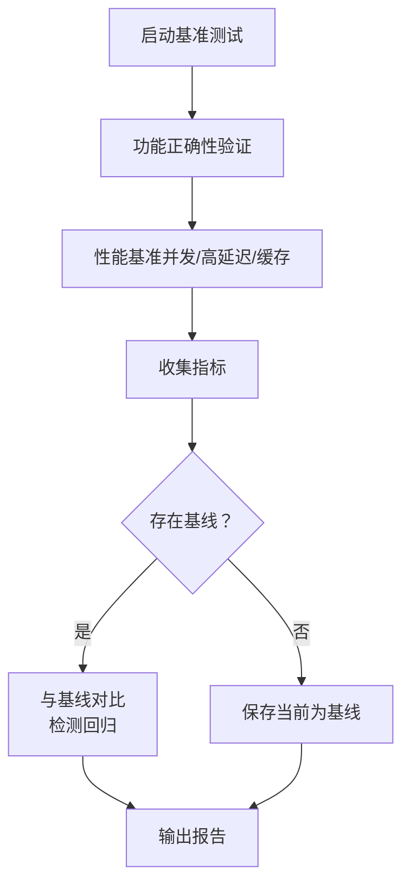
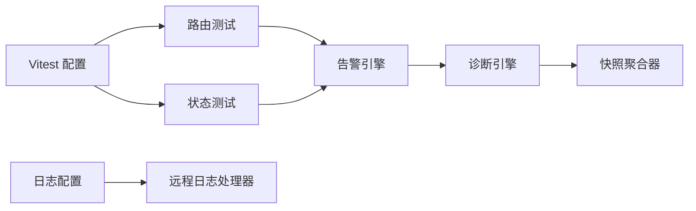
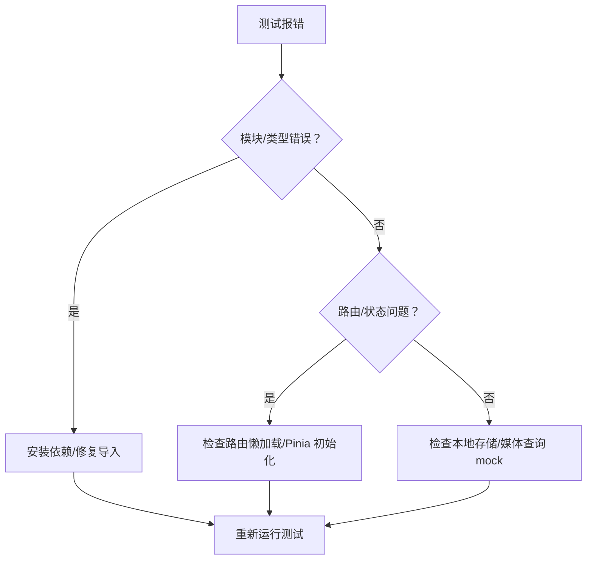

# 调试技巧与故障排除

<cite>
**本文引用的文件**
- [vitest.config.ts（AgentPit）](file://apps/AgentPit/vitest.config.ts)
- [vitest.config.ts（Forum）](file://apps/forum/vitest.config.ts)
- [vitest.config.ts（Config Center）](file://apps/config-center/vitest.config.ts)
- [vitest.config.ts（OAuth Admin）](file://apps/oauth-admin/vitest.config.ts)
- [router-integration.spec.ts](file://apps/AgentPit/src/__tests__/integration/router-integration.spec.ts)
- [state-management.spec.ts](file://apps/AgentPit/src/__tests__/integration/state-management.spec.ts)
- [SettingsComponents.spec.ts](file://apps/AgentPit/src/__tests__/components/settings/SettingsComponents.spec.ts)
- [logging_config.py](file://tools/flexloop/src/taolib/testing/logging_config.py)
- [alerts.ts](file://apps/DaoMind/packages/daoMonitor/src/alerts.ts)
- [diagnosis.ts](file://apps/DaoMind/packages/daoMonitor/src/diagnosis.ts)
- [snapshot.ts](file://apps/DaoMind/packages/daoMonitor/src/snapshot.ts)
- [test-monitor-system.test.ts](file://apps/DaoMind/tests/test-monitor-system.test.ts)
- [memory.ts](file://apps/DaoMind/packages/daoBenchmark/src/suites/memory.ts)
- [stability_test.py](file://tools/DeepResearch/tests/performance/stability_test.py)
- [perf_remote_bench.py](file://tools/flexloop/tests/testing/perf_remote_bench.py)
- [error-codes.md](file://skills/daoSkilLs/skills/task-execution-summary/references/error-codes.md)
- [ts-errors.txt](file://apps/AgentPit/ts-errors.txt)
</cite>

## 目录
1. [简介](#简介)
2. [项目结构](#项目结构)
3. [核心组件](#核心组件)
4. [架构总览](#架构总览)
5. [详细组件分析](#详细组件分析)
6. [依赖分析](#依赖分析)
7. [性能考虑](#性能考虑)
8. [故障排除指南](#故障排除指南)
9. [结论](#结论)
10. [附录](#附录)

## 简介
本指南面向开发者，系统梳理前端与后端调试方法，覆盖浏览器开发者工具、Vue DevTools、React DevTools、单元/集成/端到端测试调试、Python 后端调试、AI 工具与多智能体系统调试，并提供常见问题诊断思路、性能瓶颈分析与内存泄漏检测、日志记录与错误监控等质量保障实践。

## 项目结构
本仓库采用多应用与多工具并存的组织方式：
- 前端应用（Vite + Vue/React）：AgentPit、DaoMind、config-center、forum、oauth-admin 等，均配置了 Vitest 测试与覆盖率。
- Python 工具链：flexloop 提供测试与日志基础设施；DeepResearch 提供 AI/LLM 相关性能与稳定性测试。
- 监控与诊断：DaoMind 的 daoMonitor 包含告警、诊断与快照聚合能力。

章节来源
- [vitest.config.ts（AgentPit）:1-48](file://apps/AgentPit/vitest.config.ts#L1-L48)
- [vitest.config.ts（Forum）:1-40](file://apps/forum/vitest.config.ts#L1-L40)
- [vitest.config.ts（Config Center）:1-17](file://apps/config-center/vitest.config.ts#L1-L17)
- [vitest.config.ts（OAuth Admin）:1-17](file://apps/oauth-admin/vitest.config.ts#L1-L17)

## 核心组件
- 前端测试与调试
  - Vitest 配置与覆盖率：统一 jsdom 环境、全局钩子、别名与覆盖率策略。
  - 组件与路由/状态集成测试：覆盖导航、懒加载、Pinia 状态同步、购物车与钱包逻辑等。
- 监控与诊断系统（DaoMind）
  - 告警引擎：基于规则的阈值告警与活跃告警查询。
  - 诊断引擎：基于入/出流量与趋势的节点健康诊断。
  - 快照聚合器：整合热力图、向量场、仪表盘、告警与诊断，计算系统健康分。
- 日志与远程日志（Python）
  - JSON/文本格式化、敏感数据脱敏、远程日志处理器、优雅降级。
- 性能与稳定性测试
  - 内存基准测试、并发/高延迟压力测试、历史基线对比与回归检测。

章节来源
- [router-integration.spec.ts:1-132](file://apps/AgentPit/src/__tests__/integration/router-integration.spec.ts#L1-L132)
- [state-management.spec.ts:1-279](file://apps/AgentPit/src/__tests__/integration/state-management.spec.ts#L1-L279)
- [alerts.ts:1-122](file://apps/DaoMind/packages/daoMonitor/src/alerts.ts#L1-L122)
- [diagnosis.ts:1-75](file://apps/DaoMind/packages/daoMonitor/src/diagnosis.ts#L1-L75)
- [snapshot.ts:1-76](file://apps/DaoMind/packages/daoMonitor/src/snapshot.ts#L1-L76)
- [logging_config.py:1-540](file://tools/flexloop/src/taolib/testing/logging_config.py#L1-L540)
- [memory.ts:1-70](file://apps/DaoMind/packages/daoBenchmark/src/suites/memory.ts#L1-L70)

## 架构总览
前端应用通过 Vitest 在 jsdom 环境中模拟 DOM，结合 @vue/test-utils 或 @vitejs/plugin-react 进行组件与路由/状态集成测试。监控系统以模块化引擎组合，最终由快照聚合器输出系统健康视图。Python 工具链提供日志与性能测试支撑。

图表来源
- [vitest.config.ts（AgentPit）:1-48](file://apps/AgentPit/vitest.config.ts#L1-L48)
- [router-integration.spec.ts:1-132](file://apps/AgentPit/src/__tests__/integration/router-integration.spec.ts#L1-L132)
- [state-management.spec.ts:1-279](file://apps/AgentPit/src/__tests__/integration/state-management.spec.ts#L1-L279)
- [alerts.ts:1-122](file://apps/DaoMind/packages/daoMonitor/src/alerts.ts#L1-L122)
- [diagnosis.ts:1-75](file://apps/DaoMind/packages/daoMonitor/src/diagnosis.ts#L1-L75)
- [snapshot.ts:1-76](file://apps/DaoMind/packages/daoMonitor/src/snapshot.ts#L1-L76)
- [logging_config.py:256-335](file://tools/flexloop/src/taolib/testing/logging_config.py#L256-L335)
- [memory.ts:1-70](file://apps/DaoMind/packages/daoBenchmark/src/suites/memory.ts#L1-L70)
- [perf_remote_bench.py:605-699](file://tools/flexloop/tests/testing/perf_remote_bench.py#L605-L699)

## 详细组件分析

### 前端测试与调试（Vue/React）
- Vitest 配置要点
  - 环境：jsdom，便于 DOM/路由/Pinia 测试。
  - 别名：统一 @ 指向 src，提升导入一致性。
  - 覆盖率：按目录白名单统计，设定阈值，确保关键代码被覆盖。
  - 报告器与输出：支持文本、HTML、JSON、LCOV 等多种格式。
- 路由集成测试
  - 使用内存历史创建路由器，验证懒加载路由、404 处理、导航守卫对标题的影响。
  - 通过 @vue/test-utils 挂载根组件并断言当前路由路径。
- 状态管理集成测试（Pinia）
  - 覆盖 App/Chat/Monetization/Cart/User Store 的典型行为：侧边栏切换、主题切换、对话生命周期、钱包数据、购物车增删改选、登录登出与资料更新。
- 设置组件测试
  - 通过 window.localStorage、matchMedia 与 document.documentElement 的 mock，隔离浏览器差异，验证设置面板渲染与交互。

图表来源
- [router-integration.spec.ts:30-88](file://apps/AgentPit/src/__tests__/integration/router-integration.spec.ts#L30-L88)

章节来源
- [vitest.config.ts（AgentPit）:1-48](file://apps/AgentPit/vitest.config.ts#L1-L48)
- [vitest.config.ts（Forum）:1-40](file://apps/forum/vitest.config.ts#L1-L40)
- [vitest.config.ts（Config Center）:1-17](file://apps/config-center/vitest.config.ts#L1-L17)
- [vitest.config.ts（OAuth Admin）:1-17](file://apps/oauth-admin/vitest.config.ts#L1-L17)
- [router-integration.spec.ts:1-132](file://apps/AgentPit/src/__tests__/integration/router-integration.spec.ts#L1-L132)
- [state-management.spec.ts:1-279](file://apps/AgentPit/src/__tests__/integration/state-management.spec.ts#L1-L279)
- [SettingsComponents.spec.ts:1-162](file://apps/AgentPit/src/__tests__/components/settings/SettingsComponents.spec.ts#L1-L162)

### 监控与诊断系统（DaoMind）
- 告警引擎
  - 默认规则：拥塞、延迟尖峰、错误率激增等；支持自定义规则。
  - 提供告警检查、活跃告警查询、确认与解决接口。
- 诊断引擎
  - 基于入/出流量与趋势判断节点“不足/过剩/平衡”，并给出建议。
- 快照聚合器
  - 聚合热力图、向量场、仪表盘、告警与诊断，计算系统健康分（综合扣分）。

图表来源
- [alerts.ts:61-121](file://apps/DaoMind/packages/daoMonitor/src/alerts.ts#L61-L121)
- [diagnosis.ts:7-74](file://apps/DaoMind/packages/daoMonitor/src/diagnosis.ts#L7-L74)
- [snapshot.ts:10-75](file://apps/DaoMind/packages/daoMonitor/src/snapshot.ts#L10-L75)

章节来源
- [alerts.ts:1-122](file://apps/DaoMind/packages/daoMonitor/src/alerts.ts#L1-L122)
- [diagnosis.ts:1-75](file://apps/DaoMind/packages/daoMonitor/src/diagnosis.ts#L1-L75)
- [snapshot.ts:1-76](file://apps/DaoMind/packages/daoMonitor/src/snapshot.ts#L1-L76)
- [test-monitor-system.test.ts:1-225](file://apps/DaoMind/tests/test-monitor-system.test.ts#L1-L225)

### 日志记录与错误监控（Python）
- 日志配置
  - 文本/JSON 格式化、控制台与文件输出、远程日志处理器（HTTP 批量发送，带优雅降级）。
  - 敏感数据脱敏：密码、JWT 密钥、API Key、邮箱、手机号、IP 等，支持自定义规则。
- 远程日志
  - 支持批量发送、定时刷新、异常时不阻断应用、自动回填缓冲区。

图表来源
- [logging_config.py:256-335](file://tools/flexloop/src/taolib/testing/logging_config.py#L256-L335)
- [logging_config.py:350-537](file://tools/flexloop/src/taolib/testing/logging_config.py#L350-L537)

章节来源
- [logging_config.py:1-540](file://tools/flexloop/src/taolib/testing/logging_config.py#L1-L540)

### 性能与稳定性测试
- 内存基准测试
  - 测量模块加载前后堆内存增量，评估是否超过目标阈值。
- 并发/高延迟基准测试
  - 通过并发探测、线程安全配置缓存、高延迟探测等指标评估系统鲁棒性。
- 历史基线对比
  - 与历史基线比较，检测性能退化（如超过 10%）并生成报告。

图表来源
- [memory.ts:1-70](file://apps/DaoMind/packages/daoBenchmark/src/suites/memory.ts#L1-L70)
- [perf_remote_bench.py:605-699](file://tools/flexloop/tests/testing/perf_remote_bench.py#L605-L699)
- [stability_test.py:154-201](file://tools/DeepResearch/tests/performance/stability_test.py#L154-L201)

章节来源
- [memory.ts:1-70](file://apps/DaoMind/packages/daoBenchmark/src/suites/memory.ts#L1-L70)
- [perf_remote_bench.py:605-699](file://tools/flexloop/tests/testing/perf_remote_bench.py#L605-L699)
- [stability_test.py:154-201](file://tools/DeepResearch/tests/performance/stability_test.py#L154-L201)

## 依赖分析
- 前端测试依赖
  - jsdom 环境、@vue/test-utils 或 @vitejs/plugin-react、别名与覆盖率配置。
- 监控系统内部依赖
  - 快照聚合器依赖告警与诊断引擎；告警与诊断分别独立维护状态。
- Python 日志与测试依赖
  - httpx（远程日志）、线程锁与定时器（远程日志缓冲）、标准库 logging。

图表来源
- [vitest.config.ts（AgentPit）:1-48](file://apps/AgentPit/vitest.config.ts#L1-L48)
- [alerts.ts:1-122](file://apps/DaoMind/packages/daoMonitor/src/alerts.ts#L1-L122)
- [diagnosis.ts:1-75](file://apps/DaoMind/packages/daoMonitor/src/diagnosis.ts#L1-L75)
- [snapshot.ts:1-76](file://apps/DaoMind/packages/daoMonitor/src/snapshot.ts#L1-L76)
- [logging_config.py:350-537](file://tools/flexloop/src/taolib/testing/logging_config.py#L350-L537)

章节来源
- [vitest.config.ts（AgentPit）:1-48](file://apps/AgentPit/vitest.config.ts#L1-L48)
- [alerts.ts:1-122](file://apps/DaoMind/packages/daoMonitor/src/alerts.ts#L1-L122)
- [diagnosis.ts:1-75](file://apps/DaoMind/packages/daoMonitor/src/diagnosis.ts#L1-L75)
- [snapshot.ts:1-76](file://apps/DaoMind/packages/daoMonitor/src/snapshot.ts#L1-L76)
- [logging_config.py:1-540](file://tools/flexloop/src/taolib/testing/logging_config.py#L1-L540)

## 性能考虑
- 前端测试覆盖率与阈值
  - 通过 Vitest 配置的覆盖率阈值与报告器，确保关键模块（组件、store、composables、utils）被充分覆盖。
- 监控系统健康分
  - 告警与诊断影响系统健康分，应持续关注活跃告警与不平衡仪表盘。
- Python 性能与稳定性
  - 使用内存基准、并发与高延迟测试，结合历史基线对比，及时发现回归。

章节来源
- [vitest.config.ts（AgentPit）:11-35](file://apps/AgentPit/vitest.config.ts#L11-L35)
- [vitest.config.ts（Forum）:9-19](file://apps/forum/vitest.config.ts#L9-L19)
- [snapshot.ts:31-42](file://apps/DaoMind/packages/daoMonitor/src/snapshot.ts#L31-L42)
- [memory.ts:1-70](file://apps/DaoMind/packages/daoBenchmark/src/suites/memory.ts#L1-L70)
- [perf_remote_bench.py:605-699](file://tools/flexloop/tests/testing/perf_remote_bench.py#L605-L699)

## 故障排除指南

### 前端调试与测试问题
- 缺失模块/类型声明
  - 症状：找不到 vitest/@vue/test-utils 或模块声明未找到。
  - 排查：确认 Vitest 插件与环境配置；检查 ts-errors 中的模块缺失提示。
- 类型错误（TS7006/TS2307/TS2532）
  - 症状：隐式 any、模块未找到、对象可能为 undefined。
  - 排查：完善类型注解、安装缺失依赖、修正模块路径与导出。
- 路由与状态集成问题
  - 症状：懒加载路由不生效、Pinia 状态不同步。
  - 排查：确认路由懒加载函数返回值、Pinia 初始化与 setActivePinia 调用。

章节来源
- [ts-errors.txt:20-109](file://apps/AgentPit/ts-errors.txt#L20-L109)
- [router-integration.spec.ts:1-132](file://apps/AgentPit/src/__tests__/integration/router-integration.spec.ts#L1-L132)
- [state-management.spec.ts:1-279](file://apps/AgentPit/src/__tests__/integration/state-management.spec.ts#L1-L279)
- [SettingsComponents.spec.ts:1-162](file://apps/AgentPit/src/__tests__/components/settings/SettingsComponents.spec.ts#L1-L162)

### 监控与诊断问题
- 告警未触发或活跃告警过多
  - 检查规则阈值与输入指标；确认 setRules 是否被正确调用。
- 诊断结果异常
  - 检查入/出流量与历史趋势输入；确认活动评分与趋势计算逻辑。
- 快照健康分异常
  - 检查告警/仪表盘/诊断状态，定位具体扣分来源。

章节来源
- [alerts.ts:118-121](file://apps/DaoMind/packages/daoMonitor/src/alerts.ts#L118-L121)
- [diagnosis.ts:10-55](file://apps/DaoMind/packages/daoMonitor/src/diagnosis.ts#L10-L55)
- [snapshot.ts:31-42](file://apps/DaoMind/packages/daoMonitor/src/snapshot.ts#L31-L42)

### 日志与错误监控问题
- 远程日志发送失败
  - 检查 endpoint、API Key、网络与超时设置；确认优雅降级是否生效。
- 敏感数据未脱敏
  - 检查脱敏开关与自定义规则；确认日志格式为 JSON 时的字段映射。

章节来源
- [logging_config.py:350-537](file://tools/flexloop/src/taolib/testing/logging_config.py#L350-L537)
- [logging_config.py:56-254](file://tools/flexloop/src/taolib/testing/logging_config.py#L56-L254)

### 性能与稳定性问题
- 内存泄漏检测
  - 使用稳定性测试的内存 RSS 趋势分析，若末尾与开头差值超过阈值，判定存在泄漏。
- 回归检测
  - 基线对比超过 10% 视为退化，需进一步定位变更点。

章节来源
- [stability_test.py:154-201](file://tools/DeepResearch/tests/performance/stability_test.py#L154-L201)
- [perf_remote_bench.py:605-699](file://tools/flexloop/tests/testing/perf_remote_bench.py#L605-L699)

### 质量保障实践
- 错误处理与质量门禁
  - 参考任务执行总结中的错误码与处理策略，建立严格模式、自动重试与通知机制。
- 日志规范
  - 统一 JSON 结构、请求 ID、模块/函数/行号、异常信息，便于检索与聚合。

章节来源
- [error-codes.md:1345-1378](file://skills/daoSkilLs/skills/task-execution-summary/references/error-codes.md#L1345-L1378)
- [logging_config.py:21-54](file://tools/flexloop/src/taolib/testing/logging_config.py#L21-L54)

## 结论
本指南从测试配置、监控诊断、日志与性能测试四个维度，提供了可落地的调试与故障排除方法。建议在开发流程中：
- 前端：以 Vitest 为核心，结合路由与状态集成测试，配合覆盖率阈值与 jsdom 环境。
- 监控：以告警与诊断为入口，快照聚合器输出系统健康视图，持续观察活跃告警与不平衡仪表盘。
- 日志：统一 JSON 格式与脱敏策略，必要时启用远程日志并做好降级。
- 性能：建立内存与并发/高延迟基准，定期与基线对比，及时发现回归。

## 附录
- 常用命令与配置参考
  - Vitest 运行与覆盖率：根据各应用的 vitest.config.ts 执行测试与生成报告。
  - 监控系统测试：参考 test-monitor-system.test.ts 的示例用法。
  - 日志配置：参考 logging_config.py 的 configure_logging 与 configure_remote_logging。

章节来源
- [vitest.config.ts（AgentPit）:1-48](file://apps/AgentPit/vitest.config.ts#L1-L48)
- [vitest.config.ts（Forum）:1-40](file://apps/forum/vitest.config.ts#L1-L40)
- [test-monitor-system.test.ts:1-225](file://apps/DaoMind/tests/test-monitor-system.test.ts#L1-L225)
- [logging_config.py:256-335](file://tools/flexloop/src/taolib/testing/logging_config.py#L256-L335)