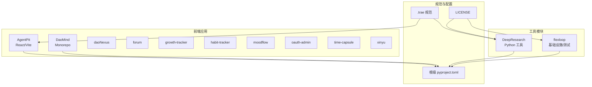
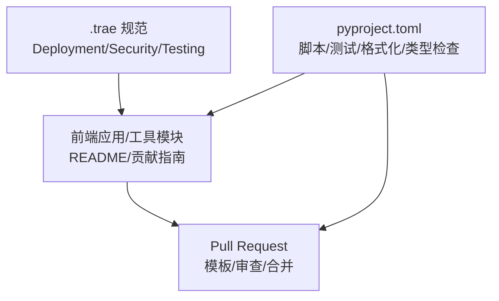
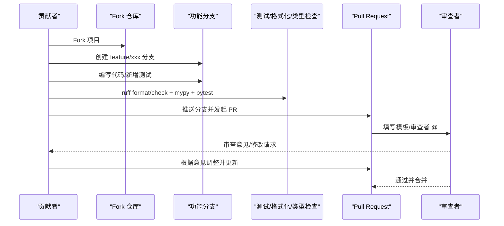
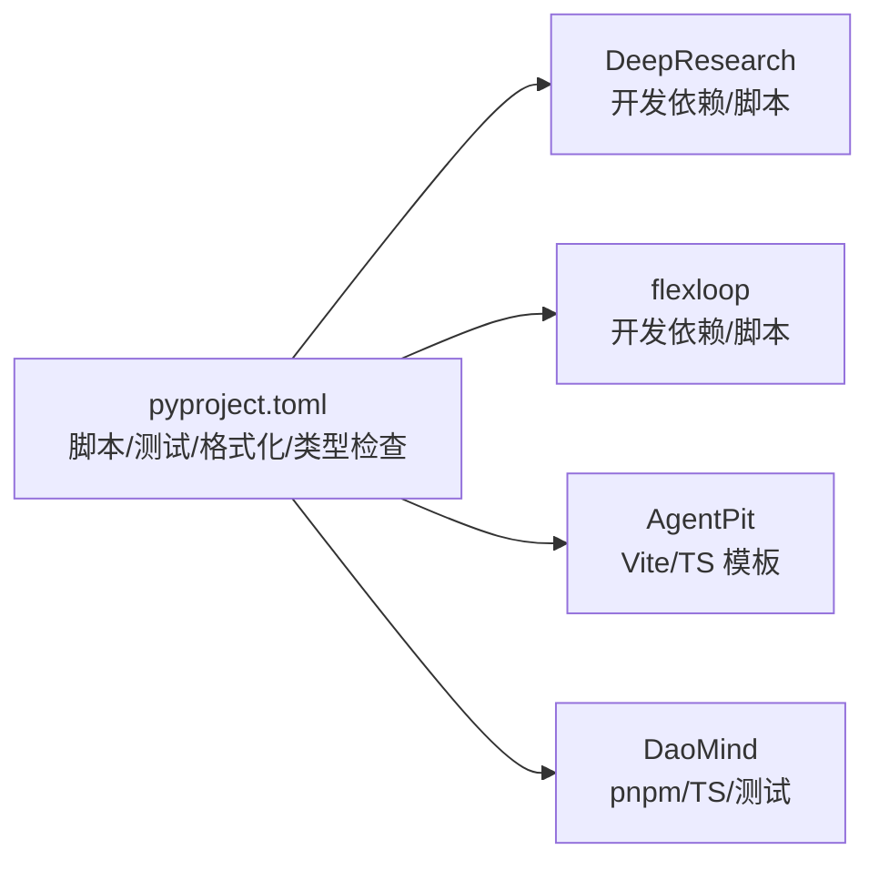

# 贡献指南

<cite>
**本文引用的文件**
- [pyproject.toml](file://pyproject.toml)
- [LICENSE](file://LICENSE)
- [tools/DeepResearch/CONTRIBUTING.md](file://tools/DeepResearch/CONTRIBUTING.md)
- [tools/DeepResearch/.github/PULL_REQUEST_TEMPLATE/pull_request_template.md](file://tools/DeepResearch/.github/PULL_REQUEST_TEMPLATE/pull_request_template.md)
- [tools/DeepResearch/.github/SECURITY.md](file://tools/DeepResearch/.github/SECURITY.md)
- [tools/flexloop/CONTRIBUTING.md](file://tools/flexloop/CONTRIBUTING.md)
- [apps/DaoMind/README.md](file://apps/DaoMind/README.md)
- [apps/AgentPit/README.md](file://apps/AgentPit/README.md)
- [.trae/specs/agentpit-vue3-deployment/spec.md](file://.trae/specs/agentpit-vue3-deployment/spec.md)
</cite>

## 目录
1. [引言](#引言)
2. [项目结构](#项目结构)
3. [核心贡献方式](#核心贡献方式)
4. [架构概览](#架构概览)
5. [详细组件分析](#详细组件分析)
6. [依赖分析](#依赖分析)
7. [性能考虑](#性能考虑)
8. [故障排查指南](#故障排查指南)
9. [结论](#结论)
10. [附录](#附录)

## 引言
本指南面向新贡献者，帮助你快速理解并参与 DAO Apps 生态系统的开发与治理。你将学会如何：
- 参与项目开发、提交 Issue、创建 Pull Request 的完整流程
- 代码贡献、文档改进、测试用例编写的规范与最佳实践
- 项目的治理结构、决策流程、核心维护者的职责
- 新成员快速上手：开发环境搭建、代码熟悉路径、导师制度建议
- 知识产权协议、行为准则、沟通渠道等社区规范

## 项目结构
DAO Apps 采用多应用与多工具并存的混合结构，包含前端应用（React/Vite、Vue 3）、Monorepo 工具链（Python 生态）以及文档与规范仓库。关键组成如下：
- 前端应用：AgentPit、DaoMind、Nexus、Forum、Growth Tracker、Habit Tracker、Moodflow、OAuth Admin、Time Capsule、Xinyu 等
- 工具模块：DeepResearch（Python 研究工具）、flexloop（基础设施与测试工具）
- 规范与部署：.trae 规范仓库（如 Vue3 部署规范）
- 根级工程配置：pyproject.toml（统一脚本、测试、格式化、类型检查）

图表来源
- [pyproject.toml](file://pyproject.toml)
- [apps/AgentPit/README.md](file://apps/AgentPit/README.md)
- [apps/DaoMind/README.md](file://apps/DaoMind/README.md)
- [tools/DeepResearch/CONTRIBUTING.md](file://tools/DeepResearch/CONTRIBUTING.md)
- [tools/flexloop/CONTRIBUTING.md](file://tools/flexloop/CONTRIBUTING.md)
- [.trae/specs/agentpit-vue3-deployment/spec.md](file://.trae/specs/agentpit-vue3-deployment/spec.md)

章节来源
- [pyproject.toml](file://pyproject.toml)
- [apps/AgentPit/README.md](file://apps/AgentPit/README.md)
- [apps/DaoMind/README.md](file://apps/DaoMind/README.md)
- [.trae/specs/agentpit-vue3-deployment/spec.md](file://.trae/specs/agentpit-vue3-deployment/spec.md)

## 核心贡献方式
你可以通过以下多种方式参与项目：
- 代码贡献：修复缺陷、新增功能、性能优化、重构
- 文档改进：完善 README、API 文档、架构说明、使用指南
- 测试用例：新增单元测试、集成测试、端到端测试
- 社区支持：回答问题、审阅 PR、维护讨论区
- 规范与流程：参与 .trae 规范制定、CI/CD 改进、部署策略优化

贡献流程（通用步骤）：
1) Fork 项目至个人仓库
2) 创建功能分支（feature/xxx）
3) 提交代码并遵循格式化与类型检查
4) 运行测试并通过覆盖率检查
5) 推送分支并发起 Pull Request
6) 填写 PR 模板，等待审查与合并

章节来源
- [tools/DeepResearch/CONTRIBUTING.md](file://tools/DeepResearch/CONTRIBUTING.md)
- [tools/DeepResearch/.github/PULL_REQUEST_TEMPLATE/pull_request_template.md](file://tools/DeepResearch/.github/PULL_REQUEST_TEMPLATE/pull_request_template.md)

## 架构概览
从治理与协作角度，DAO Apps 的贡献流程由“规范—工具—应用”三层构成：
- 规范层：.trae 规范仓库定义开发、测试、部署、安全等标准
- 工具层：pyproject.toml 统一脚本与质量门禁；DeepResearch/flexloop 提供开发与测试工具
- 应用层：各前端应用与工具模块按各自 README 与贡献指南执行

图表来源
- [.trae/specs/agentpit-vue3-deployment/spec.md](file://.trae/specs/agentpit-vue3-deployment/spec.md)
- [pyproject.toml](file://pyproject.toml)
- [tools/DeepResearch/.github/PULL_REQUEST_TEMPLATE/pull_request_template.md](file://tools/DeepResearch/.github/PULL_REQUEST_TEMPLATE/pull_request_template.md)

## 详细组件分析

### 代码贡献流程（Python 工具：DeepResearch）
- 环境要求与安装：使用 Python 3.14+，推荐虚拟环境；通过可编辑安装引入开发依赖
- 开发流程：创建分支、遵循 PEP 8 与注释规范、新增测试、运行格式化与类型检查
- 提交与审查：填写 PR 模板、确保测试通过、文档同步更新、@reviewer 指定审查者

图表来源
- [tools/DeepResearch/CONTRIBUTING.md](file://tools/DeepResearch/CONTRIBUTING.md)
- [tools/DeepResearch/.github/PULL_REQUEST_TEMPLATE/pull_request_template.md](file://tools/DeepResearch/.github/PULL_REQUEST_TEMPLATE/pull_request_template.md)
- [pyproject.toml](file://pyproject.toml)

章节来源
- [tools/DeepResearch/CONTRIBUTING.md](file://tools/DeepResearch/CONTRIBUTING.md)
- [tools/DeepResearch/.github/PULL_REQUEST_TEMPLATE/pull_request_template.md](file://tools/DeepResearch/.github/PULL_REQUEST_TEMPLATE/pull_request_template.md)
- [pyproject.toml](file://pyproject.toml)

### 文档改进与测试用例编写
- 文档改进：更新 README、API 文档、使用示例、常见问题；确保与代码一致
- 测试用例：为新增功能补充单元测试与集成测试；保持覆盖率达标
- 质量门禁：遵循根级脚本（lint/format/type-check/test-cov），确保 PR 通过自动化检查

章节来源
- [pyproject.toml](file://pyproject.toml)
- [apps/DaoMind/README.md](file://apps/DaoMind/README.md)

### 前端应用贡献（以 AgentPit 为例）
- 项目模板：Vue 3 + TypeScript + Vite，推荐使用 SFC 与 TypeScript
- 快速上手：参考应用 README 的模板说明与 IDE 支持链接
- 规范与部署：.trae 规范中包含多阶段 Docker 构建与环境变量管理要求

章节来源
- [apps/AgentPit/README.md](file://apps/AgentPit/README.md)
- [.trae/specs/agentpit-vue3-deployment/spec.md](file://.trae/specs/agentpit-vue3-deployment/spec.md)

### Monorepo 工具贡献（DaoMind）
- 环境要求：Node.js 18+、TypeScript 6+、pnpm 6+
- 安装与验证：pnpm install、类型检查、测试运行
- 贡献流程：Fork → 分支 → 提交 → 推送 → PR；遵循 ESLint/Prettier 与测试要求

章节来源
- [apps/DaoMind/README.md](file://apps/DaoMind/README.md)

### 安全与负责任披露
- 报告渠道：优先使用 GitHub Security Advisories；备选邮件
- 响应时间：24 小时内确认、72 小时内初评、7 天内提供修复计划
- 最佳实践：依赖更新、密钥管理、类型检查与代码质量工具

章节来源
- [tools/DeepResearch/.github/SECURITY.md](file://tools/DeepResearch/.github/SECURITY.md)

## 依赖分析
- 根级配置统一了脚本、测试、格式化与类型检查，确保跨模块一致性
- 工具模块（DeepResearch/flexloop）通过 pyproject.toml 的 dev 依赖与脚本集中管理
- 前端应用遵循各自 README 的依赖与脚本约定

图表来源
- [pyproject.toml](file://pyproject.toml)
- [apps/AgentPit/README.md](file://apps/AgentPit/README.md)
- [apps/DaoMind/README.md](file://apps/DaoMind/README.md)

章节来源
- [pyproject.toml](file://pyproject.toml)
- [apps/AgentPit/README.md](file://apps/AgentPit/README.md)
- [apps/DaoMind/README.md](file://apps/DaoMind/README.md)

## 性能考虑
- 代码质量：通过 ruff/mypy/pyright 等工具在本地与 CI 中强制执行
- 测试覆盖率：根级配置设置覆盖率阈值与忽略规则，确保关键路径受测
- 构建与部署：.trae 规范提供多阶段构建与镜像体积控制建议，减少运行时开销

章节来源
- [pyproject.toml](file://pyproject.toml)
- [.trae/specs/agentpit-vue3-deployment/spec.md](file://.trae/specs/agentpit-vue3-deployment/spec.md)

## 故障排查指南
- 环境问题
  - Python：确认版本满足要求，使用虚拟环境；参考工具模块贡献指南中的环境准备步骤
  - Node/TypeScript：检查版本与 pnpm 安装，运行类型检查与测试验证
- 依赖安装失败
  - 清理缓存、更换源、检查网络；参考 DaoMind README 的常见问题
- 构建失败
  - 运行类型检查与 lint，修正错误后再尝试构建
- 测试失败
  - 查看测试输出与覆盖率报告，定位失败用例并修复
- 安全问题
  - 按安全政策通过安全通告或邮件上报，避免公开披露细节

章节来源
- [tools/DeepResearch/CONTRIBUTING.md](file://tools/DeepResearch/CONTRIBUTING.md)
- [apps/DaoMind/README.md](file://apps/DaoMind/README.md)
- [tools/DeepResearch/.github/SECURITY.md](file://tools/DeepResearch/.github/SECURITY.md)

## 结论
DAO Apps 的贡献体系以“规范—工具—应用”协同推进，强调质量门禁、测试驱动与安全披露。新贡献者可通过本指南快速完成环境搭建、理解贡献流程，并在合适的模块中开始第一次贡献。

## 附录

### 新成员快速上手清单
- 环境准备
  - Python：3.14+，虚拟环境，安装开发依赖
  - Node/TypeScript：按应用 README 要求准备
- 选择模块
  - 从前端应用（AgentPit/DaoMind 等）或工具模块（DeepResearch/flexloop）中挑选感兴趣的方向
- 阅读文档
  - 对应 README 与贡献指南；参考 .trae 规范中的部署与安全要求
- 第一次 PR
  - Fork → 分支 → 修改 → 本地测试与格式化 → 提交 PR → 跟进审查意见

章节来源
- [apps/AgentPit/README.md](file://apps/AgentPit/README.md)
- [apps/DaoMind/README.md](file://apps/DaoMind/README.md)
- [tools/DeepResearch/CONTRIBUTING.md](file://tools/DeepResearch/CONTRIBUTING.md)
- [.trae/specs/agentpit-vue3-deployment/spec.md](file://.trae/specs/agentpit-vue3-deployment/spec.md)

### 治理结构与决策流程（建议）
- 核心维护者职责
  - 审查 PR、维护规范、协调跨模块依赖、发布与安全响应
- 决策流程
  - 小变更：维护者直接审查合并
  - 大变更：在议题中讨论，达成共识后实施
- 沟通渠道
  - Issues 讨论、PR 审查、社区频道（建议明确）

（本节为概念性说明，不直接分析具体文件）

### 知识产权与许可
- 许可证：Apache 2.0
- 贡献即默认同意以相同许可证发布

章节来源
- [LICENSE](file://LICENSE)